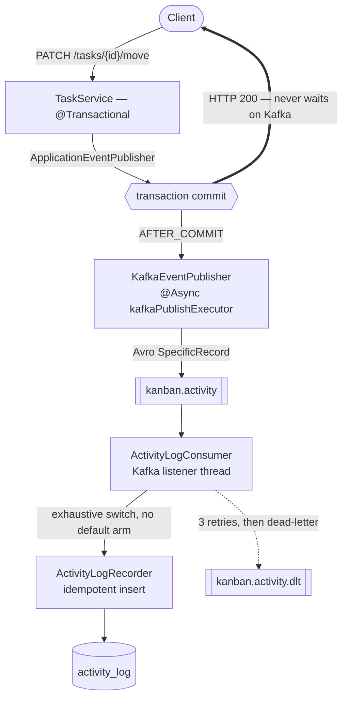

# Kanban Board — Backend

REST API for a kanban board (`user → board → column → task → subtask`) with session-based
authentication and ownership-based access control: a user can only reach resources that chain back
to their own account.

It started as a way to go past what CRUD tutorials cover, and the parts worth reading now are the
ones that aren't CRUD — concurrent-edit handling, an event-driven activity feed with real failure
paths, and Avro schema governance in front of the topic. Every claim below names the class, Gradle
task, or test that proves it.

## Stack

| Concern | Choice |
|---|---|
| Language / runtime | Java 21, Gradle 8.11.1 (wrapper) |
| Framework | Spring Boot 3.5.0 — Web, Data JPA, Security, Validation |
| Persistence | PostgreSQL + Hibernate; Flyway for schema history; H2 for the test profile |
| Sessions | Spring Session JDBC (server-side session state in Postgres) |
| Messaging | Spring Kafka against Redpanda; Apache Avro 1.12 + Confluent Schema Registry |
| Mapping | MapStruct 1.5.3 (compile-time generated, no reflection) |
| Ids | ULID via `ulid-creator`, generated in-app by `RandFlakeGenerator` |
| Docs | springdoc-openapi 2.8.8 |
| Testing | JUnit 5, REST Assured, Testcontainers (Redpanda), ArchUnit |
| Build gates | Spotless (google-java-format AOSP), ErrorProne |

## Architecture

Layered — controller → service → repository — with the layering enforced by a build-failing
ArchUnit rule rather than by convention (see [Testing](#testing)).

- **Ownership verification is its own service.** `OwnershipVerifierService` walks
  subtask → task → column → board → user in one place, so "may this user touch this resource?" is
  answered once instead of being re-implemented per controller. Domain services load entities
  through their own ownership-verified `findById(userId, id)`, never a bare `repository.findById`.
- **Controllers carry no business logic.** `@PreAuthorize("isAuthenticated()")` at class level, a
  custom `@CurrentUserId` argument resolver injecting the authenticated user id from the security
  context, `@Valid` DTOs in, `ResponseEntity<DTO>` out. Exceptions propagate to a single
  `GlobalExceptionHandler` that owns the exception → HTTP status mapping.
- **MapStruct for entity ↔ DTO.** Generated at compile time, so mapping mistakes are compile
  errors and the service layer stays free of mapping boilerplate.
- **Shared base interfaces** (`BaseBoard`, `BaseTask`, …) tie each DTO to the entity shape it
  mirrors, which is what keeps four near-identical resource hierarchies from drifting apart.
- **Sessions are server-side and shared.** Spring Session JDBC puts session state in Postgres, so a
  restart or a second instance doesn't discard logins. The two-concurrent-session ceiling is
  enforced by a `SpringSessionBackedSessionRegistry` reading live rows from that same store — so it
  holds across instances rather than relying on per-instance bookkeeping — and the session id
  rotates on every successful authentication. Both are proven by `SessionPersistenceE2ETest`.

## Concurrency: optimistic locking

Two users dragging the same task at once is the realistic conflict in a kanban board, so writes on
`TaskEntity` and `ColumnEntity` are version-checked rather than last-write-wins.

- `@Version` on both entities, surfaced through the response DTOs; `UpdateTaskRequestDTO`,
  `MoveTaskRequestDTO` and `UpdateColumnRequestDTO` require the client to send back the version it
  read — a missing one is a 400, not a silent overwrite.
- The services also perform an **explicit** version comparison in addition to `@Version`. Hibernate's
  own check only catches a conflict between load and flush *within one transaction* — a
  load-then-modify-then-save request that reads a row someone already updated would otherwise write
  cleanly over it, because the entity it loaded is current by the time it flushes. The explicit
  check is what turns a stale client read into a conflict.
- `OptimisticLockingFailureException` maps to **HTTP 409** in `GlobalExceptionHandler`.
- Proven end-to-end by `TaskLockingE2ETest` and `ColumnLockingE2ETest`, which drive two conflicting
  updates from the same read version over real HTTP and assert the second gets a 409.

## Event-driven activity feed

Board/column/task mutations produce a durable, per-board activity log — built as an event pipeline
rather than an audit-row write in the request path, so recording history cannot slow down or fail
the mutation that caused it.

Services publish one of five records implementing the sealed `ActivityEvent` interface through
Spring's `ApplicationEventPublisher`. `KafkaEventPublisher` — the only class in `src/main` that
touches the Kafka client API — picks them up on `@TransactionalEventListener(AFTER_COMMIT)`, so
nothing is ever published for a transaction that rolled back.

### Process View — path of a mutation



*Process view only, per [docs/DIAGRAM_CONVENTIONS.md](docs/DIAGRAM_CONVENTIONS.md) — it shows
runtime communication, not deployment topology.*

The failure-path decisions are the substance here:

- **The request never waits on the broker.** The after-commit listener is `@Async` on a dedicated
  `kafkaPublishExecutor` pool, because `KafkaTemplate.send()` blocks the calling thread inside
  `waitOnMetadata` even before it returns a future. Producer timeouts (`max.block.ms`,
  `request.timeout.ms`, `delivery.timeout.ms`) are bounded at 2s rather than left at the 60s
  default, so an unreachable broker can't turn into a self-inflicted request hang. A failed send is
  logged, never swallowed — the mutation itself already succeeded and returned.
- **A new event type is a compile error.** `ActivityLogConsumer` switches exhaustively over the
  sealed interface with no `default` arm, so adding a sixth event record fails the build until the
  consumer handles it, instead of being silently absorbed at runtime.
- **Redelivery is absorbed, not retried.** `ActivityLogRecorder` takes an `existsByEventId` fast
  path, and backstops the narrow race between that check and the insert by catching
  `DataIntegrityViolationException` — but only absorbs it after re-confirming the row is actually
  present under that `eventId`. A constraint violation from anything else (a `NOT NULL` on a
  malformed event) is rethrown so it reaches the retry path instead of vanishing.
- **Poison messages are isolated with their bytes intact.** `DefaultErrorHandler` retries three
  times at 1s, then dead-letters to `kanban.activity.dlt`. The dead-letter path uses its own
  byte-preserving `KafkaTemplate` — routing a raw `byte[]` payload through the application's normal
  template would base64-encode the exact artifact an operator needs to inspect.

## Schema governance

The five event types are governed by explicit, versioned Avro schemas, because an event topic
without one is a distributed-systems liability the moment a producer and consumer deploy apart.

- Five `.avsc` files under `src/main/avro/` are the source of truth, compiled to `SpecificRecord`
  classes by the Gradle Avro plugin. A mapping layer (`ActivityEventAvroMapper`) converts to and
  from the domain records, so the sealed interface and exhaustive switch above are unaffected by
  the wire format.
- **Producers can't register schemas.** `auto.register.schemas=false`; the only sanctioned writer is
  the `registerSchemas` Gradle task (`AvroSchemaRegistrar`). A drifted producer fails loudly instead
  of quietly registering an unreviewed schema version.
- `RecordNameStrategy` subjects the schema by record name rather than topic, which is what lets all
  five event types coexist as five independently-versioned subjects on one topic.
- **BACKWARD compatibility is enforced, not assumed** — `SchemaCompatibilityE2ETest` proves the
  registry actually *rejects* an incompatible change, rather than asserting a config value.
- Failure paths carry their own tests: `SchemaRegistryOutageE2ETest` (a mutation survives a registry
  outage), `ActivityLogAvroDeadLetterE2ETest` (byte fidelity through the DLT under Avro framing),
  and a rehearsal task that round-trips real historical `activity_log` rows through the new schemas
  before any cutover (`rehearseHistoricalSchemas`).

## Schema management

Flyway owns the domain schema: `V1__init` → `V2__add_optimistic_locking_version_columns` →
`V3__add_activity_log` → `V4__add_password_hash_not_null`. The history deliberately reconstructs how
the schema actually evolved rather than collapsing it into one snapshot, so a migration replay
matches the real sequence.

Outside the test profile, `spring.jpa.hibernate.ddl-auto=validate` — Hibernate is not allowed to
create or alter anything. Flyway builds the schema, Hibernate only checks that the entity mappings
agree with it, and a mismatch is a loud startup failure instead of a silent auto-alter. The test
profile stays on `create-drop` against H2, with Flyway disabled.

## Testing

208 test methods across 31 classes, split by what each layer can actually prove:

| Category | Scope | Why |
|---|---|---|
| Unit | Services, DTO validation | Where the logic and the constraints live |
| Integration (REST Assured) | Controllers | Routing, validation, and auth need a real request to be proven |
| E2E (Testcontainers + Redpanda) | Kafka pipeline, locking, sessions | Broker/registry behaviour and races can't be mocked honestly |
| Architecture (ArchUnit) | The whole class graph | Turns two review-only conventions into build failures |

Entities and repositories are deliberately untested — they carry no custom logic.

**`LayeringArchTest`** enforces that controllers never reach past the service layer into
repositories, and that domain services load entities only through the ownership-verified
`findById`. It's scoped as a floor, not a ceiling, and says so in its own Javadoc.

**Query-count regression tests** measure Hibernate's `Statistics.getPrepareStatementCount()` —
not `getQueryExecutionCount()`, which only counts HQL/JPQL and silently misses `findById()`. That
distinction is what made the N+1 work measurable rather than speculative:

- `TaskService.deleteAllByColumnId` measured **33 queries for 8 tasks** (scaling with task count),
  now **4 regardless of count** — a `@Modifying` bulk JPQL delete for subtasks, then
  `deleteAllByIdInBatch`, then `flush()`/`clear()` because bulk JPQL bypasses the persistence
  context and leaves stale managed entities behind.
- The ownership chain, suspected of being N+1, measured at **1 query** — the EAGER parent chain is
  joined into a single statement and the redundant `findById` calls hit the L1 cache. No code
  changed; a regression guard test was added and two stale "TODO: optimize" comments were deleted
  because they no longer described a real problem.

## Build quality gates

- **Spotless** — google-java-format (AOSP), enforced by `./gradlew spotlessCheck` in CI and applied
  automatically by the pre-commit hook.
- **ErrorProne** — compile-time bug detection (null derefs, ignored futures, locale-dependent
  string ops) running as a javac plugin, so it's on every build path including the Docker build.
  Generated sources (MapStruct, Avro) are excluded — nobody can act on a finding there. Test
  sources are held *stricter* than main: five named checks are promoted to ERROR after a 27-finding
  backlog was triaged to zero. Both the plugin and analyzer are pinned exactly, so an upstream
  release can't red the build on its own.
- **`fastTest`** — the full suite minus the Testcontainers-backed classes, so the pre-commit hook
  gets a real gate (ArchUnit and every unit/service test) without paying container startup on each
  commit. CI still runs everything.
- **Git hooks bootstrap on clone** — `core.hooksPath` is wired to the version-controlled
  `.githooks/` at Gradle configuration time, so a fresh checkout is armed with no manual setup step.
  It never fails the build and writes only when the value is wrong.

Judgement-level rules that a formatter can't check live in
[docs/CODE_STYLE.md](docs/CODE_STYLE.md); operational lessons from past sessions in
[docs/SESSION_LESSONS.md](docs/SESSION_LESSONS.md).

## API

All routes sit under the `/api` context path and require an authenticated session except signup and
signin. Child resources are created by `POST`ing to their parent.

| Method | Path | Notes |
|---|---|---|
| `POST` | `/signup` · `/signin` · `/logout` | Session cookie; max 2 concurrent sessions per user |
| `GET` | `/boards` | Boards owned by the caller |
| `PUT` `DELETE` | `/boards/{boardId}` | Delete cascades to columns, tasks, subtasks |
| `GET` | `/boards/{boardId}/columns` | |
| `POST` | `/boards/{boardId}/columns` | Create a column |
| `PUT` | `/boards/{boardId}/columns/{columnId}` | Requires the current `version` |
| `POST` | `/boards/{boardId}/columns/{columnId}` | Create a task in the column |
| `GET` | `…/columns/{columnId}/tasks` | |
| `PUT` `DELETE` | `…/columns/{columnId}/tasks/{taskId}` | `PUT` requires the current `version` |
| `PATCH` | `/tasks/{taskId}/move` | Cross-column move; requires the current `version` |
| `GET` `POST` | `…/tasks/{taskId}/subtasks` | |
| `PUT` `DELETE` | `…/tasks/{taskId}/subtasks/{subtaskId}` | |
| `GET` | `/boards/{boardId}/activity` | Paginated feed — default 20, capped at 100 |

Two gaps worth naming rather than hiding: board creation exists as
`UserService.addBoardByUserId` but is not exposed over HTTP yet (only tests reach it), and columns
have no delete route — the cascade is only reachable by deleting the board.

## Running it locally

```bash
cp .env.example .env
docker compose up
```

Brings up Postgres, a single-node Redpanda (broker plus its built-in Schema Registry), and the app.
The app container waits on Redpanda's `rpk cluster health` check rather than a bare TCP probe, so it
doesn't start against a broker that merely accepts connections. Postgres is published on host port
**5433**, not 5432 — a pre-existing native Postgres install otherwise answers connections meant for
the container, and the symptom is an auth failure rather than connection-refused.

```bash
./gradlew test
```

Runs everything. The E2E classes need Docker for their Testcontainers Redpanda instance. For a
faster loop without containers:

```bash
./gradlew fastTest
```

Full runbook, including the compose file's local-dev-only scope, in
[docs/LOCAL_DEV.md](docs/LOCAL_DEV.md).

## Current status

Shipped: optimistic locking (v1.0), the Kafka activity feed (v1.1), Avro Schema Registry governance
and the Flyway migration history (v1.2, phases 4 and 4.1).

**In flight — the deployment target.** This ran on AWS EC2 until the host was deliberately torn down
on cost grounds; the replacement is an Oracle Cloud Always Free A1 instance with Neon serverless
Postgres, a resource-capped Redpanda, and Caddy terminating TLS. Until that lands, the GitHub
Actions pipeline runs the test suite and `spotlessCheck`, then builds and pushes a tagged Docker
image — the deploy job is explicitly disabled rather than left to fail against a host that no longer
exists, and it needs a rewrite (not a re-enable) for the new target.

Not done, deliberately: no rate limiting on the auth endpoints, no refresh-token-style session
renewal (sessions are fixed-duration), and no caching layer. The full modernization plan and its
remaining epics are in [docs/plans/backend-modernization/](docs/plans/backend-modernization/).
