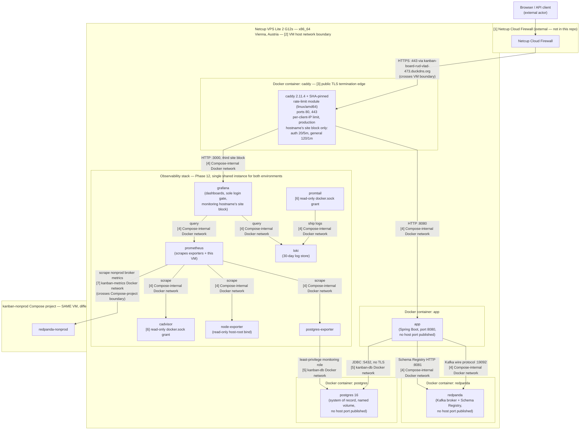

# Kanban Board — Backend

REST API for a kanban board (`user → board → column → task → subtask`) with session-based
authentication and ownership-based access control: a user can only reach resources that chain back
to their own account.

## What this is

A Spring Boot 3.5.16 / Java 21 backend that has been through two production infrastructure
migrations and a real CI/CD hardening pass, not just a CRUD API against a local database. The parts
worth reading past the routes are the ones that aren't CRUD — concurrent-edit handling, an
event-driven activity feed with real failure paths, Avro schema governance in front of the topic,
and a delivery pipeline that ships to a real VPS with an isolated nonprod environment ahead of every
change to production.

## Engineering highlights

Detail and reasoning for each of these is in [docs/ARCHITECTURE.md](docs/ARCHITECTURE.md).

- **Optimistic locking** — concurrent edits to the same board, column, task or subtask return
  **409** instead of silently overwriting →
  [how](docs/ARCHITECTURE.md#concurrency-optimistic-locking)
- **Activity feed publishes after commit, off the request thread** — so recording history can never
  slow down or fail the mutation that caused it, and poison messages retry then dead-letter →
  [how](docs/ARCHITECTURE.md#event-driven-activity-feed)
- **Avro schemas with enforced BACKWARD compatibility** — registration is owned by a Gradle task,
  not the producer, and a test proves the registry actually rejects an incompatible change →
  [how](docs/ARCHITECTURE.md#schema-governance)
- **Layering enforced by ArchUnit, not code review** — controllers reaching into repositories, or a
  service skipping the ownership-verified loader, fail the build →
  [how](docs/ARCHITECTURE.md#testing)
- **N+1 fixed by measurement, not guesswork** — a bulk delete went from 33 queries for 8 tasks to 4
  regardless of count, with a query-count regression test holding it there →
  [how](docs/ARCHITECTURE.md#testing)

## Live

<!-- TODO: replace with a short screen recording (GIF or embedded video) of the Grafana
     dashboards under real/synthetic traffic -->

_A short recording of the live Grafana dashboards is coming here._

- [ ] [Network & OS](https://kanban-board-rud-vlad-473-monitoring.duckdns.org/public-dashboards/7db62007a2114c988c21c4cf6eac9776)
- [ ] [CPU & Memory metrics](https://kanban-board-rud-vlad-473-monitoring.duckdns.org/public-dashboards/5a72e5df7fd54618ae28972cabcd8846)

## Local development

```bash
cp .env.example .env
docker compose up
```

Brings up Postgres, a single-node Redpanda (broker plus its built-in Schema Registry), and the app,
which waits on the broker's `rpk cluster health` check rather than a bare TCP probe. Postgres is
published on host port **5433** so a pre-existing native install can't silently answer connections
meant for the container. Full runbook: [docs/LOCAL_DEV.md](docs/LOCAL_DEV.md).

```bash
./gradlew test      # everything; Docker required — every test boots a Testcontainers Postgres
./gradlew fastTest  # same suite minus the Kafka-backed *E2ETest classes; still needs Docker
```

## Stack

| Concern            | Choice                                                                                            | Why                                                                                                                                                                                                                            |
| ------------------ | ------------------------------------------------------------------------------------------------- | ------------------------------------------------------------------------------------------------------------------------------------------------------------------------------------------------------------------------------ |
| Language / runtime | Java 21, Gradle 8.11.1 (wrapper)                                                                  | Wrapper distribution is checksum-pinned (`distributionSha256Sum`), so a compromised or retargeted distribution is refused, not silently used. Compile-time checks add Error Prone (bug patterns) alongside the compiler itself |
| Framework          | Spring Boot 3.5.16 — Web, Data JPA, Security, Validation                                          | Kept deliberately conventional so the actually distinguishing work (locking, events, schema governance) stays legible against a familiar baseline                                                                              |
| Persistence        | PostgreSQL + Hibernate; Flyway for schema history; Testcontainers PostgreSQL for the test profile | Every test runs against the same Flyway migrations production does — not H2 standing in for Postgres                                                                                                                           |
| Sessions           | Spring Session JDBC (server-side session state in Postgres)                                       | A restart or a second instance doesn't discard logins; the concurrent-session ceiling reads live from the same store instead of per-instance bookkeeping                                                                       |
| Messaging          | Spring Kafka against Redpanda; Apache Avro 1.12 + Confluent Schema Registry                       | BACKWARD compatibility is enforced by the registry itself and proven by a test that shows it actually rejects a bad change, not assumed from config                                                                            |
| Mapping            | MapStruct 1.5.3 (compile-time generated, no reflection)                                           | A broken mapping is a compile error, not a runtime surprise                                                                                                                                                                    |
| Ids                | ULID via `ulid-creator`, generated in-app by `RandFlakeGenerator`                                 | Sortable by creation time without a database round-trip, unlike a random UUID                                                                                                                                                  |
| Docs               | springdoc-openapi 2.8.8                                                                           | Generates the published OpenAPI contract from the same annotations that already validate requests, including the shared `ProblemDetail` error envelope                                                                         |
| Testing            | JUnit 5, REST Assured, Testcontainers (Redpanda), ArchUnit                                        | Layering and ownership-loading rules fail the build directly — ArchUnit turns a review convention into a compile-time-adjacent check                                                                                           |
| Build gates        | Spotless (google-java-format AOSP), ErrorProne                                                    | Both pinned to exact versions, so a formatter or analyzer release upstream can't red an unchanged commit                                                                                                                       |

## Testing

424 test methods (`@Test`/`@ParameterizedTest`-annotated, counted directly from `src/test/java` —
re-derived 2026-08-19, not carried over from a prior count): unit tests for services and DTO
validation, REST Assured/MockMvc integration tests for controllers, Testcontainers-backed E2E tests
for the Kafka pipeline and real-socket concurrency, dedicated `security/` classes for injection
resistance and auth gating, and ArchUnit rules over the whole class graph. Every test — not just the
Kafka/real-socket-tagged classes — runs against a real PostgreSQL 16 instance via Testcontainers,
whose schema is built by the same Flyway migrations production runs, so Docker is required for
`./gradlew test`. Entities and repositories are deliberately untested — they carry no custom logic.
Full breakdown in [docs/ARCHITECTURE.md](docs/ARCHITECTURE.md#testing).

## API

All routes sit under the `/api` context path and require an authenticated session except signup and
signin. Child resources are created by `POST`ing to their parent.

| Method         | Path                                           | Notes                                                                                                                                                                  |
| -------------- | ---------------------------------------------- | ---------------------------------------------------------------------------------------------------------------------------------------------------------------------- |
| `POST`         | `/signup` · `/signin` · `/logout`              | Session cookie; max 2 concurrent sessions per user. `/signup`/`/signin` also return the caller's identity (`id`, `email`, `displayName`, `theme`) in the response body |
| `GET` `POST`   | `/boards`                                      | `GET` lists boards owned by the caller; `POST` creates one — `201` with a `Location` header, and the name must be unique for that user                                 |
| `PUT` `DELETE` | `/boards/{boardId}`                            | `PUT` requires the current `version`; delete cascades to columns, tasks, subtasks                                                                                      |
| `GET`          | `/boards/{boardId}/full`                       | The board with its columns, each column with its tasks, and each task with its subtasks, in one nested document; carries the board's own `version`                     |
| `GET`          | `/boards/{boardId}/columns`                    |                                                                                                                                                                        |
| `POST`         | `/boards/{boardId}/columns`                    | Create a column                                                                                                                                                        |
| `PUT` `DELETE` | `/boards/{boardId}/columns/{columnId}`         | `PUT` requires the current `version`; `DELETE` cascades to the column's tasks and subtasks                                                                             |
| `POST`         | `/boards/{boardId}/columns/{columnId}`         | Create a task in the column                                                                                                                                            |
| `PATCH`        | `/boards/{boardId}/columns/{columnId}/reorder` | Reposition a column within its board; body takes `targetPosition` and requires the current `version`                                                                   |
| `GET`          | `…/columns/{columnId}/tasks`                   |                                                                                                                                                                        |
| `PUT` `DELETE` | `…/columns/{columnId}/tasks/{taskId}`          | `PUT` requires the current `version`                                                                                                                                   |
| `PATCH`        | `/tasks/{taskId}/move`                         | Cross-column move; requires the current `version`                                                                                                                      |
| `GET` `POST`   | `…/tasks/{taskId}/subtasks`                    |                                                                                                                                                                        |
| `PUT` `DELETE` | `…/tasks/{taskId}/subtasks/{subtaskId}`        |                                                                                                                                                                        |
| `GET`          | `/boards/{boardId}/activity`                   | Paginated feed — default 20, capped at 100                                                                                                                             |
| `GET` `PUT`    | `/users/me/theme`                              | The caller's own theme preference (`LIGHT`/`DARK`); the user is taken from the session, so no user id appears in the path                                              |

## Production deployment



<sub>Source: [docs/diagrams/infra-physical-deployment.mmd](docs/diagrams/infra-physical-deployment.mmd)
— the Physical/Deployment view per [docs/DIAGRAM_CONVENTIONS.md](docs/DIAGRAM_CONVENTIONS.md). This
is a rendering of that file; if the two ever disagree, the `.mmd` source is canonical.</sub>

Production runs on a **Netcup VPS Lite 2 G12s** (Vienna, x86_64) via Docker Compose, behind the
Netcup Cloud Firewall: `caddy` terminates public TLS with an automatically renewed Let's Encrypt
certificate and is the only container with a published host port (80/443 — 80 exists solely for
the ACME challenge and the HTTP→HTTPS redirect), and now also carries a SHA-pinned rate-limit
module scoping login attempts on the production hostname. `app`, a self-hosted `redpanda` broker
(Kafka wire protocol plus its built-in Schema Registry), and a self-hosted **Postgres 16** instance
— the system of record since Phase 11 replaced Neon serverless Postgres — sit behind Caddy with no
host port of their own, reachable only on the internal Compose network (Postgres specifically on
its own `kanban-db` network). A single shared Prometheus/Grafana/Loki/Promtail stack (Phase 12)
monitors both environments from inside this same Compose project, with Grafana as the only one of
those four publicly reachable, gated by its own login on a separate Caddy site block. See
[docs/INFRA_ARCHITECTURE.md](docs/INFRA_ARCHITECTURE.md) for the full numbered-trust-boundary
breakdown and [docs/INFRA_RUNBOOK.md](docs/INFRA_RUNBOOK.md) for the provider pivot history (from
Oracle Cloud's Always Free A1 Flex, ARM64 capacity that proved structurally unavailable) and the
VM's live firewall/DNS state.

**Nonprod** is a second, fully isolated deployment colocated on the same VM: its own Compose project
(`kanban-board-nonprod`), its own database (`kanban_nonprod`) on that same shared self-hosted
Postgres instance — never holding a production row — its own Redpanda broker with an
independently-populated Avro Schema Registry, and its own publicly trusted HTTPS host
(`kanban-board-rud-vlad-473-nonprod.duckdns.org`) — bridged to production by exactly one shared
Docker network (`kanban-edge`) joining only the two edge pieces that must talk to each other. It
exists so a change can be proven against a real broker, a real registry, and real TLS before it
ever reaches production data. Full isolation proof (container/volume/network identity, a live
signup-then-board-create that left production's row counts unchanged) is in
[docs/INFRA_RUNBOOK.md](docs/INFRA_RUNBOOK.md)'s "Nonprod bring-up" and later sections.

## CI/CD pipeline & deploy strategy

Every push to `master` runs [`.github/workflows/deploy.yml`](.github/workflows/deploy.yml) — there
is no other trigger, so nothing reaches production or nonprod without going through this file.
`run-tests` (`./gradlew test`, then `spotlessCheck`) gates everything below it; nothing else runs
unless it's green. From there the graph fans out and back in:

- **In parallel:** the Docker image builds and pushes to Docker Hub (tagged by commit short SHA,
  `linux/amd64` natively — the runner and the VM share the same architecture, no QEMU needed), and
  a Flyway migration-verification job runs **on the VM itself** (the runner SCPs the migration
  scripts over, then runs the pinned Flyway CLI over SSH against the self-hosted Postgres container
  on the internal `kanban-db` network — not against a runner-side connection to a managed provider),
  with an identical job verifying nonprod's own database on that same shared instance.
- **Then:** `deploy-to-netcup` ships the new image to production over SSH (host key pinned by
  fingerprint) once the build and production's Flyway job both succeed; `deploy-to-nonprod` does the
  same for nonprod once the build and nonprod's Flyway job succeed — the two deploy jobs share no
  `needs:` edge, so neither gates or is gated by the other. Each resolves its own environment-scoped
  GitHub Environment secrets (`production` vs `staging`) through a distinct SSH identity, target
  directory, Compose project name, and container-name prefix, so a copy-paste mistake in one cannot
  mutate the other's running stack. `deploy-to-nonprod` also re-registers Avro schemas against the
  nonprod registry as part of the same job, mirroring how `register-schemas-production` runs for
  production immediately after `deploy-to-netcup`.
- **After nonprod deploys:** `health-check-nonprod` polls the deployed container's health endpoint
  with a bounded timeout, since `docker compose up -d` itself returns once a container is _started_,
  not once it's _healthy_ — nothing else in the pipeline waits on that distinction.
- **Cleanup, gated by outcome, per environment:** a successful deploy prunes older Docker Hub tags;
  a failed one deletes only the just-pushed manifest by digest instead, so a broken deploy never
  strands an unreferenced image.

Full delivery-path detail, including the exact honest limits (e.g. `up -d` not waiting on the
healthcheck) and the "why not run production's cleanup on nonprod's job" reasoning, is in
[docs/INFRA_ARCHITECTURE.md](docs/INFRA_ARCHITECTURE.md); the same path is drawn as a sequence
diagram at [docs/diagrams/infra-delivery-scenario.mmd](docs/diagrams/infra-delivery-scenario.mmd).

## Quality & security gates

**Pre-commit** (`.githooks/pre-commit`, auto-installed via `core.hooksPath`) runs three gates in
order, cheapest-and-most-urgent first: a **gitleaks** scan of the staged diff (pinned digest,
seconds, refuses the commit on a likely credential before four minutes of tests run for nothing),
then `spotlessCheck`, then `fastTest` (the full suite minus classes tagged `@Tag("kafka")` or
`@Tag("realSocket")` — still exercises every unit/service/controller test and ArchUnit's layering
rule). None of the three auto-fixes anything; each fails the commit with instructions instead of
silently rewriting staged files.

**CI**, in [`.github/workflows/`](.github/workflows/), adds what a pre-commit hook can't or
shouldn't cover:

| Gate                                                        | Posture                                          | Why                                                                                                                                                                                                                                              |
| ----------------------------------------------------------- | ------------------------------------------------ | ------------------------------------------------------------------------------------------------------------------------------------------------------------------------------------------------------------------------------------------------ |
| `gitleaks` full-history scan                                | Hard — every push/PR                             | Same pinned scanner as the pre-commit hook, but over full history, not just the staged diff                                                                                                                                                      |
| `TruffleHog` verified-live-credential scan                  | Hard — every push/PR, diff-scoped                | Narrows what gitleaks already flags to only what's actually exploitable right now — a live network verification call per candidate, not a pattern match                                                                                          |
| Digest-pinned `appleboy/scp-action` / `appleboy/ssh-action` | Hard, structural                                 | Both actions carry real SSH keys to production/staging VMs — pinned to immutable commit SHAs (`@<sha>  # v<version>`), not a mutable tag; first-party GitHub/Docker actions stay tag-trusted, with the trade-off recorded inline in `deploy.yml` |
| `gradle/actions/wrapper-validation`                         | Hard — before every `./gradlew` invocation in CI | Confirms the wrapper scripts and jar haven't been tampered with, before any of them execute                                                                                                                                                      |
| Gradle dependency-verification metadata                     | Hard — resolution-time, every build              | `gradle/verification-metadata.xml` checksums every resolved artifact; an artifact republished under the same coordinates+version with different bytes fails the build                                                                            |
| Spotless / Error Prone (`ErrorProne` plugin)                | Hard — every build, including the Docker build   | Formatting and compile-time bug patterns (null derefs, ignored futures); both pinned exactly so an upstream release can't red an unchanged commit                                                                                                |
| JaCoCo coverage ratchet                                     | Hard — `test` only                               | INSTRUCTION/LINE ≥ 90%, BRANCH ≥ 75%                                                                                                                                                                                                             |
| OWASP `dependency-check`                                    | **Report-only**, weekly + on demand              | Its verdict drifts with newly-published NVD advisories independent of any code change, so it isn't hard-gated — findings are visible in the uploaded report, not blocking                                                                        |
| Dependabot                                                  | N/A — advisory PRs                               | Watches both the Gradle and GitHub Actions ecosystems, so a version bump for a digest-pinned action or a verified dependency arrives as a reviewable PR, not manual upkeep                                                                       |

See [docs/ARCHITECTURE.md#build-quality-gates](docs/ARCHITECTURE.md#build-quality-gates) for the
Spotless/ErrorProne detail and [docs/INFRA_RUNBOOK.md](docs/INFRA_RUNBOOK.md) for the diagnosed
history behind the NVD API key preflight check.

## Diagrams

One diagram is embedded above; the rest live under
[docs/diagrams/](docs/diagrams/) as Mermaid sources, each rendered inline where it's discussed in
[docs/ARCHITECTURE.md](docs/ARCHITECTURE.md) or [docs/AUTH_FLOWS.md](docs/AUTH_FLOWS.md):

| Diagram                                                 | Answers                                                                                                            |
| ------------------------------------------------------- | ------------------------------------------------------------------------------------------------------------------ |
| `infra-physical-deployment.mmd`                         | What runs where, on what hardware — embedded above                                                                 |
| `infra-delivery-scenario.mmd`                           | How a push to `master` becomes a running deploy, job by job                                                        |
| `architecture-signin-scenario.mmd`                      | What happens between a `POST` of credentials and a session cookie landing in Postgres                              |
| `architecture-error-response-split.mmd`                 | Which layer rejects a request for each of 401/403/400/409, and whether it ever reaches a controller                |
| `architecture-mutation-flowchart.mmd`                   | The path of a mutation through the activity-log pipeline (process view)                                            |
| `architecture-mutation-sequence.mmd`                    | The same pipeline grounded in one real endpoint, response timing vs. the Kafka send                                |
| `architecture-activity-feed-read.mmd`                   | How a paginated `GET` becomes a total, deterministic order                                                         |
| `auth-signin-scenario.mmd` / `auth-signup-scenario.mmd` | The signin/signup flows drawn from an HTTP-first, frontend/QA angle — see [docs/AUTH_FLOWS.md](docs/AUTH_FLOWS.md) |

## Project status

Shipped: optimistic locking (v1.0), the Kafka activity feed (v1.1), Avro Schema Registry governance
and the Flyway migration history (v1.2, phases 4 and 4.1), the infra migration to Netcup (v1.2,
phase 5), an isolated live nonprod environment with its own continuous-deploy path (v1.3, phases
8-9), and this phase's CI/deploy hardening pass — digest-pinned deploy actions, a verified-live
credential scan alongside pattern-based scanning, Gradle wrapper and dependency-artifact
verification, and the `Secure` cookie attribute now that both environments serve real TLS.

Not done, deliberately: no rate limiting on the auth endpoints, no refresh-token-style session
renewal (sessions are fixed-duration), and no caching layer.

## Documentation

|                                                                        |                                                                                                                           |
| ---------------------------------------------------------------------- | ------------------------------------------------------------------------------------------------------------------------- |
| [docs/ARCHITECTURE.md](docs/ARCHITECTURE.md)                           | How the application works and why — the detail behind the highlights above                                                |
| [docs/INFRA_ARCHITECTURE.md](docs/INFRA_ARCHITECTURE.md)               | The production deployment topology and the delivery path, in full                                                         |
| [docs/INFRA_RUNBOOK.md](docs/INFRA_RUNBOOK.md)                         | Live-verified provider/firewall/DNS state, and the dated record of every infra change including nonprod's bring-up        |
| [docs/AUTH_FLOWS.md](docs/AUTH_FLOWS.md)                               | For a frontend/QA engineer writing E2E tests — the signup/signin contract in HTTP terms, plus session/cookie/CORS gotchas |
| [docs/LOCAL_DEV.md](docs/LOCAL_DEV.md)                                 | Local runbook and the compose stack's scope                                                                               |
| [docs/CODE_STYLE.md](docs/CODE_STYLE.md)                               | Judgement-level rules the formatter can't check                                                                           |
| [docs/DIAGRAM_CONVENTIONS.md](docs/DIAGRAM_CONVENTIONS.md)             | Which Kruchten 4+1 view a diagram should be, and why it matters                                                           |
| [docs/plans/backend-modernization/](docs/plans/backend-modernization/) | The remaining modernization epics                                                                                         |
