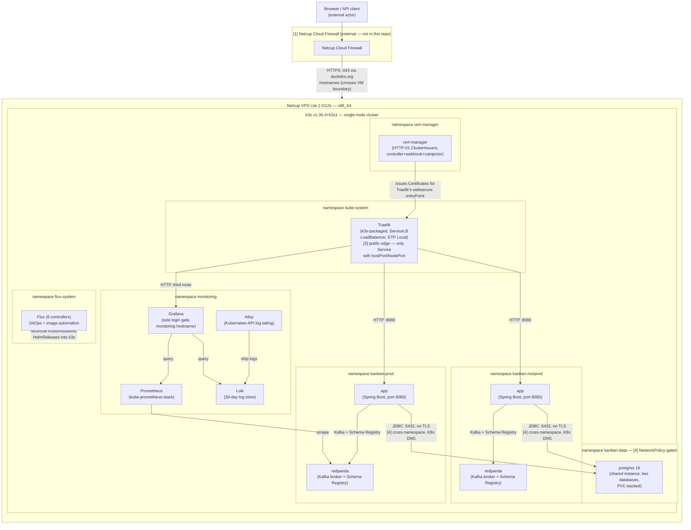

# Kanban Board — Backend

REST API for a kanban board (`user → board → column → task → subtask`) with session-based
authentication and ownership-based access control: a user can only reach resources that chain back
to their own account.


https://github.com/user-attachments/assets/99f6e161-db89-4016-83ad-9ea921f9a757

## What this is

A Spring Boot 3.5.16 / Java 21 backend that has been through two production infrastructure
migrations and a real CI/CD hardening pass, not just a CRUD API against a local database. The parts
worth reading past the routes are the ones that aren't CRUD — concurrent-edit handling, an
event-driven activity feed with real failure paths, Avro schema governance in front of the topic,
and a delivery pipeline that ships to a real VPS with an isolated nonprod environment ahead of every
change to production.

## Engineering highlights

Detail and reasoning for each of these is in [docs/ARCHITECTURE.md](docs/ARCHITECTURE.md).

- **Optimistic locking** — concurrent edits to the same board, column, task or subtask return
  **409** instead of silently overwriting →
  [how](docs/ARCHITECTURE.md#concurrency-optimistic-locking)
- **Activity feed publishes after commit, off the request thread** — so recording history can never
  slow down or fail the mutation that caused it, and poison messages retry then dead-letter →
  [how](docs/ARCHITECTURE.md#event-driven-activity-feed)
- **Avro schemas with enforced BACKWARD compatibility** — registration is owned by a Gradle task,
  not the producer, and a test proves the registry actually rejects an incompatible change →
  [how](docs/ARCHITECTURE.md#schema-governance)
- **Layering enforced by ArchUnit, not code review** — controllers reaching into repositories, or a
  service skipping the ownership-verified loader, fail the build →
  [how](docs/ARCHITECTURE.md#testing)
- **N+1 fixed by measurement, not guesswork** — a bulk delete went from 33 queries for 8 tasks to 4
  regardless of count, with a query-count regression test holding it there →
  [how](docs/ARCHITECTURE.md#testing)

## Live

<!--
GitHub's README renderer strips a plain HTML <video src> tag and does not render a raw file
path/URL as a player — the only inline-playing mechanism it honors is a `user-attachments/assets/
<id>` URL, minted by dragging docs/demo/kanban-board-backend-dashboards-demo.mp4 into any
comment/PR/issue text box on this repo. Paste that URL on its own line below (no markdown wrapper)
to replace this placeholder link.
-->

[**Watch the dashboards**](./docs/demo/kanban-board-backend-dashboards-demo.mp4) — a walkthrough
of the live Grafana dashboards below, both public and reachable with no login.

- [Network & OS](https://kanban-board-rud-vlad-473-monitoring.duckdns.org/public-dashboards/9b5bf7c8d3c743e1868eed84c9d3e5df)
- [CPU & Memory metrics](https://kanban-board-rud-vlad-473-monitoring.duckdns.org/public-dashboards/cb7a5fc49fcb43108ba637fee7639b6d)

## Local development

```bash
cp .env.example .env
docker compose up
```

Brings up Postgres, a single-node Redpanda (broker plus its built-in Schema Registry), and the app,
which waits on the broker's `rpk cluster health` check rather than a bare TCP probe. Postgres is
published on host port **5433** so a pre-existing native install can't silently answer connections
meant for the container. Full runbook: [docs/LOCAL_DEV.md](docs/LOCAL_DEV.md).

```bash
./gradlew test      # everything; Docker required — every test boots a Testcontainers Postgres
./gradlew fastTest  # same suite minus the Kafka-backed *E2ETest classes; still needs Docker
```

## Stack

| Concern            | Choice                                                                                            | Why                                                                                                                                                                                                                            |
| ------------------ | ------------------------------------------------------------------------------------------------- | ------------------------------------------------------------------------------------------------------------------------------------------------------------------------------------------------------------------------------ |
| Language / runtime | Java 21, Gradle 8.11.1 (wrapper)                                                                  | Wrapper distribution is checksum-pinned (`distributionSha256Sum`), so a compromised or retargeted distribution is refused, not silently used. Compile-time checks add Error Prone (bug patterns) alongside the compiler itself |
| Framework          | Spring Boot 3.5.16 — Web, Data JPA, Security, Validation                                          | Kept deliberately conventional so the actually distinguishing work (locking, events, schema governance) stays legible against a familiar baseline                                                                              |
| Persistence        | PostgreSQL + Hibernate; Flyway for schema history; Testcontainers PostgreSQL for the test profile | Every test runs against the same Flyway migrations production does — not H2 standing in for Postgres                                                                                                                           |
| Sessions           | Spring Session JDBC (server-side session state in Postgres)                                       | A restart or a second instance doesn't discard logins; the concurrent-session ceiling reads live from the same store instead of per-instance bookkeeping                                                                       |
| Messaging          | Spring Kafka against Redpanda; Apache Avro 1.12 + Confluent Schema Registry                       | BACKWARD compatibility is enforced by the registry itself and proven by a test that shows it actually rejects a bad change, not assumed from config                                                                            |
| Mapping            | MapStruct 1.5.3 (compile-time generated, no reflection)                                           | A broken mapping is a compile error, not a runtime surprise                                                                                                                                                                    |
| Ids                | ULID via `ulid-creator`, generated in-app by `RandFlakeGenerator`                                 | Sortable by creation time without a database round-trip, unlike a random UUID                                                                                                                                                  |
| Docs               | springdoc-openapi 2.8.8                                                                           | Generates the published OpenAPI contract from the same annotations that already validate requests, including the shared `ProblemDetail` error envelope                                                                         |
| Testing            | JUnit 5, REST Assured, Testcontainers (Redpanda), ArchUnit                                        | Layering and ownership-loading rules fail the build directly — ArchUnit turns a review convention into a compile-time-adjacent check                                                                                           |
| Build gates        | Spotless (google-java-format AOSP), ErrorProne                                                    | Both pinned to exact versions, so a formatter or analyzer release upstream can't red an unchanged commit                                                                                                                       |

## Testing

424 test methods (`@Test`/`@ParameterizedTest`-annotated, counted directly from `src/test/java` —
re-derived 2026-08-19, not carried over from a prior count): unit tests for services and DTO
validation, REST Assured/MockMvc integration tests for controllers, Testcontainers-backed E2E tests
for the Kafka pipeline and real-socket concurrency, dedicated `security/` classes for injection
resistance and auth gating, and ArchUnit rules over the whole class graph. Every test — not just the
Kafka/real-socket-tagged classes — runs against a real PostgreSQL 16 instance via Testcontainers,
whose schema is built by the same Flyway migrations production runs, so Docker is required for
`./gradlew test`. Entities and repositories are deliberately untested — they carry no custom logic.
Full breakdown in [docs/ARCHITECTURE.md](docs/ARCHITECTURE.md#testing).

## API

All routes sit under the `/api` context path and require an authenticated session except signup and
signin. Child resources are created by `POST`ing to their parent.

| Method         | Path                                           | Notes                                                                                                                                                                  |
| -------------- | ---------------------------------------------- | ---------------------------------------------------------------------------------------------------------------------------------------------------------------------- |
| `POST`         | `/signup` · `/signin` · `/logout`              | Session cookie; max 2 concurrent sessions per user. `/signup`/`/signin` also return the caller's identity (`id`, `email`, `displayName`, `theme`) in the response body |
| `GET` `POST`   | `/boards`                                      | `GET` lists boards owned by the caller; `POST` creates one — `201` with a `Location` header, and the name must be unique for that user                                 |
| `PUT` `DELETE` | `/boards/{boardId}`                            | `PUT` requires the current `version`; delete cascades to columns, tasks, subtasks                                                                                      |
| `GET`          | `/boards/{boardId}/full`                       | The board with its columns, each column with its tasks, and each task with its subtasks, in one nested document; carries the board's own `version`                     |
| `GET`          | `/boards/{boardId}/columns`                    |                                                                                                                                                                        |
| `POST`         | `/boards/{boardId}/columns`                    | Create a column                                                                                                                                                        |
| `PUT` `DELETE` | `/boards/{boardId}/columns/{columnId}`         | `PUT` requires the current `version`; `DELETE` cascades to the column's tasks and subtasks                                                                             |
| `POST`         | `/boards/{boardId}/columns/{columnId}`         | Create a task in the column                                                                                                                                            |
| `PATCH`        | `/boards/{boardId}/columns/{columnId}/reorder` | Reposition a column within its board; body takes `targetPosition` and requires the current `version`                                                                   |
| `GET`          | `…/columns/{columnId}/tasks`                   |                                                                                                                                                                        |
| `PUT` `DELETE` | `…/columns/{columnId}/tasks/{taskId}`          | `PUT` requires the current `version`                                                                                                                                   |
| `PATCH`        | `/tasks/{taskId}/move`                         | Cross-column move; requires the current `version`                                                                                                                      |
| `GET` `POST`   | `…/tasks/{taskId}/subtasks`                    |                                                                                                                                                                        |
| `PUT` `DELETE` | `…/tasks/{taskId}/subtasks/{subtaskId}`        |                                                                                                                                                                        |
| `GET`          | `/boards/{boardId}/activity`                   | Paginated feed — default 20, capped at 100                                                                                                                             |
| `GET` `PUT`    | `/users/me/theme`                              | The caller's own theme preference (`LIGHT`/`DARK`); the user is taken from the session, so no user id appears in the path                                              |

## Production deployment


```mermaid
%%{init: {"flowchart": {"subGraphTitleMargin": {"top": 15, "bottom": 15}, "curve": "linear"}}}%%
flowchart TB
    client["Browser / API client<br/>(external actor)"]

    subgraph netcup_edge["[1] Netcup Cloud Firewall (external — not in this repo)"]
        direction TB
        netcup_fw["Netcup Cloud Firewall"]
    end

    subgraph netcup["Netcup VPS Lite 2 G12s — x86_64<br/>Vienna, Austria — [2] KANBAN-INGRESS mangle-table filter"]
        direction TB

        netcup_spacer[" "]
        style netcup_spacer height:1px,fill:none,stroke:none

        subgraph k3s_box["k3s v1.36.4+k3s1 — single-node cluster"]
            direction TB

            subgraph traefik_box["namespace kube-system"]
                traefik["Traefik<br/>(k3s-packaged, ServiceLB<br/>LoadBalancer, ETP Local)<br/>[3] public edge — only Service<br/>with hostPort/NodePort"]
            end
            netcup_spacer ~~~ traefik_box

            subgraph cm_box["namespace cert-manager"]
                cert_manager["cert-manager<br/>(HTTP-01 ClusterIssuers,<br/>controller+webhook+cainjector)"]
            end

            subgraph prod_box["namespace kanban-prod"]
                app_prod["app<br/>(Spring Boot, port 8080)"]
                redpanda_prod["redpanda<br/>(Kafka broker + Schema Registry)"]
            end

            subgraph nonprod_box["namespace kanban-nonprod"]
                app_nonprod["app<br/>(Spring Boot, port 8080)"]
                redpanda_nonprod["redpanda<br/>(Kafka broker + Schema Registry)"]
            end

            subgraph data_box["namespace kanban-data — [4] NetworkPolicy-gated"]
                postgres["postgres 16<br/>(shared instance, two databases,<br/>PVC-backed)"]
            end

            subgraph monitoring_box["namespace monitoring"]
                direction TB
                prometheus["Prometheus<br/>(kube-prometheus-stack)"]
                grafana["Grafana<br/>(sole login gate,<br/>monitoring hostname)"]
                loki["Loki<br/>(30-day log store)"]
                alloy["Alloy<br/>(Kubernetes-API log tailing)"]
            end

            subgraph flux_box["namespace flux-system"]
                flux["Flux (6 controllers)<br/>GitOps + image automation"]
            end
        end

        traefik -- "HTTP :8080" --> app_prod
        traefik -- "HTTP :8080" --> app_nonprod
        traefik -- "HTTP, third route" --> grafana
        app_prod -- "Kafka + Schema Registry" --> redpanda_prod
        app_nonprod -- "Kafka + Schema Registry" --> redpanda_nonprod
        app_prod -- "JDBC :5432, no TLS<br/>[4] cross-namespace, K8s DNS" --> postgres
        app_nonprod -- "JDBC :5432, no TLS<br/>[4] cross-namespace, K8s DNS" --> postgres
        prometheus -- "scrape" --> redpanda_prod
        alloy -- "ship logs" --> loki
        grafana -- "query" --> prometheus
        grafana -- "query" --> loki
        cert_manager -- "issues Certificates for<br/>Traefik's websecure entryPoint" --> traefik
    end

    client --> netcup_fw
    netcup_fw -- "HTTPS :443 via duckdns.org<br/>hostnames (crosses VM boundary)" --> netcup
    flux -- "reconcile Kustomizations,<br/>HelmReleases into k3s" --> k3s_box
```

<sub>Source: [docs/diagrams/infra-physical-deployment.mmd](docs/diagrams/infra-physical-deployment.mmd)
— the Physical/Deployment view per [docs/DIAGRAM_CONVENTIONS.md](docs/DIAGRAM_CONVENTIONS.md). This
is a simplified rendering of that file for README readability; the full diagram (Docker Hub, GitHub
Actions, Flux's GitOps loop in full) lives at the source path, and if the two ever disagree, the
`.mmd` source is canonical.</sub>

Production runs on a **k3s v1.36.4+k3s1** single-node cluster, on the same **Netcup VPS Lite 2
G12s** (Vienna, x86_64) as before, behind the Netcup Cloud Firewall and a Docker-independent
`mangle`-table firewall (`KANBAN-INGRESS`, Plan 13-08): **Traefik** (the k3s-packaged edge)
terminates public TLS with cert-manager-issued Let's Encrypt certificates and is the only
component with a published host port (80/443, via k3s's ServiceLB) — confirmed live via `k3s
kubectl get svc -A` (the cluster's only non-`ClusterIP` Service) and `k3s kubectl get pods -A`
(the only Pods carrying `hostPort` are `svclb-traefik-*`). `app`, a self-hosted `redpanda` broker
per environment (Kafka wire protocol plus its built-in Schema Registry), and a self-hosted
**Postgres 16** StatefulSet — the system of record since Phase 11 replaced Neon serverless
Postgres — sit behind Traefik with no host port of their own, reachable only via `ClusterIP`
Services inside the cluster's own pod network (Postgres specifically gated by a `NetworkPolicy` in
its own `kanban-data` namespace). **Flux** reconciles every manifest from this repository's `main`
branch pull-based GitOps, no push-based deploy step. A shared kube-prometheus-stack/Loki/Alloy
stack monitors both environments from the `monitoring` namespace, with Grafana as the only
publicly reachable piece, gated by its own login through its own `IngressRoute`. See
[docs/INFRA_ARCHITECTURE.md](docs/INFRA_ARCHITECTURE.md) for the full numbered-trust-boundary
breakdown and [docs/INFRA_RUNBOOK.md](docs/INFRA_RUNBOOK.md) for the provider pivot history (from
Oracle Cloud's Always Free A1 Flex, ARM64 capacity that proved structurally unavailable), the
`KANBAN-INGRESS` firewall evidence, and the live k3s resource-measurement session.

**Nonprod** is a second, fully isolated deployment colocated on the same cluster: its own
namespace (`kanban-nonprod`), its own database (`kanban_nonprod`) on that same shared self-hosted
Postgres instance — never holding a production row — its own Redpanda broker with an
independently-populated Avro Schema Registry, and its own publicly trusted HTTPS host
(`kanban-board-rud-vlad-473-nonprod.duckdns.org`) reconciled by its own, independent Flux
`Kustomization` (D-16) — a nonprod-only image bump never touches prod's Pod, and vice versa. It
exists so a change can be proven against a real broker, a real registry, and real TLS before it
ever reaches production data. The Compose-era isolation proof (container/volume/network identity,
a live signup-then-board-create that left production's row counts unchanged) is in
[docs/history/2026-08-18-nonprod-bring-up.md](docs/history/2026-08-18-nonprod-bring-up.md)'s
"Nonprod bring-up" section, historical background for a mechanism the k3s cutover replaced with
namespace isolation and independent Kustomizations instead.

## CI/CD pipeline & deploy strategy

Every push to `main` runs [`.github/workflows/deploy.yml`](.github/workflows/deploy.yml) — there
is no other trigger. **CI ends at image push (D-14).** Neither production nor nonprod deploys
through this pipeline anymore — Flux deploys both environments independently, entirely through
GitOps (D-16). `run-tests` (`./gradlew test`, then `spotlessCheck`) gates everything below it;
nothing else runs unless it's green. From there the graph fans out and back in:

- **In parallel:** the Docker image builds once and pushes to BOTH the prod and nonprod Docker Hub
  repositories, tagged with a sortable scheme (`main-<run_number>-<short SHA>`, D-15) so each
  environment's own Flux `ImagePolicy` can pick the numerically newest tag deterministically —
  `linux/amd64` natively, the runner and the VM share the same architecture, no QEMU needed — and
  two Flyway migration-verification jobs run **on the VM itself** (the runner SCPs the migration
  scripts over, then runs the pinned Flyway CLI over SSH against Postgres's `ClusterIP` directly —
  not against a runner-side connection to a managed provider), one per environment's own database
  on that same shared self-hosted instance.
- **Then: nothing in this pipeline.** There is no `deploy-to-netcup`, no
  `register-schemas-production`, no SSH-based deploy job of any kind. Each environment's own Flux
  `ImageRepository`/`ImagePolicy` (5m poll) picks up the newly pushed tag, `ImageUpdateAutomation`
  (author `fluxcdbot`) commits a `Setters`-strategy bump to that environment's own overlay
  `kustomization.yaml` on `main` (`k8s/**` sits on this workflow's own paths-ignore, so that commit
  does not re-trigger a build), and `kustomize-controller` applies it — the app `Deployment`'s
  `register-schemas` `initContainer` re-registers Avro schemas in-cluster, ordered before the app
  container starts by the kubelet's own contract, replacing the CI job entirely.
- **Cleanup, per environment:** `cleanup-old-images`/`cleanup-old-images-nonprod` each keep the
  five newest sortable-tag images in their own Docker Hub repository, run independently of any
  deploy outcome (there is no deploy job left in this pipeline to gate on) — Flux needs recent tags
  available for a `git revert`-based rollback either way.

Full delivery-path detail, including the exact mechanism for the image-tag bump and the
independent per-environment reconciliation (D-16), is in
[docs/INFRA_ARCHITECTURE.md](docs/INFRA_ARCHITECTURE.md); the same path is drawn as a sequence
diagram at
[docs/diagrams/infra-delivery-scenario.mmd](docs/diagrams/infra-delivery-scenario.mmd).

## Quality & security gates

**Pre-commit** (`.githooks/pre-commit`, auto-installed via `core.hooksPath`) runs three gates in
order, cheapest-and-most-urgent first: a **gitleaks** scan of the staged diff (pinned digest,
seconds, refuses the commit on a likely credential before four minutes of tests run for nothing),
then `spotlessCheck`, then `fastTest` (the full suite minus classes tagged `@Tag("kafka")` or
`@Tag("realSocket")` — still exercises every unit/service/controller test and ArchUnit's layering
rule). None of the three auto-fixes anything; each fails the commit with instructions instead of
silently rewriting staged files.

**CI**, in [`.github/workflows/`](.github/workflows/), adds what a pre-commit hook can't or
shouldn't cover:

| Gate                                                        | Posture                                          | Why                                                                                                                                                                                                                                              |
| ----------------------------------------------------------- | ------------------------------------------------ | ------------------------------------------------------------------------------------------------------------------------------------------------------------------------------------------------------------------------------------------------ |
| `gitleaks` full-history scan                                | Hard — every push/PR                             | Same pinned scanner as the pre-commit hook, but over full history, not just the staged diff                                                                                                                                                      |
| `TruffleHog` verified-live-credential scan                  | Hard — every push/PR, diff-scoped                | Narrows what gitleaks already flags to only what's actually exploitable right now — a live network verification call per candidate, not a pattern match                                                                                          |
| Digest-pinned `appleboy/scp-action` / `appleboy/ssh-action` | Hard, structural                                 | Both actions carry real SSH keys to production/staging VMs — pinned to immutable commit SHAs (`@<sha>  # v<version>`), not a mutable tag; first-party GitHub/Docker actions stay tag-trusted, with the trade-off recorded inline in `deploy.yml` |
| `gradle/actions/wrapper-validation`                         | Hard — before every `./gradlew` invocation in CI | Confirms the wrapper scripts and jar haven't been tampered with, before any of them execute                                                                                                                                                      |
| Gradle dependency-verification metadata                     | Hard — resolution-time, every build              | `gradle/verification-metadata.xml` checksums every resolved artifact; an artifact republished under the same coordinates+version with different bytes fails the build                                                                            |
| Spotless / Error Prone (`ErrorProne` plugin)                | Hard — every build, including the Docker build   | Formatting and compile-time bug patterns (null derefs, ignored futures); both pinned exactly so an upstream release can't red an unchanged commit                                                                                                |
| JaCoCo coverage ratchet                                     | Hard — `test` only                               | INSTRUCTION/LINE ≥ 90%, BRANCH ≥ 75%                                                                                                                                                                                                             |
| OWASP `dependency-check`                                    | **Report-only**, weekly + on demand              | Its verdict drifts with newly-published NVD advisories independent of any code change, so it isn't hard-gated — findings are visible in the uploaded report, not blocking                                                                        |
| Dependabot                                                  | N/A — advisory PRs                               | Watches both the Gradle and GitHub Actions ecosystems, so a version bump for a digest-pinned action or a verified dependency arrives as a reviewable PR, not manual upkeep                                                                       |

See [docs/ARCHITECTURE.md#build-quality-gates](docs/ARCHITECTURE.md#build-quality-gates) for the
Spotless/ErrorProne detail and [docs/INFRA_RUNBOOK.md](docs/INFRA_RUNBOOK.md) for the diagnosed
history behind the NVD API key preflight check.

## Diagrams

One diagram is embedded above; the rest live under
[docs/diagrams/](docs/diagrams/) as Mermaid sources, each rendered inline where it's discussed in
[docs/ARCHITECTURE.md](docs/ARCHITECTURE.md) or [docs/AUTH_FLOWS.md](docs/AUTH_FLOWS.md):

| Diagram                                                 | Answers                                                                                                            |
| ------------------------------------------------------- | ------------------------------------------------------------------------------------------------------------------ |
| `infra-physical-deployment.mmd`                         | What runs where, on what hardware — embedded above                                                                 |
| `infra-delivery-scenario.mmd`                           | How a push to `master` becomes a running deploy, job by job                                                        |
| `architecture-signin-scenario.mmd`                      | What happens between a `POST` of credentials and a session cookie landing in Postgres                              |
| `architecture-error-response-split.mmd`                 | Which layer rejects a request for each of 401/403/400/409, and whether it ever reaches a controller                |
| `process/activity-pipeline.mmd`                         | The path of a mutation through the activity-log pipeline (process view)                                            |
| `architecture-mutation-sequence.mmd`                    | The same pipeline grounded in one real endpoint, response timing vs. the Kafka send                                |
| `architecture-activity-feed-read.mmd`                   | How a paginated `GET` becomes a total, deterministic order                                                         |
| `auth-signin-scenario.mmd` / `auth-signup-scenario.mmd` | The signin/signup flows drawn from an HTTP-first, frontend/QA angle — see [docs/AUTH_FLOWS.md](docs/AUTH_FLOWS.md) |

## Project status

Shipped: optimistic locking (v1.0), the Kafka activity feed (v1.1), Avro Schema Registry governance
and the Flyway migration history (v1.2, phases 4 and 4.1), the infra migration to Netcup (v1.2,
phase 5), an isolated live nonprod environment with its own continuous-deploy path (v1.3, phases
8-9), and this phase's CI/deploy hardening pass — digest-pinned deploy actions, a verified-live
credential scan alongside pattern-based scanning, Gradle wrapper and dependency-artifact
verification, and the `Secure` cookie attribute now that both environments serve real TLS.

Not done, deliberately: no rate limiting on the auth endpoints, no refresh-token-style session
renewal (sessions are fixed-duration), and no caching layer.

## Documentation

`docs/` holds one flat list of files plus a few subdirectories; grouped here by what each one is
for, not by where it lives — files aren't physically reorganized into subdirs because ~90% of the
links that would break are inside `.planning/`'s own dated historical records, which shouldn't be
rewritten after the fact.

**What the application does**

|                                                                        |                                                                                                                           |
| ---------------------------------------------------------------------- | ------------------------------------------------------------------------------------------------------------------------- |
| [docs/ARCHITECTURE.md](docs/ARCHITECTURE.md)                           | How the application works and why — the detail behind the highlights above                                                |
| [docs/AUTH_FLOWS.md](docs/AUTH_FLOWS.md)                               | For a frontend/QA engineer writing E2E tests — the signup/signin contract in HTTP terms, plus session/cookie/CORS gotchas |
| [docs/MOCKUP_FEATURE_GAP.md](docs/MOCKUP_FEATURE_GAP.md)               | What the Kanban design mock-ups ask for vs. what the API delivers, and the gap-closure history      |
| [docs/demo/](docs/demo/)                                               | A short screen-recording demo of the live dashboards                                                                     |

**How it's deployed and run**

|                                                                        |                                                                                                                           |
| ---------------------------------------------------------------------- | ------------------------------------------------------------------------------------------------------------------------- |
| [docs/INFRA_ARCHITECTURE.md](docs/INFRA_ARCHITECTURE.md)               | The production deployment topology and the delivery path, in full                                                         |
| [docs/INFRA_RUNBOOK.md](docs/INFRA_RUNBOOK.md)                         | Live-verified provider/firewall/DNS/database/backup reference state — durable how-to content only                        |
| [docs/history/](docs/history/)                                        | The dated record of every infra change (deploys, cutovers, incidents, resource measurements) — one file per event, chronologically indexed |
| [docs/incidents/](docs/incidents/)                                     | Deep-dive write-ups for individual production incidents (e.g. a nonprod SYN-loss investigation)                          |
| [docs/LOCAL_DEV.md](docs/LOCAL_DEV.md)                                 | Local runbook and the compose stack's scope                                                                               |
| [docs/diagrams/](docs/diagrams/)                                       | Source `.mmd` + rendered `.png` for every architecture/auth/infra diagram, pinned to a digest-locked renderer             |

**How to work in this repo (process, not product)**

|                                                                        |                                                                                                                           |
| ---------------------------------------------------------------------- | ------------------------------------------------------------------------------------------------------------------------- |
| [docs/CODE_STYLE.md](docs/CODE_STYLE.md)                               | Judgement-level rules the formatter can't check                                                                           |
| [docs/SESSION_LESSONS.md](docs/SESSION_LESSONS.md)                     | Operational lessons from running GSD workflows here — how work is *run*, the sibling to CODE_STYLE's how code is *written* |
| [docs/DIAGRAM_CONVENTIONS.md](docs/DIAGRAM_CONVENTIONS.md)             | Which Kruchten 4+1 view a diagram should be, and why it matters                                                           |
| [docs/learning/](docs/learning/)                                       | A chaptered guide explaining every major architectural decision, written for a new contributor's onboarding pass         |

**Planning**

|                                                                        |                                                                                                                           |
| ---------------------------------------------------------------------- | ------------------------------------------------------------------------------------------------------------------------- |
| [docs/plans/backend-modernization/](docs/plans/backend-modernization/) | The remaining modernization epics                                                                                         |
