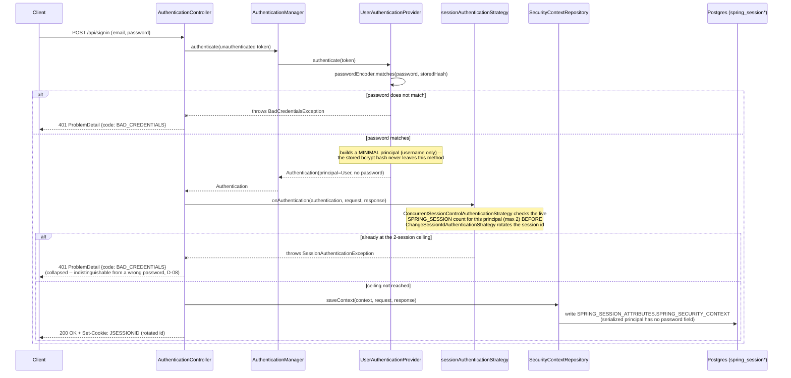
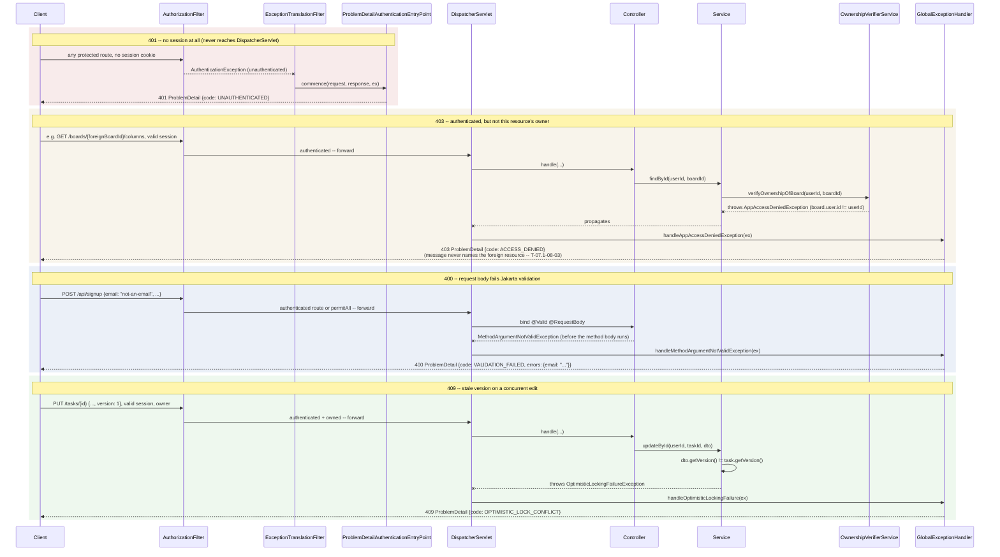
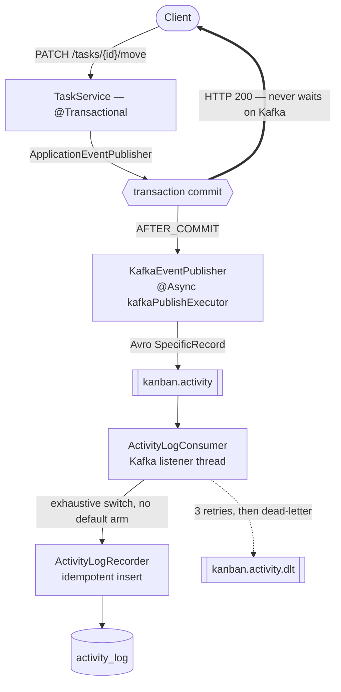
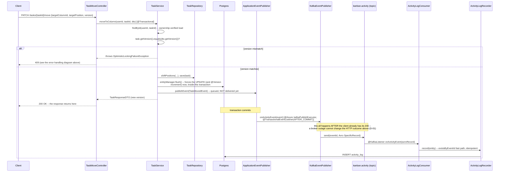
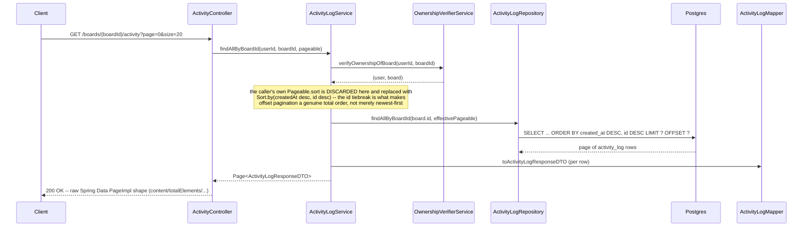

# Architecture

The engineering detail behind the summary in the [README](../README.md). This file explains
mechanisms and the reasoning behind them; every claim names the class, Gradle task, migration, or
test that proves it, so any statement here is one grep from confirmation.

## Layering and access control

Layered — controller → service → repository — with the layering enforced by a build-failing
ArchUnit rule rather than by convention (see [Testing](#testing)).

- **Ownership verification is its own service.** `OwnershipVerifierService` walks
  subtask → task → column → board → user in one place, so "may this user touch this resource?" is
  answered once instead of being re-implemented per controller. Domain services load entities
  through their own ownership-verified `findById(userId, id)`, never a bare `repository.findById`.
- **Controllers carry no business logic.** `@PreAuthorize("isAuthenticated()")` at class level, a
  custom `@CurrentUserId` argument resolver injecting the authenticated user id from the security
  context, `@Valid` DTOs in, `ResponseEntity<DTO>` out. Exceptions propagate to a single
  `GlobalExceptionHandler` that owns the exception → HTTP status mapping.
- **MapStruct for entity ↔ DTO.** Generated at compile time, so mapping mistakes are compile
  errors and the service layer stays free of mapping boilerplate.
- **Shared base interfaces** (`BaseBoard`, `BaseTask`, …) tie each DTO to the entity shape it
  mirrors, which is what keeps four near-identical resource hierarchies from drifting apart.
- **Sessions are server-side and shared.** Spring Session JDBC puts session state in Postgres, so a
  restart or a second instance doesn't discard logins. The two-concurrent-session ceiling is
  enforced by a `SpringSessionBackedSessionRegistry` reading live rows from that same store — so it
  holds across instances rather than relying on per-instance bookkeeping — and the session id
  rotates on every successful authentication. Both are proven by `SessionPersistenceE2ETest`.

### Scenario — signin and session establishment

*Which question this answers: what actually happens between a client POSTing credentials and a
session cookie landing in Postgres?* Scenarios(+1) view per
[DIAGRAM_CONVENTIONS.md](DIAGRAM_CONVENTIONS.md) — an end-to-end user-facing flow traced across the
security filter chain, the session-strategy bean, and Spring Session JDBC's storage layer. Signup
follows the identical path through `AuthenticationController#authenticate` (`security/
AuthenticationController.java`) after its own persistence step; only signin is drawn here to keep
the diagram legible.

Simplified: the diagram omits `signup`'s extra persistence step
(`UserService#save`, before this same `authenticate` helper runs) and the auto-rollback
`userService.deleteById(...)` signup performs if authentication of its own new account somehow
fails — see `AuthenticationController.java`'s `signup` method for that detail.

### Scenario — how a rejected request differs across 401 / 403 / 400 / 409

*Which question this answers: for the four ways this API rejects a request, which layer rejects
it, and does the request ever reach application code?* Scenarios(+1) view — this is the single
most important behavior this phase (07.1) made consistent, per D-01 through D-05: before it, all
four cases were not reliably distinguishable. The structural fact worth reading closely is that
**the 401 path never reaches `DispatcherServlet`, and the 403/400/409 paths always do** — 401 is a
filter-chain rejection with no controller/service ever invoked; the other three are ordinary
`@ExceptionHandler` dispatch from `GlobalExceptionHandler` (`handler/GlobalExceptionHandler.java`)
after a controller or service method actually ran and threw.

Simplified: the four `rect` blocks are drawn as one diagram for side-by-side comparison, not as one
literal request — each block starts its own independent request. `AuthorizationFilter` and
`ExceptionTranslationFilter` are Spring Security's own classes (`org.springframework.security.web
.access.intercept.AuthorizationFilter` / `...web.access.ExceptionTranslationFilter`), not project
code; they are named here because which one rejects the request is exactly what makes 401
structurally different from the other three.

## Concurrency: optimistic locking

Two users dragging the same task at once is the realistic conflict in a kanban board, so writes on
`TaskEntity` and `ColumnEntity` are version-checked rather than last-write-wins.

- `@Version` on both entities, surfaced through the response DTOs; `UpdateTaskRequestDTO`,
  `MoveTaskRequestDTO` and `UpdateColumnRequestDTO` require the client to send back the version it
  read — a missing one is a 400, not a silent overwrite.
- The services also perform an **explicit** version comparison in addition to `@Version`. Hibernate's
  own check only catches a conflict between load and flush *within one transaction* — a
  load-then-modify-then-save request that reads a row someone already updated would otherwise write
  cleanly over it, because the entity it loaded is current by the time it flushes. The explicit
  check is what turns a stale client read into a conflict.
- `OptimisticLockingFailureException` maps to **HTTP 409** in `GlobalExceptionHandler`.
- Proven end-to-end by `TaskLockingTest` and `ColumnLockingTest`, which drive two conflicting
  updates from the same read version over real HTTP and assert the second gets a 409.

## Event-driven activity feed

Board/column/task mutations produce a durable, per-board activity log — built as an event pipeline
rather than an audit-row write in the request path, so recording history cannot slow down or fail
the mutation that caused it.

Services publish one of five records implementing the sealed `ActivityEvent` interface through
Spring's `ApplicationEventPublisher`. `KafkaEventPublisher` — the only class in `src/main` that
touches the Kafka client API — picks them up on `@TransactionalEventListener(AFTER_COMMIT)`, so
nothing is ever published for a transaction that rolled back.

### Process View — path of a mutation

*Process view only, per [DIAGRAM_CONVENTIONS.md](DIAGRAM_CONVENTIONS.md) — it shows runtime
communication, not deployment topology.*

### Sequence view of the same mutation

*Which question this answers: in call-and-response order, what actually calls what for one
concrete mutation, and exactly where does the HTTP response return relative to the Kafka send?*
Process View — the flowchart above shows the shape of the pipeline; this sequence diagram grounds
it in one real endpoint, `PATCH /tasks/{taskId}/move`
(`controller/TaskMoveController.java` → `service/TaskService.java#moveToColumn`).

Simplified: the same-column vs. cross-column position-shifting branch inside `moveToColumn` is
collapsed into `shiftPositions(...)`; see the method itself for the two-case split. The dead-letter
retry path (3 retries, then `kanban.activity.dlt`) is omitted here since the flowchart above already
covers it.

### Process View — reading the activity feed

*Which question this answers: how does a paginated `GET` turn into a total, deterministic order
instead of merely "roughly newest first"?* Process View —
`controller/ActivityController.java` → `service/ActivityLogService.java#findAllByBoardId`.

Simplified: `Pageable`'s own max-page-size clamp (`spring.data.web.pageable.max-page-size`) is
enforced by Spring Data before this method runs and is not drawn. The offset-pagination
snapshot-consistency caveat this method's own Javadoc records (a concurrent insert can still shift
a later page by one row) is a property of offset pagination in general, not something this
sequence diagram can show frame-by-frame.

The failure-path decisions are the substance here:

- **The request never waits on the broker.** The after-commit listener is `@Async` on a dedicated
  `kafkaPublishExecutor` pool, because `KafkaTemplate.send()` blocks the calling thread inside
  `waitOnMetadata` even before it returns a future. Producer timeouts (`max.block.ms`,
  `request.timeout.ms`, `delivery.timeout.ms`) are bounded at 2s rather than left at the 60s
  default, so an unreachable broker can't turn into a self-inflicted request hang. A failed send is
  logged, never swallowed — the mutation itself already succeeded and returned.
- **A new event type is a compile error.** `ActivityLogConsumer` switches exhaustively over the
  sealed interface with no `default` arm, so adding a sixth event record fails the build until the
  consumer handles it, instead of being silently absorbed at runtime.
- **Redelivery is absorbed, not retried.** `ActivityLogRecorder` takes an `existsByEventId` fast
  path, and backstops the narrow race between that check and the insert by catching
  `DataIntegrityViolationException` — but only absorbs it after re-confirming the row is actually
  present under that `eventId`. A constraint violation from anything else (a `NOT NULL` on a
  malformed event) is rethrown so it reaches the retry path instead of vanishing.
- **`eventId` is a time-ordered string, not a random UUID.** `EventIdGenerator` delegates to this
  project's existing `RandFlakeGenerator` (the same algorithm behind every entity primary key), so
  the dedupe key gets index locality on `uk_activity_log_event_id` for free instead of scattering
  inserts randomly across the B-tree. This was a deliberate, one-way change (v1.2 Phase 6, GAP-07):
  the `activity_log.event_id` column moved from `uuid` to `varchar`, existing rows keep their old
  UUID string form, and `GET /boards/{boardId}/activity`'s `eventId` field changed its JSON type on
  an already-shipped endpoint — a documented breaking change with zero blast radius today, since no
  frontend consumes it yet.
- **Poison messages are isolated with their bytes intact.** `DefaultErrorHandler` retries three
  times at 1s, then dead-letters to `kanban.activity.dlt`. The dead-letter path uses its own
  byte-preserving `KafkaTemplate` — routing a raw `byte[]` payload through the application's normal
  template would base64-encode the exact artifact an operator needs to inspect.

## Schema governance

The five event types are governed by explicit, versioned Avro schemas, because an event topic
without one is a distributed-systems liability the moment a producer and consumer deploy apart.

- Five `.avsc` files under `src/main/avro/` are the source of truth, compiled to `SpecificRecord`
  classes by the Gradle Avro plugin. A mapping layer (`ActivityEventAvroMapper`) converts to and
  from the domain records, so the sealed interface and exhaustive switch above are unaffected by
  the wire format.
- **Producers can't register schemas.** `auto.register.schemas=false`; the only sanctioned writer is
  the `registerSchemas` Gradle task (`AvroSchemaRegistrar`). A drifted producer fails loudly instead
  of quietly registering an unreviewed schema version.
- `RecordNameStrategy` subjects the schema by record name rather than topic, which is what lets all
  five event types coexist as five independently-versioned subjects on one topic.
- **BACKWARD compatibility is enforced, not assumed** — `SchemaCompatibilityE2ETest` proves the
  registry actually *rejects* an incompatible change, rather than asserting a config value.
- Failure paths carry their own tests: `SchemaRegistryOutageE2ETest` (a mutation survives a registry
  outage), `ActivityLogAvroDeadLetterE2ETest` (byte fidelity through the DLT under Avro framing),
  and a rehearsal task that round-trips real historical `activity_log` rows through the new schemas
  before any cutover (`rehearseHistoricalSchemas`).

## Schema management

Flyway owns the domain schema: `V1__init` → `V2__add_optimistic_locking_version_columns` →
`V3__add_activity_log` → `V4__add_password_hash_not_null`. The history deliberately reconstructs how
the schema actually evolved rather than collapsing it into one snapshot, so a migration replay
matches the real sequence.

Outside the test profile, `spring.jpa.hibernate.ddl-auto=validate` — Hibernate is not allowed to
create or alter anything. Flyway builds the schema, Hibernate only checks that the entity mappings
agree with it, and a mismatch is a loud startup failure instead of a silent auto-alter. The test
profile now runs the same V1–V4 migrations against a Testcontainers-managed PostgreSQL instance
with `ddl-auto=validate` — the identical posture to production — so CI executes the full migration
history on every run.

## Testing

210 test methods across 33 classes, split by what each layer can actually prove. Every test — not
just the E2E classes — runs against a real PostgreSQL 16 instance via Testcontainers, whose schema
is built by the same Flyway migrations production runs, so Docker is required for `./gradlew test`:

| Category | Scope | Why |
|---|---|---|
| Unit | Services, DTO validation | Where the logic and the constraints live |
| Integration (REST Assured) | Controllers | Routing, validation, and auth need a real request to be proven |
| E2E (Testcontainers + Redpanda) | Kafka pipeline, locking, sessions | Broker/registry behaviour and races can't be mocked honestly |
| Architecture (ArchUnit) | The whole class graph | Turns two review-only conventions into build failures |

Entities and repositories are deliberately untested — they carry no custom logic.

**`LayeringArchTest`** enforces that controllers never reach past the service layer into
repositories, and that domain services load entities only through the ownership-verified
`findById`. It's scoped as a floor, not a ceiling, and says so in its own Javadoc.

**Query-count regression tests** measure Hibernate's `Statistics.getPrepareStatementCount()` —
not `getQueryExecutionCount()`, which only counts HQL/JPQL and silently misses `findById()`. That
distinction is what made the N+1 work measurable rather than speculative:

- `TaskService.deleteAllByColumnId` measured **33 queries for 8 tasks** (scaling with task count),
  now **4 regardless of count** — a `@Modifying` bulk JPQL delete for subtasks, then
  `deleteAllByIdInBatch`, then `flush()`/`clear()` because bulk JPQL bypasses the persistence
  context and leaves stale managed entities behind.
- The ownership chain, suspected of being N+1, measured at **1 query** — the EAGER parent chain is
  joined into a single statement and the redundant `findById` calls hit the L1 cache. No code
  changed; a regression guard test was added and two stale "TODO: optimize" comments were deleted
  because they no longer described a real problem.

## Build quality gates

- **Spotless** — google-java-format (AOSP), enforced by `./gradlew spotlessCheck` in CI and applied
  automatically by the pre-commit hook.
- **ErrorProne** — compile-time bug detection (null derefs, ignored futures, locale-dependent
  string ops) running as a javac plugin, so it's on every build path including the Docker build.
  Generated sources (MapStruct, Avro) are excluded — nobody can act on a finding there. Test
  sources are held *stricter* than main: five named checks are promoted to ERROR after a 27-finding
  backlog was triaged to zero. Both the plugin and analyzer are pinned exactly, so an upstream
  release can't red the build on its own.
- **`fastTest`** — the full suite minus the `*E2ETest` classes (the Kafka/Redpanda-backed ones), so
  the pre-commit hook gets a real gate (ArchUnit and every unit/service test) without paying the
  Kafka broker's container startup on each commit. It still starts the shared PostgreSQL container,
  measured at ~2.3s (see [LOCAL_DEV.md](LOCAL_DEV.md)). CI still runs everything.
- **Git hooks bootstrap on clone** — `core.hooksPath` is wired to the version-controlled
  `.githooks/` at Gradle configuration time, so a fresh checkout is armed with no manual setup step.
  It never fails the build and writes only when the value is wrong.

---

Judgement-level rules a formatter can't check live in [CODE_STYLE.md](CODE_STYLE.md); operational
lessons from past sessions in [SESSION_LESSONS.md](SESSION_LESSONS.md); the local runbook in
[LOCAL_DEV.md](LOCAL_DEV.md). Remaining modernization epics are in
[plans/backend-modernization/](plans/backend-modernization/).
