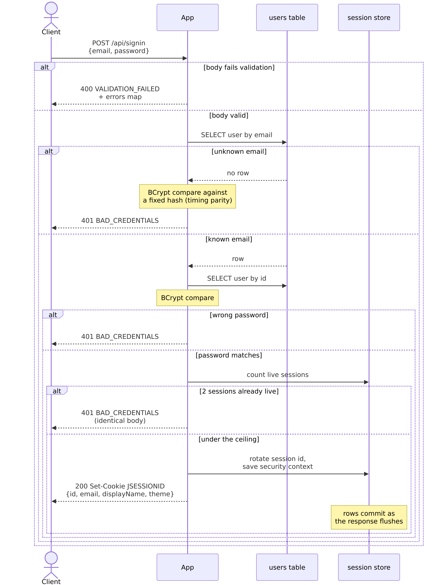
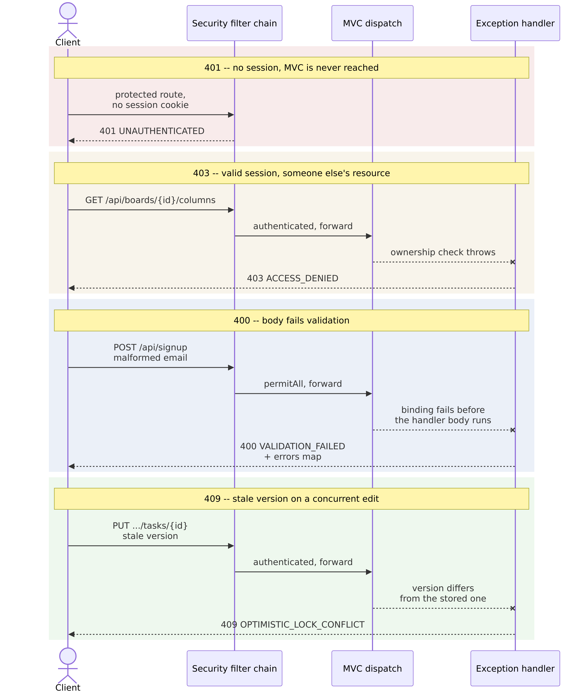
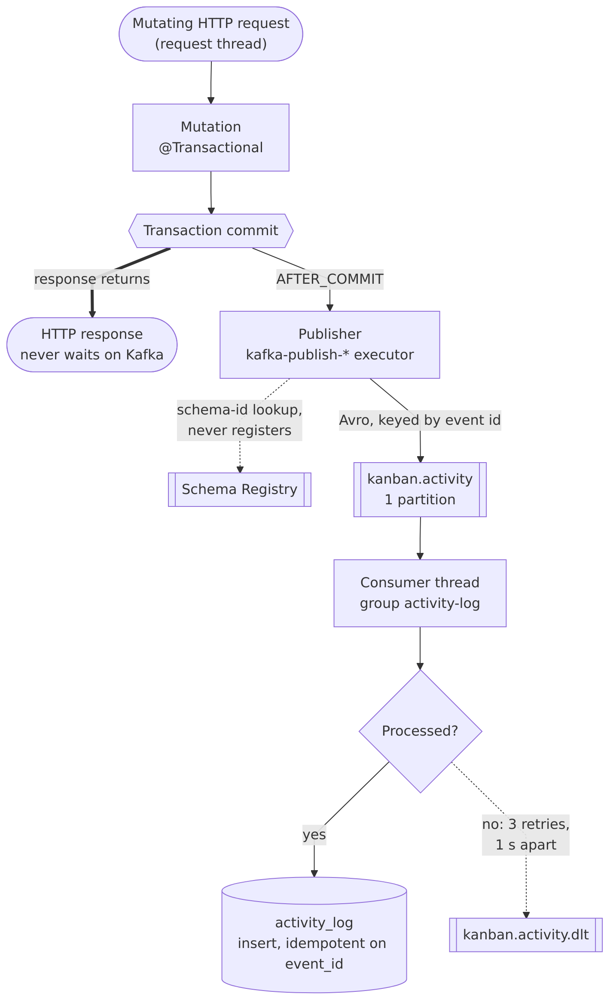

# Architecture

The engineering detail behind the summary in the [README](../README.md). This file explains
mechanisms and the reasoning behind them; every claim names the class, Gradle task, migration, or
test that proves it, so any statement here is one grep from confirmation.

## Layering and access control

Layered — controller → service → repository — with the layering enforced by a build-failing
ArchUnit rule rather than by convention (see [Testing](#testing)).

- **Ownership verification is its own service.** `OwnershipVerifierService` walks
  subtask → task → column → board → user in one place, so "may this user touch this resource?" is
  answered once instead of being re-implemented per controller. Domain services load entities
  through their own ownership-verified `findById(userId, id)`, never a bare `repository.findById`.
- **Controllers carry no business logic.** `@PreAuthorize("isAuthenticated()")` at class level, a
  custom `@CurrentUserId` argument resolver injecting the authenticated user id from the security
  context, `@Valid` DTOs in, `ResponseEntity<DTO>` out. Exceptions propagate to a single
  `GlobalExceptionHandler` that owns the exception → HTTP status mapping.
- **401 means unauthenticated, 403 means forbidden — no overlap.** A request with no valid session
  never reaches a controller at all: `ProblemDetailAuthenticationEntryPoint` answers it from inside
  the Spring Security filter chain with **401**, in the same RFC 7807 `ProblemDetail` envelope every
  other error uses. A request with a valid session that fails `OwnershipVerifierService`'s check
  reaches `GlobalExceptionHandler` as an ordinary thrown exception and gets **403**. Every error
  response — from either producer — carries the same shape and a stable `code` extension property
  (`ErrorCode`). See the error-handling sequence diagram below for the full four-way split
  including 400 and 409.
- **The error envelope is now a published contract, not merely a runtime one.** The generated
  OpenAPI document declares the `ProblemDetail` shape on every operation, so a downstream consumer
  generates its error type from the spec instead of hand-authoring it. The mechanism is a single
  global springdoc customizer bean, `ProblemDetailOpenApiCustomizer` — not per-endpoint annotation,
  because springdoc's reflection-based generation only sees a controller method's declared return
  type and has no visibility into a `@ControllerAdvice` class, so an annotation-based fix would have
  to be remembered on every future controller method (D-08). The document's `code` enum is derived
  from `ErrorCode` at document-build time, so the two cannot drift apart.
  `ProblemDetailOpenApiCustomizerTest` proves both the per-operation coverage and the agreement
  between the declared schema and what the two producers above actually emit. The gap this closes
  was invisible to this repo's own tests, which assert runtime response bodies and never the
  separately-generated document — it was found instead by a downstream frontend consumer trying to
  generate types from the spec (D-07).
- **Constraints composed into custom validation annotations are now published too.** `@ColumnColor`,
  `@BoardName`, `@DisplayName`, `@Password` and friends compose plain Jakarta constraints
  (`@Pattern`, `@Size`, `@NotBlank`, `@Email`) as meta-annotations, which swagger-core reads only
  from a field's *directly* declared annotations and never opens. The mechanism is a springdoc
  `PropertyCustomizer` (`ComposedConstraintPropertyCustomizer`), not the document-level customizer
  the error envelope above uses, because the composed annotation is the input here and it no longer
  exists once the document is built. `ComposedConstraintPropertyCustomizerTest` is the guard,
  proving both that the values are published and that they agree with the real `Validator`.
- **MapStruct for entity ↔ DTO.** Generated at compile time, so mapping mistakes are compile
  errors and the service layer stays free of mapping boilerplate.
- **Shared base interfaces** (`BaseBoard`, `BaseTask`, …) tie each DTO to the entity shape it
  mirrors, which is what keeps four near-identical resource hierarchies from drifting apart.
- **Sessions are server-side and shared.** Spring Session JDBC puts session state in Postgres, so a
  restart or a second instance doesn't discard logins. The two-concurrent-session ceiling is
  enforced by a `SpringSessionBackedSessionRegistry` reading live rows from that same store — so it
  holds across instances rather than relying on per-instance bookkeeping — and the session id
  rotates on every successful authentication. Both are proven by `AuthenticationTest`'s
  `ConcurrentSessionCeiling` and `SessionFixation` nested classes (renamed from the now-deleted
  `SessionPersistenceE2ETest` in phase 7's test restructure).

### Scenario — signin and session establishment

*Which question this answers: what actually happens between a client POSTing credentials and a
session cookie landing in Postgres?* Scenarios(+1) view per
[DIAGRAM_CONVENTIONS.md](DIAGRAM_CONVENTIONS.md) — an end-to-end flow drawn at the protocol level,
with four lifelines: the client, the application, the `users` table and the session store. The
application lifeline is `AuthenticationController#signin` (`security/AuthenticationController.java`)
calling `UserAuthenticationProvider#authenticate` and then the composite
`SessionAuthenticationStrategy` bean built in `SecurityConfiguration#sessionAuthenticationStrategy`;
the session store is Spring Session JDBC's `spring_session` tables. Signup runs the same
`AuthenticationController#authenticate` helper after its own insert and is drawn separately in
[AUTH_FLOWS.md](AUTH_FLOWS.md).

[diagram source](diagrams/scenarios/signin.mmd)

**Want the client's-eye view instead?** [AUTH_FLOWS.md](AUTH_FLOWS.md) is written for a frontend or
QA engineer planning E2E tests against this API rather than for a security reviewer. It embeds this
same signin diagram next to the full response table, draws `signup` in full via
`diagrams/scenarios/signup.mmd`, and adds the session/cookie/CORS facts (the concurrent-session
ceiling, the two session lifetimes, `SameSite`, credentialed CORS) that will otherwise silently
break a Playwright suite. The security-review detail that used to sit in notes on the diagram — the
BCrypt timing-parity compare (finding F1), why a rejected third session collapses into the
wrong-password `401`, the accepted concurrent-signin overshoot (finding F6), and the
commit-after-flush timing — is stated once, in prose, under "Sign in" in that document.

Signup returns **201** with the same `{id, email, displayName, theme}` body shape as signin's 200
above (D-01, quick task 260812-hs4), and a `Location` header naming the caller-identity resource URI
(`${server.servlet.context-path}` + `/users/me`) rather than the `/signup` route that created it
(D-02/D-04) — that target has no `GET` handler yet, tracked by a follow-up todo.

### Scenario — how a rejected request differs across 401 / 403 / 400 / 409

*Which question this answers: for the four ways this API rejects a request, which layer rejects
it, and does the request ever reach application code?* Scenarios(+1) view — this is the single
most important behavior this phase (07.1) made consistent, per D-01 through D-05: before it, all
four cases were not reliably distinguishable. The structural fact worth reading closely is that
**the 401 path never reaches `DispatcherServlet`, and the 403/400/409 paths always do** — 401 is a
filter-chain rejection with no controller/service ever invoked; the other three are ordinary
`@ExceptionHandler` dispatch from `GlobalExceptionHandler` (`handler/GlobalExceptionHandler.java`)
after a controller or service method actually ran and threw.

[diagram source](diagrams/scenarios/error-status-split.mmd)

Simplified: the four `rect` blocks are drawn as one diagram for side-by-side comparison, not as one
literal request — each block starts its own independent request. The three server-side lifelines
map to code as follows:

| Lifeline | Code | Role in the diagram |
|---|---|---|
| Security filter chain | Spring Security's filter chain, built in `SecurityConfiguration#securityFilterChain`; its entry point is `ProblemDetailAuthenticationEntryPoint`, which runs inside `ExceptionTranslationFilter` | answers the `401`, and forwards every authenticated or `permitAll` request |
| MVC dispatch | `DispatcherServlet`, the controller and the service layer | raises the `403` (`OwnershipVerifierService` throws `AppAccessDeniedException`), the `400` (`@Valid` binding throws `MethodArgumentNotValidException` before the handler body runs) and the `409` (`TaskService#updateById` compares versions and throws `OptimisticLockingFailureException`) |
| Exception handler | `GlobalExceptionHandler`, a `@ControllerAdvice` | turns each of those three exceptions into the `ProblemDetail` envelope with its `code` |

`ExceptionTranslationFilter` and the other filters are Spring Security's own classes, not project
code; which layer rejects the request is exactly what makes `401` structurally different from the
other three. A `403` response's `detail` never names the foreign resource (asserted for the board
name by `GlobalExceptionHandlerTest.AccessDeniedTest` and by `AuthorizationGatingTest`).

## Concurrency: optimistic locking

Two users dragging the same task at once is the realistic conflict in a kanban board, so writes on
`BoardEntity`, `ColumnEntity`, `TaskEntity` and `SubtaskEntity` are version-checked rather than
last-write-wins. `UserEntity` is the deliberate exception — its one versionable field (theme
preference) stays last-write-wins by explicit decision, not oversight (see below).

- `@Version` on all four entities, surfaced through the response DTOs; `UpdateBoardRequestDTO`,
  `UpdateTaskRequestDTO`, `MoveTaskRequestDTO`, `UpdateColumnRequestDTO`,
  `UpdateSubtaskRequestDTO` and `ReorderColumnRequestDTO` all require the client to send back the
  version it read — a missing one is a 400, not a silent overwrite. `BoardFullResponseDTO` exposes
  the board's own version alongside its columns/tasks/subtasks, so a client that loads a board via
  the nested read still has what it
  needs for a version-safe rename afterward. Board was the last of the four to gain this (V7
  migration, closing an asymmetry a frontend-integration-readiness audit flagged — the other three
  entities already had it).
- The services also perform an **explicit** version comparison in addition to `@Version`. Hibernate's
  own check only catches a conflict between load and flush *within one transaction* — a
  load-then-modify-then-save request that reads a row someone already updated would otherwise write
  cleanly over it, because the entity it loaded is current by the time it flushes. The explicit
  check is what turns a stale client read into a conflict.
- `OptimisticLockingFailureException` maps to **HTTP 409** in `GlobalExceptionHandler`.
- Proven end-to-end by `BoardLockingTest`, `ColumnLockingTest`, `TaskLockingTest` and
  `SubtaskLockingTest`, which drive two conflicting updates from the same read version over real
  HTTP and assert the second gets a 409.
- **`UserEntity` deliberately carries no `@Version`.** Its `theme` preference is a low-stakes,
  single-user UI setting with no integrity requirement worth the extra request-shape burden a
  mandatory `version` field imposes — a documented trade-off, not the same gap Board's asymmetry
  was.

## Event-driven activity feed

Board/column/task/subtask mutations produce a durable, per-board activity log — built as an event
pipeline rather than an audit-row write in the request path, so recording history cannot slow down
or fail the mutation that caused it. Every mutating operation on a board, column, task or subtask
either publishes one of these events or is a documented exception (S5E) — the theme-preference
update is the sole exception, since `ActivityEvent` mandates a non-null `boardId` and a theme
preference is user-scoped, not board-scoped.

Services publish one of 14 records implementing the sealed `ActivityEvent` interface through
Spring's `ApplicationEventPublisher`. `KafkaEventPublisher` — the only class in `src/main` that
touches the Kafka client API — picks them up on `@TransactionalEventListener(AFTER_COMMIT)`, so
nothing is ever published for a transaction that rolled back. Only the directly-requested mutation
on a resource publishes; cascaded child deletes (e.g. a board delete's cascaded columns, tasks and
subtasks) stay silent by design — see `ColumnService.deleteAllByBoardId`'s Javadoc for the full
reasoning.

### Process View — path of a mutation

[diagram source](diagrams/process/activity-pipeline.mmd)

*Process view only, per [DIAGRAM_CONVENTIONS.md](DIAGRAM_CONVENTIONS.md) — it shows runtime
communication, not deployment topology.* The boxes are threads, topics and tables, not classes: the
publisher is `KafkaEventPublisher` and the consumer thread runs `ActivityLogConsumer` and then
`ActivityLogRecorder`. Both topics have one partition.

A concrete case: `PATCH /tasks/{taskId}/move` (`TaskMoveController` → `TaskService#moveToColumn`,
`@Transactional`). The service compares the client's `version` with the loaded task's before it
changes anything, so a stale version throws `OptimisticLockingFailureException`, which is answered
**409** and never publishes an event. On a match it shifts sibling positions, saves, calls
`entityManager.flush()` so the `UPDATE` and the `@Version` increment happen now and the response
carries the new version, and only then calls `publishEvent(TaskMovedEvent)`. That call only queues
the event: the response (200) returns once the transaction commits, and the after-commit listener
sends to Kafka on its own thread after the client already has it, so a broker outage cannot change
the HTTP outcome (D-01). The same-column and cross-column position-shifting cases inside
`moveToColumn` are described on the method itself.

The failure-path decisions are the substance here:

- **The request never waits on the broker.** The after-commit listener is `@Async` on a dedicated
  `kafkaPublishExecutor` pool, because `KafkaTemplate.send()` blocks the calling thread inside
  `waitOnMetadata` even before it returns a future. Producer timeouts (`max.block.ms`,
  `request.timeout.ms`, `delivery.timeout.ms`) are bounded at 2s rather than left at the 60s
  default, so an unreachable broker can't turn into a self-inflicted request hang. A failed send is
  logged, never swallowed — the mutation itself already succeeded and returned.
- **A new event type is a compile error.** `ActivityLogConsumer` switches exhaustively over the
  sealed interface with no `default` arm, so adding another event record fails the build until the
  consumer handles it, instead of being silently absorbed at runtime.
- **Redelivery is absorbed, not retried.** `ActivityLogRecorder` takes an `existsByEventId` fast
  path, and backstops the narrow race between that check and the insert by catching
  `DataIntegrityViolationException` — but only absorbs it after re-confirming the row is actually
  present under that `eventId`. A constraint violation from anything else (a `NOT NULL` on a
  malformed event) is rethrown so it reaches the retry path instead of vanishing.
- **`eventId` is a time-ordered string, not a random UUID.** `EventIdGenerator` delegates to this
  project's existing `RandFlakeGenerator` (the same algorithm behind every entity primary key), so
  the dedupe key gets index locality on `uk_activity_log_event_id` for free instead of scattering
  inserts randomly across the B-tree. This was a deliberate, one-way change (v1.2 Phase 6, GAP-07):
  the `activity_log.event_id` column moved from `uuid` to `varchar`, existing rows keep their old
  UUID string form, and `GET /boards/{boardId}/activity`'s `eventId` field changed its JSON type on
  an already-shipped endpoint — a documented breaking change with zero blast radius today, since no
  frontend consumes it yet.
- **Poison messages are isolated with their bytes intact.** `DefaultErrorHandler` retries three
  times at 1s, then dead-letters to `kanban.activity.dlt`. The dead-letter path uses its own
  byte-preserving `KafkaTemplate` — routing a raw `byte[]` payload through the application's normal
  template would base64-encode the exact artifact an operator needs to inspect.

### Process View — reading the activity feed

`GET /boards/{boardId}/activity` (`ActivityController` → `ActivityLogService#findAllByBoardId`) is a
plain paginated read with no Kafka involved. After the ownership check, the service discards any
sort the caller sent and imposes `createdAt` descending, then `id` descending. The `id` tiebreak is
what makes offset pagination a total order rather than merely newest-first: rows that share a
`createdAt` instant would otherwise have no defined relative position, so a row could appear on two
pages or on none. The response is the raw Spring Data `Page` shape (`content`, `totalElements`, ...).
`Pageable`'s own max-page-size clamp (`spring.data.web.pageable.max-page-size`, 100) is enforced by
Spring Data before the service runs. Offset pagination still cannot give a stable snapshot across
concurrent writes: a row inserted while a client pages can shift a later page by one, so an item may
be seen twice or missed — the method's own Javadoc records this, and keyset pagination is the fix
and is not shipped.

## Schema governance

The 14 event types are governed by explicit, versioned Avro schemas, because an event topic
without one is a distributed-systems liability the moment a producer and consumer deploy apart.

- 14 `.avsc` files under `src/main/avro/` are the source of truth, compiled to `SpecificRecord`
  classes by the Gradle Avro plugin. A mapping layer (`ActivityEventAvroMapper`) converts to and
  from the domain records, so the sealed interface and exhaustive switch above are unaffected by
  the wire format.
- **Producers can't register schemas.** `auto.register.schemas=false`; the only sanctioned writer is
  the `registerSchemas` Gradle task (`AvroSchemaRegistrar`). A drifted producer fails loudly instead
  of quietly registering an unreviewed schema version.
- `RecordNameStrategy` subjects the schema by record name rather than topic, which is what lets all
  14 event types coexist as 14 independently-versioned subjects on one topic — each new event type
  added since Phase 4 (S5E) is a brand-new subject at version 1, never a new version of an existing
  one, so BACKWARD compatibility only ever needed to hold within a subject that has genuinely
  evolved (only `eventId`'s GAP-07 type change, 2026-08-09, has ever done so).
- **BACKWARD compatibility is enforced, not assumed** — `SchemaCompatibilityE2ETest` proves the
  registry actually *rejects* an incompatible change, rather than asserting a config value.
- Failure paths carry their own tests: `SchemaRegistryOutageE2ETest` (a mutation survives a registry
  outage), `ActivityLogAvroDeadLetterE2ETest` (byte fidelity through the DLT under Avro framing),
  and a rehearsal task that round-trips real historical `activity_log` rows through the new schemas
  before any cutover (`rehearseHistoricalSchemas`).

## Schema management

Flyway owns the domain schema: `V1__init` → `V2__add_optimistic_locking_version_columns` →
`V3__add_activity_log` → `V4__add_password_hash_not_null` →
`V5__add_position_subtask_version_theme_board_name_uniqueness` →
`V6__change_activity_log_event_id_to_varchar` →
`V7__add_board_optimistic_locking_version_column` → `V8__add_boards_created_at` →
`V9__add_columns_color`. The history deliberately reconstructs how the schema actually evolved
rather than collapsing it into one snapshot, so a migration replay matches the real sequence. V7
(07.1-05) is what gives `boards` the same `@Version` column Column/Task/Subtask already had,
closing the Board/User optimistic-locking asymmetry noted under
[Concurrency: optimistic locking](#concurrency-optimistic-locking). V9 (quick task 260904-obv)
adds a nullable `columns.color varchar(7)` with no default and no backfill — existing columns have
no meaningful color, and picking one for them would be a product decision this migration
deliberately does not make.

Outside the test profile, `spring.jpa.hibernate.ddl-auto=validate` — Hibernate is not allowed to
create or alter anything. Flyway builds the schema, Hibernate only checks that the entity mappings
agree with it, and a mismatch is a loud startup failure instead of a silent auto-alter. The test
profile now runs the same full migration history against a Testcontainers-managed PostgreSQL
instance with `ddl-auto=validate` — the identical posture to production — so CI executes the full
migration history on every run.

## Testing

382 test methods, split by what each layer can actually prove. Every test — not just the
Kafka/real-socket-tagged classes — runs against a real PostgreSQL 16 instance via Testcontainers,
whose schema is built by the same Flyway migrations production runs, so Docker is required for
`./gradlew test`:

| Category | Scope | Why |
|---|---|---|
| Unit | Services, DTO validation | Where the logic and the constraints live |
| Integration (REST Assured / MockMvc) | Controllers | Routing, validation, and auth need a real request to be proven |
| E2E (Testcontainers + Redpanda) | Kafka pipeline, real-socket concurrency | Broker/registry behaviour and races can't be mocked honestly |
| Architecture (ArchUnit) | The whole class graph | Turns two review-only conventions into build failures |

Two dedicated `security/` classes added in phase 07.1 close out the security/injection and
auth-gating coverage the audit that phase addressed asked for: `InjectionAttemptTest` (SQL
injection, stored-XSS round-trip, oversized/boundary payloads, malformed path variables — every
class proving JPA parameter binding holds rather than merely that a status code looked clean) and
`AuthorizationGatingTest` (a reflective sweep over every protected route, asserting both
unauthenticated-401 and cross-user-403 rejection, backstopped by a completeness guard so a future
route can't silently ship unswept).

Entities and repositories are deliberately untested — they carry no custom logic.

**`LayeringArchTest`** enforces that controllers never reach past the service layer into
repositories, and that domain services load entities only through the ownership-verified
`findById`. It's scoped as a floor, not a ceiling, and says so in its own Javadoc.

**Query-count regression tests** measure Hibernate's `Statistics.getPrepareStatementCount()` —
not `getQueryExecutionCount()`, which only counts HQL/JPQL and silently misses `findById()`. That
distinction is what made the N+1 work measurable rather than speculative:

- `TaskService.deleteAllByColumnId` measured **33 queries for 8 tasks** (scaling with task count),
  now **4 regardless of count** — a `@Modifying` bulk JPQL delete for subtasks, then
  `deleteAllByIdInBatch`, then `flush()`/`clear()` because bulk JPQL bypasses the persistence
  context and leaves stale managed entities behind.
- The ownership chain, suspected of being N+1, measured at **1 query** — the EAGER parent chain is
  joined into a single statement and the redundant `findById` calls hit the L1 cache. No code
  changed; a regression guard test was added and two stale "TODO: optimize" comments were deleted
  because they no longer described a real problem.

## Build quality gates

- **Spotless** — google-java-format (AOSP), enforced by `./gradlew spotlessCheck` in CI and applied
  automatically by the pre-commit hook.
- **ErrorProne** — compile-time bug detection (null derefs, ignored futures, locale-dependent
  string ops) running as a javac plugin, so it's on every build path including the Docker build.
  Generated sources (MapStruct, Avro) are excluded — nobody can act on a finding there. Test
  sources are held *stricter* than main: five named checks are promoted to ERROR after a 27-finding
  backlog was triaged to zero. Both the plugin and analyzer are pinned exactly, so an upstream
  release can't red the build on its own.
- **`fastTest`** — the full suite minus classes tagged `@Tag("kafka")` or `@Tag("realSocket")`, so
  the pre-commit hook gets a real gate (ArchUnit and every unit/service/controller test — including
  both new `security/` classes above, which carry no tag and therefore run in the gate by default,
  D-22) without paying the Kafka broker's or a real socket's startup cost on each commit. Gate
  membership is selected by explicit per-class tag, not by class name (`build.gradle`'s `fastTest`
  task) — a class earns exclusion only if it genuinely needs Kafka or a real socket; an untagged
  class runs in the gate by default. This replaced an earlier name-suffix (`*E2ETest`) filter in
  phase 07.1, which had silently excluded classes that no longer needed the expensive tier simply
  because they still carried the suffix. It still starts the shared PostgreSQL container, measured
  at ~2.3s (see [LOCAL_DEV.md](LOCAL_DEV.md)). CI still runs everything via the untouched `test`
  task.
- **Git hooks bootstrap on clone** — `core.hooksPath` is wired to the version-controlled
  `.githooks/` at Gradle configuration time, so a fresh checkout is armed with no manual setup step.
  It never fails the build and writes only when the value is wrong.

---

Judgement-level rules a formatter can't check live in [CODE_STYLE.md](CODE_STYLE.md); operational
lessons from past sessions in [SESSION_LESSONS.md](SESSION_LESSONS.md); the local runbook in
[LOCAL_DEV.md](LOCAL_DEV.md). Remaining modernization epics are in
[plans/backend-modernization/](plans/backend-modernization/).
