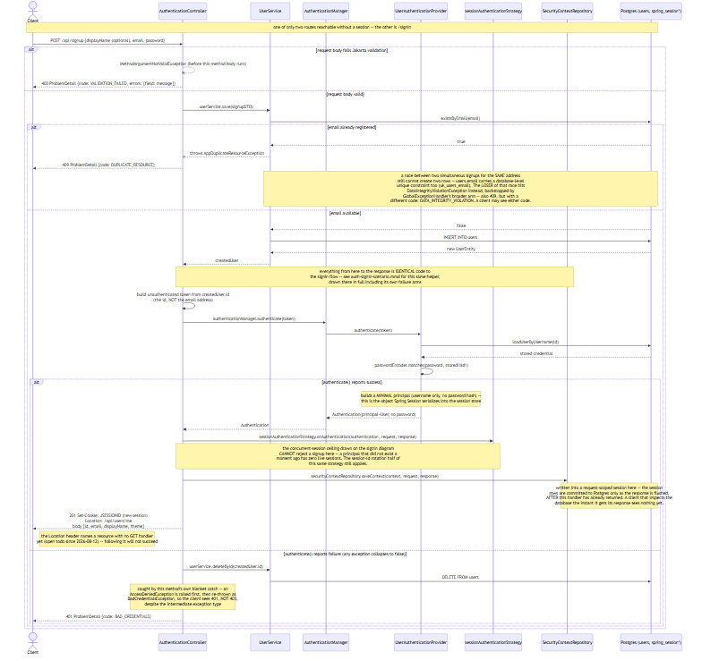
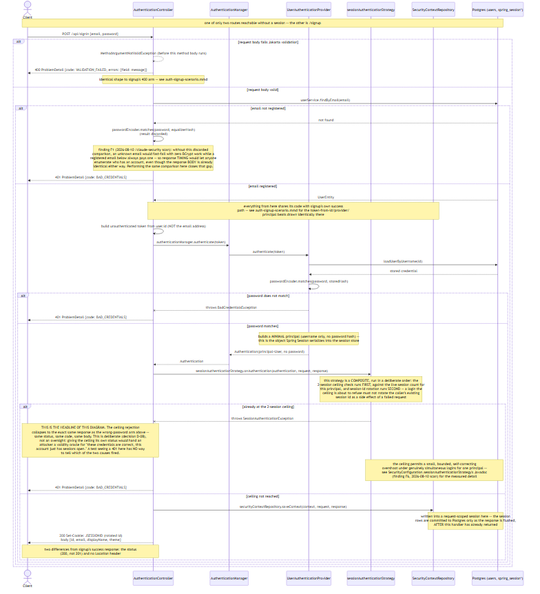

# Authentication Flows

This document is for a **frontend or QA engineer writing tests against this API**, on the
assumption of no JVM or Spring background. It answers one question: *what does a client actually
observe when it calls the two authentication routes, and what will silently break an automated
test suite driving them?* It is a **Scenarios (+1)** view per
[DIAGRAM_CONVENTIONS.md](DIAGRAM_CONVENTIONS.md) -- end-to-end, client-observable, traced at the
HTTP boundary rather than through Spring's internal machinery.

[docs/ARCHITECTURE.md](ARCHITECTURE.md) already carries a signin sequence diagram, drawn for a
different reader and a different question: a *security reviewer* asking "is this endpoint safe?",
naming findings by id (F1, F6, D-08) and drawing the BCrypt timing equalizer and the accepted
TOCTOU window in detail. That diagram stays the authoritative security-review artifact. This
document is complementary, not competing -- it draws the same underlying code from the client's
side of the wire, adds `POST /api/signup` (not drawn there at all), and closes with the
session/cookie/CORS facts a Playwright suite needs and a security review does not.

## Sign up

**`POST /api/signup`** -- one of only two routes reachable without a session (the other is
`/signin`).

### Request body

| Field | Required | Constraint |
|---|---|---|
| `email` | yes | a syntactically valid email address |
| `password` | yes | 8-64 characters; at least one uppercase letter, one lowercase letter, one digit, and one special character |
| `displayName` | no | if present, must be non-blank and 3-32 characters |

### Responses

| Status | Code | Cause |
|---|---|---|
| `201` | -- | Account created and immediately signed in |
| `400` | `VALIDATION_FAILED` | Request body fails bean validation (runs before the handler method body) -- response carries a per-field `errors` map |
| `409` | `DUPLICATE_RESOURCE` | `email` is already registered (the checked, expected path) |
| `409` | `DATA_INTEGRITY_VIOLATION` | A race between two simultaneous signups for the same address -- the database's unique constraint backstops the checked guard above; the loser of the race lands here instead |
| `401` | `BAD_CREDENTIALS` | The account was created, but automatically signing it in immediately afterward failed for any reason -- the just-created account is rolled back (deleted) and the client sees a generic credentials failure, not a 403, despite an intermediate access-denied exception internally |

[diagram source](diagrams/auth-signup-scenario.mmd)

**What this means for a test:** two traps are easy to miss. First, the `201`'s `Location` header
names `/api/users/me`, and that route has no `GET` handler yet -- a test that follows the
`Location` header will fail, not because of a test bug. Second, running the same signup request
twice against a database that is not reset between runs will hit the `409` arm on the second run
rather than the `201` arm the first time produced -- a suite that assumes a clean signup on every
run must either randomize the email address per run or reset state between runs.

## Sign in

**`POST /api/signin`** -- the other route reachable without a session.

### Request body

| Field | Required | Constraint |
|---|---|---|
| `email` | yes | a syntactically valid email address |
| `password` | yes | 8-64 characters; at least one uppercase letter, one lowercase letter, one digit, and one special character |

### Responses

| Status | Code | Cause |
|---|---|---|
| `200` | -- | Signed in |
| `400` | `VALIDATION_FAILED` | Request body fails bean validation -- same shape as signup's `400` |
| `401` | `BAD_CREDENTIALS` | Unknown email, wrong password, **or** the caller is already at the 2-session ceiling -- all three collapse to the exact same response |

[diagram source](diagrams/auth-signin-scenario.mmd)

**What this means for a test:** a `401` on this route has three distinct causes a client cannot
tell apart -- an unregistered email, a wrong password, and a rejected third concurrent session for
an otherwise-valid login. A failing signin in a test is therefore not, by itself, evidence that the
password is wrong; see the concurrent-session ceiling below, which is the cause most likely to
produce a `401` a test author did not expect.

## What will break your E2E suite

This section is the reason this document exists as its own file rather than a paragraph inside
[ARCHITECTURE.md](ARCHITECTURE.md). Each item below states a fact, the property or constant it
comes from, and the consequence for a test suite -- not just the fact alone.

- **The concurrent-session ceiling is 2, per user, and is real across parallel test workers.**
  `SecurityConfiguration.MAX_CONCURRENT_SESSIONS = 2`. It is counted from live rows in the shared,
  JDBC-backed session store, not per application process, so it holds identically whether the
  suite runs against one instance or several. **Consequence:** an E2E suite that runs more than 2
  parallel workers signed in as one seeded fixture user will get `401 BAD_CREDENTIALS` from the
  third worker onward -- a response that reads exactly like a wrong password (see the collapsed
  `401` above). **Mitigation:** give each parallel worker its own fixture user, or call
  `POST /api/logout` between tests that share one.
- **Two different session lifetimes exist by design, and the mismatch bites in a specific
  direction.** The session cookie (`server.servlet.session.cookie.name=JSESSIONID`)'s
  `server.servlet.session.cookie.max-age` is `600` (10 minutes);
  the server-side session timeout, `spring.session.timeout`, is `180m` (180 minutes). These are not
  a typo of each other. **Consequence:** the browser discards the cookie long before the server
  would ever expire the session -- a long-running suite that logs in once and keeps working past 10
  minutes will start getting `401 UNAUTHENTICATED` responses (no session cookie presented at all)
  while the server-side session backing that login is still perfectly alive.
- **The session cookie's `SameSite` policy is `strict`** (`server.servlet.session.cookie.same-site`).
  **Consequence:** a test harness that drives this API's cookie from a different site than the one
  the browser considers "current" (e.g. a test runner opening the API directly in one tab while the
  frontend runs on another origin, or certain cross-site redirect-based auth flows) will find the
  cookie not sent at all, producing the same `401 UNAUTHENTICATED` as no login having happened.
- **CORS is credentialed and origin-allow-listed, not wildcarded.** `CorsConfig` sets
  `allowCredentials(true)`, which the CORS spec forbids combining with a wildcard origin -- so the
  allow-list is explicit, read from `app.cors.allowed-origins` (defaults:
  `http://localhost:5173,http://localhost:3000`). Allowed methods: `GET, POST, PUT, PATCH, DELETE`.
  **Consequence:** a test origin absent from that list gets a normal server response that the
  *browser* then drops before the test's HTTP client ever sees a body -- indistinguishable from a
  network failure unless the property is checked first.
- **The session id rotates on every successful authentication** (`ChangeSessionIdAuthenticationStrategy`,
  run as the second half of the same composite strategy drawn above). **Consequence:** a test must
  not cache or assert a stable session id across a login -- the id after signin is guaranteed to
  differ from any id the client held before it.
- **CSRF protection is disabled** (`http.csrf(AbstractHttpConfigurer::disable)`). **Consequence:**
  there is no CSRF token to fetch before a mutating request -- a test author coming from a
  traditional Spring MVC app will look for one and will not find it; none is needed.
- **`401` and `403` mean different things, and only one of them is a credentials problem.** A
  request with no valid session at all is answered by the security filter chain itself, before any
  application code runs, with `401` and `code: UNAUTHENTICATED`. A request with a *valid* session
  that touches a resource owned by someone else is answered by application code with `403` and
  `code: ACCESS_DENIED`. **Consequence:** a `401` never means "your data was wrong" -- it means "you
  were not signed in at all." See [ARCHITECTURE.md](ARCHITECTURE.md)'s four-way `401`/`403`/`400`/
  `409` rejection diagram for the full split across all four statuses.
