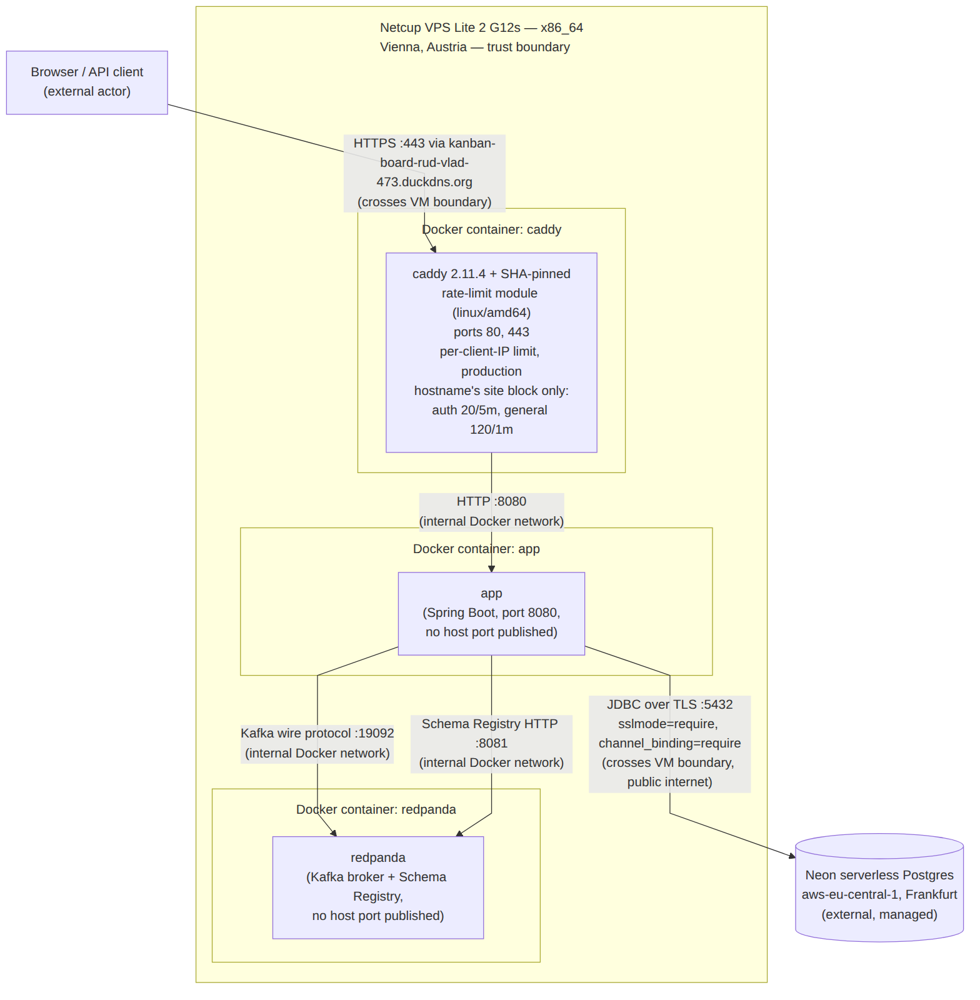
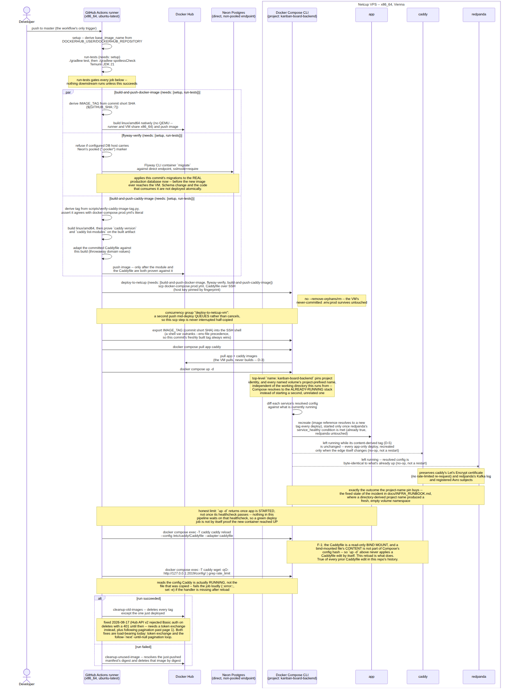

# Infrastructure Architecture

This document describes the production deployment topology introduced by v1.2's Infra Migration
milestone (Phase 5): a Netcup VPS Lite 2 G12s VM (Vienna, x86_64) running the application, a
self-hosted Redpanda broker, and Caddy for automatic public HTTPS, backed externally by Neon
serverless Postgres (Frankfurt) and delivered via GitHub Actions. The original target was Oracle
Cloud's Always Free A1 Flex (ARM64); it was replaced after Oracle's free-tier capacity in the
planned region proved structurally unavailable — see `docs/INFRA_RUNBOOK.md` and Phase 5 Plan
05-03's SUMMARY for the pivot rationale.

Per [`docs/DIAGRAM_CONVENTIONS.md`](DIAGRAM_CONVENTIONS.md), each diagram below is one deliberate
Kruchten 4+1 view, not an ad hoc mix of concerns. The two views chosen are the ones that matter
most for this deployment: **Physical/Deployment** (what runs where, on what hardware) and
**Scenario (+1)** (the one end-to-end flow — push to master, deploy — traced across the other
views).

## Physical/Deployment View

Maps software to physical/hardware nodes, with every node labelled by its platform/CPU
architecture — the discipline this project adopted specifically because a plain "what talks to
what" diagram would not have surfaced the CI pipeline building an x86_64-only image for an ARM64
deploy target (see `DIAGRAM_CONVENTIONS.md`'s own note on this).

[diagram source](diagrams/infra-physical-deployment.mmd)

**Externally reachable vs. internal-only:** only Caddy's ports 80 and 443 are published on the
VM's host network and reachable from the internet (443 serves traffic, 80 exists solely for the
Let's Encrypt HTTP-01 challenge and Caddy's automatic HTTP→HTTPS redirect). The app's port 8080
and Redpanda's Kafka (`19092`) and Schema Registry (`8081`) listeners publish no host port at all
— every edge among `caddy`, `app`, and `redpanda` stays on the Compose-internal Docker network and
never crosses the VM's trust boundary. This is the entirety of INFRA-08: the only two host ports
punched through the VM's network layers by Docker are 80 and 443.

**Where TLS terminates:** Caddy terminates public TLS at the VM boundary using an automatically
obtained, publicly trusted Let's Encrypt certificate (no self-signed/internal TLS). Traffic from
Caddy to the app inside the VM is plain HTTP — safe only because that hop never leaves the
internal Docker network. The connection from the app to Neon is a second, independently encrypted
hop: TLS required (`sslmode=require`) with channel binding (`channel_binding=require`), terminated
between the app container and Neon's endpoint, unrelated to Caddy's certificate.

**Stateful components and where state lives:** the VM itself holds no user data of record — every
piece of durable application state lives either in Neon (the system of record for all domain data)
or in two named Docker volumes scoped to operational/transport concerns: Redpanda's data volume
(the Kafka log and Schema Registry's internal topics — replayable operational state, not the
source of truth) and Caddy's certificate/state volume (so container recreation reuses the existing
Let's Encrypt certificate instead of triggering a rate-limited re-request). Losing either named
volume loses operational continuity, not user data.

## Scenario (+1) View — Delivery Path

Traces one key end-to-end scenario — push to `master` through to a running deploy — across the
other views, confirming they stay consistent with each other. `deploy.yml` holds 14 jobs as of
quick task 260903-dvp (2026-09-03, up from 7 when this note was first written); this diagram
traces the **production** delivery path only (`setup` → `run-tests` →
`{build-and-push-docker-image, flyway-verify, build-and-push-caddy-image}` →
`deploy-to-netcup` → `register-schemas-production` / `cleanup-old-images` /
`cleanup-unused-image`) — the nonprod jobs (`flyway-verify-nonprod`, `deploy-to-nonprod`,
`health-check-nonprod`, `cleanup-old-images-nonprod`, `cleanup-unused-image-nonprod`) exist and
are deliberately not drawn here; that is this diagram's known limit, not an omission to fix.

[diagram source](diagrams/infra-delivery-scenario.mmd)

**Externally reachable vs. internal-only (delivery path):** the GitHub Actions runner reaches
Docker Hub and Neon's direct endpoint over the public internet (both require real network
egress); the SSH hop to the VM is authenticated via a pinned host-key fingerprint, not left to
`StrictHostKeyChecking` defaults. None of these delivery-path connections touch Redpanda or the
app's internal-only listeners: the pipeline talks to the VM's SSH port only, and Caddy's public
HTTPS is not part of the delivery path at all.

**Where TLS terminates (delivery path):** the SSH connection from the runner to the VM is
encrypted end-to-end by SSH itself, independent of Caddy's certificate. The `flyway-verify` job
runs the pinned Flyway CLI container's `migrate` against this repo's own
`src/main/resources/db/migration` scripts, over Neon's **direct** (non-pooled) endpoint
specifically for this job — a guard step refuses to proceed if the configured `DB_HOST` carries
Neon's `-pooler` marker, since transaction-mode pooling does not support DDL/schema migration the
way a direct connection does (see `docs/INFRA_RUNBOOK.md`).

**Stateful components (delivery path):** Docker Hub holds the built image tags (build artifacts,
not user data); GitHub Actions itself holds no durable state between runs. No step in this
pipeline writes application data — `flyway-verify` only applies this repo's own Flyway migrations,
and the deploy step only replaces running containers.

**The VM-side container switch:** `docker compose up -d` recreates `app` every deploy, because its
`image:` reference (`rudenkovladimir/kanban-board-backend:${IMAGE_TAG}`) resolves to a new tag on
every commit. `caddy` (quick task 260903-dvp, D-5) and `redpanda` are left running while their
resolved configuration is byte-identical to what is already up — a no-op for them, not a restart
— but this is a *conditional* outcome for `caddy`, not an unconditional one: its `image:` is now a
content-derived literal (`rudenkovladimir/kanban-board-caddy:2.11.4-rl5625512f`) that only changes
when `docker/caddy/Dockerfile` itself changes, so a routine app-only deploy leaves it running,
while a Caddy-affecting change recreates it. This outcome depends on `docker-compose.prod.yml`'s
top-level `name: kanban-board-backend` pin: it makes project identity, and every named volume's
project-prefixed name, independent of the directory the command runs from, so Compose converges
the already-running stack instead of starting a second, unrelated one against fresh, empty
volumes — see `docs/INFRA_RUNBOOK.md` for the incident that motivated the pin, where a
directory-derived project name did exactly that and briefly lost the registered Avro schemas.
Honest limit: nothing in this pipeline waits for the new `app` container's healthcheck — `up -d`
returns once the container is started, not once it is healthy — so a green `deploy-to-netcup` job
is not by itself proof the new container reached `UP`.

**The Caddy reload (F-1, quick task 260903-dvp):** `Caddyfile` is bind-mounted read-only into the
`caddy` container, and a bind-mounted file's *content* is not part of Compose's config hash — so
`up -d` alone is a no-op for `caddy` on every deploy where its `image:` tag is unchanged, which
means a Caddyfile edit had zero effect in production until this change. `deploy-to-netcup` now
runs `docker compose exec -T caddy caddy reload --config /etc/caddy/Caddyfile --adapter caddyfile`
immediately after `up -d`, then reads the config Caddy is actually *running* back from its admin
API (`http://127.0.0.1:2019/config/`) and fails the job loudly if the expected handler is absent
— this is what actually proves the reload took effect, rather than assuming it from a copied file.

That readback address must stay `127.0.0.1` and must never be written as `localhost` (observed
2026-09-03, `caddy:2.11.4`): Caddy's admin API binds IPv4 only, while the image's `/etc/hosts`
carries both a `127.0.0.1 localhost` and a `::1 localhost` record, and the image's BusyBox `wget`
tries the IPv6 record and treats the connection refusal as terminal instead of falling back. The
`localhost` form therefore fails every time against a perfectly healthy listener. It is
fail-closed, but it lands *after* `up -d` has already swapped in the new `app` image, so it would
redden every deploy and let `cleanup-unused-image` (`if: failure()`) delete the app manifest then
running on the VM. Falsifier: if a future base image ships a `wget` that falls back to the second
address record, or Caddy's admin API starts binding dual-stack, this constraint dissolves.

**Where the Caddy image-tag invariant is enforced:** `.github/workflows/invariant-checks.yml` runs
`scripts/verify-caddy-image-tag.py` on every push and pull request, and `deploy.yml`'s
`build-and-push-caddy-image` job runs it again before building. The PR-triggered workflow is the
one that makes tag drift unmergeable — `deploy.yml` triggers on push-to-`main` only, so on its own
it can block a deploy but never a merge.

## Maintenance Note

This document describes `docker-compose.prod.yml`, `Caddyfile`, `docker/caddy/Dockerfile`,
`.github/workflows/invariant-checks.yml`, and
`.github/workflows/deploy.yml` — specifically the `build-and-push-docker-image` and
`build-and-push-caddy-image` jobs' `linux/amd64` platform target (the deploy target pivoted from
Oracle A1 Flex/ARM64 to Netcup/x86_64 in Phase 5), the 14 job names and the job graph (`needs:`
edges) in `deploy.yml`, and `docker-compose.prod.yml`'s top-level `name: kanban-board-backend`
project pin plus the `app` and `caddy` services' `image:` references. If any of those facts
changes — a job renamed or added, a build platform changed, or any of those `docker-compose.prod.yml`
lines changed — update this document, and the diagrams it links to, in the same change: it is the
single checked-in description of what actually runs where.
