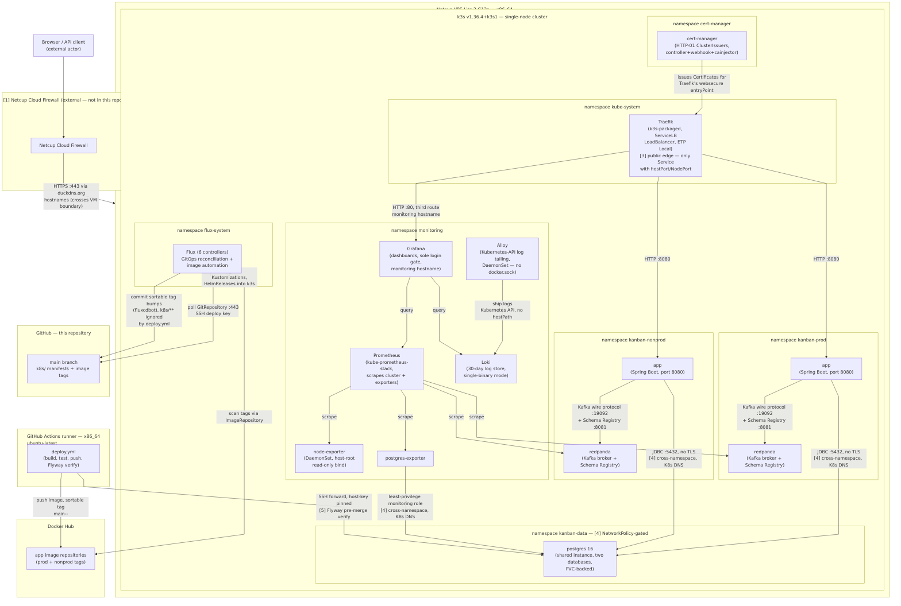
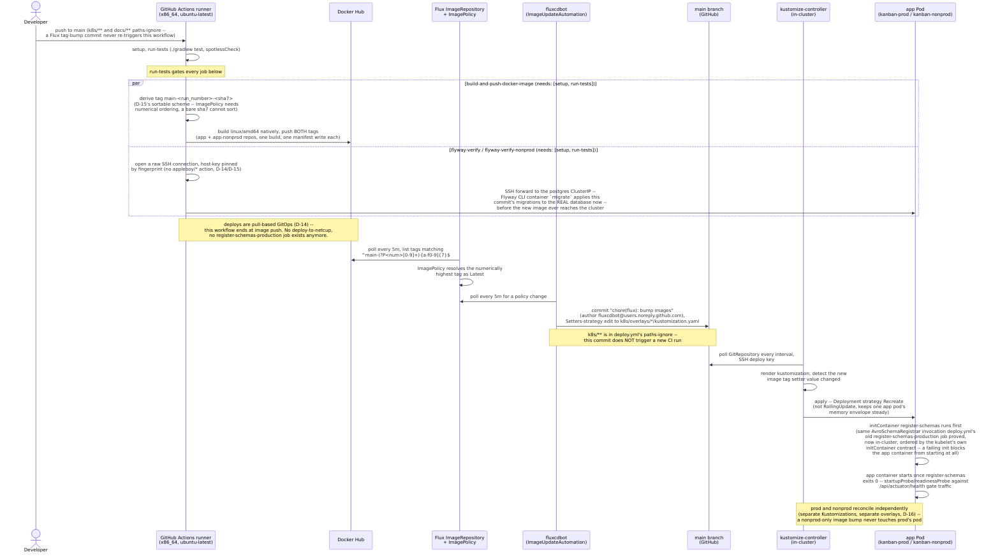
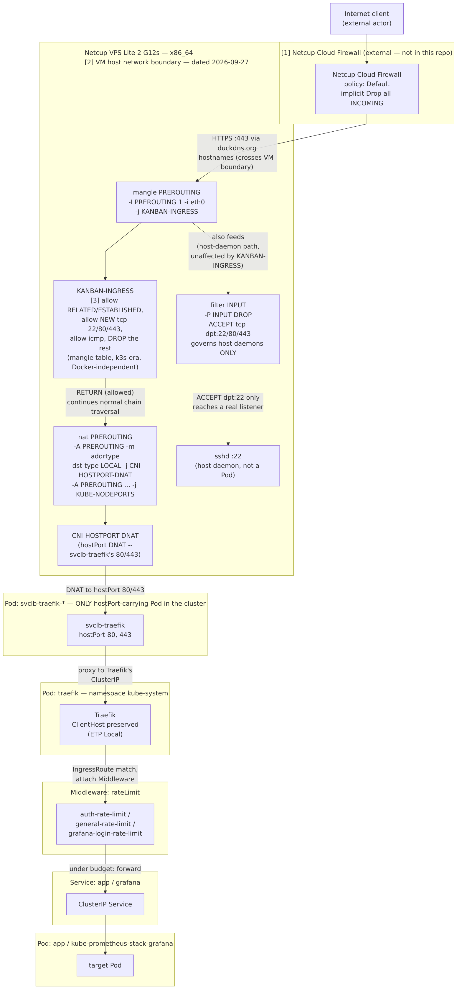

# Infrastructure Architecture

This document describes the production deployment topology as of Phase 13's k3s cutover: a
single-node k3s v1.36.4+k3s1 cluster on a Netcup VPS Lite 2 G12s VM (Vienna, x86_64), reconciled by
Flux (GitOps, pull-based), fronted by Traefik (the k3s-packaged edge), with cert-manager issuing
Let's Encrypt certificates, a self-hosted PostgreSQL 16 StatefulSet, self-hosted Redpanda
StatefulSets per environment, and kube-prometheus-stack/Loki/Alloy for observability. Docker
Compose left the production request path at Plan 13-06's cutover (2026-09-26) and was
decommissioned on 2026-09-30 (Plan 13-10, D-04): its containers, volumes and networks are deleted,
Docker Engine is disabled on the VM, and the Compose/Caddy files are gone from this repository (local
dev keeps its own `docker-compose.yml`). The original
deploy target was Oracle Cloud's Always Free A1 Flex (ARM64); it was replaced after Oracle's
free-tier capacity in the planned region proved structurally unavailable — see
`docs/INFRA_RUNBOOK.md` and Phase 5 Plan 05-03's SUMMARY for that earlier pivot rationale.

**The database moved onto the VM in Phase 11 (2026-08-26)** and has stayed there through the k3s
cutover — Postgres runs as a StatefulSet in namespace `kanban-data` now, reached by both app
namespaces cross-namespace via Kubernetes DNS
(`postgres.kanban-data.svc.cluster.local`), not via a Compose container name. Neon serverless
Postgres (Frankfurt) was the system of record through v1.2; that project has since been deleted.
Every claim below about where data lives, what crosses the VM boundary, and how migrations reach
the database reflects this VM-hosted, now-Kubernetes-native, reality.

Per [`docs/DIAGRAM_CONVENTIONS.md`](DIAGRAM_CONVENTIONS.md), each diagram below is one deliberate
Kruchten 4+1 view, not an ad hoc mix of concerns. Three views are drawn — one Physical/Deployment
and two Scenario (+1) views, added at different times for different reasons: **Physical/Deployment**
(what runs where, on what hardware); **Scenario (+1) — Delivery Path** (push to master through to a
running deploy, traced across the other views); and **Scenario (+1) — Inbound Packet Path** (added
2026-09-05, tracing one inbound request through the VM's network layers rather than through the
deploy pipeline). Updated from "the two views chosen" (singular Scenario) in the same change that
added the third — leaving that sentence stale here would repeat exactly the failure this document
already apologises for below with Neon.

## Physical/Deployment View

Maps software to physical/hardware nodes, with every node labelled by its platform/CPU
architecture — the discipline this project adopted specifically because a plain "what talks to
what" diagram would not have surfaced the CI pipeline building an x86_64-only image for an ARM64
deploy target (see `DIAGRAM_CONVENTIONS.md`'s own note on this).

[diagram source](diagrams/infra-physical-deployment.mmd)

**Externally reachable vs. internal-only:** `svclb-traefik-*` is the ONLY Pod in the cluster
carrying a `hostPort` (80, 443) — confirmed live via `k3s kubectl get pods -A -o json` filtered for
`hostNetwork`/`hostPort`, and the only non-`ClusterIP` `Service` is `kube-system/traefik`
(`type: LoadBalancer`, k3s's own ServiceLB). Every app, Postgres, and Redpanda Service is
`ClusterIP` — reachable only from inside the cluster's own pod network (`10.42.0.0/16`), never
from the VM's host network directly. This is the k3s-era form of the same invariant Compose-era
INFRA-08 stated: exactly two host-level entry points (80, 443), both owned by the one edge
component.

**Where TLS terminates:** Traefik terminates public TLS at the VM boundary using
cert-manager-issued, publicly trusted Let's Encrypt certificates (HTTP-01 challenge, one
`ClusterIssuer` per environment). Traffic from Traefik to any backend Service inside the cluster is
plain HTTP — safe only because that hop never leaves the cluster's own pod network. **There is no
second TLS hop.** The app reaches Postgres at
`jdbc:postgresql://postgres.kanban-data.svc.cluster.local:5432/${DB_NAME}`, and that JDBC URL
carries no `sslmode`/`channel_binding` parameter — safe for the identical reason the Traefik→app
hop is: cross-namespace Kubernetes DNS never leaves the cluster.

**Stateful components and where state lives:** the VM still holds the system of record, now as
Kubernetes-native storage. Durable application state lives in Postgres's `PersistentVolumeClaim`
(`local-path` StorageClass, 5Gi) in namespace `kanban-data`. Alongside it sit PVCs scoped to
operational/transport concerns — each Redpanda StatefulSet's own volume (the Kafka log and Schema
Registry's internal topics, per environment: replayable operational state, not the source of
truth), Prometheus's (10Gi) and Loki's (10Gi) retention-window stores, and Grafana's (1Gi)
dashboard/session store. Losing any of the observability PVCs loses history, not correctness;
**losing the Postgres PVC loses user data outright.**

That raises a real, currently-open exposure rather than a theoretical one: there is still no
backup. See `docs/INFRA_RUNBOOK.md`'s "Backups and restore" section, which documents a
`pg_dump`/`pg_restore` procedure that has been written but never executed, and the todo
`.planning/todos/pending/2026-08-20-no-documented-backup-restore-runbook-for-prod-db.md`, which is
deliberately still open for the scheduled dump, off-host storage, retention policy and one proven
test restore — this gap did not close with the k3s cutover.

**Numbered trust boundaries (renumbered for k3s, Plan 13-09):** `[1]` is deliberately marked
`(external — not in this repo)` — the Netcup Cloud Firewall is a control-panel setting on Netcup's
infrastructure, not a file in this repository, so it is reviewed in no pull request here and its
actual ruleset cannot be confirmed from the code. `[2]` marks `KANBAN-INGRESS`, the `mangle
PREROUTING` firewall installed in Plan 13-08 specifically because k3s's NodePort/hostPort DNAT
(via kube-router's `KUBE-NODEPORTS` and the CNI's `CNI-HOSTPORT-DNAT`) never traverses
`DOCKER-USER` at all — the old Compose-era chain governs nothing on this cluster; `mangle
PREROUTING` is the one hook point both DNAT paths share, regardless of which eventually claims the
packet. `[3]` marks Traefik's public edge (websecure entryPoint, `externalTrafficPolicy: Local`
so ServiceLB preserves the real client address instead of collapsing every client into one
rate-limit bucket). `[4]` marks the cross-namespace Kubernetes-DNS boundary every app→Postgres and
exporter→Postgres edge crosses, gated by a `NetworkPolicy` in `kanban-data` limiting reachability
to pods carrying the `kanban-board/postgres-client: "true"` label. `[5]` marks the CI-to-VM SSH
forward `flyway-verify`/`flyway-verify-nonprod` open, host-key pinned by fingerprint, used only for
pre-merge migration verification — it never carries application traffic.

**The observability stack (Phase 13, D-07/D-17):** kube-prometheus-stack (Prometheus + Grafana +
kube-state-metrics + node-exporter), Loki, and Alloy monitor BOTH environments from the shared
`monitoring` namespace — there is no separate nonprod monitoring stack, matching the Compose-era
single-shared-instance model. Grafana is the ONLY one of these publicly reachable, through its own
`IngressRoute` on the monitoring hostname; its own login remains the sole AUTHENTICATION gate in
front of every metric this stack collects, backed by a login-path-scoped `rateLimit` Middleware
(`grafana-login-rate-limit`, re-derived from Traefik's own token-bucket semantics in Plan 13-08).
Alloy replaces Promtail — it tails pod logs through the Kubernetes API (`loki.source.kubernetes`),
not a `docker.sock`/hostPath mount, closing the read-only-`docker.sock`-grant exception the
Compose-era `cadvisor`/`promtail` pair needed. `node-exporter` runs as a DaemonSet with
`hostRootFsMount` (a scoped, Kubernetes-native equivalent of the Compose-era `/:/host:ro,rslave`
bind), `hostNetwork: false`, `hostPID: false` — the same host-visibility trade-off as before, made
without needing the host-networking escape hatch Compose's node-exporter required.

**Host-wide container count.** Every environment's workloads and the entire observability/platform
stack now run as Kubernetes Pods inside the single k3s cluster rather than as two separate Compose
projects — confirmed via `k3s kubectl get pods -A -o json` reduced to a per-container count (34
containers across 7 namespaces at last count, Plan 13-09's T0 snapshot: `cert-manager` ×3,
`flux-system` ×6, `kanban-data` ×1, `kanban-nonprod` ×2, `kanban-prod` ×2, `kube-system` ×7,
`monitoring` ×13). Docker Compose's process-isolation boundary (one Compose project's `docker
compose ps` silently excluding the other project's containers, the exact failure mode the
pre-cutover version of this document warned about) no longer applies — a single `k3s kubectl get
pods -A` enumerates the entire host-wide workload set by construction.

## Scenario (+1) View — Delivery Path

Traces one key end-to-end scenario — push to `main` through to a running deploy — across the
other views, confirming they stay consistent with each other. `deploy.yml` holds 7 jobs as of
Plan 13-10 (8 after Plan 13-06's D-14/D-15 rewrite): `setup`, `run-tests`, `build-and-push-docker-image`,
`flyway-verify`, `flyway-verify-nonprod`, `cleanup-old-images`, `cleanup-old-images-nonprod`
(`build-and-push-caddy-image` was removed in Plan 13-10 together with the Caddy edge). **Deploys are now
pull-based GitOps (D-14)** — this workflow ends at image push. There is no `deploy-to-netcup`,
`deploy-to-nonprod`, `register-schemas-production`, or `health-check-nonprod` job anymore; Flux's
image-automation controllers and `kustomize-controller` own the rest of the path, entirely inside
the cluster.

[diagram source](diagrams/infra-delivery-scenario.mmd)

**Externally reachable vs. internal-only (delivery path):** the GitHub Actions runner reaches
Docker Hub over the public internet to push images, and nothing else in the delivery path touches
the cluster directly except `flyway-verify`/`flyway-verify-nonprod`'s own SSH forward (host-key
pinned by fingerprint, `[5]` above) to Postgres's `ClusterIP` for pre-merge migration
verification. Flux itself initiates every connection FROM the cluster outward — it polls GitHub
(the `GitRepository` source, SSH deploy key) and Docker Hub (the `ImageRepository` scan) on its
own interval; nothing external ever pushes into the cluster.

**Where TLS terminates (delivery path):** the SSH connection from the runner to the VM (for
Flyway verification) is encrypted end-to-end by SSH itself. Flux's poll of GitHub uses its own SSH
deploy key, independent of Traefik's certificate. Neither touches the public HTTPS edge at all.

`flyway-verify` runs **on the VM**, not on the runner and not in-cluster — this mechanism is
unchanged by the k3s cutover. The runner SCPs this repo's `src/main/resources/db/migration`
scripts to the VM and then, over SSH, runs the pinned Flyway CLI container reaching the database
at Postgres's `ClusterIP` directly (not through Kubernetes DNS, since the runner's SSH session has
no in-cluster resolver) — this still applies migrations to the REAL database before the new image
ever reaches the cluster.

**Stateful components (delivery path):** Docker Hub holds the built image tags (build artifacts,
not user data); GitHub Actions itself holds no durable state between runs; Flux's own state (which
tag is Latest per `ImagePolicy`, the last-applied revision per `Kustomization`) lives entirely
in-cluster, not in the pipeline. No step in the GitHub Actions pipeline writes application data —
`flyway-verify`/`flyway-verify-nonprod` only apply this repo's own Flyway migrations.

**The image-tag bump and the reconcile it triggers (D-15, D-16):** `build-and-push-docker-image`
derives a sortable tag, `main-<run_number>-<sha7>`, and pushes it to BOTH the prod and nonprod
Docker Hub repositories from one build. Each repository has its own Flux `ImageRepository` (5m
poll) and `ImagePolicy` (`^main-(?P<num>[0-9]+)-[a-f0-9]{7}$`, numerical order on `$num` — a bare
sha7 cannot sort, which is exactly why the tag scheme changed from Compose-era's bare short-SHA).
Once an `ImagePolicy` resolves a new Latest tag, `ImageUpdateAutomation` (author `fluxcdbot`)
commits a `Setters`-strategy edit to the matching overlay's `kustomization.yaml` on `main` --
`deploy.yml`'s own `paths-ignore` excludes `k8s/**`, so this commit does not re-trigger a build
(the exact infinite-loop guard the Compose-era pipeline never needed). `kustomize-controller`
polls `main` independently and applies the new tag once it sees the commit; the app `Deployment`'s
`strategy: Recreate` (not `RollingUpdate`) discards the old Pod before starting the new one,
keeping one app Pod's memory envelope steady rather than transiently doubling it.

**Schema registration moved in-cluster (D-14).** The Compose-era `register-schemas-production`
CI job is gone. In its place, the app `Deployment`'s own `register-schemas` `initContainer` runs
the identical `AvroSchemaRegistrar` invocation that job used to prove, now ordered by the
kubelet's own initContainer contract before every deploy's `app` container starts — a stronger
guarantee than a CI job that ran once, separately, and could drift from what actually deployed.

**Independent prod/nonprod reconciliation (D-16):** prod and nonprod each have their own
`Kustomization`, `ImageRepository`, and `ImagePolicy` — a nonprod-only image tag bump reconciles
only the `kanban-nonprod` namespace's `Deployment`; prod's own Pod is untouched, and vice versa.
This replaces the Compose-era single-`docker compose up -d`-per-project model with two
independently-reconciling GitOps loops that happen to share one physical VM.

## Scenario (+1) View — Inbound Packet Path

Traces one inbound packet, from an internet client through the Netcup Cloud Firewall, the VM's
network stack, and into Traefik and the target Service/Pod — a different Scenario from the one
above, which traces a *deploy*; this one traces a *request*. Redrawn for k3s in Plan 13-09 — the
Compose-era `DOCKER-USER` chain this section used to describe governs nothing on this cluster at
all (k3s's NodePort/hostPort DNAT never traverses it); `KANBAN-INGRESS` (Plan 13-08) is its
Docker-independent replacement.

[diagram source](diagrams/infra-packet-path-scenario.mmd)

**Reproduce this yourself on the VM** with the command that proves the ruleset:
`iptables -t mangle -S PREROUTING` (should show `-A PREROUTING -i eth0 -j KANBAN-INGRESS` as the
first rule) and `iptables -t mangle -S KANBAN-INGRESS` (see `docs/INFRA_RUNBOOK.md`'s "Edge
hardening on k3s — Plan 13-08" section for the full output and context).

**Why `mangle PREROUTING`, not `DOCKER-USER`.** `DOCKER-USER` only ever sees Docker's own DNAT'd
traffic. k3s's NodePorts and hostPorts are DNAT'd by kube-router's `KUBE-NODEPORTS` (`nat` table)
and the CNI's `CNI-HOSTPORT-DNAT` — neither passes through `DOCKER-USER` at all, so the
Compose-era chain this section used to describe is now dead weight, not a security control. The
one hook point that runs before both DNAT paths, regardless of which eventually claims the packet,
is `mangle PREROUTING` — `KANBAN-INGRESS` (Plan 13-08) installs there instead.

**`KANBAN-INGRESS`'s ruleset**, defined in `infra/vm/k3s-host-firewall.sh` and installed via
`infra/vm/k3s-host-firewall.service` (`Type=oneshot`, `RemainAfterExit=yes` — neither Docker nor
k3s itself ever touches `mangle PREROUTING`, so nothing races this chain's own state, unlike
`DOCKER-USER`'s dependency on `PartOf=docker.service`): allow `RELATED,ESTABLISHED` traffic first,
allow NEW TCP to 22/80/443 (a literal copy of the live `filter INPUT` allow-list captured at
install time — INPUT governs host daemons, a slower-changing, separately-reviewed surface from
what k3s exposes via Services), allow ICMP, then drop every other NEW connection.

**Proven, not merely stated (Plan 13-08, 2026-09-27).** Netcup's own Cloud Firewall (`[1]` above)
already blocks Traefik's `websecure` NodePort (30104) from the public internet before packets
reach this VM's own iptables at all — so an unmodified off-box probe times out for the *right
general reason* but can never move the `KANBAN-INGRESS` counter under test, since a packet Layer 2
drops never reaches this layer. Resolved the same way quick task 260906-feq proved `DOCKER-USER`:
a temporary, scoped Netcup console rule let one probe source IP reach the VM's own iptables
without bypassing the rule under test. Measured: the chain's DROP-rule packet counter moved 5 → 10
packets across one probe against the NodePort, while the probe against the NodePort itself still
timed out (the required inversion), and `nc -z` against 443 and 22 both connected immediately
throughout. `systemctl restart k3s` was confirmed not to disturb `mangle PREROUTING` either — full
detail and the exact commands in `docs/INFRA_RUNBOOK.md`'s "Edge hardening on k3s" section.

**Runtime exposure inventory, confirmed the same day:** `k3s kubectl get svc -A` shows exactly one
non-`ClusterIP` Service (`kube-system/traefik`), and the only Pods carrying `hostNetwork` or any
`hostPort` are `svclb-traefik-*` — both match the "only Traefik is public" invariant this chain
exists to enforce.

**What this layer deliberately does not cover: IPv6**, unchanged from the Compose-era finding.
`ip6tables -P INPUT ACCEPT` remains this VM's live policy; `KANBAN-INGRESS` is IPv4-only by design
(see `infra/vm/k3s-host-firewall.sh`'s own header for the scope decision). This carries forward
from the `DOCKER-USER`-era gap rather than reopening it — the underlying IPv6 exposure was never
closed, only re-described against the new chain that replaced its IPv4 sibling.

**`DOCKER-USER` is retired (Plan 13-10, 2026-09-30).** Docker Engine, containerd and
`docker-user-firewall.service` are disabled on the VM and `infra/vm/docker-user-firewall.*` is
deleted from the repository, so `KANBAN-INGRESS` is now the only forward-path filter, with the Netcup
Cloud Firewall outside it. Re-proven without Docker, and again after a reboot, in
`docs/INFRA_RUNBOOK.md`'s "Decommission Record — Plan 13-10": `mangle PREROUTING` still carries the
jump first, `nc` to the Traefik NodePort from off-box fails, and 22/443 connect. The DROP counter
did not move for that probe because Layer 2 drops it first, so counter attribution to
`KANBAN-INGRESS` after Docker's removal rests on the unchanged chain plus the 2026-09-27
attribution above, not on a fresh counter increase.

## Maintenance Note

**Compose/Caddy status (Plan 13-10):** Docker Compose and Caddy are removed. `docker-compose.prod.yml`,
`docker-compose.nonprod.yml`, `Caddyfile`, `docker/**`, the Compose-only gate scripts and
`infra/vm/docker-user-firewall.*` were deleted in the same change that decommissioned them on the
VM (D-04). Only the local-dev `docker-compose.yml` remains, and it is not a deployment artifact.

This document now describes: `k8s/**` (every Kustomize root — `flux-system`, `platform`,
`platform/cert-manager`, `platform/edge`, `data`, `data/postgres(-bridge)`, `base/app`,
`base/redpanda`, `monitoring/{controllers,configs}`, `overlays/{prod,nonprod}`), `infra/vm/k3s/`
(k3s config + pinned install wrapper), `infra/vm/k3s-host-firewall.*` (the `KANBAN-INGRESS`
ruleset + systemd unit), and `infra/vm/sshd/` (the sshd hardening this VM already carried forward
from Phase 5, unchanged by the k3s cutover but now cited here alongside its k3s-era siblings).
Also tracked: `.github/workflows/invariant-checks.yml` (three jobs: `public-dashboards`,
`k8s-manifests-valid`, `k8s-invariants`) and `.github/workflows/deploy.yml` — specifically the
`build-and-push-docker-image` job's `linux/amd64` platform target (the deploy target pivoted from
Oracle A1 Flex/ARM64 to Netcup/x86_64 in Phase 5) and the 7 job names (reduced from 14 across
Plans 13-05/13-06's removal of every SSH-based deploy/health-check/cleanup-unused-image job, and by
13-10's removal of the Caddy image job). If any of those facts changes — a job renamed or added, a
build platform changed, a new `k8s/` root added — update this document, and the diagrams it links
to, in the same change: it is the single checked-in description of what actually runs where.

What the observability stack scrapes, ships and provisions is defined by `k8s/monitoring/**` (the
Compose-era `docker/prometheus`, `docker/loki`, `docker/promtail`, `docker/grafana` and the
`kanban-metrics` network were deleted in 13-10) — exactly the kind of fact this document has already
gone stale on once.

**Where the database lives is on that list deliberately, added 2026-09-03.** It was not, and that
is how this document went on describing Neon as the system of record for the four months after
Phase 11 moved the database onto the VM — including a TLS hop that no longer exists and a Flyway
job that no longer runs where it said. The facts most worth listing here are the ones a reader
would never think to re-check, because they read as settled background rather than as
configuration.

**Also on this list, added 2026-09-11 (found while reviewing the README for resume-readiness):**
`README.md`'s "Production deployment" section embeds its own copy of
`docs/diagrams/infra-physical-deployment.mmd` plus a paragraph describing the same topology. Found
stale (still describing the pre-Phase-11 Neon topology, no observability stack, no Netcup Cloud
Firewall boundary) despite this document and the `.mmd` source already having been kept current —
nothing on this list previously named the README copy, so it drifted silently exactly like the
Neon case above. Update both the embedded diagram and its prose paragraph here whenever this
document's own Physical/Deployment facts change.

**Also on this list, added 2026-09-05 (quick task 260905-tw0):**

- **`docs/diagrams/*.mmd` and the render pipeline.** Every diagram's PNG is regenerated from its
  `.mmd` source with `scripts/render-diagrams.sh`, against the digest-pinned renderer named in that
  script's own header. Goes stale if a `.mmd` is hand-edited without re-running the script (its
  `--check` mode catches exactly that), or if the pinned digest is bumped without re-verifying it
  against the registry (see the script's own header for how).
- **The VM's iptables facts — `KANBAN-INGRESS`'s contents (Plan 13-08, superseding
  `DOCKER-USER` as the packet-path Scenario's subject in Plan 13-09).** The source of truth is
  `infra/vm/k3s-host-firewall.sh` (installed on the VM per `infra/vm/README.md`'s convention),
  not this document's prose. This document's packet-path Scenario describes the policy in force
  and the evidence it works, and must be updated again if the script's ruleset ever changes (a new
  published port, an IPv6 closure)
  — the same discipline that closed the prior `DOCKER-USER`-era staleness applies to whatever
  replaces today's seven-rule `mangle` policy.
- **The Netcup Cloud Firewall's policy, flagged as external state this repository cannot verify.**
  Both diagrams above mark it `[1] (external — not in this repo)` for exactly this reason: its
  ruleset lives in Netcup's control panel, not in a file this document can point at, so this
  document's description of it ("policy: Default") is only as current as whoever last checked the
  panel by hand. Goes stale silently if that policy changes and nobody updates this note.
