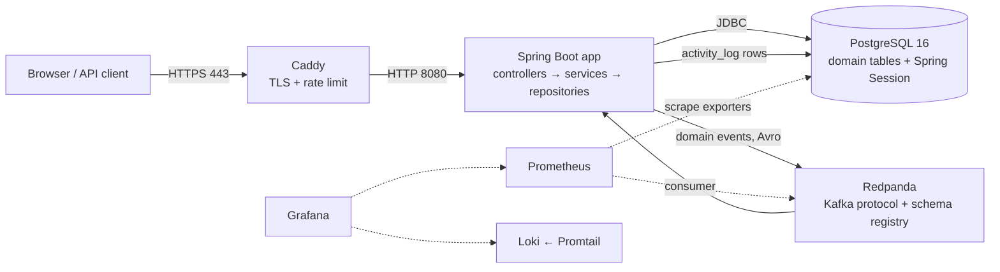

# 00 — Learning guide: how to read it

This guide explains every main architectural and technical decision in the Kanban Board Backend.
Each chapter covers one layer and links each claim to the code, test, or document that proves it.

The guide uses ASD-STE100 Simplified Technical English. Sentences are short, the voice is active,
and each word has one meaning.

## Who this guide is for

This guide is for the project owner. Use it to prepare for a design review or a technical
interview. After you read a chapter, you must be able to tell:

- what the layer does,
- how the mechanism works (the SQL, the HTTP response, the container, the job),
- why the project chose it,
- which alternatives the project rejected, and why,
- which limits and open items remain.

## Reading order

Read the chapters in this order. Each chapter lists the chapters it depends on in its
**Read first** line.

| # | Chapter | Decision IDs | What you learn |
|---|---------|--------------|----------------|
| 01 | [Domain model and schema](01-domain-model-and-schema.md) | DATA-01 … DATA-22 | Entities, ids, positions, Flyway migrations V1–V9 |
| 02 | [Persistence and queries](02-persistence-and-queries.md) | PERS-01 … PERS-17 | Repositories, N+1 fixes, bulk deletes, the `/full` read, transactions |
| 03 | [Optimistic locking](03-optimistic-locking.md) | LOCK-01 … LOCK-15 | `@Version`, the compare-before-mutate check, the 409 response |
| 04 | [Service layer and access control](04-service-layer-and-access-control.md) | SVC-01 … SVC-18 | Ownership chain, 403 vs 404, reorder, task move, cascades |
| 05 | [API layer](05-api-layer.md) | API-01 … API-23 | URLs, DTOs, MapStruct, validation, ProblemDetail errors, OpenAPI |
| 06 | [Security and sessions](06-security-and-sessions.md) | SEC-01 … SEC-21 | Session authentication, the session ceiling, 401 vs 403, the edge rate limiter |
| 07 | [Events and activity feed](07-events-and-activity-feed.md) | EVT-01 … EVT-24 | Domain events, Kafka/Redpanda, Avro, idempotency, the dead-letter topic |
| 08 | [Testing strategy](08-testing-strategy.md) | TEST-01 … TEST-22 | Testcontainers, query counts, ArchUnit, coverage, flaky tests |
| 09 | [Build, code quality and CI](09-build-quality-and-ci.md) | CI-01 … CI-31 | Gradle, Spotless, gitleaks, the deploy pipeline, invariant checks |
| 10 | [Infrastructure and deployment](10-infrastructure-and-deployment.md) | INFRA-01 … INFRA-26 | Netcup VPS, Compose, Caddy, self-hosted Postgres, nonprod |
| 11 | [Observability](11-observability.md) | OBS-01 … OBS-23 | Actuator, Prometheus, Grafana, Loki, public dashboards |

Chapter 05 uses the IDs API-01 … API-23. The planning requirements in
`.planning/milestones/v1.3-REQUIREMENTS.md` also use an `API-01` label. The two are not the same.

## How each chapter is built

Each chapter uses the same structure:

1. **Summary of decisions.** This is a table with one row for each decision ID.
2. **One section for each topic.** Each section has seven parts:
   - *What it is*
   - *How it works*
   - *Why we chose it*
   - *Alternatives we rejected*
   - *Trade-offs and limits*
   - *How we test it*
   - *Where this is recorded*
3. **Known gaps and open items.** This part includes the places where a document and the code
   disagree. In each case, the chapter follows the code.
4. **Questions to check your knowledge.** Each question has a hidden answer. Try to answer the
   question before you open the answer.

When a source does not record the reason for a decision, the chapter says "Reason not recorded".
The chapter then states only what the code shows. Do not give an invented reason in an interview.
Say that the reason is not recorded, and then explain the trade-off that the code shows.

## The system in one diagram

- Chapters 01–07 explain the application box and its data.
- Chapter 08 explains how the tests prove the application.
- Chapter 09 explains how code gets from a commit to an image.
- Chapter 10 explains the host, the network, and the containers.
- Chapter 11 explains the dashed lines: metrics and logs.

## Topics that cross chapters

Some topics appear in more than one chapter. Use this table to find all parts of one topic.

| Topic | Chapters |
|-------|----------|
| Reversed decisions: H2 → Testcontainers, EC2 → Netcup, Neon → self-hosted Postgres, 401 → 403 for ownership, plain-string 409 → ProblemDetail | 08, 10, 04, 03, 05 |
| The position columns and reorder | 01, 02, 04 |
| Ids: RandFlake, not ULID | 01, 07 |
| Error responses: 400, 401, 403, 404, 409 | 03, 04, 05, 06 |
| Bulk deletes and cascade order | 01, 02, 04 |
| Session storage in PostgreSQL | 01, 06 |
| Memory caps on a small VPS | 10, 11 |
| Rate limiting at the Caddy edge | 06, 09, 10 |

## Confirmed defects in the application

The chapter writers found some of these items when they read the code. A three-way review on
2026-09-23 found the others. The review ran each item against a live application and confirmed
it. The guide describes each defect. The code does not fix any of them.

| Defect | Observed result | Chapter |
|--------|-----------------|---------|
| Parallel updates with the same version | `200 500 500` in every round. The losers do not get 409. The 500 body names the entity class | 03, 05 |
| A real `POST /api/logout` | 500 `No static resource logout.` The session stays valid | 06 |
| Parallel renames to the same board name | Some losers get 500 with the SQL text in the body, and some get 409 | 01, 05 |
| A board `PUT` with only `version` | 500 with a NOT NULL violation and the SQL text | 03, 05 |
| An unknown route or a wrong HTTP method | 500 `INTERNAL_ERROR`, not 404 or 405 | 05 |
| An anonymous request to a protected route | 401, plus a new stored session and a `JSESSIONID` cookie | 06 |
| A task delete | The position gap stays, so the next task gets a duplicate position | 01, 04 |
| `GET /boards/{id}/full` | Columns and tasks come in id order. The flat reads use position order | 02, 04 |
| Pull requests | No workflow runs the Gradle tests on a pull request | 09 |
| `verify-postgres-memory-invariant.py` | No workflow runs it | 09, 10 |
| Production CORS | No `APP_CORS_ALLOWED_ORIGINS`, so the localhost defaults apply | 06 |

Most of the 500 responses have one cause. `GlobalExceptionHandler` is a plain
`@ControllerAdvice` with an `Exception.class` catch-all. Some exceptions reach it without a
dedicated handler. Examples are the Hibernate exceptions from a direct `entityManager.flush()` call.
Other examples are the Spring MVC exceptions for an unknown route or a wrong method. The catch-all turns each of these into a 500.

## Decision index

This index repeats the summary table of each chapter. Use it to find a decision by its ID.

### [01 — Domain model and database schema](01-domain-model-and-schema.md)

| ID | Decision | Main reason |
|---|---|---|
| DATA-01 | A strict five-level ownership tree: user → board → column → task → subtask, one foreign key per level | Every resource traces back to one owner, so the ownership check walks one chain |
| DATA-02 | One `@MappedSuperclass` (`BaseEntity`) for the id, plus small `Base*` interfaces shared by entities and DTOs | Java cannot override fields, so shared contracts use getter methods |
| DATA-03 | No explicit `fetch` attribute: to-one relations are EAGER, collections are LAZY (JPA defaults) | Measured: the EAGER parent chain loads in 1 query |
| DATA-04 | Collections in the board graph are `Set` with `@OrderBy("id")` | A `List` breaks the four-level fetch join (`MultipleBagFetchException`, duplicate rows) |
| DATA-05 | `ColumnEntity`, `TaskEntity`, `SubtaskEntity` use identity `equals`/`hashCode` | Field-based `hashCode` merged two distinct sibling rows in a `Set` (observed) |
| DATA-06 | String primary keys from an in-app Snowflake-style generator (`RandFlakeGenerator`), not UUID | Ids sort by creation time without a database round trip |
| DATA-07 | The generator uses a shared monotonic sequence, 22 sequence bits, epoch 2018-01-01 | Random low bits collided in 6.5% of trials; the old layout overflowed the sign bit in 2058 |
| DATA-08 | Id uniqueness is per JVM only, with no machine-id field | The app runs as a single instance |
| DATA-09 | Only boards accept a caller-supplied id | Other collections use id order as a creation-order proxy |
| DATA-10 | The ids are NOT ULIDs; the `ulid-creator` dependency is unused | Historical: the generator started with an unused ULID import |
| DATA-11 | Ordering uses an `Integer position` column with renumber-on-insert, not fractional keys | Fractional keys are too complex for this scale |
| DATA-12 | No database unique constraint on position; reads sort by `(position, id)` | A non-deferrable unique constraint collides during a bulk shift |
| DATA-13 | Board names are unique per user: a service check, plus the `uk_boards_user_id_name` constraint as a backstop | A clear 409 for the common case; the database stops the race. A rename race loser can get 500, not 409 |
| DATA-14 | Theme is a `LIGHT`/`DARK` enum on `users`, `NOT NULL DEFAULT 'LIGHT'`, no `@Version` | Only two states exist in the design; no null branch; last-write-wins is accepted |
| DATA-15 | Column color is a nullable `varchar(7)` with no `CHECK` constraint; the DTO validates the format | A `CHECK` failure gives a 409 and leaks the constraint text |
| DATA-16 | `boards.created_at` is backfilled once, then its default is dropped | The application stays the single writer of the column |
| DATA-17 | Flyway owns the domain schema, with an incremental history (V1–V9), not one snapshot | The history tells the real evolution and is immutable once applied |
| DATA-18 | Spring Session tables stay outside Flyway | Spring Session JDBC has its own schema initializer |
| DATA-19 | `ddl-auto=validate` in production, tests and the local Docker stack | Hibernate checks the schema but never changes it |
| DATA-20 | Pre-Flyway manual DDL bridge scripts were folded into V2–V4; no Flyway baseline was used | Every real database was built from empty, so nothing needed a baseline |
| DATA-21 | Data-dependent constraints run inside a guarded `DO $$ ... RAISE EXCEPTION` block | A named abort is easier to diagnose than an opaque constraint error |
| DATA-22 | `activity_log.board_id`/`user_id` are plain columns, not foreign keys | A foreign key turns a delete race into a poison message |

### [02 — Persistence and queries](02-persistence-and-queries.md)

| ID | Decision | Main reason |
|---|---|---|
| PERS-01 | Spring Data `JpaRepository` interfaces; derived query names for simple reads, explicit `@Query` for ordering, fetch joins and bulk statements | Derived names are validated at startup; explicit JPQL controls SQL shape |
| PERS-02 | Sibling reads use an explicit `order by position asc, id asc` `@Query`, not a renamed derived method | A total order; existing call sites keep compiling |
| PERS-03 | Ownership chain left as it is after measurement (1 statement); no `JOIN FETCH`/`@EntityGraph` added | Measured, not N+1; the planned fix was dropped |
| PERS-04 | Column cascade: verify once, read task ids, bulk-delete subtasks, bulk-delete tasks | 33 statements for 8 tasks → 4, independent of task count |
| PERS-05 | Explicit `@Modifying @Query` bulk deletes instead of derived `deleteAllByXIn` | Derived delete is select-then-remove-per-row and flushes too late (FK violation) |
| PERS-06 | `entityManager.flush()` + `clear()` after bulk statements | Bulk JPQL bypasses the persistence context; stale managed entities broke a later auto-flush |
| PERS-07 | Application-level cascade, children first: subtasks → tasks → columns → board → user | No JPA `cascade` and no `ON DELETE CASCADE` in the schema |
| PERS-08 | Column rows stay on a derived delete (honors `@Version`); tasks/subtasks use bulk (bypass `@Version`) | Accepted, documented asymmetry |
| PERS-09 | `GET /boards/{boardId}/full` uses one chained `LEFT JOIN FETCH` query | 3 statements for any graph size; lazy loading costs 1+1+N+M |
| PERS-10 | Every collection in the fetch chain is a `Set` with identity `equals`/`hashCode` and `@OrderBy("id")` | Prevents `MultipleBagFetchException` and row-multiplication duplicates. Side effect: `/full` returns columns and tasks in id order, not position order (confirmed defect) |
| PERS-11 | `/full` verifies ownership first, fetches by the verified id, maps inside the transaction | Nested response discloses more; no lazy association escapes the transaction |
| PERS-12 | Query counts asserted with `getPrepareStatementCount()` through one helper, as small-vs-large invariance | `getQueryExecutionCount()` misses `findById()` |
| PERS-13 | Test isolation by `@AfterEach` row deletion, not test-managed transaction rollback | Rollback hides `findById()` in the L1 cache and corrupts the metric |
| PERS-14 | `jakarta.transaction.Transactional` on service methods; no `readOnly` anywhere | Reason not recorded (convention) |
| PERS-15 | Position renumbering with one bulk `UPDATE ... SET position = position + :delta` per range | Constant statement count for a move |
| PERS-16 | Activity feed: offset `Pageable`, server-forced sort `createdAt desc, id desc`, matching composite index, page size capped at 100 | Deterministic pages; keyset pagination deferred |
| PERS-17 | `activity_log` has no FK, so no delete cascade reaches it. Only the nonprod reset removes rows, with an explicit bulk delete. A board or account delete keeps them | No FK by design (poison-message risk) |

### [03 — Optimistic locking](03-optimistic-locking.md)

| ID | Decision | Main reason |
|---|---|---|
| LOCK-01 | Use optimistic locking (a version number per row), not pessimistic row locks | The epic spec prescribes `@Version`; pessimistic locks were rejected as "new concepts" where they came up |
| LOCK-02 | Put `@Version` on each of the four entities, not on `BaseEntity` | `BaseEntity` would also give `UserEntity` a version |
| LOCK-03 | The client sends the version it read in the JSON request body, as a required `version` field | One mechanism for every resource; `ETag`/`If-Match` headers rejected |
| LOCK-04 | The service compares the client version with the loaded entity version before any mutation | Hibernate's own check cannot see a stale read from an earlier HTTP request |
| LOCK-05 | Call `entityManager.flush()` before the response DTO is built | Hibernate increments the in-memory version only when the UPDATE runs |
| LOCK-06 | Show `version` on every response DTO, flat and nested | A client never needs an extra GET to learn the current version |
| LOCK-07 | Map `OptimisticLockingFailureException` to 409 with a `ProblemDetail` body and code `OPTIMISTIC_LOCK_CONFLICT`. Only the explicit check throws this type; a truly parallel conflict gets 500 `INTERNAL_ERROR` (confirmed 2026-09-23) | 409 is the correct HTTP status for a retriable conflict (was 423); one error envelope for the whole API |
| LOCK-08 | `UserEntity` has no version; the theme write is last-write-wins | A 409 on a user's own theme toggle is worse than applying it |
| LOCK-09 | Bulk JPQL deletes bypass `@Version` (delete wins) | A per-row version check would bring back the N+1 cost the batch delete removes |
| LOCK-10 | Reorder and move check the version before any position shift, and the bulk shift does not increment sibling versions | A client that edits a sibling must not get a 409 because another task moved |
| LOCK-11 | Accept the concurrent-insert position race; no `UNIQUE(column_id, position)`, no `SELECT ... FOR UPDATE` | Four new concepts to protect a presentational field |
| LOCK-12 | Version columns: `bigint NOT NULL DEFAULT 0`, first as a manual DDL bridge, then as Flyway V2, V5, V7 | Production auto-deploys on push; the column must exist before the code ships |
| LOCK-13 | Keep `version` out of `equals`/`hashCode` | A field that changes on every update must not drive a hash |
| LOCK-14 | Add `PUT /boards/{boardId}/columns/{columnId}` so the column version is reachable | Without an update endpoint the column `@Version` is untestable through the API |
| LOCK-15 | Check ownership (403) and request shape (400) before the version (409) | A version check must not leak information about another user's row |

### [04 — Service layer and access control](04-service-layer-and-access-control.md)

| ID | Decision | Main reason |
|---|---|---|
| SVC-01 | Strict layers: controller → service → repository. Services return DTOs. | Controllers carry no logic; one place owns each rule |
| SVC-02 | Field injection with `@Autowired` in the domain services and resource controllers; five security and config classes use Lombok constructor injection | Existing convention; the recorded reason (avoid circular beans) does not match the code |
| SVC-03 | One `OwnershipVerifierService` walks Subtask → Task → Column → Board → User | Answer "may this user touch this?" once, not per controller |
| SVC-04 | Each verifier returns `Pair<UserEntity, X>` | The caller gets the verified entity and does not load it again |
| SVC-05 | Domain services load only through their own `findById(userId, id)` and derive later ids from the verified entity | This rule is the whole access-control model; nothing else enforces it |
| SVC-06 | Ownership failure → 403; missing entity → 404 (ownership was 401 before phase 07.1) | 401 means "no session"; 403 means "session, but not yours" |
| SVC-07 | Simple `Integer position` with renumber-on-shift, no fractional keys | Fractional keys are disproportionate for this scale |
| SVC-08 | Renumber with one parent-scoped bulk JPQL `UPDATE`, never the moved row | Constant statement count; the managed entity never goes stale; siblings keep their `@Version` |
| SVC-09 | Clamp a too-large target position; `targetPosition` optional for a task move, mandatory for a column reorder | A drag to the end always succeeds; a reorder with no target asks for nothing |
| SVC-10 | Task move and task reorder are one endpoint, on a separate flat controller | A drag-drop client reports one fact; Spring cannot add a flat route to a nested controller |
| SVC-11 | Reject a cross-board move with 400, before the version check | A wrong-board target is a request-shape problem, independent of concurrency |
| SVC-12 | Board names unique per user: service check → 409, database constraint as backstop (a rename race can give 500) | Friendly checked error in the common case; the constraint is the real guarantee |
| SVC-13 | Theme: identity from the session only, last-write-wins, no `@Version` | No IDOR surface; a 409 on your own preference toggle is a worse outcome |
| SVC-14 | Delete cascades run in services, children first, batched per column; only the requested delete publishes an event | Foreign keys have no `ON DELETE CASCADE`; per-child events would bring back N+1 |
| SVC-15 | Nonprod reset: profile gate + shared secret; truncate on a separate bean; check every id before any delete | Two independent controls; `@Transactional` self-invocation does not work; no existence oracle |
| SVC-16 | Services publish domain events with `ApplicationEventPublisher`, only after all guards pass | A rejected request publishes nothing; the Kafka side runs after commit (chapter 07) |
| SVC-17 | ArchUnit enforces four layering rules in the normal test run | Move enforcement from reviewer attention to the build |
| SVC-18 | Reversed: task move first had no position (phase 2); phase 6 added `targetPosition` | Ordering was out of scope for Epic 1; the mock-up gap closure brought it in |

### [05 — API layer](05-api-layer.md)

| ID | Decision | Main reason |
|---|---|---|
| API-01 | Nest resource URLs (`/boards/{id}/columns/{id}/tasks/...`), build every path from `ApiPaths` constants, serve under context path `/api` | One place for route strings; the `/api` prefix reason is not recorded |
| API-02 | Put the task move route on its own flat controller (`/tasks/{taskId}/move`) | Spring adds class-level and method-level paths together, so a flat route cannot live on a nested controller |
| API-03 | Take the user id only from the session, through `@CurrentUserId`; use `/users/me/...` for user routes | No route can name another user, so an IDOR on user data is impossible by construction |
| API-04 | Return `ResponseEntity<T>`; every creating `POST` returns `201 Created` with a `Location` header | Consistent status codes for the frontend (Phase 07.1 audit) |
| API-05 | Three DTO families (`Save*`, `Update*`, `*Response`); flat DTOs, with one nested family for `/full` | Flat DTOs prevent `LazyInitializationException`; `/full` removes four round trips |
| API-06 | Every `Update*RequestDTO` has a fixed shape: `@JsonInclude(NON_NULL)`, `@NotNull Long version`, and `atLeastOneFieldPopulated()` when it has two optional fields | Without `version`, optimistic locking silently stops |
| API-07 | MapStruct mappers with `componentModel = SPRING` and `unmappedTargetPolicy = IGNORE`; `uses` composition for the nested read | Generated mapping code, one fetch-join query for `/full` |
| API-08 | Composed constraint annotations (`@BoardName`, `@TaskTitle`, ...) with `@ReportAsSingleViolation`, bounds in `ValidationConstants` | One rule per field concept, one violation per bad input |
| API-09 | `@OptionalNotBlank` composes `@Pattern`, not `@NotBlank` | `@NotBlank` rejects `null`, which would make an optional field mandatory |
| API-10 | Every `@RestController` carries class-level `@Validated`, enforced by ArchUnit | The annotation decides which exception Spring throws, and so which error envelope the client gets |
| API-11 | Errors that reach `DispatcherServlet` use Spring's RFC 7807 `ProblemDetail` from a plain `@ControllerAdvice`; unmapped Spring MVC exceptions (unknown route, wrong method) fall to the `500 INTERNAL_ERROR` catch-all | Standard media type, no new dependency, small reviewable diff |
| API-12 | A closed `ErrorCode` enum in the `code` property; generic `ENTITY_NOT_FOUND` for all 404s | The frontend branches on `code`; per-resource codes need message parsing |
| API-13 | `401` only for "no session" (filter chain) and bad credentials; `403` for ownership failures | Before Phase 07.1, `401` meant two different things |
| API-14 | Two `409` arms for duplicates: a checked service guard and a database-constraint backstop. The backstop gives `409` on create; on rename, a race loser can get `500` | The service check has a race window; the unique constraint keeps the data correct |
| API-15 | Map `HttpMessageNotReadableException` to `400 MALFORMED_REQUEST_BODY` | An unknown enum value in a body gave `500` before |
| API-16 | Document the error envelope with one global `ProblemDetailOpenApiCustomizer` bean | springdoc cannot see `@ControllerAdvice`; per-endpoint annotations must be remembered on every new method |
| API-17 | Publish composed constraints with `ComposedConstraintPropertyCustomizer` (a `PropertyCustomizer` and a `GlobalOpenApiCustomizer`) | swagger-core never opens composed annotations; the production document had zero `pattern` keys |
| API-18 | Credentialed CORS with an explicit, externalized origin list | Cookie sessions need `allowCredentials(true)`, which forbids a wildcard origin |
| API-19 | `PUT` for field updates and for the theme; `PATCH` for the move and reorder actions | Theme `PUT` is a whole-value replacement; the reason for `PUT` on partial updates is not recorded |
| API-20 | One move endpoint carries both the target column and a nullable `targetPosition`; reorder makes `targetPosition` mandatory | A drag-and-drop gives one fact, not two calls |
| API-21 | Return raw Spring Data `Page<T>` for the activity feed, page size max 100 | First paginated endpoint; `PagedModel` would change every consumer |
| API-22 | `POST /boards` accepts an optional client-supplied `id`, validated by `@BoardId` | Offline-first client creation without an open primary key |
| API-23 | Exclude the pre-jakarta `swagger-annotations` jar from `kafka-avro-serializer` | Two jars shared one package and `GET /api/docs` returned `500` |

### [06 — Security and sessions](06-security-and-sessions.md)

| ID | Decision | Main reason |
|---|---|---|
| SEC-01 | Server-side sessions with a cookie, not JWT | Reason not recorded (original 2025 design) |
| SEC-02 | Store sessions in Postgres with Spring Session JDBC | Sessions survive a restart and are shared by all instances; the old config was inert |
| SEC-03 | A custom JSON controller for signin/signup, not `UsernamePasswordAuthenticationFilter` | A filter-based rewrite had a larger blast radius |
| SEC-04 | The principal is the user id, with no password hash in it | The principal is serialized into the session table |
| SEC-05 | Every credential failure returns the same 401 body | Prevent user enumeration |
| SEC-06 | An unknown email still pays one BCrypt comparison | Close the timing side channel (finding F1) |
| SEC-07 | BCrypt cost 10 in production, 4 in tests | Test suite speed, with a production-safe fallback |
| SEC-08 | Invoke the session strategy explicitly from the controller | The custom signin path never triggers the filter-held strategy |
| SEC-09 | Count sessions with `SpringSessionBackedSessionRegistry`, as a local variable | Correct across instances, no stale entries, no per-request cost |
| SEC-10 | Max 2 sessions per user; a third signin gets the same 401 | Reason for "2" not recorded; the 401 prevents a validity oracle |
| SEC-11 | Accept the TOCTOU overshoot of the session ceiling | Measured: an advisory lock cannot close the window |
| SEC-12 | Rotate the session id on each authentication (`changeSessionId`) | Session fixation protection |
| SEC-13 | Server idle timeout 180 min, cookie `Max-Age` 10 min | Reason not recorded |
| SEC-14 | Cookie is `HttpOnly`, `Secure`, `SameSite=Strict` | `Secure` became possible after TLS on all environments |
| SEC-15 | CSRF protection disabled | Original reason not recorded; later argued safe because of `SameSite=Strict` |
| SEC-16 | Credentialed CORS with an explicit origin list | The CORS spec forbids `*` with credentials |
| SEC-17 | A separate entry point writes the 401 envelope | `GlobalExceptionHandler` cannot see filter-chain rejections |
| SEC-18 | Logout is configured to clear the cookie, write `Clear-Site-Data` and return JSON. On a real socket, `POST /api/logout` does not reach `LogoutFilter` (500), and no `Clear-Site-Data` header goes out over plain HTTP | Fix of finding F3 (a `null` cookie name); F3 was reproducible only under MockMvc |
| SEC-19 | A second, profile-gated, stateless filter chain for the nonprod reset route | Production chain stays byte-identical |
| SEC-20 | Rate-limit signin/signup at the Caddy edge, not in the app | The app cannot see the real client IP; the edge can |
| SEC-21 | Scan for secrets with gitleaks at commit and in CI | Stop a credential before it enters history |

### [07 — Events and the activity feed](07-events-and-activity-feed.md)

| ID | Decision | Main reason |
|---|---|---|
| EVT-01 | Build the activity feed as a Kafka event pipeline, not as a synchronous audit write | A real kanban feature that gives Kafka a legitimate reason to exist; decouples the write path from a slower, optional side effect |
| EVT-02 | Publish with `ApplicationEventPublisher` and one `@TransactionalEventListener(AFTER_COMMIT)` class | No event for a rolled-back transaction; no Kafka API calls inside domain services |
| EVT-03 | A mutation always succeeds at the HTTP level, even when Kafka is down; a failed send is logged | Recording history must never fail or slow the mutation that caused it (v1.1 D-01/D-02) |
| EVT-04 | Run the send `@Async` on a bounded pool (`kafkaPublishExecutor`, 2/4/200) | `KafkaTemplate.send()` blocks the caller in `waitOnMetadata`; this caused a 20–25 minute test-suite hang |
| EVT-05 | Bound producer timeouts: 2000 ms in production, 50 ms in the test profile | The 60 s `max.block.ms` default would turn a broker outage into a hang |
| EVT-06 | No transactional outbox; accept event loss | The activity log is supplementary; Postgres stays the system of record |
| EVT-07 | Events are a sealed interface of plain records; `boardId` is mandatory; no user-authored text | The consumer has no security context and cannot look anything up; text in events is a disclosure path |
| EVT-08 | Only the directly requested mutation publishes; cascaded child deletes publish nothing | A fan-out would reload every child (N+1) and flood a 200-slot queue |
| EVT-09 | Two explicit topics, `kanban.activity` and `kanban.activity.dlt`, 1 partition, 1 replica each | A typo fails loudly; one broker and one consumer get no gain from more partitions |
| EVT-10 | The record key is the `eventId`, not the `boardId` | Reason not recorded; with one partition, the key has no effect on placement |
| EVT-11 | An in-process `@KafkaListener` persists events into Postgres | A separate consumer service was explicitly deferred; reads come from Postgres, not from Kafka |
| EVT-12 | Idempotent consumer: `existsByEventId` fast path plus a unique-constraint backstop, no declarative transaction | Redelivery is normal under at-least-once; a duplicate must never reach the retry path |
| EVT-13 | Retry a listener failure 3 times at 1 s, then dead-letter with the original bytes intact; a decode failure goes to the DLT at once, with no retry | A poison message must not block the feed, and the operator needs the exact bytes |
| EVT-14 | `activity_log` holds plain id columns (no foreign keys) and a JSON `detail` of ids only | A foreign key would turn a routine delete race into a poison message |
| EVT-15 | `eventId` changed from a random UUID to a RandFlake string (V6) | Index locality on the unique constraint; reuse of the one existing id generator |
| EVT-16 | Avro with a schema registry replaced JSON | Kafka enforces no schema; a rolling deploy could dead-letter valid messages |
| EVT-17 | Redpanda replaced `apache/kafka-native` as the broker | One container gives a Kafka-compatible broker and a Confluent-compatible registry |
| EVT-18 | One Avro schema per event type, subjects named by `RecordNameStrategy` | Mirrors the 1:1 Java records; each subject evolves independently on one topic |
| EVT-19 | BACKWARD compatibility, set explicitly on each subject before its first registration | Producer and consumer ship in one deployable, so FULL adds no protection |
| EVT-20 | The producer never registers schemas (`auto.register.schemas=false`) | A drifted producer fails loudly instead of creating an unreviewed schema version |
| EVT-21 | A registry outage follows the same policy as a broker outage | One resilience policy for the whole publish path (v1.2 Phase 4 D-01) |
| EVT-22 | A hand-written `ActivityEventAvroMapper`, not MapStruct | MapStruct cannot generate a mapper from a sealed interface over 14 record shapes |
| EVT-23 | Offset pagination with a forced total order (`createdAt` desc, `id` desc), size 20 by default, 100 maximum | First paginated endpoint; a caller sort must not break page stability |
| EVT-24 | Rehearse the Avro schemas against real `activity_log` rows before cutover | Avro is stricter than JSON; synthetic fixtures cannot find real field mismatches |

### [08 — Testing strategy](08-testing-strategy.md)

| ID | Decision | Main reason |
|---|---|---|
| TEST-01 | No mocks. Every Spring test uses the real context, real repositories and a real database. | A mocked repository skips the ownership chain and JPA behavior that the tests exist to guard. |
| TEST-02 | Choose the package by purpose and the base class by mechanism (validator, service, MockMvc, real socket, Kafka). | Each tier answers a different question at a different cost. |
| TEST-03 | Replace H2 with a Testcontainers PostgreSQL container. Full drop, no H2 fallback. | The Flyway migrations had never run in CI; H2 hid real gaps. |
| TEST-04 | One PostgreSQL container per JVM, in a third shared ancestor (`AbstractPostgresContainerTest`). | Both fixture hierarchies need a datasource; two containers would be waste. |
| TEST-05 | Start containers in a plain `static { start(); }` block, not with `@Testcontainers`/`@Container`. | The JUnit extension started a second container while Spring kept the first one. |
| TEST-06 | Wire the database and broker with `@ServiceConnection`; use `@DynamicPropertySource` only for the schema registry. | Spring Boot has a connection-details factory for both containers, but not for a schema registry. |
| TEST-07 | Do not enable Testcontainers reuse. | Saves about 1% of wall-clock time, needs a manual host file, and keeps stale rows. |
| TEST-08 | Keep shared test infrastructure in `support/{containers,fixtures,listeners}/`; move most former E2E classes to MockMvc. | Setup code was mixed with tests; many "E2E" classes did not need a socket. |
| TEST-09 | Isolate tests with `@AfterEach` deletion, never with test-managed `@Transactional` rollback. | Rollback breaks AFTER_COMMIT events, query counts and real-socket tests. |
| TEST-10 | Assert query counts only through `countQueries()`, which reads `getPrepareStatementCount()`. | `getQueryExecutionCount()` does not count `findById()`. |
| TEST-11 | Use one Redpanda container for broker and schema registry; keep the Kafka base free of domain fixtures. | Redpanda is a Kafka-protocol superset; fixtures would publish noise into the broker under test. |
| TEST-12 | In the `test` profile, bound Kafka and registry timeouts to 50 ms and BCrypt cost to 4. | Non-Kafka tests must fail fast against an absent broker; BCrypt cost was the largest suite cost. |
| TEST-13 | Select the pre-commit `fastTest` gate by `@Tag("kafka")`/`@Tag("realSocket")`, not by class name. | A name suffix drifted away from what the class really needed. |
| TEST-14 | Run 2 Gradle test forks; reject JUnit in-JVM parallelism. | Measured: 2 forks were fastest; in-JVM parallelism breaks five shared-state assumptions. |
| TEST-15 | Exclude the historical-schema rehearsal (`@Tag("rehearsal")`) from `test`; run it with its own task. | An empty per-run database makes the rehearsal fail or pass vacuously. |
| TEST-16 | Enforce architecture and test placement with ArchUnit. | Conventions that only code review enforced had already drifted. |
| TEST-17 | JaCoCo ratchet at 90% instruction, 90% line, 75% branch, run by `./gradlew test`. | A drift alarm, set below the measured baseline, chosen from real numbers. |
| TEST-18 | Name tests `should<Outcome>_when<Condition>`, group with `@Nested`, mark AAA sections, use AssertJ `catchException`. | The method is the unit of navigation; no second `@DisplayName` string can drift. |
| TEST-19 | Generate data with DataFactory, but use guaranteed-valid generators for emails and unique names. | DataFactory's word corpus is small and dirty; it caused real flakes. |
| TEST-20 | Fix a flaky test at its root cause; make the unlucky input deterministic. Never retry to green. | A retry hides the defect; two flakes turned out to be real generator or race bugs. |
| TEST-21 | Pin every bug fix with a test that is observed RED before the fix. | A test that passes on both sides does not cover the bug. |
| TEST-22 | Verify the edge rate limiter with a two-sided Artillery check, started by hand only. | One side alone cannot tell "scoped correctly" from "throttles everything". |

### [09 — Build, quality gates and CI](09-build-quality-and-ci.md)

| ID | Decision | Main reason |
|---|---|---|
| CI-01 | A check is a hard, per-commit gate only if its verdict is a pure function of the commit | A gate that turns red with no code change blocks unrelated work |
| CI-02 | Java 21 toolchain; Gradle wrapper pinned by SHA-256 and validated in CI before it runs | Closes a supply-chain gap that a version number alone leaves open |
| CI-03 | Pin tools and plugins to exact reviewed versions; leave Spring-managed dependencies unversioned | Upstream releases must not change a verdict; Spring BOM moves related artifacts together |
| CI-04 | Commit `gradle/verification-metadata.xml` with a SHA-256 for every resolved artifact | A version pin does not catch a same-version artifact substitution |
| CI-05 | Lombok and MapStruct run as compile-time annotation processors | No runtime reflection; generated code is plain bytecode |
| CI-06 | `commons-lang3` at `implementation` scope, guarded by `verifyRuntimeDependencyFloor` | A test-only pin left the production classpath on a CVE version |
| CI-07 | Exclude two transitive artifacts from `kafka-avro-serializer` | One forked `kafka-clients`; the other broke `GET /api/docs` with a 500 |
| CI-08 | Spotless with Google Java Format AOSP and an explicit 5-group import order | Formatting is mechanical, so a machine enforces it |
| CI-09 | Error Prone, pinned, gate strength chosen from a measured run; test sources stricter on 5 checks | Compile-time bug classes Spotless cannot see, with no surprise reds |
| CI-10 | JaCoCo ratchet (90% instruction, 90% line, 75% branch) wired to `test` with `finalizedBy` | CI never runs `check`; a drift alarm must fire on the command CI runs |
| CI-11 | Judgement rules live in `docs/CODE_STYLE.md`; the rules that can be checked go to ArchUnit | Prose drifts; an ArchUnit rule fails the build |
| CI-12 | The build auto-installs the hook through `core.hooksPath`; the hook checks and never auto-fixes | No manual setup step; no silent rewrite of staged files |
| CI-13 | Hook order: secret scan, then `spotlessCheck`, then `fastTest`; a scanner that cannot run refuses the commit | Refuse a credential in seconds, not after four minutes of tests |
| CI-14 | `fastTest` excludes classes by `@Tag("kafka")`/`@Tag("realSocket")`; both test tasks use 2 forks | Opt-in exclusion; 2 forks measured faster, 4 forks not |
| CI-15 | gitleaks (Docker image, tag and digest pinned) scans the staged diff locally and full history in CI | Fast staged mode, one committed config, no new prerequisite |
| CI-16 | `.gitleaks.toml` extends defaults with rule-scoped allowlists; one real old credential sits in a baseline | Narrow, evidence-cited exemptions; never a path exemption |
| CI-17 | TruffleHog verifies live credentials in CI only, diff-scoped, with a field-allowlist report scrub | Verification phones out; its report holds live values |
| CI-18 | `deploy.yml` runs on push to `main` only, with docs/planning paths ignored | A PR trigger would arm the deploy jobs |
| CI-19 | One image build pushes two tags (production and nonprod repositories), short-SHA tag, no `latest`, amd64 only | Both environments run byte-identical content |
| CI-20 | Flyway verification runs on the VM against the real databases, before any deploy | An empty CI database cannot detect migration drift |
| CI-21 | GitHub Environments scope every secret; nonprod has its own VM user and key; no approval gates | A shared credential grants shell access to production's directory |
| CI-22 | Digest-pin only the third-party `appleboy/*` actions | They hold real SSH keys; first-party actions stay tag-trusted by recorded choice |
| CI-23 | Every `appleboy/ssh-action` script starts with `set -e` | The action has no fail-fast input; `script_stop` was silently ignored |
| CI-24 | Production registers Avro schemas in a job after deploy; nonprod registers inside its deploy, before the app starts | Do not add a new production failure mode; make nonprod's guarantee literal |
| CI-25 | Prune old Docker Hub tags after a good deploy; delete the new tag by digest after a failed deploy | Keep one active image per repository |
| CI-26 | Build the Caddy image in CI with `load`, prove it, validate the Caddyfile, then push | A broken edge image must never reach the registry |
| CI-27 | A separate `invariant-checks.yml` runs pure-function Python gates on pull requests, each with a self-test where one exists | Make drift fail on the PR, and prove each gate can still fire |
| CI-28 | OWASP dependency-check is report-only, weekly, off every developer path | Its verdict drifts with NVD; it is the heaviest task in the build |
| CI-29 | Uptime probe every 15 minutes; rate-limit verification on manual dispatch only | Date outages; do not spend bcrypt and IP budget on every deploy |
| CI-30 | Dependabot: grouped Gradle PRs, GitHub Actions, Caddy base images; app base images excluded | Remediate advisories; one verification-metadata regeneration per batch |
| CI-31 | Multi-stage `Dockerfile`: Gradle JDK build stage, `eclipse-temurin:21-jre-jammy` runtime | Small runtime image; the old `openjdk` image stopped resolving |

### [10 — Infrastructure and deployment](10-infrastructure-and-deployment.md)

| ID | Decision | Main reason |
|---|---|---|
| INFRA-01 | Host on one self-managed Netcup VPS (x86_64), not AWS, Oracle Free Tier, or a PaaS | AWS pricing risk; Oracle capacity never became available; fixed hourly price |
| INFRA-02 | Three standalone Compose files, not overlays | Different service sets; nonprod needs its own project name |
| INFRA-03 | Pin the Compose project name in the file (`name:`) | A directory move once created a second project with empty volumes |
| INFRA-04 | Only Caddy publishes host ports, and only 80/443 | Every other listener stays on Docker networks; a CI gate enforces it |
| INFRA-05 | Version-controlled `DOCKER-USER` policy, applied by a systemd unit | The host `INPUT` chain does not filter Docker-published traffic |
| INFRA-06 | Caddy automatic HTTPS with Let's Encrypt HTTP-01 on DuckDNS subdomains | Real public certificate at zero cost; domain is swappable |
| INFRA-07 | Custom Caddy image with a SHA-pinned `caddy-ratelimit` module and a literal tag | The module has one old tag; a literal tag keeps Caddy running across app deploys |
| INFRA-08 | Two partitioned rate-limit zones keyed on `{remote_host}`, production only | Caddy is the true edge; a composed zone locked a client out of the whole API |
| INFRA-09 | Explicit `caddy reload` plus an admin API readback on `127.0.0.1` | A bind-mounted Caddyfile edit does not recreate the container |
| INFRA-10 | Replace Neon with a self-hosted `postgres:16` container on the VM | Neon's shared free quota ran out and stopped both environments |
| INFRA-11 | One shared Postgres instance, two databases, two roles, `REVOKE CONNECT FROM PUBLIC` | Memory budget; the revoke is the whole isolation mechanism |
| INFRA-12 | No host port and no TLS for Postgres | The JDBC hop never leaves the VM |
| INFRA-13 | Fresh start (no data copy), then delete the Neon project | Neon was quota-blocked; no fallback value in keeping it |
| INFRA-14 | Conservative Postgres profile with a checked memory invariant | The first profile could allocate twice its own cgroup cap |
| INFRA-15 | Measure every `mem_limit` with a restart ladder; adopt a value above the floor | Arithmetic and idle readings proved wrong more than once |
| INFRA-16 | Redpanda with explicit `--smp`/`--memory` and a cgroup cap above `--memory` | `dev-container` mode assumes it owns the VM; equal caps broke startup |
| INFRA-17 | Keep the app cap at 3g even though it uses about 14% | The JVM sizes its heap from the cgroup limit |
| INFRA-18 | Nonprod is a separate Compose project behind a profile, sharing only external networks | Makes a cross-environment re-env of production impossible by structure |
| INFRA-19 | Nonprod reset endpoint: profile-gated and token-checked | It must not exist in production at all |
| INFRA-20 | Deploy = SCP files + SSH `compose pull` / `up -d`; the VM never builds | The VM has no source checkout; one image tag per commit |
| INFRA-21 | CI verifies Flyway migrations on the VM over SSH, against the real database | No port exposure; an empty database cannot detect migration drift |
| INFRA-22 | The app also runs Flyway at startup, with `ddl-auto=validate` and a health dependency on Postgres | A cold boot must not become a restart loop |
| INFRA-23 | One deploy at a time per environment; a new push queues, it does not cancel | A cancelled SCP step leaves half-copied files |
| INFRA-24 | A CI gate holds the SCP file list equal to the Compose bind mounts | Four config files silently stopped deploying for 14 deploys |
| INFRA-25 | Rotate container logs at 10 MB x 3 files | Bounds disk use per container to 30 MB |
| INFRA-26 | No automated database backup yet (deferred) | Scope decision; the gap is documented, not hidden |

### [11 — Observability](11-observability.md)

| ID | Decision | Main reason |
|---|---|---|
| OBS-01 | Actuator exposes only `health`, with `show-details=never` | Caddy proxies the path publicly; a wider list publishes `/env` and `/heapdump` |
| OBS-02 | No Micrometer registry; the app itself is not a Prometheus target | Actuator was added only for the Docker healthcheck; app metrics (Epic 6) stay out of scope |
| OBS-03 | Self-hosted Prometheus + Grafana + Loki/Promtail + exporters on the same VPS | No paid SaaS; measured headroom was 4.9 GiB RAM free and 222 GB disk free |
| OBS-04 | One shared stack monitors prod and nonprod, with an `env` label | Lowest resource cost; mirrors the shared-Postgres precedent |
| OBS-05 | Stack lives in `docker-compose.prod.yml`, plus one new `kanban-metrics` network | A separate Compose file multiplies cross-project networks |
| OBS-06 | No published ports; Grafana only through a third Caddy site block (a subdomain) | A sub-path route couples Grafana to the production rate limiter |
| OBS-07 | Grafana login is the only auth gate; sign-up and anonymous access explicitly off; `/login*` rate-limited | Same model as the app (Spring Security only), with a brute-force bound on the largest-blast-radius login |
| OBS-08 | 30-day retention for Prometheus and Loki | Month-over-month comparison; disk headroom is large |
| OBS-09 | Prometheus runs without `--web.enable-lifecycle` | It adds an unauthenticated POST endpoint; a restart costs seconds |
| OBS-10 | node-exporter reads the host through a read-only bind, without `network_mode: host` or `pid: host` | CI gate forbids host networking; host procfs through the bind gives the same numbers |
| OBS-11 | cAdvisor with read-only mounts only, no `privileged`, no `pid: host` | Per-container metrics need no process-level access |
| OBS-12 | `postgres_exporter` with a least-privilege `monitoring` role and split credential variables | A password inside a DSN URI can corrupt or redirect the connection |
| OBS-13 | Redpanda is scraped at its native `/public_metrics` | No new container; the low-cardinality endpoint is the recommended one |
| OBS-14 | Promtail ships logs from ALL containers, no label filter; Promtail kept although EOL | Covers the infra-outage case; Alloy is a bigger new tool for one operator |
| OBS-15 | Loki single-binary on the filesystem; backdated schema; `reject_old_samples_max_age` = retention | Live deploy showed the log backlog blocked or dropped batches |
| OBS-16 | Dashboards and datasources as code: vendored JSON + file provider | Reproducible, visible in git, survives a lost volume, no boot dependency on grafana.com |
| OBS-17 | Selected dashboards shared through Grafana's public-dashboard feature, not anonymous access | Per-dashboard, read-only scope for portfolio viewers |
| OBS-18 | Public dashboards use literal datasource uids and no template variables; a CI gate holds this | The public renderer resolves by uid only and never interpolates variables |
| OBS-19 | Angular-era panels migrated with Grafana's own migrator; gate checks panel types against the pinned image | Grafana 13 removed `graph` and `singlestat` |
| OBS-20 | Every `mem_limit` comes from a restart ladder, with stated headroom; two caps raised the same day | Guessed caps failed on this box before; a short burst missed real growth |
| OBS-21 | Caddy gets a measured `mem_limit: 32m` | Its memory is influenced by unauthenticated traffic |
| OBS-22 | Uptime is probed by a GitHub Actions cron every 15 minutes | Evidence of an outage that does not depend on the VPS console |
| OBS-23 | No alerting | Phase scope is visibility only |
