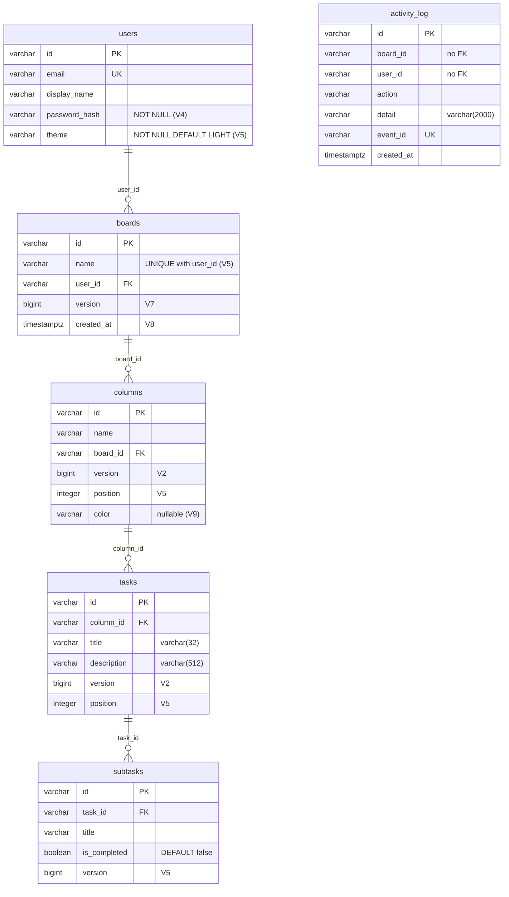
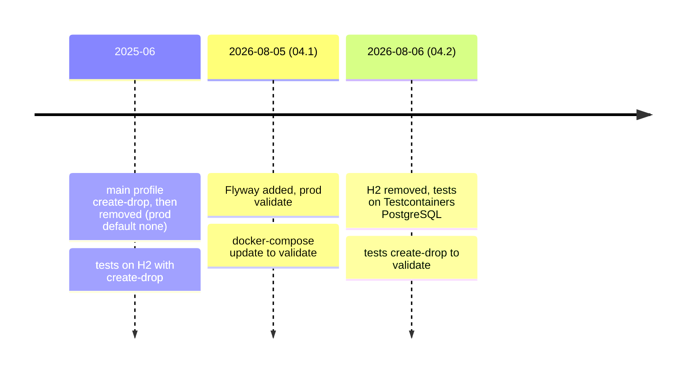

# 01 — Domain model and database schema

This layer defines the five domain entities, their relationships, their primary keys and the
PostgreSQL schema that stores them. Every other layer reads or writes these tables, so a wrong
decision here spreads into queries, locking, events and the API contract.

**Read first:** nothing. This is the first chapter.
**Main code:**
[`entity/`](../../src/main/java/com/vrudenko/kanban_board/entity/),
[`base/entity/`](../../src/main/java/com/vrudenko/kanban_board/base/entity/),
[`RandFlakeGenerator`](../../src/main/java/com/vrudenko/kanban_board/config/RandFlakeGenerator.java),
[`db/migration/`](../../src/main/resources/db/migration/),
[`FlywaySchemaProvenanceTest`](../../src/test/java/com/vrudenko/kanban_board/config/FlywaySchemaProvenanceTest.java)

Related chapters: optimistic locking mechanics are in [03 — Optimistic locking](03-optimistic-locking.md).
The N+1 and fetch-join queries are in chapter 02. The activity-log events are in chapter 07.

## Summary of decisions

| ID | Decision | Main reason |
|----|----------|-------------|
| DATA-01 | A strict five-level ownership tree: user → board → column → task → subtask, one foreign key per level | Every resource traces back to one owner, so the ownership check walks one chain |
| DATA-02 | One `@MappedSuperclass` (`BaseEntity`) for the id, plus small `Base*` interfaces shared by entities and DTOs | Java cannot override fields, so shared contracts use getter methods |
| DATA-03 | No explicit `fetch` attribute: to-one relations are EAGER, collections are LAZY (JPA defaults) | Measured: the EAGER parent chain loads in 1 query |
| DATA-04 | Collections in the board graph are `Set` with `@OrderBy("id")` | A `List` breaks the four-level fetch join (`MultipleBagFetchException`, duplicate rows) |
| DATA-05 | `ColumnEntity`, `TaskEntity`, `SubtaskEntity` use identity `equals`/`hashCode` | Field-based `hashCode` merged two distinct sibling rows in a `Set` (observed) |
| DATA-06 | String primary keys from an in-app Snowflake-style generator (`RandFlakeGenerator`), not UUID | Ids sort by creation time without a database round trip |
| DATA-07 | The generator uses a shared monotonic sequence, 22 sequence bits, epoch 2018-01-01 | Random low bits collided in 6.5% of trials; the old layout overflowed the sign bit in 2058 |
| DATA-08 | Id uniqueness is per JVM only, with no machine-id field | The app runs as a single instance |
| DATA-09 | Only boards accept a caller-supplied id | Other collections use id order as a creation-order proxy |
| DATA-10 | The ids are NOT ULIDs; the `ulid-creator` dependency is unused | Historical: the generator started with an unused ULID import |
| DATA-11 | Ordering uses an `Integer position` column with renumber-on-insert, not fractional keys | Fractional keys are too complex for this scale |
| DATA-12 | No database unique constraint on position; reads sort by `(position, id)` | A non-deferrable unique constraint collides during a bulk shift |
| DATA-13 | Board names are unique per user: a service check, plus the `uk_boards_user_id_name` constraint as a backstop | A clear 409 for the common case; the database stops the race |
| DATA-14 | Theme is a `LIGHT`/`DARK` enum on `users`, `NOT NULL DEFAULT 'LIGHT'`, no `@Version` | Only two states exist in the design; no null branch; last-write-wins is accepted |
| DATA-15 | Column color is a nullable `varchar(7)` with no `CHECK` constraint; the DTO validates the format | A `CHECK` failure gives a 409 and leaks the constraint text |
| DATA-16 | `boards.created_at` is backfilled once, then its default is dropped | The application stays the single writer of the column |
| DATA-17 | Flyway owns the domain schema, with an incremental history (V1–V9), not one snapshot | The history tells the real evolution and is immutable once applied |
| DATA-18 | Spring Session tables stay outside Flyway | Spring Session JDBC has its own schema initializer |
| DATA-19 | `ddl-auto=validate` in production, tests and the local Docker stack | Hibernate checks the schema but never changes it |
| DATA-20 | Pre-Flyway manual DDL bridge scripts were folded into V2–V4; no Flyway baseline was used | Every real database was built from empty, so nothing needed a baseline |
| DATA-21 | Data-dependent constraints run inside a guarded `DO $$ ... RAISE EXCEPTION` block | A named abort is easier to diagnose than an opaque constraint error |
| DATA-22 | `activity_log.board_id`/`user_id` are plain columns, not foreign keys | A foreign key turns a delete race into a poison message |

## The domain hierarchy and the entity classes

### What it is

The domain has five entities. Each one extends
[`BaseEntity`](../../src/main/java/com/vrudenko/kanban_board/entity/BaseEntity.java#L11-L16) and
maps to one table:

| Entity | Table | Parent (foreign key) | Main fields |
|--------|-------|----------------------|-------------|
| [`UserEntity`](../../src/main/java/com/vrudenko/kanban_board/entity/UserEntity.java) | `users` | none | `email` (unique), `displayName`, `passwordHash`, `theme` |
| [`BoardEntity`](../../src/main/java/com/vrudenko/kanban_board/entity/BoardEntity.java) | `boards` | `user_id` → `users` | `name`, `version`, `createdAt` |
| [`ColumnEntity`](../../src/main/java/com/vrudenko/kanban_board/entity/ColumnEntity.java) | `columns` | `board_id` → `boards` | `name`, `version`, `position`, `color` |
| [`TaskEntity`](../../src/main/java/com/vrudenko/kanban_board/entity/TaskEntity.java) | `tasks` | `column_id` → `columns` | `title` (max 32), `description` (max 512), `version`, `position` |
| [`SubtaskEntity`](../../src/main/java/com/vrudenko/kanban_board/entity/SubtaskEntity.java) | `subtasks` | `task_id` → `tasks` | `title`, `isCompleted`, `version` |

A sixth entity, [`ActivityLogEntity`](../../src/main/java/com/vrudenko/kanban_board/entity/ActivityLogEntity.java),
stores the activity feed. It is outside the ownership tree (see DATA-22 and chapter 07).



### How it works

The Java field names become snake_case column names through
`CamelCaseToUnderscoresNamingStrategy`, which both profiles set
([`application.properties`](../../src/main/resources/application.properties#L212-L214)). For
example, `passwordHash` maps to `password_hash` and `isCompleted` maps to `is_completed`.

Each child holds a `@ManyToOne` reference to its parent. Each parent holds the inverse
`@OneToMany(mappedBy = ...)` collection. The owning side is always the child, so the foreign key
column lives on the child table:

```java
// TaskEntity.java
@ManyToOne
@JoinColumn(name = "column_id")
private ColumnEntity column;

@OneToMany(mappedBy = "task")
@OrderBy("id")
private Set<SubtaskEntity> subtasks;
```

No relation declares `cascade` or `orphanRemoval`, and no foreign key in
[`V1__init.sql`](../../src/main/resources/db/migration/V1__init.sql) declares `ON DELETE CASCADE`.
Deletes go through the services, which delete children first in one transaction (for example,
`TaskService.deleteAllByColumn`). Chapter 02 explains the batch-delete queries.

`UserEntity` also implements Spring Security's `UserDetails`.
[`UserEntity.getUsername`](../../src/main/java/com/vrudenko/kanban_board/entity/UserEntity.java#L74-L77)
returns the user id, not the email, so the security principal name is the id (commit `62b8e5a`).

The naming of two collection fields is irregular: `BoardEntity.column` and `ColumnEntity.task` are
singular names on collections. The mappers keep them and map them with an explicit `@Mapping`
([`BoardFullMapper`](../../src/main/java/com/vrudenko/kanban_board/mapper/BoardFullMapper.java)).

### Why we chose it

**DATA-01.** The strict tree lets
[`OwnershipVerifierService`](../../src/main/java/com/vrudenko/kanban_board/service/OwnershipVerifierService.java)
prove ownership of any resource by a walk up one chain: subtask → task → column → board → user.
The project CLAUDE.md records this chain as the access-control model. The reason for service-side
deletes instead of JPA cascade is not recorded. The code shows that the service-side path lets the
project batch the deletes and publish a delete event per level.

### Trade-offs and limits

- The foreign key columns (`user_id`, `board_id`, `column_id`, `task_id`) are nullable in V1. The
  entities do not mark them `nullable = false` either. The reason is not recorded.
- V1 creates no index on `columns.board_id`, `tasks.column_id` or `subtasks.task_id`. PostgreSQL
  does not index a foreign key column automatically. The composite unique constraint
  `uk_boards_user_id_name` does give `boards.user_id` a usable leading index. The reason is not
  recorded.

### How we test it

- [`FlywaySchemaProvenanceTest.SchemaShape`](../../src/test/java/com/vrudenko/kanban_board/config/FlywaySchemaProvenanceTest.java#L68-L93),
  test `shouldContainExactlyTheProductionTableSet_whenSchemaIsBuiltByFlyway`, reads
  `information_schema.tables` and asserts the exact set of nine tables.
- `FlywayOnlyArtifacts.shouldContainBoardsUserForeignKeyNamedByV1Migration_whenSchemaIsBuiltByFlyway`
  asserts that `fk_boards_user` exists.

### Where this is recorded

- [`docs/ARCHITECTURE.md` § Schema management](../ARCHITECTURE.md)
- [`V1__init.sql`](../../src/main/resources/db/migration/V1__init.sql) header

## Base classes and shared interfaces

### What it is

`BaseEntity` is a `@MappedSuperclass`. It holds only the id:

```java
@MappedSuperclass
@Getter
@Setter
public abstract class BaseEntity implements BaseId {
    @Id @RandFlakeId protected String id;
}
```

A `@MappedSuperclass` is a JPA class whose mapped fields are copied into each subclass table. It
has no table of its own.

The package [`base/entity/`](../../src/main/java/com/vrudenko/kanban_board/base/entity/) holds six
small interfaces: `BaseId` (`getId`), `BaseUser` (`getEmail`, `getDisplayName`), `BaseBoard`
(`getName`), `BaseColumn` (`getName`), `BaseTask` (`getTitle`, `getDescription`) and
`BaseSubtask` (`getTitle`).

### How it works

Both an entity and its DTOs implement the same interface. For example, `BoardEntity`,
`SaveBoardRequestDTO`, `UpdateBoardRequestDTO`, `BoardResponseDTO` and `BoardFullResponseDTO` all
implement `BaseBoard`. Lombok `@Getter` generates the method that satisfies the interface.

### Why we chose it

**DATA-02.** The Javadoc on
[`BaseBoard`](../../src/main/java/com/vrudenko/kanban_board/base/entity/BaseBoard.java#L3-L7)
gives the reason: Java cannot override a field, so a shared base class cannot put different
Hibernate annotations on the same field in each subclass. An interface with getter methods
avoids that problem. The project CLAUDE.md adds that the interfaces keep DTOs and entities
aligned.

Quick task 260904-obv (its summary is
[`260904-obv-SUMMARY.md`](../../.planning/quick/260904-obv-add-color-field-to-column-and-accept-it-/260904-obv-SUMMARY.md))
decided not to add `color` to `BaseColumn`. The interfaces are a "minimal common contract, not a
field roster".

### Trade-offs and limits

The interfaces carry only the identity fields. `version`, `position`, `color` and `createdAt` are
not part of them. So the interfaces do not prove that a DTO carries every entity field.

## Relationships, fetch types and collection types

### What it is

No association sets a `fetch` attribute. The JPA defaults apply:

- `@ManyToOne` (child → parent) is `FetchType.EAGER`.
- `@OneToMany` (parent → children) is `FetchType.LAZY`.

`FetchType.EAGER` tells Hibernate to load the related entity together with the owner.
`FetchType.LAZY` tells Hibernate to load the collection only when code first reads it.

The three collections in the board graph are `Set`, not `List`, and each carries `@OrderBy("id")`:
`BoardEntity.column`, `ColumnEntity.task` and `TaskEntity.subtasks`. `UserEntity.boards` is still a
`List`, because it is not part of that fetch chain.

### How it works

Because every parent link is EAGER, one `subtaskRepository.findById(id)` loads subtask, task,
column, board and user through SQL `LEFT JOIN`s in one statement.
[`docs/ARCHITECTURE.md`](../ARCHITECTURE.md) records the measurement: the ownership chain was
suspected to be N+1 and measured at **1 query**.

`@OrderBy("id")` makes Hibernate add `ORDER BY id` when it loads the collection. A plain
`HashSet` has no defined iteration order, so without it the JSON array order changes between runs.

### Why we chose it

**DATA-03.** The fetch defaults are not an explicit decision in any planning file. The Epic 2 plan
([`02-n-plus-one-optimistic-locking.md`](../plans/backend-modernization/02-n-plus-one-optimistic-locking.md))
found them, and the measurement above showed that they cost 1 query for the ownership check. So
the project kept them.

**DATA-04.** The reason for `Set` is in the
[`BoardRepository`](../../src/main/java/com/vrudenko/kanban_board/repository/BoardRepository.java#L17-L49)
Javadoc. Two `List` collections in one fetch-join query cause `MultipleBagFetchException`, and a
single surviving `List` still keeps the duplicate rows that the join creates. The Javadoc records
one observed case: a column appeared 14 times in `board.getColumn()`. Chapter 02 explains this
query in full.

**DATA-05.** A `Set` calls `hashCode` on each element when Hibernate fills it. Lombok field-based
`equals`/`hashCode` on `SubtaskEntity` used `title`, `isCompleted` and `task`. Two sibling subtasks
with the same title and the same `isCompleted` value collided, and the `Set` kept only one. The
comment on
[`SubtaskEntity`](../../src/main/java/com/vrudenko/kanban_board/entity/SubtaskEntity.java#L21-L33)
records that `BoardFullReadTest` lost a subtask this way. The fix removes `@EqualsAndHashCode`, so
`Object` identity applies. Hibernate's persistence context returns the same Java object for the
same row inside one session, so identity equality is correct there.

`BoardEntity` still has field-based `@EqualsAndHashCode`. It excludes `column` and `version`,
because both change after the object can already be in a hash-based collection
([`BoardEntity`](../../src/main/java/com/vrudenko/kanban_board/entity/BoardEntity.java#L57-L74)).
`createdAt` stays in, because the code writes it once before persist.

### Trade-offs and limits

- EAGER to-one relations load the whole parent chain on every child read, even when the caller
  does not need it.
- Identity equality is correct only inside one persistence context. Two detached copies of the
  same row are not equal.
- The nested board read orders collections by id, not by `position` (see "Known gaps").

### How we test it

- [`BoardFullReadTest`](../../src/test/java/com/vrudenko/kanban_board/controller/BoardFullReadTest.java),
  tests `shouldMatchFlatEndpointsFieldByField_forSameBoard` and
  `shouldContainSameElementsAsFlatEndpoints_andBeInternallyOrdered_forSameBoard`.
  The second test asserts that the nested ids are sorted and that no element is lost or doubled.

### Where this is recorded

- [`BoardRepository`](../../src/main/java/com/vrudenko/kanban_board/repository/BoardRepository.java) Javadoc
- Comments on `ColumnEntity.task`, `TaskEntity.subtasks` and `SubtaskEntity`
- [`docs/ARCHITECTURE.md`](../ARCHITECTURE.md), N+1 measurements

## Primary keys: the RandFlake generator

### What it is

Every entity id is a `String` that
[`RandFlakeGenerator`](../../src/main/java/com/vrudenko/kanban_board/config/RandFlakeGenerator.java)
makes inside the JVM. The id is a Snowflake-style value. A Snowflake id is a 64-bit integer that
packs a timestamp in the high bits and a counter in the low bits, so ids sort by creation time.

The layout is:

| Bits | Content |
|------|---------|
| 1 | Sign bit, never written, so the value is always positive |
| 41 | Milliseconds since `CUSTOM_EPOCH` = 2018-01-01 (`1514764800000L`) |
| 22 | Sequence counter (4,194,304 values per millisecond) |

The generator writes the value as a lowercase base36 string with `Long.toString(payload, 36)`.
Base36 uses the digits `0-9` and the letters `a-z`.

### How it works

The annotation [`@RandFlakeId`](../../src/main/java/com/vrudenko/kanban_board/config/RandFlakeId.java)
carries `@IdGeneratorType(RandFlakeGenerator.class)`. Hibernate 6 reads that meta-annotation and
calls the generator for each insert of an entity with a null id.

The core is one lock-free compare-and-set loop over a static `AtomicLong`
([`RandFlakeGenerator.generateRandflake`](../../src/main/java/com/vrudenko/kanban_board/config/RandFlakeGenerator.java#L113-L123)):

```java
long payload =
        LAST_ID.updateAndGet(
                previous ->
                        Math.max(
                                (System.currentTimeMillis() - CUSTOM_EPOCH)
                                        << SEQUENCE_BITS,
                                previous + 1));

return Long.toString(payload, 36);
```

`Math.max(candidate, previous + 1)` does three jobs, as the in-code comment explains:

1. In a new millisecond, `candidate` is larger, so the sequence restarts at zero.
2. In the same millisecond, `previous + 1` is larger, so the sequence counts up.
3. If the sequence runs out, or the clock steps back, `previous + 1` borrows into the next
   millisecond. The generator does not wait (the Sonyflake approach) and does not throw (the
   reference Snowflake approach).

`LAST_ID` is `static`. Hibernate creates one generator instance per `@RandFlakeId` mapping, and
[`EventIdGenerator`](../../src/main/java/com/vrudenko/kanban_board/config/EventIdGenerator.java)
creates one more with `new RandFlakeGenerator()`. A per-instance counter would let two instances
issue the same id in the same millisecond.

The generator also keeps an id that the caller already set
([`RandFlakeGenerator`](../../src/main/java/com/vrudenko/kanban_board/config/RandFlakeGenerator.java#L44-L79)).
Two overrides are necessary: `allowAssignedIdentifiers()` returns `true`, and the four-argument
`generate(...)` returns `currentValue` when it is not null. The comment records that the plan
assumed the first override alone was enough, and a real end-to-end run proved it was not.

### Why we chose it

**DATA-06.** The first entity version used `@GeneratedValue(strategy = GenerationType.UUID)`.
Commit `62b8e5a` (2025-05-20) replaced it with `@RandFlakeId`. The commit gives no reason. The
[README](../../README.md) row "Ids" gives one: sortable by creation time without a database round
trip, unlike a random UUID. The code depends on that property: three entity collections use
`@OrderBy("id")` as a creation-order proxy.

**DATA-07.** The first generator (commit `e91a639`) used 41 timestamp bits plus 23 **random** bits,
epoch 2023-01-01. Two problems made the project replace it:

- Quick task 260813-ncx measured the collision rate. 13 of 200 trials of 1,000 rapid calls held a
  duplicate, which is 6.5% ([`PROBE-FINDINGS.md`](../../.planning/quick/260813-ncx-investigate-eventidgeneratortest-s-recur/PROBE-FINDINGS.md)).
- 41 + 23 = 64 bits left no sign bit, so the value would go negative in 2058
  ([todo](../../.planning/todos/completed/2026-08-13-add-monotonic-sequence-counter-to-randflakegenerator-fix-205.md)).

Quick task 260813-os9
([summary](../../.planning/quick/260813-os9-replace-randflakegenerator-s-random-23-l/260813-os9-SUMMARY.md),
commit `4ddcb69`) replaced the random bits with the monotonic sequence. It cut the low field to
22 bits, which reserves the sign bit and moves exhaustion to 2087-09-07. It also moved the epoch
back to 2018-01-01. With the old epoch, the narrower low field would halve every new id, so new ids
would sort *below* old ids until 2030-03-26 and invert every `@OrderBy("id")` collection. The new
epoch keeps every new id above the largest id the old layout could make.

An earlier quick task, 260802-tbj, removed a `synchronized` modifier from the old generator. At
that time the class had no shared mutable state, so the lock protected nothing and serialized
every insert ([summary](../../.planning/quick/260802-tbj-remove-the-pointless-synchronized-modifi/260802-tbj-SUMMARY.md)).
The static `AtomicLong` from 260813-os9 is shared state, but the CAS loop makes it safe without a
lock.

**DATA-08.** The generator has no machine-id field, so two JVMs that share one database can issue
the same id. The comment in the code accepts this because the app is single-instance
(`docker-compose.prod.yml`). It adds that the old random design was equally unsafe across
instances, only with a probability instead of a certainty.

**DATA-09.** Quick task 260908-dl3 lets `POST /api/boards` accept an optional id, for
offline-first or optimistic client-side creation
([plan](../../.planning/quick/260908-dl3-create-board-endpoint-optionally-accepts/260908-dl3-PLAN.md)).
The `@BoardId` constraint admits only `^[0-9a-z]{1,13}$`
([`ValidationConstants`](../../src/main/java/com/vrudenko/kanban_board/constant/ValidationConstants.java#L44-L56)).
The decision record in
[`BoardService.save`](../../src/main/java/com/vrudenko/kanban_board/service/BoardService.java#L199-L214)
forbids the same feature for columns, tasks and subtasks. Their collections sort by id as a
creation-order proxy. A caller-chosen id, or a shorter string, would sort in the wrong place,
because the database compares the ids as strings.

### Alternatives we rejected

- `GenerationType.UUID` (the original). Random UUIDs do not sort by creation time.
- Random low bits (the first RandFlake version). Measured collisions, sign overflow in 2058.
- A per-instance or per-thread counter. Two instances in the same millisecond would collide
  deterministically.
- A lock around two fields (`lastTimestamp` plus `sequence`). The packed single `long` makes the
  pair atomic without a lock.

### Trade-offs and limits

- Uniqueness holds only inside one JVM (DATA-08).
- Under a sustained rate above 4,194,304 ids per millisecond, the ids drift ahead of the clock.
  The comment states that this single-instance app cannot produce that rate.
- Old ids no longer decode to their true creation time with the new epoch. The comment accepts
  this, because no production code decodes an id.
- The column type is `varchar(255)` and the sort is a string sort. The string sort matches the
  numeric order only while all ids have the same length. By my calculation from the layout
  (not recorded in the repository), ids are 12 characters from 2018-12-30 and become 13 characters
  on 2053-10-19.

### How we test it

[`RandFlakeGeneratorTest.GenerateRandflakeTest`](../../src/test/java/com/vrudenko/kanban_board/config/RandFlakeGeneratorTest.java),
plain JUnit, no Spring context:

- `shouldProduceStrictlyIncreasingIds_whenCalledRapidlyInSequence` — 1,000 calls, sorted, no duplicates.
- `shouldProduceAllDistinctIds_whenCalledConcurrentlyFromMultipleThreads` — 8 threads × 250 calls.
- `shouldProduceAllDistinctIds_whenInterleavedAcrossTwoSeparateInstances` — proves the static counter.
- `shouldDecodeAboveLegacyLayoutCeiling_whenGeneratedFreshly` — compares against the frozen
  constant `1058897343291588607`, the largest id the old layout could make until 2027-01-01.
- `shouldRenderAsTwelveCharPositiveBase36String_whenGeneratedFreshly` and
  `shouldDecodeToPositiveLong_whenGenerated`.

The 260813-os9 summary records a falsification run: without the `previous + 1` carry, exactly the
5 uniqueness and ordering assertions failed. For the assigned-id path, see
[`BoardCreationE2ETest`](../../src/test/java/com/vrudenko/kanban_board/e2e/board/BoardCreationE2ETest.java)
tests `shouldPersistExactlyGivenId_whenExplicitWellFormedIdIsProvided` and
`shouldReturnConflictAndLeaveBoardsUnchanged_whenIdAlreadyUsedByAnotherBoard`.

### Where this is recorded

- Decision-record comments in `RandFlakeGenerator`
- Quick tasks 260802-tbj, 260813-ncx, 260813-os9, 260908-dl3 (linked above)

## Why the ids are not ULIDs

### What it is

A ULID is a 128-bit id: 48 timestamp bits plus 80 random bits, written as 26 Crockford base32
characters. `build.gradle` declares `com.github.f4b6a3:ulid-creator:5.2.0`
([`build.gradle`](../../build.gradle#L220)), but no class under `src/` imports it.

### How it works

The ULID library appears only once in the history of the code. The first `RandFlakeGenerator`
(commit `e91a639`, 2025-05-20) imported `com.github.f4b6a3.ulid.UlidCreator` and never called it.
Commit `5121740` (2025-06-05, a formatting commit) removed the unused import. The dependency line
stayed in `build.gradle`.

### Why we chose it

**DATA-10.** No decision to adopt ULID exists. The name "ULID" survives in prose only. Quick task
260908-dl3 corrected the project CLAUDE.md, which described the ids as ULIDs. Several other
sources still say "ULID" (see "Known gaps"). The code is the authority: the ids are 63-bit
Snowflake-style values in base36, at most 13 characters.

### Trade-offs and limits

The unused dependency is on the runtime classpath and in the dependency scan
([`260813-q1i-MEASUREMENTS.md`](../../.planning/quick/260813-q1i-add-a-dependency-vulnerability-scan-owas/260813-q1i-MEASUREMENTS.md)).
It gives no function.

## Ordering: the position columns

### What it is

`tasks.position` orders tasks inside a column. `columns.position` orders columns inside a board.
Both are `integer NOT NULL DEFAULT 0`, added by V5. Subtasks and boards have no position.

### How it works

Positions stay contiguous from zero:

- **Create.** The service sets `position` to the current sibling count, which is the next free
  slot ([`TaskService.save`](../../src/main/java/com/vrudenko/kanban_board/service/TaskService.java#L58-L66),
  [`ColumnService.save`](../../src/main/java/com/vrudenko/kanban_board/service/ColumnService.java#L91-L97)).
- **Move or reorder.** One bulk JPQL `UPDATE` shifts the siblings between the old and the new
  position by +1 or −1
  ([`TaskRepository.shiftPositions`](../../src/main/java/com/vrudenko/kanban_board/repository/TaskRepository.java#L28-L53)).
  A request beyond the end is clamped to the end.
- **Column delete.** `ColumnService.deleteById` shifts the later columns down by one
  ([`ColumnService`](../../src/main/java/com/vrudenko/kanban_board/service/ColumnService.java#L270-L282)).
- **Flat reads** sort by two keys:
  `order by t.position asc, t.id asc`
  ([`TaskRepository.findAllByColumnId`](../../src/main/java/com/vrudenko/kanban_board/repository/TaskRepository.java#L13-L21)).

The `= 0` initialiser on the entity fields exists only so that V5 could ship a `NOT NULL` column
before the services assigned a real value (comment in `TaskService.save`).

### Why we chose it

**DATA-11.** Phase 6 D-02
([`06-CONTEXT.md`](../../.planning/milestones/v1.2-phases/06-mock-up-feature-gap-closure/06-CONTEXT.md))
chose a simple `Integer position` with renumber-on-insert. It rejected fractional keys
(LexoRank-style) as "disproportionate complexity for this project's scale". D-01 chose to build
ordering fully, although the mock-up shows no drag handle, to match normal Kanban expectations.

**DATA-12.** The research recommended a `UNIQUE(column_id, position)` constraint. The planner
rejected it in the `<ordering_uniqueness_decision>` block of
[`06-04-PLAN.md`](../../.planning/milestones/v1.2-phases/06-mock-up-feature-gap-closure/06-04-PLAN.md):

1. PostgreSQL checks a non-deferrable unique constraint per row, so the bulk shift can collide
   in the middle of the statement.
2. The fix, `DEFERRABLE INITIALLY DEFERRED`, reports the violation at commit time, outside any
   service method, with no useful context.
3. V5 set every existing row to position 0, so the constraint would also need a backfill migration.

Instead, the `(position, id)` sort makes every read a total order. Two tied rows show in a stable
order, not a random one.

### Alternatives we rejected

- Fractional or gap-based keys (LexoRank). Too complex for the scale.
- A database unique constraint on position. See DATA-12.
- One `UPDATE` per row. The bulk statement keeps the statement count constant.

### Trade-offs and limits

- Two concurrent inserts into one column can compute the same next position. The plan accepts this
  as threat T-06-19: the result is a tie, which the `(position, id)` sort resolves.
- `@Version` protects one row, not the sibling set. Chapter 03 covers the version check that runs
  before a reorder.

### How we test it

- [`ColumnControllerTest`](../../src/test/java/com/vrudenko/kanban_board/controller/ColumnControllerTest.java):
  `shouldAssignContiguousPositions_whenCreatingThreeTasksInEmptyColumn`,
  `shouldAssignContiguousPositions_whenCreatingThreeColumnsOnOneBoard`,
  `shouldMoveThirdColumnToFront_andShiftOthersDown_whenTargetPositionIsZero`,
  `shouldClampToEnd_whenTargetPositionExceedsBoardColumnCount`.
- [`TaskMoveTest`](../../src/test/java/com/vrudenko/kanban_board/e2e/task/TaskMoveTest.java):
  `shouldLeaveBothColumnsContiguous_whenMovingTaskToDifferentColumnAtPositionZero`,
  `shouldAppendAtEnd_whenTargetPositionIsOmitted`,
  `shouldReturnTasksSortedByPosition_overHttp`.

### Where this is recorded

- [`06-CONTEXT.md`](../../.planning/milestones/v1.2-phases/06-mock-up-feature-gap-closure/06-CONTEXT.md) D-01 to D-04
- [`06-04-PLAN.md`](../../.planning/milestones/v1.2-phases/06-mock-up-feature-gap-closure/06-04-PLAN.md) `<ordering_uniqueness_decision>`
- [`06-RESEARCH.md`](../../.planning/milestones/v1.2-phases/06-mock-up-feature-gap-closure/06-RESEARCH.md) Pattern 4

## Board-name uniqueness per user

### What it is

One user cannot have two boards with the same name. Two different users can.

### How it works

Two layers do the work:

1. **Service check.** `UserService.addBoardByUserId` calls
   `boardRepository.existsByUserIdAndName(...)` and throws `AppDuplicateResourceException`
   ([`UserService`](../../src/main/java/com/vrudenko/kanban_board/service/UserService.java#L99-L107)).
   `BoardService.updateById` does the same check on rename, but skips it when the new name equals
   the current name
   ([`BoardService`](../../src/main/java/com/vrudenko/kanban_board/service/BoardService.java#L150-L157)).
   `GlobalExceptionHandler.handleAppDuplicateResource` returns HTTP 409 with code
   `DUPLICATE_RESOURCE`.
2. **Database backstop.** V5 adds `CONSTRAINT uk_boards_user_id_name UNIQUE (user_id, name)`.
   Two concurrent requests can both pass the service check. The loser then hits the constraint,
   and `handleDataIntegrityViolation` returns HTTP 409 with code `DATA_INTEGRITY_VIOLATION`
   ([`GlobalExceptionHandler`](../../src/main/java/com/vrudenko/kanban_board/handler/GlobalExceptionHandler.java#L161-L185)).

The comparison is exact and case-sensitive in both layers. "Work" and "work" are two different
names. The reason for case sensitivity is not recorded; Phase 6 left it to the planner.

### Why we chose it

**DATA-13.** Phase 6 D-09 added the check to both create and rename. It resolved a long-standing
`TODO` in `UserService.addBoardByUserId`. The check-then-act window is known and deliberate: the
service check gives the clean `DUPLICATE_RESOURCE` response for the normal case, and the constraint
is the real guarantee (comment in `BoardService.save`).

### Trade-offs and limits

- Under a real race the client gets `DATA_INTEGRITY_VIOLATION`, not `DUPLICATE_RESOURCE`. Both are
  409.
- Doc-vs-code: D-09 says "a service-layer check with no schema impact". The implementation added
  a schema constraint in V5. The code wins.

### How we test it

- [`BoardCreationE2ETest`](../../src/test/java/com/vrudenko/kanban_board/e2e/board/BoardCreationE2ETest.java):
  `DuplicateName.shouldReturnConflictAndLeaveCountUnchanged_whenCreatingBoardWithNameAlreadyUsedBySameUser`,
  `RenameBoard.shouldReturnConflictAndLeaveNamesUnchanged_whenRenamingToNameAlreadyUsedByAnotherBoardOfSameUser`,
  `RenameBoard.shouldReturnOk_whenRenamingBoardToItsOwnCurrentName`,
  `CrossUserIsolation.shouldAllowBothCreates_whenTwoDifferentUsersUseIdenticalBoardName`,
  `ConcurrentCreate.shouldPersistExactlyOneBoard_whenTwoRequestsCreateSameNameConcurrently`.
  The concurrent test asserts the final row count, not which request won.
- [`FlywaySchemaProvenanceTest`](../../src/test/java/com/vrudenko/kanban_board/config/FlywaySchemaProvenanceTest.java#L194-L208),
  `shouldContainBoardsUserIdNameUniqueConstraintNamedByV5Migration_whenSchemaIsBuiltByFlyway`.
- [`GlobalExceptionHandlerTest`](../../src/test/java/com/vrudenko/kanban_board/handler/GlobalExceptionHandlerTest.java),
  `shouldReturnProblemDetailWithDuplicateResourceCode_whenBoardNameAlreadyExists`.

## Column color, board creation time and user theme

### What it is

Three small fields, each with its own migration or column:

| Field | Column | Migration |
|-------|--------|-----------|
| `ColumnEntity.color` | `columns.color varchar(7)`, nullable | V9 |
| `BoardEntity.createdAt` | `boards.created_at timestamp(6) with time zone NOT NULL` | V8 |
| `UserEntity.theme` | `users.theme varchar(10) NOT NULL DEFAULT 'LIGHT'` | V5 |

### How it works

**Color.** The `@ColumnColor` constraint on `SaveColumnRequestDTO` checks the pattern
`^#[0-9a-fA-F]{6}$` ([`ValidationConstants`](../../src/main/java/com/vrudenko/kanban_board/constant/ValidationConstants.java#L40-L43)).
The value is stored as sent, with no case normalization. A column created without a color returns
`null`. The update path does not accept a color yet.

**Creation time.** [`BoardService.save`](../../src/main/java/com/vrudenko/kanban_board/service/BoardService.java#L191-L246)
reads `Instant.now()` once and truncates it to microseconds, because `timestamp(6)` drops anything
finer. The same value goes into the row and into `BoardCreatedEvent`, so the two cannot disagree
(commit `6aadda1`).

**Theme.** `ThemePreference` is an enum with `LIGHT` and `DARK`, stored as a string through
`@Enumerated(EnumType.STRING)`. `UserEntity` has Lombok `@Builder`, so the field carries
`@Builder.Default`. Without it, the builder ignores the `= ThemePreference.LIGHT` initialiser and
writes null into a `NOT NULL` column on every signup
([`UserEntity`](../../src/main/java/com/vrudenko/kanban_board/entity/UserEntity.java#L52-L60)).

### Why we chose it

**DATA-14.** Phase 6 D-10 to D-12
([`06-CONTEXT.md`](../../.planning/milestones/v1.2-phases/06-mock-up-feature-gap-closure/06-CONTEXT.md)):
build server-side theme persistence now, use an enum because the mock-up shows exactly two
states, and default to `LIGHT` so that no consumer needs a null branch. `UserEntity` has no
`@Version`. The theme write is last-write-wins by design
([`UserService.updateTheme`](../../src/main/java/com/vrudenko/kanban_board/service/UserService.java#L122-L125)).

**DATA-15.** [`V9__add_columns_color.sql`](../../src/main/resources/db/migration/V9__add_columns_color.sql)
records two reasons. No default and no backfill, because a color for old columns is a product
decision nobody made. No `CHECK` constraint, because a `CHECK` failure goes through
`handleDataIntegrityViolation` to a 409 with the raw constraint expression in `detail`. That is the
wrong status for a format error and a small information leak. The DTO constraint gives a 400 that
names no database object. `varchar(7)` is only a length backstop.

**DATA-16.** [`V8__add_boards_created_at.sql`](../../src/main/resources/db/migration/V8__add_boards_created_at.sql)
adds the column with `DEFAULT now()`, then drops the default at once. Old rows get the migration
time, because no true creation time exists for them. With no permanent default, a future insert
path that forgets the value fails on `NOT NULL` instead of silently getting the insert time.

### Trade-offs and limits

- Old boards show the V8 migration time as their creation time.
- A column color cannot change after creation (pending todo
  [`2026-09-04-allow-editing-a-columns-color-after-creation.md`](../../.planning/todos/pending/2026-09-04-allow-editing-a-columns-color-after-creation.md)).

### How we test it

- [`ColumnColorTest`](../../src/test/java/com/vrudenko/kanban_board/dto/ColumnColorTest.java) — 12
  boundary cases (null, three letter cases, empty, blank, missing `#`, 5 and 7 digits, non-hex,
  trailing newline, spaces).
- `ColumnControllerTest.ColumnCreation`: `shouldCreateWithColor_andPersistItExactly`,
  `shouldCreateWithoutColor_andPersistNull`, `shouldReturnBadRequest_whenColorIsMalformed`.
- [`BoardServiceTest`](../../src/test/java/com/vrudenko/kanban_board/service/BoardServiceTest.java):
  `shouldPopulateCreatedAt_whenBoardIsSaved`, `shouldReturnSameCreatedAt_whenBoardIsReloaded`,
  `shouldNotChangeCreatedAt_whenBoardIsRenamed`.
- [`ThemePersistenceTest`](../../src/test/java/com/vrudenko/kanban_board/controller/ThemePersistenceTest.java):
  `shouldReturnLight_whenUserHasNoExplicitPreference`,
  `shouldReturnBadRequestAndLeaveValueUnchanged_whenThemeIsUnknownValue`,
  `shouldBeIndependentPerUser_whenTwoUsersSetDifferentThemes`.
- `FlywaySchemaProvenanceTest.shouldDefaultUsersThemeColumnToLight_whenSchemaIsBuiltByV5Migration`.

### Where this is recorded

- Quick task 260904-obv ([summary](../../.planning/quick/260904-obv-add-color-field-to-column-and-accept-it-/260904-obv-SUMMARY.md))
- Quick task 260825-dfd ([folder](../../.planning/quick/260825-dfd-add-a-createdat-timestamp-to-boardentity/))
- Phase 6 [`06-CONTEXT.md`](../../.planning/milestones/v1.2-phases/06-mock-up-feature-gap-closure/06-CONTEXT.md)

## Schema history: before Flyway, the manual DDL bridge scripts

### What it is

Before August 2026, no tool managed the production schema. The production profile had no
`ddl-auto` value, so Hibernate used its default `none` against PostgreSQL and changed nothing. Each
schema change needed a hand-run SQL script, called a "manual DDL bridge":

| Script | Change | Origin |
|--------|--------|--------|
| [`02-optimistic-locking-ddl.sql`](../plans/backend-modernization/02-optimistic-locking-ddl.sql) | `tasks.version`, `columns.version` | Epic 2 |
| [`03-activity-log-ddl.sql`](../plans/backend-modernization/03-activity-log-ddl.sql) | `activity_log` table and index | v1.1 Phase 3 |
| [`04-password-hash-not-null-ddl.sql`](../plans/backend-modernization/04-password-hash-not-null-ddl.sql) | `users.password_hash NOT NULL` | Quick task 260803-m3i |

### How it works

Each script told the operator to run it with `psql` against the real database *before* the merge,
because the main branch deployed on every push. For example, a missing `version` column would make
every task or column request fail with an SQL error. Each script used `IF NOT EXISTS` so a second
run did nothing. Each script also said that it was "NOT a replacement for Epic 3's Flyway migration
tooling" and that its change must later enter migration history, "not silently re-applied or lost".

The test suite at that time ran on in-memory H2 with `ddl-auto=create-drop`, so the tests built the
schema from the entities and never ran these scripts.

### Why we chose it

The bridge scripts were a stopgap until Epic 3. Today each script starts with a `SUPERSEDED`
header that names its replacement migration. The files stay as provenance, not as instructions.

## Flyway migrations V1–V9

### What it is

Flyway is a migration tool. It runs versioned SQL files (`V<n>__<description>.sql`) in order and
records each one, with a checksum, in the table `flyway_schema_history`. It does not run a file
twice, and it refuses to start if an applied file changed.

Spring Boot runs Flyway at startup, before Hibernate starts. The version is BOM-managed (11.7.2
for Spring Boot 3.5.16) ([`build.gradle`](../../build.gradle#L151-L156)).

### How it works

| Version | What it does | Why |
|---------|--------------|-----|
| [V1](../../src/main/resources/db/migration/V1__init.sql) `init` | Creates `users`, `boards`, `columns`, `tasks`, `subtasks` with named keys (`uk_users_email`, `fk_boards_user`, ...) | Reconstructs the schema as it was **before** Epic 2, so later files can replay the real changes |
| [V2](../../src/main/resources/db/migration/V2__add_optimistic_locking_version_columns.sql) | `tasks.version`, `columns.version` `bigint NOT NULL DEFAULT 0` | Port of bridge script 02; Epic 2 optimistic locking ([chapter 03](03-optimistic-locking.md)) |
| [V3](../../src/main/resources/db/migration/V3__add_activity_log.sql) | `activity_log` table, unique `event_id` (then `uuid`), index `(board_id, created_at DESC, id DESC)` | Port of bridge script 03; the index serves the paginated feed as an index scan, because the feed has no retention limit |
| [V4](../../src/main/resources/db/migration/V4__add_password_hash_not_null.sql) | `users.password_hash SET NOT NULL`, guarded | Port of bridge script 04. A null hash is an account that can never sign in |
| [V5](../../src/main/resources/db/migration/V5__add_position_subtask_version_theme_board_name_uniqueness.sql) | `tasks.position`, `columns.position`, `subtasks.version`, `users.theme`, guarded `uk_boards_user_id_name` | Phase 6 foundation: ordering, subtask locking, theme, board-name uniqueness. One file, so parallel plans did not fight over version numbers |
| [V6](../../src/main/resources/db/migration/V6__change_activity_log_event_id_to_varchar.sql) | `activity_log.event_id` from `uuid` to `varchar(255)` with `USING event_id::varchar(255)`; drops and re-creates the unique constraint | Event ids now come from `RandFlakeGenerator` (GAP-07). PostgreSQL cannot cast `uuid` to text implicitly. Old rows keep the UUID text form |
| [V7](../../src/main/resources/db/migration/V7__add_board_optimistic_locking_version_column.sql) | `boards.version bigint NOT NULL DEFAULT 0` | Phase 07.1 D-13: boards were the only level with no version column |
| [V8](../../src/main/resources/db/migration/V8__add_boards_created_at.sql) | `boards.created_at`, then `DROP DEFAULT` | See DATA-16 |
| [V9](../../src/main/resources/db/migration/V9__add_columns_color.sql) | `columns.color varchar(7)`, nullable | See DATA-15 |

The V5 plan rejected two alternatives
([`06-01-PLAN.md`](../../.planning/milestones/v1.2-phases/06-mock-up-feature-gap-closure/06-01-PLAN.md)):
one migration per feature (Flyway version numbers are a global namespace, so parallel plans
collide), and a relaxed `ddl-auto` in tests (it deletes the guarantee that the schema test exists
for).

**Guarded migrations (DATA-21).** V4 and V5 wrap the data-dependent step in a PL/pgSQL block:

```sql
DO $$
DECLARE
    null_hash_count bigint;
BEGIN
    SELECT count(*) INTO null_hash_count FROM users WHERE password_hash IS NULL;

    IF null_hash_count > 0 THEN
        RAISE EXCEPTION
            'Aborting: % row(s) in users have a NULL password_hash. ...',
            null_hash_count;
    END IF;

    ALTER TABLE users ALTER COLUMN password_hash SET NOT NULL;
END $$;
```

Flyway can see which files ran, but not which rows exist. The guard stops the migration with a
named message, and a human decides what to do with the bad rows. The 06-01 plan gives the same
reason for V5: a `UNIQUE` constraint added over existing duplicates fails "with an opaque Postgres
error".

**Catalog-only changes.** V2, V5 and V7 add `NOT NULL` columns with a constant default. The V7 and
V8 headers record that on PostgreSQL 11 and later, a non-volatile default is a catalog-only change
with no table rewrite. `now()` is `STABLE`, so V8 also avoids a rewrite. (The V7 header says
"PostgreSQL 10+"; the 06-01 plan says "PostgreSQL 11+". PostgreSQL added this feature in version
11.)

### Why we chose it

**DATA-17.** Phase 04.1 D-01
([`04.1-CONTEXT.md`](../../.planning/milestones/v1.2-phases/04.1-flyway-database-migration-implementation/04.1-CONTEXT.md))
chose an incremental history: V1 as the pre-Epic-2 schema, then one file per real change, "do not
collapse into a single baseline". The Epic 3 plan
([`03-flyway-openapi.md`](../plans/backend-modernization/03-flyway-openapi.md)) wants the history
to "tell the real story of the project's evolution". D-01 marks the choice as costly to reverse:
applied files are checksummed and immutable.

The ported files drop the `IF NOT EXISTS` guards, because `flyway_schema_history` already
guarantees exactly-once runs. V4 keeps its row-count guard, because Flyway cannot see row data
([`04.1-02-SUMMARY.md`](../../.planning/milestones/v1.2-phases/04.1-flyway-database-migration-implementation/04.1-02-SUMMARY.md)).

**DATA-18.** Phase 04.1 D-02: Flyway does not own `spring_session` and
`spring_session_attributes`. `spring.session.jdbc.initialize-schema=always` keeps creating them.
Phase 04.2 D-04 reconsidered this and kept it, because moving the session tables would widen the
phase into production schema ownership.

### Alternatives we rejected

- One snapshot `V1` with the current schema. Loses the real history.
- Hibernate `ddl-auto=update` in production. See DATA-19.
- Flyway ownership of the Spring Session tables. See DATA-18.

## `ddl-auto` per profile, and the reversed decisions

### What it is

`spring.jpa.hibernate.ddl-auto` tells Hibernate what to do with the schema at startup: `create`,
`create-drop`, `update`, `validate` or `none`. `validate` compares the entity mappings with the
schema and fails the startup on a mismatch. It changes nothing.

### How it works

| Context | Value today | File |
|---------|-------------|------|
| Production and nonprod | `validate` | [`application.properties`](../../src/main/resources/application.properties#L204-L212) |
| Tests | `validate` | [`application-test.properties`](../../src/main/resources/application-test.properties#L25-L35) |
| Local Docker stack | `validate` (environment variable) | [`docker-compose.yml`](../../docker-compose.yml#L76-L83) |

A mismatch gives a `SchemaManagementException` at startup.

The history of these values:



### Why we chose it

**DATA-19.** Phase 04.1 D-03 set `validate` in production: Flyway migrates, Hibernate validates,
and "neither side both creates and validates" (comment in `application.properties`). The Epic 3
plan calls this "the correct pattern" and names "why not let Hibernate auto-generate the schema in
prod" as a likely interview question.

The local compose file changed from `update` to `validate` in the same phase. An environment
variable outranks `application.properties`, so the old `update` value would let Hibernate keep
altering the local schema and hide exactly the mismatches that `validate` exists to find (comment
in `docker-compose.yml`).

The test profile sets `validate` explicitly. The comment in `application-test.properties`
explains why omission is wrong: Hibernate applies `create-drop` by default only to an embedded
database, so against a real PostgreSQL URL the value would silently become `none` and disable the
check.

**Reversed decision: H2 → Testcontainers.** Phase 04.1 D-04 first kept tests on H2 with
`create-drop`. Phase 04.2 reversed it (commit `948e1b1`): one static PostgreSQL 16 container
([`AbstractPostgresContainerTest`](../../src/test/java/com/vrudenko/kanban_board/support/containers/AbstractPostgresContainerTest.java))
now backs every Spring test, and Flyway builds its schema. D-05 of
[`04.2-CONTEXT.md`](../../.planning/milestones/v1.2-phases/04.2-testcontainers-postgres-drop-h2/04.2-CONTEXT.md)
chose a full drop with no H2 fallback, because two schema paths are the drift that
`docs/CODE_STYLE.md` rule 8 forbids. The result is that every test run executes the full
migration history.

### Trade-offs and limits

- A schema drift is now a hard boot failure, not a silent auto-alter. The project accepts this on
  purpose.
- `validate` checks tables, columns and types. It does not check indexes, defaults or constraint
  names. `FlywaySchemaProvenanceTest` covers some of those.

## How the move to Flyway handled existing databases (no baseline)

### What it is

A Flyway **baseline** marks an existing, non-empty schema as already at some version, so Flyway
skips the older files. `baselineOnMigrate=false` is the default. With it, Flyway refuses a
non-empty schema that has no `flyway_schema_history` table.

### How it works

**DATA-20.** The project never used a baseline. Every real database was empty when Flyway first
ran against it:

1. **Production at cutover.** The AWS EC2/RDS stack was deleted on 2026-08-03. 04.1 D-03 records
   that no live production database existed when Flyway landed on 2026-08-05.
2. **Local Docker volume.** It held months of `ddl-auto=update` schema with no history table. The
   04.1 research found that Flyway would refuse it ("Found non-empty schema(s) ... but no schema
   history table"). The remedy was `docker compose down -v`, which deletes the volume. The research
   rejected `baselineOnMigrate=true`: "the local dev target should be proven from a genuinely clean
   state, not baselined over drifted state"
   ([`04.1-RESEARCH.md`](../../.planning/milestones/v1.2-phases/04.1-flyway-database-migration-implementation/04.1-RESEARCH.md)).
3. **Neon (v1.2 Phase 5).** Flyway applied V1–V7 "against the genuinely empty Neon database"
   ([`docs/INFRA_RUNBOOK.md`](../INFRA_RUNBOOK.md)).
4. **Self-hosted PostgreSQL (Phase 11).** D-04 of
   [`11-CONTEXT.md`](../../.planning/phases/11-migrate-database-from-neon-to-self-hosted-postgres/11-CONTEXT.md)
   chose a fresh start with no `pg_dump`/`pg_restore`. Flyway built V1–V8 from empty. The project
   accepts the data loss, because it is a portfolio project with no external users.

So the bridge scripts entered Flyway history as *real* migrations (V2–V4) that run on an empty
database. They did not enter as "already applied" baseline rows. The scripts themselves suggested
"a baseline/already-applied migration" as one option; the empty databases made that unnecessary.

CI runs the same files against both real databases before each deploy. The `flyway-verify` jobs
run `flyway/flyway:11.7.2 migrate` over SSH on the VM
([`deploy.yml`](../../.github/workflows/deploy.yml)). After the first run, each run is a no-op
success.

### Trade-offs and limits

The Gradle task `rehearseHistoricalSchemas` does not activate the test profile, so it uses the real
datasource with Flyway and `validate`. Against a database that Hibernate built with no history
table, Flyway stops at startup with the non-empty-schema error. The remedy is a database that
Flyway owns (Epic 3 plan status note).

### Where this is recorded

- [`04.1-CONTEXT.md`](../../.planning/milestones/v1.2-phases/04.1-flyway-database-migration-implementation/04.1-CONTEXT.md) D-01 to D-04
- [`04.1-VERIFICATION.md`](../../.planning/milestones/v1.2-phases/04.1-flyway-database-migration-implementation/04.1-VERIFICATION.md):
  a fresh `docker compose down -v && up -d --build` gave 4 history rows, all `success = t`
- [`03-flyway-openapi.md`](../plans/backend-modernization/03-flyway-openapi.md) status note

## `FlywaySchemaProvenanceTest`

### What it is

[`FlywaySchemaProvenanceTest`](../../src/test/java/com/vrudenko/kanban_board/config/FlywaySchemaProvenanceTest.java)
is a `@SpringBootTest` on the shared PostgreSQL container. It proves that four mechanisms work
together in one context: the Testcontainers lifecycle, Flyway, Hibernate `validate` and the Spring
Session initializer. Every assertion reads the live catalog with `JdbcTemplate`, so a failure names
the broken mechanism.

### How it works

It has four nested groups:

| Group | Assertion |
|-------|-----------|
| `FlywayHistory` | Six successful rows for versions 1–6; zero failed rows |
| `SchemaShape` | Exactly nine base tables in `public` |
| `FlywayOnlyArtifacts` | Names and defaults that only a migration can create: `fk_boards_user`, `uk_activity_log_event_id`, `idx_activity_log_board_created_id`, `uk_boards_user_id_name`, `event_id` is `character varying`, `tasks.version` defaults to `0`, `users.theme` defaults to `'LIGHT'` |
| `SpringSessionCoexistence` | Both session tables exist |

The negative test is the key one:

```java
var sql =
        "SELECT count(*) FROM information_schema.table_constraints WHERE"
                + " constraint_schema = 'public' AND constraint_name ~"
                + " '^(fk|uk)[0-9a-z]{8,}$'";
...
Assertions.assertThat(count).isZero();
```

Hibernate names its own constraints `fk`/`uk` plus a hash, and it emits no column defaults. So zero
hash-named constraints proves that Hibernate created nothing, and the migrations built the whole
schema.

### Why we chose it

It is the executable form of the 04.2 success criterion (its class Javadoc). A regression to
Hibernate-generated DDL fails a named assertion instead of "some test somewhere broke". The
temporary `@TestPropertySource` from 04.2-01 was deleted, so the class tests the profile's real
configuration.

### Trade-offs and limits

The history assertion stops at version 6. V7, V8 and V9 have no Flyway-only artifact assertion,
and the test does not check the dropped default of `boards.created_at`. A failed V7–V9 still stops
the context from starting, so the gap is in named diagnosis, not in detection.

### How we test it

This class is the test. Plan 06-07 extended it for V6 (commit `3001f97`,
`shouldStoreActivityLogEventIdAsCharacterType_notUuid_whenSchemaIsBuiltByV6Migration`).

## `activity_log` in the schema

### What it is

`activity_log` (V3, V6) is an insert-only table. It has no `@Version` because nothing updates a row.

### Why we chose it

**DATA-22.** The
[`ActivityLogEntity`](../../src/main/java/com/vrudenko/kanban_board/entity/ActivityLogEntity.java#L17-L43)
Javadoc gives the reasons. `board_id` and `user_id` are plain columns, not foreign keys. A foreign
key would make the insert fail when the board or user is already deleted, and turn a normal race
into a poison message. The Kafka consumer also has no security context to load those entities.
`event_id` is a unique deduplication key, not the row identity. Chapter 07 explains the consumer
and the idempotency path.

## Known gaps and open items

1. **Task delete leaves a position gap.** `TaskService.deleteById` calls no `shiftPositions`
   ([`TaskService`](../../src/main/java/com/vrudenko/kanban_board/service/TaskService.java#L259-L278)),
   while column delete does. The comment in `TaskService.save` says positions stay contiguous "by
   every mutation in this class". After a delete, `countByColumnId` can return a position that a
   remaining task already holds. The `(position, id)` sort resolves the tie. I reasoned this from
   the code and did not run it; no test covers task delete followed by create.
2. **Nested read order differs from flat read order.** `GET /boards/{id}/full` orders collections by
   `@OrderBy("id")`. The flat endpoints order by `(position, id)`. After a reorder, the two can
   show different orders. `BoardFullReadTest` asserts only that the nested ids are sorted.
3. **`FlywaySchemaProvenanceTest` stops at V6.** See its section.
4. **Id width change in 2053.** String ordering of ids matches numeric order only while all ids
   have 12 characters (my calculation: until 2053-10-19).
5. **No index on the child foreign keys** `columns.board_id`, `tasks.column_id`,
   `subtasks.task_id`. Reason not recorded.
6. **Nullable foreign keys** in V1. Reason not recorded.
7. **Unused dependency** `ulid-creator:5.2.0`.
8. **Column color is create-only** (pending todo, linked above).
9. **Board-name uniqueness is case-sensitive.** Reason not recorded.

### Doc-vs-code contradictions (the code wins)

| Source | Claim | Code |
|--------|-------|------|
| [`README.md`](../../README.md#L79) | "ULID via `ulid-creator`" | Base36 Snowflake-style, `ulid-creator` unused |
| `TaskEntity.subtasks` comment, `TaskRepository.findAllByColumnId` comment | "ULIDs" | RandFlake ids |
| `ActivityLogEntity` Javadoc | "the ULID `id`" | RandFlake id |
| [`.planning/notes/2026-08-02-adopt-snowflake-style-time-ordered-id.md`](../../.planning/notes/2026-08-02-adopt-snowflake-style-time-ordered-id.md) | "RandFlake/ULID-based" generator | No ULID |
| `docs/CODE_STYLE.md` `var` example | `UlidCreator.getUlid()` | Not used in the code |
| `EventIdGenerator` Javadoc | "timestamp-plus-random-bits", "holds no shared mutable state" | Monotonic sequence in a static `AtomicLong` |
| `UserEntity.passwordHash` comment; `application.properties` Spring Session comment | `ddl-auto` is unset in production | `validate` since 04.1 |
| `ColumnEntity.task` comment | `position` "defaults to 0 for every column, since no renumbering logic exists yet" | `ColumnService.save` assigns the sibling count; reorder exists |
| `BoardFullMapper`, `ColumnFullMapper` Javadoc | `column`/`task` are `List`-typed | They are `Set` |
| `BoardFullReadTest` comment in the ordering test | flat repositories have "no explicit ORDER BY" | Both sort by `(position, id)` |
| `FlywaySchemaProvenanceTest` Javadoc; `application-test.properties` | "Flyway V1-V4"; `AbstractAppTest` "still wired to H2" | V1–V9; no H2 |
| `AbstractPostgresContainerTest` Javadoc | links `com.vrudenko.kanban_board.FlywaySchemaProvenanceTest` | The class is in `...kanban_board.config` |
| 06-CONTEXT D-09 | board-name uniqueness has "no schema impact" | V5 adds `uk_boards_user_id_name` |
| V7 header | catalog-only on "PostgreSQL 10+" | The feature exists from PostgreSQL 11 |

### Missing reasons

- Why service-side deletes instead of JPA cascade or `ON DELETE CASCADE`.
- Why the parent foreign keys are nullable and unindexed.
- Why the original production schema existed at all before Flyway, while `ddl-auto` was unset
  (the early `application.properties` had `create-drop` until commit `f37f1c8`).
- Why board names compare case-sensitively.

## Questions to check your knowledge

**1. Why are the ids not ULIDs, if `build.gradle` has a ULID library?**

<details><summary>Answer</summary>

The first `RandFlakeGenerator` imported `UlidCreator` and never used it. A formatting commit later
removed the import, and the dependency line stayed. The ids are 63-bit Snowflake-style values
(41 timestamp bits, 22 sequence bits) written in base36, at most 13 characters. A ULID is 128 bits
in 26 base32 characters.
</details>

**2. Why did the project replace the random low bits with a sequence counter?**

<details><summary>Answer</summary>

Quick task 260813-ncx measured duplicates in 13 of 200 trials of 1,000 rapid calls (6.5%). The
64-bit layout also had no sign bit and would go negative in 2058. The sequence makes
same-millisecond collisions impossible inside one JVM, and 22 bits keep the sign bit free until
2087.
</details>

**3. Why did the epoch move back from 2023 to 2018?**

<details><summary>Answer</summary>

Narrowing the low field from 23 to 22 bits halves every new id. With the old epoch, new ids would
sort below existing ids until 2030-03-26. Three collections sort by id as a creation-order proxy,
so their order would invert. The 2018 epoch keeps every new id above the old layout's maximum.
</details>

**4. Why is the `AtomicLong` static?**

<details><summary>Answer</summary>

Hibernate creates one generator per `@RandFlakeId` mapping, and `EventIdGenerator` creates another.
A per-instance counter lets two instances issue the same id in the same millisecond. A static
counter gives one sequence per JVM.
</details>

**5. Why can a board accept a client id, but a task cannot?**

<details><summary>Answer</summary>

Tasks, columns and subtasks load in `@OrderBy("id")` order as a creation-order proxy. A
caller-chosen id, or a shorter string, sorts in the wrong place because the database compares
strings. No board collection uses that ordering, so boards are safe.
</details>

**6. Why do the board-graph collections use `Set` and identity `equals`?**

<details><summary>Answer</summary>

Two `List` collections in one fetch join cause `MultipleBagFetchException`, and a `List` keeps the
duplicate rows of the join. A `Set` removes duplicates, but calls `hashCode` while Hibernate fills
it. Field-based `hashCode` merged two sibling subtasks with equal fields. Identity equality is
correct because one persistence context has one object per row.
</details>

**7. Why is there no unique constraint on `(column_id, position)`?**

<details><summary>Answer</summary>

PostgreSQL checks a non-deferrable unique constraint per row, so the bulk `position + 1` shift can
collide in the middle of the statement. A deferred constraint fails at commit with no context, and
old rows all sat at 0. The project sorts by `(position, id)` instead, so a tie is stable.
</details>

**8. How does the project stop duplicate board names under a race?**

<details><summary>Answer</summary>

A service check (`existsByUserIdAndName`) returns 409 `DUPLICATE_RESOURCE` in the normal case.
Two concurrent requests can both pass it. The V5 constraint `uk_boards_user_id_name` then rejects
the second insert, which returns 409 `DATA_INTEGRITY_VIOLATION`. The concurrent E2E test asserts
exactly one row.
</details>

**9. Why is there no `CHECK` constraint on `columns.color`?**

<details><summary>Answer</summary>

A `CHECK` violation goes through `handleDataIntegrityViolation` to a 409, with the constraint
expression in the response. That is the wrong status for a format error and leaks a database
detail. The DTO constraint `@ColumnColor` gives a 400. `varchar(7)` is only a length backstop.
</details>

**10. Why does V8 add `DEFAULT now()` and then drop it?**

<details><summary>Answer</summary>

The default backfills old rows in one catalog-only step, because `now()` is `STABLE`. The drop
keeps the application as the only writer. A future insert that forgets `created_at` fails on
`NOT NULL` instead of silently getting the insert time.
</details>

**11. Why does the project use `ddl-auto=validate` and not `update` in production?**

<details><summary>Answer</summary>

Flyway is the only tool that changes the schema. `validate` only compares the entities with the
schema and fails the startup on a mismatch. `update` would change the production schema silently,
could not express data guards or named constraints, and would hide drift between the migrations
and the entities.
</details>

**12. Why does the test profile set `validate` explicitly?**

<details><summary>Answer</summary>

Hibernate uses `create-drop` by default only for an embedded database. Against the Testcontainers
PostgreSQL URL, an omitted value becomes `none`, which turns the entity/schema check off.
</details>

**13. How did Flyway handle the databases that existed before it? Did you use a baseline?**

<details><summary>Answer</summary>

No baseline. The production database was already deleted when Flyway landed. The local volume was
wiped with `docker compose down -v`, because Flyway refuses a non-empty schema with no history
table. Neon and the later self-hosted PostgreSQL started empty. So the three manual bridge scripts
became real migrations V2–V4 that run from empty.
</details>

**14. What does `FlywaySchemaProvenanceTest` prove that a green context start does not?**

<details><summary>Answer</summary>

It proves that the migrations, not Hibernate, built the schema. It asserts names and defaults that
only a migration creates, and it asserts zero Hibernate-style hash-named constraints. It also
proves that the Spring Session tables coexist with Flyway. Its history check stops at V6.
</details>

**15. Why does `activity_log` have no foreign keys to `boards` and `users`?**

<details><summary>Answer</summary>

The consumer writes the row after the event, possibly after the board or user is deleted. A
foreign key would make that insert fail again on every retry, which is a poison message. The row
is insert-only and holds identifiers, not relations.
</details>
