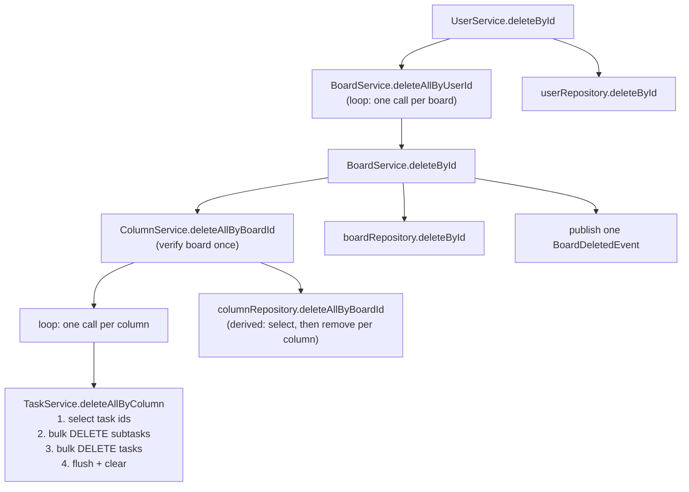

# 02 — Persistence and queries

This layer reads and writes the Kanban graph (user → board → column → task → subtask) in
PostgreSQL through Spring Data JPA and Hibernate. It matters because each request cost in this API
is a count of SQL statements, and this layer controls that count.

**Read first:** [01 — Domain model and schema](01-domain-model-and-schema.md) (tables, foreign
keys, entity mappings). Related: [03 — Optimistic locking](03-optimistic-locking.md),
[04 — Service layer and access control](04-service-layer-and-access-control.md).

**Main code:**

- Repositories: [`repository/`](../../src/main/java/com/vrudenko/kanban_board/repository/)
- Services that own transactions and delete cascades:
  [`BoardService`](../../src/main/java/com/vrudenko/kanban_board/service/BoardService.java),
  [`ColumnService`](../../src/main/java/com/vrudenko/kanban_board/service/ColumnService.java),
  [`TaskService`](../../src/main/java/com/vrudenko/kanban_board/service/TaskService.java),
  [`SubtaskService`](../../src/main/java/com/vrudenko/kanban_board/service/SubtaskService.java),
  [`OwnershipVerifierService`](../../src/main/java/com/vrudenko/kanban_board/service/OwnershipVerifierService.java),
  [`ActivityLogService`](../../src/main/java/com/vrudenko/kanban_board/service/ActivityLogService.java)
- Query-count helper:
  [`AbstractAppTest.countQueries`](../../src/test/java/com/vrudenko/kanban_board/support/fixtures/AbstractAppTest.java#L316-L327)

## Summary of decisions

| ID | Decision | Main reason |
|----|----------|-------------|
| PERS-01 | Spring Data `JpaRepository` interfaces; derived query names for simple reads, explicit `@Query` for ordering, fetch joins and bulk statements | Derived names are validated at startup; explicit JPQL controls SQL shape |
| PERS-02 | Sibling reads use an explicit `order by position asc, id asc` `@Query`, not a renamed derived method | A total order; existing call sites keep compiling |
| PERS-03 | Ownership chain left as it is after measurement (1 statement); no `JOIN FETCH`/`@EntityGraph` added | Measured, not N+1; the planned fix was dropped |
| PERS-04 | Column cascade: verify once, read task ids, bulk-delete subtasks, bulk-delete tasks | 33 statements for 8 tasks → 4, independent of task count |
| PERS-05 | Explicit `@Modifying @Query` bulk deletes instead of derived `deleteAllByXIn` | Derived delete is select-then-remove-per-row and flushes too late (FK violation) |
| PERS-06 | `entityManager.flush()` + `clear()` after bulk statements | Bulk JPQL bypasses the persistence context; stale managed entities broke a later auto-flush |
| PERS-07 | Application-level cascade, children first: subtasks → tasks → columns → board → user | No JPA `cascade` and no `ON DELETE CASCADE` in the schema |
| PERS-08 | Column rows stay on a derived delete (honors `@Version`); tasks/subtasks use bulk (bypass `@Version`) | Accepted, documented asymmetry |
| PERS-09 | `GET /boards/{boardId}/full` uses one chained `LEFT JOIN FETCH` query | 3 statements for any graph size; lazy loading costs 1+1+N+M |
| PERS-10 | Every collection in the fetch chain is a `Set` with identity `equals`/`hashCode` and `@OrderBy("id")` | Prevents `MultipleBagFetchException` and row-multiplication duplicates. Side effect: `/full` returns columns and tasks in id order, not position order (confirmed defect) |
| PERS-11 | `/full` verifies ownership first, fetches by the verified id, maps inside the transaction | Nested response discloses more; no lazy association escapes the transaction |
| PERS-12 | Query counts asserted with `getPrepareStatementCount()` through one helper, as small-vs-large invariance | `getQueryExecutionCount()` misses `findById()` |
| PERS-13 | Test isolation by `@AfterEach` row deletion, not test-managed transaction rollback | Rollback hides `findById()` in the L1 cache and corrupts the metric |
| PERS-14 | `jakarta.transaction.Transactional` on service methods; no `readOnly` anywhere | Reason not recorded (convention) |
| PERS-15 | Position renumbering with one bulk `UPDATE ... SET position = position + :delta` per range | Constant statement count for a move |
| PERS-16 | Activity feed: offset `Pageable`, server-forced sort `createdAt desc, id desc`, matching composite index, page size capped at 100 | Deterministic pages; keyset pagination deferred |
| PERS-17 | `activity_log` has no FK, so no delete cascade reaches it. Only the nonprod reset removes rows, with an explicit bulk delete. A board or account delete keeps them | No FK by design (poison-message risk) |

---

## Repositories and custom queries

### What it is

Each aggregate has one Spring Data interface that extends `JpaRepository<Entity, String>`. Spring
Data generates the implementation at startup. There are no custom repository implementation
classes.

### How it works

The repositories use three kinds of method:

1. **Derived queries.** Spring Data parses the method name into JPQL. Examples:
   [`BoardRepository.findAllByUserId`](../../src/main/java/com/vrudenko/kanban_board/repository/BoardRepository.java#L13),
   [`TaskRepository.countByColumnId`](../../src/main/java/com/vrudenko/kanban_board/repository/TaskRepository.java#L26),
   [`ActivityLogRepository.existsByEventId`](../../src/main/java/com/vrudenko/kanban_board/repository/ActivityLogRepository.java#L26).
2. **Explicit JPQL reads (`@Query`).** Used for a fixed sort order and for the fetch-join graph
   read.
3. **Explicit bulk statements (`@Modifying @Query`).** One `UPDATE` or `DELETE` statement for many
   rows.

The sibling reads carry an explicit two-key sort:

```java
// TaskRepository.findAllByColumnId
@Query(
        "select t from TaskEntity t where t.column.id = :columnId order by t.position asc, t.id asc")
List<TaskEntity> findAllByColumnId(@Param("columnId") String columnId);
```

[`ColumnRepository.findAllByBoardId`](../../src/main/java/com/vrudenko/kanban_board/repository/ColumnRepository.java#L13-L18)
has the same shape, scoped by `board.id`.

`countByColumnId` and `countByBoardId` also act as the "next position" probe for a new task or
column. The code keeps positions contiguous from zero, so the sibling count is the next free slot
([`TaskRepository` comment](../../src/main/java/com/vrudenko/kanban_board/repository/TaskRepository.java#L23-L26)).

### Why we chose it

- **PERS-01.** The derived-name approach needs no JPQL for simple reads. Spring Data validates the
  name at context startup, so a typo fails the test suite, not a request
  ([`ActivityLogRepository` Javadoc](../../src/main/java/com/vrudenko/kanban_board/repository/ActivityLogRepository.java#L14-L24)).
- **PERS-02.** The `(position, id)` sort is a total order. Two rows can share a `position` after
  an accepted concurrent-insert race. The `id` key then gives a deterministic result instead of
  undefined row order
  ([`TaskRepository` comment](../../src/main/java/com/vrudenko/kanban_board/repository/TaskRepository.java#L13-L18)).
  The explicit `@Query` keeps the method name, so no call site changes.

### Alternatives we rejected

- A derived name `findAllByColumnIdOrderByPositionAscIdAsc`. Rejected because every call site
  would need a rename ([`TaskRepository` comment](../../src/main/java/com/vrudenko/kanban_board/repository/TaskRepository.java#L13-L15)).

### Trade-offs and limits

- The `ORDER BY` arrived later than the endpoints (commit `3cd5e99`, plan 06-04). Before that, the
  flat reads had PostgreSQL's incidental row order. The 06-05 work saw that order change between
  runs for the same data
  ([06-05-SUMMARY.md](../../.planning/milestones/v1.2-phases/06-mock-up-feature-gap-closure/06-05-SUMMARY.md),
  deviation 5).

### How we test it

Ordering tests live in the controller and e2e suites, for example
[`ColumnControllerTest.shouldAssignContiguousPositions_whenCreatingThreeTasksInEmptyColumn`](../../src/test/java/com/vrudenko/kanban_board/controller/ColumnControllerTest.java#L287).
The repositories themselves have no unit tests. [ARCHITECTURE.md § Testing](../ARCHITECTURE.md#testing)
states that entities and repositories are deliberately untested because they carry no custom
logic.

### Where this is recorded

- Javadoc and comments in the repository files linked above.
- Commit `3cd5e99` (`feat(06-04): expose position on responses, make sibling reads a total order`).

---

## The ownership chain: measured at one statement

### What it is

Every service method loads its entity through
[`OwnershipVerifierService`](../../src/main/java/com/vrudenko/kanban_board/service/OwnershipVerifierService.java).
For a subtask, the verifier walks subtask → task → column → board → user and calls `findById()`
at every level. The access rules are in [chapter 04](04-service-layer-and-access-control.md). This
section covers only the SQL cost.

### How it works

The chain looks like N+1, but it is not. Two mechanisms collapse it:

1. All four parent-side associations (`SubtaskEntity.task`, `TaskEntity.column`,
   `ColumnEntity.board`, `BoardEntity.user`) are `@ManyToOne` with no `fetch` attribute. The JPA
   default for `@ManyToOne` is `FetchType.EAGER`. For `findById()`, Hibernate loads the whole
   EAGER chain with `LEFT JOIN`s in **one** SQL statement.
2. The verifier methods call each other as plain internal calls, inside one transaction and one
   persistence context. The later `findById()` calls for task, column, board and user find the
   entities already in the first-level (L1) cache. The L1 cache is the per-session identity map
   that Hibernate keeps for managed entities. A cache hit issues no SQL.

```java
// OwnershipVerifierService.verifyOwnershipOfSubtask
var subtask = subtaskRepository.findById(subtaskId);   // 1 SQL statement, joins up to users
...
var pair = verifyOwnershipOfTask(userId, subtask.get().getTask().getId()); // L1 cache hits
```

([`verifyOwnershipOfSubtask`](../../src/main/java/com/vrudenko/kanban_board/service/OwnershipVerifierService.java#L89-L101))

### Why we chose it

**PERS-03.** The Epic 2 plan predicted about 5 round trips per ownership check. It told the
developer to add a `JOIN FETCH` query or an `@EntityGraph` at each entry point
([Epic 2 plan, Finding 1 and task 2](../plans/backend-modernization/02-n-plus-one-optimistic-locking.md)).
The developer measured first. The result was **1 statement** for `verifyOwnershipOfSubtask`. No
code change was made. Two stale `// TODO: optimize verification logic` comments were removed
because they described a problem that did not exist
([STATUS.md, 2026-07-31 entry](../plans/backend-modernization/STATUS.md#notes--decisions-log);
commit `07bedd1`).

This is a reversed plan decision. It is a strong interview topic: the plan said "fix", the
measurement said "no problem", and the measurement won.

### Alternatives we rejected

- `SubtaskRepository.findByIdWithOwnershipChain` with a JPQL `JOIN FETCH` across
  `subtask.task.column.board.user`.
- `@EntityGraph(attributePaths = {"task.column.board.user"})` on the repository method.

Both came from the Epic 2 plan. Both were dropped because the measured cost was already 1.

### Trade-offs and limits

- The 1-statement result depends on the EAGER default. The test comment warns that a
  `fetch = FetchType.LAZY` override on any of the four associations would change it
  ([`OwnershipVerifierServiceTest`](../../src/test/java/com/vrudenko/kanban_board/service/OwnershipVerifierServiceTest.java#L22-L28)).
- It also depends on one shared persistence context. `verifyOwnershipOfBoard` alone costs 2
  statements (user, then board), because it starts with `userRepository.findById` before the
  board is loaded ([`BoardServiceTest` comment](../../src/test/java/com/vrudenko/kanban_board/service/BoardServiceTest.java#L490-L496)).

### How we test it

[`OwnershipVerifierServiceTest.QueryCountTest.verifyOwnershipOfSubtask_issuesOneQuery`](../../src/test/java/com/vrudenko/kanban_board/service/OwnershipVerifierServiceTest.java#L30-L47)
asserts an exact count of `1`. It passed unchanged after the H2 → PostgreSQL test cutover
([STATUS.md, Epic 5 entry](../plans/backend-modernization/STATUS.md#notes--decisions-log)).

### Where this is recorded

- [STATUS.md, 2026-07-31 entry](../plans/backend-modernization/STATUS.md#notes--decisions-log)
- [ARCHITECTURE.md § Testing](../ARCHITECTURE.md#testing)
- Commit `07bedd1` (`fix: resolve genuine N+1 in bulk task/column deletion`)

---

## Bulk deletes: 33 statements to 4

### What it is

N+1 is a query pattern: one query loads a list, then the code runs one more query for each element
of the list. The statement count grows linearly with the data. The real N+1 in this codebase was
the column-level delete cascade.

### How it works

**Before (original `TaskService.deleteAllByColumnId`).** The code verified column ownership once.
Then, for each task, it called `subtaskService.deleteAllByTaskId` and `deleteById`. Each of those
re-verified the full ownership chain. The Epic 2 plan quotes the original loop
([Finding 2](../plans/backend-modernization/02-n-plus-one-optimistic-locking.md)). The measured
cost was **33 statements for 8 tasks**, and it grew with task count.

**After (current [`TaskService.deleteAllByColumn`](../../src/main/java/com/vrudenko/kanban_board/service/TaskService.java#L316-L328)).**
The caller already verified the column. This method does not verify again:

```java
@Transactional
void deleteAllByColumn(ColumnEntity column) {
    var taskIds =
            taskRepository.findAllByColumnId(column.getId()).stream()
                    .map(TaskEntity::getId)
                    .toList();

    subtaskService.deleteAllByTaskIds(taskIds);     // DELETE FROM subtasks WHERE task_id IN (...)
    taskRepository.deleteAllByIdInBatch(taskIds);   // DELETE FROM tasks WHERE id IN (...)

    entityManager.flush();
    entityManager.clear();
}
```

The subtask statement is an explicit bulk query:

```java
// SubtaskRepository
@Modifying
@Query("delete from SubtaskEntity s where s.task.id in :taskIds")
void deleteAllByTaskIdIn(@Param("taskIds") Collection<String> taskIds);
```

([`SubtaskRepository.deleteAllByTaskIdIn`](../../src/main/java/com/vrudenko/kanban_board/repository/SubtaskRepository.java#L16-L22))

`deleteAllByIdInBatch` is a built-in `JpaRepository` method. It issues one JPQL
`DELETE ... WHERE id IN (...)`. [`SubtaskService.deleteAllByTaskIds`](../../src/main/java/com/vrudenko/kanban_board/service/SubtaskService.java#L187-L200)
returns early for an empty id list.

The measured total after the fix was **4 statements, independent of task count**. The sources
record only the total. A breakdown that matches the code is: 1 ownership lookup, 1 task-id
select, 1 subtask bulk delete, 1 task bulk delete. This breakdown is reasoned, not measured.

### Why we chose it

- **PERS-04.** Ownership is known once the column is verified. The per-task re-verification cost
  `~2N × chain depth` for no new information
  ([Epic 2 plan, Finding 2](../plans/backend-modernization/02-n-plus-one-optimistic-locking.md)).
  The same fix went into `ColumnService.deleteAllByBoardId`, which had the same loop one level up
  ([STATUS.md](../plans/backend-modernization/STATUS.md#notes--decisions-log)).
- **PERS-05 (explicit bulk query, not derived delete).** A derived `deleteAllByTaskIdIn` without
  `@Modifying` does not issue one `DELETE`. Spring Data implements it as a `SELECT`, then one
  `entityManager.remove()` per row. Two problems followed:
  1. The per-row removes scale with row count, which is the N+1 again.
  2. The removes stay queued until flush. The next statement, the bulk task delete, runs at once.
     PostgreSQL then saw tasks deleted while their subtasks still existed, and raised an FK
     violation.

  The explicit `@Modifying @Query` executes immediately, so the subtask rows are gone before the
  task delete runs ([`SubtaskRepository` comment](../../src/main/java/com/vrudenko/kanban_board/repository/SubtaskRepository.java#L16-L19);
  commit `07bedd1`). The same reasoning applies to
  [`ActivityLogRepository.deleteAllByUserIdIn`](../../src/main/java/com/vrudenko/kanban_board/repository/ActivityLogRepository.java#L30-L37)
  (quick task 260829-ii3, see its
  [PLAN](../../.planning/quick/260829-ii3-in-the-nonprod-reset-endpoint-add-a-requ/260829-ii3-PLAN.md)).
- **PERS-06 (`flush()` + `clear()`).** A bulk JPQL statement bypasses the persistence context.
  Hibernate does not know that the deleted rows are gone. Managed entities for those rows stay in
  the session. A later auto-flush in the same transaction then tried to write them and failed. The
  failure appeared only when one transaction deleted many aggregates. Two examples are the test
  suite's `deleteAll()` cleanup and account deletion
  ([STATUS.md](../plans/backend-modernization/STATUS.md#notes--decisions-log);
  [`deleteAllByColumn` Javadoc](../../src/main/java/com/vrudenko/kanban_board/service/TaskService.java#L281-L290)).
  `flush()` sends pending changes first. `clear()` detaches every managed entity, so nothing stale
  survives. [`ResetTruncateService.truncateAll`](../../src/main/java/com/vrudenko/kanban_board/service/ResetTruncateService.java#L47-L59)
  and [`ResetService.deleteUsers`](../../src/main/java/com/vrudenko/kanban_board/service/ResetService.java#L124-L140)
  copy the same discipline.

### Alternatives we rejected

- Derived `deleteAllByTaskIdIn`. Rejected for the FK-ordering failure and the per-row cost above.
- Keep the loop but pass verified entities down. The batch form was chosen because it also removes
  the per-task delete statements. Reason for not keeping a loop in any form: not recorded beyond
  "the query count doesn't scale with the number of tasks"
  ([`deleteAllByColumn` Javadoc](../../src/main/java/com/vrudenko/kanban_board/service/TaskService.java#L281-L284)).

### Trade-offs and limits

- **`@Version` bypass (PERS-08).** Bulk statements never load rows as managed entities. Hibernate
  cannot check `@Version` on them, so a concurrent update on a task does not stop its delete. The
  code calls this an accepted delete-wins trade-off
  ([`deleteAllByColumn` Javadoc](../../src/main/java/com/vrudenko/kanban_board/service/TaskService.java#L292-L307)).
  Details are in [chapter 03](03-optimistic-locking.md).
- **No per-child events.** The cascade publishes no `TaskDeletedEvent` or `SubtaskDeletedEvent`.
  One event per child would need a load per child, which is the N+1 again
  ([`ColumnService.deleteAllByBoardId` Javadoc](../../src/main/java/com/vrudenko/kanban_board/service/ColumnService.java#L65-L71)).
- **`clear()` detaches everything.** Any entity that a caller holds before the call becomes
  detached after it. The current callers use only ids after the call.
- **Board delete still scales with column count.** `ColumnService.deleteAllByBoardId` calls
  `deleteAllByColumn` once per column, and the derived column delete removes columns one by one.
  The fix removed the per-task factor, not the per-column factor. No test pins the board-level
  count.

### How we test it

- [`ColumnServiceTest.DeleteByIdTest.shouldCostSameQueryCount_regardlessOfTaskCountInColumn`](../../src/test/java/com/vrudenko/kanban_board/service/ColumnServiceTest.java#L333-L400)
  deletes a column with 2 tasks and a column with 8 tasks. It asserts equal statement counts.
- [`ColumnServiceTest.DeleteByIdTest.shouldDeleteAllTasks_whenColumnHasTasks`](../../src/test/java/com/vrudenko/kanban_board/service/ColumnServiceTest.java#L402-L420)
  uses the FK `fk_tasks_column` as the proof. The FK has no `ON DELETE CASCADE`, so the column
  delete cannot succeed if any task row is left.
- History: the first guard was `TaskServiceTest.DeleteAllByColumnIdQueryCountTest`. Commit
  `ca6f8b6` deleted it together with the dead `deleteAllByColumnId` method. The
  `ColumnServiceTest` case already proved the same property through the live entry point
  ([260813-euo PLAN, D-02](../../.planning/quick/260813-euo-fix-wrong-dto-test-bugs-in-taskcontrolle/260813-euo-PLAN.md)).

### Where this is recorded

- [STATUS.md, 2026-07-31 entry](../plans/backend-modernization/STATUS.md#notes--decisions-log)
- [ARCHITECTURE.md § Testing](../ARCHITECTURE.md#testing)
- Commits `07bedd1` (fix) and `ca6f8b6` (dead method and duplicate test removed)

---

## Cascade delete order

### What it is

A delete of a parent must delete all of its children first. The schema and the mappings give no
automatic help:

- The four foreign keys in
  [`V1__init.sql`](../../src/main/resources/db/migration/V1__init.sql) have no `ON DELETE CASCADE`.
- No `@OneToMany` in the entities has a `cascade` or `orphanRemoval` attribute.

So the services delete the graph by hand, children first.

### How it works



Code:
[`UserService.deleteById`](../../src/main/java/com/vrudenko/kanban_board/service/UserService.java#L84-L97),
[`BoardService.deleteById`](../../src/main/java/com/vrudenko/kanban_board/service/BoardService.java#L63-L84),
[`ColumnService.deleteAllByBoardId`](../../src/main/java/com/vrudenko/kanban_board/service/ColumnService.java#L47-L81),
[`TaskService.deleteAllByColumn`](../../src/main/java/com/vrudenko/kanban_board/service/TaskService.java#L316-L328).

Single-entity deletes follow the same order:

- [`ColumnService.deleteById`](../../src/main/java/com/vrudenko/kanban_board/service/ColumnService.java#L270-L291)
  deletes tasks and subtasks, then the column, then closes the position gap with a bulk shift.
- [`TaskService.deleteById`](../../src/main/java/com/vrudenko/kanban_board/service/TaskService.java#L259-L279)
  deletes subtasks with the derived `SubtaskRepository.deleteAllByTaskId`, then the task.

Each delete method captures the ids it needs for its event before the delete runs. After the
delete, there is no row to read them from
([`TaskService.deleteById` Javadoc](../../src/main/java/com/vrudenko/kanban_board/service/TaskService.java#L253-L258)).

### Why we chose it

**PERS-07.** The order is forced by the FKs. A reason for having no `ON DELETE CASCADE` or JPA
`cascade` is not recorded. The code shows that the service-level cascade lets each level choose its
own delete strategy: bulk for tasks and subtasks, derived for columns (PERS-08).

**PERS-08.** The column step is a derived delete on purpose. It loads each `ColumnEntity` as a
managed entity, so Hibernate runs its versioned delete. A concurrent column update can therefore
surface `OptimisticLockingFailureException` in the middle of a board delete. The equivalent race on
tasks proceeds silently. The code documents this asymmetry "rather than reconciled, per the
accepted tradeoff carried from research"
([`ColumnService.deleteAllByBoardId` Javadoc](../../src/main/java/com/vrudenko/kanban_board/service/ColumnService.java#L51-L63)).

### Trade-offs and limits

- A developer who adds a new child table must add a delete step at the correct level. The FK
  raises an error if the step is missing, so the failure is loud.
- `activity_log` has no FK to users or boards
  ([`ActivityLogEntity` Javadoc](../../src/main/java/com/vrudenko/kanban_board/entity/ActivityLogEntity.java#L21-L26)).
  The cascade above therefore never reaches it (PERS-17). Only the nonprod reset removes those rows,
  with the explicit bulk `deleteAllByUserIdIn`. No other service uses `ActivityLogRepository` for a
  delete. A normal `DELETE /boards/{boardId}` keeps the whole history of the board. The consumer
  then adds one more `BOARD_DELETED` row
  ([`ActivityLogConsumer`](../../src/main/java/com/vrudenko/kanban_board/activitylog/ActivityLogConsumer.java#L120-L121)).
  A review run showed 5 rows before the delete and 6 rows after it. The API cannot read these rows
  after the delete, because the ownership check returns 404. The test cleanup calls `activityLogRepository.deleteAll()`
  separately, guarded by
  [`ActivityLogCleanupIsolationTest`](../../src/test/java/com/vrudenko/kanban_board/activitylog/ActivityLogCleanupIsolationTest.java)
  ([STATUS.md, Epic 5 entry, D-02a](../plans/backend-modernization/STATUS.md#notes--decisions-log)).

### How we test it

- [`ColumnServiceTest.shouldDeleteAllTasks_whenColumnHasTasks`](../../src/test/java/com/vrudenko/kanban_board/service/ColumnServiceTest.java#L402-L420) (FK as proof).
- [`UserServiceTest.DeleteById`](../../src/test/java/com/vrudenko/kanban_board/service/UserServiceTest.java#L79)
  covers the account-level cascade.
- Every test's `@AfterEach` cleanup runs the full cascade for all users
  ([`AbstractAppTest`](../../src/test/java/com/vrudenko/kanban_board/support/fixtures/AbstractAppTest.java#L36-L48)).
  This is the path that first exposed the stale-entity auto-flush failure.

### Where this is recorded

- The Javadoc of the service methods above.
- [260813-euo PLAN, D-03](../../.planning/quick/260813-euo-fix-wrong-dto-test-bugs-in-taskcontrolle/260813-euo-PLAN.md)
  (the FK-as-proof test design).

---

## `GET /boards/{boardId}/full`: the nested board read

### What it is

One request returns a board with its columns, each column with its tasks, and each task with its
subtasks. Before it existed, a client needed four sequential HTTP round trips to render one board
screen ([06-05-PLAN.md](../../.planning/milestones/v1.2-phases/06-mock-up-feature-gap-closure/06-05-PLAN.md#L82-L103)).
The requirement is GAP-04 in
[v1.2-REQUIREMENTS.md](../../.planning/milestones/v1.2-REQUIREMENTS.md). It was also the first open
deliverable of Epic 2.

### How it works

The controller
[`BoardController.findFullById`](../../src/main/java/com/vrudenko/kanban_board/controller/BoardController.java#L84-L95)
calls the service:

```java
// BoardService.findFullById
@Transactional
public BoardFullResponseDTO findFullById(String userId, String boardId) {
    var verifiedBoard = findById(userId, boardId);          // ownership check: 2 statements

    var fullBoard = boardRepository.findByIdWithColumnsTasksAndSubtasks(verifiedBoard.getId());
    if (fullBoard.isEmpty()) {
        throw new AppEntityNotFoundException("Board");
    }

    return boardFullMapper.toBoardFullResponseDTO(fullBoard.get()); // maps inside the transaction
}
```

([`BoardService.findFullById`](../../src/main/java/com/vrudenko/kanban_board/service/BoardService.java#L102-L123))

The query is one JPQL statement with three chained fetch joins:

```java
@Query(
        "SELECT DISTINCT b FROM BoardEntity b "
                + "LEFT JOIN FETCH b.column c "
                + "LEFT JOIN FETCH c.task t "
                + "LEFT JOIN FETCH t.subtasks s "
                + "WHERE b.id = :boardId")
Optional<BoardEntity> findByIdWithColumnsTasksAndSubtasks(@Param("boardId") String boardId);
```

([`BoardRepository.findByIdWithColumnsTasksAndSubtasks`](../../src/main/java/com/vrudenko/kanban_board/repository/BoardRepository.java#L17-L56))

`JOIN FETCH` tells Hibernate to load the joined collection in the same SQL statement and to
populate it on the entity. Hibernate turns this into one `SELECT` with `LEFT OUTER JOIN`s from
`boards` to `columns`, `tasks` and `subtasks`. `LEFT` keeps a board with no columns, a column with
no tasks, and a task with no subtasks. The result has one SQL row per (column, task, subtask)
combination. Hibernate folds these rows back into one object graph.

The DTO tree comes from a MapStruct composition chain:
[`BoardFullMapper`](../../src/main/java/com/vrudenko/kanban_board/mapper/BoardFullMapper.java)
→ `ColumnFullMapper` → `TaskFullMapper` → the existing `SubtaskMapper`, connected with the
`uses = {...}` attribute. The entity fields are singular (`column`, `task`), so the mappers carry
explicit `@Mapping(source = "column", target = "columns")` lines.

**Statement count:** 3 for any graph size. Two come from the ownership check (user, then board).
One is the fetch join ([`BoardServiceTest` comment](../../src/test/java/com/vrudenko/kanban_board/service/BoardServiceTest.java#L490-L496)).

### Why we chose it

- **PERS-09.** The chained fetch join is "the only option that actually delivers the endpoint's
  reason for existing" ([06-05-PLAN.md, design rationale](../../.planning/milestones/v1.2-phases/06-mock-up-feature-gap-closure/06-05-PLAN.md#L105-L122)).
  Lazy loading would cost 1 + 1 + N + M statements: board, columns, one per column for tasks, one
  per task for subtasks. The developer replaced the fetch join with a plain `findById` by hand.
  The count then grew with the graph: **9 vs. 23** statements for the small and large test boards
  ([06-05-SUMMARY.md, coverage D4](../../.planning/milestones/v1.2-phases/06-mock-up-feature-gap-closure/06-05-SUMMARY.md)).
- **PERS-10.** `MultipleBagFetchException` is a Hibernate error. Hibernate raises it when one
  query fetch-joins two or more "bags". A bag is an unordered `List` collection with no index
  column. The research and the plan said the exception fires only for two `List`s on the **same**
  parent, so a linear chain was safe
  ([06-RESEARCH.md](../../.planning/milestones/v1.2-phases/06-mock-up-feature-gap-closure/06-RESEARCH.md#L417-L435)).
  The first test run proved this wrong. Two `List`s at different depths (`board.column` and
  `column.task`) already raised it. The fix made every collection in the chain a `Set`. With zero
  bags, the exception cannot fire.
- **PERS-10, second finding.** A `List` that survives in a multi-level fetch keeps duplicates.
  `DISTINCT` removed duplicate root `BoardEntity` rows only, not duplicates in nested
  collections. One column with 14 underlying rows appeared 14 times in `board.getColumn()`. A `Set`
  removes these duplicates ([`BoardRepository` Javadoc](../../src/main/java/com/vrudenko/kanban_board/repository/BoardRepository.java#L17-L49)).
- **PERS-10, third finding.** A `Set` calls `hashCode()` on each element. `SubtaskEntity` and
  `ColumnEntity` had field-based `equals`/`hashCode` that excluded `id`. Two sibling subtasks with
  the same title and `isCompleted = false` were equal, so the `HashSet` dropped one. The flat-vs-nested
  test caught a real lost subtask. The fix uses `Object` identity. This is safe because
  Hibernate's identity map gives the same Java reference for the same row inside one persistence
  context ([`SubtaskEntity` comment](../../src/main/java/com/vrudenko/kanban_board/entity/SubtaskEntity.java#L21-L33);
  [`ColumnEntity` comment](../../src/main/java/com/vrudenko/kanban_board/entity/ColumnEntity.java#L37-L53)).
- **PERS-10, fourth finding.** A plain `HashSet` has no iteration order. `@OrderBy("id")` on each
  collection gives a deterministic order
  ([`BoardEntity.column`](../../src/main/java/com/vrudenko/kanban_board/entity/BoardEntity.java#L35-L51)).
  That order is id order, not position order. See "Trade-offs and limits" below.
- **PERS-11.** The service verifies ownership first and fetches with `verifiedBoard.getId()`,
  never the raw path parameter. A nested response discloses more than a flat one, so the check
  matters more here ([`findFullById` Javadoc](../../src/main/java/com/vrudenko/kanban_board/service/BoardService.java#L102-L112)).
  The mapping runs inside the `@Transactional` method, so the DTO tree is complete before the
  transaction ends.
- **PERS-11, the flat-DTO exception.** [PROJECT.md](../../.planning/PROJECT.md#L90) records that
  DTOs are flat to avoid `LazyInitializationException`, and that `/full` must justify a nested DTO.
  The justification has three parts. The query fetches the graph eagerly and explicitly. The
  mapping runs inside the transaction. The exception applies to one DTO family only
  (`*FullResponseDTO`)
  ([06-05-PLAN.md, `flat_dto_exception_justification`](../../.planning/milestones/v1.2-phases/06-mock-up-feature-gap-closure/06-05-PLAN.md#L82-L103)).

### Alternatives we rejected

| Approach | Why rejected | Source |
|---|---|---|
| Hand-written aggregation service | Brings back the N+1 fan-out unless it uses the same fetch join; more code; breaks "MapStruct owns mapping" | [06-05-PLAN.md](../../.planning/milestones/v1.2-phases/06-mock-up-feature-gap-closure/06-05-PLAN.md#L105-L122) |
| Lazy loading inside the transaction | 1 + 1 + N + M statements; "the failure mode this endpoint exists to fix" | same |
| Client fan-out over the four flat endpoints | Four sequential HTTP round trips per screen | same, `flat_dto_exception_justification` |
| `@BatchSize` on collections, or two queries stitched in Java | The Epic 2 plan recommended these to avoid the Cartesian product. The implementation did not take them. Reason not recorded; the 06-05 plan does not list them | [Epic 2 plan, task 4](../plans/backend-modernization/02-n-plus-one-optimistic-locking.md) |
| `@EntityGraph` | Not evaluated in the 06-05 plan. Reason not recorded | — |

The `@BatchSize` row is a reversed recommendation. The original plan said "use `@BatchSize` ...
instead of a triple JOIN FETCH". The shipped code uses the triple JOIN FETCH and accepts the row
multiplication.

### Trade-offs and limits

- **Row multiplication.** The single query returns one row per leaf combination. Bytes from the
  database grow multiplicatively while round trips fall to one. The plan accepts this for a
  realistic board and states that a pathological board would not be a win
  ([06-05-PLAN.md, non-obvious trade-offs](../../.planning/milestones/v1.2-phases/06-mock-up-feature-gap-closure/06-05-PLAN.md#L124-L135)).
- **Memory.** The whole board graph sits in one heap-resident DTO tree. There is no pagination.
- **Fragile shape.** The `BoardRepository` Javadoc warns: "If a fourth `List`-typed association
  is ever added anywhere in this query's fetch chain, both problems return."
- **Order is by `id`, not `position` (confirmed defect).** `@OrderBy("id")` sorts nested columns
  and tasks by id. The flat endpoints sort by `position, id` (PERS-02). After a move or a reorder,
  `/full` returns a different order from the flat reads. In one run, a column was moved to position
  0 and a task to position 0. The flat reads showed them first. `/full` still showed them in id
  order. The DTOs carry `position`, so a client can sort. No planning document records this gap.
  Confirmed by running on 2026-09-23.
- **`@OrderBy("id")` is a string sort.** Ids are base36 strings. The
  [`BoardService.save` decision record](../../src/main/java/com/vrudenko/kanban_board/service/BoardService.java#L208-L215)
  states that base36 string order does not keep numeric order when string lengths differ. For
  that reason, caller-supplied ids are allowed for boards only.
- **`DISTINCT` in Hibernate 6.** The Hibernate 6 migration guide states that Hibernate always
  removes duplicate root entities from a fetch-join result, with or without `DISTINCT`. The
  repository comment gives `DISTINCT` as the root-dedup mechanism. The query was not tested without
  `DISTINCT` in this repository. Status: reasoned about only.

### How we test it

- [`BoardServiceTest.FindFullByIdQueryCountTest.queryCountDoesNotScaleWithGraphSize`](../../src/test/java/com/vrudenko/kanban_board/service/BoardServiceTest.java#L405-L500)
  builds a 2×2×2 graph and a 4×4×4 graph and asserts equal statement counts. It was falsified by
  hand: without the fetch join, the counts were 9 and 23 and the test failed.
- [`BoardFullReadTest`](../../src/test/java/com/vrudenko/kanban_board/controller/BoardFullReadTest.java)
  (MockMvc, real PostgreSQL):
  - `GetFullBoard.shouldReturnNestedDocumentFourLevelsDeep_whenBoardHasColumnsTasksAndSubtasks`
  - `GetFullBoard.shouldReturnEmptyColumnsArray_whenBoardHasNoColumns`, and the matching tests
    for empty tasks and empty subtasks
  - `GetFullBoard.shouldReturnForbiddenAndDiscloseNothing_whenBoardOwnedByAnotherUser`
  - `GetFullBoard.shouldReturnNotFound_whenBoardDoesNotExist`
  - `FlatEquivalence.shouldMatchFlatEndpointsFieldByField_forSameBoard`
  - `FlatEquivalence.shouldContainSameElementsAsFlatEndpoints_andBeInternallyOrdered_forSameBoard`

### Where this is recorded

- [06-05-PLAN.md](../../.planning/milestones/v1.2-phases/06-mock-up-feature-gap-closure/06-05-PLAN.md)
  (alternatives, trade-offs, flat-DTO justification)
- [06-05-SUMMARY.md](../../.planning/milestones/v1.2-phases/06-mock-up-feature-gap-closure/06-05-SUMMARY.md)
  (five deviations, measured counts)
- [`BoardRepository` Javadoc](../../src/main/java/com/vrudenko/kanban_board/repository/BoardRepository.java#L17-L49)
- Commits `098db48` (endpoint and first `List` → `Set` fix), `ed24cf0` (query-count test),
  `2df315f` (second `Set` fix, identity equality, `@OrderBy`)

---

## Transactions: `@Transactional`

### What it is

A transaction groups the statements of one service call so that they commit or roll back together.
It also defines the lifetime of the persistence context that holds managed entities.

### How it works

- Every service uses `jakarta.transaction.Transactional` (the JTA annotation), not Spring's
  `org.springframework.transaction.annotation.Transactional`. A search of `src/main` finds only the
  `jakarta` import. Spring supports both annotations with the same proxy mechanism.
- No method uses `readOnly`. The `jakarta` annotation has no `readOnly` attribute.
- The annotation sits on service methods that read then write, on cascade deletes, and on most
  reads that walk associations. Some pure reads have no annotation, for example
  [`BoardService.findAllByUserId`](../../src/main/java/com/vrudenko/kanban_board/service/BoardService.java#L51-L53)
  and [`UserService.findByEmail`](../../src/main/java/com/vrudenko/kanban_board/service/UserService.java#L46-L54).
- Default propagation is `REQUIRED`: an inner annotated method joins the caller's transaction.
- Create methods such as [`TaskService.save`](../../src/main/java/com/vrudenko/kanban_board/service/TaskService.java#L48-L58)
  carry their own `@Transactional` even though every current caller is already transactional. The
  reason: `@TransactionalEventListener` silently skips delivery when no transaction is active. With
  its own annotation, a future direct call still publishes its event.
- Internal calls on `this` do not pass through the Spring proxy, so they do not start a new
  transaction. `OwnershipVerifierService` depends on this: its levels share one persistence
  context, which gives the 1-statement result (PERS-03). `ResetTruncateService` exists as a separate
  bean for the opposite reason: it needs a real proxy boundary
  ([`ResetTruncateService` Javadoc](../../src/main/java/com/vrudenko/kanban_board/service/ResetTruncateService.java#L26-L32)).

### Why we chose it

**PERS-14.** Reason not recorded. Planning documents describe `jakarta.transaction.Transactional`
as "the one this codebase already imports", and new services copy it
(for example [02-02-PLAN.md](../../.planning/milestones/v1.1-phases/02-kafka-foundation-domain-events-move-endpoint/02-02-PLAN.md)).
No document compares it with Spring's annotation or discusses `readOnly`.

### Trade-offs and limits

- Without Spring's annotation, the code cannot set `readOnly = true`. Spring's `readOnly` flag
  lets Hibernate skip dirty checking for a read-only transaction. This optimization is not
  available here.
- `jakarta.transaction.Transactional` uses `rollbackOn`/`dontRollbackOn`, not Spring's
  `rollbackFor`. No method in this codebase sets either attribute.
- Four package-private methods carry `@Transactional`: `TaskService.deleteAllByColumn`,
  `SubtaskService.save`, `SubtaskService.findById` and `BoardService.deleteAll`. The
  [260813-euo PLAN, D-03 option C](../../.planning/quick/260813-euo-fix-wrong-dto-test-bugs-in-taskcontrolle/260813-euo-PLAN.md)
  states that Spring applies proxy-based `@Transactional` to public methods only. Spring Framework
  6 documentation states that class-based proxies also support package-visible methods. This
  repository has no test that decides the question. In practice both methods run inside the
  caller's public transactional method, so the outcome is the same.

### How we test it

No test targets transaction boundaries directly. The event-publishing tests depend on commit
(`AFTER_COMMIT` listeners), and PERS-13 below keeps test transactions out of the way.

---

## Lazy loading and fetch types

### What it is

A lazy association loads from the database the first time code reads it. If the persistence
context is already closed at that moment, Hibernate throws `LazyInitializationException`.

### How it works

| Association | Type | Fetch | Source |
|---|---|---|---|
| `BoardEntity.user`, `ColumnEntity.board`, `TaskEntity.column`, `SubtaskEntity.task` | `@ManyToOne` | EAGER (JPA default) | entity files |
| `UserEntity.boards`, `BoardEntity.column`, `ColumnEntity.task`, `TaskEntity.subtasks` | `@OneToMany(mappedBy = ...)` | LAZY (JPA default) | entity files |

The code avoids lazy access outside a transaction in three ways:

1. Response DTOs are flat. A `TaskResponseDTO` carries ids, not a nested column object.
2. Services map entities to DTOs inside `@Transactional` methods and return DTOs, not entities.
3. The one nested read (`/full`) fetch-joins every collection it maps (PERS-11).

### Trade-offs and limits

- **Open Session in View is on.** `spring.jpa.open-in-view` is not set in
  [`application.properties`](../../src/main/resources/application.properties), so the Spring Boot
  default `true` applies. The test logs show the Spring Boot startup warning:
  `spring.jpa.open-in-view is enabled by default. Therefore, database queries may be performed
  during view rendering.` With this setting, the persistence context stays open for the whole web
  request. A lazy access in a controller would run an extra query instead of throwing. The
  project's documents describe `LazyInitializationException` as the risk
  ([PROJECT.md](../../.planning/PROJECT.md#L90)), but the current configuration hides that failure
  mode on the web path. No planning document records a decision about this setting.
- **EAGER to-one has a cost too.** Every task load also loads its column, board and user. For
  `findById()` Hibernate joins them. For a JPQL list query, Hibernate loads EAGER to-one
  associations with extra selects if they are not already in the persistence context. The list
  reads here run after the ownership check, which already loaded the shared parent. This is
  reasoned about only; no test pins the list-read count.
- **`SubtaskService.deleteById` depends on EAGER.** Its Javadoc states that the task/column/board
  chain is reachable because the `@ManyToOne` associations are EAGER by default
  ([`SubtaskService.deleteById`](../../src/main/java/com/vrudenko/kanban_board/service/SubtaskService.java#L146-L153)).

### How we test it

The fetch-type assumption is pinned indirectly by
[`OwnershipVerifierServiceTest.verifyOwnershipOfSubtask_issuesOneQuery`](../../src/test/java/com/vrudenko/kanban_board/service/OwnershipVerifierServiceTest.java#L30-L47).
A `LAZY` override on the chain would change the count and fail the test.

---

## Query-count assertions

### What it is

A query-count test counts the SQL statements that one service call sends. It turns "no N+1" from a
code-review opinion into a failing test.

### How it works

The test profile turns on Hibernate statistics:

```properties
# application-test.properties
spring.jpa.properties.hibernate.generate_statistics=true
```

([`application-test.properties`](../../src/main/resources/application-test.properties#L22-L23))

One helper reads the counter:

```java
// AbstractAppTest.countQueries
protected long countQueries(Runnable action) {
    var statistics = entityManagerFactory.unwrap(SessionFactory.class).getStatistics();
    statistics.clear();
    action.run();
    return statistics.getPrepareStatementCount();
}
```

([`AbstractAppTest.countQueries`](../../src/test/java/com/vrudenko/kanban_board/support/fixtures/AbstractAppTest.java#L316-L327))

Most tests assert **invariance**: a small data set and a large data set must give the same count.
They do not assert an absolute number, except the ownership-chain test (`== 1`).

| Test | Small vs. large |
|---|---|
| [`OwnershipVerifierServiceTest.QueryCountTest.verifyOwnershipOfSubtask_issuesOneQuery`](../../src/test/java/com/vrudenko/kanban_board/service/OwnershipVerifierServiceTest.java#L30-L47) | exact `1` |
| [`ColumnServiceTest.DeleteByIdTest.shouldCostSameQueryCount_regardlessOfTaskCountInColumn`](../../src/test/java/com/vrudenko/kanban_board/service/ColumnServiceTest.java#L333-L400) | 2 tasks vs. 8 tasks |
| [`BoardServiceTest.FindFullByIdQueryCountTest.queryCountDoesNotScaleWithGraphSize`](../../src/test/java/com/vrudenko/kanban_board/service/BoardServiceTest.java#L405-L500) | 2×2×2 vs. 4×4×4 graph |
| [`TaskServiceTest.MoveToColumnQueryCountTest.queryCountDoesNotScaleWithSourceColumnSize`](../../src/test/java/com/vrudenko/kanban_board/service/TaskServiceTest.java#L32-L90) | 1-task vs. 8-task source column |

### Why we chose it

- **PERS-12, the counter.** `getQueryExecutionCount()` counts only HQL/JPQL queries.
  `repository.findById()` compiles to `EntityManager.find()`, which is not an HQL query, so that
  counter misses it. `getPrepareStatementCount()` counts every JDBC `PreparedStatement` that
  Hibernate prepares, which includes `find()` lookups and bulk statements
  ([`countQueries` Javadoc](../../src/test/java/com/vrudenko/kanban_board/support/fixtures/AbstractAppTest.java#L316-L321)).
  The Epic 2 plan told the developer to use `getQueryExecutionCount()`
  ([task 1](../plans/backend-modernization/02-n-plus-one-optimistic-locking.md)). The developer
  switched to `getPrepareStatementCount()` when writing the helper
  ([STATUS.md](../plans/backend-modernization/STATUS.md#notes--decisions-log)). This is another
  reversed plan decision.
- **PERS-12, one helper.** [CODE_STYLE.md rule 4](../CODE_STYLE.md#4-no-mocks--test-against-real-spring-wiring)
  makes `countQueries` "the only sanctioned way to assert on query counts".
- **PERS-12, invariance.** An absolute count breaks each time an unrelated statement joins the
  path. An equality between a small and a large graph fails only when the count starts to scale.
  The source records the falsification for the `/full` test (9 vs. 23 without the fetch join).
  A reason for choosing invariance over absolute counts in general is not recorded.
- **PERS-13, no rollback isolation.** Tests clean up with plain `@AfterEach` deletion. Test-managed
  `@Transactional` rollback was rejected for three reasons. One of them is this metric. A shared
  persistence context across `@BeforeEach` and the act keeps fixtures in the L1 cache. The cache
  then hides `findById()` calls ([`AbstractAppTest` Javadoc](../../src/test/java/com/vrudenko/kanban_board/support/fixtures/AbstractAppTest.java#L36-L48)).
  The other two: rollback never delivers `AFTER_COMMIT` events, and it gives no isolation to real
  cross-thread HTTP tests.

### Trade-offs and limits

- Statistics are process-wide. `statistics.clear()` resets the counters for the whole
  `SessionFactory`. A background thread that runs SQL during `action.run()` would add to the
  count. No such interference is recorded.
- Statistics are on in the test profile only. Production has no statement-count signal.
- The count depends on the dialect. The H2 → PostgreSQL cutover changed none of the counts
  ([STATUS.md, Epic 5 entry](../plans/backend-modernization/STATUS.md#notes--decisions-log)).

### Where this is recorded

- [STATUS.md, 2026-07-31 entry](../plans/backend-modernization/STATUS.md#notes--decisions-log)
- [ARCHITECTURE.md § Testing](../ARCHITECTURE.md#testing)
- [CODE_STYLE.md rule 4](../CODE_STYLE.md#4-no-mocks--test-against-real-spring-wiring)
- Commit `07bedd1` (helper added); the counter later moved with the test fixture refactor
  (`948e1b1`).

---

## Position renumbering with bulk updates

### What it is

Tasks and columns carry a `position` that stays contiguous from zero inside its parent. A move or
reorder must shift the siblings between the old and the new position.

### How it works

One bulk JPQL `UPDATE` shifts a whole range:

```java
// TaskRepository.shiftPositions
@Modifying
@Query(
        "update TaskEntity t set t.position = t.position + :delta "
                + "where t.column.id = :columnId "
                + "and t.position >= :fromPosition and t.position <= :toPosition")
void shiftPositions(...);
```

([`TaskRepository.shiftPositions`](../../src/main/java/com/vrudenko/kanban_board/repository/TaskRepository.java#L28-L53);
[`ColumnRepository.shiftPositions`](../../src/main/java/com/vrudenko/kanban_board/repository/ColumnRepository.java#L22-L42))

### Why we chose it

**PERS-15.** One statement per range keeps the move cost constant for any sibling count. The race
window is one statement wide instead of a read-modify-write loop
([`TaskRepository` Javadoc](../../src/main/java/com/vrudenko/kanban_board/repository/TaskRepository.java#L28-L33)).

### Trade-offs and limits

- **Caution:** a shift without the `t.column.id` predicate renumbers every task of every user.
  Keep the parent-id predicate in every shift statement
  ([`TaskRepository` Javadoc](../../src/main/java/com/vrudenko/kanban_board/repository/TaskRepository.java#L35-L36)).
- The bulk update bypasses the persistence context, like the bulk deletes. The callers exclude the
  moved entity's own position from every range, so the managed entity never goes stale.
  [`TaskService.moveToColumn`](../../src/main/java/com/vrudenko/kanban_board/service/TaskService.java#L157-L251)
  documents this.
- Shifted siblings do not get a `@Version` increment. See [chapter 03](03-optimistic-locking.md).

### How we test it

[`TaskServiceTest.MoveToColumnQueryCountTest.queryCountDoesNotScaleWithSourceColumnSize`](../../src/test/java/com/vrudenko/kanban_board/service/TaskServiceTest.java#L32-L90).

---

## Activity feed pagination

### What it is

`GET /boards/{boardId}/activity` returns the board's activity log, newest first, one page at a
time. The rows are insert-only and have no `@Version`.

### How it works

1. The controller takes a Spring Data `Pageable` from the query string (`page`, `size`)
   ([`ActivityController`](../../src/main/java/com/vrudenko/kanban_board/controller/ActivityController.java#L27-L46)).
2. `spring.data.web.pageable.default-page-size=20` and `max-page-size=100` clamp the size
   ([`application.properties`](../../src/main/resources/application.properties#L314-L315)).
3. The service verifies board ownership, then discards any caller-supplied sort and forces a
   total order:

```java
// ActivityLogService.findAllByBoardId
var createdAtDesc = Sort.Order.desc("createdAt");
var idDesc = Sort.Order.desc("id");
var deterministicSort = Sort.by(createdAtDesc, idDesc);
var effectivePageable =
        PageRequest.of(pageable.getPageNumber(), pageable.getPageSize(), deterministicSort);

var page =
        activityLogRepository.findAllByBoardId(pair.getSecond().getId(), effectivePageable);
```

([`ActivityLogService.findAllByBoardId`](../../src/main/java/com/vrudenko/kanban_board/service/ActivityLogService.java#L24-L57))

4. The derived `Page<ActivityLogEntity> findAllByBoardId(String, Pageable)` issues a `SELECT`
   with `ORDER BY created_at DESC, id DESC`, `OFFSET` and `LIMIT`. For a `Page` return type,
   Spring Data also issues a `COUNT` query when it needs the total.
5. The index `idx_activity_log_board_created_id ON activity_log (board_id, created_at DESC, id DESC)`
   matches the filter and the sort. The migration comment says this makes the read an index scan
   instead of a sort of the whole board history
   ([`V3__add_activity_log.sql`](../../src/main/resources/db/migration/V3__add_activity_log.sql#L15-L19)).

### Why we chose it

**PERS-16.**

- Offset `Pageable` for consistency with the rest of the API (READ-02 in
  [v1.1-REQUIREMENTS.md](../../.planning/milestones/v1.1-REQUIREMENTS.md)).
- The `id` tiebreak makes the order total. Without it, rows with the same `createdAt` can appear on
  two pages or on none ([`ActivityLogService` Javadoc](../../src/main/java/com/vrudenko/kanban_board/service/ActivityLogService.java#L24-L41)).
- The server ignores a caller-chosen sort, so a client cannot bring back that non-determinism.

### Alternatives we rejected

- **Keyset (cursor) pagination.** Research marked it as more correct for an unbounded, append-only
  feed. It is deferred as PAGE-V2-01 ([v1.1-REQUIREMENTS.md](../../.planning/milestones/v1.1-REQUIREMENTS.md);
  [PROJECT.md](../../.planning/PROJECT.md#L77)). Revisit only if activity-log scale becomes a real
  concern.
- **`PagedModel` response wrapper.** The endpoint returns the raw `Page<T>` (`PageImpl` JSON).
  `PagedModel` would give a versioned contract but change every consumer's parsing. Not decided
  yet; if it changes, it must change for every paginated endpoint at once
  ([`ActivityController` comment](../../src/main/java/com/vrudenko/kanban_board/controller/ActivityController.java#L30-L39)).

### Trade-offs and limits

- Offset pagination cannot give a stable snapshot under concurrent inserts. A new row shifts later
  pages by one, so a client can see an item twice or miss it. The Javadoc states this is inherent
  to offset pagination.
- A deep `OFFSET` still makes PostgreSQL walk and discard the skipped index entries. The log has no
  retention policy (migration comment).

### How we test it

[`ActivityReadTest.FindAllByBoardIdTest`](../../src/test/java/com/vrudenko/kanban_board/e2e/activity/ActivityReadTest.java#L98):

- `shouldReturnNewestFirst_whenRowsHaveDistinctTimestamps`
- `shouldReturnEveryRowExactlyOnce_whenManyRowsShareTheSameInstant`
- `shouldClampPageSize_whenRequestedSizeExceedsConfiguredMaximum`
- `shouldIgnoreCallerSuppliedSort_andStayNewestFirst`
- `shouldRejectAnotherUsersBoard_andNotFoundUnknownBoard`

### Where this is recorded

- [03-CONTEXT.md](../../.planning/milestones/v1.1-phases/03-activity-log-consumer-reliability-read-api/03-CONTEXT.md)
- Commit `59b478c` (`feat(03-03): serve GET /boards/{boardId}/activity paginated read endpoint`)

---

## Known gaps and open items

1. **Nested order differs from flat order (confirmed defect).** `/full` sorts columns and tasks by
   `id`; the flat endpoints sort by `position, id`. After a move or a reorder, `/full` returns the
   items in id order, and the flat reads return them in position order. Not recorded in any
   planning document. Confirmed by running on 2026-09-23.
2. **Stale test comment.** The comment in
   `BoardFullReadTest.shouldContainSameElementsAsFlatEndpoints_andBeInternallyOrdered_forSameBoard`
   says neither flat repository has an `ORDER BY`. Both now have one (commit `3cd5e99`).
3. **Board delete scales with column count.** One `deleteAllByColumn` call and one derived column
   remove per column. No query-count test covers `BoardService.deleteById`.
4. **Single-task delete scales with subtask count.** `TaskService.deleteById` uses the derived
   `SubtaskRepository.deleteAllByTaskId`, which is select-then-remove-per-row. This is observed in
   the code; it is not recorded or tested.
5. **Open Session in View is on by default.** No decision is recorded. The flat-DTO rationale
   (avoid `LazyInitializationException`) does not match the web-path behavior with OSIV on.
6. **No `readOnly` transactions.** The `jakarta` annotation cannot express them.
7. **No index on the FK columns** `columns.board_id`, `tasks.column_id`, `subtasks.task_id`.
   PostgreSQL does not create these automatically. The sibling reads, the bulk deletes and the
   fetch join all filter or join on them. Observed in the migrations; not recorded anywhere.
8. **Board and account deletes do not remove `activity_log` rows.** `BoardService.deleteById` and
   `UserService.deleteById` have no activity cleanup. Only the nonprod reset does it. After a board
   delete, the table keeps the history of the board and gets one more `BOARD_DELETED` row. The rows
   keep the user id, and no retention policy removes them. Observed in the code and in a review run;
   not recorded.
9. **Keyset pagination** for the activity feed is deferred (PAGE-V2-01).

### Doc-vs-code contradictions found while writing this chapter

- [ARCHITECTURE.md § Testing](../ARCHITECTURE.md#testing) names `TaskService.deleteAllByColumnId`.
  Commit `ca6f8b6` deleted that method. The live path is `TaskService.deleteAllByColumn`. The 33 → 4
  numbers are historical measurements of the old method.
- [STATUS.md, Epic 5 entry](../plans/backend-modernization/STATUS.md#notes--decisions-log) names
  `TaskServiceTest.DeleteAllByColumnIdQueryCountTest`. That test no longer exists; the guard is now
  `ColumnServiceTest.shouldCostSameQueryCount_regardlessOfTaskCountInColumn`.
- [06-RESEARCH.md](../../.planning/milestones/v1.2-phases/06-mock-up-feature-gap-closure/06-RESEARCH.md#L417-L435)
  and the 06-05 task 2 title say "exactly 1 `PreparedStatement`". The measured total for
  `findFullById` is 3 (2 ownership + 1 fetch join). The fetch join itself is 1.
- The same research said a linear chain of `List`s does not trigger `MultipleBagFetchException`.
  The code proved this wrong (PERS-10).
- [06-05-SUMMARY.md](../../.planning/milestones/v1.2-phases/06-mock-up-feature-gap-closure/06-05-SUMMARY.md)
  says a foreign board returns 401. The current test is `shouldReturnForbiddenAndDiscloseNothing...`
  (403). Chapter 04 covers the 401/403 split.
- Several comments call entity ids ULIDs: `TaskRepository.findAllByColumnId`, `TaskEntity.subtasks`,
  `ActivityLogService.findAllByBoardId`, `ActivityLogEntity`. The ids are base36 RandFlake values
  (see chapter 01). `BoardService.save` also records that base36 string order does not keep numeric
  order, so "id order approximates creation order" is weaker than those comments suggest.

---

## Questions to check your knowledge

1. **The ownership chain calls `findById()` four times for a subtask. Why is it 1 SQL statement?**
   <details><summary>Answer</summary>

   The four `@ManyToOne` parents are EAGER by default, so the first `findById()` joins the whole
   chain up to `users` in one statement. The later `findById()` calls run in the same persistence
   context and hit the L1 cache. `OwnershipVerifierServiceTest` pins the count at 1.
   </details>

2. **What was the real N+1, and what were the numbers?**
   <details><summary>Answer</summary>

   The column delete cascade. It looped over tasks and re-verified ownership twice per task: 33
   statements for 8 tasks, growing with task count. After the fix: verify once, select ids, one
   bulk delete for subtasks, one for tasks. The result was 4 statements for any task count.
   </details>

3. **Why not use Spring Data's derived `deleteAllByTaskIdIn`?**
   <details><summary>Answer</summary>

   A derived delete is a `SELECT` followed by one `remove()` per row, so it scales with row count.
   The removes also wait for the flush. The bulk task delete ran first, so PostgreSQL raised an FK
   violation. An explicit `@Modifying @Query` runs immediately as one `DELETE`.
   </details>

4. **Why `flush()` and `clear()` after a bulk delete?**
   <details><summary>Answer</summary>

   Bulk JPQL bypasses the persistence context. Hibernate still holds managed entities for deleted
   rows, and a later auto-flush tried to write them. `flush()` sends pending work first; `clear()`
   detaches every stale entity. The failure showed only when one transaction deleted many
   aggregates.
   </details>

5. **How many statements does `GET /boards/{boardId}/full` run, and how do you know?**
   <details><summary>Answer</summary>

   3: user and board for the ownership check, then one fetch-join query. `BoardServiceTest` asserts
   equal counts for a 2×2×2 and a 4×4×4 graph. Without the fetch join the counts were 9 and 23, and
   the test failed.
   </details>

6. **What is `MultipleBagFetchException`, and what did this project learn about it?**
   <details><summary>Answer</summary>

   Hibernate raises it when one query fetch-joins two or more bags (`List` collections without an
   index column). The plan assumed it applied only to sibling lists on one parent. In practice two
   lists at different depths triggered it. The fix made every collection in the chain a `Set`.
   </details>

7. **After the switch to `Set`, which two further bugs appeared?**
   <details><summary>Answer</summary>

   First, a remaining `List` kept row-multiplication duplicates, because `DISTINCT` affects the
   root only. Second, field-based `equals`/`hashCode` on `SubtaskEntity` and `ColumnEntity` merged
   distinct siblings in the `HashSet`. The fixes were all-`Set` collections and identity equality.
   `@OrderBy("id")` then restored a deterministic order. That order is id order, so `/full` does not
   follow `position` after a move or a reorder. This defect was confirmed by running on 2026-09-23.
   </details>

8. **The Epic 2 plan recommended `@BatchSize` or two queries for the full board. What shipped,
   and what is the cost?**
   <details><summary>Answer</summary>

   A single triple `LEFT JOIN FETCH`. The cost is row multiplication: one SQL row per leaf
   combination, so transferred bytes grow multiplicatively. The plan accepts this for realistic
   boards. The reason for not choosing `@BatchSize` is not recorded.
   </details>

9. **Why does `countQueries` use `getPrepareStatementCount()`?**
   <details><summary>Answer</summary>

   `getQueryExecutionCount()` counts only HQL/JPQL queries and misses `EntityManager.find()`, which
   is what `findById()` uses. `getPrepareStatementCount()` counts every prepared JDBC statement.
   The original plan asked for the weaker counter; the implementation changed it.
   </details>

10. **Why do the tests not use `@Transactional` rollback for isolation?**
    <details><summary>Answer</summary>

    A shared persistence context would keep fixtures in the L1 cache and hide `findById()` calls
    from the counter. Rollback also never fires `AFTER_COMMIT` events, and it does not isolate real
    cross-thread HTTP tests. Tests delete rows in `@AfterEach` instead.
    </details>

11. **Why do column rows use a derived delete while tasks use a bulk delete?**
    <details><summary>Answer</summary>

    The derived column delete loads each column as a managed entity, so Hibernate checks
    `@Version`. The bulk task delete never loads rows and bypasses `@Version` (delete wins). The
    code documents this asymmetry as an accepted trade-off.
    </details>

12. **Why must the cascade delete children first, and what enforces it?**
    <details><summary>Answer</summary>

    The FKs in `V1__init.sql` have no `ON DELETE CASCADE`, and the entities have no JPA `cascade`.
    A parent delete with children left raises an FK violation.
    `ColumnServiceTest.shouldDeleteAllTasks_whenColumnHasTasks` uses that FK as its proof.
    </details>

13. **Why does the activity feed ignore the client's sort parameter?**
    <details><summary>Answer</summary>

    The service forces `createdAt desc, id desc`, a total order. With only `createdAt`, rows with
    the same timestamp have no fixed order between page requests, so a row can appear twice or never.
    The composite index `(board_id, created_at DESC, id DESC)` supports this order.
    </details>

14. **With `spring.jpa.open-in-view` unset, what happens if a controller reads a lazy collection?**
    <details><summary>Answer</summary>

    Spring Boot's default is `true`, so the session stays open for the whole request. The access
    runs an extra query instead of throwing `LazyInitializationException`. The test logs show the
    startup warning. The project has no recorded decision about this setting.
    </details>
