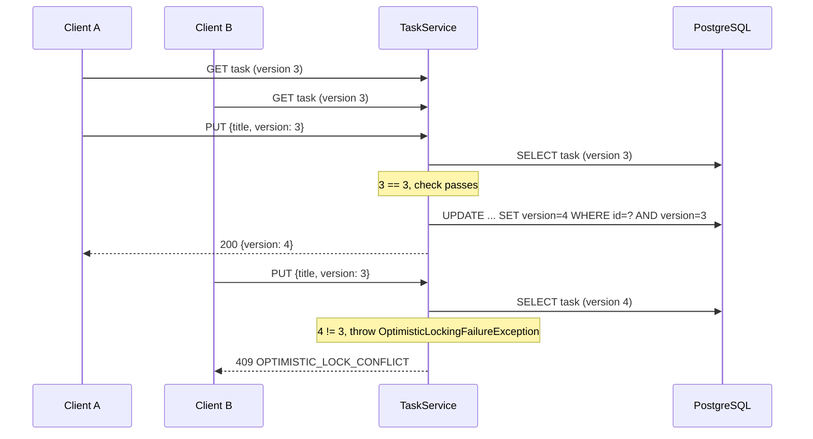

# 03 — Optimistic locking

This layer detects two conflicting writes to the same board, column, task or subtask and rejects
the second write with HTTP 409. Without it, the second writer silently overwrites the first
writer's change, and neither client knows that a change was lost.

**Read first:** [01 — Domain model and schema](01-domain-model-and-schema.md),
[02 — Persistence and queries](02-persistence-and-queries.md)
**Related:** [05 — API layer](05-api-layer.md) (error envelope, DTO conventions)
**Main code:**

- Entities: [BoardEntity](../../src/main/java/com/vrudenko/kanban_board/entity/BoardEntity.java),
  [ColumnEntity](../../src/main/java/com/vrudenko/kanban_board/entity/ColumnEntity.java),
  [TaskEntity](../../src/main/java/com/vrudenko/kanban_board/entity/TaskEntity.java),
  [SubtaskEntity](../../src/main/java/com/vrudenko/kanban_board/entity/SubtaskEntity.java)
- Services: [TaskService](../../src/main/java/com/vrudenko/kanban_board/service/TaskService.java),
  [ColumnService](../../src/main/java/com/vrudenko/kanban_board/service/ColumnService.java),
  [BoardService](../../src/main/java/com/vrudenko/kanban_board/service/BoardService.java),
  [SubtaskService](../../src/main/java/com/vrudenko/kanban_board/service/SubtaskService.java)
- Error mapping: [GlobalExceptionHandler](../../src/main/java/com/vrudenko/kanban_board/handler/GlobalExceptionHandler.java)
- Migrations: [V2](../../src/main/resources/db/migration/V2__add_optimistic_locking_version_columns.sql),
  [V5](../../src/main/resources/db/migration/V5__add_position_subtask_version_theme_board_name_uniqueness.sql),
  [V7](../../src/main/resources/db/migration/V7__add_board_optimistic_locking_version_column.sql)
- Architecture summary: [ARCHITECTURE.md — Concurrency: optimistic locking](../ARCHITECTURE.md#concurrency-optimistic-locking)

## Summary of decisions

| ID | Decision | Main reason |
|----|----------|-------------|
| LOCK-01 | Use optimistic locking (a version number per row), not pessimistic row locks | The epic spec prescribes `@Version`; pessimistic locks were rejected as "new concepts" where they came up |
| LOCK-02 | Put `@Version` on each of the four entities, not on `BaseEntity` | `BaseEntity` would also give `UserEntity` a version |
| LOCK-03 | The client sends the version it read in the JSON request body, as a required `version` field | One mechanism for every resource; `ETag`/`If-Match` headers rejected |
| LOCK-04 | The service compares the client version with the loaded entity version before any mutation | Hibernate's own check cannot see a stale read from an earlier HTTP request |
| LOCK-05 | Call `entityManager.flush()` before the response DTO is built | Hibernate increments the in-memory version only when the UPDATE runs |
| LOCK-06 | Show `version` on every response DTO, flat and nested | A client never needs an extra GET to learn the current version |
| LOCK-07 | Map `OptimisticLockingFailureException` to 409 with a `ProblemDetail` body and code `OPTIMISTIC_LOCK_CONFLICT` | 409 is the correct HTTP status for a retriable conflict (was 423); one error envelope for the whole API |
| LOCK-08 | `UserEntity` has no version; the theme write is last-write-wins | A 409 on a user's own theme toggle is worse than applying it |
| LOCK-09 | Bulk JPQL deletes bypass `@Version` (delete wins) | A per-row version check would bring back the N+1 cost the batch delete removes |
| LOCK-10 | Reorder and move check the version before any position shift, and the bulk shift does not increment sibling versions | A client that edits a sibling must not get a 409 because another task moved |
| LOCK-11 | Accept the concurrent-insert position race; no `UNIQUE(column_id, position)`, no `SELECT ... FOR UPDATE` | Four new concepts to protect a presentational field |
| LOCK-12 | Version columns: `bigint NOT NULL DEFAULT 0`, first as a manual DDL bridge, then as Flyway V2, V5, V7 | Production auto-deploys on push; the column must exist before the code ships |
| LOCK-13 | Keep `version` out of `equals`/`hashCode` | A field that changes on every update must not drive a hash |
| LOCK-14 | Add `PUT /boards/{boardId}/columns/{columnId}` so the column version is reachable | Without an update endpoint the column `@Version` is untestable through the API |
| LOCK-15 | Check ownership (403) and request shape (400) before the version (409) | A version check must not leak information about another user's row |

## The problem and the concurrency model

### What it is

A lost update occurs when two clients read the same row, both change it, and the second write
replaces the first. The epic spec gives the concrete case: two clients drag the same task at the
same time, and one move silently overwrites the other
([02-n-plus-one-optimistic-locking.md, task 5](../plans/backend-modernization/02-n-plus-one-optimistic-locking.md)).

Two standard solutions exist:

- **Optimistic locking.** Each row carries a version number. A write succeeds only if the row still
  has the version that the writer read. No lock is held between the read and the write.
- **Pessimistic locking.** The writer locks the row when it reads it (`SELECT ... FOR UPDATE`, or
  JPA `LockModeType.PESSIMISTIC_WRITE`). Other writers wait until the lock is released.

### How it works

This project uses optimistic locking on `BoardEntity`, `ColumnEntity`, `TaskEntity` and
`SubtaskEntity`. No code in `src/main` uses `PESSIMISTIC_WRITE`, `FOR UPDATE` or an explicit
isolation level. All transactions run at the PostgreSQL default, `READ COMMITTED`
([06-RESEARCH.md, "Isolation level"](../../.planning/milestones/v1.2-phases/06-mock-up-feature-gap-closure/06-RESEARCH.md)).

### Why we chose it

**LOCK-01.** The epic spec prescribes `@Version private Long version` on `TaskEntity` and
`ColumnEntity` and a 409 mapping. The spec also asks the owner to "explain optimistic vs
pessimistic locking using your drag-and-drop scenario"
([epic spec](../plans/backend-modernization/02-n-plus-one-optimistic-locking.md)). The phase
context does not record a separate comparison with pessimistic locking for the core feature:
reason not recorded beyond the spec.

The facts of the system support the choice:

1. A pessimistic lock lasts only for one transaction. Here, the read (GET) and the write (PUT) are
   two separate HTTP requests, so a database lock cannot span the time a user looks at the board.
2. The realistic concurrency is low. One user has at most two concurrent sessions
   (`maximumSessions(2)`), and the planning documents repeatedly describe the exposure as "one user
   racing themselves across their two permitted concurrent sessions"
   ([06-04-PLAN.md](../../.planning/milestones/v1.2-phases/06-mock-up-feature-gap-closure/06-04-PLAN.md)).
3. Where a pessimistic lock was proposed for a nearby problem, the plans rejected it. The
   board-name uniqueness plan says: "Deliberately no pessimistic lock and no serializable isolation
   — both would be new concepts in a codebase that has neither, to protect a name field"
   ([06-02-PLAN.md](../../.planning/milestones/v1.2-phases/06-mock-up-feature-gap-closure/06-02-PLAN.md)).

### Alternatives we rejected

- **Pessimistic locks.** Not compared formally for this feature (see above). Rejected for the
  related name-uniqueness and position-race problems (**LOCK-11**).
- **Last-write-wins everywhere.** This is the behavior before v1.0. It is still the behavior for
  the theme preference only (**LOCK-08**).

### Trade-offs and limits

- A conflict costs the client one extra round trip: it must fetch the current state and retry.
- The server does not merge changes. Two edits to different fields of the same task still conflict.
- Optimistic locking protects one row. It does not protect an invariant across rows, for example
  "positions in a column are unique" (**LOCK-11**).

### Where this is recorded

- [01-CONTEXT.md](../../.planning/milestones/v1.0-phases/01-optimistic-locking/01-CONTEXT.md) (phase boundary)
- [PROJECT.md, key decisions table](../../.planning/PROJECT.md)

## The `@Version` field on four entities

### What it is

`@Version` is a JPA annotation. It marks a numeric field that Hibernate increments on every UPDATE
and adds to the `WHERE` clause of that UPDATE.

### How it works

Each of the four entities declares the same field. For example,
[TaskEntity.version](../../src/main/java/com/vrudenko/kanban_board/entity/TaskEntity.java#L52-L54):

```java
@Version
@Column(nullable = false)
private Long version;
```

The same field exists in
[BoardEntity.version](../../src/main/java/com/vrudenko/kanban_board/entity/BoardEntity.java#L63-L66),
[ColumnEntity.version](../../src/main/java/com/vrudenko/kanban_board/entity/ColumnEntity.java#L58-L60)
and [SubtaskEntity.version](../../src/main/java/com/vrudenko/kanban_board/entity/SubtaskEntity.java#L46-L48).

When a managed entity is dirty at flush time, Hibernate issues a versioned UPDATE of this shape:

```sql
update tasks set title = ?, ..., version = :loadedVersion + 1
where id = ? and version = :loadedVersion
```

If the statement changes zero rows, another transaction changed the row first. Hibernate then
throws a stale-state exception.

### Why we chose it

**LOCK-02.** The phase context says: `@Version` goes directly on `TaskEntity`/`ColumnEntity`,
"NOT on `BaseEntity` (would unscope the change to `UserEntity`/`BoardEntity`/`SubtaskEntity` too)"
([01-CONTEXT.md, Established Patterns](../../.planning/milestones/v1.0-phases/01-optimistic-locking/01-CONTEXT.md)).
Subtask and Board received their own field later (**LOCK-12**). `UserEntity` still has none
(**LOCK-08**), so the per-entity placement is still necessary.

**LOCK-13.** The version must not take part in `equals`/`hashCode`. An object stored in a
`HashSet` under its old hash becomes unreachable when a hashed field changes. The current code
handles this in two ways:

- `BoardEntity` still derives `equals`/`hashCode` from its fields, so it marks `version` with
  `@EqualsAndHashCode.Exclude`. The comment on
  [BoardEntity.version](../../src/main/java/com/vrudenko/kanban_board/entity/BoardEntity.java#L57-L66)
  gives this reason.
- `ColumnEntity`, `TaskEntity` and `SubtaskEntity` use identity-based `equals`/`hashCode` (no
  Lombok `@EqualsAndHashCode` at all), so the version cannot affect them.

### Alternatives we rejected

- **`@Version` on `BaseEntity`.** Rejected, see **LOCK-02**.
- **`version` inside Lombok's generated `equals`/`hashCode`.** Rejected, see **LOCK-13**.

### Trade-offs and limits

The history of **LOCK-13** changed. In v1.0, `ColumnEntity` used `@Data` with an
`@EqualsAndHashCode.Exclude` on `version`, and `TaskEntity` had its `@EqualsAndHashCode`
commented out. The v1.0 code review flagged this inconsistency (WR-04 in
[01-REVIEW.md](../../.planning/milestones/v1.0-phases/01-optimistic-locking/01-REVIEW.md)). Later,
the nested board read turned the child collections into `Set`s, and `ColumnEntity` dropped
field-based `equals`/`hashCode` completely. The reason is in the comment on
[ColumnEntity.task](../../src/main/java/com/vrudenko/kanban_board/entity/ColumnEntity.java#L42-L56):
two sibling columns with the same name would otherwise merge into one `Set` element.

### How we test it

[FlywaySchemaProvenanceTest.shouldDefaultTasksVersionColumnToZero_whenSchemaIsBuiltByV2Migration](../../src/test/java/com/vrudenko/kanban_board/config/FlywaySchemaProvenanceTest.java#L166)
reads `information_schema` and asserts that `tasks.version` defaults to `0`.

### Where this is recorded

- [01-01-SUMMARY.md](../../.planning/milestones/v1.0-phases/01-optimistic-locking/01-01-SUMMARY.md), commit `1b496c5`
- [07.1-CONTEXT.md, D-13](../../.planning/milestones/v1.2-phases/07.1-address-hard-blockers-and-inconsistencies-from-the-frontend/07.1-CONTEXT.md) (Board)

## How the client sends the version

### What it is

The client reads `version` from a response and sends the same number back in the body of the next
write. The server never takes the new version from the client.

### How it works

Every write DTO for a versioned entity has a required field:

| Endpoint | Request DTO | Field |
|----------|-------------|-------|
| `PUT /boards/{boardId}` | [UpdateBoardRequestDTO](../../src/main/java/com/vrudenko/kanban_board/dto/board_dto/UpdateBoardRequestDTO.java) | `@NotNull Long version` |
| `PUT /boards/{boardId}/columns/{columnId}` | [UpdateColumnRequestDTO](../../src/main/java/com/vrudenko/kanban_board/dto/column_dto/UpdateColumnRequestDTO.java) | `@NotNull Long version` |
| `PATCH /boards/{boardId}/columns/{columnId}/reorder` | [ReorderColumnRequestDTO](../../src/main/java/com/vrudenko/kanban_board/dto/column_dto/ReorderColumnRequestDTO.java) | `@NotNull Long version` |
| `PUT .../tasks/{taskId}` | [UpdateTaskRequestDTO](../../src/main/java/com/vrudenko/kanban_board/dto/task_dto/UpdateTaskRequestDTO.java) | `@NotNull Long version` |
| `PATCH /tasks/{taskId}/move` | [MoveTaskRequestDTO](../../src/main/java/com/vrudenko/kanban_board/dto/task_dto/MoveTaskRequestDTO.java) | `@NotNull Long version` |
| `PUT .../subtasks/{subtaskId}` | [UpdateSubtaskRequestDTO](../../src/main/java/com/vrudenko/kanban_board/dto/subtask_dto/UpdateSubtaskRequestDTO.java) | `@NotNull Long version` |

A request without `version` fails Jakarta Validation. The client gets a 400, not a silent
overwrite. No HTTP header carries the version.

Every response DTO carries `version`: `BoardResponseDTO`, `BoardFullResponseDTO`,
`ColumnResponseDTO`, `ColumnFullResponseDTO`, `TaskResponseDTO`, `TaskFullResponseDTO` and
`SubtaskResponseDTO`. MapStruct copies the field because the names match.

A typical session:

1. `GET /api/boards/{boardId}/full` returns the board with `"version": 3` on a task.
2. The client sends `PUT .../tasks/{taskId}` with `{"title": "New", "version": 3}`.
3. The response carries `"version": 4`. The client keeps `4` for the next write.

### Why we chose it

**LOCK-03.** The body field is the mechanism that lets a client say which version it read. Plan
07.1-05 compared it with `ETag`/`If-Match` headers for Board and rejected the headers: "Boards
would be the only resource in the API using a header-based scheme while Columns, Tasks and
Subtasks use a body field", and a frontend would need "two mental models"
([07.1-05-PLAN.md, alternatives](../../.planning/milestones/v1.2-phases/07.1-address-hard-blockers-and-inconsistencies-from-the-frontend/07.1-05-PLAN.md)).
[docs/CODE_STYLE.md rule 6](../CODE_STYLE.md) makes the field mandatory on every
`Update*RequestDTO`. The rule's reason: "omitting `@NotNull Long version` silently disables
optimistic locking for that entity — the request still passes validation and the write still
succeeds".

**LOCK-06.** Decision D-01 in
[01-CONTEXT.md](../../.planning/milestones/v1.0-phases/01-optimistic-locking/01-CONTEXT.md) shows
the version "on ALL response paths (single-item GET, list endpoints, create/update responses)" so
that "a client never needs an extra GET just to learn the current version". For Board, decision
D-15 in [07.1-CONTEXT.md](../../.planning/milestones/v1.2-phases/07.1-address-hard-blockers-and-inconsistencies-from-the-frontend/07.1-CONTEXT.md)
added the board's own version to `BoardFullResponseDTO`. Plan 07.1-05 also added it to the flat
`BoardResponseDTO`. Without it, "a client doing sequential renames must call `GET /boards/{id}/full`
after every `PUT` purely to re-read a number the `PUT` already knew".

**LOCK-14.** Before v1.0, `ColumnController` had no update endpoint. Decision D-04 in
[01-CONTEXT.md](../../.planning/milestones/v1.0-phases/01-optimistic-locking/01-CONTEXT.md) added
`PUT /boards/{boardId}/columns/{columnId}` so that the column `@Version` is "actually
reachable/testable through the API rather than only defensively present".

### Alternatives we rejected

- **Keep the version internal (no API exposure).** Offered and rejected in the phase discussion
  ([01-DISCUSSION-LOG.md](../../.planning/milestones/v1.0-phases/01-optimistic-locking/01-DISCUSSION-LOG.md)).
- **Show the version only on single-item GET and update responses.** Rejected for the full
  contract (D-01).
- **`ETag`/`If-Match` headers.** Rejected, see **LOCK-03**.

### Trade-offs and limits

- A required `version` is a breaking change for any caller written before it. Decision D-13 in
  07.1-CONTEXT.md calls the Board field "one-way — once boards ship with a required `version`
  field, removing it later breaks any frontend already built against it."
- `UpdateColumnRequestDTO.name` is mandatory, but `UpdateBoardRequestDTO.name` is optional. A
  pending todo records that no test or use case supports a version-only board update
  ([todo](../../.planning/todos/pending/2026-08-11-updateboardrequestdto-name-optionality-rests-on-same-unex.md)).

### How we test it

- `update_withoutVersion_returnsBadRequest` in
  [TaskLockingTest](../../src/test/java/com/vrudenko/kanban_board/e2e/task/TaskLockingTest.java#L138)
  and [ColumnLockingTest](../../src/test/java/com/vrudenko/kanban_board/e2e/column/ColumnLockingTest.java#L128).
- `BoardLockingTest.MissingVersion.rename_withoutVersion_returnsBadRequestWithVersionFieldError`
  and `BoardLockingTest.VersionExposure` (`findFullById_shouldReturnBoardsOwnVersion_notOnlyNestedVersions`,
  `findAllByUserId_shouldReturnVersionOnEveryBoard`) in
  [BoardLockingTest](../../src/test/java/com/vrudenko/kanban_board/e2e/board/BoardLockingTest.java).
- `TaskMoveTest.MoveToColumn.MissingVersion.shouldReturnBadRequest_whenVersionIsMissing` in
  [TaskMoveTest](../../src/test/java/com/vrudenko/kanban_board/e2e/task/TaskMoveTest.java#L741).

### Where this is recorded

- [01-CONTEXT.md](../../.planning/milestones/v1.0-phases/01-optimistic-locking/01-CONTEXT.md) (D-01, D-02, D-04)
- [07.1-05-PLAN.md](../../.planning/milestones/v1.2-phases/07.1-address-hard-blockers-and-inconsistencies-from-the-frontend/07.1-05-PLAN.md)
- [docs/CODE_STYLE.md rule 6](../CODE_STYLE.md)

## The explicit compare-before-mutate check

### What it is

Each update method compares the version from the request with the version of the entity that it
just loaded. It does this before it changes any field. A mismatch throws Spring's
`OptimisticLockingFailureException`.

### How it works

[TaskService.updateById](../../src/main/java/com/vrudenko/kanban_board/service/TaskService.java#L104-L155)
shows the pattern (excerpt, event publication removed):

```java
@Transactional
public TaskResponseDTO updateById(String userId, String taskId, UpdateTaskRequestDTO dto) {
    var task = findById(userId, taskId);            // ownership-verified load

    if (!task.getVersion().equals(dto.getVersion())) {
        throw new OptimisticLockingFailureException(
                "Task was modified by another request, please refetch.");
    }

    if (Optional.ofNullable(dto.getTitle()).isPresent()) {
        task.setTitle(dto.getTitle());
    }
    // ... description ...
    taskRepository.save(task);
    entityManager.flush();                          // UPDATE runs now, version increments
    // ... publish TaskUpdatedEvent ...
    return taskMapper.toTaskResponseDTO(task);
}
```

The same shape is in
[ColumnService.updateById](../../src/main/java/com/vrudenko/kanban_board/service/ColumnService.java#L127-L173),
[BoardService.updateById](../../src/main/java/com/vrudenko/kanban_board/service/BoardService.java#L125-L181)
and [SubtaskService.updateById](../../src/main/java/com/vrudenko/kanban_board/service/SubtaskService.java#L87-L144).

Two rules hold in all four methods:

- The service reads `dto.getVersion()` only for the comparison. It never writes the client value
  onto the entity. Hibernate generates the new value.
- Events are published only after the check passes, so a rejected update publishes nothing.



### Why we chose it

**LOCK-04.** Hibernate's automatic check compares the version at load time with the version at
flush time, inside one transaction. In this codebase, each PUT loads the row fresh and saves it in
the same transaction. In the diagram, Client B's request loads version 4, so Hibernate's check
passes, and B would overwrite A's change. Only the client knows that it read version 3. Decision
D-02 in [01-CONTEXT.md](../../.planning/milestones/v1.0-phases/01-optimistic-locking/01-CONTEXT.md)
records this: "relying on Hibernate's automatic per-transaction `@Version` check alone would NOT
catch it, since this codebase's update flow loads-then-saves fresh within one transaction." The
same decision marks it "costly" to reverse. Without the check, "the feature stops actually
protecting against stale-read conflicts, even though `@Version` is still present."

**LOCK-05.** Hibernate increments the in-memory `version` only when the UPDATE statement runs. That
normally happens at commit, after the service has built the response. Without the flush, every
successful update returned the old version. The executor found this while it wrote the first E2E
test ([01-01-SUMMARY.md, deviation 2](../../.planning/milestones/v1.0-phases/01-optimistic-locking/01-01-SUMMARY.md)).

**LOCK-15.** The order of checks is deliberate:

1. `findById(userId, ...)` verifies ownership first. A user who sends a wrong version for another
   user's subtask gets 403, not 409. A 409 would confirm that the row exists.
2. `TaskService.moveToColumn` rejects a target column on another board with 400 before the version
   check. Its Javadoc says that a wrong-board target "is a request-shape problem independent of
   concurrency, so 400 is the more specific signal to return first"
   ([TaskService.moveToColumn](../../src/main/java/com/vrudenko/kanban_board/service/TaskService.java#L157-L251)).
3. `BoardService.updateById` compares the version before the duplicate-name check, "matching
   `ColumnService`'s 'compare before any other logic' ordering".

### Alternatives we rejected

- **Rely on Hibernate's implicit check only (no DTO field).** Offered in the v1.0 discussion as
  "Simpler, but doesn't really solve the stated concurrent-edit problem"
  ([01-DISCUSSION-LOG.md](../../.planning/milestones/v1.0-phases/01-optimistic-locking/01-DISCUSSION-LOG.md)).
  Rejected again for Board as approach B in 07.1-05-PLAN.md: "it looks like locking without
  providing it."
- **Copy the client version onto the entity and let Hibernate compare.** Not recorded as an
  option. The code comments state the opposite rule: the client value is "never assigned".

### Trade-offs and limits

- The explicit check and the UPDATE are two steps. Two requests that both load version N before
  either one flushes both pass the explicit check. Hibernate's versioned UPDATE then protects the
  row: the second UPDATE matches zero rows. See "Known gaps" for the HTTP status of that path.
- The comparison `task.getVersion().equals(dto.getVersion())` dereferences the entity version
  directly. WR-03 in [01-REVIEW.md](../../.planning/milestones/v1.0-phases/01-optimistic-locking/01-REVIEW.md)
  flagged a possible NPE (500) if a row ever had a `NULL` version. The column is `NOT NULL`, so this
  path is theoretical. The warning is still open.
- A no-op update (all fields set to their current values) produces no dirty field. Hibernate then
  issues no UPDATE, and the response returns the same version. WR-02 in 01-REVIEW.md flagged this.
  The code has no `FORCE_INCREMENT` or other fix.

### How we test it

- `concurrentConflictingUpdates_firstSucceeds_secondReturnsConflict` in
  [TaskLockingTest](../../src/test/java/com/vrudenko/kanban_board/e2e/task/TaskLockingTest.java#L42)
  and [ColumnLockingTest](../../src/test/java/com/vrudenko/kanban_board/e2e/column/ColumnLockingTest.java#L34).
  Two PUTs carry the same starting version. The first gets 200 with a new version. The second gets
  409. A retry of the same stale PUT also gets 409.
- `update_withCurrentVersion_succeedsAndReturnsIncrementedVersion` in the same classes proves
  **LOCK-05**: the response version is greater than the starting version.
- `BoardLockingTest.ConcurrentRename.concurrentConflictingRenames_firstSucceeds_secondReturnsConflict`
  ([BoardLockingTest](../../src/test/java/com/vrudenko/kanban_board/e2e/board/BoardLockingTest.java#L59))
  also asserts the `application/problem+json` content type and `$.code`.
- `SubtaskLockingTest.UpdateById.shouldReturnConflictAndLeaveStateUnchanged_whenVersionIsStale`
  ([SubtaskLockingTest](../../src/test/java/com/vrudenko/kanban_board/e2e/subtask/SubtaskLockingTest.java#L138))
  reads the subtask back after the 409 and asserts that the stale write changed nothing.
- `SubtaskLockingTest.UpdateById.shouldReturnForbidden_whenSubtaskOwnedByAnotherUser_andVersionCheckNeverRuns`
  ([line 247](../../src/test/java/com/vrudenko/kanban_board/e2e/subtask/SubtaskLockingTest.java#L247))
  proves **LOCK-15**: a wrong version on another user's subtask returns 403.

All of these tests send the two requests one after the other with the same stale version. They
test the explicit check. No test runs two requests in parallel against the Hibernate-level race.

### Where this is recorded

- [01-CONTEXT.md, D-02](../../.planning/milestones/v1.0-phases/01-optimistic-locking/01-CONTEXT.md)
- [PROJECT.md, key decisions table](../../.planning/PROJECT.md)
- [RETROSPECTIVE.md, v1.0](../../.planning/RETROSPECTIVE.md) (the "load → compare → throw →
  mutate → save → flush → map" pattern)
- Javadoc on each `updateById` method

## The 409 response

### What it is

[GlobalExceptionHandler.handleOptimisticLockingFailure](../../src/main/java/com/vrudenko/kanban_board/handler/GlobalExceptionHandler.java#L151-L159)
turns `OptimisticLockingFailureException` into HTTP 409 Conflict with an RFC 7807 `ProblemDetail`
body. RFC 7807 is the IETF standard format for machine-readable HTTP error bodies.

### How it works

```java
@ExceptionHandler(OptimisticLockingFailureException.class)
public ResponseEntity<ProblemDetail> handleOptimisticLockingFailure(
        OptimisticLockingFailureException ex) {
    var problem = ProblemDetail.forStatusAndDetail(HttpStatus.CONFLICT, ex.getMessage());
    problem.setProperty(ErrorCode.CODE_PROPERTY, ErrorCode.OPTIMISTIC_LOCK_CONFLICT.name());

    return ResponseEntity.status(problem.getStatus()).body(problem);
}
```

The response has the content type `application/problem+json`. The body has this shape (the `code`
property is at the top level, as the tests assert):

```json
{
  "type": "about:blank",
  "title": "Conflict",
  "status": 409,
  "detail": "Task was modified by another request, please refetch.",
  "code": "OPTIMISTIC_LOCK_CONFLICT"
}
```

The `detail` text names the resource type (Board, Column, Task or Subtask). It does not include the
id, because the client already has the id in the request URL. See [05 — API layer](05-api-layer.md)
for the full error envelope.

### Why we chose it

**LOCK-07.** Before v1.0, this handler already existed but returned 423 Locked. The research found
this bug, and commit `1b496c5` changed it to 409. The code review agreed that 409 "matches HTTP
semantics for a client-retriable conflict"
([01-REVIEW.md](../../.planning/milestones/v1.0-phases/01-optimistic-locking/01-REVIEW.md)). 423 is
a WebDAV status for a locked resource, and no lock exists here.

The body shape is a reversed decision:

1. v1.0, decision D-05 in [01-CONTEXT.md](../../.planning/milestones/v1.0-phases/01-optimistic-locking/01-CONTEXT.md):
   a plain `ResponseEntity<String>` message, "matching every other `GlobalExceptionHandler`
   handler". The owner first chose "message + resource id/type", then removed the id: "during
   update id isn't changed" ([01-DISCUSSION-LOG.md](../../.planning/milestones/v1.0-phases/01-optimistic-locking/01-DISCUSSION-LOG.md)).
2. v1.2 Phase 07.1, decisions D-01 and D-03 in
   [07.1-CONTEXT.md](../../.planning/milestones/v1.2-phases/07.1-address-hard-blockers-and-inconsistencies-from-the-frontend/07.1-CONTEXT.md):
   every handler moves to `ProblemDetail`, with a stable `code` "so the frontend can branch on more
   than just HTTP status". `OPTIMISTIC_LOCK_CONFLICT` is named there as an example. Commit
   `63536a0` made the change.

The message text itself did not change between the two versions.

### Alternatives we rejected

- **423 Locked.** The original, incorrect status.
- **Return the current entity state in the 409 body.** Offered in the v1.0 discussion, not chosen.
- **A structured error DTO in v1.0.** Rejected at the time because no precedent existed. The later
  `ProblemDetail` change replaced this reasoning for the whole API.

### Trade-offs and limits

- `ErrorCode` values are a published contract. Its Javadoc says that "renaming a member ... is a
  breaking change" ([ErrorCode](../../src/main/java/com/vrudenko/kanban_board/constant/ErrorCode.java)).
- A board-name conflict also returns 409, with a different code (`DUPLICATE_RESOURCE`). A client
  must branch on `code`, not only on the status.

### How we test it

[GlobalExceptionHandlerTest.OptimisticLockConflictTest.shouldReturnProblemDetailWithOptimisticLockConflictCode_whenColumnVersionIsStale](../../src/test/java/com/vrudenko/kanban_board/handler/GlobalExceptionHandlerTest.java#L163)
sends a column update with `version + 99`. It asserts 409, `application/problem+json` and
`$.code == "OPTIMISTIC_LOCK_CONFLICT"`.

### Where this is recorded

- Commits `1b496c5` (423 → 409), `63536a0` (ProblemDetail)
- [07.1-CONTEXT.md, D-01/D-03](../../.planning/milestones/v1.2-phases/07.1-address-hard-blockers-and-inconsistencies-from-the-frontend/07.1-CONTEXT.md)

## The deliberate exception: `UserEntity`

### What it is

`UserEntity` has no `@Version`. The only mutable user field in the API is the theme preference
(`LIGHT` or `DARK`). `PUT /api/users/me/theme` applies the new value without a version check.

### How it works

[UserService.updateTheme](../../src/main/java/com/vrudenko/kanban_board/service/UserService.java#L122-L132)
loads the user, sets the theme and saves it. The request DTO,
[UpdateThemeRequestDTO](../../src/main/java/com/vrudenko/kanban_board/dto/user_dto/UpdateThemeRequestDTO.java),
has one field, `theme`, and no `version`.

### Why we chose it

**LOCK-08.** The DTO Javadoc gives the reason: "a theme write is last-write-wins by design, since
rejecting a user's own preference toggle with a 409 because they changed it on another session
first would be a worse outcome than simply applying it". This refers to threat model entry T-06-29
of Phase 6 plan 06-06. In Phase 07.1, a frontend-readiness audit flagged the Board asymmetry.
Decision D-14 in
[07.1-CONTEXT.md](../../.planning/milestones/v1.2-phases/07.1-address-hard-blockers-and-inconsistencies-from-the-frontend/07.1-CONTEXT.md)
kept the user exception: it is "a deliberate, already-documented design choice for a low-stakes UI
setting, not a gap". Board was different because its asymmetry was "genuinely inconsistent,
undocumented".

### Alternatives we rejected

- **`@Version` on `UserEntity`.** Rejected (D-14). It would add a mandatory field to the theme
  request and a 409 path with no integrity benefit.

### Trade-offs and limits

If two sessions of the same user change the theme at the same time, the later write wins. The
value is a single scalar that the same user owns, so no data from another user can be lost.

### How we test it

[ThemePersistenceTest](../../src/test/java/com/vrudenko/kanban_board/controller/ThemePersistenceTest.java)
covers the theme read and write. No test asserts the absence of a 409, because no version exists to
check.

### Where this is recorded

- [UpdateThemeRequestDTO Javadoc](../../src/main/java/com/vrudenko/kanban_board/dto/user_dto/UpdateThemeRequestDTO.java)
- [ARCHITECTURE.md — Concurrency](../ARCHITECTURE.md#concurrency-optimistic-locking)

## Reorder and move

### What it is

Two endpoints change positions: `PATCH /api/boards/{boardId}/columns/{columnId}/reorder` and
`PATCH /api/tasks/{taskId}/move`. Both carry the version of the moved row. Neither changes the
version of the sibling rows that shift.

### How it works

[ColumnService.reorder](../../src/main/java/com/vrudenko/kanban_board/service/ColumnService.java#L176-L238)
and [TaskService.moveToColumn](../../src/main/java/com/vrudenko/kanban_board/service/TaskService.java#L157-L251)
do these steps in order:

1. Load the moved row through the ownership check.
2. (Move only) Verify ownership of the target column. Reject a target on another board with 400.
3. Compare the client version with the loaded version. Throw on a mismatch.
4. Shift the siblings with one bulk JPQL statement, for example
   [TaskRepository.shiftPositions](../../src/main/java/com/vrudenko/kanban_board/repository/TaskRepository.java#L28-L53):
   `update TaskEntity t set t.position = t.position + :delta where t.column.id = :columnId and ...`
5. Set the new position (and column, for a move) on the managed entity, save and flush. Hibernate
   increments the version of the moved row only.

A JPQL bulk `update` does not load entities, so Hibernate does not increment their `@Version`. The
shift range always excludes the moved row's own old position, so the managed entity never goes
stale.

### Why we chose it

**LOCK-10.** The version check runs before any shift. The `reorder` Javadoc says: "a rejected
reorder leaves the board's column sequence completely untouched". The siblings keep their versions
on purpose. The `moveToColumn` Javadoc says: "a client editing a sibling task should not be 409'd
just because someone else reordered a different task in the same column."

Plan 06-04 compared three shift mechanisms
([06-04-PLAN.md](../../.planning/milestones/v1.2-phases/06-mock-up-feature-gap-closure/06-04-PLAN.md)):

| Approach | Result | Reason |
|----------|--------|--------|
| A — one bulk statement per move | Picked | Constant statement count; the race window is one statement wide |
| B — load siblings, renumber in Java, save each | Rejected | N UPDATEs per move (40 for a 40-task column) |
| C — renumber the whole column on every move | Rejected | "Every rewritten row bumps its `@Version`, so an unrelated concurrent edit to a sibling task now 409s" |

**LOCK-11.** Optimistic locking protects one row. It does not stop two concurrent inserts into the
same column from both computing the same next position. The research proposed `SELECT ... FOR
UPDATE` or a `UNIQUE(column_id, position)` constraint
([06-RESEARCH.md](../../.planning/milestones/v1.2-phases/06-mock-up-feature-gap-closure/06-RESEARCH.md)).
Plan 06-04 rejected both:

- PostgreSQL checks a non-deferrable `UNIQUE` constraint per row, so the bulk shift itself can
  collide. The fix needs `DEFERRABLE INITIALLY DEFERRED`, which this codebase never uses.
- A deferred violation appears at commit, "outside any service method", with no useful context.
- Every existing row had position `0` after V5, so the constraint also needs a backfill migration.
- The plan counts "four new concepts ... to protect a **presentational ordering field**".

Every sibling read sorts by `(position ASC, id ASC)` instead. The id breaks any tie, so the order is
always total. The residual risk is recorded as threat T-06-19 with disposition `accept`.

### Alternatives we rejected

- Approaches B and C above.
- `SELECT ... FOR UPDATE` and a `UNIQUE` position constraint (**LOCK-11**).
- Fractional or LexoRank position keys: rejected earlier by decision D-02 of Phase 6, which the
  plan cites.

### Trade-offs and limits

- Sibling rows change position without a version change. A client that holds a stale sibling
  position does not get a 409. It sees the new order on its next read.
- Two concurrent inserts can tie on one position. The id tiebreak makes the order stable but
  arbitrary.

### How we test it

- [TaskMoveTest](../../src/test/java/com/vrudenko/kanban_board/e2e/task/TaskMoveTest.java):
  `MoveToColumn.shouldReturnConflict_andLeavePositionsUnchanged_whenVersionIsStale` (line 394),
  `MoveToColumn.StaleVersion.shouldReturnConflict_whenVersionIsStale_andStaysRejectedOnRetry` (line 495),
  `MoveToColumn.ConcurrentConflict.shouldAcceptFirstWriter_andRejectSecondWriter_whenBothStartFromSameVersion`
  (line 581), `MoveToColumn.UnownedTarget.shouldReturnForbidden_whenTargetColumnOwnedByAnotherUser`,
  and `MoveToColumn.CrossBoardTarget.shouldReturnBadRequest_whenTargetColumnIsOnDifferentBoardOwnedBySameUser`.
- [ColumnControllerTest.Reorder.shouldReturnConflict_andLeavePositionsUnchanged_whenVersionIsStale](../../src/test/java/com/vrudenko/kanban_board/controller/ColumnControllerTest.java#L672).

### Where this is recorded

- [06-04-PLAN.md](../../.planning/milestones/v1.2-phases/06-mock-up-feature-gap-closure/06-04-PLAN.md)
  (`ordering_uniqueness_decision`, `design_rationale`)
- [v1.1 Phase 2 CONTEXT](../../.planning/milestones/v1.1-phases/02-kafka-foundation-domain-events-move-endpoint/02-CONTEXT.md)
  (the move endpoint reuses the v1.0 check)
- Javadoc on `ColumnService.reorder` and `TaskService.moveToColumn`

## Deletes and `@Version`

### What it is

Deletes do not take a client version. Two delete paths treat `@Version` differently.

### How it works

- [TaskService.deleteAllByColumn](../../src/main/java/com/vrudenko/kanban_board/service/TaskService.java#L281-L328)
  deletes tasks and subtasks with bulk statements (`deleteAllByIdInBatch`, `deleteAllByTaskIdIn`).
  Bulk statements never load the rows, so Hibernate cannot compare a version. Then it calls
  `flush()` and `clear()` to keep the persistence context consistent.
- [ColumnService.deleteAllByBoardId](../../src/main/java/com/vrudenko/kanban_board/service/ColumnService.java#L47-L81)
  deletes columns with a Spring Data *derived* delete (`deleteAllByBoardId`). Spring Data loads each
  entity and calls `remove()`, so Hibernate issues a versioned DELETE. A concurrent column change
  can therefore cause `OptimisticLockingFailureException` in the middle of the batch.

### Why we chose it

**LOCK-09.** The Javadoc on `deleteAllByColumn` calls the bypass "an accepted, delete-wins
tradeoff, not an oversight". A delete that races an update removes the row anyway, so no "stale
delete" exists to detect. A per-row `AND version = ?` clause "doesn't fit" a multi-row statement,
where each row can have a different expected version. It "would reintroduce the per-entity-load N+1
cost this batch delete exists to avoid". The research carried this trade-off into v1.0, and plan
01-02 wrote it into the Javadoc (commit `0608204`). The two delete paths are "deliberately
asymmetric" and documented, not reconciled.

### Alternatives we rejected

- **Per-row version clauses on bulk deletes.** Rejected, see above.
- **Record the trade-off in STATUS.md.** Plan 01-02 chose Javadoc instead, "co-located with the code
  it describes" ([01-02-SUMMARY.md](../../.planning/milestones/v1.0-phases/01-optimistic-locking/01-02-SUMMARY.md)).

### Trade-offs and limits

A board delete can fail with 409 because of a concurrent column rename, but the same race on a
task does not cause a failure. The code documents this asymmetry. No test covers it.

### Where this is recorded

- Javadoc on `TaskService.deleteAllByColumn` and `ColumnService.deleteAllByBoardId`
- IN-03 in [01-REVIEW.md](../../.planning/milestones/v1.0-phases/01-optimistic-locking/01-REVIEW.md)

## Schema history: the manual DDL bridge and V2, V5, V7

### What it is

Each versioned table has `version bigint NOT NULL DEFAULT 0`. Three Flyway migrations added the
columns in three different milestones.

| Migration | Tables | Milestone | Commit |
|-----------|--------|-----------|--------|
| [V2](../../src/main/resources/db/migration/V2__add_optimistic_locking_version_columns.sql) | `tasks`, `columns` | v1.2 Phase 04.1 (port of the v1.0 manual DDL) | `18242cf` |
| [V5](../../src/main/resources/db/migration/V5__add_position_subtask_version_theme_board_name_uniqueness.sql) | `subtasks` (with positions, theme and board-name uniqueness) | v1.2 Phase 6, GAP-06 | `c3d2852` |
| [V7](../../src/main/resources/db/migration/V7__add_board_optimistic_locking_version_column.sql) | `boards` | v1.2 Phase 07.1, D-13 | `37dc8c3` |

### How it works

The history has three stages:

1. **v1.0 (2026-08-01): a manual DDL bridge.** Flyway did not exist yet, and `ddl-auto` was unset
   in production, so Hibernate did not create columns. Plan 01-03 delivered
   [02-optimistic-locking-ddl.sql](../plans/backend-modernization/02-optimistic-locking-ddl.sql)
   with `ALTER TABLE ... ADD COLUMN IF NOT EXISTS version bigint NOT NULL DEFAULT 0`. The owner had
   to run it with `psql` before the merge. At that time, tests used H2 with a schema made from the
   entities, so the tests could not detect a missing column.
2. **v1.2 Phase 04.1: Flyway.** Decision D-01 in
   [04.1-CONTEXT.md](../../.planning/milestones/v1.2-phases/04.1-flyway-database-migration-implementation/04.1-CONTEXT.md)
   rebuilt the history step by step instead of one baseline. V2 ports the manual script without
   `IF NOT EXISTS`, "now that flyway_schema_history guarantees exactly-once application" (commit
   `18242cf`). The manual script now starts with a `SUPERSEDED` header. Production uses
   `ddl-auto=validate`, so an entity field without a matching column stops the application at
   startup.
3. **Later columns.** V5 added `subtasks.version`. V7 added `boards.version`, which closed the last
   asymmetry among the four entities.

### Why we chose it

**LOCK-12.** Decision D-06 in
[01-CONTEXT.md](../../.planning/milestones/v1.0-phases/01-optimistic-locking/01-CONTEXT.md) marks
the DDL as one-way: `master` auto-deploys on every push, so "any request touching Task/Column would
then hit a missing-column SQL error". This is a reversed first instinct. The owner first wanted to
defer the DDL to Epic 3 (Flyway). The assistant flagged that production would break between the
merge and Epic 3, and the owner chose to run the manual script before the merge (D-07,
[01-DISCUSSION-LOG.md](../../.planning/milestones/v1.0-phases/01-optimistic-locking/01-DISCUSSION-LOG.md)).

`DEFAULT 0` gives every existing row a concrete version, so `@Column(nullable = false)` never fails
on old data. The V7 header and plan 07.1-05 state the performance reason: a constant, non-volatile
default makes the change "catalog-only" on PostgreSQL 10+, with no full table rewrite.

### Alternatives we rejected

- **Defer the DDL to Epic 3.** Rejected (D-07), see above.
- **Document the command only, with no script file.** Rejected in plan 01-03 in favor of a runnable
  file ([01-03-SUMMARY.md](../../.planning/milestones/v1.0-phases/01-optimistic-locking/01-03-SUMMARY.md)).
- **One collapsed baseline migration.** Rejected by D-01 of Phase 04.1.

### Trade-offs and limits

- The manual step depended on a person. The v1.0 retrospective records the lesson: when `ddl-auto`
  is unset, "any new `@Version`/column addition needs an explicit manual migration step called out
  loudly ... easy to silently forget since local H2 test runs won't reveal the gap"
  ([RETROSPECTIVE.md](../../.planning/RETROSPECTIVE.md)).
- Two later reversals removed that risk: H2 → Testcontainers PostgreSQL (Phase 04.2), and manual
  DDL → Flyway. Now the test profile also runs Flyway with `ddl-auto=validate`
  ([application-test.properties](../../src/main/resources/application-test.properties)).
- The script header and STATUS.md name an EC2 host. That host no longer exists (moved to Netcup).
  Both files carry a dated annotation that says so.

### How we test it

[FlywaySchemaProvenanceTest](../../src/test/java/com/vrudenko/kanban_board/config/FlywaySchemaProvenanceTest.java)
checks the migration history and the `tasks.version` default. Every Spring test boots with
`ddl-auto=validate`, so every test fails if a version column is missing.

### Where this is recorded

- [STATUS.md, 2026-08-01 entry](../plans/backend-modernization/STATUS.md)
- [02-optimistic-locking-ddl.sql](../plans/backend-modernization/02-optimistic-locking-ddl.sql) (historical)
- [ARCHITECTURE.md, Schema governance and migration list](../ARCHITECTURE.md)

## How the tests prove the feature

### What it is

Each of the four entities has a locking test class under `src/test/.../e2e/`:
[BoardLockingTest](../../src/test/java/com/vrudenko/kanban_board/e2e/board/BoardLockingTest.java),
[ColumnLockingTest](../../src/test/java/com/vrudenko/kanban_board/e2e/column/ColumnLockingTest.java),
[TaskLockingTest](../../src/test/java/com/vrudenko/kanban_board/e2e/task/TaskLockingTest.java),
[SubtaskLockingTest](../../src/test/java/com/vrudenko/kanban_board/e2e/subtask/SubtaskLockingTest.java).
[TaskMoveTest](../../src/test/java/com/vrudenko/kanban_board/e2e/task/TaskMoveTest.java) covers the
move endpoint.

### How it works

The tests use `@SpringBootTest` with in-process `MockMvc` against a Testcontainers PostgreSQL
database. They sign in through the real `POST /signin` endpoint and send the session cookie
(`signinCookie()`). They do not use a pre-authenticated test principal.

The first version (`TaskLockingE2ETest`, 2026-08-01) used RestAssured on a real HTTP port
(`RANDOM_PORT`). Phase 07 moved it to the cheaper in-process tier (commit `c00b4c3`), and plan
07.1-07 removed the `E2ETest` suffix (commit `a94a1ad`). The assertions stayed one-for-one.

### Why we chose it

The v1.0 requirement LOCK-03 asked for the conflict to be asserted "at the E2E/HTTP-status-code
level (409), not just as a service-level exception type"
([v1.0-REQUIREMENTS.md](../../.planning/milestones/v1.0-REQUIREMENTS.md)).

The first real-HTTP test also found an unrelated bug. The signin path stored a bare `userId`
string as the principal, so every request with a real session cookie failed with 404. No earlier
test used a real cookie ([01-01-SUMMARY.md, deviation 1](../../.planning/milestones/v1.0-phases/01-optimistic-locking/01-01-SUMMARY.md)).
The review then found that the fix put the password hash into the session table, and commit
`c5fb656` fixed that (WR-01).

### Trade-offs and limits

- The requirement text names `ObjectOptimisticLockingFailureException`, which Spring produces when
  it translates Hibernate's stale-state error. The tests trigger the explicit check instead, which
  throws the plain `OptimisticLockingFailureException`. The Hibernate-level path has no test.
- [ARCHITECTURE.md](../ARCHITECTURE.md#concurrency-optimistic-locking) says the locking tests drive
  the updates "over real HTTP". The code uses in-process `MockMvc` since commit `c00b4c3`. The code
  is correct; the doc is stale on this point.

## Known gaps and open items

1. **The real concurrent race may return 500, not 409.** This is reasoned from the code only; no
   test runs it. Two requests can both load version N and both pass the explicit check. The second
   request's `entityManager.flush()` then runs `UPDATE ... WHERE version = N` and matches zero rows.
   The service calls `flush()` on the `EntityManager` directly, not through a Spring repository, so
   Spring's persistence exception translation does not apply. The exception is then most likely
   `jakarta.persistence.OptimisticLockException`, which is not an `OptimisticLockingFailureException`.
   `GlobalExceptionHandler` would send it to the `Exception.class` catch-all (500 `INTERNAL_ERROR`).
   The data stays safe in both cases, because the second UPDATE changes nothing. To confirm, write a
   test that runs two transactions in parallel with a latch between load and flush.
2. **No-op updates do not increment the version** (WR-02 in
   [01-REVIEW.md](../../.planning/milestones/v1.0-phases/01-optimistic-locking/01-REVIEW.md)). Still
   open; no `OptimisticLockType` or `@DynamicUpdate` exists in `src/main`.
3. **Null-unsafe version comparison** (WR-03). Still `entity.getVersion().equals(...)`, not
   `Objects.equals(...)`.
4. **`UpdateBoardRequestDTO.name` is optional** with no proven version-only use case
   ([pending todo](../../.planning/todos/pending/2026-08-11-updateboardrequestdto-name-optionality-rests-on-same-unex.md)).
   The code in `BoardService.updateById` sets `name` from the DTO without a null check. The effect
   of a version-only PUT is not tested.
5. **Position race** on concurrent inserts is accepted (T-06-19, **LOCK-11**).
6. **Bulk-delete asymmetry** is documented but not tested (**LOCK-09**).
7. **Doc drift:** ARCHITECTURE.md says "real HTTP" for the locking tests (they use `MockMvc`).
   The v1.0 DDL script mentions an H2 test profile and an EC2 host; both no longer exist, and the
   script carries `SUPERSEDED` and dated annotations.

## Questions to check your knowledge

1. **Why is `@Version` alone not enough in this codebase?**
   <details><summary>Answer</summary>
   Each PUT loads the row fresh and saves it in one transaction. Hibernate compares the version at
   load time with the version at flush time, so a client that read an old version in an earlier
   request still passes. Only the client knows which version it read, so the service must compare
   `dto.getVersion()` with the loaded version (LOCK-04, D-02).
   </details>

2. **Why does each update method call `entityManager.flush()` before it maps the response?**
   <details><summary>Answer</summary>
   Hibernate increments the in-memory version only when the UPDATE statement runs, normally at
   commit. Without the flush, the response carries the old version, and the client's next write
   fails with 409 (LOCK-05). The first E2E test found this.
   </details>

3. **How does the client send the version, and why not `If-Match`?**
   <details><summary>Answer</summary>
   As a required `@NotNull Long version` field in the JSON body of every update, reorder and move
   request. Plan 07.1-05 rejected `ETag`/`If-Match` because Board would be the only resource with a
   header scheme, and a frontend would need two mental models (LOCK-03).
   </details>

4. **What does a stale write return, and what did it return before v1.0?**
   <details><summary>Answer</summary>
   HTTP 409 with an `application/problem+json` body and `code: OPTIMISTIC_LOCK_CONFLICT`. Before
   v1.0, the handler returned 423 Locked. In v1.0 the body was a plain string; Phase 07.1 moved all
   errors to `ProblemDetail` (LOCK-07).
   </details>

5. **Why does `UserEntity` have no version?**
   <details><summary>Answer</summary>
   Its only mutable field is the theme preference. A 409 on a user's own theme toggle from another
   session is worse than applying it, so the write is last-write-wins by design (LOCK-08, D-14,
   T-06-29).
   </details>

6. **Why did the team choose optimistic over pessimistic locking?**
   <details><summary>Answer</summary>
   The epic spec prescribes `@Version`. The read and the write are separate HTTP requests, so a
   database lock cannot cover the time between them. Concurrency is low (two sessions per user).
   Where pessimistic locks came up for related problems, the plans rejected them as new concepts
   that the codebase does not use. No formal comparison is recorded for the core feature.
   </details>

7. **When a task moves inside a column, which versions change?**
   <details><summary>Answer</summary>
   Only the moved task's version. The siblings shift with one bulk JPQL `update`, which does not
   load entities, so Hibernate does not increment their versions. This is deliberate: an edit to a
   sibling must not get a 409 because another task moved (LOCK-10).
   </details>

8. **Why does the version check in `moveToColumn` run after the cross-board check but before the
   shifts?**
   <details><summary>Answer</summary>
   A target column on another board is a request-shape error, so 400 is the more specific answer.
   The version check runs before any shift, so a rejected move leaves all positions unchanged
   (LOCK-10, LOCK-15).
   </details>

9. **Why does a wrong version on another user's subtask return 403 and not 409?**
   <details><summary>Answer</summary>
   The ownership-verified load runs first. A 409 would tell the caller that the row exists and has
   a different version. `SubtaskLockingTest` proves the 403 (LOCK-15).
   </details>

10. **Why do bulk task deletes ignore `@Version`, and is that a bug?**
    <details><summary>Answer</summary>
    Bulk statements never load entities, so Hibernate has nothing to compare. It is an accepted
    delete-wins trade-off: the row is removed anyway, and per-row version clauses would bring back
    the N+1 cost. The derived column delete does check the version, and the Javadoc records this
    asymmetry (LOCK-09).
    </details>

11. **How did the `version` columns reach production before Flyway existed?**
    <details><summary>Answer</summary>
    Through a manual, idempotent `ALTER TABLE ... ADD COLUMN IF NOT EXISTS` script that the owner
    ran with `psql` before the merge, because `master` auto-deployed on push. Phase 04.1 later
    ported it to Flyway V2 without `IF NOT EXISTS`. V5 and V7 added the subtask and board columns
    (LOCK-12).
    </details>

12. **Why `NOT NULL DEFAULT 0` and not a nullable column?**
    <details><summary>Answer</summary>
    Existing rows get a concrete version, so the `nullable = false` mapping and the version
    comparison never see `NULL`. A constant default on PostgreSQL 10+ is a catalog-only change, so
    the migration does not rewrite the table.
    </details>

13. **Why must `version` stay out of `equals`/`hashCode`?**
    <details><summary>Answer</summary>
    It changes on every update. An entity stored in a `HashSet` under its old hash becomes
    unreachable after the change. `BoardEntity` excludes the field; the other three entities use
    identity-based equality (LOCK-13).
    </details>

14. **What happens if two requests load the same version at exactly the same time?**
    <details><summary>Answer</summary>
    Both pass the explicit check. Hibernate's versioned UPDATE lets only the first one change the
    row; the second matches zero rows. The data stays safe. From reading the code, the second
    request probably returns 500, not 409, because the exception from a direct
    `entityManager.flush()` is not translated to Spring's type. No test covers this path.
    </details>
