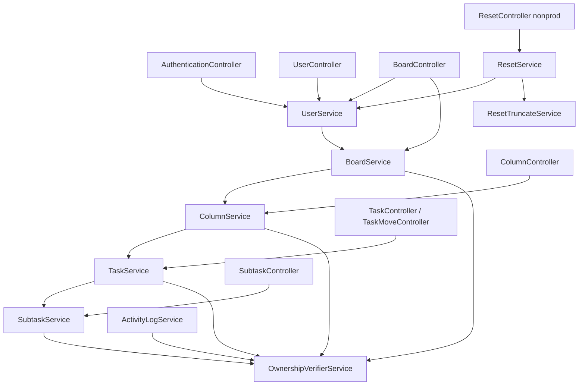
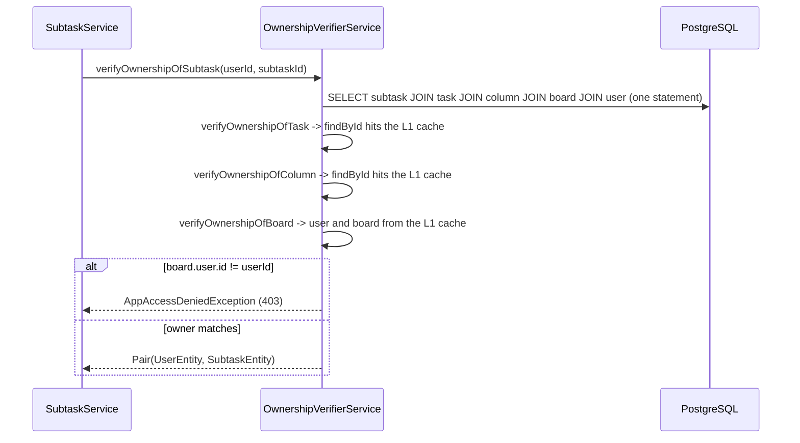
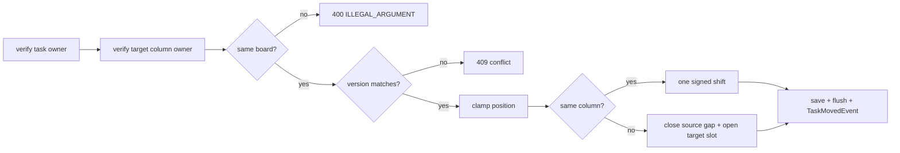
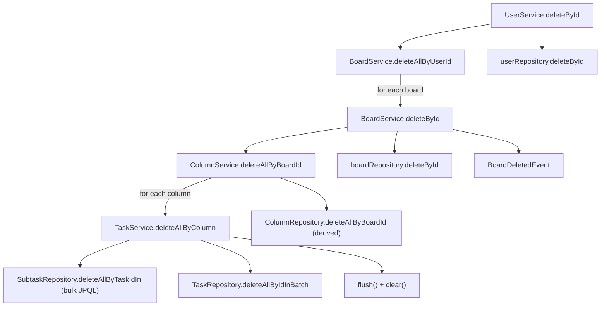

# 04 — Service layer and access control

The service layer holds every business rule of the API: ownership checks, position ordering,
uniqueness rules, delete cascades and domain-event publication. It matters because it is the only
place where access control exists; no annotation, database policy or type check does this work.

**Read first:** [02 — Persistence and queries](02-persistence-and-queries.md),
[03 — Optimistic locking](03-optimistic-locking.md)
**Related:** [05 — API layer](05-api-layer.md), [06 — Security and sessions](06-security-and-sessions.md),
[07 — Events and activity feed](07-events-and-activity-feed.md)
**Main code:**
[`service/`](../../src/main/java/com/vrudenko/kanban_board/service/),
[`OwnershipVerifierService`](../../src/main/java/com/vrudenko/kanban_board/service/OwnershipVerifierService.java),
[`base/service/BaseUserOwnedService`](../../src/main/java/com/vrudenko/kanban_board/base/service/BaseUserOwnedService.java),
[`LayeringArchTest`](../../src/test/java/com/vrudenko/kanban_board/architecture/LayeringArchTest.java),
[`docs/CODE_STYLE.md` rule 2](../CODE_STYLE.md)

## Summary of decisions

| ID | Decision | Main reason |
|----|----------|-------------|
| SVC-01 | Strict layers: controller → service → repository. Services return DTOs. | Controllers carry no logic; one place owns each rule |
| SVC-02 | Field injection with `@Autowired`, no constructor injection | Existing convention; the recorded reason (avoid circular beans) does not match the code |
| SVC-03 | One `OwnershipVerifierService` walks Subtask → Task → Column → Board → User | Answer "may this user touch this?" once, not per controller |
| SVC-04 | Each verifier returns `Pair<UserEntity, X>` | The caller gets the verified entity and does not load it again |
| SVC-05 | Domain services load only through their own `findById(userId, id)` and derive later ids from the verified entity | This rule is the whole access-control model; nothing else enforces it |
| SVC-06 | Ownership failure → 403; missing entity → 404 (ownership was 401 before phase 07.1) | 401 means "no session"; 403 means "session, but not yours" |
| SVC-07 | Simple `Integer position` with renumber-on-shift, no fractional keys | Fractional keys are disproportionate for this scale |
| SVC-08 | Renumber with one parent-scoped bulk JPQL `UPDATE`, never the moved row | Constant statement count; the managed entity never goes stale; siblings keep their `@Version` |
| SVC-09 | Clamp a too-large target position; `targetPosition` optional for a task move, mandatory for a column reorder | A drag to the end always succeeds; a reorder with no target asks for nothing |
| SVC-10 | Task move and task reorder are one endpoint, on a separate flat controller | A drag-drop client reports one fact; Spring cannot add a flat route to a nested controller |
| SVC-11 | Reject a cross-board move with 400, before the version check | A wrong-board target is a request-shape problem, independent of concurrency |
| SVC-12 | Board names unique per user: service check → 409, database constraint as backstop | Friendly checked error in the common case; the constraint is the real guarantee |
| SVC-13 | Theme: identity from the session only, last-write-wins, no `@Version` | No IDOR surface; a 409 on your own preference toggle is a worse outcome |
| SVC-14 | Delete cascades run in services, children first, batched per column; only the requested delete publishes an event | Foreign keys have no `ON DELETE CASCADE`; per-child events would bring back N+1 |
| SVC-15 | Nonprod reset: profile gate + shared secret; truncate on a separate bean; check every id before any delete | Two independent controls; `@Transactional` self-invocation does not work; no existence oracle |
| SVC-16 | Services publish domain events with `ApplicationEventPublisher`, only after all guards pass | A rejected request publishes nothing; the Kafka side runs after commit (chapter 07) |
| SVC-17 | ArchUnit enforces four layering rules in the normal test run | Move enforcement from reviewer attention to the build |
| SVC-18 | Reversed: task move first had no position (phase 2); phase 6 added `targetPosition` | Ordering was out of scope for Epic 1; the mock-up gap closure brought it in |

---

## Layering and the service dependency graph

### What it is

The application has three layers. Controllers receive HTTP requests. Services hold the rules.
Repositories are Spring Data JPA interfaces. Every service is a `@Service` bean in
[`service/`](../../src/main/java/com/vrudenko/kanban_board/service/).

| Service | Main job |
|---------|----------|
| `UserService` | Identity root: signup, theme, account delete, board create |
| `BoardService` | Board read/update/delete, nested `/full` read, column add |
| `ColumnService` | Column CRUD, column reorder, task add |
| `TaskService` | Task CRUD, task move/reorder, subtask add, batch delete per column |
| `SubtaskService` | Subtask CRUD and batch delete |
| `OwnershipVerifierService` | The ownership chain (see next section) |
| `ActivityLogService` | Paginated activity feed read (chapter 07) |
| `ResetService`, `ResetTruncateService` | Nonprod-only data reset |

### How it works

The service graph is a strict chain from the identity root down to the verifier. No service calls
upward.



The edges above come from every `@Autowired ... Service` field in `src/main/java`. The command
`rg -n '@Autowired.*Service' src/main/java` lists all of them. Controllers never touch a
repository; [`LayeringArchTest`](#archunit-layering-rules) enforces that.

Two package-private methods show how the layers split work. `TaskService.deleteAllByColumn` and
`SubtaskService.save` have no `public` modifier. Only a caller that already verified ownership can
reach them, because they are in the same package as the service that verified it.

`BaseUserOwnedService<TEntity>` in
[`base/service/`](../../src/main/java/com/vrudenko/kanban_board/base/service/BaseUserOwnedService.java)
is an empty interface. No class implements it. It came in with commit `abb3e9d` (2025-05-08) and
never received methods. A `// TODO: make a service interface` comment on
[`TaskService.findById`](../../src/main/java/com/vrudenko/kanban_board/service/TaskService.java#L97-L102)
points at the same unfinished idea.

### Why we chose it

**SVC-01.** [`docs/ARCHITECTURE.md`](../ARCHITECTURE.md) states the rule: "Controllers carry no
business logic", exceptions go to one `GlobalExceptionHandler`, and the layering is "enforced by a
build-failing ArchUnit rule rather than by convention". Services return response DTOs, not
entities, so no lazy association is touched outside a transaction
([`.planning/PROJECT.md`](../../.planning/PROJECT.md), "DTOs are flat ... to avoid
`LazyInitializationException`").

### Trade-offs and limits

- A delete of one board walks four services in one transaction. The chain is easy to read, but
  each level re-verifies ownership (see [SVC-05](#ownership-verified-loaders-and-code_stylemd-rule-2)).
- `BaseUserOwnedService` is dead code. A reader can think that a common service contract exists.
  It does not.

### Where this is recorded

- [`docs/ARCHITECTURE.md`](../ARCHITECTURE.md), first section
- [`.planning/codebase/CONCERNS.md`](../../.planning/codebase/CONCERNS.md), "Missing Service
  Interface Abstraction"

---

## Field injection with `@Autowired`

### What it is

Every service and controller receives its dependencies through `@Autowired private` fields. No
class in the project uses constructor injection.

### How it works

```java
@Service
public class BoardService {
    @Autowired private BoardRepository boardRepository;
    @Autowired private BoardMapper boardMapper;
    @Autowired private ColumnService columnService;
    @Autowired private OwnershipVerifierService ownershipVerifierService;
    @Autowired private EntityManager entityManager;
    @Autowired private ApplicationEventPublisher eventPublisher;
    ...
```

Excerpt from
[`BoardService`](../../src/main/java/com/vrudenko/kanban_board/service/BoardService.java#L33-L49).
Spring sets these fields by reflection after it calls the no-argument constructor.

### Why we chose it

**SVC-02.** [`.planning/PROJECT.md`](../../.planning/PROJECT.md) (Context section) says:
"services use `@Autowired` field injection (not constructor) to sidestep circular bean
dependencies between Board/Column/Task/Subtask/Ownership services."

**The code does not support this reason.** The dependency graph above has no cycle. `UserService`
→ `BoardService` → `ColumnService` → `TaskService` → `SubtaskService` → `OwnershipVerifierService`
is a straight line. Also, Spring Boot 2.6 and later prohibit circular references by default
(`spring.main.allow-circular-references=false`). That default applies to field injection too, and
this project does not change it (`rg -n circular src/main/resources` finds nothing). So field
injection would not hide a cycle; the application would fail at startup.

The project `CLAUDE.md` says "No actual circular dependency because all use constructor/field
injection with @Autowired (lazy initialization)". That sentence is also wrong: field injection is
not lazy. The real state is simple: the convention came from the original code, and the planning
docs kept it for consistency.

### Alternatives we rejected

Constructor injection (for example Lombok `@RequiredArgsConstructor` with `final` fields).
[`.planning/codebase/CONCERNS.md`](../../.planning/codebase/CONCERNS.md) recommends it: "Spring
will fail to start if there are circular dependencies", and dependencies become explicit. No
planning document records a decision to reject it. The project kept the existing convention.

### Trade-offs and limits

- Fields cannot be `final`. A test cannot build a service with `new` and pass fakes.
  This fits the project, because [`docs/CODE_STYLE.md`](../CODE_STYLE.md) rule 4 says "No mocks —
  test against real Spring wiring".
- A class can gain many dependencies with no visible cost. `BoardService` has eight fields.

### Where this is recorded

- [`.planning/PROJECT.md`](../../.planning/PROJECT.md), Context section
- [`.planning/codebase/CONCERNS.md`](../../.planning/codebase/CONCERNS.md), "Hard-Coded Dependency
  Injection with @Autowired"

---

## `OwnershipVerifierService` and the ownership chain

### What it is

Every board, column, task and subtask belongs to exactly one user through foreign keys. The
ownership chain is the path from a leaf entity up to that user:
Subtask → Task → Column → Board → User.
[`OwnershipVerifierService`](../../src/main/java/com/vrudenko/kanban_board/service/OwnershipVerifierService.java)
walks that path in one place.

### How it works

Each method loads its own entity, then calls the method one level up with the parent id.

```java
@Transactional
public Pair<UserEntity, TaskEntity> verifyOwnershipOfTask(String userId, String taskId)
        throws AppEntityNotFoundException, AppAccessDeniedException {
    var task = taskRepository.findById(taskId);
    if (task.isEmpty()) {
        throw new AppEntityNotFoundException("Task");
    }
    var pair = verifyOwnershipOfColumn(userId, task.get().getColumn().getId());
    return Pair.of(pair.getFirst(), task.get());
}
```

Excerpt from
[`OwnershipVerifierService.verifyOwnershipOfTask`](../../src/main/java/com/vrudenko/kanban_board/service/OwnershipVerifierService.java#L75-L87).
The top of the chain is
[`verifyOwnershipOfBoard`](../../src/main/java/com/vrudenko/kanban_board/service/OwnershipVerifierService.java#L33-L59).
It does four things in this order:

1. It throws `IllegalArgumentException` (HTTP 400) if `userId` or `boardId` is null.
2. It loads the user. A missing user gives `AppEntityNotFoundException("User")` (404).
3. It loads the board. A missing board gives `AppEntityNotFoundException("Board")` (404).
4. It compares `board.getUser().getId()` with the user id. A mismatch gives
   `AppAccessDeniedException("Board")` (403, "You do not have access to that board").



**What SQL runs.** All parent-side `@ManyToOne` associations use the JPA default, `EAGER`. The
first `findById` makes Hibernate join the whole parent chain into one SQL statement. The later
`findById` calls for the parents find the entities in the persistence context (the first-level
cache, or "L1 cache") and issue no SQL. The measured result is **1 query** for
`verifyOwnershipOfSubtask`
([`docs/plans/backend-modernization/STATUS.md`](../plans/backend-modernization/STATUS.md),
2026-07-31 entry).

The methods call each other directly (`this`), so the calls do not pass through the Spring
proxy. That is not a problem: the caller is already `@Transactional`, so all levels share one
transaction and one persistence context.

### Why we chose it

**SVC-03.** [`docs/ARCHITECTURE.md`](../ARCHITECTURE.md): "`OwnershipVerifierService` walks
subtask → task → column → board → user in one place, so 'may this user touch this resource?' is
answered once instead of being re-implemented per controller."

The chain was suspected to be an N+1 problem (one query per level). Measurement showed 1 query.
The team kept the code, added a regression test, and deleted two stale "TODO: optimize" comments
(`STATUS.md`, "Finding 1 ... turned out to be a non-issue on measurement").

### Alternatives we rejected

- **Spring Security `@PreAuthorize` with a permission evaluator** on each controller method.
  No planning document records this option.
- **One JPQL query per resource type** that checks the owner in the `WHERE` clause. Not needed:
  the measured cost is already one statement.

### Trade-offs and limits

- **The chain walks up from the leaf id only.** The nested URL segments are never compared with
  the real parents. A user who owns boards A and B can send
  `PUT /boards/{A}/columns/{column-of-B}` and the request changes the column of board B.
  This is same-user chain confusion, not cross-user access: the caller really owns the column.
  The open todo
  [`2026-08-20-idor-same-user-chain-consistency...`](../../.planning/todos/pending/2026-08-20-idor-same-user-chain-consistency-boardid-columnid-not-c.md)
  rates it `moderate` and proposes a `verifyOwnershipOfColumn(userId, boardId, columnId)` overload.
- The 1-query result depends on `EAGER` parents. A `fetch = FetchType.LAZY` change would make the
  chain issue more queries. The query-count test catches that.

### How we test it

- [`OwnershipVerifierServiceTest`](../../src/test/java/com/vrudenko/kanban_board/service/OwnershipVerifierServiceTest.java):
  one `@Nested` class per level. Each has "owns", "does not own", "does not exist" and "user does
  not exist" cases, for example `VerifyOwnershipOfTaskTest.shouldThrow_whenUserDoesntOwnTask`.
- `OwnershipVerifierServiceTest.QueryCountTest.verifyOwnershipOfSubtask_issuesOneQuery` asserts
  exactly 1 prepared statement. It uses Hibernate `Statistics.getPrepareStatementCount()`, because
  `getQueryExecutionCount()` does not count `findById()` calls.
- [`AuthorizationGatingTest.CrossUserSweep`](../../src/test/java/com/vrudenko/kanban_board/security/AuthorizationGatingTest.java)
  sends every resource route as a second, real user and expects 403 with `"code":"ACCESS_DENIED"`
  and no board name in the body.

### Where this is recorded

- [`docs/ARCHITECTURE.md`](../ARCHITECTURE.md), first section and the Testing section
- [`docs/plans/backend-modernization/STATUS.md`](../plans/backend-modernization/STATUS.md),
  2026-07-31, Finding 1
- [`260820-giz-SUMMARY.md`](../../.planning/quick/260820-giz-audit-penetration-testing-and-security-c/260820-giz-SUMMARY.md)
  (OWASP API Top 10 audit that found the chain-consistency gap)

---

## `Pair` returns

### What it is

Each verifier method returns `org.springframework.data.util.Pair<UserEntity, X>`, where `X` is the
entity at that level.

### How it works

The domain services keep only the second element:

```java
@Transactional
public ColumnEntity findById(String userId, String columnId) {
    var pair = ownershipVerifierService.verifyOwnershipOfColumn(userId, columnId);
    return pair.getSecond();
}
```

Excerpt from
[`ColumnService.findById`](../../src/main/java/com/vrudenko/kanban_board/service/ColumnService.java#L120-L125).
Inside the verifier, each level uses `pair.getFirst()` from the level above to pass the
`UserEntity` up the result without a new load.

### Why we chose it

**SVC-04.** The verifier already loads the entity to check it. Returning it means the caller does
not load it a second time, and the caller uses exactly the object that was checked. The
`Pair<UserEntity, BoardEntity>` shape is listed as a convention in the project `CLAUDE.md`
("Pairs used for multi-value returns"). The reason for a `Pair` over a small record type is not
recorded.

### Trade-offs and limits

- `getFirst()`/`getSecond()` carry no meaning in their names. A Java `record` such as
  `Verified<T>(UserEntity user, T entity)` would be clearer.
- In production code, no caller outside the verifier reads `getFirst()`. The user half of the pair
  is unused.

---

## Ownership-verified loaders and `CODE_STYLE.md` rule 2

### What it is

A rule for the four domain services (`BoardService`, `ColumnService`, `TaskService`,
`SubtaskService`). Each service loads its entities only through its own
`findById(userId, id)`, which calls the verifier. After that, every later repository call in the
same method uses the id of the verified entity, not the raw path variable.

### How it works

[`TaskService.findAllByColumnId`](../../src/main/java/com/vrudenko/kanban_board/service/TaskService.java#L82-L88)
is the reference:

```java
var pair = ownershipVerifierService.verifyOwnershipOfColumn(userId, columnId);
return taskMapper.toTaskResponseDTOList(
        taskRepository.findAllByColumnId(pair.getSecond().getId()));
```

`BoardService.findFullById` uses the same rule for the nested read. It runs the fetch-join query
against `verifiedBoard.getId()`, "never the raw `boardId` path parameter"
([`BoardService.findFullById`](../../src/main/java/com/vrudenko/kanban_board/service/BoardService.java#L102-L123)).
Event payloads also take their ids from the verified entity, for example
`task.getColumn().getBoard().getId()` in `TaskService.updateById`.

Only two classes may call `repository.findById` directly:

- `OwnershipVerifierService`, the root of the chain.
- `UserService`, the identity root. A user has no owner above it, and the user id always comes
  from the session.

### Why we chose it

**SVC-05.** [`docs/CODE_STYLE.md`](../CODE_STYLE.md) rule 2: "this is the entire access-control
model of the application, and nothing in the type system enforces it — a direct repository load
compiles cleanly, passes a naive test, and silently removes the ownership check". Using the
verified entity's id "guarantees that the id which was actually authorised is the id that gets
used."

### Trade-offs and limits

- The rule costs extra verification. For example,
  [`TaskService.deleteById`](../../src/main/java/com/vrudenko/kanban_board/service/TaskService.java#L259-L279)
  verifies the task, then calls `subtaskService.deleteAllByTaskId(userId, taskId)`, which verifies
  the same task again. The second check finds the entities in the L1 cache.
- That call passes the raw `taskId`, not `task.getId()`. It is safe because the callee verifies
  again, but it does not follow the letter of rule 2.
- [`SubtaskService.deleteAllByTaskId`](../../src/main/java/com/vrudenko/kanban_board/service/SubtaskService.java#L181-L185)
  names its parameter `subtaskId`, but the value is a task id.
- ArchUnit catches only the first half of the rule (see
  [ArchUnit layering rules](#archunit-layering-rules)).

### How we test it

- `LayeringArchTest.domain_services_must_load_through_ownership_verified_findById`.
- Each `*ServiceTest` has a `shouldThrow_whenUserDoesntOwn...` case, for example
  `TaskServiceTest.FindAllByColumnIdTest.shouldThrow_whenUserDoesntOwnTheColumn`.

### Where this is recorded

- [`docs/CODE_STYLE.md`](../CODE_STYLE.md), rule 2

---

## Why ownership failures are 403, and what 404 reveals

### What it is

The service layer throws two exception types for access problems:

| Exception | Parent class | HTTP | `code` |
|-----------|--------------|------|--------|
| `AppEntityNotFoundException("Board")` → "Board was not found" | `jakarta.persistence.EntityNotFoundException` | 404 | from `ErrorCode` |
| `AppAccessDeniedException("Board")` → "You do not have access to that board" | Spring Security `AccessDeniedException` | 403 | `ACCESS_DENIED` |

[`GlobalExceptionHandler`](../../src/main/java/com/vrudenko/kanban_board/handler/GlobalExceptionHandler.java#L82-L97)
maps both `AccessDeniedException` arms to `HttpStatus.FORBIDDEN`. The 404 arms are at
[lines 36–50](../../src/main/java/com/vrudenko/kanban_board/handler/GlobalExceptionHandler.java#L36-L50).

### How it works

A request with no session never reaches a service. `ProblemDetailAuthenticationEntryPoint` answers
it with 401 inside the filter chain (chapter 06). A request with a session reaches the verifier,
which throws. The exception goes to `GlobalExceptionHandler`, which builds an RFC 7807
`ProblemDetail` body (chapter 05).

### Why we chose it

**SVC-06.** Phase 07.1 decision D-05
([`07.1-CONTEXT.md`](../../.planning/milestones/v1.2-phases/07.1-address-hard-blockers-and-inconsistencies-from-the-frontend/07.1-CONTEXT.md),
"401 vs 403 Split") moved ownership failures from 401 to 403. `BadCredentialsException` stays 401,
because "a wrong password is authentication, not authorization" (commit `63536a0`). The result,
from [`docs/ARCHITECTURE.md`](../ARCHITECTURE.md): "401 means unauthenticated, 403 means
forbidden — no overlap."

**This is a reversed decision.** From the first exception handler (commit `d332fa2`) until
`63536a0` on 2026-08-09, `AccessDeniedException` returned `HttpStatus.UNAUTHORIZED`. A frontend
client could not tell "sign in again" from "this is not yours".

### Alternatives we rejected

Return 404 for a resource the caller does not own (the "hide existence" pattern, used by GitHub
for private repositories). **No source records this option or a reason against it.**

### Trade-offs and limits

**Caution — the API reveals whether an id exists.** For a caller with a valid session:

- an id that exists and belongs to another user gives **403**;
- an id that does not exist gives **404**.

So any signed-in user can find out whether a given board, column, task or subtask id exists
anywhere in the system. The response body does not contain the resource's data
(`CrossUserSweep` asserts this). Entity ids are time-plus-sequence values
([`RandFlakeGenerator`](../../src/main/java/com/vrudenko/kanban_board/config/RandFlakeGenerator.java),
chapter 02), not random tokens, so they are easier to guess than random UUIDs.

The project accepted a similar one-bit oracle once, on purpose. Quick task 260908-dl3 lets
`POST /boards` accept a caller-supplied id, and a taken id gives 409 even when another user owns
it. Its plan says:
"The id namespace is global, so a 409 is a cross-user existence oracle ... Accepted and recorded"
([`260908-dl3-PLAN.md`](../../.planning/quick/260908-dl3-create-board-endpoint-optionally-accepts/260908-dl3-PLAN.md)).
The nonprod reset, by contrast, was built to avoid an existence oracle (see
[SVC-15](#nonprod-reset-service)). For the general 403/404 split there is no recorded decision.

### How we test it

- `AuthorizationGatingTest.CrossUserSweep.shouldReturnForbidden_whenForeignUserAccessesOwningUsersResource`
  (403 on every route, body contains no board name).
- `TaskMoveTest.MoveToColumn.UnknownIds.shouldReturnNotFound_whenTaskIdIsUnknown` (404).
- [`GlobalExceptionHandlerTest`](../../src/test/java/com/vrudenko/kanban_board/handler/GlobalExceptionHandlerTest.java)
  (403 cross-user + no-leak group added in `63536a0`).

### Where this is recorded

- [`07.1-CONTEXT.md`](../../.planning/milestones/v1.2-phases/07.1-address-hard-blockers-and-inconsistencies-from-the-frontend/07.1-CONTEXT.md), D-05
- Commit `63536a0` ("remap 401 to 403")
- [`docs/ARCHITECTURE.md`](../ARCHITECTURE.md), error-handling sequence diagram

---

## Position ordering and reorder logic

### What it is

Tasks have a `position` inside their column. Columns have a `position` inside their board. Both are
plain `Integer` columns, added by
[`V5__add_position_subtask_version_theme_board_name_uniqueness.sql`](../../src/main/resources/db/migration/V5__add_position_subtask_version_theme_board_name_uniqueness.sql)
as `integer NOT NULL DEFAULT 0`. The intended invariant is: positions are contiguous from zero
(0, 1, 2, … n−1) inside each parent. **Subtasks have no position.** They are ordered by id.

### How it works

**Create.** The new row goes at the end. Because positions are contiguous, the current sibling
count is the next free index:

```java
// TaskService.save
task.setPosition(Ints.checkedCast(taskRepository.countByColumnId(column.getId())));
```

([`TaskService.save`](../../src/main/java/com/vrudenko/kanban_board/service/TaskService.java#L57-L80),
[`ColumnService.save`](../../src/main/java/com/vrudenko/kanban_board/service/ColumnService.java#L90-L110)).

**Shift.** Every renumber uses one bulk statement, scoped to one parent:

```java
@Modifying
@Query("update TaskEntity t set t.position = t.position + :delta "
        + "where t.column.id = :columnId "
        + "and t.position >= :fromPosition and t.position <= :toPosition")
void shiftPositions(String columnId, int delta, int fromPosition, int toPosition);
```

([`TaskRepository.shiftPositions`](../../src/main/java/com/vrudenko/kanban_board/repository/TaskRepository.java#L28-L53);
the board-scoped twin is
[`ColumnRepository.shiftPositions`](../../src/main/java/com/vrudenko/kanban_board/repository/ColumnRepository.java#L34-L43).)

**Column reorder** (`PATCH /boards/{boardId}/columns/{columnId}/reorder`,
[`ColumnService.reorder`](../../src/main/java/com/vrudenko/kanban_board/service/ColumnService.java#L193-L238)):

1. Load the column through the ownership-verified `findById`.
2. Compare the request `version` with the entity version. A mismatch gives 409 before any shift.
3. Clamp the target: `effective = min(targetPosition, count − 1)`.
4. Moving up (`effective < old`): shift `[effective, old − 1]` by +1.
5. Moving down (`effective > old`): shift `[old + 1, effective]` by −1.
6. Set the column's own position, save, and `flush()` so the response carries the new version.
7. Publish `ColumnReorderedEvent` with the old and the clamped new position.

Example: columns A0 B1 C2 D3; move D to 1. The shift adds 1 to positions 1..2 (B→2, C→3). Then D
gets 1. Result: A0 D1 B2 C3.

**Column delete** closes the gap: after the delete,
[`ColumnService.deleteById`](../../src/main/java/com/vrudenko/kanban_board/service/ColumnService.java#L270-L291)
shifts `[deletedPosition + 1, Integer.MAX_VALUE]` by −1.

**Sibling reads** use a two-key total order, `order by position asc, id asc`
([`TaskRepository.findAllByColumnId`](../../src/main/java/com/vrudenko/kanban_board/repository/TaskRepository.java#L13-L21)).
The id breaks ties, so two reads of the same data always give the same order.

### Why we chose it

- **SVC-07.** Phase 6 D-02: "a simple `Integer position` column with renumber-on-insert ... not
  fractional/gap-based keys (LexoRank-style) ... fractional keys were explicitly rejected as
  disproportionate complexity for this project's scale." D-01 built ordering "fully" although the
  mock-up draws no drag handle. D-03 covers both tasks and columns
  ([`06-CONTEXT.md`](../../.planning/milestones/v1.2-phases/06-mock-up-feature-gap-closure/06-CONTEXT.md)).
- **SVC-08.** The 06-04 plan picked "one bulk statement" over a per-row loop: "Statement count is
  constant regardless of sibling count" and "The race window is the width of one statement"
  ([`06-04-PLAN.md`](../../.planning/milestones/v1.2-phases/06-mock-up-feature-gap-closure/06-04-PLAN.md),
  approach table). Bulk JPQL bypasses the persistence context. So every range excludes the moved
  row's own position, and the moved entity, which is still managed, never goes stale. A second
  effect is deliberate: shifted siblings do not get a `@Version` increment. "A client editing a
  sibling task should not be 409'd just because someone else reordered a different task"
  ([`TaskService.moveToColumn` Javadoc](../../src/main/java/com/vrudenko/kanban_board/service/TaskService.java#L157-L176)).
- **SVC-09.** A too-large target is clamped, "so the natural drag-to-end gesture always succeeds".
  A negative target is rejected with 400 by `@Min(0)` on the DTO.
  [`ReorderColumnRequestDTO`](../../src/main/java/com/vrudenko/kanban_board/dto/column_dto/ReorderColumnRequestDTO.java)
  makes `targetPosition` `@NotNull`: "a column reorder request with no target position asks for
  nothing at all". [`MoveTaskRequestDTO`](../../src/main/java/com/vrudenko/kanban_board/dto/task_dto/MoveTaskRequestDTO.java)
  makes it nullable: null means "append at the end".

### Alternatives we rejected

| Option | Why rejected (source) |
|--------|-----------------------|
| Fractional or LexoRank keys | "disproportionate complexity for this project's scale" (06 D-02) |
| Per-row read-modify-write loop | Statement count grows with siblings; wider race window (06-04 approach table) |
| Reject a too-large target with 400 | A drag to the end must always succeed (`moveToColumn` Javadoc) |

### Trade-offs and limits

- **Concurrent inserts can create duplicate positions.** Two concurrent creates in one column can
  both read the same count. No unique constraint exists on `(column_id, position)`. The `id`
  tiebreak keeps reads deterministic, but the sequence has a duplicate.
- **Caution — a task delete leaves a hole in the sequence.** `ColumnService.deleteById` closes the
  gap, but [`TaskService.deleteById`](../../src/main/java/com/vrudenko/kanban_board/service/TaskService.java#L259-L279)
  has no `shiftPositions` call. The 06-04 plan added gap-closing to column delete only. So after
  tasks 0, 1, 2 lose task 1, the column holds 0 and 2. The next create gets position
  `count = 2`, a duplicate. The 06-04 SUMMARY says positions stay contiguous "on
  create/move/reorder/delete" for "both entities". The code does not do that for tasks. (Found by
  reading the code; no test covers a task delete followed by a read of positions.)
- **The nested `/full` read does not use `position`.** `BoardEntity.column`, `ColumnEntity.task`
  and `TaskEntity.subtasks` carry `@OrderBy("id")`. So `GET /boards/{id}/full` lists columns and
  tasks in id order, not position order. After a reorder, a client must sort by the `position`
  field that the nested DTOs carry. `BoardFullReadTest` compares the nested and flat reads
  order-agnostically, so it does not catch this.
- The `TaskRepository.findAllByColumnId` comment points at "TaskService#moveToColumn's Javadoc on
  the accepted concurrent-insert race". That Javadoc contains no such text.

### How we test it

- [`TaskMoveTest.MoveToColumn`](../../src/test/java/com/vrudenko/kanban_board/e2e/task/TaskMoveTest.java):
  `shouldMoveThirdTaskToFront_andShiftOthersDown_whenTargetPositionIsZeroInSameColumn`,
  `shouldLeaveBothColumnsContiguous_whenMovingTaskToDifferentColumnAtPositionZero`,
  `shouldAppendAtEnd_whenTargetPositionIsOmitted`,
  `shouldClampToEnd_whenTargetPositionExceedsDestinationSize`,
  `shouldReturnConflict_andLeavePositionsUnchanged_whenVersionIsStale`,
  `shouldReturnSameOrderTwice_whenReadingSameColumnRepeatedly`.
- [`ColumnControllerTest.Reorder`](../../src/test/java/com/vrudenko/kanban_board/controller/ColumnControllerTest.java):
  `shouldMoveThirdColumnToFront_andShiftOthersDown_whenTargetPositionIsZero`,
  `shouldClampToEnd_whenTargetPositionExceedsBoardColumnCount`,
  `shouldNotChangeAnyTaskPosition_whenReorderingAColumn`;
  `ColumnControllerTest.DeleteById.shouldLeaveSurvivingColumnsContiguousFromZero_whenDeletingAMiddleColumn`.
- `TaskServiceTest.MoveToColumnQueryCountTest.queryCountDoesNotScaleWithSourceColumnSize`.

### Where this is recorded

- [`06-CONTEXT.md`](../../.planning/milestones/v1.2-phases/06-mock-up-feature-gap-closure/06-CONTEXT.md), D-01..D-04
- [`06-04-PLAN.md`](../../.planning/milestones/v1.2-phases/06-mock-up-feature-gap-closure/06-04-PLAN.md) and
  [`06-04-SUMMARY.md`](../../.planning/milestones/v1.2-phases/06-mock-up-feature-gap-closure/06-04-SUMMARY.md)
- [`v1.2-REQUIREMENTS.md`](../../.planning/milestones/v1.2-REQUIREMENTS.md), GAP-03
- Commit `bd61e2a` ("task position ordering")

---

## Cross-column task move

### What it is

`PATCH /api/tasks/{taskId}/move` with body `{ targetColumnId, version, targetPosition? }`. One call
moves a task to another column, reorders it inside its own column, or both.

### How it works

[`TaskMoveController`](../../src/main/java/com/vrudenko/kanban_board/controller/TaskMoveController.java#L26-L40)
passes the session user id, the task id and the DTO to
[`TaskService.moveToColumn`](../../src/main/java/com/vrudenko/kanban_board/service/TaskService.java#L177-L251).
The service does these steps in order:

1. Verify ownership of the task (403/404).
2. Verify ownership of the **target column** too (403 if another user owns it, 404 if it does not
   exist).
3. If the target column is on another board, throw `IllegalArgumentException` → **400**
   "Cannot move a task to a column on a different board."
4. Compare versions → 409 on a stale version.
5. Compute the clamped target. The upper limit is `count − 1` for the same column (the task is
   still there) and `count` for another column (a new slot).
6. Shift siblings:
   - same column: one signed shift over the range between old and new position;
   - other column: close the gap in the source (`[old + 1, MAX]` by −1), then open a slot in the
     target (`[effective, MAX]` by +1).
7. Set column and position, save, `flush()`, publish `TaskMovedEvent`, return the DTO.



### Why we chose it

- **SVC-10.** Phase 6 D-04: "Task move and task reorder are one endpoint, not two ... matching what
  a real drag-drop client would report as one fact, not two separate calls"
  ([`06-CONTEXT.md`](../../.planning/milestones/v1.2-phases/06-mock-up-feature-gap-closure/06-CONTEXT.md)).
  The route lives on its own controller because `TaskController`'s class-level mapping is nested
  under boards and columns, and "Spring composes class- and method-level `@RequestMapping` paths
  additively, so a flat route structurally cannot be added there"
  (`TaskMoveController` Javadoc).
- **SVC-11.** MOVE-03 requires the service to reject a cross-board move
  ([`v1.1-REQUIREMENTS.md`](../../.planning/milestones/v1.1-REQUIREMENTS.md)). The `moveToColumn`
  Javadoc explains the order: "a wrong-board target is a request-shape problem independent of
  concurrency, so 400 is the more specific signal to return first." MOVE-02 requires reuse of the
  existing check-before-mutate version convention (chapter 03).
- **SVC-18 (reversed decision).** Phase 2 D-04 said the move endpoint "only reassigns the task's
  column — no position/order concept", and D-05 said a moved task "lands with no defined position"
  ([`02-CONTEXT.md`](../../.planning/milestones/v1.1-phases/02-kafka-foundation-domain-events-move-endpoint/02-CONTEXT.md)).
  The user deferred ordering to a later milestone. Phase 6 (GAP-03) then extended the same DTO
  with a nullable `targetPosition`, so old clients that never send it keep the append behavior.

### Alternatives we rejected

- Two endpoints (move and reorder). Rejected by 06 D-04.
- Put the move under `TaskController`. Not possible with the nested class-level mapping.

### Trade-offs and limits

- The 400 for a cross-board move uses the generic `ILLEGAL_ARGUMENT` code. Spike 002 calls it
  "actively misleading": the request is well-formed, but it breaks a domain rule
  ([`spike 002 README`](../../.planning/spikes/002-error-code-coverage-survey/README.md), Finding 3).
  It is still open.
- `TaskMovedEvent` carries no positions, unlike `ColumnReorderedEvent`. A same-column reorder
  publishes "moved from column X to column X"
  ([todo](../../.planning/todos/pending/2026-08-11-taskmovedevent-position-asymmetry-not-fixed-in-s5e-fork-d-e.md)).

### How we test it

[`TaskMoveTest`](../../src/test/java/com/vrudenko/kanban_board/e2e/task/TaskMoveTest.java):
`CrossBoardTarget.shouldReturnBadRequest_whenTargetColumnIsOnDifferentBoardOwnedBySameUser`,
`UnownedTarget.shouldReturnForbidden_whenTargetColumnOwnedByAnotherUser`,
`ConcurrentConflict.shouldAcceptFirstWriter_andRejectSecondWriter_whenBothStartFromSameVersion`,
`MissingVersion.shouldReturnBadRequest_whenVersionIsMissing`,
`UnknownIds.shouldReturnNotFound_whenTargetColumnIdIsUnknown`, and
`move_toColumnOnSameBoard_succeedsAndAnnouncesTaskMovedEvent`.

### Where this is recorded

- [`02-CONTEXT.md`](../../.planning/milestones/v1.1-phases/02-kafka-foundation-domain-events-move-endpoint/02-CONTEXT.md), D-04/D-05
- [`06-CONTEXT.md`](../../.planning/milestones/v1.2-phases/06-mock-up-feature-gap-closure/06-CONTEXT.md), D-04
- Commit `9109045` ("move task between columns and announce it after commit")

---

## Board-name uniqueness

### What it is

One user cannot own two boards with the same name. Two different users can. The rule applies to
create (`POST /boards`) and to rename (`PUT /boards/{boardId}`).

### How it works

Create, in
[`UserService.addBoardByUserId`](../../src/main/java/com/vrudenko/kanban_board/service/UserService.java#L99-L108):

```java
var user = findById(userId);
if (boardRepository.existsByUserIdAndName(user.getId(), boardDTO.getName())) {
    throw new AppDuplicateResourceException("Board");
}
return boardService.save(boardDTO, user);
```

Rename, in
[`BoardService.updateById`](../../src/main/java/com/vrudenko/kanban_board/service/BoardService.java#L135-L181):
the version compare runs first. Then, if the new name differs from the current name, the same
`existsByUserIdAndName` check runs. A rename to the same name skips the check, so it does not
collide with its own row.

The database has `UNIQUE (user_id, name)` as constraint `uk_boards_user_id_name` (V5). The V5
migration first counts existing duplicate groups and aborts with an error if any exist, rather
than failing on the `ALTER TABLE`.

`AppDuplicateResourceException` extends Spring's `DataIntegrityViolationException`. The handler has
two 409 arms: a specific one for the checked path (`DUPLICATE_RESOURCE`) and a broader one for a
constraint violation (`DATA_INTEGRITY_VIOLATION`). Spring picks the most specific handler first.

### Why we chose it

**SVC-12.** Phase 6 D-09 added the check to both create and rename "for consistency" and resolved
an old TODO in `UserService`
([`06-CONTEXT.md`](../../.planning/milestones/v1.2-phases/06-mock-up-feature-gap-closure/06-CONTEXT.md)).
409 was "Approach A": it matches the handler's "state-conflict-vs-malformed-request distinction
(400 reserved for IllegalArgumentException-style problems)"
([`06-02-SUMMARY.md`](../../.planning/milestones/v1.2-phases/06-mock-up-feature-gap-closure/06-02-SUMMARY.md)).
The `BoardService.save` comment gives the layering: "The database's primary key is the real
guarantee; this check exists only to produce the friendlier, checked envelope for the common
non-racing case."

### Alternatives we rejected

- 400 field-validation error. Rejected for 409 (06-02 SUMMARY).
- Database constraint only. Then every duplicate would come back as the generic
  `DATA_INTEGRITY_VIOLATION` code.

### Trade-offs and limits

- **Check-then-act window.** Two concurrent creates can both pass `existsByUserIdAndName`. The
  loser hits the constraint and gets 409 with a different `code`. This is accepted.
- **Case-sensitive.** "Work" and "work" are different names, in both the JPA check and the
  PostgreSQL constraint. The case-sensitivity choice was left to the planner (06-CONTEXT); the
  reason for the final choice is not recorded.
- The check lives in `UserService` for create but in `BoardService` for rename. The split follows
  where each method already was.

### How we test it

- [`BoardCreationE2ETest`](../../src/test/java/com/vrudenko/kanban_board/e2e/board/BoardCreationE2ETest.java):
  `DuplicateName`, `RenameBoard.shouldReturnOk_whenRenamingBoardToItsOwnCurrentName`,
  `CrossUserIsolation.shouldAllowBothCreates_whenTwoDifferentUsersUseIdenticalBoardName`,
  `ConcurrentCreate.shouldPersistExactlyOneBoard_whenTwoRequestsCreateSameNameConcurrently`.
- [`BoardServiceTest.UpdateByIdUniquenessTest`](../../src/test/java/com/vrudenko/kanban_board/service/BoardServiceTest.java).

### Where this is recorded

- [`06-CONTEXT.md`](../../.planning/milestones/v1.2-phases/06-mock-up-feature-gap-closure/06-CONTEXT.md), D-08/D-09
- [`06-02-SUMMARY.md`](../../.planning/milestones/v1.2-phases/06-mock-up-feature-gap-closure/06-02-SUMMARY.md); commits `6333735`, `fbce9bf`

---

## User theme service

### What it is

`GET` and `PUT /api/users/me/theme` read and write a `LIGHT`/`DARK` preference on the user row.

### How it works

[`UserController`](../../src/main/java/com/vrudenko/kanban_board/controller/UserController.java#L32-L49)
takes the user id from `@CurrentUserId` (the session), never from the path or body.
[`UserService.updateTheme`](../../src/main/java/com/vrudenko/kanban_board/service/UserService.java#L124-L132)
loads the user with `findById`, sets the theme and saves. There is no version compare and no
`flush()`.

### Why we chose it

**SVC-13.** Phase 6 D-10..D-12: full server-side persistence, a two-value enum, default `LIGHT`
(not null) ([`06-CONTEXT.md`](../../.planning/milestones/v1.2-phases/06-mock-up-feature-gap-closure/06-CONTEXT.md)).
The `UserController` Javadoc calls the session-only identity "the whole IDOR mitigation for this
controller": there is "no place in the route to put another user's id". The
[`UpdateThemeRequestDTO`](../../src/main/java/com/vrudenko/kanban_board/dto/user_dto/UpdateThemeRequestDTO.java)
Javadoc explains why there is no `@Version`: "rejecting a user's own preference toggle with a 409
because they changed it on another session first would be a worse outcome than simply applying
it."

### Trade-offs and limits

Two tabs that toggle the theme at the same time: the last write wins. This is by design.

### How we test it

[`ThemePersistenceTest`](../../src/test/java/com/vrudenko/kanban_board/controller/ThemePersistenceTest.java):
`shouldReturnLight_whenUserHasNoExplicitPreference`,
`shouldReturnDark_whenLoggingOutAndSigningInAgainAfterWritingDark`,
`shouldBeIndependentPerUser_whenTwoUsersSetDifferentThemes`;
`AuthorizationGatingTest.ScopedToCaller.shouldUpdateOnlyForeignUsersOwnTheme_whenForeignUserUpdatesTheme`.

---

## Delete cascades and account deletion

### What it is

The JPA mappings have no `cascade` attribute, and the foreign keys in
[`V1__init.sql`](../../src/main/resources/db/migration/V1__init.sql) have no `ON DELETE CASCADE`.
So the services delete children before parents, by hand.

### How it works



Key points:

- [`TaskService.deleteAllByColumn`](../../src/main/java/com/vrudenko/kanban_board/service/TaskService.java#L316-L328)
  collects the task ids, deletes all their subtasks in one bulk statement, deletes the tasks in one
  batch, then calls `flush()` and `clear()`. Bulk JPQL bypasses the persistence context, so the
  clear removes stale managed entities (chapter 02).
- Before the fix this path measured **33 queries for 8 tasks**. After the fix it measures **4
  queries regardless of task count** (`STATUS.md`).
- Each `deleteById` captures the ids it needs for the event into local variables before the
  delete. After the delete "there is nothing left to derive `boardId` from", and the Kafka
  consumer "runs with no `SecurityContext`" ([`TaskService.deleteById`](../../src/main/java/com/vrudenko/kanban_board/service/TaskService.java#L253-L279) Javadoc).
- `ColumnService.deleteById` has "no non-empty-column guard" (06 D-07).

**Who deletes a user.** There is no public "delete my account" endpoint. `UserService.deleteById`
has three callers:

1. `AuthenticationController.signup`, which deletes a just-created user if the automatic sign-in
   fails.
2. `ResetService.deleteUsers` (nonprod only).
3. Test cleanup (`userService.deleteAll()` in `AbstractAppTest`).

### Why we chose it

**SVC-14.** The batching reason is recorded: per-entity deletes scaled with task count (Epic 2,
`STATUS.md` Finding 2). The event rule is fork D-D, resolved D1 in quick task 260811-s5e
([`260811-s5e-FINDINGS.md`](../../.planning/quick/260811-s5e-expand-kafka-events-to-cover-all-mutatin/260811-s5e-FINDINGS.md)):
only the directly requested delete publishes. The
[`ColumnService.deleteAllByBoardId`](../../src/main/java/com/vrudenko/kanban_board/service/ColumnService.java#L47-L81)
Javadoc says per-child events "would mean loading every child purely to publish, reintroducing the
N+1 ... and could emit hundreds of events from one request into a bounded publish queue." The
reason for service-side cascades instead of `ON DELETE CASCADE` or JPA `cascade = REMOVE` is not
recorded.

### Trade-offs and limits

- **Two delete paths treat `@Version` differently, on purpose.** The task and subtask bulk
  deletes ignore `@Version` ("delete-wins"). The column delete is a Spring Data derived delete
  (fetch, then `remove()` per entity), so it honors `@Version` and can throw
  `OptimisticLockingFailureException` in the middle of a batch. Both Javadocs record this as an
  accepted asymmetry (chapter 03).
- `BoardService.deleteAllByUserId` re-verifies ownership for each board, and each board loops over
  its columns. The cost grows with the number of boards and columns, not with the number of tasks.
- **`UserService.deleteById` does not delete the user's `activity_log` rows.** The table has no
  foreign key to `users` (V3). Only `ResetService.deleteUsers` removes them.
- `UserService.deleteById` returns `Boolean` (`false` for an unknown id) instead of throwing.

### How we test it

- [`UserServiceTest.DeleteById`](../../src/test/java/com/vrudenko/kanban_board/service/UserServiceTest.java)
  (`shouldDeleteUser_whenUserExists`, `shouldReturnFalse_whenUserNotFound`).
- [`ColumnServiceTest.DeleteByIdTest.shouldCostSameQueryCount_regardlessOfTaskCountInColumn`](../../src/test/java/com/vrudenko/kanban_board/service/ColumnServiceTest.java).
- `BoardServiceTest.testDeleteById_shouldNotDelete_whenBoardDoesntBelongToUser`.

### Where this is recorded

- [`docs/plans/backend-modernization/STATUS.md`](../plans/backend-modernization/STATUS.md), Finding 2 and the FK-violation gotcha
- [`06-CONTEXT.md`](../../.planning/milestones/v1.2-phases/06-mock-up-feature-gap-closure/06-CONTEXT.md), D-05..D-07
- [`260811-s5e-FINDINGS.md`](../../.planning/quick/260811-s5e-expand-kafka-events-to-cover-all-mutatin/260811-s5e-FINDINGS.md), D-D

---

## Nonprod reset service

### What it is

`POST /api/admin/reset` exists only in the nonprod environment. It has two modes:

- `?fullReset=true`: empty Postgres and both Kafka activity topics.
- no `fullReset` (or any other value): delete only the users listed in the body, with all their
  data.

### How it works

- [`ResetController`](../../src/main/java/com/vrudenko/kanban_board/controller/ResetController.java)
  and both services carry `@Profile("nonprod")`, so the beans do not exist in production. The
  controller also compares an `X-Reset-Token` header with `MessageDigest.isEqual` (constant-time).
  A wrong or absent header gives the same 403 (chapter 06).
- [`ResetService.resetAll`](../../src/main/java/com/vrudenko/kanban_board/service/ResetService.java#L73-L92)
  runs four steps: stop every Kafka listener container, trim both topics with
  `AdminClient.deleteRecords`, truncate Postgres, and restart the listeners in a `finally` block.
- [`ResetTruncateService.truncateAll`](../../src/main/java/com/vrudenko/kanban_board/service/ResetTruncateService.java#L47-L59)
  runs one native `TRUNCATE TABLE users, boards, columns, tasks, subtasks, activity_log,
  spring_session_attributes, spring_session CASCADE`. It does not truncate the Flyway history
  table.
- [`ResetService.deleteUsers`](../../src/main/java/com/vrudenko/kanban_board/service/ResetService.java#L94-L140)
  removes duplicate ids, checks that **all** ids exist with one `findAllById` query, and throws 404
  if any id is unknown. Only then does it call `UserService.deleteById` for each id and bulk-delete
  their `activity_log` rows.

### Why we chose it

**SVC-15.**

- Phase 8 D-01 and D-02: a shared secret header, and a profile gate "so it cannot exist in
  production at all" ([`08-CONTEXT.md`](../../.planning/milestones/v1.3-phases/08-isolated-nonprod-environment-live-and-resettable/08-CONTEXT.md)).
  D-03: "genuinely empty ... no reseed".
- The truncate is on a second bean because "Spring's `@Transactional` is proxy-based ... A
  self-invoked `this.someTransactionalMethod()` call never passes through the proxy"
  (`ResetService` Javadoc).
- The listeners stop first because a record already polled could "land in `activity_log` moments
  later, silently repopulating the very table this method just emptied".
- `deleteRecords` instead of topic delete/recreate: `KafkaAdmin.deleteTopics()` "was only added in
  spring-kafka 4.0", and this Boot 3.5.16 BOM uses 3.3.x.
- The existence check comes first so that the outcome is "all deleted, or none deleted plus a
  404 — with no partial-state tell". Without it, a caller could use a mixed batch as a "does this
  user id exist" oracle.
- The targeted delete reuses "the same cascade the account-deletion path already uses — no new
  deletion mechanism" (quick task
  [260829-ii3](../../.planning/quick/260829-ii3-in-the-nonprod-reset-endpoint-add-a-requ/260829-ii3-PLAN.md)).

### Trade-offs and limits

The targeted delete does not stop the Kafka listeners. An event from the cascade can reach the
consumer after the `activity_log` cleanup and re-create one stray row. The Javadoc accepts this:
stopping all listeners "would stall the entire activity feed for every unrelated, still-live
user."

### How we test it

- [`ResetServiceE2ETest`](../../src/test/java/com/vrudenko/kanban_board/e2e/reset/ResetServiceE2ETest.java):
  `ResetAllTest.should_preserveMigrationHistory_when_resetAllCalled`,
  `ResetAllTest.should_resumeConsumption_when_resetAllCompletes`,
  `DeleteUsersTest.should_deleteNothing_when_batchContainsOneUnknownId`.
- [`ResetEndpointProfileGatingTest`](../../src/test/java/com/vrudenko/kanban_board/security/ResetEndpointProfileGatingTest.java):
  `should_registerNoResetBeans_when_nonprodProfileIsInactive`.

---

## Where services publish domain events

### What it is

Every mutating service method publishes one domain event through Spring's
`ApplicationEventPublisher`. `KafkaEventPublisher` sends it to Kafka after the transaction commits
(chapter 07).

| Service method | Event |
|----------------|-------|
| `BoardService.save` / `updateById` / `deleteById` | `BoardCreatedEvent` / `BoardUpdatedEvent` / `BoardDeletedEvent` |
| `ColumnService.save` / `updateById` / `reorder` / `deleteById` | `ColumnCreatedEvent` / `ColumnUpdatedEvent` / `ColumnReorderedEvent` / `ColumnDeletedEvent` |
| `TaskService.save` / `updateById` / `moveToColumn` / `deleteById` | `TaskCreatedEvent` / `TaskUpdatedEvent` / `TaskMovedEvent` / `TaskDeletedEvent` |
| `SubtaskService.save` / `updateById` / `deleteById` | `SubtaskCreatedEvent` / `SubtaskUpdatedEvent` / `SubtaskDeletedEvent` |

`UserService.updateTheme` publishes nothing. The cascade methods publish nothing (SVC-14).

### Why we chose it

**SVC-16.** Three rules show in the code comments:

1. Publish only after all guards pass: "a rejected update (stale version, duplicate name)
   publishes nothing" (`BoardService.updateById`).
2. Take event ids from the verified entity, never from a path variable (rule 2).
3. `save` methods carry their own `@Transactional`, although their callers already have one.
   `@TransactionalEventListener` "silently skips delivery when no transaction is active", so a
   future direct call would lose the event "with no error and no log line"
   ([`TaskService.save`](../../src/main/java/com/vrudenko/kanban_board/service/TaskService.java#L48-L80) Javadoc).

`SubtaskUpdatedEvent` reads `isCompleted` from the saved entity, not from the DTO, so a title-only
update still reports the real state (fork D-B, resolved B2, in `SubtaskService.updateById`).

### How we test it

[`ActivityEventPublicationTest`](../../src/test/java/com/vrudenko/kanban_board/event/ActivityEventPublicationTest.java),
for example `shouldPublishSubtaskUpdatedEvent_withDerivedIsCompleted_whenSubtaskUpdated`.

---

## ArchUnit layering rules

### What it is

ArchUnit is a library that reads the compiled bytecode and checks rules about classes and calls.
[`LayeringArchTest`](../../src/test/java/com/vrudenko/kanban_board/architecture/LayeringArchTest.java)
holds four rules. They run in the normal `./gradlew test`, because the ArchUnit JUnit 5 engine is
a JUnit Platform `TestEngine`.

### How it works

| # | Rule field | What fails the build |
|---|-----------|----------------------|
| 1 | [`controllers_must_not_reach_into_repositories`](../../src/test/java/com/vrudenko/kanban_board/architecture/LayeringArchTest.java#L76-L95) | A `@RestController` or a class in `..controller..` accesses `com.vrudenko.kanban_board.repository..` |
| 2 | [`domain_services_must_load_through_ownership_verified_findById`](../../src/test/java/com/vrudenko/kanban_board/architecture/LayeringArchTest.java#L97-L121) | A `*Service` in `service..` (except `OwnershipVerifierService` and `UserService`) calls a project repository's `findById` |
| 3 | [`rest_controllers_must_carry_class_level_validated`](../../src/test/java/com/vrudenko/kanban_board/architecture/LayeringArchTest.java#L123-L144) | A `@RestController` has no class-level `@Validated` |
| 4 | [`mutating_handlers_must_bind_request_dto_parameters_from_the_body`](../../src/test/java/com/vrudenko/kanban_board/architecture/LayeringArchTest.java#L210-L223) | A POST/PUT/PATCH handler has a `*RequestDTO` parameter without both `@RequestBody` and `@Valid` |

Details that matter:

- Rules 1 and 3 select by `areAnnotatedWith(RestController.class)`, so they also cover
  `AuthenticationController`, which is in the `security` package.
- The package predicate is the full `com.vrudenko.kanban_board.repository..`, not
  `..repository..`. The loose form would also match Spring's `SecurityContextRepository` and
  `org.springframework.data.repository`, and give false positives.
- All rules share one `@AnalyzeClasses` class, so ArchUnit imports the class graph once.
  `ImportOption.DoNotIncludeTests` keeps test classes out.

Rules 3 and 4 are about the API layer; chapter 05 explains them.

### Why we chose it

**SVC-17.** Quick task 260802-q6n: "CODE_STYLE.md rule 2 is the entire access-control model of the
application and nothing in the type system enforces it ... This moves enforcement from a
reviewer's attention to the build"
([`260802-q6n-PLAN.md`](../../.planning/quick/260802-q6n-add-archunit-to-enforce-documented-layer/260802-q6n-PLAN.md)).
While it planned the rules, the task found one real violation: `SubtaskService.findById(String id)`
loaded a subtask with no ownership check. The task deleted it instead of adding an exemption.
Rule 4 came later, after quick task 260811-me4 found `TaskController.addSubtaskByTaskId` with no
`@RequestBody`.

### Alternatives we rejected

From the 260802-q6n approach table:

| Option | Why rejected |
|--------|--------------|
| Checkstyle / PMD custom rule | Works on one file's syntax tree with no type resolution; it would have to match the variable name `*Repository`, "which any rename defeats" |
| ErrorProne / custom annotation processor | Fails at compile time, but needs a separate checker module; "does not justify a custom checker module" for two rules |

### Trade-offs and limits

- **"This is a floor, not a ceiling"** (class Javadoc). Rule 2 does not catch a downstream call
  built from the raw path variable. It does not catch other unverified loaders such as a
  hand-written `repository.findByX` or `findAllById`. For example, `ResetService` calls
  `userRepository.findAllById`, which the rule does not see.
- A repository outside `com.vrudenko.kanban_board.repository` would be invisible to rules 1 and 2.
- [`docs/ARCHITECTURE.md`](../ARCHITECTURE.md) (Testing section) still says ArchUnit "turns two
  review-only conventions into build failures". The class now has four rules.

### How we test it

The rules are tests. `./gradlew test` runs `LayeringArchTest` with the rest of the suite.

### Where this is recorded

- [`260802-q6n-PLAN.md`](../../.planning/quick/260802-q6n-add-archunit-to-enforce-documented-layer/260802-q6n-PLAN.md)
  and its SUMMARY
- [`LayeringArchTest`](../../src/test/java/com/vrudenko/kanban_board/architecture/LayeringArchTest.java) class Javadoc

---

## Known gaps and open items

1. **Same-user chain confusion.** Nested URL segments are not compared with the leaf's real
   parents. Open todo, severity `moderate`
   ([link](../../.planning/todos/pending/2026-08-20-idor-same-user-chain-consistency-boardid-columnid-not-c.md)).
2. **403/404 existence oracle.** Any signed-in user can learn whether an id exists. No decision is
   recorded for the general API.
3. **Task delete leaves a position hole**, and the next create can duplicate a position.
   `06-04-SUMMARY.md` claims contiguity on delete for both entities; the code does it for columns
   only.
4. **No unique constraint on `(parent_id, position)`.** Concurrent creates can duplicate a
   position.
5. **`/full` orders by id, flat reads order by position.** The nested read does not show the
   reorder result in list order.
6. **Cross-board move 400** uses the generic `ILLEGAL_ARGUMENT` code (spike 002, Finding 3).
7. **`TaskMovedEvent` has no positions** (open todo).
8. **`activity_log` rows survive `UserService.deleteById`** outside the nonprod targeted reset.
9. **`BaseUserOwnedService` is an empty, unused interface.** A `TODO: make a service interface`
   stays on `TaskService.findById`.
10. **Stated reason for field injection is not true** (no cycle exists; Boot forbids cycles by
    default). The project `CLAUDE.md` also calls field injection "lazy initialization", which is
    wrong.
11. **Small code defects:** `SubtaskService.deleteAllByTaskId(userId, subtaskId)` takes a task id;
    the `TaskRepository.findAllByColumnId` comment points at a Javadoc paragraph that does not
    exist; the `BoardFullMapper` Javadoc calls `BoardEntity.column` a `List`, but it is a `Set`.
12. **`docs/ARCHITECTURE.md` says ArchUnit has two rules**; it has four.

## Questions to check your knowledge

1. Walk through what happens, including SQL, when a user sends `PUT` for a subtask.
   <details><summary>Answer</summary>

   `SubtaskService.updateById` calls `findById(userId, subtaskId)`, which calls
   `verifyOwnershipOfSubtask`. The first `findById` loads the subtask with its EAGER parents
   (task, column, board, user) in one joined statement. The upper levels find their entities in
   the L1 cache. The board's user id is compared with the session user id: a mismatch is 403. Then
   the version compare (409 on mismatch), the field changes, `save`, `flush()` (the UPDATE with
   `version = version + 1`), and `SubtaskUpdatedEvent`.
   </details>

2. Why does the ownership chain not cause an N+1 problem?
   <details><summary>Answer</summary>

   All parent `@ManyToOne` associations are EAGER, so the first load joins the full chain in one
   statement. The later per-level `findById` calls hit the persistence context. Measured: 1 query.
   `OwnershipVerifierServiceTest.QueryCountTest` guards it.
   </details>

3. What is `CODE_STYLE.md` rule 2, and which part does ArchUnit not enforce?
   <details><summary>Answer</summary>

   Domain services load entities only through their own `findById(userId, id)`, and later calls
   use the verified entity's id. ArchUnit catches a direct `repository.findById` in a domain
   service. It does not catch a later call that uses the raw path variable, or other loaders like
   `findByX` or `findAllById`.
   </details>

4. Why are ownership failures 403 and not 401? Was it always so?
   <details><summary>Answer</summary>

   401 means "no valid session"; the security entry point returns it before a controller runs.
   403 means "valid session, not your resource". Until phase 07.1 (D-05, commit `63536a0`),
   `AccessDeniedException` returned 401, so a client could not tell "sign in again" from
   "forbidden".
   </details>

5. Does the API reveal whether a resource exists? How would you close that?
   <details><summary>Answer</summary>

   Yes. A foreign existing id gives 403; a missing id gives 404. To close it, throw
   `AppEntityNotFoundException` (404) on an ownership mismatch too. The cost is that clients and
   tests can no longer tell "forbidden" from "not found". No decision is recorded for this.
   </details>

6. Why does the field-injection rationale in `PROJECT.md` not hold?
   <details><summary>Answer</summary>

   The service graph has no cycle: User → Board → Column → Task → Subtask → Verifier. Also,
   Spring Boot 2.6+ prohibits circular references by default for all injection styles, and this
   project does not change that setting. The convention exists because the original code used it.
   </details>

7. Explain the renumbering for moving a column from position 3 to position 1.
   <details><summary>Answer</summary>

   Version compare first. Clamp the target to `count − 1`. Because the target is lower, one bulk
   `UPDATE` adds 1 to positions 1..2 in that board. Then the moved column gets position 1, is
   saved and flushed. The range never includes the moved column's own row, so the managed entity
   does not go stale.
   </details>

8. Why do shifted siblings not get a new `@Version`, and is that good?
   <details><summary>Answer</summary>

   The shift is a bulk JPQL `UPDATE` that does not load entities and does not touch `version`.
   This is on purpose: a client editing a sibling task should not get 409 because someone else
   reordered another task. The cost is that a client can hold a stale `position` without a
   version signal.
   </details>

9. Why is a cross-board move 400 and not 409, and why is it checked before the version?
   <details><summary>Answer</summary>

   A wrong-board target is a request-shape problem, independent of concurrency, so it is the more
   specific signal. Spike 002 notes the generic `ILLEGAL_ARGUMENT` code hides that this is a
   domain rule.
   </details>

10. How is board-name uniqueness enforced, and what happens in a race?
    <details><summary>Answer</summary>

    A service check (`existsByUserIdAndName`) throws `AppDuplicateResourceException` → 409
    `DUPLICATE_RESOURCE`. The database constraint `uk_boards_user_id_name` is the real guarantee.
    In a race, the loser hits the constraint and gets 409 `DATA_INTEGRITY_VIOLATION`. A rename to
    the same name skips the check.
    </details>

11. Why does the theme endpoint have no version field?
    <details><summary>Answer</summary>

    The write is last-write-wins by design: a 409 on a user's own preference toggle from another
    session is worse than applying it. The identity comes only from the session, so no user id
    appears in the route.
    </details>

12. Why do cascade deletes publish only one event?
    <details><summary>Answer</summary>

    Fork D-D, resolution D1: per-child events would require loading every child only to publish,
    which brings back the N+1 that the batch delete removed, and could put hundreds of events into
    a bounded publish queue.
    </details>

13. Why is `ResetTruncateService` a separate bean?
    <details><summary>Answer</summary>

    Spring's `@Transactional` works through a proxy. A call from `ResetService` to its own method
    would not pass through the proxy, so the `TRUNCATE` would run with no transaction. A second
    bean called through its Spring reference gets the proxy.
    </details>

14. How does the targeted nonprod delete avoid an existence oracle?
    <details><summary>Answer</summary>

    It checks that every id exists with one `findAllById` query before any delete, inside one
    transaction. The result is all deleted or nothing deleted plus 404, so a mixed batch tells the
    caller nothing about which id exists.
    </details>

15. What does a green `LayeringArchTest` prove, and what does it not prove?
    <details><summary>Answer</summary>

    It proves: no controller touches a repository; no domain service except the two roots calls a
    project repository's `findById`; every `@RestController` has `@Validated`; every mutating
    handler binds `*RequestDTO` with `@RequestBody @Valid`. It does not prove that ownership is
    fully enforced. It is "a floor, not a ceiling".
    </details>
