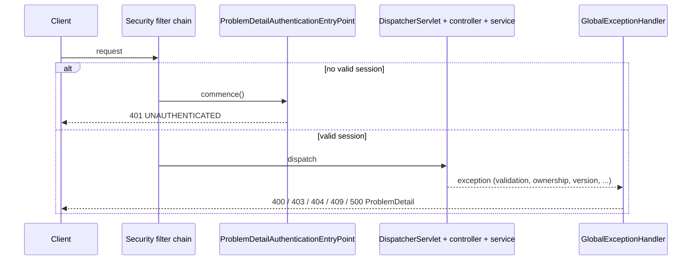
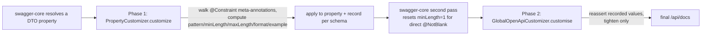

# 05 — API layer

The API layer turns HTTP requests into service calls and turns results and exceptions into JSON
responses. It is the contract that the frontend reads, so every shape, status code and error code
in this layer is a promise to a client.

**Read first:** [03 — Optimistic locking](03-optimistic-locking.md) (the `409` path),
[06 — Security and sessions](06-security-and-sessions.md) (the `401` path and the session that
`@CurrentUserId` reads).

**Main code:**
[`controller/`](../../src/main/java/com/vrudenko/kanban_board/controller/),
[`dto/`](../../src/main/java/com/vrudenko/kanban_board/dto/),
[`dto/annotation/`](../../src/main/java/com/vrudenko/kanban_board/dto/annotation/),
[`mapper/`](../../src/main/java/com/vrudenko/kanban_board/mapper/),
[`handler/GlobalExceptionHandler`](../../src/main/java/com/vrudenko/kanban_board/handler/GlobalExceptionHandler.java),
[`constant/ApiPaths`](../../src/main/java/com/vrudenko/kanban_board/constant/ApiPaths.java),
[`constant/ErrorCode`](../../src/main/java/com/vrudenko/kanban_board/constant/ErrorCode.java),
[`constant/ValidationConstants`](../../src/main/java/com/vrudenko/kanban_board/constant/ValidationConstants.java),
[`config/ProblemDetailOpenApiCustomizer`](../../src/main/java/com/vrudenko/kanban_board/config/ProblemDetailOpenApiCustomizer.java),
[`config/ComposedConstraintPropertyCustomizer`](../../src/main/java/com/vrudenko/kanban_board/config/ComposedConstraintPropertyCustomizer.java),
[`config/CorsConfig`](../../src/main/java/com/vrudenko/kanban_board/config/CorsConfig.java),
[`security/CurrentUserIdResolver`](../../src/main/java/com/vrudenko/kanban_board/security/CurrentUserIdResolver.java).

> **Note on IDs.** The `API-xx` IDs in this chapter are chapter-local decision IDs. The planning
> file [`v1.3-REQUIREMENTS.md`](../../.planning/milestones/v1.3-REQUIREMENTS.md) also has a
> requirement called `API-01` (the OpenAPI error envelope). This chapter calls that requirement
> "the v1.3 requirement API-01" to keep the two apart.

## Summary of decisions

| ID | Decision | Main reason |
|----|----------|-------------|
| API-01 | Nest resource URLs (`/boards/{id}/columns/{id}/tasks/...`), build every path from `ApiPaths` constants, serve under context path `/api` | One place for route strings; the `/api` prefix reason is not recorded |
| API-02 | Put the task move route on its own flat controller (`/tasks/{taskId}/move`) | Spring adds class-level and method-level paths together, so a flat route cannot live on a nested controller |
| API-03 | Take the user id only from the session, through `@CurrentUserId`; use `/users/me/...` for user routes | No route can name another user, so an IDOR on user data is impossible by construction |
| API-04 | Return `ResponseEntity<T>`; every creating `POST` returns `201 Created` with a `Location` header | Consistent status codes for the frontend (Phase 07.1 audit) |
| API-05 | Three DTO families (`Save*`, `Update*`, `*Response`); flat DTOs, with one nested family for `/full` | Flat DTOs prevent `LazyInitializationException`; `/full` removes four round trips |
| API-06 | Every `Update*RequestDTO` has a fixed shape: `@JsonInclude(NON_NULL)`, `@NotNull Long version`, and `atLeastOneFieldPopulated()` when it has two optional fields | Without `version`, optimistic locking silently stops |
| API-07 | MapStruct mappers with `componentModel = SPRING` and `unmappedTargetPolicy = IGNORE`; `uses` composition for the nested read | Generated mapping code, one fetch-join query for `/full` |
| API-08 | Composed constraint annotations (`@BoardName`, `@TaskTitle`, ...) with `@ReportAsSingleViolation`, bounds in `ValidationConstants` | One rule per field concept, one violation per bad input |
| API-09 | `@OptionalNotBlank` composes `@Pattern`, not `@NotBlank` | `@NotBlank` rejects `null`, which would make an optional field mandatory |
| API-10 | Every `@RestController` carries class-level `@Validated`, enforced by ArchUnit | The annotation decides which exception Spring throws, and so which error envelope the client gets |
| API-11 | Errors that reach `DispatcherServlet` use Spring's RFC 7807 `ProblemDetail` from a plain `@ControllerAdvice`; unmapped Spring MVC exceptions (unknown route, wrong method) fall to the `500 INTERNAL_ERROR` catch-all | Standard media type, no new dependency, small reviewable diff |
| API-12 | A closed `ErrorCode` enum in the `code` property; generic `ENTITY_NOT_FOUND` for all 404s | The frontend branches on `code`; per-resource codes need message parsing |
| API-13 | `401` only for "no session" (filter chain) and bad credentials; `403` for ownership failures | Before Phase 07.1, `401` meant two different things |
| API-14 | Two `409` arms for duplicates: a checked service guard and a database-constraint backstop. The backstop gives `409` on create; on rename, a race loser can get `500` | The service check has a race window; the unique constraint keeps the data correct |
| API-15 | Map `HttpMessageNotReadableException` to `400 MALFORMED_REQUEST_BODY` | An unknown enum value in a body gave `500` before |
| API-16 | Document the error envelope with one global `ProblemDetailOpenApiCustomizer` bean | springdoc cannot see `@ControllerAdvice`; per-endpoint annotations must be remembered on every new method |
| API-17 | Publish composed constraints with `ComposedConstraintPropertyCustomizer` (a `PropertyCustomizer` and a `GlobalOpenApiCustomizer`) | swagger-core never opens composed annotations; the production document had zero `pattern` keys |
| API-18 | Credentialed CORS with an explicit, externalized origin list | Cookie sessions need `allowCredentials(true)`, which forbids a wildcard origin |
| API-19 | `PUT` for field updates and for the theme; `PATCH` for the move and reorder actions | Theme `PUT` is a whole-value replacement; the reason for `PUT` on partial updates is not recorded |
| API-20 | One move endpoint carries both the target column and a nullable `targetPosition`; reorder makes `targetPosition` mandatory | A drag-and-drop gives one fact, not two calls |
| API-21 | Return raw Spring Data `Page<T>` for the activity feed, page size max 100 | First paginated endpoint; `PagedModel` would change every consumer |
| API-22 | `POST /boards` accepts an optional client-supplied `id`, validated by `@BoardId` | Offline-first client creation without an open primary key |
| API-23 | Exclude the pre-jakarta `swagger-annotations` jar from `kafka-avro-serializer` | Two jars shared one package and `GET /api/docs` returned `500` |

## Resource design and URL nesting

### What it is

The API models the domain hierarchy as nested URLs. A user owns boards, and a board owns columns.
A column owns tasks, and a task owns subtasks. All route fragments are string constants in
[`ApiPaths`](../../src/main/java/com/vrudenko/kanban_board/constant/ApiPaths.java). The servlet
container adds the context path `/api` in front of every route
([`application.properties`](../../src/main/resources/application.properties),
`server.servlet.context-path=/api`).

| Resource | Routes (after `/api`) | Controller |
|----------|------------------------|------------|
| Board | `GET, POST /boards`; `PUT, DELETE /boards/{boardId}`; `GET /boards/{boardId}/full` | [`BoardController`](../../src/main/java/com/vrudenko/kanban_board/controller/BoardController.java) |
| Column | `POST /boards/{boardId}/columns` (on `BoardController`); `GET /boards/{boardId}/columns`; `PUT, DELETE /boards/{boardId}/columns/{columnId}`; `PATCH .../{columnId}/reorder` | [`ColumnController`](../../src/main/java/com/vrudenko/kanban_board/controller/ColumnController.java) |
| Task | `POST /boards/{boardId}/columns/{columnId}` (on `ColumnController`); `GET .../tasks`; `PUT, DELETE .../tasks/{taskId}` | [`TaskController`](../../src/main/java/com/vrudenko/kanban_board/controller/TaskController.java) |
| Task move | `PATCH /tasks/{taskId}/move` | [`TaskMoveController`](../../src/main/java/com/vrudenko/kanban_board/controller/TaskMoveController.java) |
| Subtask | `POST .../tasks/{taskId}/subtasks` (on `TaskController`); `GET .../subtasks`; `PUT, DELETE .../subtasks/{subtaskId}` | [`SubtaskController`](../../src/main/java/com/vrudenko/kanban_board/controller/SubtaskController.java) |
| Activity | `GET /boards/{boardId}/activity` | [`ActivityController`](../../src/main/java/com/vrudenko/kanban_board/controller/ActivityController.java) |
| Theme | `GET, PUT /users/me/theme` | [`UserController`](../../src/main/java/com/vrudenko/kanban_board/controller/UserController.java) |
| Auth | `POST /signin`, `POST /signup` | [`AuthenticationController`](../../src/main/java/com/vrudenko/kanban_board/security/AuthenticationController.java) |

### How it works

Each controller composes its class-level `@RequestMapping` from `ApiPaths` constants. Spring
concatenates the class-level path and the method-level path. For example,
[`TaskController`](../../src/main/java/com/vrudenko/kanban_board/controller/TaskController.java#L24-L33)
maps the class to five fragments:

```java
@RestController
@RequestMapping(
        ApiPaths.BOARDS
                + ApiPaths.BOARD_ID
                + ApiPaths.COLUMNS
                + ApiPaths.COLUMN_ID
                + ApiPaths.TASKS)
@Validated
@PreAuthorize("isAuthenticated()")
class TaskController {
```

The route constants are context-path-relative. The `ApiPaths` Javadoc warns about this, and
`SecurityConfiguration` also uses the relative form, because the container removes `/api` before
Spring Security evaluates request matchers.

Look closely at what a child controller binds. `TaskController.updateById` binds only `taskId`.
It never binds `boardId` or `columnId`, although both appear in the URL. The service checks
ownership from the leaf id upward (task → column → board → user). The parent ids in the URL are
therefore not checked. Chapter 06 covers the ownership chain.

### Why we chose it

**API-01.** Nested URLs show the containment of the domain in the address. The reason is not
recorded in a planning document; the nesting predates the planning system (`ApiPaths` was added in
commit `ed47ed2`, 2024-12-27). The context path `/api` also predates the planning system. **Reason
not recorded** for the `/api` prefix. The code shows one practical effect: Caddy and the frontend
can separate API traffic from other paths by one prefix.

**API-02.** The flat move route has its own controller. The
[`TaskMoveController` Javadoc](../../src/main/java/com/vrudenko/kanban_board/controller/TaskMoveController.java#L21-L25)
records the reason. Spring composes class-level and method-level `@RequestMapping` paths additively.
Thus a route that is not nested cannot live on the nested `TaskController`. A task move also changes
the column of the task, so a URL that names the old column would be misleading after the move.
The column reorder route did not need a flat controller, because `ColumnController` is already
board-nested ([`ColumnController.reorder`](../../src/main/java/com/vrudenko/kanban_board/controller/ColumnController.java#L71-L79)).

### Alternatives we rejected

- **A flat URL scheme for everything** (`/columns/{id}`, `/tasks/{id}`). Not discussed in the
  sources. The move route is the one flat route, and it exists only because of the constraint in
  API-02.

### Trade-offs and limits

- The parent ids in a nested URL are decorative. A user who owns boards A and B can send
  `PUT /boards/{A}/columns/{column-of-B}` and the request succeeds against the column of B. This is
  "same-user chain confusion", not a cross-user leak: ownership is still enforced. The first code
  review found it in Phase 1
  ([`01-REVIEW.md` IN-01](../../.planning/milestones/v1.0-phases/01-optimistic-locking/01-REVIEW.md)),
  and an OWASP API Top 10 audit confirmed it
  ([`2026-08-13-audit-penetration-testing...`](../../.planning/todos/completed/2026-08-13-audit-penetration-testing-and-security-coverage-identify-gap.md)).
  It is still open:
  [`2026-08-20-idor-same-user-chain-consistency...`](../../.planning/todos/pending/2026-08-20-idor-same-user-chain-consistency-boardid-columnid-not-c.md).
- Task creation is `POST /boards/{boardId}/columns/{columnId}`, not `POST .../columns/{columnId}/tasks`.
  Subtask creation is `POST .../tasks/{taskId}/subtasks`. The two create routes are not symmetric.
  **Reason not recorded.**
- Tests that use MockMvc do not apply the context path. The
  [`OpenApiDocsTest` Javadoc](../../src/test/java/com/vrudenko/kanban_board/config/OpenApiDocsTest.java)
  records this limit: MockMvc tests request `/boards`, while a real client requests `/api/boards`.

### How we test it

- [`AuthorizationGatingTest.Completeness`](../../src/test/java/com/vrudenko/kanban_board/security/AuthorizationGatingTest.java)
  (`shouldCoverEveryDiscoveredRoute_withNoUnmatchedMapping`) reads every handler method from
  `RequestMappingHandlerMapping` and fails if a route has no row in the gating table. A new route
  cannot ship without an auth-gating test.
- [`AuthorizationGatingTest.CrossUserSweep`](../../src/test/java/com/vrudenko/kanban_board/security/AuthorizationGatingTest.java)
  proves `403` for a foreign user on every protected route. It varies the user only, so it does not
  cover the same-user path mismatch above.

### Where this is recorded

- [`TaskMoveController` Javadoc](../../src/main/java/com/vrudenko/kanban_board/controller/TaskMoveController.java)
- [`06-RESEARCH.md`](../../.planning/milestones/v1.2-phases/06-mock-up-feature-gap-closure/06-RESEARCH.md)
  (reorder route shape)

## Controllers, `ResponseEntity` and status codes

### What it is

A controller in this codebase has no business logic. It has four class-level annotations
(`@RestController`, `@RequestMapping`, `@Validated`, `@PreAuthorize("isAuthenticated()")`). Each
method takes the user id, path ids and a `@Valid @RequestBody` DTO, calls one service method, and
returns `ResponseEntity<T>`.

### How it works

[`BoardController.save`](../../src/main/java/com/vrudenko/kanban_board/controller/BoardController.java#L49-L56)
shows the creation shape:

```java
@PostMapping
public ResponseEntity<BoardResponseDTO> save(
        @CurrentUserId String userId,
        @Valid @RequestBody SaveBoardRequestDTO dto,
        HttpServletRequest request) {
    return ResponseEntity.created(URI.create(request.getRequestURI()))
            .body(userService.addBoardByUserId(userId, dto));
}
```

The status codes that the controllers return:

| Operation | Status | Body |
|-----------|--------|------|
| Read (`GET`) | `200` | DTO or list of DTOs |
| Create (`POST`) | `201` with `Location` | Created DTO |
| Update (`PUT`, `PATCH`) | `200` | Updated DTO, with the new `version` |
| Delete (`DELETE`) | `200` | Empty |
| Sign in (`POST /signin`) | `200` | Caller identity |
| Nonprod reset (`POST /admin/reset`) | `204` | Empty ([`ResetController`](../../src/main/java/com/vrudenko/kanban_board/controller/ResetController.java#L94)) |

### Why we chose it

**API-04.** Phase 07.1 started from a frontend-integration-readiness audit. One finding was
"inconsistent create-status-codes": two creation routes (add column, add subtask) returned `200`.
Plan 07.1-06 changed them to `201` so that all five creating `POST` routes (board, column, task,
subtask, signup) agree
([`07.1-06-SUMMARY.md`](../../.planning/milestones/v1.2-phases/07.1-address-hard-blockers-and-inconsistencies-from-the-frontend/07.1-06-SUMMARY.md)).
`POST /signin` stays `200`, because a login does not create a resource.

The same summary records the convention: the `Location` header is the URI that the `POST` went to,
built from `request.getRequestURI()`. Signup is the exception. Quick task
[`260812-hs4`](../../.planning/quick/260812-hs4-return-caller-identity-from-signin-and-s/)
changed its `Location` to `/api/users/me`, which names the created identity
([`AuthenticationController.signup`](../../src/main/java/com/vrudenko/kanban_board/security/AuthenticationController.java#L121-L156)).

### Alternatives we rejected

- **A per-resource `Location` URI** (for example `/api/boards/{newId}`). Not implemented. The four
  request-URI sites now differ from signup, and a todo tracks this:
  [`2026-08-12-four-remaining-created-location-sites...`](../../.planning/todos/pending/2026-08-12-four-remaining-created-location-sites-now-diverge-from-signup.md).

### Trade-offs and limits

- RFC 9110 defines `Location` on a `201` as the URI of the created resource. The four
  request-URI sites send the collection URI instead. For task creation this is the column URI.
- The signup `Location` (`/api/users/me`) has no `GET` handler yet
  ([`2026-08-12-signup-location-header...`](../../.planning/todos/pending/2026-08-12-signup-location-header-points-at-a-uri-with-no-get-handler.md)).
- `DELETE` returns `200` with an empty body, while the nonprod reset route returns `204`.
  **Reason not recorded.**

### How we test it

- [`BoardControllerTest.Save`](../../src/test/java/com/vrudenko/kanban_board/controller/BoardControllerTest.java)
  (`testWithAuthenticatedUser_shouldReturnStableCreatedAt_whenBoardIsCreated`) asserts
  `status().isCreated()`.
- [`BoardControllerTest.AddColumnByBoardId`](../../src/test/java/com/vrudenko/kanban_board/controller/BoardControllerTest.java)
  and [`TaskControllerTest.AddSubtaskByTaskId`](../../src/test/java/com/vrudenko/kanban_board/controller/TaskControllerTest.java)
  assert `201` and the `Location` header (added in plan 07.1-06).

### Where this is recorded

- [`07.1-06-SUMMARY.md`](../../.planning/milestones/v1.2-phases/07.1-address-hard-blockers-and-inconsistencies-from-the-frontend/07.1-06-SUMMARY.md)
- [`docs/ARCHITECTURE.md` § Layering and access control](../ARCHITECTURE.md#layering-and-access-control)

## `@CurrentUserId` — the user id comes from the session

### What it is

`@CurrentUserId` is a custom parameter annotation. A `HandlerMethodArgumentResolver` fills the
parameter with the id of the signed-in user. No controller takes a user id from a path variable or
a request body.

### How it works

[`CustomArgumentResolverConfig`](../../src/main/java/com/vrudenko/kanban_board/config/CustomArgumentResolverConfig.java)
registers the resolver with Spring MVC.
[`CurrentUserIdResolver.resolveArgument`](../../src/main/java/com/vrudenko/kanban_board/security/CurrentUserIdResolver.java#L22-L43)
reads the `SecurityContext`:

```java
var authentication = SecurityContextHolder.getContext().getAuthentication();
var principal = authentication.getPrincipal();

if (principal instanceof UserDetails user) {
    var userId = user.getUsername();
    if (userId == null || userId.isBlank()) {
        throw new AppEntityNotFoundException("User id");
    }
    return userId;
} else {
    throw new AppEntityNotFoundException("User principal");
}
```

The "username" of the principal is the user id, not the email. The filter chain
(`anyRequest().authenticated()` in `SecurityConfiguration`) rejects a request with no session before
the resolver runs. Thus the resolver does not see an anonymous request on a protected route.

### Why we chose it

**API-03.** The session is the only source of identity. Plan 06-06 made the strongest statement of
this when it added the theme routes. It chose `/users/me/theme` over `/users/{userId}/theme`.
The plan says that "a `me` segment resolved from the session means the route *cannot* express
'another user's theme'". It adds: "the IDOR is closed by construction rather than by a check"
([`06-06-PLAN.md`](../../.planning/milestones/v1.2-phases/06-mock-up-feature-gap-closure/06-06-PLAN.md)).
An IDOR (insecure direct object reference) is an attack where a client changes an id in a request
to reach data it does not own.
[`UserController`](../../src/main/java/com/vrudenko/kanban_board/controller/UserController.java#L19-L31)
repeats this in its Javadoc: `UserService` is the identity root, so no ownership chain exists
above it to check against.

### Alternatives we rejected

From [`06-06-PLAN.md`](../../.planning/milestones/v1.2-phases/06-mock-up-feature-gap-closure/06-06-PLAN.md):

- **Put the theme routes on `AuthenticationController`.** Rejected: that controller is the one
  deliberately unauthenticated controller. An authenticated route there would weaken that boundary.
- **No dedicated route; return and accept the theme on other endpoints.** Rejected: no user-update
  endpoint existed to attach it to.
- **A user id path variable.** Rejected. It would be the first route with a user id in the path.
  It would also need an ownership check with nothing above it.

### Trade-offs and limits

- The resolver is a `@Component`, and `CustomArgumentResolverConfig` also creates a second instance
  with `new CurrentUserIdResolver()`. Spring MVC uses the `new` instance. The `@Component` bean is
  unused. This is harmless because the class has no state.
- `@CurrentUserId` declares `boolean required() default true`, but no code reads it.
- A principal that is not `UserDetails` gives `404 ENTITY_NOT_FOUND`, not `401`. This path is not
  reachable through the normal filter chain.

### How we test it

- [`AuthorizationGatingTest.ScopedToCaller`](../../src/test/java/com/vrudenko/kanban_board/security/AuthorizationGatingTest.java)
  proves that a foreign user who lists boards or reads the theme gets only their own data
  (`shouldReturnForeignUsersOwnTheme_whenForeignUserReadsTheme`,
  `shouldReturnOnlyForeignUsersOwnBoards_whenForeignUserListsBoards`).
- [`ThemePersistenceTest`](../../src/test/java/com/vrudenko/kanban_board/controller/ThemePersistenceTest.java)
  (`shouldBeIndependentPerUser_whenTwoUsersSetDifferentThemes`).

### Where this is recorded

- [`06-06-PLAN.md`](../../.planning/milestones/v1.2-phases/06-mock-up-feature-gap-closure/06-06-PLAN.md)
  (route shape, verb, controller placement)
- Commit `79e2696` (2025-05-06) added the resolver.

## DTO families

### What it is

A DTO (data transfer object) is a class that carries data across the HTTP boundary. Each resource
has up to three DTO families in `dto/{domain}_dto/`:

| Family | Purpose | Example |
|--------|---------|---------|
| `Save*RequestDTO` | Body of a create request | [`SaveBoardRequestDTO`](../../src/main/java/com/vrudenko/kanban_board/dto/board_dto/SaveBoardRequestDTO.java) |
| `Update*RequestDTO` | Body of an update request; partial | [`UpdateTaskRequestDTO`](../../src/main/java/com/vrudenko/kanban_board/dto/task_dto/UpdateTaskRequestDTO.java) |
| `*ResponseDTO` | Response body | [`TaskResponseDTO`](../../src/main/java/com/vrudenko/kanban_board/dto/task_dto/TaskResponseDTO.java) |

Action DTOs have their own names:
[`MoveTaskRequestDTO`](../../src/main/java/com/vrudenko/kanban_board/dto/task_dto/MoveTaskRequestDTO.java),
[`ReorderColumnRequestDTO`](../../src/main/java/com/vrudenko/kanban_board/dto/column_dto/ReorderColumnRequestDTO.java),
[`UpdateThemeRequestDTO`](../../src/main/java/com/vrudenko/kanban_board/dto/user_dto/UpdateThemeRequestDTO.java).
The nested read has its own family: `BoardFullResponseDTO` → `ColumnFullResponseDTO` →
`TaskFullResponseDTO` → `SubtaskResponseDTO`.

DTOs and entities implement small shared interfaces (`BaseBoard`, `BaseTask`, `BaseId`, ...) in
`base/entity/`. [`docs/ARCHITECTURE.md`](../ARCHITECTURE.md#layering-and-access-control) says
these interfaces keep the four resource hierarchies from drifting apart.

### How it works

The rule for `Update*RequestDTO` is
[`docs/CODE_STYLE.md` rule 6](../CODE_STYLE.md#6-updaterequestdto-carries-a-fixed-shape). The
reference is [`UpdateTaskRequestDTO`](../../src/main/java/com/vrudenko/kanban_board/dto/task_dto/UpdateTaskRequestDTO.java):

```java
@JsonInclude(JsonInclude.Include.NON_NULL)
public class UpdateTaskRequestDTO implements BaseTask {
    @TaskTitle @OptionalNotBlank String title;
    @Description String description;
    @NotNull private Long version;

    @AssertTrue(message = "Either 'title' or 'description' (or both) must be provided.")
    private boolean atLeastOneFieldPopulated() {
        var isTitlePresent = Optional.ofNullable(getTitle()).isPresent();
        var isDescriptionPresent = Optional.ofNullable(getDescription()).isPresent();
        return isTitlePresent || isDescriptionPresent;
    }
}
```

1. `@JsonInclude(NON_NULL)` marks the class as a partial-update DTO. A `null` field means "do not
   change".
2. `@NotNull Long version` makes the client send the version it last read. The service compares it
   and throws `OptimisticLockingFailureException` on a mismatch (chapter 03).
3. `@AssertTrue` on `atLeastOneFieldPopulated()` rejects a body that changes nothing. Bean
   Validation evaluates the method as a boolean property, so a failure appears as a field error.

Response DTOs carry `version`, `position` and `createdAt` where they exist, so a client can send
the next update without a second read.

### Why we chose it

**API-05.** Flat DTOs are a recorded project convention. [`PROJECT.md`](../../.planning/PROJECT.md)
says: "DTOs are flat (no nested entity graphs) specifically to avoid `LazyInitializationException`".
A `LazyInitializationException` occurs when code touches an unloaded JPA association after its
transaction has ended. The `/full` family is the one deliberate exception. Plan 06-05 justified it
in a dedicated block
([`06-05-PLAN.md`, `flat_dto_exception_justification`](../../.planning/milestones/v1.2-phases/06-mock-up-feature-gap-closure/06-05-PLAN.md)):

- one chained `LEFT JOIN FETCH` query loads the whole graph before any mapper runs;
- the mapping runs inside the `@Transactional` service method;
- the exception applies to one endpoint and one DTO family only.

The alternative was four sequential HTTP round trips to render one board
([`MOCKUP_FEATURE_GAP.md` §1.4](../MOCKUP_FEATURE_GAP.md#1-features-in-the-mock-ups-but-missing-or-incomplete-in-the-backend)).

**API-06.** `CODE_STYLE.md` rule 6 gives the reason. It says that "omitting `@NotNull Long version`
silently disables optimistic locking for that entity". The rule adds: "the request still passes
validation and the write still succeeds". One method name (`atLeastOneFieldPopulated`) on every
DTO makes the check easy to find.

Two DTOs break rule 6 on purpose, and each records why in its Javadoc:

- [`UpdateThemeRequestDTO`](../../src/main/java/com/vrudenko/kanban_board/dto/user_dto/UpdateThemeRequestDTO.java)
  has no `NON_NULL` and no `version`. The theme `PUT` replaces one scalar, and `UserEntity` has no
  `@Version`. Plan 06-06 accepted last-write-wins: a `409` on a user's own theme toggle "would be a
  worse outcome than simply applying it".
- [`UpdateColumnRequestDTO`](../../src/main/java/com/vrudenko/kanban_board/dto/column_dto/UpdateColumnRequestDTO.java)
  makes `name` mandatory (`@NotBlank`). `name` is its only mutable field, so a version-only update
  has no use case (quick task
  [`260811-ufu`](../../.planning/quick/260811-ufu-resolve-whitespace-only-validation-gap-t/)).
  `UpdateBoardRequestDTO` keeps `name` optional, so validation accepts a version-only board
  update. The service does not accept it. `BoardService.updateById` sets `name` from the DTO with
  no null check, and the flush fails on the `NOT NULL` column. A `PUT /api/boards/{id}` with the
  body `{"version":0}` returns `500 INTERNAL_ERROR`, and `detail` holds the SQL text. Confirmed by
  running on 2026-09-23.

**API-20.** Plan 06 decision D-04 merged task move and task reorder into one request
([`06-CONTEXT.md`](../../.planning/milestones/v1.2-phases/06-mock-up-feature-gap-closure/06-CONTEXT.md)).
`MoveTaskRequestDTO` has `targetColumnId`, `version` and a nullable `targetPosition`.
The decision says that "a single request covers 'move to column X at position N'". The request
matches "what a real drag-drop client would report as one fact". A `null` position appends to
the end, which keeps the old behavior for old clients. `ReorderColumnRequestDTO` makes
`targetPosition` mandatory, because a reorder with no position asks for nothing (its Javadoc).

**API-22.** `SaveBoardRequestDTO` has an optional `id`, validated by
[`@BoardId`](../../src/main/java/com/vrudenko/kanban_board/dto/annotation/BoardId.java). Quick task
[`260908-dl3`](../../.planning/quick/260908-dl3-create-board-endpoint-optionally-accepts/260908-dl3-PLAN.md)
states the purpose. The client must be able to "create a board under an id it already holds
(offline-first / optimistic client-side creation)". The task must do this "without opening the
primary key to arbitrary untrusted strings".
The pattern accepts only what `RandFlakeGenerator` can emit: lowercase base36, at most 13
characters.

### Alternatives we rejected

- **A nested `columns` list on `SaveBoardRequestDTO`.** Rejected by Phase 06 decision D-08. The
  client creates the board, then calls `POST /boards/{boardId}/columns` once per column, which reuses
  the existing endpoint.
- **Two endpoints for task move and task reorder.** Rejected by D-04 (see above).
- **For `/full`: a hand-written aggregation, or lazy loading inside the transaction.** Rejected in
  `06-05-PLAN.md`. Lazy loading costs 1 + 1 + N + M statements for one board.

### Trade-offs and limits

- A partial-update DTO cannot express "set this field to `null`". `null` always means "no change".
- The `/full` DTOs duplicate the flat DTO fields. `BoardFullReadTest.FlatEquivalence` checks that
  the two views agree field by field.
- `SaveTaskRequestDTO.title` uses a direct `@Size`, not `@TaskTitle`, while `UpdateTaskRequestDTO`
  uses `@TaskTitle`. The bounds are the same constants, so the behavior is the same. **Reason not
  recorded.**

### How we test it

- [`BoardControllerTest.UpdateById`](../../src/test/java/com/vrudenko/kanban_board/controller/BoardControllerTest.java)
  (`testWithAuthenticatedUser_shouldReturnBadRequest_whenVersionIsMissing`) and the same test in
  [`TaskControllerTest.UpdateById`](../../src/test/java/com/vrudenko/kanban_board/controller/TaskControllerTest.java).
- [`BoardFullReadTest`](../../src/test/java/com/vrudenko/kanban_board/controller/BoardFullReadTest.java)
  (`shouldReturnNestedDocumentFourLevelsDeep_whenBoardHasColumnsTasksAndSubtasks`,
  `shouldMatchFlatEndpointsFieldByField_forSameBoard`).
- [`ColumnControllerTest.Reorder`](../../src/test/java/com/vrudenko/kanban_board/controller/ColumnControllerTest.java)
  (`shouldClampToEnd_whenTargetPositionExceedsBoardColumnCount`,
  `shouldReturnBadRequest_whenTargetPositionIsNegative`).
- [`BoardIdTest`](../../src/test/java/com/vrudenko/kanban_board/dto/BoardIdTest.java) pins
  `MAX_BOARD_ID_LENGTH` to the real generator ceiling.

### Where this is recorded

- [`docs/CODE_STYLE.md` rules 6 and 12](../CODE_STYLE.md)
- [`06-CONTEXT.md`](../../.planning/milestones/v1.2-phases/06-mock-up-feature-gap-closure/06-CONTEXT.md)
  (D-04, D-08, D-10..D-12)
- [`07.1-CONTEXT.md`](../../.planning/milestones/v1.2-phases/07.1-address-hard-blockers-and-inconsistencies-from-the-frontend/07.1-CONTEXT.md)
  (D-13, D-15: board `version` on the update DTO and on `BoardFullResponseDTO`)

## MapStruct mappers

### What it is

MapStruct is an annotation processor. It generates the code that copies fields between an entity
and a DTO at compile time. Each mapper is an interface (or abstract class) in
[`mapper/`](../../src/main/java/com/vrudenko/kanban_board/mapper/).

### How it works

Every mapper uses the same configuration:

```java
@Mapper(
        componentModel = MappingConstants.ComponentModel.SPRING,
        unmappedTargetPolicy = ReportingPolicy.IGNORE)
```

- `componentModel = SPRING` makes the generated class a Spring bean, so services inject it.
- `unmappedTargetPolicy = IGNORE` tells MapStruct to leave a target field empty, with no warning,
  when no source field matches it.

The nested read uses MapStruct `uses` composition.
[`BoardFullMapper`](../../src/main/java/com/vrudenko/kanban_board/mapper/BoardFullMapper.java) uses
`ColumnFullMapper`, which uses `TaskFullMapper`, which uses the existing `SubtaskMapper`. Two
levels need an explicit `@Mapping`, because the entity fields have singular names on list fields:

```java
@Mapping(source = "column", target = "columns")
BoardFullResponseDTO toBoardFullResponseDTO(BoardEntity entity);
```

[`UserMapper`](../../src/main/java/com/vrudenko/kanban_board/mapper/UserMapper.java) is an abstract
class, so it can inject `PasswordEncoder` and hash the password inside the mapping expression.

### Why we chose it

**API-07.** MapStruct predates the planning system. The `uses` composition for `/full` was chosen
in [`06-05-PLAN.md`](../../.planning/milestones/v1.2-phases/06-mock-up-feature-gap-closure/06-05-PLAN.md):
it gives one prepared statement, and it reuses the loop-and-delegate code that MapStruct already
generates. The plan also notes that `uses` was new to this repository, so it was taken from the
MapStruct reference documentation, not from an in-repo precedent.

### Alternatives we rejected

- **Hand-written aggregation for `/full`.** Rejected in `06-05-PLAN.md`: more code, and it breaks
  the convention that MapStruct owns entity-to-DTO mapping.

### Trade-offs and limits

- **Caution: `ReportingPolicy.IGNORE` hides missing mappings.** A renamed field compiles and maps to
  `null`. The mapper Javadocs record two real cases: `BoardFullMapper` and `ColumnFullMapper` would
  leave `columns`/`tasks` as `null` without the explicit `@Mapping`.
- **Caution: `IGNORE` can copy a field by accident.** `UserEntity.getPassword()` returns the bcrypt
  hash. A mapper method from `UserEntity` to a request DTO with a `password` field would copy the
  hash. The `UserMapper` Javadoc forbids such a method (quick task `260803-ns9`).
- [`BoardMapper`](../../src/main/java/com/vrudenko/kanban_board/mapper/BoardMapper.java) cannot set
  `id` from `SaveBoardRequestDTO`. `BoardEntity` uses a plain Lombok `@Builder`, which has no
  method for the inherited `id` field. `BoardService.save` sets the id after the mapping.
- Update flows do not use MapStruct. The services copy each field explicitly. The OWASP audit
  counted this as protection against mass assignment
  ([audit todo](../../.planning/todos/completed/2026-08-13-audit-penetration-testing-and-security-coverage-identify-gap.md),
  API3:2023).

### How we test it

- [`BoardFullReadTest`](../../src/test/java/com/vrudenko/kanban_board/controller/BoardFullReadTest.java)
  (`shouldReturnEmptyColumnsArray_whenBoardHasNoColumns`, the field-by-field consistency tests)
  fail if a nested mapping becomes `null`.
- No test checks the mapper configuration itself.

### Where this is recorded

- Mapper Javadocs in [`mapper/`](../../src/main/java/com/vrudenko/kanban_board/mapper/)
- [`06-05-PLAN.md`](../../.planning/milestones/v1.2-phases/06-mock-up-feature-gap-closure/06-05-PLAN.md)

## Validation: Jakarta constraints and composed annotations

### What it is

Jakarta Bean Validation checks the fields of a DTO against constraint annotations such as `@Size`,
`@Pattern` and `@NotBlank`. This codebase wraps the rules for each domain field in a **composed
constraint**. A composed constraint is a custom annotation that carries other constraints as
meta-annotations. It has no validator class of its own.

| Annotation | Composes | Bounds |
|------------|----------|--------|
| [`@BoardName`](../../src/main/java/com/vrudenko/kanban_board/dto/annotation/BoardName.java) | `@Size`, `@Pattern("^[a-zA-Z0-9 ]*$")`, `@BmpOnly` | 1–64 |
| [`@TaskTitle`](../../src/main/java/com/vrudenko/kanban_board/dto/annotation/TaskTitle.java) | `@Size` | 3–32 |
| [`@SubtaskTitle`](../../src/main/java/com/vrudenko/kanban_board/dto/annotation/SubtaskTitle.java) | `@Size` | 3–32 |
| [`@Description`](../../src/main/java/com/vrudenko/kanban_board/dto/annotation/Description.java) | `@Size` | 1–512 |
| [`@DisplayName`](../../src/main/java/com/vrudenko/kanban_board/dto/annotation/DisplayName.java) | `@Size`, `@Pattern("^[a-zA-Z ]*$")`, `@BmpOnly` | 3–32 |
| [`@Password`](../../src/main/java/com/vrudenko/kanban_board/dto/annotation/Password.java) | `@NotBlank`, `@Size`, `@Pattern` (four lookaheads) | 8–64 |
| [`@AppEmail`](../../src/main/java/com/vrudenko/kanban_board/dto/annotation/AppEmail.java) | `@NotBlank`, `@Email` | — |
| [`@ColumnColor`](../../src/main/java/com/vrudenko/kanban_board/dto/annotation/ColumnColor.java) | `@Pattern("^#[0-9a-fA-F]{6}$")` | 7 characters |
| [`@BoardId`](../../src/main/java/com/vrudenko/kanban_board/dto/annotation/BoardId.java) | `@Pattern("^[0-9a-z]{1,13}$")` | 1–13 |
| [`@OptionalNotBlank`](../../src/main/java/com/vrudenko/kanban_board/dto/annotation/OptionalNotBlank.java) | `@Pattern(".*\\S.*", DOTALL)` | — |

All numbers come from [`ValidationConstants`](../../src/main/java/com/vrudenko/kanban_board/constant/ValidationConstants.java).
`@BmpOnly` is a marker, not a constraint; the OpenAPI section below explains it.

### How it works

[`@BoardName`](../../src/main/java/com/vrudenko/kanban_board/dto/annotation/BoardName.java) is a
typical composed constraint:

```java
@Documented
@Target({ElementType.FIELD})
@Retention(RetentionPolicy.RUNTIME)
@ReportAsSingleViolation
@Constraint(validatedBy = {})
@Size(
        min = ValidationConstants.MIN_BOARD_NAME_LENGTH,
        max = ValidationConstants.MAX_BOARD_NAME_LENGTH,
        message = ValidationConstants.NAME_LENGTH_VALIDATION_MESSAGE)
@Pattern(
        regexp = "^[a-zA-Z0-9 ]*$",
        message = "Board name may only contain letters, numbers & spaces")
@Schema(example = "Platform Launch")
@BmpOnly
public @interface BoardName {
```

- `@Constraint(validatedBy = {})` says "no validator class; evaluate the meta-constraints".
- `@ReportAsSingleViolation` collapses all meta-constraint failures into one violation with the
  message of the composed annotation.
- `@Schema(example = ...)` is documentation only. The OpenAPI customizer reads it.

Validation starts in the controller. A `@Valid @RequestBody` parameter triggers field validation
before the method runs. A `@PathVariable @NotBlank String boardId` triggers method validation.

### Why we chose it

**API-08.** The composed annotations predate the planning system. The code shows the effect: one
annotation per domain concept, one violation per bad input. `@ReportAsSingleViolation` matters
because `CODE_STYLE.md` rule 4 depends on "exactly one violation per invalid input". The
`@ColumnColor` and `@BoardId` Javadocs use that rule to explain why they do not stack
`@OptionalNotBlank`. Their closed patterns already reject blank input. A second annotation would
give two violations.

**API-09.** [`@OptionalNotBlank`](../../src/main/java/com/vrudenko/kanban_board/dto/annotation/OptionalNotBlank.java)
rejects a whitespace-only string and accepts `null`. It composes `@Pattern`, because "every
built-in Bean Validation constraint treats `null` as valid — only `@NotNull` / `@NotBlank` /
`@NotEmpty` reject it" (its Javadoc). `@NotBlank` would make every optional field mandatory.
`DOTALL` is necessary because `@Pattern` uses a whole-string match, and without `DOTALL` a `.` does
not match a newline. Quick task
[`260811-ufu`](../../.planning/quick/260811-ufu-resolve-whitespace-only-validation-gap-t/) added it.

**API-10.** [`CODE_STYLE.md` rule 11](../CODE_STYLE.md#11-every-restcontroller-carries-class-level-validated)
requires class-level `@Validated` on every `@RestController`. The reason is not style: the
annotation changes which exception Spring throws.

| Controller | Body field fails | Path variable fails |
|------------|------------------|---------------------|
| With `@Validated` | `MethodArgumentNotValidException` → `400 VALIDATION_FAILED` + `errors` map | `ConstraintViolationException` → `400 CONSTRAINT_VIOLATION` |
| Without `@Validated` | `HandlerMethodValidationException` → `400 CONSTRAINT_VIOLATION`, no `errors` map | `HandlerMethodValidationException` |

Quick task [`260811-p9c`](../../.planning/quick/260811-p9c-reconcile-validation-failed-vs-constrain/)
measured this split: three of seven controllers had `@Validated` and four did not. A frontend that
read `$.errors.<field>` got nothing on four controllers. The same task found that a blank
`@PathVariable` on a `@Validated` controller gave `500`, because no handler caught
`ConstraintViolationException`
([`GlobalExceptionHandler.handleConstraintViolation`](../../src/main/java/com/vrudenko/kanban_board/handler/GlobalExceptionHandler.java#L135-L149)).

### Alternatives we rejected

- **A custom `ConstraintValidator` for "optional but not blank".** Not needed: composing `@Pattern`
  gives the behavior without a validator class (`CODE_STYLE.md` rule 12).
- **Validation by convention and review only.**
  [`LayeringArchTest`](../../src/test/java/com/vrudenko/kanban_board/architecture/LayeringArchTest.java)
  replaced this with build-failing ArchUnit rules.

### Trade-offs and limits

- **Caution: `@ReportAsSingleViolation` hides the length messages.** A failure of the inner
  `@Size` reports the default `message()` of the composed annotation. A 65-character board name
  therefore gives "Board name cannot be empty", and a too-long subtask title gives "Subtask title
  cannot be empty".
  [`SubtaskTitleMessageTest`](../../src/test/java/com/vrudenko/kanban_board/dto/SubtaskTitleMessageTest.java)
  pins this behavior on purpose. The `*_LENGTH_VALIDATION_MESSAGE` constants on inner `@Size`
  annotations are never shown to a client. Fields with a direct `@Size` (column name, task title on
  create) do show their constant.
- A latent defect: `TASK_DESCRIPTION_LENGTH_VALIDATION_MESSAGE` concatenates the task **title**
  bounds, so it says "cannot be less than 3 character and more than 32 characters". The real
  `@Description` bound is 1–512
  ([`ValidationConstants`](../../src/main/java/com/vrudenko/kanban_board/constant/ValidationConstants.java#L67-L74)).
  Because of `@ReportAsSingleViolation`, no client sees this text today.
- `@Size` counts UTF-16 code units, not characters. An emoji costs two units.
- The `HandlerMethodValidationException` arm is reachable only on a controller without
  `@Validated`. It serializes a stream of `Method` objects into `detail` and falls back to
  `ex.getMessage()` on failure (see the `// god why` comment). The output is not a useful message.
  The arm stays as a safety net
  ([`GlobalExceptionHandler`](../../src/main/java/com/vrudenko/kanban_board/handler/GlobalExceptionHandler.java#L99-L133)).

### How we test it

- [`LayeringArchTest`](../../src/test/java/com/vrudenko/kanban_board/architecture/LayeringArchTest.java):
  `rest_controllers_must_carry_class_level_validated` and
  `mutating_handlers_must_bind_request_dto_parameters_from_the_body`. The second rule came from
  quick task [`260811-me4`](../../.planning/quick/260811-me4-fix-subtask-creation-dto-missing-request/),
  which found `TaskController.addSubtaskByTaskId` without `@RequestBody`. Spring then bound the DTO
  from query parameters, not from the JSON body.
- [`ErrorEnvelopeConsistencyTest`](../../src/test/java/com/vrudenko/kanban_board/handler/ErrorEnvelopeConsistencyTest.java)
  (`shouldReturnValidationFailedWithErrorsMap_whenTaskTitleExceedsMax`,
  `shouldReturnConstraintViolation_whenBoardIdPathVariableIsBlank_onColumnRoute`). It started RED
  on purpose, as a measurement before the fix.
- DTO tests with a plain `Validator`:
  [`OptionalNotBlankTest`](../../src/test/java/com/vrudenko/kanban_board/dto/OptionalNotBlankTest.java),
  [`ColumnColorTest`](../../src/test/java/com/vrudenko/kanban_board/dto/ColumnColorTest.java)
  (`shouldReturnOneViolationOnColor_whenColorHasTrailingNewline`),
  [`SubtaskTitleMessageTest`](../../src/test/java/com/vrudenko/kanban_board/dto/SubtaskTitleMessageTest.java),
  [`SignupRequestDTOTest`](../../src/test/java/com/vrudenko/kanban_board/dto/SignupRequestDTOTest.java),
  [`BoardIdTest`](../../src/test/java/com/vrudenko/kanban_board/dto/BoardIdTest.java).
- [`InjectionAttemptTest.OversizedBoundary`](../../src/test/java/com/vrudenko/kanban_board/security/InjectionAttemptTest.java)
  tests every length bound at the maximum and at the maximum plus one.

### Where this is recorded

- [`docs/CODE_STYLE.md` rules 6, 11, 12](../CODE_STYLE.md)
- [`260811-p9c-SUMMARY.md`](../../.planning/quick/260811-p9c-reconcile-validation-failed-vs-constrain/260811-p9c-SUMMARY.md)
- Javadocs of [`OptionalNotBlank`](../../src/main/java/com/vrudenko/kanban_board/dto/annotation/OptionalNotBlank.java),
  [`ColumnColor`](../../src/main/java/com/vrudenko/kanban_board/dto/annotation/ColumnColor.java),
  [`BoardId`](../../src/main/java/com/vrudenko/kanban_board/dto/annotation/BoardId.java)

## The error envelope: `GlobalExceptionHandler` and RFC 7807

### What it is

RFC 7807 ("Problem Details for HTTP APIs") defines a standard JSON error body with the media type
`application/problem+json`. Spring 6 ships it as the `ProblemDetail` class. Every error response
from the two producers below is a `ProblemDetail` with two extra properties:

- `code` — a member of the closed [`ErrorCode`](../../src/main/java/com/vrudenko/kanban_board/constant/ErrorCode.java) enum;
- `errors` — a map from field name to message, only on `VALIDATION_FAILED`.

A field-validation failure gives a body of this shape. The example is for a
`PUT /api/boards/{boardId}` with a 65-character name; the message text follows from
`@ReportAsSingleViolation` on `@BoardName`:

```json
{
  "type": "about:blank",
  "status": 400,
  "detail": "Validation failed",
  "instance": "/api/boards/8qfkj52yzi0w",
  "code": "VALIDATION_FAILED",
  "errors": { "name": "Board name cannot be empty" }
}
```

### How it works

Two producers build the envelope.



1. [`ProblemDetailAuthenticationEntryPoint`](../../src/main/java/com/vrudenko/kanban_board/security/ProblemDetailAuthenticationEntryPoint.java)
   answers a request with no session from inside Spring Security's `ExceptionTranslationFilter`.
   `DispatcherServlet` never runs, so no `@ExceptionHandler` can run either. It sets `instance`
   by hand, so its key set is the same as the key set of the other producer. Chapter 06 covers it.
2. [`GlobalExceptionHandler`](../../src/main/java/com/vrudenko/kanban_board/handler/GlobalExceptionHandler.java)
   is a plain `@ControllerAdvice` with 14 `@ExceptionHandler` arms. Every arm has the same shape:

```java
@ExceptionHandler(AppAccessDeniedException.class)
public ResponseEntity<ProblemDetail> handleAppAccessDeniedException(
        AppAccessDeniedException ex) {
    var problem = ProblemDetail.forStatusAndDetail(HttpStatus.FORBIDDEN, ex.getMessage());
    problem.setProperty(ErrorCode.CODE_PROPERTY, ErrorCode.ACCESS_DENIED.name());

    return ResponseEntity.status(problem.getStatus()).body(problem);
}
```

Jackson registers `ProblemDetailJacksonMixin`, which writes `setProperty` values at the top level
of the JSON, not under a nested `properties` object.

The full mapping:

| Exception | Status | `code` |
|-----------|--------|--------|
| (no session, filter chain) | 401 | `UNAUTHENTICATED` |
| `BadCredentialsException` | 401 | `BAD_CREDENTIALS` |
| `AccessDeniedException`, `AppAccessDeniedException` | 403 | `ACCESS_DENIED` |
| `EntityNotFoundException`, `AppEntityNotFoundException` | 404 | `ENTITY_NOT_FOUND` |
| `MethodArgumentNotValidException` | 400 | `VALIDATION_FAILED` (+ `errors`) |
| `ConstraintViolationException`, `HandlerMethodValidationException` | 400 | `CONSTRAINT_VIOLATION` |
| `IllegalArgumentException` | 400 | `ILLEGAL_ARGUMENT` |
| `HttpMessageNotReadableException` | 400 | `MALFORMED_REQUEST_BODY` |
| `OptimisticLockingFailureException` | 409 | `OPTIMISTIC_LOCK_CONFLICT` |
| `AppDuplicateResourceException` | 409 | `DUPLICATE_RESOURCE` |
| `DataIntegrityViolationException` | 409 | `DATA_INTEGRITY_VIOLATION` |
| `Exception` (catch-all) | 500 | `INTERNAL_ERROR` |

Spring picks the most specific matching arm. `AppDuplicateResourceException` extends
`DataIntegrityViolationException`, so the specific arm wins for the checked path.

The table has no row for the exceptions of Spring MVC itself. `GlobalExceptionHandler` does not
extend `ResponseEntityExceptionHandler`, so these exceptions go to the `Exception` catch-all
([`GlobalExceptionHandler.handleGeneralException`](../../src/main/java/com/vrudenko/kanban_board/handler/GlobalExceptionHandler.java#L73-L80)).
The observed results are:

| Request | Status | Body |
|---------|--------|------|
| `GET /api/nonexistent` (unknown route, `NoResourceFoundException`) | 500 | `ProblemDetail`, `code` `INTERNAL_ERROR`, `detail` `"No static resource nonexistent."` |
| `DELETE /api/boards` (wrong method, `HttpRequestMethodNotSupportedException`) | 500 | `ProblemDetail`, `code` `INTERNAL_ERROR`, `detail` `"Request method 'DELETE' is not supported"` |

Confirmed by running on 2026-09-23. The API does not give `404` for an unknown route, and it does
not give `405` for a wrong method.

A request that Spring Security's firewall or Tomcat rejects before `DispatcherServlet` does not get
a `ProblemDetail`. A reviewer observed Spring Boot's default `/error` JSON for
`GET /api/boards//columns/` (`400`, with `timestamp`, `status`, `error` and `path`, and no `code`).

### Why we chose it

**API-11.** Phase 07.1 decision D-01 converged "every `GlobalExceptionHandler` branch onto Spring's
built-in RFC 7807 `ProblemDetail` type". This replaced "today's mix of bare-string bodies and the
one `Map<String,String>` branch"
([`07.1-CONTEXT.md`](../../.planning/milestones/v1.2-phases/07.1-address-hard-blockers-and-inconsistencies-from-the-frontend/07.1-CONTEXT.md)).
D-02 put field errors under `errors`, inside the same envelope. Plan 07.1-01 chose a plain
`@ControllerAdvice` that wraps every return in `ResponseEntity.status(...)`. Research recorded the
reason for the wrapper: a plain `ProblemDetail` return from a plain `@ControllerAdvice` silently
gives HTTP `200` ([`07.1-RESEARCH.md`](../../.planning/milestones/v1.2-phases/07.1-address-hard-blockers-and-inconsistencies-from-the-frontend/07.1-RESEARCH.md), Pitfall 1).

**API-12.** D-03 required a stable `code` per exception type, so that "the frontend can branch on
more than just HTTP status". The `ErrorCode` Javadoc calls the enum names "a published API
contract": a rename is a breaking change. `CODE_STYLE.md` rule 1 (enums over magic strings) chose
the enum form. Plan 07.1-01 offered resource-specific not-found codes (`BOARD_NOT_FOUND`, ...) as
option B. The generic `ENTITY_NOT_FOUND` won, because `AppEntityNotFoundException` carries the
entity name only inside its message string
([`07.1-01-PLAN.md`](../../.planning/milestones/v1.2-phases/07.1-address-hard-blockers-and-inconsistencies-from-the-frontend/07.1-01-PLAN.md)).
Note: the executor agent auto-selected option A under the `auto_advance` workflow setting. No human
chose it ([`07.1-01-SUMMARY.md`](../../.planning/milestones/v1.2-phases/07.1-address-hard-blockers-and-inconsistencies-from-the-frontend/07.1-01-SUMMARY.md)).

**API-13.** Before Phase 07.1, ownership failures returned `401`. D-05 moved
`AppAccessDeniedException` and `AccessDeniedException` to `403 Forbidden`. The new entry point is
now "the sole source of true 401s for unauthenticated access" (D-04, D-05). `BadCredentialsException`
stays `401`. [`docs/ARCHITECTURE.md`](../ARCHITECTURE.md#scenario--how-a-rejected-request-differs-across-401--403--400--409)
states the structural fact: the `401` path never reaches `DispatcherServlet`, and the `403`, `400`
and `409` paths always do. The `409` path is in chapter 03.

The `409 OPTIMISTIC_LOCK_CONFLICT` arm catches only the explicit version check in the service.
A truly concurrent update passes that check in each request. The loser then fails at
`entityManager.flush()` with an untranslated Hibernate exception, and the catch-all returns `500`.
Three parallel `PUT /api/boards/{id}` requests with `version: 0`, repeated four times, gave
`200 500 500` every time and never `409`. The `500` body holds "Row was updated or deleted by
another transaction" and the entity class name `com.vrudenko.kanban_board.entity.BoardEntity`.
The data stays correct. Confirmed by running on 2026-09-23.

**API-14.** The duplicate-name path has two arms. Phase 06 decision D-09 added board-name uniqueness
per user. A service guard (`existsByUserIdAndName`) throws `AppDuplicateResourceException` before
the insert. A unique constraint (`uk_boards_user_id_name`) catches the race between the check and
the insert, and that gives `DataIntegrityViolationException`. The comments in
[`GlobalExceptionHandler`](../../src/main/java/com/vrudenko/kanban_board/handler/GlobalExceptionHandler.java#L161-L185)
say the broad arm "must not be deleted as dead code".

The backstop arm works only when Spring translates the exception. On create, the violation occurs
at commit, and Spring translates it to `409 DATA_INTEGRITY_VIOLATION`. On rename,
[`BoardService.updateById`](../../src/main/java/com/vrudenko/kanban_board/service/BoardService.java#L159-L168)
calls `entityManager.flush()` inside the service. The violation then occurs as an untranslated
Hibernate `ConstraintViolationException`, and the catch-all returns `500 INTERNAL_ERROR`. Eight
parallel renames of eight boards to one name gave `500 200 500 500 409 409 409 409`. The `500`
bodies hold the raw SQL text, and no rename loser got `409 DATA_INTEGRITY_VIOLATION`. The data
stays correct: only one board gets the name. Confirmed by running on 2026-09-23.

**API-15.** Plan 06-06 (theme persistence) added the `HttpMessageNotReadableException` arm. A theme
value outside `LIGHT`/`DARK` fails during JSON parsing, before validation. Without the arm, it fell
through to the catch-all and returned `500`
([`GlobalExceptionHandler`](../../src/main/java/com/vrudenko/kanban_board/handler/GlobalExceptionHandler.java#L60-L71)).

### Alternatives we rejected

From [`07.1-01-PLAN.md`](../../.planning/milestones/v1.2-phases/07.1-address-hard-blockers-and-inconsistencies-from-the-frontend/07.1-01-PLAN.md):

| Approach | Why rejected |
|----------|--------------|
| A hand-written `ApiError` POJO | Reinvents a standard media type; loses `application/problem+json`; a frontend cannot use an off-the-shelf RFC 7807 client |
| `extends ResponseEntityExceptionHandler` | Inherits about 15 framework handler methods; silently changes the shape of framework exceptions the app never handled; a larger diff. "The safety it buys is cheaper to buy with a test that asserts the status on every branch." |
| Resource-specific not-found codes | Needs parsing of the exception message, or a new exception field |

### Trade-offs and limits

- **Warning: the `500` arm copies the raw exception message into `detail`.** Internal class names
  or SQL fragments can reach the client. A todo tracks this and an ASVS audit found it again
  ([`2026-08-18-500-problemdetail-detail-carries-raw-exception-message.md`](../../.planning/todos/pending/2026-08-18-500-problemdetail-detail-carries-raw-exception-message.md)).
  The `409 DATA_INTEGRITY_VIOLATION` and `400 MALFORMED_REQUEST_BODY` arms also pass
  `ex.getMessage()`. The first can contain the SQL constraint text and the second contains the
  Jackson parser message. That todo names only the `500` arm.
  These are observed examples from the `500` arm:
  "No static resource logout.", a Hibernate message with the class name
  `com.vrudenko.kanban_board.entity.BoardEntity`, and SQL text.
  The SQL text came from a `NOT NULL` violation and from a unique violation.
  Confirmed by running on 2026-09-23.
- **Warning: some expected client errors return `500`, not `4xx`.** Five cases reach the catch-all.
  They are an unknown route, a wrong method, a concurrent update, a rename race and a version-only
  board `PUT`. A client cannot tell these from a real server fault by status alone.
- A `404` code does not say which resource was missing. The client must read `detail`.
- One `409` status has three causes. The client separates them with `code`. The same race can
  also give `500` (see API-13 and API-14 above).
- The two producers do not share code. They agree on shape only because a test compares their key
  sets.

### How we test it

- [`GlobalExceptionHandlerTest`](../../src/test/java/com/vrudenko/kanban_board/handler/GlobalExceptionHandlerTest.java):
  one `@Nested` class per code (`EntityNotFoundTest`, `AccessDeniedTest`, `ValidationFailedTest`,
  `OptimisticLockConflictTest`, `DuplicateResourceTest`, `MalformedRequestBodyTest`,
  `UnauthenticatedTest`). `shouldMatchAccessDeniedBodyKeySet_whenComparing401To403` proves that both
  producers emit the same top-level keys.
- [`AuthorizationGatingTest`](../../src/test/java/com/vrudenko/kanban_board/security/AuthorizationGatingTest.java):
  `NoSessionSweep.shouldReturnUnauthorized_whenNoSessionIsPresent` and
  `CrossUserSweep.shouldReturnForbidden_whenForeignUserAccessesOwningUsersResource`, parameterized
  over every protected route.
- [`InjectionAttemptTest.MalformedPathVariable`](../../src/test/java/com/vrudenko/kanban_board/security/InjectionAttemptTest.java)
  proves that hostile path ids give `400` or `404`, never `500` (Phase 07.1 decision D-16).

### Where this is recorded

- [`07.1-CONTEXT.md`](../../.planning/milestones/v1.2-phases/07.1-address-hard-blockers-and-inconsistencies-from-the-frontend/07.1-CONTEXT.md) (D-01..D-05)
- [`07.1-01-PLAN.md`](../../.planning/milestones/v1.2-phases/07.1-address-hard-blockers-and-inconsistencies-from-the-frontend/07.1-01-PLAN.md) (trade-off matrix, code taxonomy)
- [`docs/ARCHITECTURE.md` error-response scenario](../ARCHITECTURE.md#scenario--how-a-rejected-request-differs-across-401--403--400--409)
- Commit `a14e002` (first `ProblemDetail` conversion)

## OpenAPI documentation with SpringDoc

### What it is

SpringDoc generates an OpenAPI 3 document from the controllers and DTOs at runtime. The document
is at `/api/docs` (`springdoc.api-docs.path=/docs` plus the context path), and Swagger UI is under
`/api/swagger-ui`. Both paths are `permitAll()` in `SecurityConfiguration`. Two custom beans correct
what SpringDoc cannot see:

- [`ProblemDetailOpenApiCustomizer`](../../src/main/java/com/vrudenko/kanban_board/config/ProblemDetailOpenApiCustomizer.java)
  adds the error envelope to every operation.
- [`ComposedConstraintPropertyCustomizer`](../../src/main/java/com/vrudenko/kanban_board/config/ComposedConstraintPropertyCustomizer.java)
  publishes the rules inside the composed constraint annotations.

### How it works — the error envelope

springdoc documents only the declared return type of a controller method. It cannot see a
`@ControllerAdvice`. [`ProblemDetailOpenApiCustomizer.customise`](../../src/main/java/com/vrudenko/kanban_board/config/ProblemDetailOpenApiCustomizer.java#L86-L116)
runs once on the finished document:

1. It adds a hand-built `ProblemDetail` component schema.
2. For every operation in every path, it adds `400`, `401`, `403`, `404`, `409` and `500`
   responses that reference that schema. It adds a status only when the operation does not
   already have that status. This keeps the generated `200`/`201` and allows a later, more
   specific override.

The `code` property enum comes from `ErrorCode.values()` at build time, so the document and the
enum cannot drift. The schema is built by hand, not by reflection over the `ProblemDetail` class.
Reflection would document a nested `properties` object that never appears on the wire, and it
would omit `code` and `errors` (the `problemDetailSchema()` Javadoc). Each call returns a new
`ApiResponse` object, so no two operations share a mutable node.

### How it works — composed constraints

swagger-core (the library under springdoc) reads constraint annotations only when they are declared
directly on the field. It never opens a composed annotation. A field with `@ColumnColor` therefore
had no `pattern` in the document.



1. **Phase 1.** [`customize(Schema, AnnotatedType)`](../../src/main/java/com/vrudenko/kanban_board/config/ComposedConstraintPropertyCustomizer.java#L92-L108)
   seeds an accumulator from the schema swagger-core built. It walks every annotation that carries
   `@Constraint`, recursively
   ([`walk`](../../src/main/java/com/vrudenko/kanban_board/config/ComposedConstraintPropertyCustomizer.java#L168-L193)).
   The visited set belongs to the current recursion path only, so two different `@Pattern`
   annotations on one field both count.
2. **Phase 2.** [`customise(OpenAPI)`](../../src/main/java/com/vrudenko/kanban_board/config/ComposedConstraintPropertyCustomizer.java#L110-L133)
   runs last and re-applies the recorded values through
   [`reassertOn`](../../src/main/java/com/vrudenko/kanban_board/config/ComposedConstraintPropertyCustomizer.java#L476-L517),
   which only tightens.

The customizer has four correctness rules, each recorded in the code:

- **Translate the regex, or publish nothing.** JSON Schema `pattern` uses the ECMA-262 regex
  dialect. Java and ECMA differ: Java `\S` is ASCII-only, ECMA `\S` is Unicode-aware, and ECMA `.`
  never matches a newline.
  [`ecmaEquivalentOf`](../../src/main/java/com/vrudenko/kanban_board/config/ComposedConstraintPropertyCustomizer.java#L246-L298)
  rewrites `.` (under `DOTALL`), `\s` and `\S` to explicit classes. It returns empty for any other
  flag, a capturing group or an unknown `(?` construct.
- **Combine several patterns without breaking full-match clients.**
  [`applyPattern`](../../src/main/java/com/vrudenko/kanban_board/config/ComposedConstraintPropertyCustomizer.java#L553-L581)
  turns every regex except the last into a lookahead `(?=^(?:R)$)`. The last regex consumes
  the string. An all-lookahead pattern matches only the empty string under a full match, so a
  generated client would reject every valid value.
- **Publish `minLength` in code points.** `@Size` counts UTF-16 code units, and JSON Schema counts
  code points. For `@Size(min = n)` the customizer publishes `ceil(n / 2)`
  ([`codePointSafeMinLength`](../../src/main/java/com/vrudenko/kanban_board/config/ComposedConstraintPropertyCustomizer.java#L417-L428)).
  A title of two emoji is four units and the server accepts it under `min = 3`, but it is two code
  points. When the annotation carries `@BmpOnly` (no character outside the Basic Multilingual
  Plane), the exact bound is safe and is published. `maxLength` is published unchanged, because
  that divergence only costs a `400` that the server gives anyway.
- **Never loosen.** Phase 2 raises `minLength`, lowers `maxLength`, and sets `pattern` only when
  none exists. The one exception: it lowers a `minLength` that equals the raw unit bound, because
  that value came from swagger-core's second pass.

### Why we chose it

**API-16.** The v1.3 requirement API-01 came from outside this repository. A frontend planning agent
found that it had to hand-write `problem-detail.ts`, because the spec declared no error responses.
The repository's own tests did not catch it, because "those assert runtime response bodies, never
the separately-generated `/v3/api-docs` document itself"
([`09-CONTEXT.md` D-07](../../.planning/milestones/v1.3-phases/09-nonprod-continuous-deploy-scoped-ci-credentials/09-CONTEXT.md)).
D-08 chose "a single global `OpenApiCustomizer`/`GlobalOpenApiCustomizer` bean ... not per-endpoint
`@ApiResponse` annotations, which would require every future controller method to remember to add
them". This reverses the original
[Epic 3 plan](../plans/backend-modernization/03-flyway-openapi.md#openapi-tasks), which proposed
`@ApiResponse` annotations on every endpoint. The work also went into Phase 9 as a user-approved
scope exception, although Phase 9 was a CI/deploy phase.

**API-17.** Quick task
[`260904-ss1`](../../.planning/quick/260904-ss1-publish-composed-constraint-patterns-in-/260904-ss1-PLAN.md)
states the problem. The plan lists what "a client generated from the document cannot know". The
list is: "that `color` must be `#RRGGBB`, that a board name rejects punctuation, or that a
password has a shape". It adds: "each rule is discoverable only as a runtime 400." On 2026-09-04
the production document had zero `pattern` keys and zero `example` keys. The root cause came from the swagger-core 2.2.30 source:
`ModelResolver.applyBeanValidatorAnnotations` builds a map from the direct annotations only. The
user locked "one systemic bean, not per-field `@Schema`" (decision D-1 of that task).

The bean is both a `PropertyCustomizer` and a `GlobalOpenApiCustomizer`. A measured defect is
the reason. swagger-core calls `applyBeanValidatorAnnotations` a second time after the
`PropertyCustomizer`, and resets `minLength` to 1 for a direct `@NotBlank`. The class Javadoc
records the proof: phase 1 set `minLength=3` for `SaveSubtaskRequestDTO.title`, but `GET /api/docs`
served `1`. Only a `GlobalOpenApiCustomizer` runs after that second pass.

### Alternatives we rejected

From [`260904-ss1-PLAN.md`](../../.planning/quick/260904-ss1-publish-composed-constraint-patterns-in-/260904-ss1-PLAN.md):

| Approach | Why rejected |
|----------|--------------|
| A custom `ModelConverter` | Hand-written chain delegation and an ordering problem against springdoc's own converters, for the same output |
| A `GlobalOpenApiCustomizer` only (the in-repo precedent) | At that point the document holds only schema names; the annotations are gone. Mapping names back to classes breaks on `@Schema(name=...)`, generics and duplicate simple names |
| A walk only one level deep | `@AppEmail` already composes `@Email`; one refactor would silently need depth 2 |
| Per-field `@Schema` annotations | Locked out by the user (D-1); must be remembered on every field |

For the error envelope, per-endpoint `@ApiResponse` annotations were rejected (D-08 above).

### Trade-offs and limits

- The published document is documentation, not the enforcer. The server `Validator` stays the
  source of truth.
- A directly declared `@Pattern` does not go through `ecmaEquivalentOf`, and `reassertOn` cannot
  fix it ([todo `2026-09-07-fix-direct-pattern-bypass...`](../../.planning/todos/pending/2026-09-07-fix-direct-pattern-bypass-and-utf-16-length-oracle-blind-spo.md)).
  No DTO uses a direct `@Pattern` today.
- `ecmaEquivalentOf` copies every escape except `\s`/`\S` verbatim. `\p{L}`, `\Q...\E`, `\h` and
  others therefore publish a stricter pattern than Java enforces
  ([todo `2026-09-05-ecmaequivalentof-does-not-fail-closed...`](../../.planning/todos/pending/2026-09-05-ecmaequivalentof-does-not-fail-closed-on-java-only-regex-constructs.md)).
  No current annotation uses these constructs.
- `@Password` publishes a prose `description` and no `example`. A password-shaped literal in source
  code is what the gitleaks pre-commit scan looks for (decision D3 of 260904-ss1, recorded in the
  `@Password` source).
- The document is public in production with no profile gate
  ([todo `2026-08-20-swagger-openapi-docs-reachable-in-prod...`](../../.planning/todos/pending/2026-08-20-swagger-openapi-docs-reachable-in-prod-no-profile-gate.md)).
- The generic error bucket lists every status on every operation. Spikes
  [001](../../.planning/spikes/001-board-duplicate-name-409-override/README.md) and
  [002](../../.planning/spikes/002-error-code-coverage-survey/README.md) tested per-operation
  overrides. None is implemented.
- No CI step detects a breaking change in the document
  ([todo `2026-08-11-add-openapi-breaking-change-detection-to-ci.md`](../../.planning/todos/pending/2026-08-11-add-openapi-breaking-change-detection-to-ci.md)).

**API-23.** One OpenAPI failure came from the build.
`io.confluent:kafka-avro-serializer` pulled in the pre-jakarta `swagger-annotations:2.1.10`, which
has the same package as `swagger-annotations-jakarta:2.2.30`. Gradle could not remove the
duplicate, because the artifact ids differ. The JVM loaded the old `Parameter` class, and every
`GET /api/docs` returned `500` with `NoSuchMethodError: Parameter.validationGroups()`.
[`build.gradle`](../../build.gradle) now excludes the old artifact, with the reason in a comment.

### How we test it

- [`OpenApiDocsTest`](../../src/test/java/com/vrudenko/kanban_board/config/OpenApiDocsTest.java)
  (`shouldReturnOk_whenOpenApiDocumentIsRequested`,
  `shouldReturnParseableOpenApiDocument_whenOpenApiDocumentIsRequested`) guards the `500` from the
  jar conflict.
- [`ProblemDetailOpenApiCustomizerTest`](../../src/test/java/com/vrudenko/kanban_board/config/ProblemDetailOpenApiCustomizerTest.java):
  `ErrorResponseCoverage.shouldDeclareEveryStandardErrorResponse_whenEveryOperationIsInspected`,
  `shouldDocumentAtLeastTwentyOperations_whenSpecIsGenerated` (a non-vacuity floor),
  `shouldPreserveGeneratedSuccessResponse_whenCustomizerHasRun`, and
  `ProblemDetailSchemaFidelity`, which compares the declared schema with real `404`, `400` and
  `401` bodies.
- [`ComposedConstraintPropertyCustomizerTest`](../../src/test/java/com/vrudenko/kanban_board/config/ComposedConstraintPropertyCustomizerTest.java):
  - `PublishedConstraints` (for example `shouldPublishAtLeastEightPatternKeys_whenDocumentIsGenerated`,
    `shouldAcceptValidValueUnderFullMatch_whenPatternIsAMultiRegexConjunction`);
  - `EquivalenceWithRealValidator.shouldMatchRealValidatorVerdict_whenPublishedConstraintsAreEvaluated`
    compares the published rules with the real `jakarta.validation.Validator`;
  - `ExampleInvariant.shouldSatisfyOwnConstraints_whenExamplePublishedAnywhereInDocument`;
  - `BmpOnlyDeclarations`, `ReassertOnTightenOnly`, and
    `PublishedDescriptions.shouldNotDiscloseGitleaksScanningSetup_inPasswordDescription`.
- The 260904-ss1 summary records the RED run: with `@Component` removed, 6 of 12 tests failed.

### Where this is recorded

- [`09-CONTEXT.md` D-07, D-08](../../.planning/milestones/v1.3-phases/09-nonprod-continuous-deploy-scoped-ci-credentials/09-CONTEXT.md)
- [`260904-ss1-PLAN.md`](../../.planning/quick/260904-ss1-publish-composed-constraint-patterns-in-/260904-ss1-PLAN.md)
  and [`260904-ss1-SUMMARY.md`](../../.planning/quick/260904-ss1-publish-composed-constraint-patterns-in-/260904-ss1-SUMMARY.md)
- Commits `70c34b5` (envelope customizer), `a58eeff`..`f3e4a02` (constraint customizer)
- The class Javadocs of both customizers, which carry dated observations

## CORS

### What it is

CORS (Cross-Origin Resource Sharing) is the browser rule that decides if a page on one origin may
read a response from another origin. The frontend dev server runs on a different port from the
API, so the browser applies CORS.

### How it works

[`CorsConfig.corsConfigurationSource`](../../src/main/java/com/vrudenko/kanban_board/config/CorsConfig.java#L27-L40)
defines one `CorsConfigurationSource` bean for `/**`:

```java
configuration.setAllowedOrigins(allowedOrigins);
configuration.setAllowedMethods(List.of("GET", "POST", "PUT", "PATCH", "DELETE"));
configuration.setAllowedHeaders(List.of("*"));
configuration.setAllowCredentials(true);
```

The origins come from `app.cors.allowed-origins`, with the default
`http://localhost:5173,http://localhost:3000` (Vite and create-react-app). Nonprod sets it through
`APP_CORS_ALLOWED_ORIGINS` in [`docker-compose.nonprod.yml`](../../docker-compose.nonprod.yml).
The production `app` service in [`docker-compose.prod.yml`](../../docker-compose.prod.yml) does
not set it, so production uses the localhost defaults. A preflight from a non-localhost origin
gets `403`. Confirmed by running on 2026-09-23.
`SecurityConfiguration` calls `http.cors(Customizer.withDefaults())`, which finds the bean
automatically.

### Why we chose it

**API-18.** The Phase 07.1 audit found CORS missing. Decisions D-10 and D-11 in
[`07.1-CONTEXT.md`](../../.planning/milestones/v1.2-phases/07.1-address-hard-blockers-and-inconsistencies-from-the-frontend/07.1-CONTEXT.md)
set the shape:

- `allowCredentials(true)` is "required for cookie-based session auth". The CORS specification
  forbids `*` as the origin when credentials are allowed, so the list must be explicit.
- The list is a property, so a deployment can change it without a code change.
- The methods are every method the controllers use, including `PATCH`.

Nonprod decision D-06 (Phase 8) kept the same local-dev origins for nonprod, so a local frontend
works against nonprod with no configuration.

### Alternatives we rejected

- **Special CORS handling in the test profile.** Rejected by D-12: MockMvc never sends a preflight
  request.

### Trade-offs and limits

- The session cookie is `SameSite=Strict` and `Secure`. CORS allows the request, but the browser
  sends the cookie only for same-site requests. [`docs/AUTH_FLOWS.md`](../AUTH_FLOWS.md) describes
  the effect: a blocked cookie looks like `401 UNAUTHENTICATED`, not like a CORS error.
- CSRF protection is disabled. The `SameSite=Strict` cookie is the remaining defense (chapter 06).
- `allowedHeaders("*")` accepts any request header.

### How we test it

- [`CorsConfigTest`](../../src/test/java/com/vrudenko/kanban_board/config/CorsConfigTest.java)
  (`shouldResolveExplicitCredentialedConfiguration_whenRequestedForApiPath`) checks the resolved
  configuration: the two origins, no `*`, the five methods, and credentials on. Its Javadoc states
  the limit: this is what the backend advertises, not a real browser preflight.

### Where this is recorded

- [`07.1-CONTEXT.md`](../../.planning/milestones/v1.2-phases/07.1-address-hard-blockers-and-inconsistencies-from-the-frontend/07.1-CONTEXT.md) (D-10..D-12)
- Commit `af96aef`

## PUT versus PATCH, and pagination

### What it is

The API uses three write verbs:

- `POST` creates a resource.
- `PUT` updates the fields of a board, column, task, subtask or theme.
- `PATCH` runs an action that changes position: `PATCH /tasks/{taskId}/move` and
  `PATCH .../columns/{columnId}/reorder`.

The activity feed is the only paginated read.

### How it works

A `PUT` body on the four domain resources is a partial-update DTO (`@JsonInclude(NON_NULL)`), so
the server changes only the fields the client sends. The theme `PUT` body has one required field.
The `PATCH` bodies (`MoveTaskRequestDTO`, `ReorderColumnRequestDTO`) describe an action, not a
field set.

[`ActivityController.findAllByBoardId`](../../src/main/java/com/vrudenko/kanban_board/controller/ActivityController.java#L27-L46)
takes a Spring Data `Pageable` and returns `Page<ActivityLogResponseDTO>`.
`spring.data.web.pageable.default-page-size=20` and `max-page-size=100` in
[`application.properties`](../../src/main/resources/application.properties) limit the page size.

### Why we chose it

**API-19.** For the theme, plan 06-06 chose `PUT` over `PATCH`. The plan says: "The resource is a
single scalar; a PUT replaces it wholly". It adds: "there is no partial-update semantic to express".
For move and reorder, `PATCH` follows the move endpoint of v1.1 Phase 2
([`PROJECT.md`](../../.planning/PROJECT.md)), and Phase 06 research copied it for reorder. For the
field updates, the use of `PUT` with partial bodies predates the planning system. **Reason not
recorded.**

**API-21.** The `ActivityController` comment records the choice: return the raw `Page<T>` (JSON
from `PageImpl`), not Spring HATEOAS `PagedModel`. `PagedModel` has a documented, versioned shape.
It would also move `content`, `totalElements` and `totalPages` under a nested `page` key and break
every consumer. The comment requires that a future change applies to every paginated endpoint at
once. The property file comment explains the ceiling: Spring's default maximum of 2000 is "far too
generous for an append-only feed with no retention policy".

### Alternatives we rejected

- `PATCH` for the theme (rejected in 06-06).
- `PagedModel` (not adopted yet; see above).

### Trade-offs and limits

- A `PUT` that acts as a partial update does not match RFC 9110, where `PUT` replaces the whole
  resource. A client that reads the HTTP method alone expects the wrong semantics.
- Spring Data logs a startup warning that the `PageImpl` JSON shape is not guaranteed to be stable
  across versions (the `ActivityController` comment).
- The move endpoint returns `400` for a cross-board move. Spike 002 ranks this `400` as a misleading
  error response in the document ([`PROJECT.md`](../../.planning/PROJECT.md)).

### How we test it

- [`ThemePersistenceTest`](../../src/test/java/com/vrudenko/kanban_board/controller/ThemePersistenceTest.java)
  (`shouldReturnBadRequestAndLeaveValueUnchanged_whenThemeIsUnknownValue`,
  `shouldReturnDark_whenLoggingOutAndSigningInAgainAfterWritingDark`).
- [`ColumnControllerTest.Reorder`](../../src/test/java/com/vrudenko/kanban_board/controller/ColumnControllerTest.java)
  (`shouldReturnConflict_andLeavePositionsUnchanged_whenVersionIsStale`).
- [`TaskControllerTest.UpdateById`](../../src/test/java/com/vrudenko/kanban_board/controller/TaskControllerTest.java)
  (`testWithAuthenticatedUser_shouldUpdateTitleOnly_whenTaskExists`) proves the partial `PUT`.

### Where this is recorded

- [`06-06-PLAN.md`](../../.planning/milestones/v1.2-phases/06-mock-up-feature-gap-closure/06-06-PLAN.md)
- The comment on [`ActivityController.findAllByBoardId`](../../src/main/java/com/vrudenko/kanban_board/controller/ActivityController.java)

## Frontend-driven contract changes

### What it is

Two milestone phases changed the API contract to fit the frontend. Phase 06 compared the API with
the Kanban mock-ups. Phase 07.1 fixed the blockers from a frontend-integration-readiness audit.

### How it works

[`docs/MOCKUP_FEATURE_GAP.md`](../MOCKUP_FEATURE_GAP.md) inventories 73 mock-up pages against the
REST surface at commit `a5c36e6`. Section 1 lists six gaps. Phase 06 closed all six:

| Gap (§1) | API change |
|----------|------------|
| 1.1 No board creation route | `POST /boards` (wired to the existing `UserService.addBoardByUserId`) |
| 1.2 No column deletion | `DELETE /boards/{boardId}/columns/{columnId}`, cascades to tasks and subtasks |
| 1.3 No ordering | `position` on tasks and columns; `targetPosition` on move; new reorder route |
| 1.4 Four reads per board screen | `GET /boards/{boardId}/full` |
| 1.5 No theme persistence | `GET, PUT /users/me/theme` (`LIGHT`/`DARK`, default `LIGHT`) |
| 1.6 No `version` on subtask update | `version` on `UpdateSubtaskRequestDTO` and `SubtaskResponseDTO` |

Phase 07.1 changed the contract in these ways:

1. One `ProblemDetail` envelope with `code` and `errors` (D-01..D-03).
2. `401` for no session only; `403` for ownership (D-04, D-05).
3. `@Valid` on signin and signup; `409` on a duplicate email (D-06..D-09).
4. CORS (D-10..D-12).
5. `@Version` on boards; `version` on `UpdateBoardRequestDTO`, `BoardResponseDTO` and
   `BoardFullResponseDTO` (D-13, D-15). Users get no `@Version` (D-14).
6. `201` on every creating `POST` (plan 07.1-06).

### Why we chose it

Phase 06 built two features that the mock-ups do not fully show. The mock-ups draw no drag handle,
and theme persistence was conditional in the gap document. The user chose to build both anyway,
and `06-CONTEXT.md` records this "so downstream agents don't re-litigate" it (D-01, D-10).
Phase 07.1 recorded two decisions as costly or one-way. The envelope change (D-01) breaks any
client of the old bare-string bodies. The required board `version` (D-13) cannot be removed later
without breaking clients.

### Trade-offs and limits

- D-07 accepts account enumeration on signup (a `409` shows that an email exists), judged
  acceptable for a portfolio project.
- The later ASVS and OWASP audits filed follow-up items, listed in the next section.

### How we test it

- [`InjectionAttemptTest`](../../src/test/java/com/vrudenko/kanban_board/security/InjectionAttemptTest.java)
  (D-16..D-18): `SqlInjection`, `StoredXss`, `OversizedBoundary`, `MalformedPathVariable`,
  `MalformedBoardId`. SQL payloads must come back byte-for-byte as stored data.
- [`AuthorizationGatingTest`](../../src/test/java/com/vrudenko/kanban_board/security/AuthorizationGatingTest.java)
  (D-19, D-20).
- [`PROJECT.md`](../../.planning/PROJECT.md) records "118 tests verified live, zero gaps" at the
  close of Phase 07.1.

### Where this is recorded

- [`06-CONTEXT.md`](../../.planning/milestones/v1.2-phases/06-mock-up-feature-gap-closure/06-CONTEXT.md),
  [`06-VERIFICATION.md`](../../.planning/milestones/v1.2-phases/06-mock-up-feature-gap-closure/06-VERIFICATION.md)
- [`07.1-CONTEXT.md`](../../.planning/milestones/v1.2-phases/07.1-address-hard-blockers-and-inconsistencies-from-the-frontend/07.1-CONTEXT.md),
  [`07.1-VERIFICATION.md`](../../.planning/milestones/v1.2-phases/07.1-address-hard-blockers-and-inconsistencies-from-the-frontend/07.1-VERIFICATION.md)

## Known gaps and open items

| Item | Source |
|------|--------|
| Parent ids in nested URLs are not checked (same-user chain confusion) | [todo](../../.planning/todos/pending/2026-08-20-idor-same-user-chain-consistency-boardid-columnid-not-c.md) |
| `500` `detail` carries the raw exception message; the `409 DATA_INTEGRITY_VIOLATION` and `400 MALFORMED_REQUEST_BODY` arms do the same (not in the todo) | [todo](../../.planning/todos/pending/2026-08-18-500-problemdetail-detail-carries-raw-exception-message.md), [`GlobalExceptionHandler`](../../src/main/java/com/vrudenko/kanban_board/handler/GlobalExceptionHandler.java) |
| Four `Location` headers name the collection, not the created resource | [todo](../../.planning/todos/pending/2026-08-12-four-remaining-created-location-sites-now-diverge-from-signup.md) |
| Signup `Location` `/api/users/me` has no `GET` handler | [todo](../../.planning/todos/pending/2026-08-12-signup-location-header-points-at-a-uri-with-no-get-handler.md) |
| OpenAPI docs are public in production | [todo](../../.planning/todos/pending/2026-08-20-swagger-openapi-docs-reachable-in-prod-no-profile-gate.md) |
| No OpenAPI breaking-change detection in CI | [todo](../../.planning/todos/pending/2026-08-11-add-openapi-breaking-change-detection-to-ci.md) |
| Direct `@Pattern` bypasses the regex translation | [todo](../../.planning/todos/pending/2026-09-07-fix-direct-pattern-bypass-and-utf-16-length-oracle-blind-spo.md) |
| `ecmaEquivalentOf` does not fail closed on Java-only constructs | [todo](../../.planning/todos/pending/2026-09-05-ecmaequivalentof-does-not-fail-closed-on-java-only-regex-constructs.md) |
| No explicit `Content-Type` validation | [todo](../../.planning/todos/pending/2026-08-20-no-content-type-validation-on-rest-endpoints.md) |
| Unknown route and wrong method return `500 INTERNAL_ERROR`, not `404`/`405`. Confirmed by running on 2026-09-23 | [`GlobalExceptionHandler.handleGeneralException`](../../src/main/java/com/vrudenko/kanban_board/handler/GlobalExceptionHandler.java#L73-L80); no todo found |
| A truly concurrent update returns `500`, not `409` (three parallel board `PUT`s gave `200 500 500`). Confirmed by running on 2026-09-23 | [`BoardService.updateById`](../../src/main/java/com/vrudenko/kanban_board/service/BoardService.java#L159-L168), chapter 03 |
| A rename race loser can get `500` with raw SQL, not `409 DATA_INTEGRITY_VIOLATION`. Confirmed by running on 2026-09-23 | [`BoardService.updateById`](../../src/main/java/com/vrudenko/kanban_board/service/BoardService.java#L159-L168), chapter 01 |
| A version-only board `PUT` (`{"version":0}`) returns `500` with a `NOT NULL` violation, although the DTO accepts it. Confirmed by running on 2026-09-23 | [`UpdateBoardRequestDTO`](../../src/main/java/com/vrudenko/kanban_board/dto/board_dto/UpdateBoardRequestDTO.java), chapter 03 |
| Production sets no `APP_CORS_ALLOWED_ORIGINS`, so only the localhost defaults apply, and a preflight from another origin gets `403` | [`docker-compose.prod.yml`](../../docker-compose.prod.yml), chapter 06 |
| Per-operation error overrides (move `400`, signup `409`, board `PUT` `409`) not implemented | [`PROJECT.md`](../../.planning/PROJECT.md), spikes 001 and 002 |
| Epic 3 OpenAPI polish (`@Operation` summaries, `@OpenAPIDefinition`, a session security scheme) still open | [`03-flyway-openapi.md`](../plans/backend-modernization/03-flyway-openapi.md) |
| Composed annotations report "... cannot be empty" for a too-long value (`@ReportAsSingleViolation`) | [`SubtaskTitleMessageTest`](../../src/test/java/com/vrudenko/kanban_board/dto/SubtaskTitleMessageTest.java); no todo found |
| `TASK_DESCRIPTION_LENGTH_VALIDATION_MESSAGE` uses the title bounds (3–32) for a 1–512 field (latent, not shown to clients) | [`ValidationConstants`](../../src/main/java/com/vrudenko/kanban_board/constant/ValidationConstants.java#L67-L74); no todo found |

### Where the documents and the code disagree

- **MapStruct errors.** [`docs/ARCHITECTURE.md`](../ARCHITECTURE.md#layering-and-access-control)
  says "mapping mistakes are compile errors". Every mapper sets `unmappedTargetPolicy = IGNORE`, so
  a missing target mapping compiles without a warning. The `BoardFullMapper` Javadoc says so. The
  code wins.
- **Controller test tool.** The project `CLAUDE.md` says controllers have "integration tests (REST
  Assured)". The `*ControllerTest` classes use MockMvc. REST Assured is used only in the real-socket
  tests (`AbstractAppE2ETest` and its subclasses).
- **OpenAPI path.** [`v1.3-REQUIREMENTS.md`](../../.planning/milestones/v1.3-REQUIREMENTS.md) and
  [`09-CONTEXT.md`](../../.planning/milestones/v1.3-phases/09-nonprod-continuous-deploy-scoped-ci-credentials/09-CONTEXT.md)
  name `/v3/api-docs`. The real path is `/api/docs`.
- **Error code example.** [`07.1-CONTEXT.md`](../../.planning/milestones/v1.2-phases/07.1-address-hard-blockers-and-inconsistencies-from-the-frontend/07.1-CONTEXT.md)
  D-03 gives `BOARD_NOT_FOUND` as an example. The code has only `ENTITY_NOT_FOUND`.
- **`CODE_STYLE.md` rule 6 example.** The "preferred" `UpdateTaskRequestDTO` in rule 6 shows
  `@TaskTitle private String title`. The real class also carries `@OptionalNotBlank`.
- **Injection style.** The project `CLAUDE.md` says "No constructor injection used". Five classes
  in `src/main/java` use constructor injection through `@RequiredArgsConstructor`. Two of them are
  `ProblemDetailAuthenticationEntryPoint` and `AuthenticationController`.

## Questions to check your knowledge

1. Why does a `PUT /boards/{A}/columns/{columnOfB}` succeed for a user who owns both boards?

   <details><summary>Answer</summary>
   The column controller binds only `columnId`. The service verifies ownership from the column up to
   the user, so `boardId` in the URL is never read. Ownership still holds, so no cross-user access
   is possible. The open todo proposes to validate the parent id or remove it from the path.
   </details>

2. Why is the task move route on a separate controller?

   <details><summary>Answer</summary>
   Spring adds the class-level `@RequestMapping` path and the method-level path together.
   `TaskController` is mapped to `/boards/{boardId}/columns/{columnId}/tasks`, so any method on it is
   nested. A flat `/tasks/{taskId}/move` route needs a controller with a flat class-level path.
   </details>

3. Why is the theme route `/users/me/theme` and not `/users/{userId}/theme`?

   <details><summary>Answer</summary>
   The id comes from the session through `@CurrentUserId`. With `me`, no request can name another
   user, so an IDOR is impossible by construction. A user id in the path would need an ownership
   check, and `UserService` is the identity root with nothing above it to check against.
   </details>

4. What does class-level `@Validated` change, and how does the project make sure every controller
   has it?

   <details><summary>Answer</summary>
   It changes the exception for a body-field failure: `MethodArgumentNotValidException`
   (`VALIDATION_FAILED` with an `errors` map) with it, `HandlerMethodValidationException`
   (`CONSTRAINT_VIOLATION`, no map) without it. Path-variable failures become
   `ConstraintViolationException`. The ArchUnit rule `rest_controllers_must_carry_class_level_validated`
   in `LayeringArchTest` fails the build if a controller lacks it.
   </details>

5. Why does `@OptionalNotBlank` compose `@Pattern(".*\\S.*", DOTALL)` and not `@NotBlank`?

   <details><summary>Answer</summary>
   Built-in constraints except `@NotNull`, `@NotBlank` and `@NotEmpty` accept `null`. `@Pattern`
   therefore rejects a blank value and lets an omitted field pass. `@NotBlank` would make the field
   mandatory. `DOTALL` lets `.` match newlines, so a multi-line value is accepted.
   </details>

6. What happens if a developer removes `@NotNull Long version` from an `Update*RequestDTO`?

   <details><summary>Answer</summary>
   The request still passes validation and the write still succeeds, but the stale-version check has
   no client value to compare. Optimistic locking silently stops for that entity. This is why
   `CODE_STYLE.md` rule 6 makes the field mandatory.
   </details>

7. Why are there two producers of the error envelope, and how do you know they agree?

   <details><summary>Answer</summary>
   A request with no session is rejected in the Spring Security filter chain before
   `DispatcherServlet` runs, so `GlobalExceptionHandler` cannot handle it.
   `ProblemDetailAuthenticationEntryPoint` produces the `401` there and sets `instance` by hand.
   `GlobalExceptionHandlerTest.shouldMatchAccessDeniedBodyKeySet_whenComparing401To403` compares the
   key sets of a real `401` and a real `403`.
   </details>

8. Why did the team not extend `ResponseEntityExceptionHandler`?

   <details><summary>Answer</summary>
   It inherits about 15 framework handlers, changes the shape of framework exceptions the app never
   handled, and gives a larger diff. Its one benefit (status taken from the `ProblemDetail`) was
   cheaper to get by wrapping each return in `ResponseEntity.status(...)` and testing the status on
   every arm.
   </details>

9. Why are there two `409` arms for a duplicate board name?

   <details><summary>Answer</summary>
   The service checks `existsByUserIdAndName` first and throws `AppDuplicateResourceException`. Two
   concurrent requests can both pass that check. The unique constraint `uk_boards_user_id_name`
   then rejects the second insert with `DataIntegrityViolationException`, which the broader arm
   maps to `409`. This holds on create only. On rename, the service flushes, the violation is not
   translated, and a loser can get `500 INTERNAL_ERROR` with raw SQL. Confirmed by running on
   2026-09-23.
   </details>

10. springdoc generates the document from the code. Why did the error responses need a custom bean?

    <details><summary>Answer</summary>
    springdoc documents only the declared return type of each controller method. It cannot see the
    `@ControllerAdvice`. `ProblemDetailOpenApiCustomizer` walks every operation in the finished
    document and adds the six error statuses with a `$ref` to one hand-built `ProblemDetail` schema.
    A global bean was chosen over per-endpoint `@ApiResponse` annotations, which every new method
    would have to remember.
    </details>

11. Why is `ComposedConstraintPropertyCustomizer` registered as two kinds of customizer?

    <details><summary>Answer</summary>
    Only the `PropertyCustomizer` phase has the field annotations. But swagger-core runs its own
    validation pass a second time after that phase and resets `minLength` to 1 for a direct
    `@NotBlank`. The `GlobalOpenApiCustomizer` phase runs last, so it re-applies the recorded values.
    It only tightens, so it cannot loosen a value that something else set.
    </details>

12. Why does the document publish `minLength: 2` for a field with `@Size(min = 3)` and no `@BmpOnly`?

    <details><summary>Answer</summary>
    `@Size` counts UTF-16 code units, and JSON Schema counts code points. Two emoji are four units
    (the server accepts) but two code points. Publishing 3 would make a generated client reject a
    value the server accepts. `ceil(3 / 2) = 2` is the largest safe bound. With `@BmpOnly`, one unit
    equals one code point, so the exact bound is published.
    </details>

13. Why does the CORS configuration list origins explicitly?

    <details><summary>Answer</summary>
    Sessions use a cookie, so the API needs `allowCredentials(true)`. The CORS specification forbids
    a wildcard origin together with credentials. The list is the property `app.cors.allowed-origins`,
    so each deployment can set it without a code change.
    </details>

14. Why does `GET /boards/{boardId}/full` return nested DTOs when the project rule is "flat DTOs"?

    <details><summary>Answer</summary>
    The flat rule prevents `LazyInitializationException`. The `/full` endpoint loads the whole graph
    in one `LEFT JOIN FETCH` query and maps it inside the transaction, so no lazy association escapes.
    The exception is limited to one endpoint and one DTO family. It replaces four HTTP round trips
    per board screen.
    </details>

15. The error-code taxonomy is a published contract. Who chose `ENTITY_NOT_FOUND` over
    `BOARD_NOT_FOUND`, and what does the frontend lose?

    <details><summary>Answer</summary>
    Plan 07.1-01 offered both. The executor agent auto-selected the generic option under the
    `auto_advance` setting; no human chose it. The frontend cannot tell which resource was missing
    from `code`; it must read `detail`. Resource-specific codes would need message parsing or a new
    field on `AppEntityNotFoundException`.
    </details>
