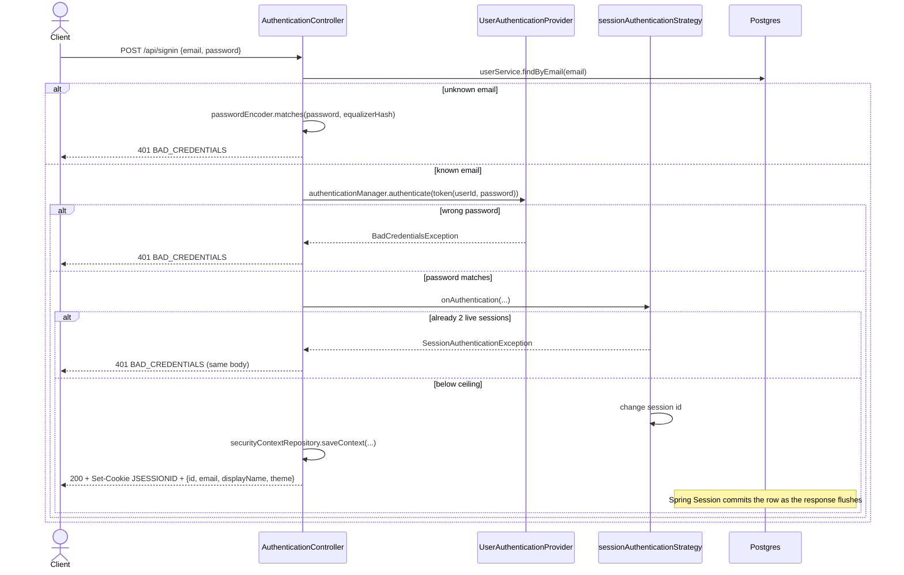
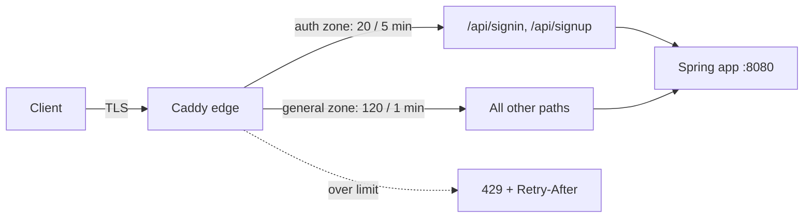

# 06 — Security and sessions

This layer decides who the caller is, keeps that identity in a server-side session, and refuses
requests that have no session. It also limits how often a client can try a password, so most of
the security guarantees of the API start here.

**Read first:** [05 — API layer](05-api-layer.md) (controllers, `@CurrentUserId`, the RFC 7807
error envelope).
**Related:** [09 — Build, quality and CI](09-build-quality-and-ci.md) (secret scanning, test gates),
[10 — Infrastructure and deployment](10-infrastructure-and-deployment.md) (Caddy, the VPS, TLS).
**Main code:**
[`security/`](../../src/main/java/com/vrudenko/kanban_board/security/) —
[SecurityConfiguration](../../src/main/java/com/vrudenko/kanban_board/security/SecurityConfiguration.java),
[AuthenticationController](../../src/main/java/com/vrudenko/kanban_board/security/AuthenticationController.java),
[UserAuthenticationProvider](../../src/main/java/com/vrudenko/kanban_board/security/UserAuthenticationProvider.java),
[ProblemDetailAuthenticationEntryPoint](../../src/main/java/com/vrudenko/kanban_board/security/ProblemDetailAuthenticationEntryPoint.java),
[LogoutHandler](../../src/main/java/com/vrudenko/kanban_board/security/LogoutHandler.java),
[NonprodResetSecurityConfiguration](../../src/main/java/com/vrudenko/kanban_board/security/NonprodResetSecurityConfiguration.java);
also [BeanConfiguration](../../src/main/java/com/vrudenko/kanban_board/config/BeanConfiguration.java),
[CorsConfig](../../src/main/java/com/vrudenko/kanban_board/config/CorsConfig.java),
[application.properties](../../src/main/resources/application.properties#L216-L250) and the
[Caddyfile](../../Caddyfile).

## Summary of decisions

| ID | Decision | Main reason |
|----|----------|-------------|
| SEC-01 | Server-side sessions with a cookie, not JWT | Reason not recorded (original 2025 design) |
| SEC-02 | Store sessions in Postgres with Spring Session JDBC | Sessions survive a restart and are shared by all instances; the old config was inert |
| SEC-03 | A custom JSON controller for signin/signup, not `UsernamePasswordAuthenticationFilter` | A filter-based rewrite had a larger blast radius |
| SEC-04 | The principal is the user id, with no password hash in it | The principal is serialized into the session table |
| SEC-05 | Every credential failure returns the same 401 body | Prevent user enumeration |
| SEC-06 | An unknown email still pays one BCrypt comparison | Close the timing side channel (finding F1) |
| SEC-07 | BCrypt cost 10 in production, 4 in tests | Test suite speed, with a production-safe fallback |
| SEC-08 | Invoke the session strategy explicitly from the controller | The custom signin path never triggers the filter-held strategy |
| SEC-09 | Count sessions with `SpringSessionBackedSessionRegistry`, as a local variable | Correct across instances, no stale entries, no per-request cost |
| SEC-10 | Max 2 sessions per user; a third signin gets the same 401 | Reason for "2" not recorded; the 401 prevents a validity oracle |
| SEC-11 | Accept the TOCTOU overshoot of the session ceiling | Measured: an advisory lock cannot close the window |
| SEC-12 | Rotate the session id on each authentication (`changeSessionId`) | Session fixation protection |
| SEC-13 | Server idle timeout 180 min, cookie `Max-Age` 10 min | Reason not recorded |
| SEC-14 | Cookie is `HttpOnly`, `Secure`, `SameSite=Strict` | `Secure` became possible after TLS on all environments |
| SEC-15 | CSRF protection disabled | Original reason not recorded; later argued safe because of `SameSite=Strict` |
| SEC-16 | Credentialed CORS with an explicit origin list | The CORS spec forbids `*` with credentials |
| SEC-17 | A separate entry point writes the 401 envelope | `GlobalExceptionHandler` cannot see filter-chain rejections |
| SEC-18 | Logout clears the cookie, sends `Clear-Site-Data`, returns JSON | Fix of a logout that always failed (finding F3) |
| SEC-19 | A second, profile-gated, stateless filter chain for the nonprod reset route | Production chain stays byte-identical |
| SEC-20 | Rate-limit signin/signup at the Caddy edge, not in the app | The app cannot see the real client IP; the edge can |
| SEC-21 | Scan for secrets with gitleaks at commit and in CI | Stop a credential before it enters history |

## The security filter chain

### What it is

A `SecurityFilterChain` is the ordered list of servlet filters that Spring Security runs before
a request reaches a controller. This project has one main chain
([SecurityConfiguration.securityFilterChain](../../src/main/java/com/vrudenko/kanban_board/security/SecurityConfiguration.java#L61-L143))
and, only under the `nonprod` profile, a second chain for one route (see
[The nonprod reset chain](#the-nonprod-reset-chain)).

### How it works

The chain configures these items, in this order in the code:

1. CSRF is disabled and CORS uses the auto-detected `CorsConfigurationSource` bean (L66).
2. The security context is kept in the HTTP session with `HttpSessionSecurityContextRepository`
   (L63, L69-L70).
3. `permitAll()` for signin, signup, the OpenAPI document, Swagger UI, and
   `/actuator/health`. Every other request must be authenticated (L72-L91).
4. `ProblemDetailAuthenticationEntryPoint` answers unauthenticated requests (L98-L100).
5. Session management: max 2 sessions, `changeSessionId` fixation protection,
   `SessionCreationPolicy.IF_REQUIRED` (L119-L125).
6. Logout configuration (L128-L137).
7. The custom `UserAuthenticationProvider` (L140).

```java
auth.requestMatchers(
                ApiPaths.SIGNIN,
                ApiPaths.SIGNUP,
                SWAGGER_DOCS_PATH,
                String.format("%s/*", SWAGGER_DOCS_PATH),
                String.format("%s/*", ApiPaths.SWAGGER_UI),
                ApiPaths.ACTUATOR_HEALTH)
        .permitAll();

auth.anyRequest().authenticated();
```

The matchers are relative to the context path. The servlet container removes
`server.servlet.context-path=/api` before Spring Security compares paths, so `/signin` in the code
matches `/api/signin` on the wire. The comment at L80-L86 records this for the health check.

`@EnableMethodSecurity` is also on the class. Controllers add `@PreAuthorize("isAuthenticated()")`
at class level, as a second check (see [chapter 05](05-api-layer.md)).

### Why we chose it

`SessionCreationPolicy.IF_REQUIRED` creates a session only when code asks for one. In this
application only the signin and signup paths ask for one (the controller comment "only these
authentication routes yield session cookie"). The reason for the other items is in the sections
below.

### How we test it

- [AuthorizationGatingTest](../../src/test/java/com/vrudenko/kanban_board/security/AuthorizationGatingTest.java)
  sends a request with no session to every route (`NoSessionSweep`) and expects 401. It sends a
  request from a second user to every owned route (`CrossUserSweep`) and expects 403.
  `Completeness.shouldCoverEveryDiscoveredRoute_withNoUnmatchedMapping` finds all routes by
  reflection, so a new route with no test case fails the build.
- `PermitAllExclusions` proves signin and signup are reachable with no session.
- [ActuatorHealthE2ETest](../../src/test/java/com/vrudenko/kanban_board/security/ActuatorHealthE2ETest.java)
  proves `/api/actuator/health` answers with no session, and that `/env` does not.

## Why sessions and not JWT

### What it is

The client gets a `JSESSIONID` cookie. The cookie holds only an opaque session id. All state is
on the server, in Postgres.

### Why we chose it

**SEC-01.** Reason not recorded. Session-based authentication is in the first security commit
(`efbcc93`, 2025-04-22, "add security (wip)"), before the planning system existed.
[PROJECT.md](../../.planning/PROJECT.md) lists it as "existing". A later todo
([2026-08-12 caller identity](../../.planning/todos/completed/2026-08-12-return-caller-identity-from-signin-and-signup-responses-for-.md))
confirms: "it's a plain servlet session id, not a JWT".

What the code shows, as facts you can use in a discussion:

- A server-side session is easy to revoke: delete the row in `SPRING_SESSION`. A JWT stays valid
  until it expires, unless you add a deny list.
- The concurrent-session ceiling (SEC-10) needs a server-side count of live sessions. With
  stateless tokens there is nothing to count.
- The cost is one database read per authenticated request, to load the session.

### Trade-offs and limits

There is no endpoint to list or revoke sessions. A pending todo records this
([no session revocation](../../.planning/todos/pending/2026-08-20-no-session-revocation-or-reauth-before-destructive-act.md)).

## Spring Session JDBC

### What it is

Spring Session replaces the servlet container's in-memory `HttpSession` with a store you choose.
Here the store is Postgres (`spring.session.store-type=jdbc`). The tables are `SPRING_SESSION`
(id, timestamps, principal name) and `SPRING_SESSION_ATTRIBUTES` (serialized attributes, including
`SPRING_SECURITY_CONTEXT`).

### How it works

[application.properties L216-L232](../../src/main/resources/application.properties#L216-L232):

```properties
spring.session.timeout=180m
spring.session.store-type=jdbc
spring.session.jdbc.initialize-schema=always
```

`initialize-schema=always` runs Spring Session's `schema-postgresql.sql` at each start. That script
is not idempotent (bare `CREATE TABLE`). It is safe only because Spring Boot's
`JdbcSessionDataSourceScriptDatabaseInitializer` sets `continueOnError(true)`. So each production
restart after the first logs "relation already exists". The properties comment says this is
expected, not a failed deploy.

Spring Session's request filter commits the session row when the response is flushed. This is
after the controller returns. That order matters for SEC-11.

### Why we chose it

**SEC-02.** Sessions in Postgres survive a restart and are shared by a second instance
([ARCHITECTURE.md](../ARCHITECTURE.md), "Sessions are server-side and shared").

This is a **reversed state**, not a new design. The `spring.session.*` properties were in the file
for a long time, but the `spring-session-jdbc` dependency was not on the classpath. The properties
did nothing, and sessions were in memory. Quick task
[260802-shl](../../.planning/quick/260802-shl-fix-the-dead-spring-session-jdbc-configu/260802-shl-SUMMARY.md)
added the dependency. Its locked decision D-01: "wire spring-session-jdbc for real rather than
deleting the inert properties and downgrading docs to match the bug". D-02: use only
`initialize-schema=always`, with no manual DDL script.

### Alternatives we rejected

- Delete the inert properties and document in-memory sessions (rejected in 260802-shl D-01).
- A manual DDL script like the other `docs/plans/backend-modernization/*-ddl.sql` files
  (rejected in D-02; Spring Session has its own initializer).

### Trade-offs and limits

- One database read for each authenticated request.
- Log noise at each restart (see above).
- Session tables are not in Flyway. The initializer owns them.

### How we test it

[AuthenticationTest](../../src/test/java/com/vrudenko/kanban_board/security/AuthenticationTest.java):

- `SchemaCreation.shouldCreateSpringSessionTables_whenApplicationStarts`.
- `SigninPersistence.shouldAddOneSessionRow_whenSigninSucceeds`.
- `SigninPersistence.shouldPersistSecurityContextAttribute_whenSigninSucceeds`.
- `SigninPersistence.shouldNotPersistBcryptHash_whenSigninSucceeds` (see SEC-04).

These tests first lived in `SessionPersistenceE2ETest` on H2. Phase 7 merged them into
`AuthenticationTest`, which runs on Testcontainers Postgres.

### Where this is recorded

[260802-shl SUMMARY](../../.planning/quick/260802-shl-fix-the-dead-spring-session-jdbc-configu/260802-shl-SUMMARY.md),
the comment in [application.properties L219-L231](../../src/main/resources/application.properties#L219-L231).

## The custom signin and signup path

### What it is

`POST /api/signin` and `POST /api/signup` are normal `@RestController` methods in
[AuthenticationController](../../src/main/java/com/vrudenko/kanban_board/security/AuthenticationController.java).
They take JSON, not a form post. They authenticate by hand, then save the security context into
the session.

### How it works



The steps of [signin](../../src/main/java/com/vrudenko/kanban_board/security/AuthenticationController.java#L79-L118):

1. `@Valid` checks the DTO. A malformed email or weak password gives 400 `VALIDATION_FAILED`
   before the method body runs.
2. The method finds the user by email. An unknown email throws `AppEntityNotFoundException`.
3. For an unknown email, the method runs one BCrypt comparison against a fixed hash (SEC-06),
   then throws `BadCredentialsException`.
4. For a known email, the method calls the private
   [authenticate](../../src/main/java/com/vrudenko/kanban_board/security/AuthenticationController.java#L158-L191)
   helper with the **user id** as the username.
5. Any exception inside step 4 becomes `BadCredentialsException("Invalid username or password")`.
6. `GlobalExceptionHandler.handleBadCredentialsException` maps that to 401 with
   `code: BAD_CREDENTIALS`.

The helper uses a Vavr `Try`. `Try` is a type that holds either a result or an exception, so the
code can chain steps without nested `try` blocks:

```java
return Try.of(() -> authenticationManager.authenticate(token))
        .mapTry(
                authentication -> {
                    sessionAuthenticationStrategy.onAuthentication(
                            authentication, request, response);
                    var context = securityContextHolderStrategy.createEmptyContext();
                    context.setAuthentication(authentication);
                    securityContextHolderStrategy.setContext(context);
                    securityContextRepository.saveContext(context, request, response);
                    return true;
                })
        .getOrElse(false);
```

Any failure in the chain gives `false`. The caller turns `false` into an exception, and its
blanket `catch` turns that into the generic 401.

[signup](../../src/main/java/com/vrudenko/kanban_board/security/AuthenticationController.java#L122-L156)
is different in two ways:

- `userService.save(signupDTO)` runs **outside** the `try`. A duplicate email throws
  `AppDuplicateResourceException`, which must reach `GlobalExceptionHandler` as 409, not become a
  401 (comment at L126-L130).
- If the automatic signin of the new account fails, the method deletes the new user and returns
  401.
- On success it returns 201 with a `Location` header of `/api/users/me`. That route has no `GET`
  handler yet (pending todo
  [signup Location header](../../.planning/todos/pending/2026-08-12-signup-location-header-points-at-a-uri-with-no-get-handler.md)).

[UserAuthenticationProvider.authenticate](../../src/main/java/com/vrudenko/kanban_board/security/UserAuthenticationProvider.java#L22-L43)
loads the user with `UserService.loadUserByUsername(userId)`. That method uses `findById`, because
the "username" is the user id. It compares the password with `passwordEncoder.matches`. Then it
returns a new token with a minimal principal:

```java
var principal = new User(userDetails.getUsername(), "", new ArrayList<>());
return new UsernamePasswordAuthenticationToken(principal, null, new ArrayList<>());
```

[CurrentUserIdResolver](../../src/main/java/com/vrudenko/kanban_board/security/CurrentUserIdResolver.java#L22-L43)
later reads `getUsername()` from this principal and gives it to controllers as `@CurrentUserId`.

### Why we chose it

- **SEC-03.** Quick task
  [260803-m2z](../../.planning/quick/260803-m2z-wire-a-sessionauthenticationstrategy-int/260803-m2z-PLAN.md)
  considered a move to `UsernamePasswordAuthenticationFilter` (option B). It rejected the move:
  it "rewrites the authentication path for signin, signup AND logout's session handling", the
  JSON contract would have to move into success/failure handlers, and "every existing E2E test's
  signin helper becomes a regression surface at once". The plan calls option B "the right
  long-term shape but not a quick task". Why the controller was custom in the first place is not
  recorded.
- **SEC-04.** The `Authentication` object is what Spring Session serializes into
  `SPRING_SESSION_ATTRIBUTES`. The full `UserEntity` would put the password hash into the
  database (comment at L34-L39 of the provider).
- **SEC-05.** One 401 body for "unknown email", "wrong password" and "session ceiling reached"
  prevents user enumeration. User enumeration is an attack that finds which emails have an
  account. Phase 07.1 decision D-08
  ([07.1-CONTEXT.md](../../.planning/milestones/v1.2-phases/07.1-address-hard-blockers-and-inconsistencies-from-the-frontend/07.1-CONTEXT.md))
  kept 400 for malformed input and the collapsed 401 only for real credential failures.
- The signin response returns `{id, email, displayName, theme}` so a frontend learns who signed
  in (quick task 260812-hs4, D-01, in the comment at L113-L116).

### Alternatives we rejected

| Alternative | Why rejected |
|-------------|--------------|
| `UsernamePasswordAuthenticationFilter` login | Blast radius (260803-m2z option B) |
| A different status for the session-ceiling rejection | It tells an attacker the password is correct (SecurityConfiguration Javadoc L191-L194) |
| The full `UserEntity` as principal | The hash would go into the session table |

### Trade-offs and limits

- A real user at the session ceiling gets "Invalid username or password" and cannot know why.
  The `ConcurrentSessionCeiling` test Javadoc accepts this cost.
- The blanket `catch (Exception e)` also hides unexpected errors as a 401.
- Each authenticated request that uses `@CurrentUserId` trusts the principal from the session.
  It does not reload the user.

### How we test it

[AuthenticationTest](../../src/test/java/com/vrudenko/kanban_board/security/AuthenticationTest.java)
nested classes:

- `Signin.Authenticated`: cookie present, identity body, exactly four fields
  (`shouldExposeOnlyIdentityFields_whenUserExists`), and `Cache-Control: no-store`.
- `Signin.AntiEnumeration.shouldReturnByteIdenticalBody_whenComparingUnregisteredEmailAndWrongPasswordSignins`
  compares the two bodies byte for byte.
- `Signup.DuplicateEmail.shouldReturnConflictWithDuplicateResourceCode_whenEmailAlreadyRegistered`.
- `Signup.DuplicateEmail.shouldReturnBadRequestNotConflict_whenSignupIsBothInvalidAndDuplicate`.
- `SignupThenSignin` and `SignupPasswordHashPersistence` prove signup stores a real BCrypt hash.

### Where this is recorded

[docs/AUTH_FLOWS.md](../AUTH_FLOWS.md) (client view),
[docs/ARCHITECTURE.md](../ARCHITECTURE.md) "Scenario — signin and session establishment" and its
[diagram source](../diagrams/architecture-signin-scenario.mmd).

## Timing equalization and the password encoder

### What it is

BCrypt is a slow password hash with a cost factor. Cost `n` means `2^n` rounds, so each step of
`n` doubles the work.
[BeanConfiguration.passwordEncoder](../../src/main/java/com/vrudenko/kanban_board/config/BeanConfiguration.java#L31-L34)
makes a `BCryptPasswordEncoder` with an injectable strength:

```java
@Bean
public PasswordEncoder passwordEncoder(@Value("${security.bcrypt.strength:10}") int strength) {
    return new BCryptPasswordEncoder(strength);
}
```

Production sets no value, so it uses 10 (the Spring Security default).
[application-test.properties](../../src/main/resources/application-test.properties#L17) sets 4, the
lowest value `BCryptPasswordEncoder` accepts.

### How it works

Before the fix, a known email paid one BCrypt comparison (tens of milliseconds) and an unknown
email paid none. The response bodies were identical, but the **latency** showed which emails had
accounts. This was finding F1 of the 2026-08-10 `/claude-security` scan
([todo](../../.planning/todos/completed/2026-08-10-signin-timing-side-channel-allows-email-enumeration.md)).

The fix
([AuthenticationController L59-L75, L86-L100](../../src/main/java/com/vrudenko/kanban_board/security/AuthenticationController.java#L59-L100)):

1. At startup, `@PostConstruct` hashes a fixed string, `"signin-timing-equalizer"`, with the
   injected encoder.
2. On an unknown email, signin calls `passwordEncoder.matches(dto.getPassword(), equalizerHash)`
   and discards the result.

### Why we chose it

- **SEC-06.** Both branches now pay the same main cost. The hash comes from the encoder bean, not
  from a literal, so its cost factor always follows the configured strength (decision D-01 in the
  comment at L64-L70).
- **SEC-07.** Quick task
  [260811-ixj](../../.planning/quick/260811-ixj-investigate-and-implement-test-suite-spe/260811-ixj-SUMMARY.md)
  measured BCrypt as the main cost of the test suite (about 89 s). With cost 4 in tests and other
  changes, `./gradlew test` went from 433.5 s to 276.5 s (-36.2 %). The BCrypt change alone gave
  about 63 s (14.5 %).

### Trade-offs and limits

- The fix narrows the channel. It does not make signin constant-time. A known email still does
  one more indexed database read (`loadUserByUsername`), below a millisecond (comment at L94-L97).
- Tests run a weaker hash than production. The fallback test below keeps production at 10.

### How we test it

- [SigninTimingEqualizationTest](../../src/test/java/com/vrudenko/kanban_board/security/SigninTimingEqualizationTest.java)
  replaces the encoder with a counting encoder. `shouldInvokeMatchesExactlyOnce_whenEmailIsUnregistered`
  and `shouldInvokeMatchesExactlyOnce_whenPasswordIsWrong` prove both branches call `matches` once.
  The test counts calls. It does not measure time, so it is not flaky.
- [PasswordEncoderStrengthTest](../../src/test/java/com/vrudenko/kanban_board/config/PasswordEncoderStrengthTest.java):
  - `TestProfileCostFactor.shouldEncodeAtCostFactorFour_whenUsingTheAutowiredBean` splits the hash
    on `$` and expects cost `04`.
  - `ProductionFallback.shouldFallBackToTen_whenNoOverrideIsConfigured` reads the `@Value`
    annotation by reflection and expects `${security.bcrypt.strength:10}`.
  - `ProductionFallback.shouldBeAbsentFromDefaultProperties_whenReadingApplicationProperties`
    fails if the test override leaks into `application.properties`.

## The concurrent-session ceiling and session fixation

### What it is

- The **session ceiling** limits one user to 2 live sessions. A third signin is refused
  (`maximumSessions(2).maxSessionsPreventsLogin(true)`). It does not expire the oldest session.
- **Session fixation** is an attack where an attacker makes a victim use a session id that the
  attacker knows. The defence is to give the session a new id at signin.

### How it works

The DSL block in the chain declares both controls (L119-L125). The bean
[sessionAuthenticationStrategy](../../src/main/java/com/vrudenko/kanban_board/security/SecurityConfiguration.java#L196-L220)
enforces them on the real path:

```java
var sessionRegistry = new SpringSessionBackedSessionRegistry<>(sessionRepository);

var concurrentSessionControl =
        new ConcurrentSessionControlAuthenticationStrategy(sessionRegistry);
concurrentSessionControl.setMaximumSessions(MAX_CONCURRENT_SESSIONS);
concurrentSessionControl.setExceptionIfMaximumExceeded(true);

return new CompositeSessionAuthenticationStrategy(
        List.of(concurrentSessionControl, new ChangeSessionIdAuthenticationStrategy()));
```

1. `ConcurrentSessionControlAuthenticationStrategy` asks the registry how many live sessions the
   principal has. `SpringSessionBackedSessionRegistry` answers from the `SPRING_SESSION` table by
   principal name. At 2, it throws `SessionAuthenticationException`.
2. `ChangeSessionIdAuthenticationStrategy` calls the servlet `changeSessionId()`. Spring Session
   deletes the old row and saves the session under a new id.

The order is important: the ceiling runs first, so a refused signin does not rotate the caller's
existing id (comment at L212-L217). The constant `MAX_CONCURRENT_SESSIONS = 2` feeds both the DSL
and the bean, so the two numbers cannot drift (L41-L43).

**Why the controller must call the strategy.** There are two strategy objects, and this is the
point that confuses most readers.

- The DSL **does** install `SessionManagementFilter` and `ConcurrentSessionFilter`. Quick task
  [260813-m9x](../../.planning/quick/260813-m9x-reconcile-the-contradictory-sessionmanag/260813-m9x-SUMMARY.md)
  measured this (verdict `SMF_PRESENT_INVOKES`).
- That filter holds its **own** `CompositeSessionAuthenticationStrategy`, made by
  `SessionManagementConfigurer`. It uses an in-memory `SessionRegistryImpl`, not the JDBC
  registry. A reference comparison with the bean gives `false`.
- The filter fires only when a request arrives already authenticated but with no stored context.
  In this project only MockMvc's `.with(user(...))` test shortcut does that.
- On the real signin path, the controller authenticates and saves the context in the same
  request, so the filter has nothing to do. Without the explicit call, nothing enforces the
  ceiling or rotates the id on the real path.

### Why we chose it

- **SEC-08.** Quick task 260803-m2z decision D-01: "invoke the strategy explicitly from
  AuthenticationController.authenticate rather than moving signin onto a real authentication
  filter — smaller diff, same two files that already own authentication".
- **SEC-09.** Decision R1 of the same task: the JDBC registry "reads live SPRING_SESSION rows
  rather than in-memory bookkeeping that could go stale and permanently lock out a legitimate
  user under maxSessionsPreventsLogin(true)". It is a local variable, not a `@Bean`. A
  `SessionRegistry` bean would go to `ConcurrentSessionFilter`, which would then read the session
  from JDBC on **every** authenticated request, for a code path that never runs when login is
  prevented instead of expiring sessions (comment at L199-L204).
- **SEC-10.** The value 2 and `maxSessionsPreventsLogin(true)` come from the original author. The
  m2z plan calls them "deliberately configured by the original author". The reason for 2 is not
  recorded. The collapsed 401 is deliberate (see SEC-05).
- **SEC-12.** Session fixation protection. 260803-m2z changed the DSL from `newSession` to
  `changeSessionId`, "so the declared strategy matches what the bean actually implements".

### Alternatives we rejected

From the [260803-m2z trade-off matrix](../../.planning/quick/260803-m2z-wire-a-sessionauthenticationstrategy-int/260803-m2z-PLAN.md):

| Alternative | Why rejected |
|-------------|--------------|
| B. `UsernamePasswordAuthenticationFilter` | Blast radius over signin, signup, logout and every E2E helper |
| C. Delete the DSL lines and document no enforcement | Permanently accepts session fixation and unbounded sessions |
| R2. In-memory `SessionRegistryImpl` bean + `RegisterSessionAuthenticationStrategy` | `JdbcIndexedSessionRepository` does not publish `SessionDestroyedEvent`, so entries never leave: a user is locked out after the second login until a restart. Also per instance |
| R3. The JDBC registry as a `@Bean` | A JDBC read on every authenticated request for zero gain |

### Trade-offs and limits

- One extra indexed `SELECT` for each successful signin.
- Two enforcers exist, with different registries. A pending todo tracks this
  ([two enforcers](../../.planning/todos/pending/2026-08-13-two-independent-session-ceiling-enforcers-coexist.md)).
  If a future login uses a standard Spring Security filter, the in-memory enforcer would apply,
  and it is not shared across instances.
- Parallel E2E workers that share one fixture user get 401 from the third worker on
  ([AUTH_FLOWS.md](../AUTH_FLOWS.md), "What will break your E2E suite").

### How we test it

- `AuthenticationTest.ConcurrentSessionCeiling.shouldRejectThirdSignin_whenConcurrentSessionCeilingIsReached`:
  two signins succeed with different cookies, the third gets 401 with no cookie, and the row
  count grows by exactly 2.
- `AuthenticationTest.SessionFixation.shouldRotateSessionId_whenSigninPresentsAnExistingSession`:
  the second signin sends the first cookie. The new cookie differs, and the row count grows by 1,
  not 2, because the old row moves to the new id. Without a cookie there is nothing to rotate,
  and the test would pass for no reason (Javadoc).
- The m2z tests were written RED first: the ceiling test failed with `expected: 401, but was: 200`
  before the fix.

### Where this is recorded

[260802-shl](../../.planning/quick/260802-shl-fix-the-dead-spring-session-jdbc-configu/260802-shl-SUMMARY.md)
(the gap found as a tripwire test),
[260803-m2z](../../.planning/quick/260803-m2z-wire-a-sessionauthenticationstrategy-int/260803-m2z-SUMMARY.md)
(the fix),
[260813-m9x](../../.planning/quick/260813-m9x-reconcile-the-contradictory-sessionmanag/260813-m9x-SUMMARY.md)
(the filter measurement), the Javadoc at
[SecurityConfiguration L145-L195](../../src/main/java/com/vrudenko/kanban_board/security/SecurityConfiguration.java#L145-L195).

## The accepted TOCTOU overshoot

### What it is

TOCTOU (time of check to time of use) is a race where a value changes between a check and the
action that depends on it. The ceiling reads the live session count, then lets the signin create
a session. Two signins at the same instant can both read "1 session" and both succeed. This was
finding F6 of the 2026-08-10 scan.

### How it works

Quick task
[260811-h2v](../../.planning/quick/260811-h2v-fix-toctou-race-in-concurrent-session-ce/260811-h2v-SUMMARY.md)
measured where the new row becomes visible:

- A probe on a second database connection, run just after `saveContext(...)` returned inside the
  controller, read **0** committed rows for the principal.
- A client-side probe after the full HTTP response read **1**.

So the row commits when Spring Session's filter flushes the response. This is after the
controller, and after any transaction around the controller, returns.

### Why we chose it

**SEC-11.** A `pg_advisory_xact_lock` around the count-then-register step would release before
the row it must protect exists. It would close nothing and add a blocking database round trip to
every signin (Javadoc L175-L189). The team accepted the race as "a bounded, self-healing
overshoot" (h2v D-01). The bound: live sessions never go above 2 plus one per signin that is in
flight at the same instant. It is not a flat "max 3". The next signin that is not concurrent is
refused again.

### Alternatives we rejected

A transaction-scoped advisory lock (measured as ineffective, see above).

### Trade-offs and limits

The overshoot is not rare. A temporary `@RepeatedTest(10)` run on 2026-08-11 overshot in **10 of
10** runs. The extra session gives no capability that the two allowed sessions do not already
give.

### How we test it

[ConcurrentSigninCeilingE2ETest.ConcurrentSignin.shouldCreateOneSessionPerAcceptedSignin_whenTwoSigninsRaceTheCeiling](../../src/test/java/com/vrudenko/kanban_board/security/ConcurrentSigninCeilingE2ETest.java)
races two real HTTP signins. It asserts an invariant and a range, not an exact count:

- `liveSessionCount() == 1 + successCount`.
- `successCount` is 1 or 2.
- A later sequential signin gets 401 (the self-heal check).

The test has `@Tag("realSocket")`, so the pre-commit `fastTest` gate skips it and only
`./gradlew test` and CI run it (see [chapter 09](09-build-quality-and-ci.md)). When the strategy
call was commented out, the test failed on the self-heal assertion (`expected: 401 but was: 200`).

## Session and cookie lifetimes

### What it is

Two lifetimes exist:

| Setting | Value | Effect |
|---------|-------|--------|
| `spring.session.timeout` | `180m` | The server deletes a session after 180 min with no request |
| `server.servlet.session.cookie.max-age` | `600` | The browser drops the cookie 10 min after it is set |
| `server.servlet.session.timeout` | `1m` | No effect now; `spring.session.timeout` wins |

### How it works

With Spring Session on the classpath, `spring.session.timeout` sets the idle timeout.
`server.servlet.session.timeout=1m` was the real timeout before 260802-shl added the dependency.
The cookie has a `Max-Age`, so it is a persistent cookie with a fixed 10-minute life.

### Why we chose it

**SEC-13.** Reason not recorded. All three values are in the first `application.properties`
commits of 2025 (`5121740`, `f12b571`). [ARCHITECTURE.md](../ARCHITECTURE.md) and the project
CLAUDE.md say the values "differ by design", but no source gives the design reason.

### Trade-offs and limits

A client that signs in once and works for more than 10 minutes gets 401 `UNAUTHENTICATED`, while
its server-side session is still alive for up to 180 minutes
([AUTH_FLOWS.md](../AUTH_FLOWS.md)). The orphan session still counts toward the ceiling of 2 until
it expires. The sources do not discuss this interaction.

## Cookie attributes

### What it is

[application.properties L234-L250](../../src/main/resources/application.properties#L234-L250):

```properties
server.servlet.session.tracking-modes=cookie
server.servlet.session.cookie.http-only=true
server.servlet.session.cookie.secure=true
server.servlet.session.cookie.name=JSESSIONID
server.servlet.session.cookie.path=/
server.servlet.session.cookie.max-age=600
server.servlet.session.cookie.same-site=strict
```

- `HttpOnly`: page JavaScript cannot read the cookie.
- `Secure`: the browser sends the cookie only over TLS.
- `SameSite=Strict`: the browser does not send the cookie on a cross-site request.
- `tracking-modes=cookie`: the session id never goes into a URL.

### How it works

Spring Session's `DefaultCookieSerializer` writes the cookie, not the servlet container. Spring
Boot maps the `server.servlet.session.cookie.*` properties onto it.

### Why we chose it

**SEC-14.** `Secure` is a **reversed** decision. It was `false` until 2026-08-19, because no
deployed environment had TLS. With the property unset, the serializer sets `Secure` per request,
from whether that request was secure. Phases 5 and 8 put TLS on every environment, so the value
is now always `true` (HARDEN-07; comment at L238-L245;
[todo](../../.planning/todos/completed/2026-08-10-set-secure-flag-on-session-cookie-once-real-tls-exists.md)).
The test profile uses the same value, because the test harnesses copy only the cookie value.

The reason for `HttpOnly` and `SameSite=Strict` in the original configuration is not recorded.
Later documents use `SameSite=Strict` as the CSRF argument (SEC-15).

### How we test it

[SessionCookieAttributesE2ETest.SigninCookieAttributes.shouldCarryHardenedAttributes_whenSignedIn](../../src/test/java/com/vrudenko/kanban_board/security/SessionCookieAttributesE2ETest.java)
reads a real `Set-Cookie` header over a socket. MockMvc has no real transport, so it cannot see
cookie attributes.

## CSRF and CORS

### What it is

- CSRF (cross-site request forgery) is an attack where another site makes the victim's browser
  send a request with the victim's cookie.
- CORS (cross-origin resource sharing) is the browser rule that decides if a page on one origin
  can read a response from another origin.

### How it works

`http.csrf(AbstractHttpConfigurer::disable)` removes the CSRF token check. There is no token to
fetch before a mutation ([AUTH_FLOWS.md](../AUTH_FLOWS.md)).

[CorsConfig.corsConfigurationSource](../../src/main/java/com/vrudenko/kanban_board/config/CorsConfig.java#L27-L40)
registers one configuration for `/**`:

- origins from `app.cors.allowed-origins` (default `http://localhost:5173,http://localhost:3000`);
- methods `GET, POST, PUT, PATCH, DELETE`;
- all headers;
- `allowCredentials(true)`.

`http.cors(Customizer.withDefaults())` finds this bean automatically. Its Javadoc says that line
must not change (Phase 07.1, D-10, D-11).

### Why we chose it

- **SEC-15.** The original reason to disable CSRF is not recorded. The line is in the first
  security commit (`efbcc93`). Later work recorded why the risk is acceptable:
  - Phase 07.1 threat T-07.1-02-02 accepted it as "a pre-existing decision this plan neither
    worsens nor addresses", and said "CORS is not a CSRF defence and is not claimed as one"
    ([07.1-02-PLAN](../../.planning/milestones/v1.2-phases/07.1-address-hard-blockers-and-inconsistencies-from-the-frontend/07.1-02-PLAN.md)).
  - The OWASP audit
    [260820-giz](../../.planning/quick/260820-giz-audit-penetration-testing-and-security-c/260820-giz-SUMMARY.md)
    gave the chain: `SameSite=Strict` means a modern browser does not attach the cookie to a
    cross-site request. Its verdict: "sound", but only half verified.
- **SEC-16.** Cookie-based auth needs `allowCredentials(true)`. The CORS spec forbids a wildcard
  origin with credentials, so the list must be explicit. The list is a property so a deployment
  can change it with no code change (CorsConfig Javadoc).

### Trade-offs and limits

- Because CSRF is disabled, Spring Security's `LogoutConfigurer` accepts `GET`, `PUT` and `DELETE`
  for the logout URL, not only `POST`. This comes from the library source (6.5.11,
  `createLogoutRequestMatcher`), not from a project document.
- The CSRF argument depends on the browser. It gives no protection for an old browser that
  ignores `SameSite`.
- [docker-compose.prod.yml](../../docker-compose.prod.yml) sets no `APP_CORS_ALLOWED_ORIGINS` for
  the `app` service. [docker-compose.nonprod.yml](../../docker-compose.nonprod.yml) does. So
  production uses the localhost defaults. The reason is not recorded.

### How we test it

- `SessionCookieAttributesE2ETest` proves `SameSite=Strict` on the wire.
- [CorsConfigTest.CorsConfigurationSourceTest.shouldResolveExplicitCredentialedConfiguration_whenRequestedForApiPath](../../src/test/java/com/vrudenko/kanban_board/config/CorsConfigTest.java)
  checks the resolved configuration only. CORS is enforced by the browser, so MockMvc cannot
  prove a real rejection.
- No test proves a real cross-origin request is refused
  ([pending todo](../../.planning/todos/pending/2026-08-20-verify-csrf-defense-with-a-real-cross-origin-rejection-t.md)).

## 401 versus 403: the authentication entry point

### What it is

An `AuthenticationEntryPoint` is the object Spring Security calls when a request needs
authentication and has none.
[ProblemDetailAuthenticationEntryPoint.commence](../../src/main/java/com/vrudenko/kanban_board/security/ProblemDetailAuthenticationEntryPoint.java#L38-L58)
writes 401 with the same RFC 7807 `ProblemDetail` shape as the rest of the API, with
`code: UNAUTHENTICATED`.

### How it works

- **401** means "no valid session". `ExceptionTranslationFilter` calls the entry point inside the
  filter chain. `DispatcherServlet` never runs, so no controller and no `@ExceptionHandler` runs.
- **403** means "valid session, but not your resource". `OwnershipVerifierService` throws, and
  `GlobalExceptionHandler` maps it to 403 `ACCESS_DENIED` (see [chapter 05](05-api-layer.md)).

The entry point sets `instance` by hand. `GlobalExceptionHandler` gets `instance` from
`HttpEntityMethodProcessor`, which runs only for a request that reaches a handler method. This
keeps the key sets of the two producers identical (comment at L48-L52).

### Why we chose it

**SEC-17.** `GlobalExceptionHandler` cannot reach a filter-chain rejection (class Javadoc). The
DSL call at L98-L100 is mandatory: Spring Security does not detect an `AuthenticationEntryPoint`
bean by itself. Without the call, the default `Http403ForbiddenEntryPoint` returns a bare 403 with
no body (Phase 07.1, D-04, D-05). Before Phase 07.1, the four rejection types (401, 403, 400, 409)
"were not reliably distinguishable" ([ARCHITECTURE.md](../ARCHITECTURE.md)).

### Trade-offs and limits

Two producers must keep the same envelope shape. The Javadoc tells a future editor to check the
other one. `ProblemDetailOpenApiCustomizerTest` compares the declared schema with both producers
(see [chapter 05](05-api-layer.md)).

### How we test it

`AuthorizationGatingTest.NoSessionSweep.shouldReturnUnauthorized_whenNoSessionIsPresent` (401 on
every route) and `CrossUserSweep.shouldReturnForbidden_whenForeignUserAccessesOwningUsersResource`
(403).

## Logout

### What it is

The logout configuration (L128-L137) adds three handlers:

1. `HeaderWriterLogoutHandler` with `ClearSiteDataHeaderWriter(COOKIES)`: the response carries
   `Clear-Site-Data: "cookies"`.
2. `deleteCookies(sessionCookieName)`: the response sets `JSESSIONID` with `Max-Age=0`.
3. [LogoutHandler](../../src/main/java/com/vrudenko/kanban_board/security/LogoutHandler.java#L15-L24)
   as the success handler: 200 with `{"message": "Successfully logged out"}`. The default would
   redirect, which is wrong for a JSON API.

The default `LogoutFilter` behaviour also invalidates the session, which removes its row.

### Why we chose it

**SEC-18.** The cookie name comes from `@Value("${server.servlet.session.cookie.name}")` on
`SecurityConfiguration` (L51-L59). This is the fix of finding F3 (Phase 07.1-09). Before, the name
came from a `@Value` on a `public static` field of a plain class, `SecurityConstants`. Spring does
not process that, so the field was always `null`. Every real `POST /api/logout` threw
`IllegalArgumentException` from `new Cookie(null, null)` and returned 500. `SecurityConstants` was
deleted.

### How we test it

`AuthenticationTest.Logout.shouldClearSessionCookieAndReturnOk_whenLogoutSucceeds` expects 200 and
a cleared cookie. Its Javadoc explains why an older test in `ThemePersistenceTest` missed F3: it
posted to `/logout`, which never matched the filter under MockMvc.

### Trade-offs and limits

See [Known gaps](#known-gaps-and-open-items): the logout URL includes the context path, unlike every
other matcher, and no real-socket test covers logout.

## The nonprod reset chain

### What it is

Nonprod has a data-reset route, `/api/admin/reset`, for E2E suites.
[NonprodResetSecurityConfiguration.resetEndpointFilterChain](../../src/main/java/com/vrudenko/kanban_board/security/NonprodResetSecurityConfiguration.java#L28-L41)
is a second `SecurityFilterChain`:

```java
@Profile("nonprod")
@Configuration
public class NonprodResetSecurityConfiguration {
    @Bean
    @Order(1)
    public SecurityFilterChain resetEndpointFilterChain(HttpSecurity http) throws Exception {
        http.securityMatcher(ApiPaths.RESET)
                .csrf(AbstractHttpConfigurer::disable)
                .authorizeHttpRequests(auth -> auth.anyRequest().permitAll())
                .sessionManagement(
                        session -> session.sessionCreationPolicy(SessionCreationPolicy.STATELESS));
        return http.build();
    }
}
```

### How it works

`@Order(1)` puts this chain first. `securityMatcher` limits it to the reset path. The main chain
has no `@Order`, so it sorts last and catches everything else. `STATELESS` means a reset call does
not create a `spring_session` row that the same reset then deletes.

The chain permits the request, but the
[ResetController](../../src/main/java/com/vrudenko/kanban_board/controller/ResetController.java)
checks an `X-Reset-Token` header with `MessageDigest.isEqual`, a constant-time compare.

### Why we chose it

**SEC-19.** In production the bean does not exist, so the production chain is byte-identical to
before (Plan 08-02, D-02). Phase 8 decision D-01 chose a shared secret over session auth, an IP
allow list, or hostname obscurity, "because it's cheap, doesn't touch user accounts, and works
identically for a manual `curl` today and Playwright's `beforeEach` later"
([08-CONTEXT](../../.planning/milestones/v1.3-phases/08-isolated-nonprod-environment-live-and-resettable/08-CONTEXT.md)).
The profile and the token are two independent controls. The controller Javadoc says "Neither
control is treated as sufficient alone."

### How we test it

[ResetEndpointProfileGatingTest.BeanRegistration](../../src/test/java/com/vrudenko/kanban_board/security/ResetEndpointProfileGatingTest.java):
`should_registerNoResetBeans_when_nonprodProfileIsInactive` and
`should_registerNoResetSecurityChain_when_nonprodProfileIsInactive`.

## Rate limiting at the Caddy edge

### What it is

Caddy is the reverse proxy in front of the app on the VPS (see
[chapter 10](10-infrastructure-and-deployment.md)). A custom Caddy image carries the
`github.com/mholt/caddy-ratelimit` plugin. The production site block has two zones
([Caddyfile L22-L68](../../Caddyfile#L22-L68)):

| Zone | Paths | Limit | Key |
|------|-------|-------|-----|
| `auth` | `/api/signin*`, `/api/signup*` | 20 events per 5 min | `{remote_host}`, IPv6 by /56 |
| `general` | every other path | 120 events per 1 min | `{remote_host}`, IPv6 by /56 |

Over the limit, Caddy returns 429 with `Retry-After`. The nonprod site block has no limiter.

### How it works



The two matchers are exact boolean complements, so each request spends from exactly one zone.

### Why we chose it

**SEC-20.** Quick task
[260903-dvp](../../.planning/quick/260903-dvp-caddy-edge-rate-limiting/260903-dvp-CONTEXT.md),
decision D-1: "Limit at the Caddy edge, not app-level Bucket4j."

- The most useful limit is per IP and before authentication, which is what the edge sees.
- `server.forward-headers-strategy` is unset and Caddy has no `trusted_proxies`. So
  `request.getRemoteAddr()` in the app returns Caddy's container IP for every request. An
  app-level per-IP limiter "would bucket the entire internet into one key".
- Each signin costs a BCrypt hash on a 2 GB VPS that also runs Redpanda.
- No per-user quota is needed: there is no billing, no tenancy, and no expensive authenticated
  endpoint.

Other choices in the same task:

- `{remote_host}`, not `{client_ip}`: Caddy is the real edge, so the TCP peer address is the client
  and cannot be forged. `{client_ip}` comes from `X-Forwarded-For` when `trusted_proxies` is set,
  so an attacker could choose the key. If a CDN or load balancer is ever added in front, this
  choice inverts (Caddyfile L14-L21).
- 20, not 10, per 5 min: a human decision on 2026-09-03, because an office or CGNAT pool shares
  one address (Caddyfile L96-L99).
- `*` suffix on the paths: an exact list missed `/api/signin;x=1`. That form never reached BCrypt
  (Spring answers it 401), so the `*` is defence in depth (Caddyfile L70-L89).
- Partitioned zones, a **reversed** decision: the zones first composed. A measurement showed a
  429 from the auth zone still spent a general token, so 130 signin attempts locked one address
  out of the whole API for a minute (Caddyfile L44-L59).
- The image is built in CI, not on the VPS (D-3). Its tag comes from its contents, not the commit,
  so an app deploy does not restart Caddy (D-5). See [chapter 10](10-infrastructure-and-deployment.md).

**Why not Redis (Epic 4)?** The
[Epic 4 plan](../plans/backend-modernization/04-redis.md) proposes rate-limiting signin/signup with
Redis (Bucket4j on Redis, or `INCR` + `EXPIRE`) keyed by IP or email. Epic 4 is still deferred
([STATUS.md](../plans/backend-modernization/STATUS.md), [PROJECT.md](../../.planning/PROJECT.md)).
The 260903-dvp documents do not discuss Redis by name. The D-1 reason applies to it too: an
app-side limiter keyed by IP gets the wrong IP today. A per-email key would not have that problem,
but D-1 put per-user quotas out of scope.

### Alternatives we rejected

| Alternative | Why rejected |
|-------------|--------------|
| App-level Bucket4j (the pending todo's proposal) | The app sees one IP for all clients (260903-dvp D-1) |
| Compile the Caddy plugin on the VPS | 2 GB VM with an OOM history (D-3) |
| Plugin by tag `v0.1.0` | `master` is 7 commits ahead with a metrics fix; pinned by SHA instead (D-2) |
| A limiter on nonprod | E2E suites must not be throttled; its absence is the negative control |

### Trade-offs and limits

- One address can send 140 requests per minute (120 + 20).
- A 429 from Caddy is not in the RFC 7807 format. `handle_errors 429` is open, because nobody has
  proved that `Retry-After` survives an error handler (Caddyfile L121-L125).
- `OPTIONS *` is not limited. Go's `net/http` answers it before Caddy's routes run.
- Users behind one NAT share a bucket.
- The limit is per IP. It does not stop a slow, distributed credential-stuffing attack.
- The same plugin limits Grafana's `/login*` on the monitoring hostname, with the same numbers
  (Caddyfile L165-L197).

### How we test it

260903-dvp verified the limiter locally in both directions: requests 1 to 10 passed and 11 to 12
got 429 (before the change to 20), and the nonprod block gave zero 429s. Three review rounds
(Claude, Gemini, Codex) found 11 issues. Task 7, the live check on the VPS, was a human checkpoint
and is not recorded as done in the SUMMARY. There is no automated test in `src/test`.

### Where this is recorded

[260903-dvp SUMMARY](../../.planning/quick/260903-dvp-caddy-edge-rate-limiting/260903-dvp-SUMMARY.md),
the comments in the [Caddyfile](../../Caddyfile), and the original gap in the OWASP audit
[260820-giz](../../.planning/quick/260820-giz-audit-penetration-testing-and-security-c/260820-giz-SUMMARY.md).

## Secret scanning

### What it is

**SEC-21.** [gitleaks](https://github.com/gitleaks/gitleaks) looks for credentials in text. It
runs at two gates:

1. [.githooks/pre-commit](../../.githooks/pre-commit) scans the staged diff first, before format
   and tests, with a pinned image (`v8.30.1` by digest).
2. [.github/workflows/secret-scan.yml](../../.github/workflows/secret-scan.yml) scans the full
   history on every push and pull request.

A real false positive gets a narrow, cited entry in [.gitleaks.toml](../../.gitleaks.toml), never
a path exemption. [Chapter 09](09-build-quality-and-ci.md) covers both gates in detail.

## Known gaps and open items

- **Logout URL and the context path (suspected, not verified).** `logout.logoutUrl(CONTEXT_PATH +
  ApiPaths.LOGOUT)` registers `/api/logout`. All other matchers are relative to the context path
  (`/signin`, `/actuator/health`). In Spring Security 6.5.11 the logout matcher is an
  `AntPathRequestMatcher`, which compares the servlet path, and the servlet path excludes the
  context path. So a real `POST /api/logout` may not match. The only logout test uses MockMvc,
  where the context path is empty. No real-socket test covers logout. This conclusion comes from
  reading the library source only. A real-socket test is necessary to confirm or reject it.
- **Rate limiting todo still open.** [The pending todo](../../.planning/todos/pending/2026-08-20-add-rate-limiting-to-signin-to-bound-brute-force-volume.md)
  asks for app-level Bucket4j and for limits on authenticated business endpoints. The edge
  limiter now covers signin/signup, but the todo is not closed.
- **No revocation.** No endpoint lists or revokes sessions, and destructive actions need no
  re-authentication ([todo](../../.planning/todos/pending/2026-08-20-no-session-revocation-or-reauth-before-destructive-act.md)).
- **No security event logging** on signin, logout or access denial
  ([todo](../../.planning/todos/pending/2026-08-20-no-security-event-logging-on-auth-and-access-control.md)).
- **Response headers.** No CSP. HSTS probably never fires, because no forwarded-header handling
  exists, so `request.isSecure()` is false behind Caddy
  ([todo](../../.planning/todos/pending/2026-08-20-security-response-headers-csp-and-unreliable-hsts-behind.md)).
- **CSRF defence not proven end to end** (see SEC-15).
- **Two session-ceiling enforcers** with different registries (see SEC-09).
- **Production CORS origins** are the localhost defaults (see SEC-16).
- **Reasons not recorded:** sessions over JWT (SEC-01), the original CSRF disable (SEC-15), the
  ceiling value 2 (SEC-10), the 180 min / 10 min lifetimes (SEC-13).

## Questions to check your knowledge

1. Why does `AuthenticationController` call `sessionAuthenticationStrategy.onAuthentication(...)`
   itself, when the DSL already declares `maximumSessions(2)`?
   <details><summary>Answer</summary>
   The DSL installs a filter with its own strategy and an in-memory registry. That filter fires
   only when a request arrives authenticated with no stored context, which only MockMvc's
   `.with(user(...))` produces. The real signin authenticates inside the controller, so only the
   explicit call enforces the ceiling and rotates the id (260803-m2z, 260813-m9x).
   </details>

2. Why is the session registry a local variable and not a `@Bean`?
   <details><summary>Answer</summary>
   A `SessionRegistry` bean would go to `ConcurrentSessionFilter`. That filter would then load the
   session from JDBC on every authenticated request, for an expiry path that never runs under
   `maxSessionsPreventsLogin(true)`.
   </details>

3. Why not use `SessionRegistryImpl`, the textbook registry?
   <details><summary>Answer</summary>
   It removes entries only on `SessionDestroyedEvent`, which `JdbcIndexedSessionRepository` does
   not publish. With login prevention on, a user would be locked out after the second login until
   a restart. It is also per instance.
   </details>

4. A user at the ceiling tries to sign in. What does the client see, and why?
   <details><summary>Answer</summary>
   401 `BAD_CREDENTIALS`, byte-identical to a wrong password. A different response would tell an
   attacker that the password is correct.
   </details>

5. Why can a transaction-scoped advisory lock not close the TOCTOU race?
   <details><summary>Answer</summary>
   The session row commits when Spring Session flushes the response, after the controller
   returns. A probe measured 0 committed rows at the end of the controller. The lock would release
   before the row exists.
   </details>

6. How does signin stop timing-based user enumeration?
   <details><summary>Answer</summary>
   On an unknown email it runs one BCrypt `matches` against a hash made at startup from the same
   encoder bean, so both branches pay one BCrypt cost. One indexed read still differs, so it is
   not constant-time.
   </details>

7. Why is the principal a new `User` with an empty password and not the `UserEntity`?
   <details><summary>Answer</summary>
   Spring Session serializes the `Authentication` into `SPRING_SESSION_ATTRIBUTES`. The entity
   would put the BCrypt hash into the database. A test decodes the stored bytes and checks for
   `$2a$`.
   </details>

8. Why does the concurrency strategy run before `ChangeSessionIdAuthenticationStrategy`?
   <details><summary>Answer</summary>
   So a signin that the ceiling refuses does not rotate the caller's existing session id as a
   side effect.
   </details>

9. Why is 401 written by a separate entry point and not by `GlobalExceptionHandler`?
   <details><summary>Answer</summary>
   An unauthenticated request stops in `ExceptionTranslationFilter`. `DispatcherServlet` never
   runs, so no `@ExceptionHandler` can see it. Without the explicit DSL call the default is a bare
   403.
   </details>

10. CSRF is disabled. What is the argument that this is acceptable, and what is its weak point?
    <details><summary>Answer</summary>
    The session cookie is `SameSite=Strict`, so a modern browser does not send it on a cross-site
    request. The weak point: it depends on browser behaviour, and no test proves a real
    cross-origin rejection. The original reason to disable CSRF is not recorded.
    </details>

11. Why is rate limiting in Caddy and not in Spring?
    <details><summary>Answer</summary>
    Forwarded headers are not configured, so the app sees Caddy's IP for every client. An app-level
    per-IP limiter would put all clients in one bucket. The edge sees the real TCP peer address.
    </details>

12. Why does the limiter key on `{remote_host}` and not `{client_ip}`?
    <details><summary>Answer</summary>
    Caddy is the real edge, so the TCP peer cannot be forged. `{client_ip}` comes from
    `X-Forwarded-For` when trusted proxies are set, so an attacker could choose it. A CDN in front
    would invert this.
    </details>

13. A test suite signs in once and gets 401 after 12 minutes. The server session is still alive.
    Why?
    <details><summary>Answer</summary>
    The cookie has `Max-Age=600` (10 min). The server idle timeout is 180 min. The browser drops the
    cookie first.
    </details>

14. Name two security decisions in this layer that were reversed, and why.
    <details><summary>Answer</summary>
    The cookie `Secure` flag went from `false` to `true` once all environments had TLS. The Caddy
    zones went from composed to partitioned after a measurement showed signin retries locked an
    address out of the whole API. Also: in-memory sessions became JDBC sessions when the missing
    dependency was added.
    </details>

15. How is the nonprod reset route kept out of production?
    <details><summary>Answer</summary>
    Its filter chain and controller have `@Profile("nonprod")`, so the beans do not exist in
    production. The controller also checks a shared secret with a constant-time compare, as a
    second, independent control.
    </details>
