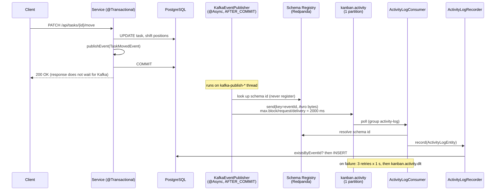

# 07 — Events and the activity feed

Every mutation on a board, column, task or subtask publishes a domain event to Kafka, and a consumer
in the same application turns each event into one row of a per-board activity log. This layer
matters because it is the project's only asynchronous, distributed path: it carries the
delivery-semantics, idempotency, schema-evolution and failure-isolation decisions that an
interviewer will ask about first.

**Read first:** [04 — Service layer and access control](04-service-layer-and-access-control.md)
(the `@Transactional` service methods that publish events and the ownership chain that the read
API reuses), [08 — Testing strategy](08-testing-strategy.md) (Testcontainers, the `kafka` tag,
`fastTest`).

**Main code:**

- Events: [`event/`](../../src/main/java/com/vrudenko/kanban_board/event/) (sealed
  [`ActivityEvent`](../../src/main/java/com/vrudenko/kanban_board/event/ActivityEvent.java) and 14
  records), [`event/avro/ActivityEventAvroMapper`](../../src/main/java/com/vrudenko/kanban_board/event/avro/ActivityEventAvroMapper.java),
  [`src/main/avro/*.avsc`](../../src/main/avro/)
- Producer: [`KafkaEventPublisher`](../../src/main/java/com/vrudenko/kanban_board/config/KafkaEventPublisher.java),
  [`AsyncConfig`](../../src/main/java/com/vrudenko/kanban_board/config/AsyncConfig.java),
  [`EventIdGenerator`](../../src/main/java/com/vrudenko/kanban_board/config/EventIdGenerator.java),
  [`KafkaTopics`](../../src/main/java/com/vrudenko/kanban_board/constant/KafkaTopics.java)
- Consumer: [`ActivityLogConsumer`](../../src/main/java/com/vrudenko/kanban_board/activitylog/ActivityLogConsumer.java),
  [`ActivityLogRecorder`](../../src/main/java/com/vrudenko/kanban_board/activitylog/ActivityLogRecorder.java),
  [`KafkaConsumerConfig`](../../src/main/java/com/vrudenko/kanban_board/config/KafkaConsumerConfig.java)
- Schema registry: [`AvroSchemaRegistrar`](../../src/main/java/com/vrudenko/kanban_board/config/AvroSchemaRegistrar.java),
  the `registerSchemas` and `rehearseHistoricalSchemas` tasks in [`build.gradle`](../../build.gradle#L631-L680)
- Storage and read API: [`V3__add_activity_log.sql`](../../src/main/resources/db/migration/V3__add_activity_log.sql),
  [`V6__change_activity_log_event_id_to_varchar.sql`](../../src/main/resources/db/migration/V6__change_activity_log_event_id_to_varchar.sql),
  [`ActivityLogEntity`](../../src/main/java/com/vrudenko/kanban_board/entity/ActivityLogEntity.java),
  [`ActivityLogService`](../../src/main/java/com/vrudenko/kanban_board/service/ActivityLogService.java),
  [`ActivityController`](../../src/main/java/com/vrudenko/kanban_board/controller/ActivityController.java)
- Configuration: the `kafka`, `kafka consumer` and `pagination` blocks of
  [`application.properties`](../../src/main/resources/application.properties#L252-L315) and
  [`application-test.properties`](../../src/main/resources/application-test.properties#L59-L106)

## Summary of decisions

| ID | Decision | Main reason |
|----|----------|-------------|
| EVT-01 | Build the activity feed as a Kafka event pipeline, not as a synchronous audit write | A real kanban feature that gives Kafka a legitimate reason to exist; decouples the write path from a slower, optional side effect |
| EVT-02 | Publish with `ApplicationEventPublisher` and one `@TransactionalEventListener(AFTER_COMMIT)` class | No event for a rolled-back transaction; no Kafka API calls inside domain services |
| EVT-03 | A mutation always succeeds at the HTTP level, even when Kafka is down; a failed send is logged | Recording history must never fail or slow the mutation that caused it (v1.1 D-01/D-02) |
| EVT-04 | Run the send `@Async` on a bounded pool (`kafkaPublishExecutor`, 2/4/200) | `KafkaTemplate.send()` blocks the caller in `waitOnMetadata`; this caused a 20–25 minute test-suite hang |
| EVT-05 | Bound producer timeouts: 2000 ms in production, 50 ms in the test profile | The 60 s `max.block.ms` default would turn a broker outage into a hang |
| EVT-06 | No transactional outbox; accept event loss | The activity log is supplementary; Postgres stays the system of record |
| EVT-07 | Events are a sealed interface of plain records; `boardId` is mandatory; no user-authored text | The consumer has no security context and cannot look anything up; text in events is a disclosure path |
| EVT-08 | Only the directly requested mutation publishes; cascaded child deletes publish nothing | A fan-out would reload every child (N+1) and flood a 200-slot queue |
| EVT-09 | Two explicit topics, `kanban.activity` and `kanban.activity.dlt`, 1 partition, 1 replica each | A typo fails loudly; one broker and one consumer get no gain from more partitions |
| EVT-10 | The record key is the `eventId`, not the `boardId` | Reason not recorded; with one partition, the key has no effect on placement |
| EVT-11 | An in-process `@KafkaListener` persists events into Postgres | A separate consumer service was explicitly deferred; reads come from Postgres, not from Kafka |
| EVT-12 | Idempotent consumer: `existsByEventId` fast path plus a unique-constraint backstop, no declarative transaction | Redelivery is normal under at-least-once; a duplicate must never reach the retry path |
| EVT-13 | Retry 3 times at 1 s, then dead-letter with the original bytes intact | A poison message must not block the feed, and the operator needs the exact bytes |
| EVT-14 | `activity_log` holds plain id columns (no foreign keys) and a JSON `detail` of ids only | A foreign key would turn a routine delete race into a poison message |
| EVT-15 | `eventId` changed from a random UUID to a RandFlake string (V6) | Index locality on the unique constraint; reuse of the one existing id generator |
| EVT-16 | Avro with a schema registry replaced JSON | Kafka enforces no schema; a rolling deploy could dead-letter valid messages |
| EVT-17 | Redpanda replaced `apache/kafka-native` as the broker | One container gives a Kafka-compatible broker and a Confluent-compatible registry |
| EVT-18 | One Avro schema per event type, subjects named by `RecordNameStrategy` | Mirrors the 1:1 Java records; each subject evolves independently on one topic |
| EVT-19 | BACKWARD compatibility, set explicitly on each subject before its first registration | Producer and consumer ship in one deployable, so FULL adds no protection |
| EVT-20 | The producer never registers schemas (`auto.register.schemas=false`) | A drifted producer fails loudly instead of creating an unreviewed schema version |
| EVT-21 | A registry outage follows the same policy as a broker outage | One resilience policy for the whole publish path (v1.2 Phase 4 D-01) |
| EVT-22 | A hand-written `ActivityEventAvroMapper`, not MapStruct | MapStruct cannot generate a mapper from a sealed interface over 14 record shapes |
| EVT-23 | Offset pagination with a forced total order (`createdAt` desc, `id` desc), size 20 by default, 100 maximum | First paginated endpoint; a caller sort must not break page stability |
| EVT-24 | Rehearse the Avro schemas against real `activity_log` rows before cutover | Avro is stricter than JSON; synthetic fixtures cannot find real field mismatches |

## The whole pipeline in one picture

The diagram shows one mutation, from the HTTP request to the row that the read API returns. The
numbers are the real configuration values.



The project also keeps rendered process-view diagrams in
[`docs/ARCHITECTURE.md` § Event-driven activity feed](../ARCHITECTURE.md#event-driven-activity-feed).

## Domain events

### What it is

A domain event is an immutable record that states a fact about a completed mutation, for example
"task X moved from column A to column B". The project has 14 event types. All of them implement
the sealed interface
[`ActivityEvent`](../../src/main/java/com/vrudenko/kanban_board/event/ActivityEvent.java#L19-L41).
A sealed interface lists every permitted implementation, so the compiler knows the complete set of
types.

| Resource | Events |
|----------|--------|
| Board | `BoardCreatedEvent`, `BoardUpdatedEvent`, `BoardDeletedEvent` |
| Column | `ColumnCreatedEvent`, `ColumnUpdatedEvent`, `ColumnDeletedEvent`, `ColumnReorderedEvent` |
| Task | `TaskCreatedEvent`, `TaskUpdatedEvent`, `TaskMovedEvent`, `TaskDeletedEvent` |
| Subtask | `SubtaskCreatedEvent`, `SubtaskUpdatedEvent`, `SubtaskDeletedEvent` |

The original epic specified 5 events. Quick task
[260811-s5e](../../.planning/quick/260811-s5e-expand-kafka-events-to-cover-all-mutatin/260811-s5e-SUMMARY.md)
added 8 more, and v1.2 Phase 6 added `ColumnDeletedEvent`. Before s5e, `SubtaskService` published
nothing. The theme-preference update is the only mutation without an event, because it has no
`boardId` ([`docs/ARCHITECTURE.md`](../ARCHITECTURE.md#event-driven-activity-feed)).

### How it works

Every event carries four common fields: `eventId`, `userId`, `boardId` and `timestamp`. Each type
adds only server-derived identifiers or derived state:

```java
public record TaskMovedEvent(
        String eventId,
        String userId,
        String boardId,
        String taskId,
        String sourceColumnId,
        String targetColumnId,
        Instant timestamp)
        implements ActivityEvent {}
```

([`TaskMovedEvent`](../../src/main/java/com/vrudenko/kanban_board/event/TaskMovedEvent.java).)
`ColumnReorderedEvent` carries two `int` positions and `SubtaskUpdatedEvent` carries an
`isCompleted` boolean. No event carries a board name, column name, task title, task description
or subtask title.

A service method publishes the event at its end, inside its transaction. For example,
[`TaskService.deleteById`](../../src/main/java/com/vrudenko/kanban_board/service/TaskService.java#L259-L280)
captures the ids into local variables before the delete runs, because after the delete nothing is
left to derive `boardId` from:

```java
var deletedTaskId = task.getId();
var deletedColumnId = task.getColumn().getId();
var deletedBoardId = task.getColumn().getBoard().getId();

subtaskService.deleteAllByTaskId(userId, taskId);
taskRepository.deleteById(task.getId());

eventPublisher.publishEvent(
        new TaskDeletedEvent(
                eventIdGenerator.generate(), userId, deletedBoardId,
                deletedColumnId, deletedTaskId, Instant.now()));
```

The `timestamp` is `Instant.now()` at the publish site, before the commit. `BoardService.save` is
the one exception: it reuses the board's own `createdAt`
([`BoardService.save`](../../src/main/java/com/vrudenko/kanban_board/service/BoardService.java#L191-L246)).

Cascaded deletes publish nothing. A board delete emits exactly one `BoardDeletedEvent`. The columns,
tasks and subtasks that the cascade removes emit no events of their own
([`ColumnService.deleteAllByBoardId` Javadoc](../../src/main/java/com/vrudenko/kanban_board/service/ColumnService.java#L48-L73)).
Account deletion therefore emits one `BoardDeletedEvent` per board.

### Why we chose it

- **EVT-07.** The consumer runs on a listener thread with no `SecurityContext` and never verifies
  ownership again. It trusts whatever the event carries. For this reason `boardId` is mandatory on
  every event, and the producer derives it
  ([`ActivityEvent` Javadoc](../../src/main/java/com/vrudenko/kanban_board/event/ActivityEvent.java#L5-L18);
  [02-RESEARCH.md](../../.planning/milestones/v1.1-phases/02-kafka-foundation-domain-events-move-endpoint/02-RESEARCH.md)).
  User-authored text is forbidden because `detail` goes back out through the read API. The s5e
  plan calls text in an event "an information-disclosure path, not a formatting choice" (threat
  T-S5E-01 in
  [260811-s5e-PLAN.md](../../.planning/quick/260811-s5e-expand-kafka-events-to-cover-all-mutatin/260811-s5e-PLAN.md)).
- The sealed interface makes a new event type a compile error in every exhaustive `switch` that
  handles it: the consumer, the Avro mapper and the test reconstructor. A forgotten type then
  fails the build instead of draining silently into the dead-letter topic
  ([03-01-PLAN.md, Decision A](../../.planning/milestones/v1.1-phases/03-activity-log-consumer-reliability-read-api/03-01-PLAN.md)).
- **EVT-08.** Fork D-D of the s5e plan chose option D1 (one event for the requested delete only).
  The cascade uses bulk JPQL deletes that never load children as entities. A per-child event would
  load every child only to publish it, which brings back the N+1 problem. A board with 7 columns ×
  7 tasks × 7 subtasks would emit about 400 events into a 200-slot queue from one request.

### Alternatives we rejected

- **A generic `Map<String,Object>` payload.** Rejected in the v1.1 "Out of Scope" table: it loses
  compile-time safety for no gain
  ([v1.1-REQUIREMENTS.md](../../.planning/milestones/v1.1-REQUIREMENTS.md)).
- **Separate "internal" and "wire" event classes.** Phase 2 research found no reason for two
  parallel hierarchies. One record serves as the Spring application event and, since Phase 4,
  maps 1:1 to one Avro record.
- **One `@KafkaHandler` method per type.** Rejected because a missing handler is a runtime failure
  that the error handler dead-letters, not a build failure (03-01-PLAN.md, Decision A).
- **Fan-out events for cascaded deletes (fork D-D option D2).** Rejected for the N+1 and queue
  reasons above.

### Trade-offs and limits

- After a board delete, the feed of that board keeps rows for children that no longer exist. The
  s5e plan accepts this as threat T-S5E-04.
- `TaskMovedEvent` carries no position. A reorder inside one column publishes "moved from column X
  to column X" with no position data. This is an open todo
  ([taskmovedevent-position-asymmetry](../../.planning/todos/pending/2026-08-11-taskmovedevent-position-asymmetry-not-fixed-in-s5e-fork-d-e.md)).
- The publish guarantee depends on an active transaction. `@TransactionalEventListener` silently
  skips an event when no transaction is active. For this reason `TaskService.save`,
  `BoardService.save` and the other `save` methods carry their own `@Transactional`, even though
  every caller already has one
  ([`TaskService.save` Javadoc](../../src/main/java/com/vrudenko/kanban_board/service/TaskService.java#L47-L58)).

### How we test it

[`ActivityEventPublicationTest`](../../src/test/java/com/vrudenko/kanban_board/event/ActivityEventPublicationTest.java)
records events with a real `@TransactionalEventListener(AFTER_COMMIT)` bean,
[`RecordingActivityEventListener`](../../src/test/java/com/vrudenko/kanban_board/support/listeners/RecordingActivityEventListener.java).
It has one nested class per publishing operation (for example
`AddTaskByColumnIdTest.shouldPublishTaskCreatedEvent_whenTaskCreated`) and a
`TransactionalSuppressionTest` group:

- `shouldPublishNothing_whenTaskUpdateRejectedByStaleVersion`
- `shouldPublishNothing_whenMutationNeverPersists`
- `shouldPublishNothing_whenPersistedWriteIsRolledBackByEnclosingTransaction`
- `shouldPublishTwoDistinctEvents_whenTwoMutationsShareOneCommit`
- `shouldRecordNonNullRequiredFields_forEveryPublishedEvent`

### Where this is recorded

- [02-CONTEXT.md](../../.planning/milestones/v1.1-phases/02-kafka-foundation-domain-events-move-endpoint/02-CONTEXT.md),
  [02-RESEARCH.md](../../.planning/milestones/v1.1-phases/02-kafka-foundation-domain-events-move-endpoint/02-RESEARCH.md)
- [260811-s5e-PLAN.md](../../.planning/quick/260811-s5e-expand-kafka-events-to-cover-all-mutatin/260811-s5e-PLAN.md)
  (forks D-A to D-E), commit `d078bf2`
- The epic spec: [01-kafka-activity-feed.md](../plans/backend-modernization/01-kafka-activity-feed.md)

## Publishing after commit

### What it is

A dual write is a single operation that writes to two systems (here, Postgres and Kafka) with no
shared transaction. It can produce a "ghost" event (Kafka has it, the database rolled back) or a
lost event (the database committed, Kafka never got it). The project removes ghosts completely and
accepts lost events.

### How it works

The services call Spring's `ApplicationEventPublisher.publishEvent(...)`. One class receives every
event type:

```java
@Async("kafkaPublishExecutor")
@TransactionalEventListener(phase = TransactionPhase.AFTER_COMMIT)
public void onActivityEvent(ActivityEvent event) {
    var unused =
            kafkaTemplate
                    .send(KafkaTopics.ACTIVITY,
                          event.eventId().toString(),
                          activityEventAvroMapper.toAvro(event))
                    .whenComplete((result, ex) -> {
                        if (ex != null) {
                            log.error("Failed to publish {} (eventId={}, boardId={}) to {}", ...);
                        }
                    });
}
```

([`KafkaEventPublisher.onActivityEvent`](../../src/main/java/com/vrudenko/kanban_board/config/KafkaEventPublisher.java#L46-L73).)
The sequence is:

1. The service method runs its writes and calls `publishEvent`. Spring holds the event.
2. The transaction commits. If it rolls back, Spring discards the event.
3. After the commit, Spring calls `onActivityEvent`. `@Async` moves the call to a
   `kafka-publish-*` thread, so the request thread returns the HTTP response at once.
4. The pool thread maps the event to Avro and sends it. A failed future is logged at `ERROR`.

The pool is a `ThreadPoolTaskExecutor` with a core size of 2, a maximum size of 4 and a queue of
200 ([`AsyncConfig.kafkaPublishExecutor`](../../src/main/java/com/vrudenko/kanban_board/config/AsyncConfig.java#L18-L27)).
The producer timeouts are 2000 ms in
[`application.properties`](../../src/main/resources/application.properties#L275-L277) and 50 ms in
[`application-test.properties`](../../src/main/resources/application-test.properties#L69-L71).

### Why we chose it

- **EVT-01.** The epic frames the feed as "a real kanban feature (Trello/Jira both have this),
  implemented as an event-driven side effect instead of a synchronous write". It also gives a
  prepared answer to "why does a kanban board need Kafka?": decoupling from a slower, optional side
  effect, replay and audit value, and a place to fan out later to notifications without touching
  `TaskService` again ([01-kafka-activity-feed.md](../plans/backend-modernization/01-kafka-activity-feed.md)).
- **EVT-02.** Phase 2 research confirmed that `@TransactionalEventListener(AFTER_COMMIT)` is the
  mechanism that satisfies D-01/D-02 "without a dual-write gap" for ghosts, and that the listener
  itself is where `KafkaTemplate.send()` lives, with "no separate relay/outbox component"
  ([02-RESEARCH.md](../../.planning/milestones/v1.1-phases/02-kafka-foundation-domain-events-move-endpoint/02-RESEARCH.md)).
  The services stay free of Kafka API calls. `KafkaEventPublisher` is the only class in `src/main`
  that touches the Kafka producer API.
- **EVT-03.** v1.1 Phase 2 decision D-01: "Task/Board/Column mutations always succeed at the HTTP
  level even if the Kafka broker is unreachable at publish time — the activity log falls behind,
  the primary write path is never blocked." D-02: a failed publish is logged, never swallowed
  ([02-CONTEXT.md](../../.planning/milestones/v1.1-phases/02-kafka-foundation-domain-events-move-endpoint/02-CONTEXT.md)).
  The context file marks D-01 as costly to reverse.
- **EVT-04.** `@Async` was not in the original plan. It is a fix, commit `40948c8`. Even with a
  bounded timeout, `KafkaTemplate.send()` blocks the calling thread inside
  `KafkaProducer.doSend -> waitOnMetadata` before it returns a future. The test fixture setup
  creates about 18 entities per test method across 17 fixture-heavy classes. With no broker in the
  test environment, this compounded into a 20–25 minute full-suite hang. After the fix, the suite
  took about 1 min 5 s
  ([02-02-SUMMARY.md](../../.planning/milestones/v1.1-phases/02-kafka-foundation-domain-events-move-endpoint/02-02-SUMMARY.md)).
- **EVT-05.** Kafka's default `max.block.ms` is 60000 ms. The test profile uses 50 ms because
  2000 ms still compounded into a 20+ minute hang, and ordinary tests verify publication at the
  Spring-event level, not through a real broker (comment in `application-test.properties`).

### Alternatives we rejected

- **A direct `KafkaTemplate.send()` in each service, inside the transaction.** This is the classic
  dual write. It can send an event for a transaction that later rolls back.
- **Rollback of the mutation when the publish fails.** D-01 rejects it: the side effect must not
  control the primary write.
- **A transactional outbox** (see the next topic).

### Trade-offs and limits

- The 2/4/200 pool sizes have no recorded measurement behind them. Reason not recorded.
- `ThreadPoolTaskExecutor` uses an abort policy by default. The s5e plan (threat T-S5E-03) notes
  that a full queue throws `TaskRejectedException` on the committing thread inside the after-commit
  phase. No test covers what the HTTP caller sees in that case.
- The `timestamp` is taken before the commit. The feed therefore orders rows by mutation time,
  not by commit time.

### How we test it

- [`ActivityEventPublicationTest.TransactionalSuppressionTest`](../../src/test/java/com/vrudenko/kanban_board/event/ActivityEventPublicationTest.java#L406-L571)
  proves "no ghost events" for three rejection and rollback shapes.
- [`SchemaRegistryOutageE2ETest`](../../src/test/java/com/vrudenko/kanban_board/activitylog/SchemaRegistryOutageE2ETest.java#L174)
  proves that a mutation returns and persists while the publish fails (see
  [Registry outage](#registry-outage-behavior)).
- No test stops the broker during a mutation. The broker-down path is exercised implicitly: every
  non-Kafka test class runs with no broker and a 50 ms bound, and those classes stay green.

### Where this is recorded

- [02-CONTEXT.md](../../.planning/milestones/v1.1-phases/02-kafka-foundation-domain-events-move-endpoint/02-CONTEXT.md)
  (D-01, D-02), [02-02-SUMMARY.md](../../.planning/milestones/v1.1-phases/02-kafka-foundation-domain-events-move-endpoint/02-02-SUMMARY.md)
  (the hang), commits `9109045`, `40948c8`
- [`docs/ARCHITECTURE.md`](../ARCHITECTURE.md#event-driven-activity-feed), "The request never
  waits on the broker"

## Delivery semantics and the missing outbox

### What it is

A delivery guarantee states how many times a message can arrive: at most once, at least once or
exactly once. A transactional outbox is a pattern that writes the event into a database table in
the same transaction as the mutation; a separate relay then copies the table to Kafka. The outbox
gives at-least-once publishing. This project does not have one.

### How it works

The guarantee differs on each side of the broker:

| Stage | Guarantee | Mechanism |
|-------|-----------|-----------|
| Service → broker | At most once, best effort | One after-commit send attempt; a failure is logged and the event is gone |
| Broker → consumer | At least once | Spring Kafka commits the offset after the listener returns; a crash before that causes redelivery |
| Consumer → `activity_log` | Effectively once | `ActivityLogRecorder` drops a duplicate `eventId` ([EVT-12](#idempotent-consumption)) |

An event is lost in these cases:

1. The process stops after the commit and before the send.
2. The broker stays unreachable for longer than `delivery.timeout.ms` (2000 ms).
3. The schema registry is unreachable, or it does not know the schema.
4. The `kafkaPublishExecutor` queue (200 slots) is full.

The project sets no `ack-mode`, so the default container behavior of Spring Kafka applies.

### Why we chose it

- **EVT-06.** The Phase 2 threat model accepts the loss (threat T-02-05, disposition "accept"):
  "the activity log is supplementary and Postgres remains the system of record, so a lost event is
  under-logging, not corruption. A transactional outbox is explicitly out of scope for this
  milestone" ([02-01-PLAN.md](../../.planning/milestones/v1.1-phases/02-kafka-foundation-domain-events-move-endpoint/02-01-PLAN.md)).

### Alternatives we rejected

- **Transactional outbox.** It closes the loss window but adds a table, a relay process and its
  own retry and cleanup logic. The project rejected it for scope, not for a technical fault.
- **Publish inside the transaction.** It trades a lost event for a ghost event. A ghost is worse
  here, because the feed would show a mutation that never happened.

### Trade-offs and limits

- A broker outage longer than 2 s leaves a permanent gap in the feed. Nothing replays it.
- The DLT has no replay tool. The v1.1 "Out of Scope" table excludes "DLT replay/reprocessing
  admin tooling".

### How we test it

No test proves the loss cases, because they are accepted behavior. The redelivery side is proven
by [`ActivityLogIdempotencyE2ETest`](#idempotent-consumption).

### Where this is recorded

[02-01-PLAN.md](../../.planning/milestones/v1.1-phases/02-kafka-foundation-domain-events-move-endpoint/02-01-PLAN.md)
threat T-02-05; [v1.1-REQUIREMENTS.md](../../.planning/milestones/v1.1-REQUIREMENTS.md) "Out of
Scope"; the epic's "Explanation to have afterward" section in
[01-kafka-activity-feed.md](../plans/backend-modernization/01-kafka-activity-feed.md).

## Topics, keys, partitions and ordering

### What it is

A Kafka topic is a named, append-only log. A partition is one ordered shard of a topic. Kafka
keeps order only inside one partition. The record key selects the partition.

### How it works

[`KafkaConsumerConfig`](../../src/main/java/com/vrudenko/kanban_board/config/KafkaConsumerConfig.java#L48-L62)
declares both topics as `NewTopic` beans, so Spring's `KafkaAdmin` creates them at startup:

```java
return TopicBuilder.name(KafkaTopics.ACTIVITY).partitions(1).replicas(1).build();
...
return TopicBuilder.name(KafkaTopics.ACTIVITY_DLT).partitions(1).replicas(1).build();
```

The names live in one class,
[`KafkaTopics`](../../src/main/java/com/vrudenko/kanban_board/constant/KafkaTopics.java). The
producer uses `event.eventId()` as the record key. The consumer group is `activity-log`, with
`auto-offset-reset=earliest`, so a new group reads events that were published before it first
joined.

The ordering facts are these:

- One partition and one consumer thread give strictly sequential consumption.
- The publish pool has up to 4 threads. Two events from close commits can therefore reach the
  broker in either order.
- The feed does not depend on broker order. The read API sorts by the event's own `timestamp`
  (stored as `created_at`), then by the row `id`.

### Why we chose it

- **EVT-09.** v1.1 Phase 3 D-07: explicit `NewTopic` beans, not broker auto-create, so "a typo'd
  topic name fails loudly … instead of silently auto-creating a stray topic with default
  settings". D-08: exactly 1 partition, "matching the actual topology (single-broker KRaft, single
  consumer instance, no parallelism benefit from more partitions)"
  ([03-CONTEXT.md](../../.planning/milestones/v1.1-phases/03-activity-log-consumer-reliability-read-api/03-CONTEXT.md)).
- **EVT-10.** Reason not recorded. The Phase 2 plan states that per-board ordering "is a Phase 3
  partition-key concern"
  ([02-01-PLAN.md](../../.planning/milestones/v1.1-phases/02-kafka-foundation-domain-events-move-endpoint/02-01-PLAN.md)).
  Phase 3 then chose one partition and did not change the key. With one partition, the key has no
  effect on placement.

### Alternatives we rejected

- **Broker auto-create** (rejected by D-07).
- **Several partitions** (rejected by D-08: no gain on one broker with one consumer).

### Trade-offs and limits

- If someone adds partitions, the `eventId` key spreads the events of one board across all
  partitions. Per-board order then disappears. A `boardId` key would be necessary first.
- One replica means no broker redundancy. The v1.2 requirements reject a multi-broker cluster on
  one VM (INFRA-V2-03 in [v1.2-REQUIREMENTS.md](../../.planning/milestones/v1.2-REQUIREMENTS.md)).
- Two events with the same millisecond sort by the row `id`. The consumer generates that id, so
  the tie order is the consume order, not the mutation order.

### How we test it

[`ActivityLogIdempotencyE2ETest`](../../src/test/java/com/vrudenko/kanban_board/activitylog/ActivityLogIdempotencyE2ETest.java)
relies on one partition as its "settle signal": a sentinel event that arrives after two copies
proves the consumer processed both copies.

### Where this is recorded

[03-CONTEXT.md](../../.planning/milestones/v1.1-phases/03-activity-log-consumer-reliability-read-api/03-CONTEXT.md)
D-07, D-08.

## The consumer

### What it is

[`ActivityLogConsumer`](../../src/main/java/com/vrudenko/kanban_board/activitylog/ActivityLogConsumer.java#L55-L81)
is a `@KafkaListener` in the same Spring Boot application. It receives the Avro `SpecificRecord`,
maps it back to an `ActivityEvent`, builds an `ActivityLogEntity`, and hands it to
`ActivityLogRecorder`.

### How it works

1. `ActivityEventAvroMapper.toDomain` turns the Avro record into the domain record.
2. `deriveActionAndDetailIds` switches exhaustively over the sealed type. It returns the
   `ActivityAction` enum value and a `LinkedHashMap` of ids.
3. Jackson writes the map as the `detail` JSON string, for example
   `{"taskId":"…","sourceColumnId":"…","targetColumnId":"…"}`.
4. The entity takes `boardId`, `userId`, `eventId` and `createdAt` from the event. `createdAt` is
   the event's `timestamp`, never a fresh clock reading.

The map is a `LinkedHashMap` on purpose. Its insertion order makes the `detail` string
byte-stable for identical input
([`ActionAndDetailIds` Javadoc](../../src/main/java/com/vrudenko/kanban_board/activitylog/ActivityLogConsumer.java#L172-L179)).
A serialization failure throws `IllegalStateException`, so the record goes to the retry path.

### Why we chose it

- **EVT-11.** A separate deployable consumer service is out of scope: "the in-process
  `@KafkaListener` already demonstrates the event-driven pattern"
  ([v1.1-REQUIREMENTS.md](../../.planning/milestones/v1.1-REQUIREMENTS.md)).
  The Phase 3 context records that the user discussed why the consumer persists into Postgres
  rather than serving reads from Kafka directly, and why an in-process consumer is not an
  anti-pattern at this scale. The file does not record the detailed arguments.
- v1.1 Phase 3 D-01 to D-03 fix the storage format: raw identifiers only, a fixed `action` enum,
  and one JSON `detail` column instead of many nullable id columns
  ([03-CONTEXT.md](../../.planning/milestones/v1.1-phases/03-activity-log-consumer-reliability-read-api/03-CONTEXT.md)).
  The consumer cannot resolve names, because it has no security context. Human-readable text
  ("Jane moved Task X to Done") is a frontend job.

### Alternatives we rejected

- **Pre-rendered sentences in `detail`.** D-01 marks a later switch as costly: every stored row
  would need a backfill.
- **One nullable column per possible id** (rejected by D-03: a wide, mostly-null table).

### Trade-offs and limits

- The consumer persists event fields with no validation that the ids still exist. No SASL or ACL
  restricts who can produce to `kanban.activity`. A client that reaches the broker can write rows
  into any board's feed. This is security finding F2, deferred as an infrastructure boundary
  problem ([consumer-trusts-unvalidated-event-fields](../../.planning/todos/pending/2026-08-10-kafka-activity-consumer-trusts-unvalidated-event-fields.md);
  [internal-kafka-hop-has-no-sasl-auth-or-tls](../../.planning/todos/pending/2026-08-20-internal-kafka-hop-has-no-sasl-auth-or-tls.md)).
  The compensating control is that the broker publishes no host port in production.

### How we test it

[`ActivityLogConsumerE2ETest`](../../src/test/java/com/vrudenko/kanban_board/activitylog/ActivityLogConsumerE2ETest.java)
publishes through a real Redpanda broker and asserts the persisted row. It covers 9 of the 14
types, for example:

- `shouldPersistExactlyOneRow_whenTaskMovedEventPublishedThroughRealBroker` (the epic's required
  end-to-end test, TEST-01)
- `shouldPersistTaskMoved_withTaskIdSourceColumnIdTargetColumnIdDetail`
- `shouldPersistColumnDeleted_withColumnIdDetailAndEventTimestamp`
- `shouldProduceIdenticalDetail_whenTwoTaskMovedEventsShareSameIds` (byte-stable `detail`)
- `shouldProduceTwoRows_whenTwoEventsShareSameBoardUserAndInstantButDifferentEventIds`

[`ActivityEventAvroMapperTest`](../../src/test/java/com/vrudenko/kanban_board/event/avro/ActivityEventAvroMapperTest.java)
round-trips all 14 types in memory.

### Where this is recorded

[03-CONTEXT.md](../../.planning/milestones/v1.1-phases/03-activity-log-consumer-reliability-read-api/03-CONTEXT.md),
[03-01-PLAN.md](../../.planning/milestones/v1.1-phases/03-activity-log-consumer-reliability-read-api/03-01-PLAN.md),
commit `f2c3063`.

## Idempotent consumption

### What it is

An idempotent consumer gives the same result when it processes the same message once or many
times. Under at-least-once delivery, redelivery is normal, so the consumer must drop duplicates.
The dedupe key is the `eventId`.

### How it works

[`ActivityLogRecorder.record`](../../src/main/java/com/vrudenko/kanban_board/activitylog/ActivityLogRecorder.java#L45-L62)
has two layers:

```java
public void record(ActivityLogEntity entry) {
    if (activityLogRepository.existsByEventId(entry.getEventId())) {
        return;                                      // fast path: sequential redelivery
    }
    try {
        activityLogRepository.saveAndFlush(entry);   // INSERT runs now, inside this call
    } catch (DataIntegrityViolationException e) {
        if (!activityLogRepository.existsByEventId(entry.getEventId())) {
            throw e;                                 // not a duplicate: NOT NULL etc.
        }
    }                                                // duplicate race: absorb
}
```

1. The fast path runs `SELECT … WHERE event_id = ?` and returns when a row exists. It throws no
   exception in the common redelivery case.
2. The backstop is the database constraint `uk_activity_log_event_id`. Two concurrent inserts of
   one `eventId` cannot both succeed.
3. The catch block checks the row again. It absorbs the exception only if the row now exists.
   Any other integrity violation escapes to the retry and dead-letter path.

The method has no `@Transactional`. `saveAndFlush` runs in the repository's own transaction.

### Why we chose it

- **EVT-12.** v1.1 Phase 3 D-05: a duplicate `eventId` "MUST be caught inside the consumer as a
  silent no-op". Otherwise every redelivered duplicate exhausts 3 retries and lands on the DLT,
  which pollutes it with non-poison traffic
  ([03-CONTEXT.md](../../.planning/milestones/v1.1-phases/03-activity-log-consumer-reliability-read-api/03-CONTEXT.md)).
- The missing `@Transactional` is the core detail. A constraint violation marks the surrounding
  transaction rollback-only. If the method catches the exception inside a declarative transaction
  and returns normally, the commit at method exit throws, and the duplicate escapes anyway. Without
  the annotation, only the repository call's own transaction rolls back
  ([03-01-PLAN.md, Decision B](../../.planning/milestones/v1.1-phases/03-activity-log-consumer-reliability-read-api/03-01-PLAN.md)).
- The re-check in the catch block is a reversed decision. The first version absorbed every
  `DataIntegrityViolationException`. Code review finding CR-01 showed that this also dropped a
  `NOT NULL` violation from a malformed event, which is a real failure. Commit `fe2fcf2` added the
  re-check ([03-REVIEW.md](../../.planning/milestones/v1.1-phases/03-activity-log-consumer-reliability-read-api/03-REVIEW.md)).
- The row has its own `BaseEntity` id, and `eventId` is a separate unique column. The Phase 3
  research left the choice open and the plan resolved it this way. `eventId` is a business key,
  not the row identity ([`ActivityLogEntity` Javadoc](../../src/main/java/com/vrudenko/kanban_board/entity/ActivityLogEntity.java#L17-L43)).

### Alternatives we rejected

From [03-01-PLAN.md, Decision B](../../.planning/milestones/v1.1-phases/03-activity-log-consumer-reliability-read-api/03-01-PLAN.md):

| Approach | Why rejected |
|----------|--------------|
| `@Transactional` on `record()`, catch inside it | Broken: the commit throws, the duplicate reaches the DLT |
| Exists-check only, no unique constraint | A check-then-insert race writes two rows |
| Unique constraint only, catch on every insert | Throws an exception on every redelivery; contradicts the locked ACTLOG-03 wording |

### Trade-offs and limits

- The fast path costs one extra `SELECT` per event.
- The dedupe is only as strong as `eventId` uniqueness. `RandFlakeGenerator` documents its ids as
  unique per JVM. Two application instances could in theory produce the same `eventId`, and the
  consumer would then drop a real event. Today there is one instance.

### How we test it

[`ActivityLogIdempotencyE2ETest`](../../src/test/java/com/vrudenko/kanban_board/activitylog/ActivityLogIdempotencyE2ETest.java):

- `RedeliveryTest.shouldPersistExactlyOneRow_whenEventRedeliveredThroughRealBroker` publishes one
  event twice through the real broker.
- `RedeliveryTest.shouldLeaveDeadLetterTopicEmpty_whenEventIsRedeliveredNotPoison` proves D-05.
- [`ConcurrentRecordTest.shouldPersistExactlyOneRow_whenTwoThreadsRecordSameEventIdConcurrently`](../../src/test/java/com/vrudenko/kanban_board/activitylog/ActivityLogIdempotencyE2ETest.java#L204)
  calls the recorder from two threads behind a `CountDownLatch`. It bypasses the broker because
  one partition makes broker delivery sequential, so only direct calls can open the race window.
- `FreshEventTest.shouldInsertRow_whenEventIdIsNeverSeenBefore`.

### Where this is recorded

[03-CONTEXT.md](../../.planning/milestones/v1.1-phases/03-activity-log-consumer-reliability-read-api/03-CONTEXT.md)
D-05, [03-01-PLAN.md](../../.planning/milestones/v1.1-phases/03-activity-log-consumer-reliability-read-api/03-01-PLAN.md),
[03-REVIEW.md](../../.planning/milestones/v1.1-phases/03-activity-log-consumer-reliability-read-api/03-REVIEW.md)
CR-01, [`docs/ARCHITECTURE.md`](../ARCHITECTURE.md#event-driven-activity-feed) "Redelivery is
absorbed, not retried".

## Retries and the dead-letter topic

### What it is

A poison message is a record that fails every time, for example bytes that cannot be decoded. A
dead-letter topic (DLT) is a separate topic that receives such records, so the consumer can move
past them. Here the DLT is `kanban.activity.dlt`.

### How it works

[`KafkaConsumerConfig.activityErrorHandler`](../../src/main/java/com/vrudenko/kanban_board/config/KafkaConsumerConfig.java#L170-L203)
builds a `DefaultErrorHandler` with `FixedBackOff(1000L, 3L)`: one first attempt, then 3 retries
at 1 s intervals. After that, a `DeadLetterPublishingRecoverer` writes the record to partition 0 of
the DLT and logs one `ERROR` line with the source topic, partition, offset and cause. Spring Boot
attaches the single `CommonErrorHandler` bean to the default listener container factory.

Three details make this work:

1. **`ErrorHandlingDeserializer`** wraps the key and value deserializers
   ([`application.properties`](../../src/main/resources/application.properties#L283-L293)).
   Without it, a decode failure throws inside the poll loop before any error handler sees the
   record. The container cannot move past the offset, and the partition stalls forever.
2. **A separate, byte-preserving DLT template.** A failed decode leaves the raw `byte[]` as the
   record value. The normal template would JSON-encode it as base64, which destroys the bytes that
   an operator must inspect. `deadLetterKafkaTemplate` uses a `DelegatingByTypeSerializer` that
   sends `byte[]` through `ByteArraySerializer`.
3. **Two bean-wiring fixes**, both found only by live Testcontainers runs:
   - The delegate map is a `LinkedHashMap`, not a `HashMap`. The serializer picks the first key
     that is assignable from the value class. `Object.class` matches `byte[]` too, so hash order
     could route the bytes through `JsonSerializer`.
   - The error handler parameter carries `@Qualifier("deadLetterKafkaTemplate")`. With a
     `@Primary` template present, Spring resolves `@Primary` before it matches the parameter
     name, so the unqualified parameter received the wrong template.

A third wiring trap is also recorded: any `KafkaTemplate` bean disables Spring Boot's
auto-configured one, because its `@ConditionalOnMissingBean` ignores generic types. The class
therefore declares an explicit `@Primary` `kafkaTemplate`
([`KafkaConsumerConfig.kafkaTemplate` Javadoc](../../src/main/java/com/vrudenko/kanban_board/config/KafkaConsumerConfig.java#L64-L84)).

### Why we chose it

- **EVT-13.** v1.1 Phase 3 D-04: "retries a failing message 3 times with a short fixed backoff
  (~1s …) before routing it to the dead-letter topic"
  ([03-CONTEXT.md](../../.planning/milestones/v1.1-phases/03-activity-log-consumer-reliability-read-api/03-CONTEXT.md)).
  The research table "Don't Hand-Roll" chose `DefaultErrorHandler` because it already handles
  non-retryable exception types and offset headers that a custom loop would miss
  ([03-RESEARCH.md](../../.planning/milestones/v1.1-phases/03-activity-log-consumer-reliability-read-api/03-RESEARCH.md)).
- D-06: the poison test uses genuinely unparseable bytes, not a test-only failure hook.
- After the Avro change, the DLT path stayed untouched on purpose. An Avro-aware recoverer would
  try to encode a payload that just failed to decode, throw inside the recovery path, and destroy
  the audit trail ([`ActivityLogAvroDeadLetterE2ETest` Javadoc](../../src/test/java/com/vrudenko/kanban_board/activitylog/ActivityLogAvroDeadLetterE2ETest.java#L34-L55)).

### Alternatives we rejected

- **A custom try/catch and manual re-publish inside the listener** (rejected in 03-RESEARCH.md
  "Don't Hand-Roll").
- **A rigged failure hook for the test** (rejected by D-06).

### Trade-offs and limits

- A failure caused by a down database also exhausts the retries in about 3 s and goes to the DLT.
  Nothing replays DLT records.
- Only one `ERROR` log line signals a dead-lettering. No metric or alert exists for it.

### How we test it

- [`ActivityLogDeadLetterE2ETest`](../../src/test/java/com/vrudenko/kanban_board/activitylog/ActivityLogDeadLetterE2ETest.java):
  `shouldRouteMalformedPayloadToDeadLetterTopic_whenPayloadIsUnparseableJson`,
  `shouldPreserveOriginalBytes_whenMalformedPayloadIsDeadLettered` (compares raw arrays, never
  decoded strings), `shouldStillPersistEvent_whenPublishedAfterMalformedPayload`, and
  `shouldNotPersistOrStall_whenTombstoneRecordIsPublished` (a null value with a key).
- [`ActivityLogAvroDeadLetterE2ETest`](../../src/test/java/com/vrudenko/kanban_board/activitylog/ActivityLogAvroDeadLetterE2ETest.java):
  `shouldDeadLetterWithByteFidelity_whenPayloadHasNoValidMagicByte` (fails at framing),
  `shouldDeadLetterWithByteFidelity_whenPayloadIsFramedButSchemaIdIsUnregistered` (valid Confluent
  framing, unknown schema id: a case that JSON could not produce), and
  `shouldStillPersistEvent_whenPublishedAfterRegistryAwarePoisonMessage`.

### Where this is recorded

[03-CONTEXT.md](../../.planning/milestones/v1.1-phases/03-activity-log-consumer-reliability-read-api/03-CONTEXT.md)
D-04, D-06; [03-01-PLAN.md](../../.planning/milestones/v1.1-phases/03-activity-log-consumer-reliability-read-api/03-01-PLAN.md)
"Non-obvious trade-offs"; commit `a317dd8` (the two wiring bugs); SCHEMA-05 in
[v1.2-REQUIREMENTS.md](../../.planning/milestones/v1.2-REQUIREMENTS.md).

## The `activity_log` table

### What it is

`activity_log` is an insert-only table. The consumer writes each row once and nothing updates it.

### How it works

[`V3__add_activity_log.sql`](../../src/main/resources/db/migration/V3__add_activity_log.sql)
creates it:

```sql
CREATE TABLE activity_log (
    id varchar(255) PRIMARY KEY,
    board_id varchar(255) NOT NULL,
    user_id varchar(255) NOT NULL,
    action varchar(255) NOT NULL,
    detail varchar(2000) NOT NULL,
    event_id uuid NOT NULL CONSTRAINT uk_activity_log_event_id UNIQUE,
    created_at timestamp(6) with time zone NOT NULL
);
CREATE INDEX idx_activity_log_board_created_id
    ON activity_log (board_id, created_at DESC, id DESC);
```

[`V6__change_activity_log_event_id_to_varchar.sql`](../../src/main/resources/db/migration/V6__change_activity_log_event_id_to_varchar.sql)
changes `event_id` to `varchar(255)`. PostgreSQL cannot change the type while the unique
constraint depends on the column, so the migration drops the constraint, runs
`ALTER COLUMN … TYPE varchar(255) USING event_id::varchar(255)`, and adds the constraint again
under the same name. Old rows keep their UUID text. New rows hold a Base36 RandFlake string.

The entity has no `@Version`, because rows never change. The table was first applied by hand from
a DDL script; V3 now reproduces it through Flyway.

### Why we chose it

- **EVT-14.** `board_id` and `user_id` are plain columns, not foreign keys. "A foreign key would
  make persistence fail whenever the referenced board or user has already been deleted, turning a
  routine race into a poison message"
  ([`ActivityLogEntity` Javadoc](../../src/main/java/com/vrudenko/kanban_board/entity/ActivityLogEntity.java#L17-L43)).
- The index matches the read query exactly, so a page read is an index scan, not a sort of the
  whole board history. The V3 comment says this matters because the table has no retention policy.
- **EVT-15.** GAP-07 in v1.2 Phase 6: a random UUID "costs index locality on the eventId unique
  constraint and gives no free ordering signal for debugging/tracing event sequences"
  ([use-snowflake-id-generator todo](../../.planning/todos/completed/2026-08-02-use-snowflake-id-generator-for-activity-log-events.md)).
  The fix reuses the existing `RandFlakeGenerator` through a thin injectable wrapper,
  [`EventIdGenerator`](../../src/main/java/com/vrudenko/kanban_board/config/EventIdGenerator.java).
  `RandFlakeGenerator` is a Hibernate `IdentifierGenerator`, so Spring cannot inject it directly.
  The change is one-way and changed the JSON type of `eventId` on a shipped endpoint. The blast
  radius was zero because no frontend used it
  ([06-07-SUMMARY.md](../../.planning/milestones/v1.2-phases/06-mock-up-feature-gap-closure/06-07-SUMMARY.md)).

### Alternatives we rejected

- **`eventId` as the primary key.** Left open by the Phase 3 context; the plan kept the
  `BaseEntity` id convention of every other entity.
- **A second id algorithm for events.** The `EventIdGenerator` Javadoc calls a second
  implementation "a defect, not an acceptable alternative".
- **Keep UUIDs.** Rejected for the locality reason above.

### Trade-offs and limits

- The table grows without limit. s5e made it grow faster, because subtask toggles now publish
  events ([unbounded-activity-log-growth todo](../../.planning/todos/pending/2026-08-11-unbounded-activity-log-growth-rate-materially-accelerated-by-s.md)).
  Reads stay fast; storage does not.
- A board delete or an account delete leaves the rows in place. Only the nonprod reset endpoint
  removes rows, with the bulk JPQL
  [`ActivityLogRepository.deleteAllByUserIdIn`](../../src/main/java/com/vrudenko/kanban_board/repository/ActivityLogRepository.java#L30-L37).
- `event_id` holds two shapes (UUID text and Base36). This is harmless because the code compares
  it for equality only and never parses it.

### How we test it

- [`FlywaySchemaProvenanceTest`](../../src/test/java/com/vrudenko/kanban_board/config/FlywaySchemaProvenanceTest.java)
  reads the live catalog: the column type is character, not `uuid`, and the constraint survives.
- [`EventIdGeneratorTest`](../../src/test/java/com/vrudenko/kanban_board/config/EventIdGeneratorTest.java):
  `shouldReturnDistinctValues_whenCalledManyTimesRapidly`,
  `shouldSortBeforeSecondId_whenGeneratedBackToBackWithNoClockWait`.
- [`ActivityLogCleanupIsolationTest`](../../src/test/java/com/vrudenko/kanban_board/activitylog/ActivityLogCleanupIsolationTest.java)
  is a tripwire. Rows have no foreign key to a user, so they survive user cleanup in a long-lived
  test container. Two identical methods (`shouldSeeNoProbeRow_whenFirstMethodRuns`,
  `shouldSeeNoProbeRow_whenSecondMethodRuns`) turn red if `AbstractAppTest.cleanup()` stops
  deleting `activity_log` rows.

### Where this is recorded

[03-CONTEXT.md](../../.planning/milestones/v1.1-phases/03-activity-log-consumer-reliability-read-api/03-CONTEXT.md),
[06-07-SUMMARY.md](../../.planning/milestones/v1.2-phases/06-mock-up-feature-gap-closure/06-07-SUMMARY.md),
commit `11fb2ad`, [`docs/ARCHITECTURE.md`](../ARCHITECTURE.md#event-driven-activity-feed)
"`eventId` is a time-ordered string, not a random UUID".

## Avro and the schema registry

### What it is

Avro is a binary serialization format with a schema. A schema registry is a service that stores
versioned schemas under "subjects" and rejects a new version that breaks the configured
compatibility rule. The Confluent wire format puts 1 magic byte (`0`) and a 4-byte schema id in
front of the Avro bytes. The consumer uses the id to fetch the writer's schema.

### How it works

- 14 `.avsc` files in [`src/main/avro/`](../../src/main/avro/) are the source of truth. The Gradle
  plugin `com.github.davidmc24.gradle.plugin.avro` 1.9.1 generates `SpecificRecord` classes from
  them. Every field is required. `timestamp` uses the `timestamp-millis` logical type and
  generates an `Instant` accessor.
- [`ActivityEventAvroMapper`](../../src/main/java/com/vrudenko/kanban_board/event/avro/ActivityEventAvroMapper.java#L54-L289)
  converts in both directions. `toAvro` is an exhaustive switch with no `default`. `toDomain`
  needs a `default` arm that throws, because `SpecificRecord` is not sealed.
- The producer uses `KafkaAvroSerializer` with `auto.register.schemas=false` and
  `RecordNameStrategy`. The consumer uses `KafkaAvroDeserializer` (inside
  `ErrorHandlingDeserializer`) with `specific.avro.reader=true` and the same strategy
  ([`application.properties`](../../src/main/resources/application.properties#L255-L297)).
- [`AvroSchemaRegistrar.registerAll`](../../src/main/java/com/vrudenko/kanban_board/config/AvroSchemaRegistrar.java#L90-L118)
  is the only writer of schemas. For each subject, it sets `BACKWARD` first and then registers the
  schema. If the registry refuses a compatibility write for an empty subject, it registers first
  and then sets the mode. It derives the schema from `getClassSchema()` of the generated class and
  the subject from `schema.getFullName()`.
- Three callers run the registrar: the `registerSchemas` Gradle task, the static initializer of
  the test harness `AbstractKafkaContainerTest`, and the CI jobs
  `register-schemas-production`/nonprod in
  [`deploy.yml`](../../.github/workflows/deploy.yml#L530-L580), which run after the deploy.

### Why we chose it

- **EVT-16.** SEED-001: "vanilla Apache Kafka enforces no schema at all". A field rename during a
  rolling deploy, with old-shape messages still unconsumed, "can dead-letter valid (non-poison)
  messages", and a second consumer would make convention-based JSON agreement insufficient
  ([SEED-001](../../.planning/seeds/SEED-001-add-a-confluent-schema-registry-avro-protobuf-in-front-of-th.md)).
  Protobuf was "a legitimate alternative, not a wrong choice, but Avro is the pragmatic default
  given Confluent/Redpanda's Avro-first tooling maturity"
  ([v1.2-REQUIREMENTS.md](../../.planning/milestones/v1.2-REQUIREMENTS.md) "Out of Scope").
- **EVT-18.** v1.2 Phase 4 D-03: one schema per event type, 1:1 with the Java records; a new type
  is one new file. The default `TopicNameStrategy` (subject = topic name) would force all types
  into one subject, so the research chose `RecordNameStrategy`. `TopicRecordNameStrategy` was
  rejected as flexibility with no current payoff, because there is only one topic
  ([04-RESEARCH.md](../../.planning/milestones/v1.2-phases/04-schema-registry/04-RESEARCH.md)).
- **EVT-19.** D-02: BACKWARD, set explicitly. Producer and consumer "live in the same deployable
  and always ship together in one merge", so FULL's extra strictness protects nothing
  ([04-CONTEXT.md](../../.planning/milestones/v1.2-phases/04-schema-registry/04-CONTEXT.md)).
  The registrar sets the mode before the first registration, so no first version is ever
  ungoverned.
- **EVT-20.** SCHEMA-01: "a producer with a drifted schema fails loudly instead of silently
  creating a new version" ([`AvroSchemaRegistrar` Javadoc](../../src/main/java/com/vrudenko/kanban_board/config/AvroSchemaRegistrar.java#L28-L50)).
  Deriving the schema from the generated class makes it impossible to register a schema that
  differs from what the producer encodes.
- **EVT-22.** MapStruct generates a mapper from one concrete source type to one concrete target
  type. It cannot dispatch over a sealed interface with 14 record shapes. The mapper Javadoc says:
  "Do not 'fix' this class into a `@Mapper` interface — it is not possible"
  ([`ActivityEventAvroMapper` Javadoc](../../src/main/java/com/vrudenko/kanban_board/event/avro/ActivityEventAvroMapper.java#L21-L43)).
- The JSON-era properties `spring.json.trusted.packages` and `spring.json.use.type.headers` were
  deleted. The Avro specific reader instantiates only the generated class that the schema id
  names, so the gadget allowlist has nothing left to guard.

### Alternatives we rejected

| Alternative | Why rejected | Source |
|-------------|--------------|--------|
| Keep JSON | No schema enforcement | SEED-001 |
| Protobuf | Valid, but Avro tooling is more mature on Confluent/Redpanda | v1.2-REQUIREMENTS.md |
| One union schema for all types | A change to one type touches the shared file; collapsing later is itself a risky change | 04-DISCUSSION-LOG.md |
| FULL compatibility | Rejects safe changes; no independent deploy order to protect | 04-DISCUSSION-LOG.md |
| Producer auto-registration | Silently creates unreviewed versions | AvroSchemaRegistrar Javadoc |
| Long-lived dual-format (JSON + Avro) topics | Overkill for one producer and one consumer in one deploy unit | v1.2-REQUIREMENTS.md |
| Generic pluggable envelope | Loses compile-time safety | v1.2-REQUIREMENTS.md |

### Trade-offs and limits

- **BACKWARD is not transitive.** It checks a new version only against the previous one. Two legal
  steps (drop field `b: int`, then add `b: string` with a default) give a version that cannot read
  version 1. D-02's second reason ("replayed from the beginning") therefore does not hold. Only
  BACKWARD_TRANSITIVE delivers it. This is an open todo
  ([d-02-backward-non-transitive-vs-replay-from-zero](../../.planning/todos/pending/2026-08-06-d-02-backward-non-transitive-vs-replay-from-zero.md)).
- `timestamp-millis` truncates to milliseconds. Tests compare `timestamp` with a 1 ms tolerance.
- The pre-merge compatibility check in CI (SCHEMA-V2-01) is deferred. A breaking schema is found
  only at registration, after the deploy.
- Only one subject has ever evolved: `eventId` dropped its `uuid` logical type in GAP-07. The
  GAP-07 work seeded a registry with the old schemas and confirmed that BACKWARD accepted the new
  versions, instead of assuming it
  ([06-07-SUMMARY.md](../../.planning/milestones/v1.2-phases/06-mock-up-feature-gap-closure/06-07-SUMMARY.md)).

### How we test it

- [`ActivityLogAvroRoundTripE2ETest`](../../src/test/java/com/vrudenko/kanban_board/activitylog/ActivityLogAvroRoundTripE2ETest.java):
  `FullRoundTripTest.shouldPersistMatchingActivityLogRow_whenTaskMovedEventPublishedThroughRealAvroPipeline`,
  and `WireFormatTest.shouldEncodeAsGenuineAvro_whenTaskMovedEventPublishedThroughRealPipeline`,
  which reads the raw bytes and asserts magic byte `0` and a positive schema id. A JSON payload
  starts with `{` (`0x7B`), so this proves the cutover.
- [`SchemaCompatibilityE2ETest`](../../src/test/java/com/vrudenko/kanban_board/activitylog/SchemaCompatibilityE2ETest.java):
  `ConfiguredCompatibilityTest.shouldReportBackwardExplicitly_forAllProductionSubjects` (all 14
  subjects, at subject level, not the global default), and
  `EnforcementTest.shouldRejectIncompatibleEvolution_andAcceptCompatibleEvolution_underBackward`.
  A new required field without a default gets HTTP 409; a new field with a default is accepted.
  The accepted case is the control that separates "enforced" from "registration is broken".
- [`ActivityEventAvroMapperTest`](../../src/test/java/com/vrudenko/kanban_board/event/avro/ActivityEventAvroMapperTest.java):
  14 `RoundTripTest` cases and `ToDomainTest.shouldThrow_whenRecordTypeIsUnrecognised`.

### Where this is recorded

[04-CONTEXT.md](../../.planning/milestones/v1.2-phases/04-schema-registry/04-CONTEXT.md),
[04-DISCUSSION-LOG.md](../../.planning/milestones/v1.2-phases/04-schema-registry/04-DISCUSSION-LOG.md),
[04-RESEARCH.md](../../.planning/milestones/v1.2-phases/04-schema-registry/04-RESEARCH.md),
[04-VERIFICATION.md](../../.planning/milestones/v1.2-phases/04-schema-registry/04-VERIFICATION.md),
commit `71ff6e3`; [`docs/ARCHITECTURE.md` § Schema governance](../ARCHITECTURE.md#schema-governance).

## Redpanda as the broker

### What it is

Redpanda is a Kafka-protocol-compatible broker written in C++. It ships a built-in schema registry
with a Confluent-compatible REST API. The project runs `docker.redpanda.com/redpandadata/redpanda:v26.2.1`
in local development ([`docker-compose.yml`](../../docker-compose.yml#L19-L40)), in tests
(Testcontainers `RedpandaContainer`), in production and in nonprod.

### How it works

The local compose service opens a Kafka listener on 9092 for the host, 19092 for the app
container, and the registry on 8081. The app reads `KAFKA_BOOTSTRAP_SERVERS` and
`SCHEMA_REGISTRY_URL`. The application code has no Redpanda-specific code: it uses the Kafka client
and the Confluent serializers only.

### Why we chose it

- **EVT-17.** This is a reversed decision. v1.1 used `apache/kafka-native:4.3.1` (a KRaft,
  GraalVM-native image with no JVM, which forced a TCP `/dev/tcp` healthcheck). Phase 4 needed a
  registry. The research chose one Redpanda container for broker and registry over a standalone
  `confluentinc/cp-schema-registry` container: a second container adds wiring "for zero benefit",
  and production would then run a different registry implementation than the one tested
  ([04-RESEARCH.md](../../.planning/milestones/v1.2-phases/04-schema-registry/04-RESEARCH.md)).
  The v1.2 requirements also reject a separate Confluent registry because it would be "a second
  service on an already resource-constrained VM"
  ([v1.2-REQUIREMENTS.md](../../.planning/milestones/v1.2-REQUIREMENTS.md)).
- The shared test harness moved to Redpanda in place, instead of a second Avro-only harness. The
  three older E2E classes passed unchanged because Redpanda is a protocol superset of what they
  used ([`AbstractKafkaContainerTest` Javadoc](../../src/test/java/com/vrudenko/kanban_board/support/containers/AbstractKafkaContainerTest.java#L22-L33)).
- Nonprod runs a second Redpanda instance, not prefixed topics on the production broker. Under
  `RecordNameStrategy`, subjects are keyed by class name, so a shared registry would let a nonprod
  schema test change production's compatibility history
  ([PROJECT.md key decisions](../../.planning/PROJECT.md)).

### Alternatives we rejected

- **`apache/kafka-native` plus a Confluent registry container** (two containers, a different
  registry than production).
- **Topic prefixing for nonprod** (shared registry, see above).

### Trade-offs and limits

- Redpanda's registry is an independent implementation. The research names two narrow parity gaps
  (Protobuf map fields, redundant Avro namespace tags). Neither applies here, and the round-trip
  tests cover the namespace case.
- Memory sizing for Redpanda in production is an infrastructure topic. See the infrastructure
  chapter and [`docs/INFRA_RUNBOOK.md`](../INFRA_RUNBOOK.md).

### How we test it

Every `kafka`-tagged class extends
[`AbstractKafkaContainerTest`](../../src/test/java/com/vrudenko/kanban_board/support/containers/AbstractKafkaContainerTest.java).
It starts one container in a static initializer and registers all 14 schemas there. The Javadoc
explains why the JUnit `@Container` singleton did not hold across sibling classes on Windows with
Docker Desktop: Spring kept beans bound to a stale port. See
[08 — Testing strategy](08-testing-strategy.md) for the harness in detail.

### Where this is recorded

[04-RESEARCH.md](../../.planning/milestones/v1.2-phases/04-schema-registry/04-RESEARCH.md),
[02-RESEARCH.md](../../.planning/milestones/v1.1-phases/02-kafka-foundation-domain-events-move-endpoint/02-RESEARCH.md)
(the old image), commit `4e2ca38` (compose change to Redpanda).

## Registry outage behavior

### What it is

The registry is a second runtime dependency of the publish path. If it is down, the serializer
cannot find the schema id.

### How it works

- **EVT-21.** v1.2 Phase 4 D-01 extends the broker-down policy: the HTTP mutation always succeeds,
  the failure is logged, and the caller is never blocked
  ([04-CONTEXT.md](../../.planning/milestones/v1.2-phases/04-schema-registry/04-CONTEXT.md)). The
  user chose one policy for the whole publish path over "treat schema rejection differently"
  ([04-DISCUSSION-LOG.md](../../.planning/milestones/v1.2-phases/04-schema-registry/04-DISCUSSION-LOG.md)).
- The actual mechanism differs from the one that the `KafkaEventPublisher` Javadoc describes. The
  registry lookup happens inside serialization, which `KafkaProducer.doSend` runs synchronously on
  the calling thread. `KafkaTemplate.send()` therefore throws `SerializationException` directly,
  and the `whenComplete` callback never runs. Spring's default `SimpleAsyncUncaughtExceptionHandler`
  catches the throw at the `@Async` boundary and logs it at `ERROR`, but without the `eventId` or
  `boardId` ([`SchemaRegistryOutageE2ETest` Javadoc](../../src/test/java/com/vrudenko/kanban_board/activitylog/SchemaRegistryOutageE2ETest.java#L36-L94);
  [04-VERIFICATION.md](../../.planning/milestones/v1.2-phases/04-schema-registry/04-VERIFICATION.md)
  row 7).
- The Confluent registry client has its own retries and timeouts, separate from the producer
  bounds. The test profile sets `max.retries=0`, `retries.wait.ms=0` and 50 ms HTTP timeouts. With
  the defaults, the full suite took 232 s against a 208 s baseline, an 11 % regression
  ([`application-test.properties`](../../src/main/resources/application-test.properties#L72-L89)).
  The production profile does not override these client defaults.

### Trade-offs and limits

- The two failure paths log differently. Only the broker-side path names the event.
- A registry outage in production can hold a `kafka-publish-*` thread for the registry client's
  default retry and timeout budget. No measurement of that budget in production exists.

### How we test it

[`SchemaRegistryOutageE2ETest.shouldReturnAndPersist_butNeverPublish_whenSchemaRegistryIsUnreachable`](../../src/test/java/com/vrudenko/kanban_board/activitylog/SchemaRegistryOutageE2ETest.java#L174)
points only the producer at port 1 (connection refused) while the broker stays up. It asserts:
the call returns without an exception, the board row exists, no `activity_log` row appears after
a wait, and an `ERROR` log line names `onActivityEvent`. The registry-down, broker-up asymmetry is
the point of the test: with both down, it would only repeat the v1.1 broker-down proof.

### Where this is recorded

[04-CONTEXT.md](../../.planning/milestones/v1.2-phases/04-schema-registry/04-CONTEXT.md) D-01,
[04-VERIFICATION.md](../../.planning/milestones/v1.2-phases/04-schema-registry/04-VERIFICATION.md)
"Findings Worth Human Awareness".

## Historical schema rehearsal

### What it is

A rehearsal runs the new Avro schemas against real stored data before the cutover. Avro rejects a
missing required field where JSON accepted anything, so real data can break a schema that passes
every synthetic test.

### How it works

[`HistoricalSchemaRehearsalE2ETest`](../../src/test/java/com/vrudenko/kanban_board/activitylog/HistoricalSchemaRehearsalE2ETest.java)
runs only through the Gradle task `rehearseHistoricalSchemas` (tag `rehearsal`, excluded from
`test`). The task does not set the `test` profile, so the datasource is the real Postgres from
`DB_HOST`/`DB_NAME`/`DB_USER`/`DB_PASS`. The broker and registry stay the Testcontainers Redpanda.
One `@Test` method runs three ordered steps:

1. Count the real `activity_log` corpus and report its size and action coverage. Fail with
   "SCHEMA-06 UNVERIFIED" on zero rows, instead of passing on no data.
2. Take up to 100 rows per action. Rebuild each event with
   [`HistoricalActivityEventReconstructor`](../../src/test/java/com/vrudenko/kanban_board/activitylog/HistoricalActivityEventReconstructor.java)
   (the exact inverse of `deriveActionAndDetailIds`). Round-trip it in memory:
   `toAvro` → `KafkaAvroSerializer` → `KafkaAvroDeserializer` → `toDomain`. Assert field equality.
3. Republish one event per action through the real topic and assert that none reaches the DLT.

Step 3 writes to the real database, but the write is a no-op: every republished `eventId` already
has a row, and the recorder is idempotent.

### Why we chose it

- **EVT-24.** SCHEMA-06 in [v1.2-REQUIREMENTS.md](../../.planning/milestones/v1.2-REQUIREMENTS.md).
  The research chose the Postgres table over a topic replay because the table is the durable
  record; the local topic has no retention guarantee
  ([04-RESEARCH.md](../../.planning/milestones/v1.2-phases/04-schema-registry/04-RESEARCH.md)).
- The reconstructor never substitutes a default for a missing `detail` key. A default would hide
  exactly the finding the rehearsal exists to reveal.

### Trade-offs and limits

- The first execution could not reach real data: a native Windows PostgreSQL service held port
  5432 ([04-04-SUMMARY.md](../../.planning/milestones/v1.2-phases/04-schema-registry/04-04-SUMMARY.md)).
  Quick task 260804-nd3 moved the compose Postgres to host port 5433. The verification later ran
  it live: "2880 historical row(s) across 5 of 5 ActivityAction value(s)", 308 rows sampled, zero
  errors, none dead-lettered
  ([04-VERIFICATION.md](../../.planning/milestones/v1.2-phases/04-schema-registry/04-VERIFICATION.md)).
- Every one of those rows was created after the Avro cutover. No pre-cutover data survived,
  because the old production database was deleted. The rehearsal proves the mechanism, not
  compatibility with genuine JSON-era data.
- The reconstructor handles all 14 actions, but
  [`HistoricalActivityEventReconstructorTest`](../../src/test/java/com/vrudenko/kanban_board/activitylog/HistoricalActivityEventReconstructorTest.java)
  tests only the original 5 plus `shouldThrow_whenDetailIsMissingRequiredKey`.

### How we test it

The rehearsal is itself the test. It runs on demand: `./gradlew rehearseHistoricalSchemas` with the
`DB_*` variables set. It is not part of CI.

### Where this is recorded

[04-04-SUMMARY.md](../../.planning/milestones/v1.2-phases/04-schema-registry/04-04-SUMMARY.md),
[04-VERIFICATION.md](../../.planning/milestones/v1.2-phases/04-schema-registry/04-VERIFICATION.md),
commits `8f20b8d`, `298bf6f`.

## The read API

### What it is

`GET /api/boards/{boardId}/activity` returns one page of a board's feed, newest first. It is the
first paginated endpoint in the project.

### How it works

[`ActivityController.findAllByBoardId`](../../src/main/java/com/vrudenko/kanban_board/controller/ActivityController.java#L40-L46)
passes the caller id, the board id and a `Pageable` to
[`ActivityLogService.findAllByBoardId`](../../src/main/java/com/vrudenko/kanban_board/service/ActivityLogService.java#L42-L57):

```java
var pair = ownershipVerifierService.verifyOwnershipOfBoard(userId, boardId);

var deterministicSort = Sort.by(Sort.Order.desc("createdAt"), Sort.Order.desc("id"));
var effectivePageable =
        PageRequest.of(pageable.getPageNumber(), pageable.getPageSize(), deterministicSort);

var page = activityLogRepository.findAllByBoardId(pair.getSecond().getId(), effectivePageable);
return page.map(activityLogMapper::toActivityLogResponseDTO);
```

1. The ownership check returns 404 for an unknown board and 403 for another user's board (see
   [chapter 04](04-service-layer-and-access-control.md)).
2. The service discards any caller sort and applies `created_at DESC, id DESC`, which matches the
   index.
3. Spring Data runs one `SELECT … ORDER BY … LIMIT … OFFSET …` and one `count(*)`.
4. The response is a raw Spring Data `Page` (`content`, `totalElements`, `totalPages`,
   `pageable`). Each item has five fields:
   [`eventId`, `action`, `detail`, `userId`, `createdAt`](../../src/main/java/com/vrudenko/kanban_board/dto/activity_dto/ActivityLogResponseDTO.java).

The default page size is 20 and the maximum is 100
([`application.properties`](../../src/main/resources/application.properties#L311-L315)). A request
for `size=99999` gets 100.

### Why we chose it

- **EVT-23.** The second sort key makes the order total. Without it, rows with the same
  `createdAt` have no defined position, so a row can show on two pages or on none
  ([`ActivityLogService` Javadoc](../../src/main/java/com/vrudenko/kanban_board/service/ActivityLogService.java#L23-L41)).
- v1.1 Phase 3 D-09: a plain `Page<T>`, because it is idiomatic and gives metadata for free.
  D-10: `boardId` is left out of each item because the URL already carries it
  ([03-CONTEXT.md](../../.planning/milestones/v1.1-phases/03-activity-log-consumer-reliability-read-api/03-CONTEXT.md)).
- Spring's default ceiling of 2000 "is far too generous for an append-only feed with no retention
  policy" (comment in `application.properties`).

### Alternatives we rejected

- **Keyset (cursor) pagination.** The research calls it more correct for an unbounded feed. It is
  deferred as PAGE-V2-01, to stay consistent with the rest of the API.
- **Spring's `PagedModel`.** It gives a stable, versioned JSON contract. It was not adopted
  because it nests the metadata under `page` and changes every consumer's parsing. The controller
  comment says that any future change must apply to every paginated endpoint at once.

### Trade-offs and limits

- Offset pagination is not a stable snapshot. A row inserted while a client pages can shift later
  pages by one position.
- Spring Data documents the `PageImpl` JSON shape as unstable across versions and logs a startup
  warning about it.
- After a board delete, its rows remain, but the API returns 404 because the ownership check fails
  first.

### How we test it

[`ActivityReadTest`](../../src/test/java/com/vrudenko/kanban_board/e2e/activity/ActivityReadTest.java)
seeds rows through the repository with no broker, because only direct seeding can place two rows
at one identical instant:

- `shouldReturnOnlyOwnedBoardRows_whenBoardHasActivity`
- `shouldReturnNewestFirst_whenRowsHaveDistinctTimestamps`
- `shouldRejectAnotherUsersBoard_andNotFoundUnknownBoard` (403 and 404)
- `shouldReturnEveryRowExactlyOnce_whenManyRowsShareTheSameInstant` (the page-boundary case)
- `shouldClampPageSize_whenRequestedSizeExceedsConfiguredMaximum` (99999 → 100)
- `shouldIgnoreCallerSuppliedSort_andStayNewestFirst`
- `shouldReturnEmptyPage_whenBoardHasNoActivity`, `shouldReturnEveryNewActivityActionValue_whenSeeded`

### Where this is recorded

[03-CONTEXT.md](../../.planning/milestones/v1.1-phases/03-activity-log-consumer-reliability-read-api/03-CONTEXT.md)
D-09, D-10; PAGE-V2-01 in [v1.1-REQUIREMENTS.md](../../.planning/milestones/v1.1-REQUIREMENTS.md);
[`docs/ARCHITECTURE.md` § Process View — reading the activity feed](../ARCHITECTURE.md#process-view--reading-the-activity-feed).

## Known gaps and open items

1. **No outbox.** A crash after the commit, a broker outage longer than 2 s, a registry outage or a
   full publish queue loses the event permanently (EVT-06).
2. **BACKWARD is not transitive.** The "replay from zero" reason for D-02 does not hold
   ([todo](../../.planning/todos/pending/2026-08-06-d-02-backward-non-transitive-vs-replay-from-zero.md)).
3. **No producer authentication on the broker.** Any client that reaches the broker can write
   trusted feed rows ([F2 todo](../../.planning/todos/pending/2026-08-10-kafka-activity-consumer-trusts-unvalidated-event-fields.md)).
4. **Unbounded table growth**, with no retention job
   ([todo](../../.planning/todos/pending/2026-08-11-unbounded-activity-log-growth-rate-materially-accelerated-by-s.md)).
5. **`TaskMovedEvent` has no position**
   ([todo](../../.planning/todos/pending/2026-08-11-taskmovedevent-position-asymmetry-not-fixed-in-s5e-fork-d-e.md)).
6. **No pre-merge compatibility check** (SCHEMA-V2-01) and no DLT replay tool.
7. **Test coverage gaps:** `ActivityLogConsumerE2ETest` covers 9 of 14 event types end to end
   (`BoardDeleted`, `ColumnUpdated`, `ColumnReordered`, `SubtaskUpdated` and `SubtaskDeleted` are
   covered only by the in-memory mapper test). No test covers a full `kafkaPublishExecutor` queue.
8. **Registry-down log lines** do not name the event.
9. **Stale comments in code** (the code wins in each case):
   - The [`KafkaEventPublisher`](../../src/main/java/com/vrudenko/kanban_board/config/KafkaEventPublisher.java#L32-L37)
     Javadoc says that a registry failure reaches `whenComplete`. `SchemaRegistryOutageE2ETest`
     proves that it does not.
   - [`application.properties`](../../src/main/resources/application.properties#L270-L274) says the
     publish "runs synchronously on the request thread". `@Async` moved it off that thread in
     `40948c8`.
   - [`application.properties`](../../src/main/resources/application.properties#L265-L268) says
     "all 5 event types … 5 independently-versioned subjects". There are 14.
   - [`ActivityLogService`](../../src/main/java/com/vrudenko/kanban_board/service/ActivityLogService.java#L23-L41)
     and [`ActivityLogEntity`](../../src/main/java/com/vrudenko/kanban_board/entity/ActivityLogEntity.java#L34-L45)
     call the row id a ULID. It is a RandFlake Base36 string.
   - [`EventIdGenerator`](../../src/main/java/com/vrudenko/kanban_board/config/EventIdGenerator.java#L5-L18)
     says `RandFlakeGenerator` "holds no shared mutable state" and uses "random bits". Since quick
     task 260813-os9, it uses a static `AtomicLong` and a monotonic 22-bit sequence.
   - The [`AvroSchemaRegistrar`](../../src/main/java/com/vrudenko/kanban_board/config/AvroSchemaRegistrar.java#L33-L36)
     Javadoc links `com.vrudenko.kanban_board.activitylog.AbstractKafkaContainerTest`. The class
     now lives in `support.containers`.

## Questions to check your knowledge

**1. Why does a kanban board need Kafka at all?**

<details><summary>Answer</summary>

The activity feed is a real feature, and it is a side effect of the mutation, not part of it. An
event pipeline decouples the write path from that side effect: the feed can fail or lag without an
effect on the mutation. It also gives a replay and audit log, and a place to add notifications
later without a change to `TaskService`. The epic states this framing directly.

</details>

**2. What stops a "ghost" event for a transaction that rolled back?**

<details><summary>Answer</summary>

Services call `ApplicationEventPublisher.publishEvent` inside the transaction, and
`KafkaEventPublisher` listens with `@TransactionalEventListener(phase = AFTER_COMMIT)`. Spring
delivers the event only after a successful commit. `ActivityEventPublicationTest.TransactionalSuppressionTest`
proves this for a stale version, a missing entity and an outer rollback.

</details>

**3. Is there a transactional outbox? What does its absence cost?**

<details><summary>Answer</summary>

No. The send happens once, after the commit, with a 2000 ms bound. A crash between commit and send,
a longer broker outage, a registry outage or a full 200-slot queue loses the event. Threat T-02-05
accepts this: the feed is supplementary and Postgres is the system of record, so a lost event is
under-logging, not corruption.

</details>

**4. Why is the publish `@Async` when it already runs after the commit?**

<details><summary>Answer</summary>

After-commit code still runs on the committing thread, which is the request thread.
`KafkaTemplate.send()` blocks in `waitOnMetadata` for up to `max.block.ms` before it returns a
future. With no broker in tests, this made the full suite hang for 20–25 minutes. The
`kafkaPublishExecutor` pool (2/4/200) removes the wait from the caller.

</details>

**5. What delivery guarantee does the feed give end to end?**

<details><summary>Answer</summary>

At most once from the service to the broker (one best-effort send). At least once from the broker
to the consumer (offset commit after processing). The idempotent recorder turns the second part
into effectively-once rows. So each event that reaches the broker produces exactly one row.

</details>

**6. How does the consumer handle a redelivered event, and why is `record()` not `@Transactional`?**

<details><summary>Answer</summary>

It checks `existsByEventId` first and returns if the row exists. For a concurrent race, the unique
constraint `uk_activity_log_event_id` rejects the second insert, and the catch block absorbs the
exception only if the row now exists. A declarative transaction would become rollback-only after
the violation, so the commit would throw and the duplicate would reach the DLT anyway.

</details>

**7. What happens to a message that cannot be decoded?**

<details><summary>Answer</summary>

`ErrorHandlingDeserializer` converts the decode failure into a record-level error instead of a
poll-loop failure. `DefaultErrorHandler` retries 3 times at 1 s, then `DeadLetterPublishingRecoverer`
writes the raw bytes to `kanban.activity.dlt` through a byte-preserving template. The consumer then
continues with the next record.

</details>

**8. Why does the partition count matter, and what is the record key?**

<details><summary>Answer</summary>

Kafka orders records only inside one partition. The topic has 1 partition, so consumption is
sequential. The key is the `eventId`, which has no effect with one partition. If someone adds
partitions without a `boardId` key, the events of one board spread across partitions and lose
their relative order. The feed itself sorts by event timestamp, not by broker order.

</details>

**9. Why Avro and a schema registry instead of JSON?**

<details><summary>Answer</summary>

Kafka treats values as opaque bytes and enforces no schema. A field change during a rolling deploy
could dead-letter valid old-shape messages. The registry stores versioned schemas and rejects an
incompatible change. Avro won over Protobuf because Confluent and Redpanda tooling is more mature
for Avro.

</details>

**10. Why BACKWARD compatibility, and what is its weakness here?**

<details><summary>Answer</summary>

Producer and consumer ship in one deployable, so there is no independent upgrade order that FULL
would protect. BACKWARD checks each new version only against the previous one. A chain of legal
steps can therefore produce a schema that cannot read version 1. Only BACKWARD_TRANSITIVE would
support a replay from the start; that gap is an open todo.

</details>

**11. Why can the producer not register schemas?**

<details><summary>Answer</summary>

`auto.register.schemas=false`. The only writer is `AvroSchemaRegistrar`, run by the
`registerSchemas` Gradle task, the test harness and the post-deploy CI job. A producer with a
drifted schema then fails with a `SerializationException` instead of silently creating an
unreviewed version.

</details>

**12. What happens to a mutation when the schema registry is down?**

<details><summary>Answer</summary>

The mutation commits and returns normally. The serializer throws `SerializationException`
synchronously inside `send()`, so `whenComplete` never runs. Spring's default async exception
handler logs it at `ERROR`, without the event id. `SchemaRegistryOutageE2ETest` proves the full
behavior with the registry down and the broker up.

</details>

**13. Why Redpanda instead of Apache Kafka?**

<details><summary>Answer</summary>

Phase 4 needed a schema registry. One Redpanda container provides a Kafka-protocol broker and a
Confluent-compatible registry, so there is no second container to run on a memory-constrained VM,
and tests use the same registry implementation as production. The application code uses only the
Kafka client and Confluent serializers, so the change needed no code change.

</details>

**14. Why did `eventId` change from UUID to a RandFlake string, and how did the migration work?**

<details><summary>Answer</summary>

Random UUIDs scatter inserts across the unique-constraint B-tree and carry no time order. GAP-07
reused the existing `RandFlakeGenerator` through `EventIdGenerator`. V6 dropped the unique
constraint, changed the column type with `USING event_id::varchar(255)`, and added the constraint
again. Old rows keep UUID text; the key is compared for equality only.

</details>

**15. Why does the read API ignore the caller's sort parameter?**

<details><summary>Answer</summary>

The service forces `createdAt DESC, id DESC`. The second key makes the order total, so rows with
the same timestamp keep a fixed position across page requests and no row shows on two pages or on
none. A caller sort could remove that guarantee. The order also matches the index
`idx_activity_log_board_created_id`.

</details>
