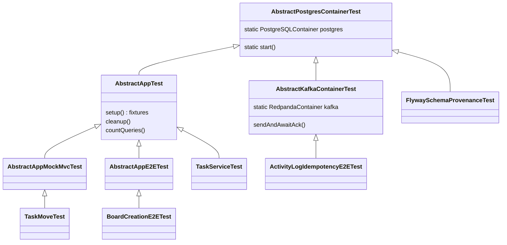

# 08 — Testing strategy

The test suite proves the behavior of every layer against a real PostgreSQL 16 database, a real
Spring context and, where needed, a real Kafka-protocol broker. This matters because the main
risks of this project (a skipped ownership check, an N+1 query, a lost Kafka event) are invisible
to mocks and to an in-memory database.

**Read first:** [02 — Persistence and queries](02-persistence-and-queries.md) (Flyway, N+1 work,
optimistic locking), [07 — Events and activity feed](07-events-and-activity-feed.md) (Kafka,
Avro, dead-letter topic). **Read next:** [09 — Build quality and CI](09-build-quality-and-ci.md)
(the gates that run this suite).

**Main code:**

- [`src/test/java/com/vrudenko/kanban_board/support/`](../../src/test/java/com/vrudenko/kanban_board/support/)
  — container bases, fixture bases, the event recorder
- [`src/main/resources/application-test.properties`](../../src/main/resources/application-test.properties)
  — the `test` Spring profile
- [`build.gradle`](../../build.gradle) — the `test`, `fastTest` and `rehearseHistoricalSchemas`
  tasks, JaCoCo
- [`src/test/java/com/vrudenko/kanban_board/architecture/`](../../src/test/java/com/vrudenko/kanban_board/architecture/)
  — ArchUnit rules
- [`scripts/loadtest/`](../../scripts/loadtest/) — the Artillery rate-limit check
- [`docs/CODE_STYLE.md`](../CODE_STYLE.md) rules 3, 4, 5, 8 and 13 — the written test rules

## Summary of decisions

| ID | Decision | Main reason |
|---|---|---|
| TEST-01 | No mocks. Every Spring test uses the real context, real repositories and a real database. | A mocked repository skips the ownership chain and JPA behavior that the tests exist to guard. |
| TEST-02 | Choose the package by purpose and the base class by mechanism (validator, service, MockMvc, real socket, Kafka). | Each tier answers a different question at a different cost. |
| TEST-03 | Replace H2 with a Testcontainers PostgreSQL container. Full drop, no H2 fallback. | The Flyway migrations had never run in CI; H2 hid real gaps. |
| TEST-04 | One PostgreSQL container per JVM, in a third shared ancestor (`AbstractPostgresContainerTest`). | Both fixture hierarchies need a datasource; two containers would be waste. |
| TEST-05 | Start containers in a plain `static { start(); }` block, not with `@Testcontainers`/`@Container`. | The JUnit extension started a second container while Spring kept the first one. |
| TEST-06 | Wire the database and broker with `@ServiceConnection`; use `@DynamicPropertySource` only for the schema registry. | Spring Boot has a connection-details factory for both containers, but not for a schema registry. |
| TEST-07 | Do not enable Testcontainers reuse. | Saves about 1% of wall-clock time, needs a manual host file, and keeps stale rows. |
| TEST-08 | Keep shared test infrastructure in `support/{containers,fixtures,listeners}/`; move most former E2E classes to MockMvc. | Setup code was mixed with tests; many "E2E" classes did not need a socket. |
| TEST-09 | Isolate tests with `@AfterEach` deletion, never with test-managed `@Transactional` rollback. | Rollback breaks AFTER_COMMIT events, query counts and real-socket tests. |
| TEST-10 | Assert query counts only through `countQueries()`, which reads `getPrepareStatementCount()`. | `getQueryExecutionCount()` does not count `findById()`. |
| TEST-11 | Use one Redpanda container for broker and schema registry; keep the Kafka base free of domain fixtures. | Redpanda is a Kafka-protocol superset; fixtures would publish noise into the broker under test. |
| TEST-12 | In the `test` profile, bound Kafka and registry timeouts to 50 ms and BCrypt cost to 4. | Non-Kafka tests must fail fast against an absent broker; BCrypt cost was the largest suite cost. |
| TEST-13 | Select the pre-commit `fastTest` gate by `@Tag("kafka")`/`@Tag("realSocket")`, not by class name. | A name suffix drifted away from what the class really needed. |
| TEST-14 | Run 2 Gradle test forks; reject JUnit in-JVM parallelism. | Measured: 2 forks were fastest; in-JVM parallelism breaks five shared-state assumptions. |
| TEST-15 | Exclude the historical-schema rehearsal (`@Tag("rehearsal")`) from `test`; run it with its own task. | An empty per-run database makes the rehearsal fail or pass vacuously. |
| TEST-16 | Enforce architecture and test placement with ArchUnit. | Conventions that only code review enforced had already drifted. |
| TEST-17 | JaCoCo ratchet at 90% instruction, 90% line, 75% branch, run by `./gradlew test`. | A drift alarm, set below the measured baseline, chosen from real numbers. |
| TEST-18 | Name tests `should<Outcome>_when<Condition>`, group with `@Nested`, mark AAA sections, use AssertJ `catchException`. | The method is the unit of navigation; no second `@DisplayName` string can drift. |
| TEST-19 | Generate data with DataFactory, but use guaranteed-valid generators for emails and unique names. | DataFactory's word corpus is small and dirty; it caused real flakes. |
| TEST-20 | Fix a flaky test at its root cause; make the unlucky input deterministic. Never retry to green. | A retry hides the defect; two flakes turned out to be real generator or race bugs. |
| TEST-21 | Pin every bug fix with a test that is observed RED before the fix. | A test that passes on both sides does not cover the bug. |
| TEST-22 | Verify the edge rate limiter with a two-sided Artillery check, started by hand only. | One side alone cannot tell "scoped correctly" from "throttles everything". |

## The test pyramid as it exists

### What it is

The suite has 65 Java files under `src/test`. On 2026-09-23 they held 483 `@Test`/
`@ParameterizedTest` methods and 5 `@ArchTest` rules (counted with
`rg -c "^\s*@(Test|ParameterizedTest)" src/test`). The tiers, from cheapest to most expensive:

| Tier | Base class | Spring context | Transport | Examples |
|---|---|---|---|---|
| Pure unit | none | no | none | [`RandFlakeGeneratorTest`](../../src/test/java/com/vrudenko/kanban_board/config/RandFlakeGeneratorTest.java) |
| DTO validation | none | no | none | [`SubtaskTitleMessageTest`](../../src/test/java/com/vrudenko/kanban_board/dto/SubtaskTitleMessageTest.java), [`ColumnColorTest`](../../src/test/java/com/vrudenko/kanban_board/dto/ColumnColorTest.java) |
| Architecture | none (`@AnalyzeClasses`) | no | none | [`LayeringArchTest`](../../src/test/java/com/vrudenko/kanban_board/architecture/LayeringArchTest.java) |
| Service | `AbstractAppTest` | yes | direct method call | [`TaskServiceTest`](../../src/test/java/com/vrudenko/kanban_board/service/TaskServiceTest.java) |
| Controller (in-process HTTP) | `AbstractAppMockMvcTest` or `AbstractAppTest` + `@AutoConfigureMockMvc` | yes | MockMvc | [`BoardControllerTest`](../../src/test/java/com/vrudenko/kanban_board/controller/BoardControllerTest.java), [`TaskMoveTest`](../../src/test/java/com/vrudenko/kanban_board/e2e/task/TaskMoveTest.java) |
| Real socket | `AbstractAppE2ETest` + `RANDOM_PORT`, `@Tag("realSocket")` | yes | REST Assured over TCP | [`BoardCreationE2ETest`](../../src/test/java/com/vrudenko/kanban_board/e2e/board/BoardCreationE2ETest.java), [`SessionCookieAttributesE2ETest`](../../src/test/java/com/vrudenko/kanban_board/security/SessionCookieAttributesE2ETest.java) |
| Kafka | `AbstractKafkaContainerTest`, `@Tag("kafka")` | yes | real Redpanda broker and registry | [`ActivityLogIdempotencyE2ETest`](../../src/test/java/com/vrudenko/kanban_board/activitylog/ActivityLogIdempotencyE2ETest.java) |

Every tier with a Spring context runs against the same real PostgreSQL container. A "service
test" in this project is therefore an integration test, not a unit test in the strict sense.



### How it works

[`docs/CODE_STYLE.md` rule 4](../CODE_STYLE.md#4-no-mocks--test-against-real-spring-wiring)
gives two independent choices for a new test:

1. **Which package (purpose).** `service/*ServiceTest` covers business-logic edge cases at high
   volume. `controller/*ControllerTest` proves one endpoint's HTTP contract (status, JSON shape,
   auth at the boundary). `*E2ETest` classes cover flows that need real infrastructure: Kafka,
   the schema registry or true multi-threaded HTTP.
2. **Which base class (mechanism).** `AbstractAppTest` for direct service calls,
   `AbstractAppMockMvcTest` for in-process HTTP, `AbstractAppE2ETest` only for a real socket.

The DTO tier builds a `jakarta.validation.Validator` from
`Validation.buildDefaultValidatorFactory()` in `@BeforeEach`. It has no Spring context and no
container, so a full boundary matrix is cheap there. The controller tier keeps only one or two
cases that prove a bad body gives 400 with the correct envelope. Quick task 260813-i6r moved three
over-enumerated cases from `TaskControllerTest` down to
[`SubtaskTitleMessageTest.SaveSubtaskRequestDTOTest`](../../src/test/java/com/vrudenko/kanban_board/dto/SubtaskTitleMessageTest.java)
under this rule (recorded in rule 4 itself).

A real socket is required only in these cases:

- [`BoardCreationE2ETest.ConcurrentCreate`](../../src/test/java/com/vrudenko/kanban_board/e2e/board/BoardCreationE2ETest.java#L509-L530)
  — two threads race a unique constraint through real HTTP.
- [`ConcurrentSigninCeilingE2ETest`](../../src/test/java/com/vrudenko/kanban_board/security/ConcurrentSigninCeilingE2ETest.java)
  — a true two-thread signin race against the session ceiling.
- [`SessionCookieAttributesE2ETest`](../../src/test/java/com/vrudenko/kanban_board/security/SessionCookieAttributesE2ETest.java)
  — MockMvc never writes a container-serialized `Set-Cookie` header, so it cannot see
  `Secure`/`SameSite`.
- [`ActuatorHealthE2ETest`](../../src/test/java/com/vrudenko/kanban_board/security/ActuatorHealthE2ETest.java)
  and [`ResetControllerE2ETest`](../../src/test/java/com/vrudenko/kanban_board/e2e/reset/ResetControllerE2ETest.java).

### Why we chose it

**TEST-01.** CODE_STYLE rule 4 states the reason: "mocking a repository bypasses exactly the
ownership chain and JPA behaviour these tests exist to catch regressions in". A green, fully
mocked test can sit on top of a broken access-control path or a new N+1 query. Mockito, `@Mock`,
`@MockBean`, `@WebMvcTest` and `@DataJpaTest` must not appear in the repository.

When a test must observe a collaborator, it uses a real Spring bean instead of a mock. Two
examples:

- [`RecordingActivityEventListener`](../../src/test/java/com/vrudenko/kanban_board/support/listeners/RecordingActivityEventListener.java)
  is a real `@TransactionalEventListener(phase = AFTER_COMMIT)` that records every
  `ActivityEvent`.
- [`SigninTimingEqualizationTest`](../../src/test/java/com/vrudenko/kanban_board/security/SigninTimingEqualizationTest.java)
  wires a hand-written `@Primary` delegating `PasswordEncoder` that counts `matches()` calls
  (quick task [260811-ezy](../../.planning/quick/260811-ezy-fix-signin-timing-side-channel-f1-consta/260811-ezy-SUMMARY.md)).

**TEST-02.** The split lets each tier do what it does cheaply. A boundary matrix at the DTO tier
costs microseconds. The same matrix behind MockMvc costs a Spring request per case and duplicates
the controller test's real job.

### Alternatives we rejected

- **Mockito unit tests for services.** Rejected by TEST-01.
- **Spring test slices (`@WebMvcTest`, `@DataJpaTest`).** Rejected in rule 4. A slice replaces
  part of the real wiring, which is the part the tests exist to check.

### Trade-offs and limits

- Every Spring test needs Docker. There is no container-free path
  ([`docs/LOCAL_DEV.md`](../LOCAL_DEV.md), "Testcontainers-based tests on Windows").
- The full suite is slow: 276.5 s average on the developer machine after the speed work
  (TEST-14).
- Entities and repositories have no direct tests. [`README.md`](../../README.md#testing) states
  that they "carry no custom logic".

### How we test it

[`LayeringArchTest`](../../src/test/java/com/vrudenko/kanban_board/architecture/LayeringArchTest.java)
and [`TestPlacementArchTest`](../../src/test/java/com/vrudenko/kanban_board/architecture/TestPlacementArchTest.java)
enforce part of the structure (see TEST-16). No rule forbids a Mockito import; the absence of the
Mockito dependency in [`build.gradle`](../../build.gradle) is the practical guard.

### Where this is recorded

- [`docs/CODE_STYLE.md` rule 4](../CODE_STYLE.md#4-no-mocks--test-against-real-spring-wiring)
- [`docs/ARCHITECTURE.md` § Testing](../ARCHITECTURE.md#testing)

## Reversed decision: H2 to Testcontainers PostgreSQL

### What it is

Until 2026-08-06 the suite ran on in-memory H2 with `ddl-auto=create-drop` and Flyway disabled.
Milestone phase 04.2 (modernization Epic 5) moved every test to a real `postgres:16` container.
Flyway now builds the test schema from the same migrations that production runs.

### How it works

The test profile no longer names any datasource. It turns Flyway on by default and sets Hibernate
to `validate`:

```properties
# application-test.properties, lines 26-35 (comment shortened)
# 04.2 cutover: the schema in tests is now built by the same ... Flyway migrations production
# runs ... ddl-auto is set EXPLICITLY to validate rather than omitted: Hibernate's
# embedded-database create-drop default never applies to a real Postgres URL, so omitting this
# property would silently leave the effective value at none ...
spring.jpa.hibernate.ddl-auto=validate
```

See [`application-test.properties`](../../src/main/resources/application-test.properties#L25-L35).
The datasource comes from `@ServiceConnection` on the container (TEST-06).

[`FlywaySchemaProvenanceTest`](../../src/test/java/com/vrudenko/kanban_board/config/FlywaySchemaProvenanceTest.java)
is the standing proof that the schema comes from Flyway and not from Hibernate. It queries the
live catalog. For example, it checks that the schema has zero Hibernate-generated constraint
names, that a foreign key carries the name V1 gave it, and that Spring Session's tables coexist
with `flyway_schema_history`.

### Why we chose it

**TEST-03.** The phase context records the main reason. The V1–V4 migrations were verified only
by one manual run against local docker-compose, and "CI has never executed them". Phase 5 was
about to point production at a new database. Without this change, "the cutover itself [would be]
the first real test" ([`04.2-CONTEXT.md`](../../.planning/milestones/v1.2-phases/04.2-testcontainers-postgres-drop-h2/04.2-CONTEXT.md)).

Decision D-05 of that phase rejects a hybrid: "Two schema paths is exactly the drift
`docs/CODE_STYLE.md` rule 8 exists to prevent". `com.h2database:h2` was deleted with no fallback
profile (commit `d9cf4a8`).

### What H2 hid

The cutover exposed these real gaps:

1. **Unexercised migrations.** Under H2, Hibernate generated the schema. The Flyway files that
   production runs were never tested.
2. **Cross-test data leakage in `activity_log`.** `activity_log` has no foreign key to `users`,
   so `userService.deleteAll()` never reached its rows. H2's per-context `create-drop` wiped them
   by accident. A long-lived container does not. Decision D-02a made this a gap to close. Commit
   `7c68a47` added `activityLogRepository.deleteAll()` to the cleanup hook and the tripwire test
   [`ActivityLogCleanupIsolationTest`](../../src/test/java/com/vrudenko/kanban_board/activitylog/ActivityLogCleanupIsolationTest.java).
3. **Identifier-case coupling.** Two assertions in the former `SessionPersistenceE2ETest` queried
   the upper-case `'SPRING_SESSION'`. PostgreSQL folds unquoted identifiers to lower case, which
   is the opposite of H2. The fix queries `information_schema.tables` for `spring_session`
   ([`04.2-02-SUMMARY.md`](../../.planning/milestones/v1.2-phases/04.2-testcontainers-postgres-drop-h2/04.2-02-SUMMARY.md)).
   That class now lives inside
   [`AuthenticationTest`](../../src/test/java/com/vrudenko/kanban_board/security/AuthenticationTest.java)
   after the phase 07 merge.

The two dialect-sensitive query-count tests passed on PostgreSQL with zero edits. The summary
records this as "unchanged, nothing adjudicated", not as "a change was reviewed".

### Alternatives we rejected

| Alternative | Why rejected |
|---|---|
| Keep H2 as a fallback profile behind a flag | D-05: two schema paths drift. |
| Put the container in `AbstractAppTest` only (the Epic 5 text) | D-01: the Kafka hierarchy does not extend `AbstractAppTest` and would have no datasource (TEST-04). |
| `@Testcontainers`/`@Container` extension | Already failed for Kafka (TEST-05). |
| `@DynamicPropertySource` for the datasource (the Epic 5 text) | Not needed: Spring Boot ships `PostgresContainerConnectionDetailsFactory` (TEST-06). |

### Trade-offs and limits

The measured cost was negative. On one machine in one session
([`04.2-02-SUMMARY.md`](../../.planning/milestones/v1.2-phases/04.2-testcontainers-postgres-drop-h2/04.2-02-SUMMARY.md)):

| Run | Wall-clock | Tests |
|---|---|---|
| H2, before the tracer | 4m 48s | 199 |
| H2, after the tracer (like-for-like basis) | 5m 10s | 208 |
| PostgreSQL container | 4m 51s | 210 |

The container run was 19 s (6.1%) faster than the like-for-like H2 run. The summary gives a
hypothesis, not a proven cause: H2 rebuilt the schema on each of about 30 Spring context starts,
while Flyway migrates once per JVM.

The real costs are elsewhere. The pre-commit gate now needs Docker (decision D-03). The Docker
Engine 29.x incompatibility (testcontainers-java#11212) needed the `api.version=1.44` pin (see
TEST-05).

### How we test it

- [`FlywaySchemaProvenanceTest`](../../src/test/java/com/vrudenko/kanban_board/config/FlywaySchemaProvenanceTest.java)
  (13 tests in the nested groups `FlywayHistory`, `SchemaShape`, `FlywayOnlyArtifacts`,
  `SpringSessionCoexistence`).
- `ddl-auto=validate` makes every Spring context start fail if an entity and the migrated schema
  disagree.

### Where this is recorded

- [`04.2-CONTEXT.md`](../../.planning/milestones/v1.2-phases/04.2-testcontainers-postgres-drop-h2/04.2-CONTEXT.md)
  (decisions D-01 to D-05), [`04.2-RESEARCH.md`](../../.planning/milestones/v1.2-phases/04.2-testcontainers-postgres-drop-h2/04.2-RESEARCH.md),
  [`04.2-VERIFICATION.md`](../../.planning/milestones/v1.2-phases/04.2-testcontainers-postgres-drop-h2/04.2-VERIFICATION.md)
- [`docs/plans/backend-modernization/05-testcontainers.md`](../plans/backend-modernization/05-testcontainers.md)
  — its status note lists three places where the delivery differs from the original task list
- Commits `948e1b1`, `7c68a47`, `d9cf4a8`

## Container lifecycle: one container per JVM

### What it is

The **singleton container pattern** means one container is started once and shared by every test
class in one JVM. In this project a plain `static` block starts it, and JVM class-initialization
rules make that block run exactly once per classloader.

### How it works

[`AbstractPostgresContainerTest`](../../src/test/java/com/vrudenko/kanban_board/support/containers/AbstractPostgresContainerTest.java#L58-L83):

```java
public abstract class AbstractPostgresContainerTest {
    static {
        System.setProperty("api.version", "1.44");
    }

    @ServiceConnection
    static final PostgreSQLContainer<?> postgres =
            new PostgreSQLContainer<>(DockerImageName.parse("postgres:16"));

    static {
        postgres.start();
    }
}
```

The sequence at JVM start:

1. The first test class loads. The JVM runs the superclass static blocks first.
2. The first block pins the Docker API version for docker-java.
3. The second block starts `postgres:16`. The tag matches `docker-compose.yml`.
4. The first Spring context starts. `@ServiceConnection` gives it the JDBC URL, user and password.
5. Flyway migrates the empty database once.
6. Spring caches the context. Later test classes with the same configuration reuse it and the
   container.

[`AbstractKafkaContainerTest`](../../src/test/java/com/vrudenko/kanban_board/support/containers/AbstractKafkaContainerTest.java#L107-L128)
extends this class and adds a Redpanda container the same way (TEST-11). Because Kafka extends
Postgres, the `api.version` pin runs before either container starts, for any class load order.

With `maxParallelForks = 2` (TEST-14), each fork is a separate JVM. So a full run has two
PostgreSQL containers and two databases, one per fork. The `build.gradle` comment records a live
container census that confirmed this.

### Why we chose it

**TEST-04.** Decision D-01 of phase 04.2: `AbstractKafkaContainerTest` does not extend
`AbstractAppTest`, "yet its 9 subclasses persist `ActivityLogEntity`". A container only in
`AbstractAppTest` "would leave them without a datasource or force a second one". A third, common
ancestor solves both.

**TEST-05.** The `@Testcontainers`/`@Container` extension was tried first for Kafka and failed.
The Javadoc of `AbstractKafkaContainerTest` records the symptom on Windows with Docker Desktop and
testcontainers-java 1.21.0:

- A second class in the package started a second container with a different port.
- Spring's cached `ApplicationContext` kept its `KafkaTemplate` and `@KafkaListener` beans bound
  to the first container's port.
- Spring-mediated sends hung until timeout, while raw test clients worked.

A `static { start(); }` block does not depend on any JUnit extension bookkeeping. The Javadoc
calls it "the standard Testcontainers 'singleton container' recommendation". D-01 applied the
same fix to PostgreSQL "unconditionally".

**TEST-06.** Spring Boot 3.1+ ships a `ConnectionDetails` factory for `PostgreSQLContainer` and
for `RedpandaContainer`, so `@ServiceConnection` is enough. No such type exists for a schema
registry. `schema.registry.url` therefore uses `@DynamicPropertySource`, because an annotation
attribute must be a compile-time constant and the mapped port is known only after start.

### Alternatives we rejected

**TEST-07: Testcontainers reuse.** Reuse keeps a container alive across separate `./gradlew`
runs. [`docs/LOCAL_DEV.md` § "Testcontainers reuse: evaluated, not enabled"](../LOCAL_DEV.md)
records four reasons, from a measurement on 2026-08-06:

1. The container starts in about 2.29 s. Three `fastTest` runs took 232 s, 224 s and 242 s. The
   saving is about 1%, which is less than the 18 s run-to-run variance.
2. The container already starts only once per JVM. Reuse can only help a second, separate run.
3. The opt-in is a hand-edited `~/.testcontainers.properties` file. That is a manual host step,
   which [CODE_STYLE rule 8](../CODE_STYLE.md#8-test-setup-must-be-fully-automated--never-a-manual-step-for-the-developer)
   forbids.
4. A reused container keeps `spring_session` rows that the cleanup hook does not delete. The
   suite would stop being deterministic.

The document names the condition to revisit: a start time in double-digit seconds *and* a
version-controlled opt-in.

### Trade-offs and limits

- **Ryuk.** Ryuk is the Testcontainers sidecar container that removes a JVM's containers when
  that JVM disconnects. The repository does not disable it: no `TESTCONTAINERS_RYUK_DISABLED` or
  `testcontainers.properties` exists in `build.gradle` or `src/test`. Session notes saw Ryuk
  running during a `fastTest` run
  ([`10-01-SUMMARY.md`](../../.planning/milestones/v1.3-phases/10-ci-deploy-hardening/10-01-SUMMARY.md)).
  Another session ran `./gradlew --stop` so that Ryuk could remove the containers that each
  pre-commit run started
  ([`05-02-SUMMARY.md`](../../.planning/milestones/v1.2-phases/05-infra-migration/05-02-SUMMARY.md)).
  A warm Gradle daemon keeps the test JVM's Docker connection open, so Ryuk does not act until
  the daemon stops.
- **Orphaned containers.** On 2026-08-29 the owner saw PostgreSQL and Redpanda test containers
  that survived their JVM with no Ryuk container present at all. The root cause is unknown. This
  observation is recorded only in the owner's local agent notes, not in the repository (see
  "Known gaps"). The practical rule is: check `docker ps -a --filter label=org.testcontainers`
  after a session.
- **`forkEvery` stays at 0.** A non-zero value restarts the JVM per class and so restarts the
  container per class. The `build.gradle` comment calls this "catastrophic rather than merely
  slower".

### How we test it

- Every Spring test fails at context start if the container or `@ServiceConnection` wiring
  breaks.
- [`FlywaySchemaProvenanceTest.SpringSessionCoexistence`](../../src/test/java/com/vrudenko/kanban_board/config/FlywaySchemaProvenanceTest.java)
  proves Flyway and Spring Session JDBC share the container.

### Where this is recorded

- Javadoc of [`AbstractPostgresContainerTest`](../../src/test/java/com/vrudenko/kanban_board/support/containers/AbstractPostgresContainerTest.java)
  and [`AbstractKafkaContainerTest`](../../src/test/java/com/vrudenko/kanban_board/support/containers/AbstractKafkaContainerTest.java)
- [`docs/LOCAL_DEV.md`](../LOCAL_DEV.md) — the Windows `api.version` section and the reuse section
- [`04.2-RESEARCH.md`](../../.planning/milestones/v1.2-phases/04.2-testcontainers-postgres-drop-h2/04.2-RESEARCH.md)
  "Alternatives Considered"

## Fixture bases and the `support/` package

### What it is

A **fixture** is the data a test needs before it runs. `support/` holds every shared class that
is not a test:

| Folder | Classes |
|---|---|
| [`support/containers/`](../../src/test/java/com/vrudenko/kanban_board/support/containers/) | `AbstractPostgresContainerTest`, `AbstractKafkaContainerTest` |
| [`support/fixtures/`](../../src/test/java/com/vrudenko/kanban_board/support/fixtures/) | `AbstractAppTest`, `AbstractAppMockMvcTest`, `AbstractAppE2ETest` |
| [`support/listeners/`](../../src/test/java/com/vrudenko/kanban_board/support/listeners/) | `RecordingActivityEventListener` |

### How it works

[`AbstractAppTest.setup()`](../../src/test/java/com/vrudenko/kanban_board/support/fixtures/AbstractAppTest.java#L106-L188)
runs before every test method. It creates the fixtures through the real services, never through
SQL inserts:

- three users: `owningUser`, `noBoardsUser`, and `foreignUser`;
- boards, 7 columns, 8 tasks and 7 subtasks for the owning user;
- one board and one column for the foreign user, created last.

The foreign user owns real data. So a cross-user test proves that a legitimate owner is still
refused someone else's resource, not only that an empty account sees nothing. The foreign user is
created last because some tests read `findAll().getFirst()` and expect an owning-user board.

The other two fixture bases add transport:

- [`AbstractAppMockMvcTest.signinCookie()`](../../src/test/java/com/vrudenko/kanban_board/support/fixtures/AbstractAppMockMvcTest.java#L53-L81)
  sends a real `POST /signin` through MockMvc and returns the session cookie. It does not use the
  `.with(user(userId))` shortcut, because that shortcut skips
  `AuthenticationController.authenticate`.
- [`AbstractAppE2ETest`](../../src/test/java/com/vrudenko/kanban_board/support/fixtures/AbstractAppE2ETest.java)
  points REST Assured at `@LocalServerPort` and the `/api` context path.

MockMvc does not apply `server.servlet.context-path`. So MockMvc tests use the bare `ApiPaths`
constants, and real-socket tests need the `/api` prefix.

The `.with(user(userId))` shortcut has a limit: at most two requests per principal per test
method. Each call makes a new session, and `MAX_CONCURRENT_SESSIONS = 2` refuses the third. A
measured run of four identical calls returned `200, 200, 401, 401`. For three or more calls, the
test signs in once and replays the cookie. [`InjectionAttemptTest`](../../src/test/java/com/vrudenko/kanban_board/security/InjectionAttemptTest.java)
is the reference for that pattern (CODE_STYLE rule 4).

### Why we chose it

**TEST-08.** Milestone phase 07 started from a todo: setup classes sat mixed with 44 test classes
at inconsistent depths, which was "not clear at a glance". Decision D-01 of
[`07-CONTEXT.md`](../../.planning/milestones/v1.2-phases/07-restructure-test-folder-separate-setup-from-tests-evaluate-n/07-CONTEXT.md)
put all infrastructure in one `support/` package, split by concern.

Decision D-03 asked research to find which of the `E2ETest`-suffixed classes needed a real socket.
After the H2 removal every test hit the real database, so the suffix no longer meant "real
versus fake database". The result ([`07-07-SUMMARY.md`](../../.planning/milestones/v1.2-phases/07-restructure-test-folder-separate-setup-from-tests-evaluate-n/07-07-SUMMARY.md)):

- 13 classes moved down to MockMvc, through the new `AbstractAppMockMvcTest`.
- `AuthenticationControllerTest`, `SessionPersistenceE2ETest` and `UserPersistenceE2ETest` merged
  into one `@Nested` file (now `AuthenticationTest`).
- Two empty classes were deleted.
- Only 1 real-HTTP class and 9 Kafka classes stayed.
- The suite kept exactly 278 tests: no test was lost.

Phase 07.1 decision D-21 then renamed 11 in-process classes to drop the misleading `E2ETest`
suffix (commit `a94a1ad`, for example `TaskMoveE2ETest` became `TaskMoveTest`).

For downgrades that touched a security control, phase 07-02 used a **falsification probe**. The
executor disabled the security call site, ran the dependent tests, saw them fail, and restored the
file. This proved the MockMvc versions still reach the real
`sessionAuthenticationStrategy.onAuthentication` call.

### Alternatives we rejected

- **A mechanical mass move without judgment.** The source todo warned against it; each downgrade
  had a per-class verdict in
  [`07-RESEARCH.md`](../../.planning/milestones/v1.2-phases/07-restructure-test-folder-separate-setup-from-tests-evaluate-n/07-RESEARCH.md).
- **Merge first, then downgrade.** 07-02 did both in one edit, so that no intermediate file mixed
  REST Assured and MockMvc.

### Trade-offs and limits

- The fixture build is not free. `docs/LOCAL_DEV.md` measured it at about 29 s suite-wide
  (31 entities per test method) and left it as "remaining headroom, deliberately not taken".
- `BoardControllerTest`, `TaskControllerTest` and `SubtaskControllerTest` still extend
  `AbstractAppTest` and add `@AutoConfigureMockMvc` themselves. They use `.with(user())` only, so
  they do not need `signinCookie()`.

### How we test it

[`TestPlacementArchTest`](../../src/test/java/com/vrudenko/kanban_board/architecture/TestPlacementArchTest.java)
(TEST-16) fails the build when a test class lands in the root package.

### Where this is recorded

- [`07-CONTEXT.md`](../../.planning/milestones/v1.2-phases/07-restructure-test-folder-separate-setup-from-tests-evaluate-n/07-CONTEXT.md),
  [`07-01-SUMMARY.md`](../../.planning/milestones/v1.2-phases/07-restructure-test-folder-separate-setup-from-tests-evaluate-n/07-01-SUMMARY.md)
  to [`07-07-SUMMARY.md`](../../.planning/milestones/v1.2-phases/07-restructure-test-folder-separate-setup-from-tests-evaluate-n/07-07-SUMMARY.md)
- [`07.1-CONTEXT.md`](../../.planning/milestones/v1.2-phases/07.1-address-hard-blockers-and-inconsistencies-from-the-frontend/07.1-CONTEXT.md)
  decisions D-21 and D-22
- Commits `c0cf3ea`, `15c117e` (relocation), `a94a1ad` (suffix rename)

## Isolation between tests

### What it is

**Test isolation** means one test method cannot see data from another. This project deletes rows
after each test method. It does not wrap tests in a transaction that rolls back.

### How it works

[`AbstractAppTest.cleanup()`](../../src/test/java/com/vrudenko/kanban_board/support/fixtures/AbstractAppTest.java#L213-L218):

```java
@AfterEach
void cleanup() {
    userService.deleteAll();
    activityLogRepository.deleteAll();
    recordingActivityEventListener.clear();
}
```

1. `userService.deleteAll()` cascades from users to boards, columns, tasks and subtasks.
2. `activityLogRepository.deleteAll()` removes `activity_log` rows, which have no foreign key.
3. `recordingActivityEventListener.clear()` empties the recorder's singleton list. The Javadoc
   records why this is safe: the recorder has no `@Async`, so every event is already recorded
   when `@AfterEach` runs.

The Javadoc tells a future author to extend this one method for a new table without a foreign
key, "not add a second isolation mechanism alongside it".

The eleven `AbstractKafkaContainerTest` subclasses do not run this hook. They write real
`activity_log` rows and do not delete them. Tests that share the database with them assert on a
scoped value, not on an absolute count.

### Why we chose it

**TEST-09.** Decision D-02 of phase 04.2 rejected test-managed `@Transactional` rollback on three
verified grounds. None is specific to PostgreSQL:

1. A rolled-back transaction never commits. So `@TransactionalEventListener(phase = AFTER_COMMIT)`
   never fires, and event tests would assert on an empty list.
2. One transaction spans `@BeforeEach` and the act. Fixtures stay in the first-level cache, and
   `findById()` stops hitting the database. This corrupts `countQueries()`.
3. `AbstractAppE2ETest` sends real HTTP to a server thread. The test thread's transaction never
   spans that request, so rollback isolates nothing.

The phase context records that rollback "was initially selected for isolation, then reversed
after the three conflicts in D-02 were verified against the actual code".

### Alternatives we rejected

- **`@Transactional` rollback.** See above.
- **Selective rollback for tests that assert neither events nor query counts.** Deferred in
  `04.2-CONTEXT.md`: two isolation models "is a trap for future test authors".
- **Truncate all tables between tests.** No source records this option. The code shows that the
  cascade delete plus one extra table covers the schema.

### Trade-offs and limits

- `deleteAll()` is a global wipe. This is one of the five reasons that in-JVM parallelism is
  rejected (TEST-14).
- The Kafka tests leave rows behind, so any test with an absolute row count against
  `activity_log` would be flaky.
- `spring_session` rows are not deleted. This is safe only because each run starts a fresh
  container (and is a reason for TEST-07).

### How we test it

[`ActivityLogCleanupIsolationTest`](../../src/test/java/com/vrudenko/kanban_board/activitylog/ActivityLogCleanupIsolationTest.java)
has two structurally identical methods, `shouldSeeNoProbeRow_whenFirstMethodRuns` and
`shouldSeeNoProbeRow_whenSecondMethodRuns`. Each one checks that no row exists for the board id
`activity-log-cleanup-probe`, then inserts one. If `activityLogRepository.deleteAll()` is removed,
the method that runs second fails. The 04.2-02 summary records this falsification: removing the
call failed exactly 1 of the 2 methods.

### Where this is recorded

- [`04.2-CONTEXT.md`](../../.planning/milestones/v1.2-phases/04.2-testcontainers-postgres-drop-h2/04.2-CONTEXT.md)
  decisions D-02 and D-02a
- Javadoc of [`AbstractAppTest`](../../src/test/java/com/vrudenko/kanban_board/support/fixtures/AbstractAppTest.java)

## Query-count assertions

### What it is

A **query-count test** proves that an operation issues a fixed number of SQL statements, so that an
**N+1 problem** (one extra query per child row) cannot return unseen. Chapter
[02](02-persistence-and-queries.md) explains the fetch strategies these tests guard.

### How it works

[`AbstractAppTest.countQueries`](../../src/test/java/com/vrudenko/kanban_board/support/fixtures/AbstractAppTest.java#L316-L327):

```java
protected long countQueries(Runnable action) {
    var statistics = entityManagerFactory.unwrap(SessionFactory.class).getStatistics();
    statistics.clear();
    action.run();
    return statistics.getPrepareStatementCount();
}
```

The test profile turns statistics on with `spring.jpa.properties.hibernate.generate_statistics=true`.
Two assertion styles exist:

- **Exact count.** [`OwnershipVerifierServiceTest.QueryCountTest.verifyOwnershipOfSubtask_issuesOneQuery`](../../src/test/java/com/vrudenko/kanban_board/service/OwnershipVerifierServiceTest.java#L29-L47)
  asserts that the subtask-to-user ownership chain costs one statement.
- **Invariance.** [`BoardServiceTest.FindFullByIdQueryCountTest.queryCountDoesNotScaleWithGraphSize`](../../src/test/java/com/vrudenko/kanban_board/service/BoardServiceTest.java#L410-L499)
  builds a 2×2×2 board graph and a 4×4×4 graph and asserts equal counts. The comment records the
  falsification: with the fetch join both cost 3 statements; with a plain `findById` the counts
  were 9 and 23, and the test failed.

Other users: [`TaskServiceTest.MoveToColumnQueryCountTest`](../../src/test/java/com/vrudenko/kanban_board/service/TaskServiceTest.java#L30-L89)
(move cost does not grow with the source column size) and `ColumnServiceTest` (delete cost does
not grow with the task count).

### Why we chose it

**TEST-10.** The Javadoc gives the reason: `getQueryExecutionCount()` "only counts HQL/JPQL
queries, not `find()`-by-id lookups (which is what `repository.findById()` compiles to)". The
ownership chain is made of `findById()` calls, so the weaker counter would miss exactly the
queries that matter. CODE_STYLE rule 4 makes `countQueries` "the only sanctioned way" to assert on
query counts.

### Alternatives we rejected

- `Statistics.getQueryExecutionCount()` — misses `findById()`.
- A JDBC proxy library (for example datasource-proxy). No source records this option. The code
  shows that the Hibernate counter was enough and adds no dependency.

### Trade-offs and limits

- The statistics object is global to the `SessionFactory`, not per thread. A concurrent query
  would pollute the count. This is one of the reasons for TEST-14.
- The invariance style proves "does not scale", not "is minimal". A constant but wasteful query
  plan still passes.
- The count depends on the persistence context being empty. That is a reason for TEST-09.

### Where this is recorded

- [`.claude/CLAUDE.md`](../../.claude/CLAUDE.md) Constraints ("Testing")
- [`docs/CODE_STYLE.md` rule 4](../CODE_STYLE.md#4-no-mocks--test-against-real-spring-wiring)
- [`docs/ARCHITECTURE.md` § Testing](../ARCHITECTURE.md#testing)

## Kafka and schema-registry end-to-end tests

### What it is

Eleven test classes run against a real **Redpanda** container. Redpanda is a Kafka-protocol broker
that also has a Confluent-compatible schema registry. Chapter
[07](07-events-and-activity-feed.md) explains the pipeline these tests cover.

### How it works

[`AbstractKafkaContainerTest`](../../src/test/java/com/vrudenko/kanban_board/support/containers/AbstractKafkaContainerTest.java):

1. The static block starts `redpandadata/redpanda:v26.2.1`, then calls
   `AvroSchemaRegistrar.registerAll(...)`. The `registerSchemas` Gradle task calls the same method
   for CI, so there is one registration path.
2. `@ServiceConnection` sets `spring.kafka.bootstrap-servers`.
3. `@DynamicPropertySource` sets the producer and consumer `schema.registry.url` (TEST-06).
4. `@TestPropertySource` raises the producer bounds to 30 s and the registry client retries to 3.
5. [`sendAndAwaitAck`](../../src/test/java/com/vrudenko/kanban_board/support/containers/AbstractKafkaContainerTest.java#L194-L202)
   maps a domain event to Avro, sends it and waits up to 30 s for the broker acknowledgement.
   Each test then polls with Awaitility (`atMost(Duration.ofSeconds(30))`) for the consumer's
   effect.

Examples:

- [`ActivityLogIdempotencyE2ETest`](../../src/test/java/com/vrudenko/kanban_board/activitylog/ActivityLogIdempotencyE2ETest.java):
  a redelivered event makes one row; two threads that record the same `eventId` make one row.
- [`ActivityLogDeadLetterE2ETest`](../../src/test/java/com/vrudenko/kanban_board/activitylog/ActivityLogDeadLetterE2ETest.java)
  and [`ActivityLogAvroDeadLetterE2ETest`](../../src/test/java/com/vrudenko/kanban_board/activitylog/ActivityLogAvroDeadLetterE2ETest.java):
  poison records go to the dead-letter topic.
- [`SchemaCompatibilityE2ETest`](../../src/test/java/com/vrudenko/kanban_board/activitylog/SchemaCompatibilityE2ETest.java):
  schema evolution rules at the real registry.
- [`SchemaRegistryOutageE2ETest`](../../src/test/java/com/vrudenko/kanban_board/activitylog/SchemaRegistryOutageE2ETest.java):
  the producer sees an unreachable registry. It sets the mutable field
  `producerSchemaRegistryUrlOverride` in a static block and resets it in `@AfterAll`.

A `@DynamicPropertySource` method in the subclass cannot override the base value. The Javadoc
records an empirical finding: Spring calls subclass methods *before* superclass methods, so the
superclass writes last and wins. The mutable field is the real override point.

### Why we chose it

**TEST-11.** Phase 4 moved the shared base from `apache/kafka-native:4.3.1` to Redpanda in place.
The existing Kafka tests "compile and pass unchanged against Redpanda purely because it is a
Kafka-protocol superset". One container gives both broker and registry (Javadoc of the class).

The Kafka base does not extend `AbstractAppTest` on purpose. Its fixtures create about twenty
entities through real services, and each one publishes an event "into the very broker under
test, turning every test method into a race against unrelated traffic".

**TEST-12.** The other 40-plus Spring classes have no broker. The test profile makes their
publish attempts fail fast
([`application-test.properties`](../../src/main/resources/application-test.properties#L59-L93)):

- `max.block.ms`, `request.timeout.ms` and `delivery.timeout.ms` are 50 ms. At the production
  value of 2000 ms, about 18 publishes per test method made "a 20+ minute full-suite hang".
- The registry client has `max.retries=0` and 50 ms timeouts. With defaults, a full run took
  232 s against a 208 s baseline, an 11% loss.
- `security.bcrypt.strength=4`, the BCrypt minimum. This took about 78 s off the full suite
  (quick task [260811-ixj](../../.planning/quick/260811-ixj-investigate-and-implement-test-suite-spe/260811-ixj-SUMMARY.md)).

Publication is still proven in those classes, through `RecordingActivityEventListener`, not
through a real delivery.

### Alternatives we rejected

- **A second, standalone Confluent registry container.** Rejected in the Phase 4 plan's design
  alternatives (referenced in the class Javadoc).
- **`@Testcontainers`/`@Container`.** See TEST-05.
- **Extend `AbstractAppTest`.** Rejected because of the fixture noise above.

### Trade-offs and limits

- All Kafka classes share one `activity` topic and one `activity-log` consumer group. Tests scope
  assertions by their own ids, and classes must run one after another in one JVM.
- The test profile uses BCrypt cost 4, not 10. [`docs/LOCAL_DEV.md`](../LOCAL_DEV.md) states the
  security trade-off openly. [`PasswordEncoderStrengthTest`](../../src/test/java/com/vrudenko/kanban_board/config/PasswordEncoderStrengthTest.java)
  asserts the production fallback of 10 and the key's absence from `application.properties`.
- `KafkaEventPublisher.onActivityEvent` is `@Async`. A test that needs a publish to reach the
  broker must wait for its effect. `ResetServiceE2ETest` learned this the hard way (TEST-20).

### Where this is recorded

- Javadoc of [`AbstractKafkaContainerTest`](../../src/test/java/com/vrudenko/kanban_board/support/containers/AbstractKafkaContainerTest.java)
- Comments in [`application-test.properties`](../../src/main/resources/application-test.properties)
- [`docs/plans/backend-modernization/01-kafka-activity-feed.md`](../plans/backend-modernization/01-kafka-activity-feed.md)

## Gradle test tasks, tags and forks

### What it is

[`build.gradle`](../../build.gradle) defines three `Test` tasks:

| Task | Includes | Excludes | Used by |
|---|---|---|---|
| `test` | everything | `@Tag("rehearsal")` | CI (`deploy.yml`), developers |
| `fastTest` | everything | `@Tag("kafka")`, `@Tag("realSocket")` | `.githooks/pre-commit` |
| `rehearseHistoricalSchemas` | `@Tag("rehearsal")` only | — | a build step against a real historical database |

### How it works

[`tasks.named('test')`](../../build.gradle#L295-L330):

```groovy
tasks.named('test') {
    useJUnitPlatform {
        excludeTags 'rehearsal'
    }
    maxParallelForks = 2
    finalizedBy jacocoTestCoverageVerification
    dependsOn 'verifyRuntimeDependencyFloor'
}
```

[`fastTest`](../../build.gradle#L343-L381) uses `excludeTags 'kafka', 'realSocket'`, the same
`maxParallelForks = 2`, and `jacoco { enabled = false }`. A new class with no tag runs in the
pre-commit gate by default.

`rehearseHistoricalSchemas` does not set the `test` Spring profile. So Spring reads the default
datasource from `DB_HOST`/`DB_NAME`/`DB_USER`/`DB_PASS`, a real database with historical
`activity_log` rows.

### Why we chose it

**TEST-13.** Before phase 07.1 the gate excluded classes by the `E2ETest` name substring. After
the phase 07 downgrades, the name no longer told whether a class needed Kafka or a socket.
Decision D-21 of [`07.1-CONTEXT.md`](../../.planning/milestones/v1.2-phases/07.1-address-hard-blockers-and-inconsistencies-from-the-frontend/07.1-CONTEXT.md)
moved the filter to tags, which "decouples the pre-commit gate from naming permanently". D-22 made
"no tag" the safe default, so new security tests run on every commit.

**TEST-14.** Quick task 260811-ixj measured the options
([`docs/LOCAL_DEV.md`](../LOCAL_DEV.md), "Test-suite speed"):

| Task | 1 fork | 2 forks | 4 forks |
|---|---|---|---|
| `test` | 370.5 s | 276.5 s | not adopted |
| `fastTest` | 285.0 s | 242.5 s | 267.0 s |

Together with the BCrypt change, `test` went from 433.5 s to 276.5 s (−36.2%). Two forks are
safe because each fork is its own JVM with its own container and database.

**TEST-15.** The per-run database is empty by construction. In `test`, the rehearsal would fail
on every run or, with a weaker gate, pass "vacuously" (comment above `tasks.named('test')`).

### Alternatives we rejected

- **JUnit 5 in-JVM parallel execution.** Five blockers, each enough alone: the global
  `deleteAll()`, the global Hibernate statistics, the mutable `producerSchemaRegistryUrlOverride`,
  the shared Kafka topic and consumer group, and positional assertions such as
  `findAll().getFirst()`. `@ResourceLock` on the database would serialize the 188.4 s it tried to
  save.
- **Per-tier Gradle tasks.** `--parallel` runs tasks of different subprojects. This is one
  project, so the tier tasks would run one after another and each pay its own JVM and container
  start.
- **A spotless-and-compile-only pre-commit gate.** Rejected in 04.2 decision D-03; the gate keeps
  real tests even though it now needs Docker.

### Trade-offs and limits

- The pre-commit gate takes about four minutes and runs against the whole working tree, not only
  staged files. So a commit with a genuinely failing test is impossible (see TEST-21).
- Tags are an opt-in by the author. A new class that needs Kafka but has no tag runs in the gate.
  This happened: `HistoricalActivityEventReconstructorTest` started Redpanda on every commit
  until commit `4ffa736` tagged it.

### Where this is recorded

- Comments in [`build.gradle`](../../build.gradle) above each task
- [`260811-ixj-MEASUREMENTS.md`](../../.planning/quick/260811-ixj-investigate-and-implement-test-suite-spe/260811-ixj-MEASUREMENTS.md)
- [`docs/CODE_STYLE.md` rule 4](../CODE_STYLE.md#4-no-mocks--test-against-real-spring-wiring),
  paragraph "Pre-commit gate membership is by `@Tag`"

## Architecture tests with ArchUnit

### What it is

**ArchUnit** is a library that imports compiled classes as a graph and checks rules against it
inside a JUnit test.

### How it works

[`LayeringArchTest`](../../src/test/java/com/vrudenko/kanban_board/architecture/LayeringArchTest.java)
imports production classes only (`ImportOption.DoNotIncludeTests`). It holds four rules on one
class, so they share one cached import:

1. Controllers (by `@RestController` or by package) must not access
   `com.vrudenko.kanban_board.repository..`.
2. Domain services must not call a project repository's `findById`. `OwnershipVerifierService`
   and `UserService` are the only exceptions (CODE_STYLE rule 2).
3. Every `@RestController` carries class-level `@Validated` (rule 11).
4. Every `*RequestDTO` parameter of a POST, PUT or PATCH handler carries both `@RequestBody` and
   `@Valid`.

[`TestPlacementArchTest`](../../src/test/java/com/vrudenko/kanban_board/architecture/TestPlacementArchTest.java#L44-L63)
imports the test classes too. It forbids any class whose name ends in `Test` or `Tests` from the
root package, except `KanbanBoardApplicationTests`.

### Why we chose it

**TEST-16.** Each rule records the defect or drift behind it:

- Rule 4 of `LayeringArchTest` comes from quick task 260811-me4:
  `TaskController.addSubtaskByTaskId` had no `@RequestBody` and bound the DTO from query
  parameters.
- Rule 3 comes from quick task 260811-p9c: a missing `@Validated` changes the exception type and
  so the error envelope.
- `TestPlacementArchTest` comes from quick task 260812-eg8: 11 files, over 2,000 lines, had
  drifted into the root package after phase 07. A manual audit found them.

### Trade-offs and limits

Both classes call themselves "a floor, not a ceiling" in their Javadoc:

- Rule 2 does not catch a downstream call that uses the raw path id, or a hand-written
  `findByX` query.
- `TestPlacementArchTest` does not catch a test in the wrong subpackage.

The falsification "teeth-check" for `TestPlacementArchTest` (red, then green again) is recorded in
[`260812-eg8-SUMMARY.md`](../../.planning/quick/260812-eg8-investigate-test-coverage-gap-tracking-j/260812-eg8-SUMMARY.md).

### Where this is recorded

- [`docs/CODE_STYLE.md` rule 13](../CODE_STYLE.md#13-a-new-test-class-belongs-in-a-named-subpackage-of-comvrudenkokanban_board-never-directly-in-the-root-package)
- Commits `02fe28f` and `45a4ccc` (relocation and ArchUnit gate)

## Coverage: the JaCoCo ratchet

### What it is

**JaCoCo** measures which bytecode instructions, lines and branches the tests run. A **ratchet**
is a minimum that the build enforces, so coverage cannot drop below it without a red build.

### How it works

[`jacocoTestCoverageVerification`](../../build.gradle#L462-L489) sets three minimums:

| Counter | Minimum | Measured baseline (2026-08-12) |
|---|---|---|
| INSTRUCTION | 0.90 | 91.23% |
| LINE | 0.90 | 90.93% |
| BRANCH | 0.75 | 78.62% |

- `test` is `finalizedBy jacocoTestCoverageVerification`. So CI's plain `./gradlew test` enforces
  the ratchet, even though CI never runs `check`.
- Report and verification share one exclusion list: MapStruct `*MapperImpl` classes and generated
  `event/avro/Avro*` classes. Lombok members are filtered through `lombok.config`.
- `toolVersion` is pinned to `0.8.12`.
- `fastTest` has no JaCoCo agent, because instrumentation adds 5–20% time "for a signal nobody
  reads at commit time".

### Why we chose it

**TEST-17.** Quick task 260812-eg8 decided "measure first, then pick a rung", like the earlier
Error Prone rollout. It ran JaCoCo report-only, measured, and offered three options at a blocking
checkpoint. The operator chose option-a, a ratchet at the measured baseline.

The minimums are "a few points BELOW" the baseline, because an exact-equality gate "would
spuriously fail the very next PR on ordinary code-shape noise". The comment names it "a DRIFT
ALARM, not a proof of adequacy".

### Alternatives we rejected

- **Option-b:** report-only forever.
- **Option-c:** a per-class minimum.
- **An ArchUnit "every class has a test" rule.** Declined. A class-existence check would have
  missed the real gap JaCoCo found: zero coverage on the `atLeastOneFieldPopulated()` validators
  of `UpdateTaskRequestDTO` and `UpdateSubtaskRequestDTO`.

### Trade-offs and limits

- The ratchet measures the whole codebase. One class can go dark if others compensate.
- The two `atLeastOneFieldPopulated()` gaps are accepted as baseline, not fixed.

### Where this is recorded

- [`260812-eg8-CONTEXT.md`](../../.planning/quick/260812-eg8-investigate-test-coverage-gap-tracking-j/260812-eg8-CONTEXT.md),
  [`260812-eg8-MEASUREMENTS.md`](../../.planning/quick/260812-eg8-investigate-test-coverage-gap-tracking-j/260812-eg8-MEASUREMENTS.md),
  [`260812-eg8-SUMMARY.md`](../../.planning/quick/260812-eg8-investigate-test-coverage-gap-tracking-j/260812-eg8-SUMMARY.md)
- Chapter [09](09-build-quality-and-ci.md) for how this gate sits in CI

## Conventions: names, structure, assertions and data

### What it is

The written rules that every test file follows (CODE_STYLE rules 3, 5 and 8).

### How it works

**TEST-18.** Rule 5:

- One `@Nested` class per method under test, named after it (for example `FindAllByColumnIdTest`).
- Method names follow `should<Outcome>_when<Condition>`. MockMvc controller tests add the auth
  context: `testWithAuthenticatedUser_should<Outcome>_when<Condition>`.
- The body has `// arrange`, `// act`, `// assert` comments.
- `@DisplayName` is not used.

Rule 3: write `Assertions.assertThat(...)` fully qualified, and capture an exception with
`Assertions.catchException(...)`, never `assertThrows`. This lets one test assert on the exception
and then on the state after it.

The project does **not** use a `when..._then...` naming style. On 2026-09-23 no test method
matched `void when[A-Z]\w*_then`. One file,
[`ResetServiceE2ETest`](../../src/test/java/com/vrudenko/kanban_board/e2e/reset/ResetServiceE2ETest.java#L269),
uses the variant `should_x_when_y`.

**TEST-19.** [DataFactory](https://mvnrepository.com/artifact/org.fluttercode.datafactory/datafactory)
0.8 gives random words and text for fixtures (`dataFactory.getRandomWord(...)`,
`getRandomText(...)`). Two helpers in
[`AbstractAppTest`](../../src/test/java/com/vrudenko/kanban_board/support/fixtures/AbstractAppTest.java#L220-L258)
guard its weak points:

- `generateValidPassword()` appends `"Aa1!"` to a lower-case word, so every `@Password` character
  class is present.
- `generateValidEmail()` uses `RandomStringUtils.randomAlphabetic(10) + "@example.com"`, not
  `dataFactory.getEmailAddress()`.

Tests that need unique names (for example two boards for the same user) use `RandomStringUtils`
instead of `getRandomWord`.

### Why we chose it

Rule 5: nesting makes "the method itself the unit of navigation", and the name removes "a second,
separately-maintained `@DisplayName` string that can drift".

The DataFactory guards come from real flakes (see TEST-20). Decompiling `datafactory-0.8.jar`
showed that its corpus holds story text, including the two-word entry `"or maybe"`.
`getEmailAddress()` joins two words with no separator, so it sometimes produced
`"or maybedreams@ma1lbox.org"`. That fails `@Email`, and `@ReportAsSingleViolation` turned it
into the confusing message "Email cannot be empty".

**CODE_STYLE rule 8** also shapes the tests: setup must never need a manual host step. The
`api.version=1.44` pin lives in test code, not in a runbook, for this reason.

### Trade-offs and limits

- Two naming dialects exist on purpose. Rule 5 says not to normalize one into the other.
- DataFactory's small word list still gives duplicate draws. Each place that needs uniqueness
  must know that.

### Where this is recorded

- [`docs/CODE_STYLE.md`](../CODE_STYLE.md) rules 3, 5, 8
- [Resolved todo: EventIdGeneratorTest and ColumnLockingTest flakes](../../.planning/todos/completed/2026-08-10-investigate-recurring-eventidgeneratortest-uniqueness-fla.md)

## Flaky tests and how they were handled

### What it is

A **flaky test** passes and fails on the same code. The project rule (**TEST-20**) is: find the
root cause, then either fix the defect or make the unlucky input deterministic. A retry to green
is not a fix. The pre-commit gate cannot be skipped with `--no-verify` without the owner's
explicit request, so a flake blocks work until someone fixes it.

### How it works

| Flake | Root cause | Fix | Record |
|---|---|---|---|
| `ColumnLockingTest`: signin returned 400 | DataFactory email with an embedded space (`"or maybe"` in the corpus) | `generateValidEmail()` | [todo](../../.planning/todos/completed/2026-08-10-investigate-recurring-eventidgeneratortest-uniqueness-fla.md), plan 07.1-09 |
| `BoardServiceTest.FindFullByIdQueryCountTest`: duplicate board name | Two `getRandomWord` draws collided on the per-user unique constraint | `RandomStringUtils.randomAlphabetic(...)` | [`07.1-07-SUMMARY.md`](../../.planning/milestones/v1.2-phases/07.1-address-hard-blockers-and-inconsistencies-from-the-frontend/07.1-07-SUMMARY.md), commit `0c7a86e` |
| `GlobalExceptionHandlerTest.AccessDeniedTest`: body "contains" the board name | A random board name `"about"` matched `"type":"about:blank"` | Fixed board name `"about"`, field-scoped leak check | [todo](../../.planning/todos/completed/2026-08-12-globalexceptionhandlertest-accessdeniedtest-flaky-against-.md), quick task 260813-euo |
| `EventIdGeneratorTest`: 999 distinct ids of 1000 | Birthday collisions of 23 random low bits in one millisecond | First the threshold was relaxed to 993; then the generator got a monotonic sequence and the exact assertion returned | quick tasks [260813-ncx](../../.planning/quick/260813-ncx-investigate-eventidgeneratortest-s-recur/260813-ncx-SUMMARY.md), [260813-os9](../../.planning/quick/260813-os9-replace-randflakegenerator-s-random-23-l/260813-os9-SUMMARY.md) |
| `ResetServiceE2ETest`: stray `activity_log` row after reset (CI only) | `@Async` publish arrived after the topic trim | Wait for a relative gain of 4 rows before `resetAll()` | [todo](../../.planning/todos/completed/2026-08-19-resetservicee2etest-flaky-resetall-after-real-traffic.md), commit `df68443` |
| Kafka producer "Expiring 1 record(s)" in full runs | Broker busy with traffic from several classes; 10 s bound too short | Producer bounds raised to 30 s (headroom, not a softened assertion) | Javadoc of `AbstractKafkaContainerTest` |

Two cases show the method in detail:

1. **The "about" case.** The todo suggested checking only the `detail` field. The fix rejected
   that, because it "would silently stop checking `title`, `instance`, `code`". The test now uses
   the unlucky value on every run, pins `type` to `about:blank`, and checks every other field
   ([`GlobalExceptionHandlerTest`](../../src/test/java/com/vrudenko/kanban_board/handler/GlobalExceptionHandlerTest.java#L76-L115)).
2. **The id-generator case.** A throwaway probe ran 200 trials of 1000 calls. It saw 13 colliding
   trials against a birthday-paradox prediction of 10.63. So the collisions were inherent, not a
   bug in the random source. A falsification (a constant instead of the random draw) proved that
   the relaxed assertion still failed on a broken generator. The measurement also exposed a
   production risk: `ActivityLogRecorder` silently drops an event on an `eventId` collision.
   Quick task 260813-os9 then made collisions structurally impossible, and
   [`EventIdGeneratorTest.shouldReturnDistinctValues_whenCalledManyTimesRapidly`](../../src/test/java/com/vrudenko/kanban_board/config/EventIdGeneratorTest.java#L47-L73)
   asserts exactly 1000 distinct values again.

Race tests that cannot be deterministic assert an invariant instead of an outcome.
[`ConcurrentSigninCeilingE2ETest`](../../src/test/java/com/vrudenko/kanban_board/security/ConcurrentSigninCeilingE2ETest.java)
asserts `liveSessionCount() == 1 + successCount` and `successCount` in {1, 2}. Both outcomes of the
race conform, so the test is stable.

### Why we chose it

Two of the six flakes were real defects: the id collision risk in production and the missing
wait for an `@Async` publish. A retry would have hidden both.

### Where this is recorded

The table above links each record.

## Bug fixes are pinned by a test that fails without the fix

### What it is

**TEST-21.** The owner's standing rule: every bug fix gets a test, and the test must be seen to
FAIL on the unfixed code and PASS on the fix. A test that passes both ways covers something next
to the bug, not the bug.

### How it works

The pre-commit hook runs `fastTest` against the whole working tree and refuses the commit on any
failure. So a commit that contains only a failing test cannot exist. The documented workaround
([`260811-ezy-SUMMARY.md`](../../.planning/quick/260811-ezy-fix-signin-timing-side-channel-f1-consta/260811-ezy-SUMMARY.md)):

1. Write the test. Run it directly with `./gradlew test --tests ...` and record the RED output.
2. Write the production fix in the working tree. Do not stage it.
3. Stage only the test file and commit it. The hook sees the fixed tree and passes.
4. Stage and commit the fix as a separate `fix(...)` commit.

Examples in the repository:

| Bug | Pinning test | RED evidence |
|---|---|---|
| Signin timing side channel (unknown email skipped BCrypt) | [`SigninTimingEqualizationTest.Signin.shouldInvokeMatchesExactlyOnce_whenEmailIsUnregistered`](../../src/test/java/com/vrudenko/kanban_board/security/SigninTimingEqualizationTest.java) | `expected: 1 but was: 0`; commits `d8ff685` (test), `1951b66` (fix) |
| `addSubtaskByTaskId` ignored the JSON body (missing `@RequestBody`) | `TaskControllerTest.AddSubtaskByTaskId` plus `LayeringArchTest` rule 4 | RED run saw 409 instead of the predicted 400; commit `b80ca7f` ([260811-me4](../../.planning/quick/260811-me4-fix-subtask-creation-dto-missing-request/260811-me4-SUMMARY.md)) |
| `activity_log` rows leaked between tests | `ActivityLogCleanupIsolationTest` | Removing the delete failed 1 of 2 methods (04.2-02) |
| N+1 in the full-board read | `BoardServiceTest.FindFullByIdQueryCountTest` | Plain `findById` gave 9 vs. 23 statements and failed |
| Id collisions in `RandFlakeGenerator` | `EventIdGeneratorTest` | A constant random draw failed the test (260813-ncx) |
| Session-fixation and session-ceiling calls lost in a tier downgrade | `AuthenticationTest.ConcurrentSessionCeiling`, `SessionFixation` | Disabled call site turned both red (07-02) |

### Why we chose it

The owner's global working rules state it: "A test that passes both ways is not covering the bug
— it is covering something adjacent to it". The planning summaries record the direction checked
for each case.

### Trade-offs and limits

- The RED state lives only in a recorded test run, not in git history.
- Some layers cannot hold a test. The runtime dependency floor for `commons-lang3` is one case: a
  JUnit test runs on `testRuntimeClasspath`, which was already correct. So the check is the Gradle
  task `verifyRuntimeDependencyFloor`, which resolves `runtimeClasspath` itself (comment in
  [`build.gradle`](../../build.gradle)).

### Where this is recorded

The table above links each record. [`docs/SESSION_LESSONS.md`](../SESSION_LESSONS.md) records the
pre-commit timing lessons.

## Load tests: the rate-limit verification

### What it is

[`scripts/loadtest/`](../../scripts/loadtest/) holds the only load-style test. It is not a
capacity test. It proves that the Caddy edge rate limiter on `/api/signin` is active in
production and not active in nonprod.

### How it works

[`run-rate-limit-verification.sh`](../../scripts/loadtest/run-rate-limit-verification.sh):

1. It checks that both hostnames resolve. An unresolvable host gives a 429 count of 0, which looks
   the same as a passing negative control.
2. It runs [`rate-limit-prod.yml`](../../scripts/loadtest/rate-limit-prod.yml): one virtual user
   sends 25 sequential signins with an invalid but `@Password`-valid password. The `ensure`
   conditions are `http.codes.429 > 0` and `http.codes.401 >= 10`. The budget is 20 per 5 minutes.
3. If the production half fails, it waits 310 s and retries once, because an earlier run may have
   spent the address's budget.
4. It runs [`rate-limit-nonprod.yml`](../../scripts/loadtest/rate-limit-nonprod.yml), the negative
   control: `http.codes.401 == 25`. The script also counts 429s from the JSON report and fails on
   any.

The two halves run one after another, never in parallel, because both count requests per source
address. [`.github/workflows/verify-rate-limit.yml`](../../.github/workflows/verify-rate-limit.yml)
runs the script, with `workflow_dispatch` only.

### Why we chose it

**TEST-22.** Both hostnames run the same Caddy container and the same Caddyfile. Only the negative
control can tell "the limiter is scoped to one site block" from "the limiter throttles
everything". A throttled nonprod would break the e2e suites there (header of the nonprod YAML).

The tool pin is `artillery@2.0.24`. Version 2.0.29 failed with `MODULE_NOT_FOUND` and a misleading
"run is not a artillery command" message (observed 2026-09-03). The YAML uses `conditions`, not
`thresholds`, because a threshold is an upper bound: `- "http.codes.429": 1` would pass against a
broken limiter.

### Alternatives we rejected

- **Run from a laptop.** The limiter keys on the TCP peer address, so a run locks the developer
  out of signin for 5 minutes. A GitHub runner gets a new address per run.
- **Spoof the source with `X-Forwarded-For`.** Rejected: honoring that header would let an
  attacker choose their own bucket key.
- **Run after every deploy with `workflow_run`.** Rejected: each run costs about 20 BCrypt hashes
  on a 2 GB VPS and locks the runner's address, for a control that changes only with the
  Caddyfile.
- **Load-test `/api/signup`.** Forbidden: each allowed request would create a real user row.

### Where this is recorded

- Headers of the two YAML files, the script and the workflow
- Quick task [260903-dvp](../../.planning/quick/260903-dvp-caddy-edge-rate-limiting/) (Caddy edge rate limiting), commits `c64f430` and
  `1a0392e`

## Known gaps and open items

- **Orphaned test containers without Ryuk.** On 2026-08-29 PostgreSQL and Redpanda containers with
  real `org.testcontainers.sessionId` labels survived their JVM, and no Ryuk container was
  present. The root cause is unknown. This is recorded only in the owner's local agent notes, not
  in the repository. The next step, per those notes, is to enable Testcontainers debug logging and
  check whether Ryuk starts at all.
- **`FlywaySchemaProvenanceTest.FlywayHistory` checks versions 1–6 only.** Migrations V7, V8 and
  V9 exist, but this test does not assert them. `ddl-auto=validate` still catches an entity that
  disagrees with them.
- **The fixture build costs about 29 s per full run.** Left as headroom on purpose
  ([`docs/LOCAL_DEV.md`](../LOCAL_DEV.md)).
- **Two zero-coverage validators** (`atLeastOneFieldPopulated()` on `UpdateTaskRequestDTO` and
  `UpdateSubtaskRequestDTO`) are accepted as baseline.
- **BCrypt cost 4 in tests** leaves a theoretical gap for a defect that appears only at cost 10.
  A deploy-time override of `security.bcrypt.strength` in production is not detected.
- **ArchUnit rules are floors.** A downstream call that uses the raw path id, or a test in the
  wrong subpackage, still passes.
- **Tags are opt-in.** Nothing checks that a class extending `AbstractKafkaContainerTest` carries
  `@Tag("kafka")`. One class missed it until commit `4ffa736`.
- **`ActivityLogRecorder` silently drops an event on an `eventId` collision.** Collisions are now
  structurally impossible in one JVM; see chapter [07](07-events-and-activity-feed.md).

### Documents that disagree with the code

The code wins in each case:

1. [`AbstractAppTest`](../../src/test/java/com/vrudenko/kanban_board/support/fixtures/AbstractAppTest.java)
   Javadoc and [`application-test.properties`](../../src/main/resources/application-test.properties)
   say "Flyway V1-V4". The code has V1 to V9.
2. [`AbstractKafkaContainerTest`](../../src/test/java/com/vrudenko/kanban_board/support/containers/AbstractKafkaContainerTest.java)
   Javadoc says "one container per test class". The static block starts one per JVM. It also says
   "no parallel test execution is configured anywhere". `maxParallelForks = 2` exists; the claim
   is true only inside one JVM.
3. The `fastTest` comment in [`build.gradle`](../../build.gradle) says
   `HistoricalActivityEventReconstructorTest` has no `@Tag`. The class has `@Tag("kafka")` since
   commit `4ffa736`.
4. [`docs/CODE_STYLE.md` rule 8](../CODE_STYLE.md#8-test-setup-must-be-fully-automated--never-a-manual-step-for-the-developer)
   shows the `api.version` pin in `AbstractKafkaContainerTest`. It now lives in
   `AbstractPostgresContainerTest`.
5. [`README.md`](../../README.md#testing) says 424 test methods (2026-08-19) and
   [`docs/ARCHITECTURE.md`](../ARCHITECTURE.md#testing) says 382. The count on 2026-09-23 was 483
   plus 5 `@ArchTest` rules.
6. `docs/ARCHITECTURE.md` calls service tests "Unit" and says ArchUnit enforces "two"
   conventions. Service tests boot Spring and PostgreSQL; `LayeringArchTest` has four rules and
   `TestPlacementArchTest` adds a fifth.
7. [`FlywaySchemaProvenanceTest`](../../src/test/java/com/vrudenko/kanban_board/config/FlywaySchemaProvenanceTest.java)
   Javadoc says `AbstractAppTest` "is still wired to H2". H2 is gone.
8. [`ActivityLogCleanupIsolationTest`](../../src/test/java/com/vrudenko/kanban_board/activitylog/ActivityLogCleanupIsolationTest.java)
   Javadoc says the Kafka tests use "real ULID board ids". Ids come from `RandFlakeGenerator`.
9. [`AbstractPostgresContainerTest`](../../src/test/java/com/vrudenko/kanban_board/support/containers/AbstractPostgresContainerTest.java)
   mentions "the Phase 5 Neon target". Neon is decommissioned. Its Javadoc also links
   `com.vrudenko.kanban_board.FlywaySchemaProvenanceTest`, but the class is in the `config`
   package.
10. The CODE_STYLE rule 13 "Why" paragraph names `ColumnDeletionTest`, `ColumnOrderingTest` and
    `TaskOrderingTest`. These were folded into other classes in 260812-eg8 and no longer exist.
    The paragraph is historical.
11. [`04.2-02-SUMMARY.md`](../../.planning/milestones/v1.2-phases/04.2-testcontainers-postgres-drop-h2/04.2-02-SUMMARY.md)
    cites commits `294ba11`, `4cec7fb` and `8e5de77`. These hashes do not exist in the current
    history. The matching commits are `948e1b1`, `7c68a47` and `d9cf4a8` (same messages). This
    chapter cites the real hashes.

## Questions to check your knowledge

1. Why did the project drop H2, and why did it drop it completely instead of keeping a fallback?
   <details><summary>Answer</summary>
   The Flyway migrations that production runs had never run in CI, and a production database
   cutover was next. Under H2, Hibernate built the schema, so the migrations were untested. A
   fallback profile would give two schema paths that drift apart (04.2 decision D-05, CODE_STYLE
   rule 8) and would lose the main benefit: the migrations run on every test run.
   </details>

2. Name a real problem that H2 hid.
   <details><summary>Answer</summary>
   `activity_log` rows leaked between tests. The table has no foreign key to `users`, so the
   cascade delete never reached it; H2's per-context `create-drop` wiped it by accident. A
   long-lived container exposed it, and `ActivityLogCleanupIsolationTest` now guards the fix.
   A second one: assertions coupled to H2's upper-case identifiers failed on PostgreSQL's
   lower-case folding.
   </details>

3. Why is the container started in a `static` block and not with `@Testcontainers`/`@Container`?
   <details><summary>Answer</summary>
   The extension started a second Kafka container for a later test class, while Spring's cached
   context kept beans bound to the first container's port. Sends hung. A static block runs exactly
   once per classloader by JVM rules, independent of any JUnit extension.
   </details>

4. Why does the container live in a third base class and not in `AbstractAppTest`?
   <details><summary>Answer</summary>
   `AbstractKafkaContainerTest` does not extend `AbstractAppTest` (its fixtures would publish noise
   into the broker), but its subclasses persist rows. A common ancestor gives both hierarchies one
   container instead of none or two.
   </details>

5. Why not isolate tests with `@Transactional` rollback?
   <details><summary>Answer</summary>
   Three reasons: AFTER_COMMIT event listeners never fire on rollback; the shared persistence
   context hides `findById()` calls and corrupts query counts; and real-socket tests run the
   request on another thread, outside the test transaction.
   </details>

6. Why does `countQueries()` use `getPrepareStatementCount()`?
   <details><summary>Answer</summary>
   `getQueryExecutionCount()` counts only HQL/JPQL queries. It misses `find()`-by-id, which is what
   `repository.findById()` runs, and the ownership chain is made of those calls.
   </details>

7. How does the full-board read test prove there is no N+1, and what numbers did the falsification
   give?
   <details><summary>Answer</summary>
   It builds a 2×2×2 and a 4×4×4 board graph and asserts equal statement counts. With the fetch
   join both cost 3 statements. With a plain `findById` the counts were 9 and 23, and the test
   failed.
   </details>

8. Why is Testcontainers reuse off?
   <details><summary>Answer</summary>
   It would save about 2.3 s of a 230 s run (about 1%, less than the variance), the container
   already starts once per JVM, the opt-in is a manual host file that rule 8 forbids, and a reused
   container would keep `spring_session` rows and make the suite non-deterministic.
   </details>

9. What is Ryuk, and what did the project observe about it?
   <details><summary>Answer</summary>
   Ryuk is the Testcontainers sidecar that removes a JVM's containers when the JVM disconnects. The
   project does not disable it, and it was seen running. A warm Gradle daemon delays it, so
   sessions ran `./gradlew --stop`. Once, containers survived with no Ryuk present; the cause is
   unknown, so the practice is to check `docker ps -a` after a session.
   </details>

10. How does the pre-commit gate decide which tests to run, and why not by class name?
    <details><summary>Answer</summary>
    `fastTest` excludes `@Tag("kafka")` and `@Tag("realSocket")`. After phase 07 moved many
    `*E2ETest` classes to MockMvc, the name suffix no longer told whether a class needed a socket
    or Kafka. Tags decouple the gate from names; an untagged class runs by default.
    </details>

11. Why 2 Gradle forks and not JUnit parallel execution?
    <details><summary>Answer</summary>
    Two forks were measured fastest (276.5 s against 370.5 s for `test`); four were slower. Forks
    are separate JVMs with separate containers. In-JVM parallelism shares one database and one
    context, and breaks the global `deleteAll()`, global Hibernate statistics, a mutable static
    override, the shared Kafka consumer group and positional assertions.
    </details>

12. What does the JaCoCo gate promise, and what does it not promise?
    <details><summary>Answer</summary>
    It promises that coverage has not dropped below 90% instruction, 90% line and 75% branch since
    the 2026-08-12 baseline. It does not prove the code is well tested; the build comment calls it
    a drift alarm. `./gradlew test` runs it through `finalizedBy`, because CI never runs `check`.
    </details>

13. How do you commit a RED test first when the pre-commit hook refuses failing tests?
    <details><summary>Answer</summary>
    Record the RED run directly with `./gradlew test --tests`. Put the fix in the working tree
    unstaged, stage and commit only the test (the hook sees the fixed tree), then commit the fix
    separately.
    </details>

14. The `GlobalExceptionHandlerTest` leak check failed on a random board name. Why was the fix not
    "check only the `detail` field"?
    <details><summary>Answer</summary>
    That would stop checking `title`, `instance`, `code` and future fields for leaks. The fix uses
    the unlucky value `"about"` on every run, pins `type` to `about:blank`, and checks every other
    field. Coverage stays whole and the test becomes deterministic.
    </details>

15. Why does the rate-limit check need a nonprod half, and why is it not run after every deploy?
    <details><summary>Answer</summary>
    Both hostnames use the same Caddy container and Caddyfile, so only the nonprod negative control
    can tell a correctly scoped limiter from one that throttles everything. It is manual because
    each run costs about 20 BCrypt hashes on a 2 GB VPS and locks the runner's address for 5
    minutes, for a control that changes only with the Caddyfile.
    </details>
