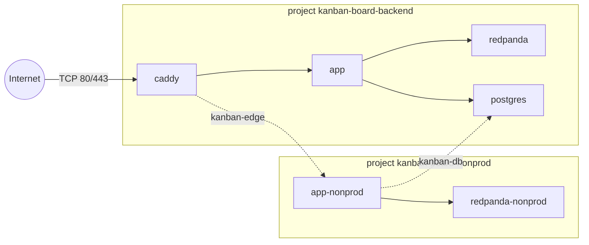

# 10 — Infrastructure and deployment

This layer is the physical deployment. One Netcup VPS runs two isolated environments, a
self-hosted PostgreSQL 16 database, two Redpanda brokers, and a Caddy edge proxy, all in Docker
Compose. It matters because every guarantee in the other chapters (sessions, optimistic locking,
the activity log) runs on this box. The box has no managed backups, no second node, and a fixed
7.8 GiB of memory.

**Read first:** [09 — Build, quality and CI](09-build-quality-and-ci.md) (the pipeline that calls
this layer), [11 — Observability](11-observability.md) (the seven monitoring containers on the
same VM).

**Main code:**

- [`docker-compose.prod.yml`](../../docker-compose.prod.yml) — production project, 11 services
- [`docker-compose.nonprod.yml`](../../docker-compose.nonprod.yml) — nonprod project, 2 services
- [`docker-compose.yml`](../../docker-compose.yml) — local development only
- [`Caddyfile`](../../Caddyfile) and [`docker/caddy/Dockerfile`](../../docker/caddy/Dockerfile)
- [`docker/postgres-init/01-create-databases-and-roles.sh`](../../docker/postgres-init/01-create-databases-and-roles.sh)
- [`infra/vm/`](../../infra/vm/README.md) — the in-VM firewall policy
- [`.github/workflows/deploy.yml`](../../.github/workflows/deploy.yml) — only the VM-side steps
  are described here
- [`docs/INFRA_ARCHITECTURE.md`](../INFRA_ARCHITECTURE.md) and
  [`docs/INFRA_RUNBOOK.md`](../INFRA_RUNBOOK.md) — the two main written sources

## Summary of decisions

| ID | Decision | Main reason |
|----|----------|-------------|
| INFRA-01 | Host on one self-managed Netcup VPS (x86_64), not AWS, Oracle Free Tier, or a PaaS | AWS pricing risk; Oracle capacity never became available; fixed hourly price |
| INFRA-02 | Three standalone Compose files, not overlays | Different service sets; nonprod needs its own project name |
| INFRA-03 | Pin the Compose project name in the file (`name:`) | A directory move once created a second project with empty volumes |
| INFRA-04 | Only Caddy publishes host ports, and only 80/443 | Every other listener stays on Docker networks; a CI gate enforces it |
| INFRA-05 | Version-controlled `DOCKER-USER` policy, applied by a systemd unit | The host `INPUT` chain does not filter Docker-published traffic |
| INFRA-06 | Caddy automatic HTTPS with Let's Encrypt HTTP-01 on DuckDNS subdomains | Real public certificate at zero cost; domain is swappable |
| INFRA-07 | Custom Caddy image with a SHA-pinned `caddy-ratelimit` module and a literal tag | The module has one old tag; a literal tag keeps Caddy running across app deploys |
| INFRA-08 | Two partitioned rate-limit zones keyed on `{remote_host}`, production only | Caddy is the true edge; a composed zone locked a client out of the whole API |
| INFRA-09 | Explicit `caddy reload` plus an admin API readback on `127.0.0.1` | A bind-mounted Caddyfile edit does not recreate the container |
| INFRA-10 | Replace Neon with a self-hosted `postgres:16` container on the VM | Neon's shared free quota ran out and stopped both environments |
| INFRA-11 | One shared Postgres instance, two databases, two roles, `REVOKE CONNECT FROM PUBLIC` | Memory budget; the revoke is the whole isolation mechanism |
| INFRA-12 | No host port and no TLS for Postgres | The JDBC hop never leaves the VM |
| INFRA-13 | Fresh start (no data copy), then delete the Neon project | Neon was quota-blocked; no fallback value in keeping it |
| INFRA-14 | Conservative Postgres profile with a checked memory invariant | The first profile could allocate twice its own cgroup cap |
| INFRA-15 | Measure every `mem_limit` with a restart ladder; adopt a value above the floor | Arithmetic and idle readings proved wrong more than once |
| INFRA-16 | Redpanda with explicit `--smp`/`--memory` and a cgroup cap above `--memory` | `dev-container` mode assumes it owns the VM; equal caps broke startup |
| INFRA-17 | Keep the app cap at 3g even though it uses about 14% | The JVM sizes its heap from the cgroup limit |
| INFRA-18 | Nonprod is a separate Compose project behind a profile, sharing only external networks | Makes a cross-environment re-env of production impossible by structure |
| INFRA-19 | Nonprod reset endpoint: profile-gated and token-checked | It must not exist in production at all |
| INFRA-20 | Deploy = SCP files + SSH `compose pull` / `up -d`; the VM never builds | The VM has no source checkout; one image tag per commit |
| INFRA-21 | CI verifies Flyway migrations on the VM over SSH, against the real database | No port exposure; an empty database cannot detect migration drift |
| INFRA-22 | The app also runs Flyway at startup, with `ddl-auto=validate` and a health dependency on Postgres | A cold boot must not become a restart loop |
| INFRA-23 | One deploy at a time per environment; a new push queues, it does not cancel | A cancelled SCP step leaves half-copied files |
| INFRA-24 | A CI gate holds the SCP file list equal to the Compose bind mounts | Four config files silently stopped deploying for 14 deploys |
| INFRA-25 | Rotate container logs at 10 MB x 3 files | Bounds disk use per container to 30 MB |
| INFRA-26 | No automated database backup yet (deferred) | Scope decision; the gap is documented, not hidden |

## The hosting target: AWS, then Oracle, then Netcup

### What it is

Production runs on one Netcup "VPS Lite 2 G12s" in Vienna. The runbook records the measured
shape. It has 4 vCPU, 7.8 GiB RAM, a 251 GB disk, Debian 13, and the public IPv4 `159.195.114.230`
([INFRA_RUNBOOK.md, "Provider and host"](../INFRA_RUNBOOK.md)). Both environments, the database,
both brokers and the monitoring stack share this one machine. A host-wide `docker ps` shows 13
containers: 11 in the production project and 2 in the nonprod project.

### How it works

The VM is a plain Docker host. Access is SSH with keys only (`PasswordAuthentication no`). CI
connects as a dedicated `deploy` user in the `docker` group, which cannot `sudo`. A second user,
`deploy-nonprod`, owns the nonprod directory
([INFRA_RUNBOOK.md, "Deploy user setup — Plan 05-05 Task 1"](../INFRA_RUNBOOK.md)). The deploy
directories are `/opt/deploy/kanban-board-backend/` and `/opt/deploy/kanban-board-nonprod/`.
Each holds a Compose file and a real `.env` file that is never committed.

DNS is DuckDNS. The A record points at the static IPv4 address, and no dynamic-update client runs
on the host ([INFRA_RUNBOOK.md, "DNS — DuckDNS"](../INFRA_RUNBOOK.md)).

### Why we chose it

**INFRA-01.** The chain of decisions has three steps:

1. On 2026-08-03 the operator deleted the AWS EC2 instance and its RDS database because of
   "unpredictable pricing risk" ([PROJECT.md, Context](../../.planning/PROJECT.md)).
2. The replacement plan was Oracle Cloud Always Free (A1 Flex, ARM64) in `eu-zurich-1`
   ([05-CONTEXT.md](../../.planning/milestones/v1.2-phases/05-infra-migration/05-CONTEXT.md)).
   More than 200 automated provisioning attempts over more than 10 hours all failed. The region
   has one availability domain and no capacity date.
3. The team screened alternatives against the same constraints: free or near-free, self-hosted,
   and no metered billing. It picked Netcup, with 4 vCPU / 8 GB / 160 GB and hourly billing
   ([05-03-SUMMARY.md](../../.planning/milestones/v1.2-phases/05-infra-migration/05-03-SUMMARY.md)).

The operator also decided earlier to use a self-managed VM and not a PaaS (Railway, Render,
Fly.io). The context file records this as a prior decision; it does not record the reason
([05-CONTEXT.md, "Specific Ideas"](../../.planning/milestones/v1.2-phases/05-infra-migration/05-CONTEXT.md)).

### Alternatives we rejected

| Option | Why rejected (source: 05-03-SUMMARY.md) |
|--------|------------------------------------------|
| AWS again | The project's own billing-risk history |
| Oracle A1 Flex | Structural capacity shortage |
| GCP / Azure free tiers | Region-restricted or time-limited |
| Hetzner CX33 | Unavailable in every location checked |
| A PaaS | Decided before Phase 5; reason not recorded |

### Trade-offs and limits

- One VM is a single point of failure for both environments and for the only copy of the data.
- The pivot changed the CPU architecture. CI built `linux/arm64` images for Oracle. Netcup is
  x86_64, and the build step was changed to `linux/amd64` before the first deploy (`73c1a2d`).
  The runbook tells the reader to treat any other ARM64 assumption as a bug from the same cause.
- The Netcup Cloud Firewall is a panel setting. No file in this repository describes it, so no
  pull request reviews it.

### Where this is recorded

- [05-03-SUMMARY.md](../../.planning/milestones/v1.2-phases/05-infra-migration/05-03-SUMMARY.md)
  (pivot and screened options)
- [INFRA_RUNBOOK.md, "Provider and host"](../INFRA_RUNBOOK.md)
- Commits `73c1a2d` (provision and harden the VM), `95a5519` (close out plan 05-03)

## Three Compose files and a pinned project name

### What it is

The repository has three Compose files. None of them extends another.

| File | Project name | Used where | Services |
|------|--------------|-----------|----------|
| [`docker-compose.yml`](../../docker-compose.yml) | directory-derived | developer machine | `postgres`, `redpanda`, `app` (built locally) |
| [`docker-compose.prod.yml`](../../docker-compose.prod.yml) | `kanban-board-backend` | VM | `caddy`, `postgres`, `app`, `redpanda`, plus 7 monitoring services |
| [`docker-compose.nonprod.yml`](../../docker-compose.nonprod.yml) | `kanban-board-nonprod` | VM | `redpanda-nonprod`, `app-nonprod` |

### How it works

The production file pins its project name at the top level
([`docker-compose.prod.yml` L35-L40](../../docker-compose.prod.yml#L35-L40)):

```yaml
# Pinned so `docker compose` commands converge on the same project regardless of which directory
# the file happens to live in on the host -- without this, Compose derives the project name from
# the CWD basename, ...
name: kanban-board-backend
```

Compose prefixes every named volume with the project name. So the pin also fixes the real volume
names, for example `kanban-board-backend_postgres-data`.

The local file publishes Postgres on host port **5433**, not 5432
([`docker-compose.yml` L8-L15](../../docker-compose.yml#L8-L15)). On some developer machines a
native PostgreSQL already owns 5432 and answers the connection. The symptom is an authentication
failure, not "connection refused", so it is slow to diagnose. The container-internal port stays
5432, so the local `app` container is not affected. The local file also runs Redpanda in
`--mode dev-container` and publishes 9092 and 8081 for host tools. Production does neither.

### Why we chose it

**INFRA-02.** The prod file header says that the files differ in shape. Production adds `caddy`
and the monitoring services, so an overlay would not fit
([`docker-compose.prod.yml` L6-L14](../../docker-compose.prod.yml#L6-L14)). Nonprod has a second
reason, described under INFRA-18: one file can carry only one project name.

**INFRA-03.** Plan 05-05 moved the production files from `/root` to
`/opt/deploy/kanban-board-backend/`. Compose then derived a new project name from the new
directory. A `docker compose up` created a second, unrelated project with fresh, empty volumes.
The cutover lost the 14 registered Avro schemas (they were still in the orphaned
`root_redpanda-data` volume) and forced a new Let's Encrypt certificate. The operator copied the
old Redpanda volume into the new one with a one-off `alpine` container. All 14 subjects came
back ([INFRA_RUNBOOK.md, "Deviation found and fixed: Compose project name was directory-derived"](../INFRA_RUNBOOK.md)).
The fix is the `name:` pin (`5eea749`). The nonprod file copies the same pin.

### Trade-offs and limits

- Three files can drift. For example, the Postgres and Redpanda image tags must stay equal by
  hand; the comments say so ("one Postgres version tested across every environment").
- The runbook still lists three orphaned `root_*` volumes on the VM as "safe to remove once this
  cutover has been running stable". The runbook does not record their removal.

### Where this is recorded

- [INFRA_RUNBOOK.md, "Deploy user setup — Plan 05-05 Task 1"](../INFRA_RUNBOOK.md)
- [`.planning/quick/260804-nd3-remap-docker-compose-yml-postgres-host-p/`](../../.planning/quick/)
  (the 5433 remap, commit `ffa5587`)

## Network exposure: only 80 and 443

### What it is

Only the `caddy` container publishes host ports, and only 80 and 443. Every other listener (the
app on 8080, Kafka on 19092, the Schema Registry on 8081, Postgres on 5432) is reachable only on a
Docker network.

The VM has five Docker networks that matter here:

| Network | Kind | Members |
|---------|------|---------|
| `kanban-board-backend_default` | project default | all production services |
| `kanban-edge` | external, shared | `caddy`, `app-nonprod` |
| `kanban-db` | external, shared | `postgres`, `app-nonprod` |
| `kanban-metrics` | external, shared | `prometheus`, `redpanda-nonprod` |
| `kanban-board-nonprod_default` | project default | `app-nonprod`, `redpanda-nonprod` |

An operator created each external network once with `docker network create`. They are the only
things the two projects share.



### How it works

Traffic passes three filter layers
([INFRA_RUNBOOK.md, "Firewall — three layers"](../INFRA_RUNBOOK.md)):

1. **Netcup Cloud Firewall** — stateful, configured in the Netcup panel, outside this repository.
2. **Host `iptables` `INPUT`** — policy `DROP`, accepts 22, 80 and 443. This chain governs host
   daemons only (sshd). Docker DNATs published-port traffic in `nat PREROUTING`, so that traffic
   goes through `FORWARD`, never `INPUT`.
3. **`DOCKER-USER`** — the one chain Docker never writes itself. Since 2026-09-06 it holds five
   rules ([`docker-user-firewall.sh` L64-L72](../../infra/vm/docker-user-firewall.sh#L64-L72)):

```bash
-A ${CHAIN} -m conntrack --ctstate RELATED,ESTABLISHED -j RETURN
-A ${CHAIN} ! -i ${EXT_IF} -j RETURN
-A ${CHAIN} -p tcp -m conntrack --ctorigdstport 80 -j RETURN
-A ${CHAIN} -p tcp -m conntrack --ctorigdstport 443 -j RETURN
-A ${CHAIN} -j DROP
```

The first two rules must come before the `DROP`. Without them, container egress (image pulls, ACME
renewals) hangs, because the outbound SYN leaves but the reply is dropped. `--ctorigdstport`
matches the host port before DNAT. Today the mappings are identity (80→80, 443→443), so a wrong
`--dport` rule would pass every test. The script uses the conntrack form, so a future `8443:443`
mapping stays correct.

The systemd unit [`docker-user-firewall.service`](../../infra/vm/docker-user-firewall.service)
uses `PartOf=docker.service`. So the policy applies again after every Docker start, including
`systemctl restart docker`.

### Why we chose it

**INFRA-04.** The production file header and the app service comment give the reason. To publish
8080 would offer the whole API over plain HTTP and skip Caddy's TLS
([`docker-compose.prod.yml` L389-L392](../../docker-compose.prod.yml#L389-L392)). Kafka and the
registry "must never be internet-facing". Quick task 260905-qxi turned the rule into a gate,
[`scripts/verify-compose-ports.py`](../../scripts/verify-compose-ports.py). It fails CI in four
cases:

- A service other than `caddy` in the prod file gets a `ports:` key.
- A nonprod service gets a `ports:` key.
- `caddy` publishes more than 80/443.
- `network_mode: host` appears.

The gate runs in
[`invariant-checks.yml`](../../.github/workflows/invariant-checks.yml) on pull requests. The
workflow skips a pull request that changes only `docs/**`, `**/*.md` or `.planning/**`.

**INFRA-05.** On 2026-09-05 quick task 260905-qxi found that `DOCKER-USER` was empty, so no layer
inside the VM filtered traffic to a published container port. The fix (quick task 260906-feq,
commit `65c8409`) made the chain a reviewed file. The script header records why the team rejected
`netfilter-persistent save`. `iptables-save` captures the whole filter table, which freezes a
stale copy of Docker's own chains. Its boot-time restore also runs before Docker rebuilds them.

The team also decided not to apply the firewall from `deploy.yml`
([infra/vm/README.md](../../infra/vm/README.md)):

1. An automatic apply on every push has no review gate at apply time.
2. `iptables` is host-global, but `deploy.yml` deploys per environment. A firewall change affects
   both environments at once.

### Alternatives we rejected

- `netfilter-persistent save` for `DOCKER-USER` (stale snapshot, boot race).
- `--dport` matching (matches the container port after DNAT).
- An install step inside `deploy.yml` (no review gate, wrong scope).

### Trade-offs and limits

- **IPv6 is not filtered.** `ip6tables -P INPUT ACCEPT` is the live policy, and `docker-proxy`
  binds `[::]:80` and `[::]:443`. That traffic ends on a host socket and goes through
  `ip6tables INPUT`, so `DOCKER-USER` cannot reach it. The team left this open on purpose: the
  development machine has no IPv6 egress, so it could not prove a fix. It is tracked in
  [`2026-09-06-ipv6-published-ports-have-no-host-level-firewall.md`](../../.planning/todos/pending/2026-09-06-ipv6-published-ports-have-no-host-level-firewall.md).
- The policy is TCP only. HTTP/3 needs `443/udp` published and a matching rule.
- A hand-run `docker run -p` or `iptables -F DOCKER-USER` on the VM is invisible until someone
  runs `docker-user-firewall.sh check`.

### How we test it

- `verify-compose-ports.py` plus its self-test `verify-compose-ports-selftest.py`, which proves
  the gate can fail. Both run in CI.
- The live proof for `DOCKER-USER` was manual and off-box. A canary container on host port 49999
  answered `200` before the rules and timed out (`curl` exit 28) after. The `DROP` counter rose
  by exactly the 7 SYNs of the probe. The policy survived `systemctl restart docker` and a full
  reboot ([INFRA_RUNBOOK.md, "Layer 3"](../INFRA_RUNBOOK.md)).
- Drift check: `ssh netcup-prod '/usr/local/sbin/docker-user-firewall.sh check'`.

### Where this is recorded

- [INFRA_ARCHITECTURE.md, "Scenario (+1) View — Inbound Packet Path"](../INFRA_ARCHITECTURE.md)
- [`.planning/todos/completed/2026-09-05-docker-user-chain-empty-on-the-vm.md`](../../.planning/todos/completed/2026-09-05-docker-user-chain-empty-on-the-vm.md)
- [`.planning/quick/260906-feq-docker-user-iptables-rules-on-the-vm-sys/`](../../.planning/quick/260906-feq-docker-user-iptables-rules-on-the-vm-sys/)

## Caddy: HTTPS edge, reverse proxy and rate limiter

### What it is

Caddy is the only public entry point. The [`Caddyfile`](../../Caddyfile) has three site blocks:

| Site block | Upstream | Rate limit |
|-----------|----------|-----------|
| `{$APP_DOMAIN}` (production) | `app:8080` | `auth` and `general` zones |
| `{$APP_DOMAIN_NONPROD}` | `app-nonprod:8080` over `kanban-edge` | none |
| `{$APP_DOMAIN_MONITORING}` | `grafana:3000` | `grafana_login` zone (see chapter 11) |

`{$VAR}` is Caddy's placeholder for an environment variable, which Compose supplies from `.env.prod`.

### How it works

**Automatic HTTPS.** No block has `tls internal` or `auto_https off`. Caddy gets a real Let's
Encrypt certificate with the HTTP-01 challenge. That is why port 80 stays open: it serves the
challenge and the HTTP→HTTPS redirect. The `/data` and `/config` directories are named volumes
(`caddy-data`, `caddy-config`), so a recreated container reuses its certificates
([`docker-compose.prod.yml` L113-L119](../../docker-compose.prod.yml#L113-L119)).

**Custom image.** [`docker/caddy/Dockerfile`](../../docker/caddy/Dockerfile#L29-L36) builds Caddy
2.11.4 with `xcaddy` and the rate-limit module at a raw commit:

```dockerfile
FROM caddy:2.11.4-builder AS builder

RUN xcaddy build \
    --with github.com/mholt/caddy-ratelimit@5625512f24f6f59d6f64fb3aafe5eecff0b286db

FROM caddy:2.11.4

COPY --from=builder /usr/bin/caddy /usr/bin/caddy
```

CI builds and pushes this image. The VM only pulls it. The Compose file names it with a literal
tag, `rudenkovladimir/kanban-board-caddy:2.11.4-rl5625512f`, and
[`scripts/verify-caddy-image-tag.py`](../../scripts/verify-caddy-image-tag.py) recomputes that
tag from the Dockerfile and fails CI if they differ.

**Rate limits** ([`Caddyfile` L22-L68](../../Caddyfile#L22-L68)):

- `zone auth`: paths `/api/signin*` and `/api/signup*`, 20 events per 5 minutes per key.
- `zone general`: every other path, 120 events per 1 minute per key.
- Both zones use `key {remote_host}` and `ipv6_prefix 56` (one bucket per /56 IPv6 block).

**Reload after deploy.** Compose bind-mounts the Caddyfile read-only. The deploy job runs
`caddy reload` after `up -d`. It then reads the running config from the admin API at
`http://127.0.0.1:2019/config/` and fails if the `rate_limit` handler is absent
([`deploy.yml` L489-L530](../../.github/workflows/deploy.yml#L489-L530)).

### Why we chose it

**INFRA-06.** Phase 5 decision D-01 in
[05-CONTEXT.md](../../.planning/milestones/v1.2-phases/05-infra-migration/05-CONTEXT.md) chose a
free subdomain because the project owns no domain. A free subdomain that accepts an A record is
enough for Let's Encrypt HTTP-01. The decision is reversible: change `APP_DOMAIN` and the DNS
record. The Caddyfile comment adds that a self-signed certificate "would satisfy the letter of
HTTPS while failing its actual purpose". The named certificate volume exists because repeated
re-requests hit a week-long Let's Encrypt rate limit.

The nonprod and monitoring hostnames are listed exactly, never as a wildcard. DuckDNS is a shared
public suffix, so a wildcard would match other DuckDNS tenants (Phase 8 decision D-05).

**INFRA-07.** The Dockerfile header records the reasons
([`docker/caddy/Dockerfile` L4-L23](../../docker/caddy/Dockerfile#L4-L23)):

- The module has only one tag (`v0.1.0`), and `master` is 7 commits ahead, including a metrics
  fix. So the pin is a commit SHA. Go's checksum database still verifies it.
- The version literal appears in both `FROM` lines because Dependabot reads only literal tags,
  not an `ARG`.
- The Compose tag is a literal, not `${IMAGE_TAG}`, so a routine app deploy does not recreate the
  edge ([`docker-compose.prod.yml` L80-L92](../../docker-compose.prod.yml#L80-L92)).

**INFRA-08.** Decisions dated 2026-09-03 in the Caddyfile:

- `{remote_host}`, not `{client_ip}`: Caddy is the true edge (no CDN, no load balancer), so the
  TCP peer is the client. `{client_ip}` reads `X-Forwarded-For` once `trusted_proxies` is set,
  which would let an attacker choose the key.
- Partitioned zones: the first version let the zones compose. A request that the `auth` zone
  rejected still spent a `general` token. The team measured it: 130 signin attempts from one
  address used all 120 general events, and the next request to any endpoint got `429`. The
  `general` matcher now excludes the auth paths. The cost is a ceiling of 140 requests per minute
  per address instead of 120.
- 20 per 5 minutes, not 10: the key is an IP, and an office or CGNAT pool shares one bucket. A
  human chose 20.
- 120 per minute sits above the reference board-setup burst (56 calls, 55 in the `general` zone).
- Nonprod has no limit. Its end-to-end suites send many requests. It is also the negative
  control that proves the production limit does not leak into other blocks.

**INFRA-09.** A bind-mounted file's content is not part of Compose's config hash. So `up -d` does
nothing to `caddy` when its image tag has not changed, and before this fix no Caddyfile edit ever
reached production. The reload must run after `up -d`. On the first deploy of the custom image,
the old stock container had no `rate_limit` module and would reject the new file. The readback
uses `127.0.0.1`, not `localhost`: the admin API binds IPv4 only, and BusyBox `wget` tries the
`::1` record and does not fall back. That mistake would make every deploy red after `up -d` had
already swapped the app, and `cleanup-unused-image` would then delete the running image.

### Alternatives we rejected

- Floating `caddy:2` image (no module, not pinned).
- A module tag pin (`v0.1.0` misses the metrics fix).
- `{client_ip}` as the key (attacker-supplied once proxies are trusted).
- Composed zones (starvation, measured).
- A limit of 10 per 5 minutes on auth (too strict for shared IPs).

### Trade-offs and limits

- The server-wide `OPTIONS * HTTP/1.1` form is not limited. Go's `net/http` answers it before
  Caddy's routes run. Its cost is one TLS handshake and an empty `200`.
- A `429` from Caddy is not an RFC 7807 `application/problem+json` body, unlike every other API
  error. No `handle_errors 429` block exists yet.
- A matrix parameter on an earlier segment (`/api;a=b/signin`) avoids the auth zone. Spring
  answers such a request `401` without reaching the handler, so no bcrypt hash runs.
- Nothing can track the module SHA automatically. A bump is a manual act.
- The rate limiter keeps state per source address, so memory depends on unauthenticated traffic.
  See INFRA-15 for the 32m cap.

### How we test it

- [`verify-rate-limit.yml`](../../.github/workflows/verify-rate-limit.yml) (manual trigger) runs
  [`scripts/loadtest/run-rate-limit-verification.sh`](../../scripts/loadtest/run-rate-limit-verification.sh)
  against both hostnames: production must limit signin, nonprod must not.
- `verify-caddy-image-tag.py` in `invariant-checks.yml` and in the Caddy build job.
- The deploy job's admin API readback on every production deploy.

### Where this is recorded

- [`.planning/quick/260903-dvp-caddy-edge-rate-limiting/`](../../.planning/quick/260903-dvp-caddy-edge-rate-limiting/)
- [INFRA_ARCHITECTURE.md, "The Caddy reload (F-1, quick task 260903-dvp)"](../INFRA_ARCHITECTURE.md)
- Commits `77ece35` (custom image), `b1fcb40` (pin the compose service to it)

## PostgreSQL: from Neon to a self-hosted container

### What it is

One `postgres:16` container in the production project holds two databases, `kanban_prod` and
`kanban_nonprod`. Each has its own login role, `kanban_prod_app` and `kanban_nonprod_app`. The
container publishes no host port. The production `app` reaches it on the production default
network; `app-nonprod` reaches it on the external `kanban-db` network. Both use the host name
`postgres` ([`docker-compose.prod.yml` L155-L326](../../docker-compose.prod.yml#L155-L326)).

Through v1.2 the database was Neon serverless Postgres (Frankfurt), with production and nonprod as
two branches of one Neon project. That decision is reversed.

### How it works

The official image runs every script in `/docker-entrypoint-initdb.d` once, only when the data
directory is empty. The repository mounts
[`01-create-databases-and-roles.sh`](../../docker/postgres-init/01-create-databases-and-roles.sh#L51-L67)
there. It creates the roles and databases with `psql -v` variables:

```sql
CREATE ROLE :"prod_user" WITH LOGIN PASSWORD :'prod_pass';
CREATE DATABASE :"prod_db" OWNER :"prod_user";
REVOKE CONNECT ON DATABASE :"prod_db" FROM PUBLIC;
GRANT CONNECT ON DATABASE :"prod_db" TO :"prod_user";
```

The same four statements follow for nonprod. `:"var"` quotes a value as an identifier and `:'var'`
quotes it as a SQL literal, on the server side. The heredoc delimiter is single-quoted, so the
shell does not expand the body.

The app connects with a plain JDBC URL that has no `sslmode` parameter
([`application.properties` L54-L56](../../src/main/resources/application.properties#L54-L56)):

```properties
spring.datasource.url=jdbc:postgresql://${DB_HOST}:${DB_PORT:5432}/${DB_NAME}
```

The HikariCP pool is 5 connections per app, with `minimum-idle=2`
([`application.properties` L197-L202](../../src/main/resources/application.properties#L197-L202)).
Two apps give at most 10 connections against `max_connections=25`.

### Why we chose it

**INFRA-10.** Neon's Free plan gives 100 CU-hours of compute per month per *project*. Production
and nonprod were two branches of one project, so they shared the allowance. The pool settings
`minimum-idle=1` and `keepalive-time=120000` kept both computes awake on purpose, to avoid
cold-start latency. The allowance ran out mid-month, and both environments went down with no
deploy. The quota reset date was 2026-09-01, and only a paid plan could restore access earlier
([INFRA_RUNBOOK.md, "Self-hosted Postgres cutover — Plan 11-02"](../INFRA_RUNBOOK.md)). The team
moved the database onto the VM on 2026-08-26.

**INFRA-11.** Decision D-01 in
[11-CONTEXT.md](../../.planning/phases/11-migrate-database-from-neon-to-self-hosted-postgres/11-CONTEXT.md)
chose one shared instance. The trade-off table in
[11-01-PLAN.md](../../.planning/phases/11-migrate-database-from-neon-to-self-hosted-postgres/11-01-PLAN.md)
gives the reason. The memory budget binds: about 5.15 GiB of 7.8 GiB was already committed.
Also, Neon's failure (a shared per-project quota) has no self-hosted equivalent. A second container would
buy isolation against a failure that cannot happen here.

The `REVOKE CONNECT ... FROM PUBLIC` lines are the whole isolation mechanism. PostgreSQL grants
`CONNECT` on every database to the `PUBLIC` pseudo-role by default. Without the revoke, every role
can connect to every database, every app still boots, and nothing shows that isolation is absent.

**INFRA-12.** Decision D-03: no host port. Admin access is SSH plus `docker exec`, the same as
Redpanda. TLS on the JDBC hop was removed because the hop moved from the public internet to a
Docker bridge on the same VM. The Neon-era `DB_JDBC_PARAMS` override (TLS, channel binding, and
the PgBouncer workaround `prepareThreshold=0`) is gone. A client that demands SSL from a plaintext
listener fails hard, so leaving the old parameters would have broken the connection.

**INFRA-13.** Decisions D-04 and D-07: start with empty databases and let Flyway build the schema
(V1..V8 at cutover), then delete the Neon project. Neon was quota-blocked until 2026-09-01, so it
was not a usable fallback. The operator chose deletion with the one-way cost stated. All rows that
Neon held are gone. All sessions were lost too, so every signed-in browser was signed out.

### Alternatives we rejected

| Option | Why rejected (11-01-PLAN.md) |
|--------|------------------------------|
| Two Postgres containers, one per project | A second engine's memory floor on a tight box; two engines to patch |
| One database, two schemas (`prod`, `nonprod`) | Schema isolation (`REVOKE USAGE`) is easier to defeat through `search_path`; the nonprod reset endpoint TRUNCATEs, so a mistake would TRUNCATE production |
| Stay on Neon (paid plan) | Reason not recorded beyond cost; the quota block made the free plan unusable |
| `pg_dump` / `pg_restore` of Neon data | D-04 chose a fresh start |

### Trade-offs and limits

- `.env.prod` holds nonprod's database credentials (`NONPROD_DB_*`), because the init script runs
  in the production project. The names carry the `NONPROD_` prefix so an access review reads it
  as a decision, not a leak.
- A restart of the production project restarts the database and interrupts nonprod.
- `app-nonprod` cannot declare `depends_on: postgres`, because Compose cannot reference a service
  in another project. After a VM reboot it may restart a few times until the database is up.
- The init script runs once. A failed first boot leaves a non-empty volume, and every later start
  skips the script. The only recovery is `docker compose down -v` and a fresh start.
- The live volume was created with the first version of the script, which built SQL by string
  concatenation. A password with an apostrophe would have aborted first boot, and an injection-
  shaped password would have run as superuser. Plan 11-07 fixed the script, but the fix changes
  nothing in the existing volume.

### How we test it

- Isolation was proven live at cutover: each role tried to connect to the other database and got
  `FATAL: permission denied for database ... User does not have CONNECT privilege`. Each role still
  reached its own database with `SELECT 1`.
- [`scripts/verify-postgres-init-quoting.sh`](../../scripts/verify-postgres-init-quoting.sh)
  boots a throwaway container with hostile credential values (an apostrophe, an injection payload,
  a double-quoted identifier). Plan 11-07 ran it against the old script (failed) and the new one
  (passed). It is not in any CI workflow.

### Where this is recorded

- [11-CONTEXT.md](../../.planning/phases/11-migrate-database-from-neon-to-self-hosted-postgres/11-CONTEXT.md)
  (D-01 to D-13)
- [INFRA_RUNBOOK.md: "Database — self-hosted PostgreSQL", "Decommission Record — Plan 11-06",
  "Provisioning script hardening — Plan 11-07"](../INFRA_RUNBOOK.md)
- Commits `01b04d1` (shared service), `7a3874f` (cutover record), `a48706a` (decommission)

## Memory caps and how they are measured

### What it is

Every container has a `mem_limit`, which is a cgroup memory limit. When a process in the container
goes above it, the kernel OOM killer stops it. The current caps are:

| Container | Cap | Basis |
|-----------|-----|-------|
| `app` | 3g | Measured 2026-08-26; kept, see INFRA-17 |
| `redpanda` | 2200m (`--memory 2G`) | Measured 2026-08-16 |
| `postgres` | 256m | Corrected 2026-08-26 (plan 11-08) |
| `caddy` | 32m | Measured 2026-09-08 |
| `app-nonprod` | 1g | Measured 2026-08-26 |
| `redpanda-nonprod` | 900m (`--memory 512M`) | Raised 2026-09-11 after a crash loop |
| 7 monitoring containers | 32m to 768m | See [chapter 11](11-observability.md) |

### How it works

The team uses one method, a **restart ladder**:

1. Start from a generous cap (Iteration 0).
2. Lower the cap one rung, force-recreate the container, and run a fixed workload.
3. Pass the rung only if `RestartCount` stays 0 through the workload and a 20-second settle time.
4. Continue down until a rung fails, and record the failure (`dmesg` OOM lines).
5. Adopt a value with headroom above the lowest passing rung, then re-verify it from a fresh
   recreate.

The standard workload is a 54-request burst through the public HTTPS API. It runs after a signup
and a board create, and it makes 6 columns, 24 tasks and 24 subtasks. With the two setup calls,
the total is 56 HTTP calls. The Postgres ladder added a nonprod reset and an app recreate that
re-runs Flyway, because those paths set its peak.

### Why we chose it

**INFRA-15.** Arithmetic and short tests proved wrong several times, so each cap carries its own
measured basis in a comment. Examples from the compose files:

- **Postgres, first pass (plan 11-03):** 512m down to 40m all passed. The 32m rung failed with three
  OOM kills in about 30 seconds and real HTTP 500s on the public API. The team adopted 64m, not 40m,
  because 40m left only about 10 MiB above the 29.7 MiB peak.
- **Nonprod Redpanda (plan 08-03):** 128M passed; 96M looked healthy at first but crash-looped
  under sustained load (`RestartCount=22`, exit code 139, Seastar allocation failure). A single
  startup check was too shallow, so the team re-verified 128M end to end.
- **Caddy (plan 12-06):** 256m down to 16m passed; 8m was killed within about a second. The team
  adopted 32m, not 16m. The extra margin covers the rate limiter's per-address state, which the
  test could exercise from only one source address.

**INFRA-14.** The 64m Postgres cap was wrong in a way the ladder could not see. The engine ran
with `shared_buffers=128MB`, twice the cap. The test dataset had about 55 rows. The kernel
charges a page to the cgroup only when something touches it. So the flat 29-30 MiB peak described
the dataset, not the cap. Plan 11-08 fixed the pair
([`docker-compose.prod.yml` L192-L249](../../docker-compose.prod.yml#L192-L249)) and wrote the
rule into [`scripts/verify-postgres-memory-invariant.py`](../../scripts/verify-postgres-memory-invariant.py):

1. `shared_buffers` ≤ `mem_limit` / 4 → 64 MB ≤ 256 MB / 4.
2. `shared_buffers` + `max_connections` × `work_mem` ≤ 0.85 × `mem_limit` →
   64 + 25 × 4 = 164 MB ≤ 217.6 MB (64.1% of the cap).

Both rules fail on the old pair (64m with 128MB). The team re-validated with a 127 MB `pgbench`
dataset and 24 concurrent backends. The irreclaimable memory (anon plus shmem) held at about
84 MB, 32.8% of the cap. The team also reproduced the old pair live, and the kernel killed a
Postgres backend. The engine profile stays conservative on purpose (decision D-11). The box is a
shared VPS, not a dedicated database server, so the common "25% of RAM" rule does not apply.

**INFRA-16.** Redpanda runs with `--overprovisioned --smp 1 --memory 2G`, not the local
`--mode dev-container`. The dev preset lets Redpanda assume it owns the whole machine, which is an
OOM path next to the JVM ([`docker-compose.prod.yml` L429-L470](../../docker-compose.prod.yml#L429-L470)).
The first cgroup cap was exactly 2G, and startup failed:
`insufficient physical memory: needed 2147483648 available 2078277632`. A cap equal to Seastar's
own request leaves no room for accounting overhead, so the team set 2200m. Under the 54-request
burst Redpanda used 347.8 MiB, under 18% of its limit, so the team kept the values.

**INFRA-17.** The app uses about 428-436 MiB, about 14% of 3g. The team kept 3g anyway. The JVM has
no `-Xmx` and uses `MaxRAMPercentage=25%` of the container limit, so a 3g cap gives a heap of about
768 MB. A lower cap would shrink the heap under real traffic that the light test data cannot
exercise ([`docker-compose.prod.yml` L334-L362](../../docker-compose.prod.yml#L334-L362)).

### OOM history

| Date | Container | What happened | Source |
|------|-----------|---------------|--------|
| 2026-08-16 | `redpanda` | Would not start with a cap equal to `--memory` | 05-04 Task 3 |
| 2026-08-18 | `redpanda-nonprod` | 96M rung crash-looped (ladder experiment) | 08-03 |
| 2026-08-26 | `postgres` | 32m rung: 3 kills, HTTP 500s (ladder experiment) | 11-03 |
| 2026-08-26 | `postgres` | Old 64m/128MB pair reproduced: 1 backend killed | 11-08 |
| 2026-09-08 | `cadvisor`, `grafana` | 6 and 2 kills under real use; raised to 128m and 768m | 12-05 addendum |
| 2026-09-11 | `redpanda-nonprod` | Crash loop at 128M; `__consumer_offsets` 3.0G and `_schemas` 1.0G had grown | quick task 260911-gkz |

The Netcup "Screen" console keeps old kernel lines forever, with timestamps in seconds since boot.
On 2026-09-02 a screenshot of the 2026-08-26 kills was reported as an outage. The runbook now has
a triage order. Curl both health endpoints first, then run `docker inspect`, then `dmesg -T`.
Convert the time zones, because `dmesg -T` shows CEST and `docker inspect` shows UTC
([INFRA_RUNBOOK.md, "Triage — dating what the Netcup SCP Screen console shows"](../INFRA_RUNBOOK.md)).

### Trade-offs and limits

- The caps now sum to more than the host has. Production: 32 + 256 + 3072 + 2200 + 32 + 256 + 768
  + 256 + 64 + 128 + 32 = 7096 MiB. Nonprod: 1024 + 900 = 1924 MiB. Total 9020 MiB against a
  7945 MiB host with no swap. The runbook's "about 6.4 GiB" sum (plan 12-05) left out nonprod and
  predates the 768m Grafana and 900m Redpanda caps. The measured `free -m` "available" values in
  the runbook are between 5110 and 6069 MiB, so real use is far below the caps. But the caps no longer guarantee that all
  containers fit at their limits together.
- `pg_stat_statements` (quick task 260911-gkz) adds shared memory that the 256m measurement did
  not include. The compose comment marks the measurement as stale.
- Several caps came from short bursts. A longer re-ladder is open:
  [`2026-09-08-cadvisor-grafana-and-caddy-mem-limits-need-a-longer-observation-window-re-ladder.md`](../../.planning/todos/pending/2026-09-08-cadvisor-grafana-and-caddy-mem-limits-need-a-longer-observation-window-re-ladder.md).
- The Redpanda bump of 2026-09-11 treats the symptom. The comment says the real fix is a retention
  or compaction policy on `__consumer_offsets` and `_schemas`.

### How we test it

- `python3 scripts/verify-postgres-memory-invariant.py` prints `invariants OK: mem_limit=256MB
  shared_buffers=64MB work_mem=4MB max_connections=25 worst-case=164MB (64.1% of cap)` and exits 0.
  No CI workflow runs it; see "Known gaps".
- The runbook records each ladder rung by rung. The sections are:
  - "Nonprod resource measurement — Plan 08-03"
  - "Self-hosted Postgres resource measurement — Plan 11-03"
  - "Postgres memory profile correction — Plan 11-08"
  - "Caddy resource measurement — Plan 12-06"

### Where this is recorded

- The `MEASURED BASIS` and `CORRECTION` comments in both deployed compose files
- Commits `85a4cf1` (Redpanda cap), `dfab3e4` (Postgres floor), `dd053df` and `8cb3deb` (Postgres
  correction and its committed check), `9d13e77` (cadvisor/Grafana), `e6bb28d` (nonprod Redpanda)

## The nonprod environment

### What it is

Nonprod is a second, isolated copy of the backend on the same VM, at
`kanban-board-rud-vlad-473-nonprod.duckdns.org`. It has its own Compose project, its own Redpanda
broker and Schema Registry, and its own database in the shared Postgres instance. It also has its
own Docker Hub repository (`kanban-board-backend-nonprod`). It exists so that end-to-end suites (for example,
the frontend's) can run against a real deploy and reset it to empty
([Phase 8 folder](../../.planning/milestones/v1.3-phases/08-isolated-nonprod-environment-live-and-resettable/)).

### How it works

- Both services have `profiles: ["nonprod"]`. A bare `docker compose up` in the nonprod directory
  creates zero containers ([`docker-compose.nonprod.yml` L15-L17](../../docker-compose.nonprod.yml#L15-L17)).
- `app-nonprod` joins `kanban-edge` with the alias `app-nonprod`, so production's Caddy can reach
  it by that name. `redpanda-nonprod` does not join `kanban-edge` or `kanban-db`.
- The app runs with the Spring profile `nonprod`, which registers the reset endpoint.

The reset endpoint is `POST /api/admin/reset` with an `X-Reset-Token` header
([`ResetController`](../../src/main/java/com/vrudenko/kanban_board/controller/ResetController.java#L52-L110)):

- `?fullReset=true` truncates every Postgres table except `flyway_schema_history` and empties the
  Kafka activity topics. It answers `204`.
- Without that parameter, it deletes only the users named in a `userIds` body (added by quick task
  260829-ii3).
- A wrong or missing token gets the same `403` body, so a probe cannot tell the two apart. The
  comparison uses `MessageDigest.isEqual` (constant time).
- A `@PostConstruct` check refuses to start if the configured token is blank or shorter than 32
  characters.

### Why we chose it

**INFRA-18.** The runbook and the file header give two reasons for a separate file and project
([INFRA_RUNBOOK.md, "Nonprod bring-up — Plan 08-01", "Deviations"](../INFRA_RUNBOOK.md)):

1. Requirement NONPROD-01 needs a distinct project name, and one Compose file carries one name.
2. The researched alternative, `docker compose -f docker-compose.prod.yml --env-file .env.nonprod
   --profile nonprod up -d`, targets every service in the project. Compose would re-resolve
   production's own `app` against nonprod's `DB_*` values and point the live production container
   at the nonprod database. A separate file makes that impossible by structure, not by operator
   care.

Colocation on the same VM was conditional. Phase 8 decision D-07 set a rule for the Redpanda memory
measurement. If it shows that the VM cannot hold both, stop and ask before you buy a second VPS.
A second VPS (about €4/month) is a recurring cost. The measurement showed that the VM could hold both.

**INFRA-19.** Phase 8 decisions D-01 and D-02
([08-CONTEXT.md](../../.planning/milestones/v1.3-phases/08-isolated-nonprod-environment-live-and-resettable/08-CONTEXT.md)):
a shared-secret header and a profile gate. The gate makes sure that the endpoint cannot exist
in a production build. The controller Javadoc says that neither control is enough alone. If a
deploy ever set the `nonprod` profile in production by mistake, the token still protects the
endpoint. D-03 chose a
truly empty reset target, with no seed data. Each test creates its own fixtures.

### Alternatives we rejected

- Extend `docker-compose.prod.yml` with a nonprod profile (the re-env risk above).
- Session auth, an IP allowlist, or a hidden hostname for the reset endpoint (D-01).
- A seeded fixture state after reset (D-03).
- A second VPS for nonprod (not needed after measurement; D-07 required approval first).

### Trade-offs and limits

- Nonprod is not isolated at the host level. It shares the kernel, the Caddy container, the
  Postgres engine and the firewall with production.
- A restart of the production project interrupts nonprod (the shared database).
- Production's Caddy must be recreated once to join `kanban-edge`.

### How we test it

- [`ResetEndpointProfileGatingTest`](../../src/test/java/com/vrudenko/kanban_board/security/ResetEndpointProfileGatingTest.java):
  `should_registerNoResetBeans_when_nonprodProfileIsInactive` and
  `should_registerNoResetSecurityChain_when_nonprodProfileIsInactive`.
- [`ResetControllerE2ETest`](../../src/test/java/com/vrudenko/kanban_board/e2e/reset/ResetControllerE2ETest.java)
  and [`ResetServiceE2ETest`](../../src/test/java/com/vrudenko/kanban_board/e2e/reset/ResetServiceE2ETest.java).
- Live proof on 2026-08-18. After the reset, 8 tables went to 0 rows and `flyway_schema_history`
  stayed at 7. The same call against production answered `401 UNAUTHENTICATED`, because the bean
  does not exist there ([INFRA_RUNBOOK.md, "Nonprod reset endpoint — Plan 08-02"](../INFRA_RUNBOOK.md)).
- After a deploy, CI job `health-check-nonprod` polls the nonprod health endpoint (see chapter 09).

### Where this is recorded

- [Phase 8 folder](../../.planning/milestones/v1.3-phases/08-isolated-nonprod-environment-live-and-resettable/):
  08-CONTEXT.md, 08-01-PLAN.md (design alternatives), 08-03-SUMMARY.md (memory)
- Commits `e229ed2` (nonprod stack), `818c14a` (reset endpoint), `14dd89d` (targeted delete)

## The deploy mechanism, seen from the host

### What it is

CI (chapter 09) builds the images and pushes them to Docker Hub. This section describes what then
happens on the VM. The VM has no source checkout and never builds an image.

### How it works

```mermaid
sequenceDiagram
    participant CI as GitHub Actions runner
    participant VM as VM (deploy user)
    participant PG as postgres
    participant App as app
    CI->>VM: scp migration SQL to ci-flyway-verify/production/
    CI->>VM: ssh: docker run --network kanban-db postgres:16 pg_isready
    CI->>VM: ssh: docker run --network kanban-db flyway/flyway:11.7.2 migrate
    VM->>PG: migrations apply to kanban_prod
    CI->>VM: scp compose file, Caddyfile, init script, 4 monitoring configs
    CI->>VM: ssh: export IMAGE_TAG; compose pull app caddy; compose up -d
    VM->>App: recreate app (new tag)
    App->>PG: Flyway at startup (no-op), Hibernate validate
    CI->>VM: ssh: caddy reload, then admin API readback
```

The production steps in order:

1. **`flyway-verify`**
   ([`deploy.yml` L267-L336](../../.github/workflows/deploy.yml#L267-L336)). SCP with `rm: true`
   copies `src/main/resources/db/migration` to a staging directory. Over SSH, a one-off
   `postgres:16` container runs `pg_isready -h postgres` on the `kanban-db` network. If the
   database is unreachable, the job stops with a named error. Then a one-off `flyway/flyway:11.7.2`
   container runs `migrate` against `jdbc:postgresql://postgres:5432/${DB_NAME}`.
2. **`deploy-to-netcup`**
   ([`deploy.yml` L394-L529](../../.github/workflows/deploy.yml#L394-L529)). SCP copies seven
   paths to `/opt/deploy/kanban-board-backend/` without `rm`, because that directory also holds
   `.env.prod`. The SSH script then runs:

```bash
set -e
cd /opt/deploy/kanban-board-backend
export IMAGE_TAG=${{ needs.build-and-push-docker-image.outputs.image_tag }}
docker compose --env-file ./.env.prod -f docker-compose.prod.yml pull app caddy
docker compose --env-file ./.env.prod -f docker-compose.prod.yml up -d
```

   `IMAGE_TAG` is the commit's short SHA. A shell variable outranks `--env-file`, so this commit's
   tag wins, and the job never edits `.env.prod`. `up -d` recreates `app` (its tag changes on every
   commit) and leaves `redpanda` and `postgres` running when their config is unchanged.
3. **Startup.** The new `app` waits for `postgres` and `redpanda` to be healthy (`depends_on:
   condition: service_healthy`). Spring Boot runs Flyway at startup (the `flyway-core` dependency
   is on the classpath, and no property disables it). Hibernate then runs with
   `spring.jpa.hibernate.ddl-auto=validate`. Because step 1 already applied the migrations, the
   startup run is normally a no-op.
4. **Caddy reload and readback** (INFRA-09).
5. **`register-schemas-production`** registers the 14 Avro schemas after the deploy (see the Kafka
   chapter and chapter 09).

Nonprod does the same with `docker-compose.nonprod.yml` and `--profile nonprod`, except that it
starts `redpanda-nonprod`, registers the schemas, and only then starts `app-nonprod`.

On shutdown, the app uses `server.shutdown=graceful` with an 8-second phase timeout, below Docker's
10-second stop grace period ([`application.properties` L7-L17](../../src/main/resources/application.properties#L7-L17)).

### Why we chose it

**INFRA-20.** The app image is pulled by tag "because the VM has no source checkout to build
from" ([`docker-compose.prod.yml` L329-L332](../../docker-compose.prod.yml#L329-L332)). Phase 5
decision D-03 first proved the stack by hand on the VM, and only then automated it. So the team
could trace a failure to the stack or to the pipeline, not to both. The `set -e` line exists because
`appleboy/ssh-action` v1.2.5 has no fail-fast input. An earlier fix used a `script_stop: true` key
that the action ignored, and a failed schema registration let `up -d` run anyway.

**INFRA-21.** After the cutover to self-hosted Postgres, the GitHub runner had no route to a
container with no host port, and both Flyway jobs failed. Decision D-13 (plan 11-05) chose a
one-off container on the VM over SSH. The runbook records the option set
([INFRA_RUNBOOK.md, "CI Flyway verification over SSH — Plan 11-05"](../INFRA_RUNBOOK.md)):

| Option | Result |
|--------|--------|
| A: one-off container on the VM over SSH | **Picked.** No port exposure; same pattern as schema registration; container DNS works inside the network |
| B: SSH port-forward from the runner | Rejected: needs a loopback host bind (an exception to D-03) or an unstable bridge IP |
| C: ephemeral Postgres on the runner | Rejected: an empty database cannot detect drift against the real schema history |

The same plan moved `DB_HOST` and `DB_NAME` from secrets to variables. GitHub masks any log line
that contains a secret value, so a wrong-environment mistake would have stayed hidden in the log.

**INFRA-22.** The `postgres` health dependency is "not cosmetic". The app runs Flyway during
startup. So a start before the database accepts connections turns a cold boot into a restart
loop ([`docker-compose.prod.yml` L366-L370](../../docker-compose.prod.yml#L366-L370)). The
healthcheck uses `pg_isready -h 127.0.0.1`. During initialization, the image runs a temporary
server with no TCP listener, so a socket-based check could report ready while the init script
still runs.

**INFRA-23.** The deploy job uses `concurrency: group: deploy-to-netcup-vm` with
`cancel-in-progress: false`. A cancel could stop the SCP step halfway and leave a half-copied
compose file. Nonprod has its own group, `deploy-to-nonprod-vm`.

**INFRA-24.** Phase 12 added four bind-mounted monitoring configs, but the SCP `source:` list kept
only three entries. Production served hand-copied config files, frozen at 2026-09-07, behind 14
green deploys. The file timestamps on the VM showed the difference. Quick task 260908-sj9 extended
the list to seven and added
[`scripts/verify-deploy-scp-coverage.py`](../../scripts/verify-deploy-scp-coverage.py). The script
fails a pull request if the SCP list does not include a repo-relative bind mount
([INFRA_RUNBOOK.md, "Deploy SCP coverage gap"](../INFRA_RUNBOOK.md)).

**INFRA-25.** All services share the `x-logging` anchor: `json-file`, `max-size: "10m"`,
`max-file: "3"` ([`docker-compose.prod.yml` L20-L33](../../docker-compose.prod.yml#L20-L33)). Worst
case is 30 MB per container. One anchor, not per-service copies, so a new service cannot miss it.

### Trade-offs and limits

- **Schema first, code second.** `flyway-verify` applies migrations to the real production
  database before the new image reaches the VM. The delivery diagram says it directly.
  It says: "Schema change and the code that consumes it are not deployed atomically." Every migration must work
  with the currently running code.
- A green deploy does not prove a healthy app. `up -d` returns when the container starts, not when
  it is healthy. Production has no post-deploy health gate; nonprod has one.
- SCP copies in one direction. A file deleted from the repository stays on the VM.
- A config file that arrives is not always applied. A bind-mounted file's content change does not
  recreate its container. Grafana dashboards reload every 30 seconds; Grafana datasources,
  Prometheus, Loki and Promtail need a restart
  ([todo](../../.planning/todos/pending/2026-09-08-scp-d-config-changes-do-not-reach-the-running-container-without-a-restart.md)).
- Docker Hub publishes no `latest` tag, and old tags are pruned. A hand bring-up with a stale
  `IMAGE_TAG` fails with "not found". This happened in plans 08-01 and 11-02.

### How we test it

- `verify-deploy-scp-coverage.py` and its self-test in `invariant-checks.yml`.
- The Flyway gate was proven to fail on purpose: commit `125eebb` broke the guard, the run went
  red, and `0a8571e` reverted it. After plan 11-05 the runbook records a live green run and a
  "Gate still bites" check.
- The first automated deploy (commit `56f093c`, run `31962045626`) was confirmed with
  `docker inspect` on the VM, which showed the image tag equal to the commit SHA.

### Where this is recorded

- [INFRA_ARCHITECTURE.md, "Scenario (+1) View — Delivery Path"](../INFRA_ARCHITECTURE.md)
- [INFRA_RUNBOOK.md, "Automated deploy — Plan 05-05 Task 2 and Task 3"](../INFRA_RUNBOOK.md)
- Commits `a536e60` (Flyway over SSH), `5d31c5e` (SCP coverage gate)

## Backups

### What it is

There is no backup of either database. A container loss or a volume loss on the Netcup VM loses
all data. The runbook calls it "total, unrecoverable data loss of everything in `kanban_prod` and `kanban_nonprod`"
([INFRA_RUNBOOK.md, "Backups and restore"](../INFRA_RUNBOOK.md)).

### Why we chose it

**INFRA-26.** Decision D-12 of Phase 11 narrowed the scope: document the loss of Neon's
point-in-time recovery, and defer the automation. Neon gave that recovery at no engineering cost;
the self-hosted instance replaces none of it.

### Trade-offs and limits

The runbook contains a manual `pg_dump -Fc` / `pg_restore --clean --if-exists` procedure with the
real container names. Nobody has run it, so it is not proven. To close the gap, the team needs a
scheduled dump, off-host storage, a retention policy, and one real test restore. The open item is
[`2026-08-20-no-documented-backup-restore-runbook-for-prod-db.md`](../../.planning/todos/pending/2026-08-20-no-documented-backup-restore-runbook-for-prod-db.md).

## Incident: intermittent SYN loss to nonprod (2026-09-05)

### What it is

On 2026-09-05, four inbound TCP connections to port 443 of the VM failed with no SYN-ACK, no RST
and no ICMP reply. Three were inside frontend CI job windows; one was a direct `curl` that failed
after 134.812 seconds. Between failures, the host answered in 40-160 ms. The evidence is in
[`docs/incidents/2026-09-05-nonprod-syn-loss/`](../incidents/2026-09-05-nonprod-syn-loss/README.md),
and the Netcup ticket is still open.

### How it works (the investigation)

- **The 134.8-second signature.** The team opened a connection from the same client to
  `192.0.2.1:443`, an RFC 5737 address that is never routed. It gave up after 134.71 seconds. So
  the real failure was the client kernel abandoning a SYN that was never answered, not a
  configured timeout.
- **The host was healthy.** `TcpExtListenOverflows` was 0. A full accept queue would drop SYNs
  silently. The `eth0` RX errors and drops were 0, and conntrack held 9 of 262144 entries. There was
  no reboot, no OOM kill, and no container event in the windows.
- **Two unrelated client networks failed** (GitHub-hosted runners and a residential line), so one
  client or one route is unlikely.
- **Conclusion by elimination:** the packets did not reach the VM, so the loss is upstream in
  Netcup's network. The ticket says this is a conclusion, not an observation.

The folder also has [`probe.sh`](../incidents/2026-09-05-nonprod-syn-loss/probe.sh), a client-side
prober that curls the nonprod health endpoint every 15 seconds.
[`probe.csv`](../incidents/2026-09-05-nonprod-syn-loss/probe.csv) holds its output from
16:48Z to 21:00Z on 2026-09-05.

### Trade-offs and limits

- `probe.csv` has 927 data rows (the README says 928, which counts the header line). One row
  failed: 20:14:21Z, exit code 28 after 31.05 s, with `time_connect` 1.078 s. The TCP connect
  finished, so that one failure does not show the SYN-loss signature.
- On 2026-09-06 frontend CI failed twice with `ECONNREFUSED` on the same host and port. That is an
  active refusal, which is a different signature. The README records it as possibly a second
  failure mode.
- The ticket asks Netcup about the Cloud Firewall sync fault of 2026-08-14. The VM was unreachable
  for more than 7 minutes after the first policy assignment. The question is whether the fault
  could return in a milder form. Netcup has not
  answered.

### Where this is recorded

- [`README.md`](../incidents/2026-09-05-nonprod-syn-loss/README.md) and
  [`netcup-ticket.txt`](../incidents/2026-09-05-nonprod-syn-loss/netcup-ticket.txt) in the
  incident folder
- Commit `436abf1` (moved the evidence into this repository)

## Diagrams

The three infrastructure diagrams follow the Kruchten 4+1 views
([DIAGRAM_CONVENTIONS.md](../DIAGRAM_CONVENTIONS.md)). Each PNG is generated from its `.mmd` file
with [`scripts/render-diagrams.sh`](../../scripts/render-diagrams.sh).

| View | Source | Rendered |
|------|--------|----------|
| Physical / Deployment | [infra-physical-deployment.mmd](../diagrams/infra-physical-deployment.mmd) | [PNG](../diagrams/infra-physical-deployment.png) |
| Scenario: delivery path | [infra-delivery-scenario.mmd](../diagrams/infra-delivery-scenario.mmd) | [PNG](../diagrams/infra-delivery-scenario.png) |
| Scenario: inbound packet path | [infra-packet-path-scenario.mmd](../diagrams/infra-packet-path-scenario.mmd) | [PNG](../diagrams/infra-packet-path-scenario.png) |

The physical diagram numbers its trust boundaries `[1]` to `[7]`. `[1]` is the Netcup Cloud
Firewall, marked "external — not in this repo". The delivery diagram shows only the production
path.

## Known gaps and open items

1. **No database backup** (INFRA-26). Total data loss if the Postgres volume is lost.
2. **IPv6 is unfiltered** at host level for published ports.
3. **The Netcup Cloud Firewall is not in version control.** Its policy is known only from the panel.
4. **Two checks are not in CI.** `verify-postgres-memory-invariant.py` and
   `verify-postgres-init-quoting.sh` are committed and re-runnable, but no workflow calls them.
   No file under `.github/` or `.githooks/` names either script. The pull-request workflow
   `invariant-checks.yml` runs the Caddy tag, Compose port, SCP coverage and public dashboard
   checks only. The memory invariant passes today (exit 0, worst case 164 MB, 64.1% of the cap).
   So the gap is an invariant that nothing guards, not a current violation. The compose comment
   says the memory invariant is "mechanically enforced"; in practice a person must run it.
   Confirmed by running on 2026-09-23.
5. **Memory caps overcommit the host** (9020 MiB of caps on 7945 MiB, no swap). The resolved
   Compose models give 7096 MiB for production and 1924 MiB for nonprod. Confirmed by running on
   2026-09-23. Several caps come
   from short bursts, and the Postgres cap predates `pg_stat_statements`.
6. **Nonprod Redpanda internal topics grow** without a retention policy (3.0G and 1.0G on
   2026-09-11).
7. **No production post-deploy health gate.** A green `deploy-to-netcup` job does not prove the new
   container reached `UP`.
8. **SCP has no deletion sync**, and most monitoring config edits need a restart to apply.
9. **The SYN-loss ticket is open**, and the `ECONNREFUSED` events of 2026-09-06 are not explained.
10. **The DuckDNS A record is set by hand.** A new VM IP needs a manual update.
11. **Docs that disagree with the code** (the code wins):
    - `INFRA_ARCHITECTURE.md` says the app reaches Postgres "on the internal `kanban-db` Docker
      network", and the physical diagram labels the `app → postgres` edge `[5] kanban-db`. In
      `docker-compose.prod.yml` the production `app` has no `networks:` key, so it is only on the
      production default network. Only `app-nonprod` uses `kanban-db`.
    - `INFRA_ARCHITECTURE.md` and `infra-delivery-scenario.mmd` say "push to `master`".
      `deploy.yml` and `invariant-checks.yml` trigger on `main` (commit `cc77500` renamed the
      trigger). The delivery diagram also shows only two SCP files; the job copies seven.
    - The production `app` comment says the app "falls back to application.properties' own
      local-safe query-string default (prepareThreshold=0 alone)". `application.properties` has no
      query string in the JDBC URL; plan 11-04 removed that parameter.
    - `INFRA_RUNBOOK.md`'s reset "Live curl contract" (2026-08-18) shows a bare
      `POST /api/admin/reset` that answers `204`. Since quick task 260829-ii3, the full reset needs
      `?fullReset=true`; a bare POST goes to the targeted-delete route and needs a `userIds` body.
    - The `redpanda-nonprod` comment says "Deliberately NOT set equal to --memory 128M above". The
      command now says `--memory 512M` and the cap is 900m.
    - The runbook "Access" section still says "no separate non-root deploy user". A later section of
      the same file records the `deploy` user.
    - The runbook 12-05 addendum links a todo named
      `...cadvisor-and-grafana-need-a-longer-observation-window-re-ladder.md`; the real file is
      `...cadvisor-grafana-and-caddy-mem-limits-need-a-longer-observation-window-re-ladder.md`.

## Questions to check your knowledge

1. Why does the project run on a Netcup VPS and not on AWS or Oracle Cloud?
   <details><summary>Answer</summary>
   The operator deleted the AWS deployment on 2026-08-03 because of unpredictable pricing risk.
   Oracle's free A1 Flex capacity in Zurich was never available (more than 200 attempts). Netcup
   gives a fixed hourly price, 4 vCPU and 8 GB, with no metered billing. GCP/Azure free tiers and
   Hetzner were screened out too.
   </details>

2. Why did the database move from Neon to a container on the VM, and what did the move cost?
   <details><summary>Answer</summary>
   Neon's free compute quota (100 CU-hours per month) is per project, and both environments were
   branches of one project. Pool settings kept both computes awake, the quota ran out, and both
   environments went down. The move cost Neon's point-in-time recovery (there is now no backup),
   all existing data (fresh start), and all sessions.
   </details>

3. Two roles own two databases in one Postgres instance. What actually stops the nonprod role from
   connecting to `kanban_prod`?
   <details><summary>Answer</summary>
   Only `REVOKE CONNECT ON DATABASE ... FROM PUBLIC`. PostgreSQL grants `CONNECT` to `PUBLIC` by
   default, so ownership alone does not isolate anything. Without the revoke, everything still
   works and nothing shows the missing isolation.
   </details>

4. Why is there no TLS between the app and Postgres, and when would that decision change?
   <details><summary>Answer</summary>
   The JDBC hop is a Docker bridge on the same VM, the same as the Caddy→app hop. The container has
   no TLS listener, and a client that demands SSL from a plaintext listener fails. Revisit the
   decision if a TLS listener or a pooler goes in front of the database. Also revisit it if the
   database moves off the VM.
   </details>

5. The host `iptables INPUT` chain drops everything except 22, 80 and 443. Why was that not enough?
   <details><summary>Answer</summary>
   Docker DNATs published-port traffic in `nat PREROUTING`, so it goes through `FORWARD`, never
   `INPUT`. `INPUT` only protects host daemons like sshd. The fix is a five-rule policy in
   `DOCKER-USER`, applied by a systemd unit with `PartOf=docker.service`.
   </details>

6. Why does the rate limiter key on `{remote_host}` and not `{client_ip}`?
   <details><summary>Answer</summary>
   Caddy is the true edge, so the TCP peer address is the client and a completed handshake cannot
   forge it. `{client_ip}` comes from `X-Forwarded-For` once `trusted_proxies` is set, which would
   let an attacker choose the key. With a CDN in front, the choice would reverse.
   </details>

7. Why did the team split the rate limit into two partitioned zones?
   <details><summary>Answer</summary>
   With composed zones, the auth zone could reject a signin request. That request still spent a
   general token.
   130 signin attempts used all 120 general events, and the client got `429` on every endpoint.
   Partitioning costs a higher ceiling (140 per minute) but keeps the bcrypt bound at 20 per 5
   minutes.
   </details>

8. A Caddyfile change merges and deploys green. Why might production still run the old config, and
   what prevents that?
   <details><summary>Answer</summary>
   The Caddyfile is a bind mount, and its content is not in Compose's config hash. So `up -d` does
   not recreate `caddy` when its image tag is unchanged. The deploy runs `caddy reload` after
   `up -d` and reads the running config from the admin API on `127.0.0.1:2019`.
   </details>

9. Why does Postgres have `mem_limit: 256m` and `shared_buffers=64MB`, when a ladder showed 40m
   passing?
   <details><summary>Answer</summary>
   The ladder used a tiny dataset, so the kernel charged only the pages it touched. The engine could
   still allocate `shared_buffers=128MB` inside a 64m cap. The invariant now requires
   `shared_buffers` ≤ cap/4 and `shared_buffers + max_connections × work_mem` ≤ 85% of the cap:
   64 + 25 × 4 = 164 MB ≤ 217.6 MB.
   </details>

10. The app uses about 14% of its 3g cap. Why not lower it?
    <details><summary>Answer</summary>
    The JVM has no `-Xmx` and sizes its heap at 25% of the container limit. A lower cap shrinks the
    heap for real traffic that the light test data does not show.
    </details>

11. Why is nonprod a separate Compose project and not a profile in the production file?
    <details><summary>Answer</summary>
    One file carries one project name. Consider an `up -d` with the nonprod env file against the
    production project. It would re-resolve production's `app` with nonprod's `DB_*` values. Live
    production would then point at the nonprod database. A separate project makes that impossible.
    </details>

12. Why does CI verify Flyway migrations on the VM over SSH instead of against a throwaway database
    on the runner?
    <details><summary>Answer</summary>
    Postgres publishes no host port, so the runner cannot reach it, and a port-forward would need an
    exception to that rule. An empty throwaway database also cannot detect drift against the real
    `flyway_schema_history`. The one-off Flyway container runs inside the `kanban-db` network.
    </details>

13. What is the main risk of the order "migrate first, deploy the image second"?
    <details><summary>Answer</summary>
    The schema changes before the new code runs. The old code must keep working against the new
    schema, so every migration must be backward compatible with the running version.
    </details>

14. On 2026-09-05 connections to nonprod hung for 134.8 seconds. How did the team show that the
    server was not the cause?
    <details><summary>Answer</summary>
    A connection to the unrouted RFC 5737 address `192.0.2.1` gave up after 134.71 s. So 134.8 s is
    the time after which the client kernel abandons unanswered SYNs. On the host, listen overflows, NIC drops and
    conntrack use were all near zero, with no restarts or OOM kills. Failures came from two
    unrelated networks, so the loss was most likely upstream at Netcup.
    </details>

15. What happened when the production Compose file moved to `/opt/deploy/kanban-board-backend/`?
    <details><summary>Answer</summary>
    Compose derived a new project name from the directory and started a second project with empty
    volumes. The 14 Avro schemas disappeared and Caddy requested a new certificate. The team copied
    the old Redpanda volume back and pinned `name: kanban-board-backend` in the file.
    </details>
