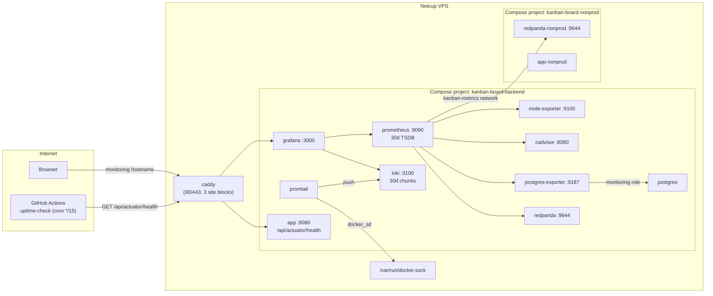

# 11 — Observability

This layer collects host, container, Postgres and Redpanda metrics, and the logs of every
container, on the production VPS, and shows them in Grafana. It matters because it is the only
way to see why the system is slow, full or down, without a paid SaaS product.

**Read first:** [10 — Infrastructure and deployment](10-infrastructure-and-deployment.md) (the
VPS, Caddy, Compose projects and networks), [09 — Build quality and CI](09-build-quality-and-ci.md)
(the `scripts/verify-*.py` gates that run in CI)

**Main code:**

- [`application.properties` (actuator block)](../../src/main/resources/application.properties#L22-L30)
- [`docker-compose.prod.yml`](../../docker-compose.prod.yml) — services `node-exporter`,
  `prometheus`, `grafana`, `loki`, `promtail`, `cadvisor`, `postgres-exporter`
- [`docker/prometheus/prometheus.yml`](../../docker/prometheus/prometheus.yml)
- [`docker/loki/loki-config.yaml`](../../docker/loki/loki-config.yaml),
  [`docker/promtail/promtail-config.yaml`](../../docker/promtail/promtail-config.yaml)
- [`docker/grafana/provisioning/`](../../docker/grafana/provisioning/)
- [`Caddyfile` (monitoring site block)](../../Caddyfile#L155-L200)
- [`scripts/verify-public-dashboards.py`](../../scripts/verify-public-dashboards.py)
- [`.github/workflows/uptime-check.yml`](../../.github/workflows/uptime-check.yml)

## Summary of decisions

| ID | Decision | Main reason |
|----|----------|-------------|
| OBS-01 | Actuator exposes only `health`, with `show-details=never` | Caddy proxies the path publicly; a wider list publishes `/env` and `/heapdump` |
| OBS-02 | No Micrometer registry; the app itself is not a Prometheus target | Actuator was added only for the Docker healthcheck; app metrics (Epic 6) stay out of scope |
| OBS-03 | Self-hosted Prometheus + Grafana + Loki/Promtail + exporters on the same VPS | No paid SaaS; measured headroom was 4.9 GiB RAM free and 222 GB disk free |
| OBS-04 | One shared stack monitors prod and nonprod, with an `env` label | Lowest resource cost; mirrors the shared-Postgres precedent |
| OBS-05 | Stack lives in `docker-compose.prod.yml`, plus one new `kanban-metrics` network | A separate Compose file multiplies cross-project networks |
| OBS-06 | No published ports; Grafana only through a third Caddy site block (a subdomain) | A sub-path route couples Grafana to the production rate limiter |
| OBS-07 | Grafana login is the only auth gate; sign-up and anonymous access explicitly off; `/login*` rate-limited | Same model as the app (Spring Security only), with a brute-force bound on the largest-blast-radius login |
| OBS-08 | 30-day retention for Prometheus and Loki | Month-over-month comparison; disk headroom is large |
| OBS-09 | Prometheus runs without `--web.enable-lifecycle` | It adds an unauthenticated POST endpoint; a restart costs seconds |
| OBS-10 | node-exporter reads the host through a read-only bind, without `network_mode: host` or `pid: host` | CI gate forbids host networking; host procfs through the bind gives the same numbers |
| OBS-11 | cAdvisor with read-only mounts only, no `privileged`, no `pid: host` | Per-container metrics need no process-level access |
| OBS-12 | `postgres_exporter` with a least-privilege `monitoring` role and split credential variables | A password inside a DSN URI can corrupt or redirect the connection |
| OBS-13 | Redpanda is scraped at its native `/public_metrics` | No new container; the low-cardinality endpoint is the recommended one |
| OBS-14 | Promtail ships logs from ALL containers, no label filter; Promtail kept although EOL | Covers the infra-outage case; Alloy is a bigger new tool for one operator |
| OBS-15 | Loki single-binary on the filesystem; backdated schema; `reject_old_samples_max_age` = retention | Live deploy showed the log backlog blocked or dropped batches |
| OBS-16 | Dashboards and datasources as code: vendored JSON + file provider | Reproducible, visible in git, survives a lost volume, no boot dependency on grafana.com |
| OBS-17 | Selected dashboards shared through Grafana's public-dashboard feature, not anonymous access | Per-dashboard, read-only scope for portfolio viewers |
| OBS-18 | Public dashboards use literal datasource uids and no template variables; a CI gate holds this | The public renderer resolves by uid only and never interpolates variables |
| OBS-19 | Angular-era panels migrated with Grafana's own migrator; gate checks panel types against the pinned image | Grafana 13 removed `graph` and `singlestat` |
| OBS-20 | Every `mem_limit` comes from a restart ladder, with stated headroom; two caps raised the same day | Guessed caps failed on this box before; a short burst missed real growth |
| OBS-21 | Caddy gets a measured `mem_limit: 32m` | Its memory is influenced by unauthenticated traffic |
| OBS-22 | Uptime is probed by a GitHub Actions cron every 15 minutes | Evidence of an outage that does not depend on the VPS console |
| OBS-23 | No alerting | Phase scope is visibility only |

## Big picture



The diagram shows one important fact: Prometheus does not scrape `app` or `app-nonprod`. The
application reports only a health status, and only an external probe and the Docker healthcheck
read it (see OBS-02).

## Application health: Spring Boot Actuator

### What it is

Spring Boot Actuator is a Spring Boot module that adds operational HTTP endpoints (health, metrics,
environment, heap dump) to the application. This project uses one endpoint only:
`GET /api/actuator/health`.

### How it works

[`build.gradle`](../../build.gradle#L161-L167) adds `spring-boot-starter-actuator`. The comment
there states its only purpose: a real "is the app actually working" signal for the production
Docker healthcheck.

[`application.properties`](../../src/main/resources/application.properties#L22-L30) sets the
exposure:

```properties
management.endpoints.web.exposure.include=health
management.endpoint.health.show-details=never
```

The endpoint shares the application port and the `/api` context path, because
`management.server.port` is not set ([`ApiPaths.ACTUATOR_HEALTH`](../../src/main/java/com/vrudenko/kanban_board/constant/ApiPaths.java#L38-L43)).
[`SecurityConfiguration.securityFilterChain`](../../src/main/java/com/vrudenko/kanban_board/security/SecurityConfiguration.java#L72-L91)
adds `ApiPaths.ACTUATOR_HEALTH` to the `permitAll()` list. Every other request, including any other
actuator path, falls to `anyRequest().authenticated()`.

Three consumers read the endpoint:

1. The Docker healthcheck of `app` in
   [`docker-compose.prod.yml`](../../docker-compose.prod.yml#L393-L398) runs `wget` against
   `http://localhost:8080/api/actuator/health` and looks for `"status":"UP"`.
2. The same healthcheck exists in `docker-compose.nonprod.yml` for `app-nonprod`.
3. The uptime workflow (see [Uptime check](#uptime-check-github-actions-cron)).

The response body is only `{"status":"UP"}`. The health aggregate includes the DataSource health
indicator, so a lost database connection turns the status to `DOWN` (build.gradle comment).

### Why we chose it

**OBS-01.** The comment in `application.properties` gives the reason. Caddy proxies this path to
the internet. A wider include list, or the `*` wildcard, publishes `/env`, `/beans` and
`/heapdump`. A heap dump contains the JDBC password, the session store and bcrypt hashes.
`show-details=never` also stops the health body from showing the datasource URL, driver and
validation query to an unauthenticated caller. The uptime workflow records the cost: a failure
can name the endpoint and its status, but never the failed subsystem.

**OBS-02.** The original plan,
[Epic 6](../plans/backend-modernization/06-observability.md), asked for
`micrometer-registry-prometheus`, `/actuator/metrics`, `/actuator/prometheus`, a request-rate and
p95-latency dashboard, Hibernate metrics, a Kafka publish counter and a consumer-lag gauge. None
of this exists in the code. `rg micrometer` over `src/main` and `build.gradle` finds nothing.
[STATUS.md](../plans/backend-modernization/STATUS.md) still shows Epic 6 unchecked, and
[PROJECT.md](../../.planning/PROJECT.md) lists it as deferred. The build.gradle comment says
general metrics "stay out of this phase's scope" (Phase 5). Phase 12 scoped its metrics to host,
container, Postgres and Redpanda ([12-CONTEXT.md](../../.planning/phases/12-self-hosted-observability-stack/12-CONTEXT.md)).
A specific reason for not scraping the JVM in Phase 12 is not recorded.

### Alternatives we rejected

- A separate management port (`management.server.port`). Not chosen; the code shows the shared
  port. Reason not recorded.
- The Epic 6 design with open metrics endpoints behind an actuator-specific auth rule. Not done
  yet, not rejected (see [Known gaps](#known-gaps-and-open-items)).

### Trade-offs and limits

- The only application-level signal is UP or DOWN. There is no request rate, latency, JVM heap,
  Hikari pool or Kafka lag metric. cAdvisor shows the container's CPU and memory from outside.
- `show-details=never` hides the cause of a `DOWN` status from every caller.

### How we test it

[`ActuatorHealthE2ETest`](../../src/test/java/com/vrudenko/kanban_board/security/ActuatorHealthE2ETest.java)
runs against a real embedded server (`RANDOM_PORT`), so context-path stripping is real:

- `HealthCheckTest.shouldReturnOk_whenHealthCheckedWithoutSession` — 200 without a session.
- `HealthCheckTest.shouldReportAggregateStatusUp_whenHealthCheckedWithoutSession` — `status` is `UP`.
- `HealthCheckTest.shouldNotIncludeComponentDetail_whenHealthCheckedWithoutSession` — no
  `components` or `details` in the body.
- `EnvEndpointExclusionTest.shouldReturnNonSuccess_whenEnvEndpointRequestedWithoutSession` —
  `/actuator/env` returns a status of 300 or higher.

Caution: the last test cannot tell "not exposed" from "not authenticated". An unauthenticated
request to any path except the `permitAll()` list gets 401 from the security chain, even if `env`
were exposed. The allowlist property itself is the real control. (Reasoned from the code; not run
with a widened list.)

### Where this is recorded

- [`06-observability.md`](../plans/backend-modernization/06-observability.md) — the original Epic 6 plan
- Comments in `application.properties`, `build.gradle`, `ApiPaths.java`, `SecurityConfiguration.java`

## Stack shape: one shared, self-hosted stack

### What it is

Phase 12 added seven containers to the production Compose project on the Netcup VPS:
`node-exporter`, `prometheus`, `grafana`, `loki`, `promtail`, `cadvisor` and `postgres-exporter`.
An exporter is a small process that reads a system's internal state and publishes it as Prometheus
metrics on an HTTP `/metrics` page.

### How it works

- Prometheus pulls ("scrapes") every target every 15 seconds
  ([`prometheus.yml`](../../docker/prometheus/prometheus.yml#L6-L8)).
- Six scrape jobs exist: `node`, `cadvisor`, `postgres`, `redpanda` (two targets) and `prometheus`
  itself.
- Every target carries an `env` label: `prod`, `nonprod`, or `shared` for the one Postgres
  instance that holds both databases ([`prometheus.yml`](../../docker/prometheus/prometheus.yml#L26-L32)).
- Promtail pushes logs to Loki. Grafana queries both Prometheus and Loki.
- All services join the implicit `default` network of the production project. Only `prometheus`
  and `redpanda-nonprod` join the external `kanban-metrics` network
  ([`docker-compose.prod.yml` networks block](../../docker-compose.prod.yml#L38-L53)).
- Stateful services use named volumes: `prometheus-data`, `grafana-data`, `loki-data`.
- Every service reuses the `x-logging` anchor (json-file, `10m` × 3 files).

### Why we chose it

**OBS-03.** The phase goal is "queryable without any paid SaaS". Live headroom on 2026-09-07 was
4.9 GiB RAM free of 7.8 GiB, CPU load 0.11 of 4 vCPU and 222 GB disk free. The context file calls
"just add more containers" an easy decision with those numbers
([12-CONTEXT.md](../../.planning/phases/12-self-hosted-observability-stack/12-CONTEXT.md)).

**OBS-04 (D-04 in 12-CONTEXT.md).** One Prometheus/Loki/Grafana instance monitors both
environments. The reason is the lowest resource cost. It mirrors Phase 11's decision to run one
shared Postgres instance. The context file marks this as costly to reverse: a split means two
stacks and new scrape and Promtail configs.

**OBS-05.** The research compared a separate `docker-compose.monitoring.yml` with the existing
production file ([12-RESEARCH.md, Alternatives Considered](../../.planning/phases/12-self-hosted-observability-stack/12-RESEARCH.md)).
A separate project must cross a Compose-project boundary to reach `redpanda`, `postgres` and
`caddy`, so it needs more external networks. The same file needs only one new network, for the
one nonprod target. Research Pitfall 1 predicted that `redpanda-nonprod` fails silently without
that network.

### Alternatives we rejected

| Alternative | Why rejected |
|---|---|
| Paid SaaS (for example, Grafana Cloud) | Phase goal forbids it |
| Two stacks, one per environment | Double cost; the Neon-era reason for separation does not apply to a self-hosted stack (D-04) |
| `docker-compose.monitoring.yml` | More cross-project networks (research) |
| Deploy all seven services at once | Seven unknowns in one failure; a Let's Encrypt failure late burns the certificate attempt budget ([12-01-PLAN.md, alternative B](../../.planning/phases/12-self-hosted-observability-stack/12-01-PLAN.md)) |

The plan picked a vertical "tracer" instead: node-exporter → Prometheus → Grafana → Caddy →
HTTPS, proven end to end before any other exporter.

### Trade-offs and limits

- The stack shares the VPS with the application. A host failure removes the application and the
  evidence of the failure at the same time. The external uptime probe (OBS-22) is the only signal
  that does not share the host.
- The observability data has no backup. 12-CONTEXT.md states that losing it loses history, not
  application data.
- `env: prod` on the `cadvisor` and `node` jobs describes where the scraper lives. cAdvisor's own
  per-container labels separate prod from nonprod containers.

### How we test it

There is no automated test of the running stack. Plan 12-03 verified live that every intended
target was `up`, including `redpanda-nonprod:9644`
([INFRA_RUNBOOK.md, "Monitoring role and metrics targets"](../INFRA_RUNBOOK.md)).
`scripts/verify-compose-ports.py` in CI fails if any of these services gains a `ports:` entry
(see [chapter 09](09-build-quality-and-ci.md)).

### Where this is recorded

- [12-CONTEXT.md](../../.planning/phases/12-self-hosted-observability-stack/12-CONTEXT.md) — D-01 to D-08
- [12-RESEARCH.md](../../.planning/phases/12-self-hosted-observability-stack/12-RESEARCH.md)
- [12-VERIFICATION.md](../../.planning/phases/12-self-hosted-observability-stack/12-VERIFICATION.md) — 21/21 truths, 2 by accepted override
- Commit `084f4b4` (tracer), `72e7686` (cAdvisor, postgres_exporter, `kanban-metrics`)

## Grafana exposure and access control

### What it is

Grafana is the only observability service reachable from the internet. It has its own DuckDNS
hostname and its own Caddy site block.

### How it works

[`Caddyfile`](../../Caddyfile#L181-L200), third site block:

```caddyfile
{$APP_DOMAIN_MONITORING} {
	rate_limit {
		log_key
		zone grafana_login {
			match {
				path /login*
			}
			key {remote_host}
			events 20
			window 5m
			ipv6_prefix 56
		}
	}
	reverse_proxy grafana:3000
}
```

The [`grafana` service](../../docker-compose.prod.yml#L641-L693) has no `ports:` entry. Caddy
reaches it by service name on the internal network. The environment sets:

- `GF_SECURITY_ADMIN_PASSWORD: ${GRAFANA_ADMIN_PASSWORD}` from `.env.prod`
- `GF_USERS_ALLOW_SIGN_UP: "false"`
- `GF_AUTH_ANONYMOUS_ENABLED: "false"`

### Why we chose it

**OBS-06.** Plan 12-01 compared a third subdomain with a `/grafana/*` sub-path on the production
hostname ([12-01-PLAN.md, alternative C](../../.planning/phases/12-self-hosted-observability-stack/12-01-PLAN.md)).
The sub-path needs `GF_SERVER_ROOT_URL` and `GF_SERVER_SERVE_FROM_SUB_PATH`, and has a known class
of half-rendered UI failures. It also puts Grafana inside the site block that carries the
production rate limiter, so Grafana's asset requests spend the general zone's budget. The plan
kept the sub-path only as a fallback if DuckDNS refused a third subdomain.

**OBS-07 (D-03, amended).** Grafana's own login is the only authentication gate. There is no
`basic_auth` and no IP allowlist. The context file compares this to the app, where Spring Security
alone authenticates requests. The rate limit on `/login*` came from a dated amendment
(2026-09-07). The reason: this one credential guards every metric and every container's logs in
both environments. Rate limiting was never the control D-03 banned. The zone matches `/login*`
only, so dashboard queries and assets do not spend the budget. The thresholds (20 events per 5
minutes per source) copy the existing `zone auth` numbers.

The two `GF_*` flags match the image defaults. They are set explicitly because a silent default
change in a future image would remove the only gate without a diff (compose comment).

### Alternatives we rejected

- `basic_auth` or an IP allowlist in front of Grafana — rejected by D-03; reversible with no
  migration.
- A sub-path route — see above.

### Trade-offs and limits

- One password protects all metrics and logs of both environments.
- `GF_SECURITY_ADMIN_PASSWORD` seeds only a fresh Grafana database. A changed env value does not
  change an existing admin password; use `grafana cli admin reset-admin-password`
  ([12-01-SUMMARY.md, Issues Encountered](../../.planning/phases/12-self-hosted-observability-stack/12-01-SUMMARY.md)).
  This caused an open drift: the deployed admin password does not match `.env.prod` (18 vs. 16
  characters, [INFRA_RUNBOOK.md](../INFRA_RUNBOOK.md), Plan 12-05 known gap).
- During plan 12-01, a `docker exec ... wget --password=...` call put the admin password into the
  `docker events` argv log. The password was rotated. Since then, secrets reach a container only
  through stdin (for example, psql `\set` inside a heredoc).

### How we test it

Live verification only. The rate limiter's thresholds are not re-tested for this block by a
workflow. `verify-compose-ports.py` holds the "no published port" rule.

### Where this is recorded

- [Caddyfile](../../Caddyfile#L155-L180) decision comments
- [12-01-PLAN.md](../../.planning/phases/12-self-hosted-observability-stack/12-01-PLAN.md) `<design_alternatives>` and `<decision_amendments>`
- Open todos: `.planning/todos/pending/2026-09-08-grafana-admin-password-drift-from-env-prod.md`,
  `.planning/todos/pending/2026-09-07-rotate-grafana-viewer-password-leaked-in-session.md`

## Metrics collection: Prometheus and the exporters

### What it is

Prometheus is a time-series database that scrapes metrics over HTTP and answers PromQL queries.
Four sources feed it on this host.

| Job | Target | What it measures |
|---|---|---|
| `node` | `node-exporter:9100` | Host CPU, memory, load, filesystems, network interfaces |
| `cadvisor` | `cadvisor:8080` | Per-container CPU, memory, network |
| `postgres` | `postgres-exporter:9187` | Connections, database stats, settings, query stats |
| `redpanda` | `redpanda:9644`, `redpanda-nonprod:9644` at `/public_metrics` | Broker metrics |
| `prometheus` | `prometheus:9090` | Prometheus itself |

### How it works

**Prometheus** ([compose](../../docker-compose.prod.yml#L583-L639)) runs `prom/prometheus:v3.14.0`
with `--storage.tsdb.retention.time=30d` and the TSDB on `prometheus-data`. The config file is a
read-only bind mount. `--web.enable-lifecycle` is absent, so a config change needs a restart.

**node-exporter** ([compose](../../docker-compose.prod.yml#L498-L581)) mounts `/` as
`/host:ro,rslave` and reads `--path.rootfs`, `--path.procfs` and `--path.sysfs` under `/host`. A
filesystem exclude regex drops pseudo-filesystems and container storage. The regex uses `$$`
because Compose treats a single `$` as variable interpolation.

**cAdvisor** ([compose](../../docker-compose.prod.yml#L808-L884)) mounts `/`, `/var/run`, `/sys`
and `/var/lib/docker`, all `:ro`. It is not `privileged` and does not share the host PID
namespace. The image is `ghcr.io/google/cadvisor`, because the old `gcr.io` path has no tags at or
after v0.53.0.

**postgres_exporter** ([compose](../../docker-compose.prod.yml#L886-L969)) runs with
`--auto-discover-databases`, so one exporter covers `kanban_prod` and `kanban_nonprod`. It
connects as the `monitoring` role:

```sql
CREATE ROLE monitoring WITH LOGIN PASSWORD :'monitoring_pass';
GRANT CONNECT ON DATABASE kanban_prod TO monitoring;
GRANT CONNECT ON DATABASE kanban_nonprod TO monitoring;
GRANT pg_monitor TO monitoring;
```

`pg_monitor` is a built-in Postgres role that gives read access to `pg_stat_*` views and
`pg_settings` without superuser rights. The runbook records a negative test: `SELECT * FROM users`
as `monitoring` fails. The credential arrives as three variables: `DATA_SOURCE_URI` (host, port,
database, parameters only), `DATA_SOURCE_USER` and `DATA_SOURCE_PASS`. `DATA_SOURCE_NAME` is
absent on purpose. Quick task 260911-gkz (commit `2ad3656`) added
`--collector.postmaster` and `--collector.stat_statements`, because the "Uptime", "Query rate" and
"Average query runtime" tiles showed N/A.

**Redpanda** needs no new container. Its admin API on port 9644 already answers on a non-loopback
address. Plan 12-03 verified this live for both brokers before the scrape target was added
([`prometheus.yml`](../../docker/prometheus/prometheus.yml#L34-L55)).

### Why we chose it

**OBS-08 (D-07).** 30 days instead of the 15-day default, for month-over-month comparison. The
basis is the 222 GB disk headroom.

**OBS-09.** The lifecycle endpoint is an unauthenticated POST on a service whose only access
control is "nothing else is on this network". A restart takes seconds and loses no data.

**OBS-10.** The upstream node-exporter recipe uses `network_mode: host` and `pid: host`.
`scripts/verify-compose-ports.py` invariant I2 forbids `network_mode: host`, because host
networking publishes every listening port without a `ports:` key. `pid: host` is not needed:
the host procfs through the read-only bind gives the same CPU, memory and load numbers.

**OBS-11 (D-05, amended).** cAdvisor gives per-container breakdown. D-05 accepts its host mounts
as a scoped exception, all read-only. The literal D-05 mount list (`docker.sock`, `/sys`, `/proc`)
made cAdvisor start but emit empty or self-only series (research Pitfall 3). The deployed set adds
`/rootfs` and `/var/lib/docker` and drops `/proc`. The runbook calls this a widening of file
surface, not of privilege. `/var/run:ro` is stricter than cAdvisor's upstream example, which
mounts it read-write.

**OBS-12 (D-06).** A password that contains `@ : / ? # %` is structural inside a URI. If the
compose file builds a DSN string, such a password can corrupt the connection or send it to a host
the password chooses. The exporter builds the DSN itself with Go's `url.UserPassword`, which
percent-encodes both parts. The live password does contain one of those characters, and the
connection works; this is the empirical proof. Phase 11 fixed the same class of problem in the
Postgres init script (finding CR-01).

**OBS-13 (D-06).** Redpanda's native endpoint needs only a scrape target. The research recommends
`/public_metrics` (aggregated, low-cardinality) over the legacy `/metrics`.

### Alternatives we rejected

| Alternative | Why rejected |
|---|---|
| One `postgres_exporter` per database | Two near-identical containers for one engine (research) |
| A single `DATA_SOURCE_NAME` DSN (shown in the research code examples) | Password-in-URI hazard; the plan supersedes the research |
| The monitoring role in `docker/postgres-init/` | The init script runs only on an empty volume; it would never run (research Pitfall 2). The role was created live with `docker exec` |
| `privileged: true` / `pid: host` for cAdvisor | Only needed for process-level metrics, out of scope |

### Trade-offs and limits

- cAdvisor and Promtail mount `docker.sock`. Caution: `:ro` does not make the socket safe. The
  dangerous Docker API calls are HTTP requests over the socket, not file writes, so a compromised
  container gets effective host root. The only mitigation is no inbound route and no published
  port (compose comment on `promtail`).
- Plan 12-01 claimed that `node_network_*` shows only the container's namespace. Live evidence
  proved this wrong: the sysfs bind shows the host's full interface list. The compose comment
  records the correction. The residual risk is interface names and byte counters, behind the
  Grafana login.
- cAdvisor logs `Could not configure a source for OOM detection` because `/dev/kmsg` is not
  mounted. OOM events are therefore not visible in cAdvisor.
- `--collector.stat_statements` emits nothing until `pg_stat_statements` is preloaded and
  `CREATE EXTENSION` runs in each database. The compose file preloads it; the extension step is a
  manual deploy step.
- There is no Grafana dashboard for Redpanda. Its metrics are only in Prometheus.

### How we test it

Live checks only, recorded in the runbook: all targets `up`, `pg_stat_database_numbackends`
returning values for both databases, the least-privilege positive and negative queries.

### Where this is recorded

- [INFRA_RUNBOOK.md, "Monitoring role and metrics targets — Plan 12-03"](../INFRA_RUNBOOK.md), including "cAdvisor mount posture" and "postgres_exporter credential handling"
- [12-03-SUMMARY.md](../../.planning/phases/12-self-hosted-observability-stack/12-03-SUMMARY.md)
- Compose comments on each service
- Commits `72e7686`, `2ad3656`

## Logs: Loki and Promtail

### What it is

Loki is a log store that indexes only labels, not the log text. Promtail is an agent that reads
log files and pushes them to Loki. Together they close the "no remote log shipping" half of an
older todo (D-01).

### How it works

[`promtail-config.yaml`](../../docker/promtail/promtail-config.yaml) discovers containers through
`docker_sd_configs` on `unix:///var/run/docker.sock`, every 15 seconds. Two relabel rules add the
`container` and `compose_project` labels. The `docker: {}` pipeline stage unwraps Docker's
json-file envelope (`{"log": ..., "stream": ..., "time": ...}`). Promtail keeps its read positions
in `/tmp/positions.yaml`, not on a volume.

[`loki-config.yaml`](../../docker/loki/loki-config.yaml) runs single-binary mode with filesystem
storage, an `inmemory` ring and replication factor 1. The key values:

```yaml
schema_config:
  configs:
    - from: 2024-01-01
      store: tsdb
      object_store: filesystem
      schema: v13
limits_config:
  retention_period: 720h
  reject_old_samples_max_age: 720h
compactor:
  retention_enabled: true
  delete_request_store: filesystem
```

`720h` is the 30 days of D-07. The compactor deletes old chunks. Loki 3.x refuses to start with
`retention_enabled: true` and no `delete_request_store`.

### Why we chose it

**OBS-14 (D-08).** Promtail ships logs from ALL containers: `app`, `app-nonprod`, `postgres`,
`redpanda`, `redpanda-nonprod`, `caddy` and the stack itself. The reason is the incident case that
started the phase: Postgres, Redpanda and Caddy logs during an outage. The config has no
`filters:` key on purpose. Most community examples filter by label, and a copied filter would
silently miss the containers of the other Compose project.

Promtail reached end of life on 2026-03-02. The research recorded this and compared Grafana Alloy,
the successor. Alloy uses a different config language and is a bigger tool for one operator. D-01
and D-08 named Promtail, so the phase kept it as a known, accepted trade-off
([12-RESEARCH.md](../../.planning/phases/12-self-hosted-observability-stack/12-RESEARCH.md)).

**OBS-15.** Two config values came from failures on the first live deploy (commits `8512bbf`,
`073ac05`):

1. **Backdated `from:`.** Promtail's first run reads each log file from its start. A quiet
   container's rotated logs can be weeks old. With `from:` set to the deploy date, those lines fall
   outside every schema period. Loki returns HTTP 500 "no schema config found", and Promtail
   retries a failed batch forever. That blocks newer lines of the same stream. A past date costs
   nothing, because schema periods do not reserve storage.
2. **`reject_old_samples_max_age` = retention.** The default (168h) rejected backlog lines older
   than 7 days with HTTP 400. Promtail puts several streams into one push, and Loki drops a
   rejected batch completely. Valid recent lines of another stream were lost as collateral
   (`promtail_dropped_entries_total{reason="ingester_error"}`). With both values at 720h, nothing
   inside the kept window is "too old".

### Alternatives we rejected

| Alternative | Why rejected |
|---|---|
| Grafana Alloy | New config language and footprint; Promtail named in D-01/D-08 |
| Label-filtered `docker_sd_configs` | Silently misses nonprod containers |
| A custom `tail -f` forwarder | Loses data across log rotation; Promtail's positions file handles it (research, "Don't hand-roll") |
| Loki `table_manager` retention | Superseded in Loki 2.x+ by the compactor |

### Trade-offs and limits

- Promtail receives no more security fixes.
- The logs are plain text. There is no structured or UTC logging standard in the application; that
  half of the todo is still open.
- The Loki image has no shell, so the `loki` service has no healthcheck.
- The Promtail image has no `wget` or `curl`. Its healthcheck uses bash's `/dev/tcp` and must call
  `bash -c`, because the default `/bin/sh` (dash) does not implement `/dev/tcp`.
- There is no provisioned Loki dashboard. Logs are read in Grafana Explore.

### How we test it

Live checks: a wide Loki query across all containers returns lines. The resource ladder
(OBS-20) repeated this query at every rung.

### Where this is recorded

- Header comments in `loki-config.yaml` and `promtail-config.yaml`
- [12-02-SUMMARY.md](../../.planning/phases/12-self-hosted-observability-stack/12-02-SUMMARY.md)
- `.planning/todos/pending/2026-08-20-no-remote-log-shipping-structured-logging-or-alerting.md`

## Grafana provisioning and dashboards

### What it is

Provisioning is Grafana's mechanism to load datasources and dashboards from files at startup,
instead of from the UI. This project provisions two datasources and three dashboards.

| File | Title | Dashboard uid | grafana.com source |
|---|---|---|---|
| `node-exporter-full.json` | VM Host Metrics | `rYdddlPWk` | "Node Exporter Full" (ID 1860) |
| `cadvisor.json` | CPU/Memory & Network Usage - cAdvisor | `pMEd7m0Mz` | "Cadvisor exporter" (ID 14282) |
| `postgres-exporter.json` | Postgres Internals | `v5ciIbUZz` | "PostgreSQL Exporter" (ID 12485) |

### How it works

[`dashboards.yaml`](../../docker/grafana/provisioning/dashboards/dashboards.yaml) declares one
`file` provider that reads `/etc/grafana/provisioning/dashboards/json` every 30 seconds. The
compose file mounts the whole `docker/grafana/provisioning` directory read-only.

[`datasources.yaml`](../../docker/grafana/provisioning/datasources/datasources.yaml) declares
Prometheus (`uid: PBFA97CFB590B2093`, default) and Loki (`uid: P8E80F9AEF21F6940`).

Because the provider re-reads the directory, a dashboard change needs no Grafana restart. The
Angular fix in September deployed while Grafana stayed up for 3 days (commit `8baca52`).

The files reach the VPS through the SCP step of `deploy.yml`. From Phase 12 until quick task
260908-sj9, four of the new config paths were missing from that SCP list. The VPS kept stale
copies through fourteen green deploys. `scripts/verify-deploy-scp-coverage.py` now compares
bind-mount sources with the SCP list in CI (see [chapter 09](09-build-quality-and-ci.md)).

### Why we chose it

**OBS-16.** Plan 12-04 compared three approaches
([12-04-PLAN.md](../../.planning/phases/12-self-hosted-observability-stack/12-04-PLAN.md)):

| Approach | Result |
|---|---|
| A: download community JSON once, commit it, use the file provider | **Picked.** Reproducible from git, survives a lost `grafana-data` volume, and the community JSON already has correct PromQL for each exporter |
| B: build dashboards in the UI | Rejected. Invisible in git, lost with the volume, against the repo's "config is a committed file" convention |
| C: reference by `gnetId` and fetch at start | Rejected. The file provider reads local files only; a fetch-on-boot script makes a grafana.com outage a boot failure |

Datasources are provisioned for the same reason: a UI-created datasource exists only in the
volume.

### Alternatives we rejected

See the table above. The accepted cost of A: thousands of lines of vendored third-party JSON that
nobody can review line by line. Each file's `description` records its grafana.com ID, revision and
fetch date.

### Trade-offs and limits

- A downloaded dashboard references `${DS_PROMETHEUS}`. Only Grafana's import flow resolves that
  placeholder; file provisioning does not. Plan 12-04 predicted this failure. The first commit
  resolved it to the datasource *name*, which later broke the public dashboards (next section).
- The Node Exporter dashboard is built for bare metal. 42 of its 274 queries return nothing,
  because 24 metrics (`node_hwmon_*`, `node_systemd_*` and others) come from collectors that are
  off by default or hardware a VPS does not have.

### How we test it

`scripts/verify-public-dashboards.py` (next section) parses every dashboard file in CI.

### Where this is recorded

- [12-04-PLAN.md](../../.planning/phases/12-self-hosted-observability-stack/12-04-PLAN.md) and [12-04-SUMMARY.md](../../.planning/phases/12-self-hosted-observability-stack/12-04-SUMMARY.md)
- Quick tasks `260908-mtl` (titles) and `260908-r16` (Postgres Internals rows), under [`.planning/quick/`](../../.planning/quick/)
- Commits `21a41c7`, `96a70db`, `eb1f786`

## Public dashboards: literal uids, no template variables

### What it is

Grafana's public-dashboard feature gives one dashboard a read-only share link that works without a
login. All three dashboards are shared this way. The README links two of them.

### How it works

The public link was created in the Grafana UI. It lives in the `grafana-data` volume, not in git.
[`PUBLIC_DASHBOARDS`](../../scripts/verify-public-dashboards.py#L75-L81) in the gate script records
the intended set, checked against `GET /api/dashboards/public-dashboards` on 2026-09-12.

A public panel query goes to `POST /api/public/dashboards/{token}/panels/{id}/query`. This is a
different and stricter code path than the logged-in one.

### Why we chose it

**OBS-17.** The todo that asked for public links explains the choice: a per-dashboard read-only
link, not org-wide anonymous access through `GF_AUTH_ANONYMOUS_ENABLED`. Viewers of the portfolio
need no login, and D-03's login gate stays in front of everything else
([todo](../../.planning/todos/pending/2026-09-07-groom-grafana-dashboards-and-expose-public-links.md)).
The todo also warns that the data becomes truly public, so the panels need a review for hostnames
and internal IPs before sharing.

**OBS-18.** For about a month, every public panel showed "Datasource was not found". Every
exporter was healthy and the logged-in view worked. The 2026-09-12 debug session found two
separate conditions
([INFRA_RUNBOOK.md, "Public Grafana dashboards rendered no data"](../INFRA_RUNBOOK.md)):

1. **The datasource ref must be a literal uid.** `node-exporter-full.json` used
   `"uid": "${ds_prometheus}"`; the other two used the name string `"Prometheus"`. The public
   renderer resolves by uid only. The result was HTTP 500 with `error="data source not found"`.
2. **The query must hold no dashboard template variables.** With condition 1 fixed, the query
   reached Prometheus as
   `rate(node_pressure_cpu_waiting_seconds_total{instance="$node",job="$job"}[1m15s])`. Grafana
   interpolated the built-in `$__rate_interval` but not `$node` or `$job`. This fails silently:
   HTTP 200 with an empty result. Grafana issue #67346 tracks the missing support.

The session used a request-recording stub instead of a real Prometheus to see condition 2. Against
real data, an uninterpolated query and a correct query with no matches both return empty.

The fix:

- Pin each datasource `uid` in `datasources.yaml` to the value Grafana already derived from the
  datasource name.
- Point all 182 datasource refs at those literal uids.
- Replace every variable with its one value on this host (for example `$node` →
  `node-exporter:9100`, `$Instance` → `postgres-exporter:9187`, `$container` → `.+`,
  `$Interval` → `10m`) and delete the variables.

The obvious fix was a readable `uid: prometheus`. Warning: that change stops Grafana. Grafana
exits with code 1 ("Datasource provisioning error: data source not found") if a volume already
holds the datasource with a different uid. With `restart: unless-stopped` that is a crash loop. A
fresh container does not show this failure. This is why the
[`datasources.yaml`](../../docker/grafana/provisioning/datasources/datasources.yaml#L6-L42)
decision block says "must not be changed".

### Alternatives we rejected

- A readable uid — crash loop on the existing volume (measured).
- Separate public copies of each dashboard, to keep variables for the admin view — new uids break
  the README's share links (runbook, residual gap 3).
- Anonymous org-wide access — wider than needed (todo).

### Trade-offs and limits

- The dashboards lost their dropdowns for the logged-in admin too. On a one-host deployment most
  variables had one value. `$Interval` on Postgres Internals is a real, small loss.
- The hardcoded labels are correct for one host only. A second node or a renamed exporter makes
  the dashboards narrow silently, and the gate stays green.
- The gate reads committed JSON. A dashboard shared or edited only in the UI is invisible to it.

### How we test it

[`scripts/verify-public-dashboards.py`](../../scripts/verify-public-dashboards.py) runs in the
`public-dashboards` job of
[`invariant-checks.yml`](../../.github/workflows/invariant-checks.yml#L127-L145), after its
self-test [`verify-public-dashboards-selftest.py`](../../scripts/verify-public-dashboards-selftest.py).
The invariants:

| ID | Rule | Function |
|---|---|---|
| I1 | Every datasource ref is a literal uid declared in `datasources.yaml` (all dashboards) | `find_datasource_violations` |
| I2 | No `expr` or `interval` field holds a non-built-in `$variable` (public only) | `find_variable_violations` |
| I3 | A public dashboard declares no template variables | `find_templating_violations` |
| I4 | Every JSON file is in `PUBLIC_DASHBOARDS` or `DELIBERATELY_PRIVATE` | `find_uncovered_files` |
| — | The file's dashboard uid matches the shared uid | `find_uid_mismatches` |
| I5 | Every panel type is a plugin the pinned Grafana ships | `find_panel_type_violations` |
| I6 | The compose file pins the Grafana image the allowlist came from | `find_grafana_version_drift` |

The runbook records the gate red against the pre-fix JSON (1001 violations) and green after the
fix. The self-test feeds each function an in-memory dashboard that breaks one rule. Its fixtures
are literal values, not the gate's own constants, so an edit to a constant cannot rewrite the
expectations too. On this worktree both scripts exit 0 (run for this chapter).

### Where this is recorded

- [INFRA_RUNBOOK.md, "Public Grafana dashboards rendered no data — debug session (2026-09-12)"](../INFRA_RUNBOOK.md)
- [`.planning/debug/grafana-datasource-not-found.md`](../../.planning/debug/grafana-datasource-not-found.md)
- Commit `f643255` (PR #17)

## The Angular-era panel migration

### What it is

After the uid fix, two public dashboards still drew nothing. Each chart panel showed an error
triangle with the tooltip "Plugin graph not found".

### How it works

The vendored JSON carried Angular-era panel types: cAdvisor had 5 `graph` panels; Postgres
Internals had 17 `graph` and 11 `singlestat` panels, 10 of them inside collapsed rows. Grafana 13
removed Angular completely. `graph` and `singlestat` are not in the image, and the
`angular_support_enabled` setting no longer exists. The public-dashboard API serves the stored
JSON without migration, so each panel resolved to no plugin. The data path was healthy: all six
live panel-query endpoints returned HTTP 200 with 793–803 datapoints each.

The fix imported each dashboard into a local `grafana/grafana:13.2.1` instance and exported the
result. Grafana's own `DashboardMigrator` converted `graph` → `timeseries` and `singlestat` →
`stat`. Dashboard uids, titles and every data panel id stayed the same, so the share links and
panel-query endpoints still point at the same panels. The files now have `schemaVersion` 42.

### Why we chose it

**OBS-19.** Commit `bbbed20` gives the reason for the migrator: "the conversion is Grafana's rather
than mine", instead of a hand edit of the schema. The gate gained I5 and I6 because the gate before
checked only the data path. A dashboard with perfect queries and no drawable panel passed it green.
[`GRAFANA_PANEL_PLUGINS`](../../scripts/verify-public-dashboards.py#L103-L116) lists exactly 30
plugins, read from `/usr/share/grafana/public/app/plugins/panel/*/plugin.json` in the pinned image.
I6 fails if the compose file pins a different Grafana image, so the allowlist cannot describe a
version that nothing runs.

### Alternatives we rejected

- Turn on Angular support — impossible in Grafana 13.
- A hand edit of the JSON — rejected for the migrator (commit message).
- Stay on an older Grafana — not recorded as considered.

### Trade-offs and limits

- A future re-fetch from grafana.com can bring back Angular panels and template variables. The
  gate catches both.
- A Grafana image bump needs the allowlist to be derived again. The I6 failure message gives the
  command.

### How we test it

The commit records the gate at exit 1 with 33 violations on the old JSON and exit 0 after, with a
self-test of 26 cases. The render check on 13.2.1 showed 5 error icons before and 0 after. After
deploy, commit `8baca52` verified four layers in production: files on the host, the live API
serving `schemaVersion` 42 with no legacy panel types, 41 panel-query endpoints with data, and a
real browser with 0 error icons.

### Where this is recorded

- [`.planning/debug/grafana-cadvisor-graph-panel.md`](../../.planning/debug/grafana-cadvisor-graph-panel.md)
- Commits `bbbed20`, `8baca52`
- The module docstring of `verify-public-dashboards.py` (failure 3)

## Memory and resource caps on a small VPS

### What it is

Every container on the VPS has a `mem_limit`, the cgroup memory ceiling. When a process passes
it, the kernel kills the process (an OOM kill) and Docker restarts it.

### How it works

Plans 12-01 to 12-03 shipped provisional caps labelled "Iteration-0". Plan 12-05 replaced them with
a restart ladder, the same method used for Redpanda (05-04, 08-03) and Postgres (11-03):

1. Set the cap one rung lower (about half).
2. Recreate the container with `--force-recreate`.
3. Run the workload: the 54-request API burst against both environments, a nonprod admin reset,
   all three dashboards at the widest range, and a wide Loki query.
4. Wait at least 20 seconds.
5. Pass only if `RestartCount=0` holds for the whole cycle and the service still works.
6. Stop one rung after the first failure. Confirm the failure in `dmesg`
   ("Memory cgroup out of memory: Killed process ...").

The adopted values, as in [`docker-compose.prod.yml`](../../docker-compose.prod.yml) today:

| Service | Failing rung | Peak RSS in ladder | Adopted | Note |
|---|---|---|---|---|
| `node-exporter` | 16m | ~15 MiB | 32m | |
| `postgres-exporter` | 16m | ~12 MiB | 32m | Stale: new collectors added later, not re-measured |
| `promtail` | 32m | ~54 MiB | 64m | |
| `cadvisor` | 32m | ~48 MiB | **128m** | 64m adopted, then 6 OOM kills in ~40 min of real use |
| `prometheus` | 64m | ~108 MiB | 256m | ~80m from the ladder, the rest is growth headroom |
| `loki` | 48m | ~93 MiB | 256m | ~64m from the ladder, the rest is growth headroom |
| `grafana` | 256m | ~292 MiB | **768m** | 384m adopted, then 2 OOM kills, the second at ~446 MiB |
| `caddy` | 8m | ~16 MiB | 32m | Plan 12-06 |

With all 13 containers running after a workload, `free -m` showed 5110 MiB available of 7945 MiB.
The sum of all caps is about 6.4 GiB, under the 7.8 GiB total.

### Why we chose it

**OBS-20.** The compose comments give the reason: a cap with no headroom "already broke startup
once" (Redpanda, plan 05-04). Each adopted value is above the passing floor and states its
headroom as a number. For Prometheus and Loki, the ladder ran against a nearly empty store (18,523
series and 128.7 MB for Prometheus; 14 streams and 12 MB for Loki). The comments separate the
ladder-justified part from the growth headroom for the 30-day window.

The same-day correction is a reversed decision. The short synthetic burst did not show cAdvisor's
slow creep or Grafana's growth under real sessions. Phase-close verification found the OOM kills in
`dmesg` on the VPS. cAdvisor went to the next proven rung (128m). Grafana went to double both the
old cap and the highest real peak (768m).

**OBS-21 (D-02).** The Caddy cap was folded into this phase because the phase already edited the
Caddy block. Caddy's memory depends on unauthenticated traffic: the rate limiter holds state per
source address, and every TLS handshake allocates. The cap is therefore a security bound. The
ladder used only one source address, so it did not measure the true attacker case, which grows
with distinct addresses. The step from 16m to 32m is margin for that gap, not evidence.

### Alternatives we rejected

- Arithmetic guesses — the phase context requires measurement (Phase 11, D-08/D-10 method).
- No cap — a single uncapped container can fill the host.
- Drop cAdvisor to save memory — the research named it as the first to drop if headroom was
  tight. The measured headroom made this unnecessary.

### Trade-offs and limits

- The cAdvisor and Grafana values are conservative corrections, not measured floors. A re-ladder
  over a longer window is an open todo, which also covers Caddy.
- If Prometheus or Loki is OOM-killed weeks later with no config change, the day-one basis is the
  cause. The comments say the fix is a higher cap or a shorter retention, not a new ladder.
- The runbook's "Adopted floor" table still shows 64m and 384m. The addendum below it and the
  compose file show 128m and 768m. The compose file is the truth.

### How we test it

Live measurement only, recorded rung by rung in the runbook. `verify-postgres-memory-invariant.py`
holds an arithmetic rule for Postgres only (see chapter 10).

### Where this is recorded

- [INFRA_RUNBOOK.md, "Observability stack resource measurement — Plan 12-05"](../INFRA_RUNBOOK.md) and its addendum; "Caddy resource measurement — Plan 12-06"
- [12-05-SUMMARY.md](../../.planning/phases/12-self-hosted-observability-stack/12-05-SUMMARY.md), [12-06-SUMMARY.md](../../.planning/phases/12-self-hosted-observability-stack/12-06-SUMMARY.md)
- `.planning/todos/pending/2026-09-08-cadvisor-grafana-and-caddy-mem-limits-need-a-longer-observation-window-re-ladder.md`

## Uptime check: GitHub Actions cron

### What it is

[`uptime-check.yml`](../../.github/workflows/uptime-check.yml) is a scheduled workflow that calls
the public health endpoint of production and nonprod.

### How it works

- Schedule: `*/15 * * * *`, plus manual `workflow_dispatch`.
- `permissions: {}` — the job does not check out the repository.
- For each URL in `HEALTH_URLS`: up to 3 attempts, 10 seconds apart, `curl --max-time 20`.
- An attempt passes only on HTTP 200 and a body that contains `"status":"UP"`.
- Every URL is always checked. One failed environment does not hide the other.
- On failure, the job prints a `::error::` line per URL and exits 1.

### Why we chose it

**OBS-22.** Quick task 260902-vjo added it after a false alarm. A frozen screenshot of the Netcup
"Screen" console looked like an outage but showed week-old output. The workflow gives dated
evidence of "was the service answering" that does not depend on the VPS (header comment and
[INFRA_RUNBOOK.md, "Triage — dating what the Netcup SCP 'Screen' console shows"](../INFRA_RUNBOOK.md)).
The interval is 15 minutes, not 5: GitHub queues scheduled runs late, so `*/5` gives little real
gain for three times the runs.

The retries exist to prevent false alarms from a single network error on a shared runner.

### Alternatives we rejected

- `*/5` — see above.
- A single-shot probe — creates the false alarms the file exists to prevent.

### Trade-offs and limits

The header comment lists four limits:

1. GitHub cron is a floor, not a guarantee; a red run dates an outage only roughly.
2. GitHub disables scheduled workflows in a public repository after 60 days without activity.
3. It is a probe, not alerting. A red run pages nobody.
4. `show-details=never` means a failure cannot name the failed subsystem.

### How we test it

Quick task 260902-vjo ran the same script locally. The script takes all values through `env:` and
has no `${{ }}` interpolation, so it runs unchanged outside Actions.

### Where this is recorded

- [`.planning/quick/`](../../.planning/quick/) (task 260902-vjo), commit `4613746`

## Demo recording and README

### What it is

[`docs/demo/kanban-board-backend-dashboards-demo.mp4`](../demo/kanban-board-backend-dashboards-demo.mp4)
(about 2.9 MB) is a walkthrough of the live public dashboards. The README "Live" section links it
and two public dashboards, "Network & OS" and "CPU & Memory metrics"
([README.md](../../README.md#live)).

### How it works

A comment in the README explains a limit. GitHub's README renderer removes a plain `<video>` tag
and does not play a file path. Only a `user-attachments/assets/<id>` URL plays inline. That URL
comes from dragging the MP4 into an issue or PR comment. Until someone does this, the README shows
a plain link to the file.

### Why we chose it

The public-links todo names the audience: a recruiter or interviewer with 30 seconds. Reason for a
video in addition to the links: not recorded. Commit `72f5d35` added it.

### Trade-offs and limits

- The Postgres Internals dashboard is public but has no README link (runbook notes this).
- The README also describes the stack in its production-deployment section and diagram. Commit
  `1557aaf` synced that section after it went stale.

## Known gaps and open items

- **No application metrics.** Epic 6 (Micrometer, `/actuator/prometheus`, request rate, p95
  latency, Hibernate statistics, Kafka publish counter, consumer lag) is not built. Prometheus does
  not scrape `app` or `app-nonprod`.
- **No alerting.** Out of scope for Phase 12 (12-CONTEXT.md `<domain>`). No Alertmanager, no
  notification channel. The uptime check pages nobody.
- **No structured or UTC application logging.** The other open half of
  `2026-08-20-no-remote-log-shipping-structured-logging-or-alerting.md`.
- **No security-event logging** on auth and access control (`2026-08-20-no-security-event-logging-on-auth-and-access-control.md`).
- **No backup** of Prometheus TSDB, Loki chunks or Grafana state (out of scope by decision).
- **No dashboards** for Redpanda or Loki; no OOM events from cAdvisor (`/dev/kmsg` not mounted).
- **Grafana admin password drift** between `.env.prod` and the deployed instance; a leaked viewer
  password awaits rotation.
- **Caps to re-measure** over a longer window: cAdvisor, Grafana, Caddy; `postgres-exporter`
  after its new collectors.
- **Promtail is EOL.** Alloy is the documented migration path.
- **Public-dashboard state lives in the volume**, not in git. The gate checks intent, not the live
  set.
- **The `pg_stat_statements` extension** must be created manually on each database for the query
  statistics tiles.

## Questions to check your knowledge

1. Why does the application expose only the `health` actuator endpoint, and what would a wider
   list publish?
   <details><summary>Answer</summary>
   Caddy proxies `/api/actuator/health` to the internet. A wider list or `*` publishes `/env`,
   `/beans` and `/heapdump`. A heap dump holds the JDBC password, session data and bcrypt hashes.
   `show-details=never` also hides the datasource URL and driver in the health body.
   </details>

2. Does Prometheus collect JVM or HTTP metrics from the Spring Boot app? Why or why not?
   <details><summary>Answer</summary>
   No. There is no Micrometer registry and no scrape target for `app`. Actuator was added only
   for the Docker healthcheck. Epic 6 (application metrics) is still deferred. Container CPU and
   memory for `app` come from cAdvisor.
   </details>

3. Why one shared observability stack for production and nonprod, and what does it cost to
   reverse?
   <details><summary>Answer</summary>
   Lowest resource cost on one VPS, and it follows the shared-Postgres precedent (D-04). An `env`
   label separates targets. To reverse it you must duplicate Prometheus, Loki and Grafana and
   change every scrape and Promtail config. The context file calls that costly.
   </details>

4. Why is Grafana on its own subdomain and not under `/grafana` on the production hostname?
   <details><summary>Answer</summary>
   A sub-path needs extra Grafana settings and has a known class of half-rendered UI failures. It
   also puts Grafana in the site block with the production rate limiter, so its asset requests use
   the general budget. The subdomain was proven first with a tracer plan.
   </details>

5. Grafana has no `basic_auth` in Caddy. What protects it?
   <details><summary>Answer</summary>
   Grafana's own login (D-03), with sign-up and anonymous access explicitly off, and a Caddy rate
   limit on `/login*` (20 events per 5 minutes per source). The rate limit came from a dated
   amendment, because this one login guards all metrics and logs of both environments.
   </details>

6. Why do public Grafana dashboards need a literal datasource uid and no template variables?
   <details><summary>Answer</summary>
   The public renderer resolves datasources by uid only. A name or `${ds_*}` variable gives HTTP
   500. It interpolates built-in macros like `$__rate_interval` but not dashboard variables, so
   `$node` reaches Prometheus as literal text and returns HTTP 200 with no data. The second failure
   is silent.
   </details>

7. Why not simply set `uid: prometheus` in `datasources.yaml`?
   <details><summary>Answer</summary>
   Grafana exits with code 1 when provisioning gives a different uid to a datasource that already
   exists in the volume. Under `restart: unless-stopped` that is a crash loop. The fix pins the uid
   Grafana had already derived from the name. A fresh-container test does not show the problem.
   </details>

8. What does "Plugin graph not found" mean, and how does CI prevent it now?
   <details><summary>Answer</summary>
   The panel type `graph` (or `singlestat`) is an Angular plugin that Grafana 13 removed. The
   dashboards were migrated with Grafana's own migrator. Gate invariant I5 checks every panel type
   against the 30 plugins in the pinned image, and I6 fails if the image tag changes without a new
   allowlist.
   </details>

9. Why is Loki's `schema_config.from` set to 2024-01-01 and not the deploy date?
   <details><summary>Answer</summary>
   Promtail's first run reads old rotated logs. Lines older than the first schema period get HTTP
   500, and Promtail retries that batch forever, which blocks newer lines. A past date costs
   nothing. For the same reason, `reject_old_samples_max_age` equals the 720h retention, because a
   rejected batch drops valid lines of other streams too.
   </details>

10. Why does Promtail have no `filters:` in `docker_sd_configs`?
    <details><summary>Answer</summary>
    D-08 requires logs from every container of both Compose projects. A label filter copied from a
    community example silently misses the nonprod containers. No filter means every container on
    the host, with no per-container step.
    </details>

11. The Promtail and cAdvisor `docker.sock` mounts are `:ro`. Is that safe?
    <details><summary>Answer</summary>
    Not fully. Dangerous Docker API calls are HTTP requests over the socket, not file writes, so
    `:ro` does not remove them. A compromised container has effective host root. The mitigation is
    no inbound route and no published port. The compose comment states this.
    </details>

12. How were the `mem_limit` values chosen, and which ones were wrong?
    <details><summary>Answer</summary>
    A restart ladder: lower the cap by rungs, run a fixed workload, require `RestartCount=0`, stop
    after a `dmesg`-confirmed OOM kill, and adopt a value above the floor with stated headroom.
    cAdvisor (64m) and Grafana (384m) OOM-killed under real use the same day and went to 128m and
    768m. The short burst missed slow growth.
    </details>

13. Why does `postgres_exporter` get three credential variables instead of one DSN?
    <details><summary>Answer</summary>
    Characters like `@ : / ? #` are structural in a URI. A password with them can break the
    connection or redirect it. The exporter builds the DSN with Go's `url.UserPassword`, which
    encodes them. `DATA_SOURCE_NAME` is absent, because it wins over the three variables.
    </details>

14. What are the limits of the uptime check?
    <details><summary>Answer</summary>
    GitHub cron can run late; GitHub disables schedules after 60 days without repository
    activity; a red run pages nobody; and the health body cannot name the failed subsystem.
    </details>

15. What is not monitored at all?
    <details><summary>Answer</summary>
    Application metrics (requests, latency, JVM, Hikari, Kafka lag), alerting, structured
    application logs, security events, Redpanda and Loki dashboards, cAdvisor OOM events, and the
    observability data itself has no backup.
    </details>
